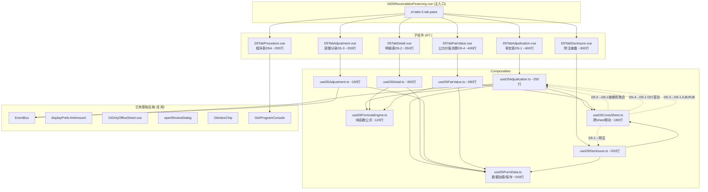
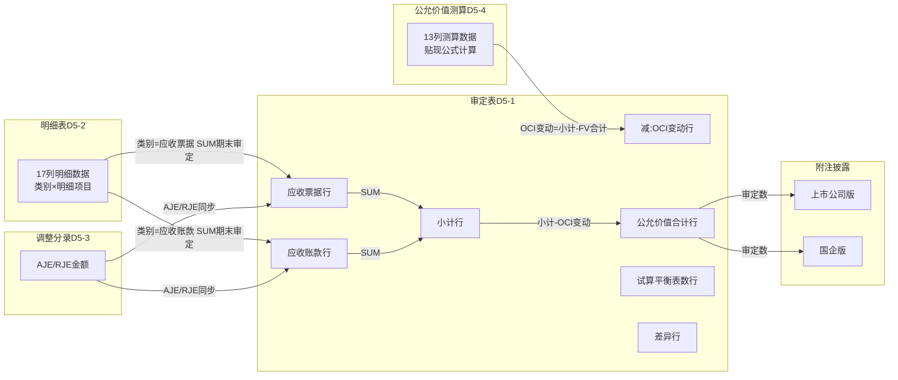

# Design Document: D5 应收款项融资底稿专属HTML精美组件

## Overview

将D5应收款项融资底稿从通用`univer`渲染升级为独立专属组件`d5-receivables-financing`。覆盖源模板7个有效sheet（程序表D5A + 审定表D5-1 + 明细表D5-2 + 调整分录D5-3 + 公允价值测算D5-4 + 附注上市 + 附注国企），合计145个公式。

核心设计目标：
- 新 componentType `d5-receivables-financing`，主入口 GtD5ReceivablesFinancing.vue（el-tabs 6个tab-pane）
- 每个sheet独立子组件（200-400行）+ 独立composable
- 共享纯函数公式引擎 useD5FormulaEngine.ts（核心贴现公式：票面×利率×天数/360）
- 跨sheet数据流通过 allResponses Map computed 响应式链（不走API）
- 5方EventBus联动 + GtIndexChip 11处交叉索引
- 双模式（HTML ↔ OnlyOffice）+ 导入导出三级 + AI审计说明

科目特征：1124借方科目/资产类/FVOCI。核心特色：公允价值测算（贴现公式）、审定表"减：OCI公允价值变动"特殊结构、来源交叉（D1票据业务模式+D2应收账款业务模式→归入D5的资产）、公允价值层次判定（第二/第三层次）。

## Architecture

### 组件依赖关系



### 文件结构

```
audit-platform/frontend/src/components/workpaper/
├── GtD5ReceivablesFinancing.vue              # 主入口 el-tabs（~150行）
├── d5/                                       # 新增目录
│   ├── D5TabProcedure.vue                   # 程序表D5A（~200行）
│   ├── D5TabAdjudication.vue                # 审定表D5-1（~400行）
│   ├── D5TabDetail.vue                      # 明细表D5-2（~350行）
│   ├── D5TabAdjustment.vue                  # 调整分录D5-3（~250行）
│   ├── D5TabFairValue.vue                   # 公允价值测算D5-4（~400行）
│   └── D5TabDisclosure.vue                  # 附注披露（~300行）
├── composables/
│   ├── useD5FormData.ts                     # 数据加载/保存基础（~200行）
│   ├── useD5FormulaEngine.ts                # 纯函数公式引擎（~120行）
│   ├── useD5CrossSheet.ts                   # 跨sheet联动computed（~180行）
│   ├── useD5Adjudication.ts                 # 审定表逻辑（~250行）
│   ├── useD5Detail.ts                       # 明细表逻辑（~300行）
│   ├── useD5Adjustment.ts                   # 调整分录逻辑（~150行）
│   ├── useD5FairValue.ts                    # 公允价值测算逻辑（~280行）
│   └── useD5Disclosure.ts                   # 附注披露逻辑（~200行）

backend/app/routers/wp_render_strategies/
│   ├── _d5_import_export.py                 # 导入导出端点（~200行）
│   ├── _d5_resolvers.py                     # Auto Data Resolver（~80行）
│   └── _d5_ai_generate.py                   # AI生成端点（~120行）
```

### 跨Sheet数据流



## Components and Interfaces

### 1. useD5FormulaEngine.ts — 纯函数公式引擎

```typescript
// D5核心：FVOCI金融资产公允价值测算（贴现法）

/** 安全数值解析：null/undefined/空串/NaN → 0 */
export function parseNum(val: string | number | null | undefined): number

/** 贴现利息 = 票面金额 × 市场贴现利率 × 剩余天数 ÷ 360 */
export function calcDiscountInterest(faceValue: number, rate: number, days: number): number

/** 公允价值 = 票面金额 - 贴现利息 */
export function calcFairValue(faceValue: number, discountInterest: number): number

/** 剩余天数 = 到期日 - 计量日（天数差） */
export function calcRemainingDays(measurementDate: string, maturityDate: string): number

/** 审定数 = 未审 + AJE + RJE */
export function calcAuditedAmount(unadjusted: number, aje: number, rje: number): number

/** 变动额 = 期末审定 - 期初审定 */
export function calcChangeAmount(prior: number, current: number): number

/** 变动率: 期初=0且期末=0→'' | 期初=0→'N/A' | 其他→(期末-期初)/期初 */
export function calcChangeRate(prior: number, current: number): number | '' | 'N/A'

/** 变动率绝对值是否超阈值 */
export function isChangeRateExceeding(rate: number | '' | 'N/A', threshold: number): boolean

/** 小计/合计 = SUM(明细行) */
export function calcSubtotal(values: number[]): number

/** 公允价值合计 = 小计 - OCI变动 */
export function calcFvTotal(subtotal: number, ociChange: number): number

/** 期初审定 = 期初未审 + AJE + RJE */
export function calcPriorAudited(unadjusted: number, aje: number, rje: number): number

/** 期末余额 = 期初审定 + 本期增加 - 本期减少 */
export function calcEndBalance(priorAudited: number, increase: number, decrease: number): number

/** 期末未审余额 = 期末余额 + 被审计单位重分类 */
export function calcEndUnadjusted(endBalance: number, entityReclass: number): number

/** 期末审定余额 = 期末未审 + 账项调整 + 重分类调整 */
export function calcEndAudited(endUnadjusted: number, aje: number, rje: number): number

/** 减值准备期末 = 上年末 + 本期计提 - 收回转回 - 核销 */
export function calcImpairmentEnd(
  priorEnd: number, provision: number, reversal: number, writeOff: number
): number
```

### 2. useD5FormData.ts — 基础数据加载/保存

```typescript
export interface UseD5FormDataOptions {
  wpId: Ref<string>
  projectId: Ref<string>
}

export function useD5FormData(options: UseD5FormDataOptions) {
  return {
    allResponses: Ref<Map<string, ChecklistResponse>>,
    isLoading: Ref<boolean>,
    loadAll: () => Promise<void>,
    saveImmediate: (itemId: string, data: Partial<ChecklistResponse>) => Promise<void>,
    saveBatch: (items: Array<{ itemId: string; data: Partial<ChecklistResponse> }>) => Promise<void>,
    debouncedSave: (itemId: string, data: Partial<ChecklistResponse>) => void, // 2s debounce
    writebackTrialBalance: (auditedAmount: number) => Promise<void>, // 科目1124回写
  }
}
```

### 3. useD5CrossSheet.ts — 跨Sheet联动

```typescript
export interface UseD5CrossSheetOptions {
  allResponses: Ref<Map<string, ChecklistResponse>>
}

export function useD5CrossSheet(options: UseD5CrossSheetOptions) {
  return {
    // D5-2 → D5-1 按类别聚合
    categoryAggregation: ComputedRef<{
      notesReceivable: { prior: number; current: number },
      accountsReceivable: { prior: number; current: number }
    }>,
    // D5-4 → D5-1 OCI变动
    ociChange: ComputedRef<{ prior: number; current: number }>,
    // D5-3 → D5-1 AJE/RJE
    adjustmentTotals: ComputedRef<{ ajeTotal: number; rjeTotal: number }>,
    // D5-1 → 附注
    adjudicationForDisclosure: ComputedRef<DisclosureSourceData>,
    // D5-4 公允价值合计
    fairValueTotal: ComputedRef<{ prior: number; current: number }>,
    // 状态
    crossSheetStatus: Ref<'loaded' | 'loading' | 'error'>,
  }
}
```

### 4. useD5Adjudication.ts — 审定表D5-1

```typescript
export interface AdjudicationRow {
  rowKey: string
  label: string
  priorUnadjusted: number
  priorAje: number
  priorRje: number
  priorAudited: number      // = 未审 + AJE + RJE
  currentUnadjusted: number
  currentAje: number
  currentRje: number
  currentAudited: number    // = 未审 + AJE + RJE
  changeAmount: number      // = 期末审定 - 期初审定
  changeRate: number | '' | 'N/A'
  isFromCrossSheet: boolean
  isEditable: boolean
}

// 固定行结构
const ADJUDICATION_ROWS = [
  { rowKey: 'notes-receivable', label: '应收票据' },
  { rowKey: 'accounts-receivable', label: '应收账款' },
  { rowKey: 'subtotal', label: '小计', isComputed: true },
  { rowKey: 'oci-change', label: '减：其他综合收益-公允价值变动', isFromFV: true },
  { rowKey: 'fv-total', label: '应收款项融资公允价值合计', isComputed: true },
  { rowKey: 'trial-balance', label: '试算平衡表数', isFromTB: true },
  { rowKey: 'difference', label: '差异数', isComputed: true },
]

export function useD5Adjudication(options: UseD5AdjudicationOptions) {
  return {
    rows: ComputedRef<AdjudicationRow[]>,
    trialBalanceAmount: Ref<number>,
    trialBalanceDiff: ComputedRef<number>,  // = 公允价值合计 - 试算表数
    auditNotes: Ref<{ explanation: string; conclusion: string }>,
    updateCell: (rowKey: string, field: string, value: number | string) => void,
    publishAdjudicated: () => void,
    onAdjustmentCreated: (payload: AdjustmentPayload) => void,
  }
}
```

### 5. useD5Detail.ts — 明细表D5-2

```typescript
export interface DetailRow {
  rowId: string
  category: string            // A: 类别（应收票据/应收账款）
  itemName: string            // B: 明细项目
  priorUnadjusted: number     // C: 期初未审
  priorAje: number            // D: 期初AJE
  priorRje: number            // E: 期初RJE
  priorAudited: number        // F: =C+D+E（自动）
  ociImpairment: number       // G: OCI减值准备余额
  periodIncrease: number      // H: 本期增加
  periodDecrease: number      // I: 本期减少
  endBalance: number          // J: =F+H-I（自动）
  entityReclass: number       // K: 被审计单位重分类
  endUnadjusted: number       // L: =J+K（自动）
  endAje: number              // M: 期末账项调整
  endRje: number              // N: 期末重分类调整
  endAudited: number          // O: =L+M+N（自动）
  endOciImpairment: number    // P: 期末OCI减值
  remark: string              // Q: 备注
}

export function useD5Detail(options: UseD5DetailOptions) {
  return {
    rows: Ref<DetailRow[]>,
    subtotalByCategory: ComputedRef<Record<string, DetailRow>>,  // 按类别小计
    totalRow: ComputedRef<DetailRow>,  // 总合计
    addRow: () => void,
    removeRow: (rowId: string) => void,
    updateCell: (rowId: string, field: string, value: any) => void,
    importFromD1: () => Promise<void>,   // 从D1导入出售模式票据
    importFromD2: () => Promise<void>,   // 从D2导入出售模式账款
    importFromAuxBalance: () => Promise<void>,  // 从余额表导入
  }
}
```

### 6. useD5FairValue.ts — 公允价值测算D5-4

```typescript
export interface FairValueRow {
  rowId: string
  category: string            // A: 类别（应收票据/应收账款）
  itemName: string            // B: 明细项目
  billNo: string              // C: 票据号
  faceValue: number           // D: 票面金额
  measurementDate: string     // E: 计量日（默认period_end）
  maturityDate: string        // F: 到期日
  remainingDays: number       // G: =F-E（自动）
  discountRate: number        // H: 市场贴现利率
  discountInterest: number    // I: =D×H×G÷360（自动）
  discountAmount: number      // J: =D-I（自动，即贴现金额）
  fairValue: number           // K: =J（自动，期末公允价值）
  fvHierarchy: string         // L: 公允价值层次（第二层次/第三层次）
  remark: string              // M: 备注
}

export interface UseD5FairValueOptions {
  allResponses: Ref<Map<string, ChecklistResponse>>
  wpId: Ref<string>
  projectId: Ref<string>
  saveImmediate: SaveFn
  debouncedSave: DebouncedSaveFn
  isReadonly: Ref<boolean>
  periodEnd: Ref<string>       // 资产负债表日
  defaultDiscountRate: Ref<number>  // 全表默认利率
}

export function useD5FairValue(options: UseD5FairValueOptions) {
  return {
    rows: Ref<FairValueRow[]>,
    totalRow: ComputedRef<{ faceValue: number; discountInterest: number; fairValue: number }>,
    ociDiffMessage: ComputedRef<string | null>,  // D5-4 FV合计 vs D5-2期末合计差异提示
    addRow: () => void,
    removeRow: (rowId: string) => void,
    updateCell: (rowId: string, field: string, value: any) => void,
    setDefaultRate: (rate: number) => void,  // 全表统一默认利率
    auditNotes: Ref<{ explanation: string; conclusion: string }>,
  }
}
```

### 7. useD5Adjustment.ts — 调整分录D5-3

```typescript
export interface AdjustmentRow {
  rowId: string
  description: string     // 调整事项说明
  category: string        // 类别（报表调整/账项调整/其他）
  reportItem: string      // 报表项目
  accountName: string     // 科目名称
  noteItem: string        // 附注项目
  placeholder: string     // …
  debitAmount: number     // 借方调整金额
  creditAmount: number    // 贷方调整金额
  indexRef: string        // 索引
  remark: string          // 备注
}

export function useD5Adjustment(options: UseD5BaseOptions) {
  return {
    rows: Ref<AdjustmentRow[]>,
    debitTotal: ComputedRef<number>,
    creditTotal: ComputedRef<number>,
    isBalanced: ComputedRef<boolean>,
    balanceDiff: ComputedRef<number>,
    addRow: () => void,
    removeRow: (rowId: string) => void,
    updateCell: (rowId: string, field: string, value: any) => void,
    publishAdjustment: (row: AdjustmentRow) => void,
    pushToA13: (rowIds: string[]) => void,
  }
}
```

### 8. useD5Disclosure.ts — 附注披露

```typescript
export interface DisclosureSection {
  sectionKey: string
  label: string
  rows: DisclosureRow[]
  totalRow?: DisclosureRow
}

export function useD5Disclosure(options: UseD5DisclosureOptions) {
  return {
    // 上市公司版
    listedSections: ComputedRef<DisclosureSection[]>,  // (1)分类+(2)减值变动+(3)说明
    // 国企版
    soeSections: ComputedRef<DisclosureSection[]>,      // (1)分类
    // 适用性
    showListed: ComputedRef<boolean>,
    showSoe: ComputedRef<boolean>,
    activeVariant: Ref<'listed' | 'soe'>,
    // 减值准备变动（上市公司版）
    impairmentRows: Ref<ImpairmentRow[]>,
    impairmentAddRow: () => void,
    impairmentRemoveRow: (rowId: string) => void,
    // 说明
    noteTexts: Ref<Record<string, string>>,
  }
}
```

### 9. 后端接口

```python
# _d5_import_export.py
# POST /api/workpapers/{wp_id}/d5/export-template?sheet=D5-2|D5-4
# POST /api/workpapers/{wp_id}/d5/export-data?sheet=D5-2|D5-4
# POST /api/workpapers/{wp_id}/d5/import-data?sheet=D5-2|D5-4
# POST /api/workpapers/{wp_id}/d5/import-aux-balance

# _d5_resolvers.py
# d5_tb_unadjusted: 从trial_balance科目1124取期初/期末未审数

# _d5_ai_generate.py
# POST /api/workpapers/{wp_id}/d5/ai-generate
# sections: adj-explanation | adj-conclusion | detail-change | fv-rate-analysis | fv-conclusion
```

## Data Models

### checklist_responses item_id 命名规范

| Sheet | 前缀 | 示例 |
|-------|------|------|
| D5-1 审定表 | `D5-1-adj-` | `D5-1-adj-{rowKey}-currentUnadjusted` |
| D5-1 审计说明 | `D5-1-note-` | `D5-1-note-explanation`, `D5-1-note-conclusion` |
| D5-2 明细表 | `D5-2-` | `D5-2-rows`（remark存JSON数组） |
| D5-3 调整分录 | `D5-3-` | `D5-3-rows`（remark存JSON数组） |
| D5-4 公允价值 | `D5-4-` | `D5-4-rows`（remark存JSON数组）, `D5-4-default-rate` |
| D5-4 审计说明 | `D5-4-note-` | `D5-4-note-explanation`, `D5-4-note-conclusion` |
| 附注上市 | `D5-note-listed-` | `D5-note-listed-impairment-rows`, `D5-note-listed-text-1` |
| 附注国企 | `D5-note-soe-` | `D5-note-soe-text-1` |

### 审定表D5-1 固定行结构（含OCI特殊减项）

```typescript
const ADJUDICATION_ROWS = [
  { rowKey: 'notes-receivable', label: '应收票据', isFromCrossSheet: true },
  { rowKey: 'accounts-receivable', label: '应收账款', isFromCrossSheet: true },
  { rowKey: 'subtotal', label: '小计', isComputed: true },
  { rowKey: 'oci-change', label: '减：其他综合收益-公允价值变动', isFromFV: true },
  { rowKey: 'fv-total', label: '应收款项融资公允价值合计', isComputed: true },
  { rowKey: 'trial-balance', label: '试算平衡表数', isFromTB: true },
  { rowKey: 'difference', label: '差异数', isComputed: true },
]

// 公式关系：
// 小计 = 应收票据审定 + 应收账款审定
// 公允价值合计 = 小计 - OCI公允价值变动
// 差异 = 公允价值合计 - 试算平衡表数
```

### 公允价值测算D5-4 贴现公式链

```typescript
// 核心公式（资产负债表日为计量日）：
// 剩余天数 = 到期日 - 计量日（天数）
// 贴现利息 = 票面金额 × 市场贴现利率 × 剩余天数 ÷ 360
// 公允价值 = 票面金额 - 贴现利息

// OCI变动推导：
// OCI公允价值变动 = D5-2期末审定合计（票面小计） - D5-4公允价值合计
```

### 跨Sheet数据映射

| D5-1目标 | 数据来源 | 路径 |
|----------|---------|------|
| 应收票据(期末审定) | D5-2 rows where category='应收票据' | SUM(endAudited) |
| 应收账款(期末审定) | D5-2 rows where category='应收账款' | SUM(endAudited) |
| 减:OCI公允价值变动(期末) | D5-4 + D5-2 | 小计 - D5-4.totalRow.fairValue |
| D5-1 AJE列 | D5-3 adjustmentTotals | ajeTotal |
| D5-1 RJE列 | D5-3 adjustmentTotals | rjeTotal |
| 附注(1)分类 | D5-1 rows | 直接引用审定数 |
| 附注(2)减值 | D5-2 ociImpairment列 | 期初/期末OCI减值 |

### EventBus事件清单

| 事件名 | 发布者 | 消费者 | Payload |
|--------|--------|--------|---------|
| `substantive:adjudicated` | D5-1 | TB回写 | `{ wpCode:'D5', accountCode:'1124', auditedAmount }` |
| `adjustment:created` | D5-3 | D5-1, A13 | `{ wpCode:'D5', entryType:'AJE'\|'RJE', amount, accountCode }` |
| `risk:updated` | B50 | D5A | `{ riskLevel, affectedAccounts }` |
| `disclosure:note-text-updated` | 附注 | 附注模块 | `{ wpCode:'D5', section, text }` |

## Correctness Properties

*A property is a characteristic or behavior that should hold true across all valid executions of a system—essentially, a formal statement about what the system should do. Properties serve as the bridge between human-readable specifications and machine-verifiable correctness guarantees.*

### Property 1: 贴现利息公式正确性

*For any* 票面金额(face≥0)、市场贴现利率(rate∈[0,1])和剩余天数(days≥0)，`calcDiscountInterest(face, rate, days)` 的返回值应等于 `face × rate × days / 360`。

**Validates: Requirements 1.4, 6.2**

### Property 2: 公允价值 = 票面 - 贴现利息

*For any* 票面金额(face≥0)和贴现利息(interest≥0 且 interest≤face)，`calcFairValue(face, interest)` 的返回值应等于 `face - interest`。

**Validates: Requirements 1.4, 6.2**

### Property 3: 审定数 = 未审 + AJE + RJE

*For any* 三元组 (未审数, AJE净额, RJE净额)，其中各值为有限数值，`calcAuditedAmount` 的返回值应等于 `未审数 + AJE + RJE`。

**Validates: Requirements 1.4, 2.3**

### Property 4: 公允价值合计 = 小计 - OCI变动

*For any* (小计, OCI变动) 对，`calcFvTotal(subtotal, ociChange)` 应等于 `subtotal - ociChange`。此为D5审定表特殊结构的核心公式。

**Validates: Requirements 2.4, 3.2**

### Property 5: 跨sheet按类别聚合正确性

*For any* 明细表D5-2行数据集，按"类别"列(应收票据/应收账款)分组后，每组的endAudited之和应等于审定表D5-1对应行的期末审定值。即 `SUM(rows.filter(r => r.category === cat).map(r => r.endAudited))` 等于审定表对应行值。

**Validates: Requirements 3.1, 4.4**

### Property 6: 合计行 = SUM(明细行)

*For any* 数值数组（明细行的某个金额列），`calcSubtotal(values)` 应等于 `values.reduce((a,b) => a+b, 0)`。适用于D5-1小计/D5-2合计/D5-4合计所有合计行。

**Validates: Requirements 2.4, 4.4, 6.5**

### Property 7: 动态行添加保持结构不变量

*For any* 当前行列表（长度N≥0），执行addRow()后行列表长度应为N+1，新行所有数值字段为0/空串，新行位于合计行之前。适用于D5-2/D5-3/D5-4所有动态行表格。

**Validates: Requirements 4.5, 6.6, 7.2**

### Property 8: 调整分录借贷平衡检查

*For any* 调整分录行列表，`isBalanced` 应为 true 当且仅当所有行debitAmount之和等于所有行creditAmount之和。

**Validates: Requirements 7.3**

### Property 9: 变动率阈值高亮判定

*For any* 变动率数值 r（有限数值），`isChangeRateExceeding(r, 0.3)` 应返回 true 当且仅当 `|r| > 0.3`。对于空串或'N/A'应返回false。

**Validates: Requirements 2.7**

### Property 10: D5-2行内公式链正确性

*For any* 明细行输入值组合 (C,D,E,H,I,K,M,N)，以下公式链必须成立：
- 期初审定 F = C + D + E
- 期末余额 J = F + H - I
- 期末未审余额 L = J + K
- 期末审定余额 O = L + M + N

**Validates: Requirements 4.3**

### Property 11: 导入导出Round-Trip

*For any* 有效的D5-2或D5-4动态行JSON数组，导出为xlsx再导入解析后，应产生等价的行数据（各数值字段相等、字符串字段相等）。

**Validates: Requirements 5.5, 12.6**

## Error Handling

| 场景 | 处理方式 |
|------|---------|
| 跨sheet数据加载失败（allResponses中key不存在） | 显示"-"占位符 + 黄色三角警告图标 |
| checklist_responses API失败 | ElMessage.warning；保留本地已有数据 |
| 导入xlsx格式不匹配 | 返回400 + 错误列名列表；前端ElMessage.error |
| parseNum遇到NaN/Infinity | 统一返回0（安全降级） |
| OnlyOffice健康检查失败 | 禁用"在线编辑"选项 + tooltip |
| EventBus事件publish失败 | console.warn不阻塞主流程 |
| 动态行JSON解析失败（remark损坏） | 回退空数组 + ElMessage.warning |
| writebackTrialBalance失败 | ElMessage.warning提示手动确认 |
| D1/D2导入无数据 | ElMessage.info"未找到出售模式资产" |
| AI生成接口超时/失败 | ElMessage.warning + 不阻塞手动编辑 |
| 贴现利率为0或负数 | calcDiscountInterest返回0 + 单元格黄色警告 |
| 到期日早于计量日 | remainingDays=0 + 单元格红色警告 |

## Testing Strategy

### 单元测试（vitest）

- useD5FormulaEngine.ts 全部纯函数：边界值、零值、负数、NaN/Infinity、日期差计算
- 贴现公式特殊场景：利率为0、天数为0、票面为0、到期日=计量日
- 各composable的computed逻辑：初始状态、添加/删除行后状态、跨sheet数据变更触发
- 跨sheet数据映射：D5-2→D5-1聚合（按类别）、D5-4→D5-1 OCI变动
- EventBus事件payload结构验证
- 借贷平衡验证
- 公允价值层次下拉选项
- 金额格式化：千分位、负数红色括号、零值"-"

### Property-Based Tests（fast-check）

每个correctness property对应一个PBT测试，最少100次迭代。

库选择：**fast-check**（项目已有，前端PBT标准选择）

标签格式：`Feature: d5-receivables-financing, Property {N}: {title}`

| Property | 测试文件 | 生成器 |
|----------|---------|--------|
| P1 贴现利息 | `useD5FormulaEngine.spec.ts` | `fc.float({min:0, max:1e9})` × face, `fc.float({min:0, max:1})` × rate, `fc.integer({min:0, max:365})` × days |
| P2 公允价值 | `useD5FormulaEngine.spec.ts` | `fc.float({min:0, max:1e9})` × face, `fc.float({min:0, max:face})` × interest |
| P3 审定数 | `useD5FormulaEngine.spec.ts` | `fc.float({min:-1e9, max:1e9})` × 3 |
| P4 FV合计 | `useD5FormulaEngine.spec.ts` | `fc.float({min:-1e9, max:1e9})` × 2 |
| P5 按类别聚合 | `useD5CrossSheet.spec.ts` | 自定义 DetailRow[] 生成器 + category随机 |
| P6 合计行 | `useD5FormulaEngine.spec.ts` | `fc.array(fc.float({min:-1e9, max:1e9}), {minLength:1, maxLength:30})` |
| P7 动态行添加 | `useD5Detail.spec.ts` | `fc.array(DetailRow生成器, {minLength:0, maxLength:20})` |
| P8 借贷平衡 | `useD5Adjustment.spec.ts` | `fc.array(fc.record({debit:fc.float({min:0,max:1e9}), credit:fc.float({min:0,max:1e9})}))` |
| P9 阈值判定 | `useD5FormulaEngine.spec.ts` | `fc.float({min:-10, max:10})` |
| P10 D5-2公式链 | `useD5Detail.spec.ts` | `fc.float({min:-1e9, max:1e9})` × 8 |
| P11 Round-trip | `d5ImportExport.spec.ts` (hypothesis) | 自定义行数据生成器 |

### 后端集成测试（hypothesis）

- 导入导出round-trip：生成随机行数据→export→import→验证等价
- tb_aux_balance导入：验证科目1124按明细聚合正确
- 模板格式校验：随机列名排列→验证错误检测

### 注册与契约测试

- htmlRendererRegistry.spec.ts：验证'd5-receivables-financing'已注册
- VALID_COMPONENT_TYPES契约：验证后端允许'd5-receivables-financing'
- wp_code_overrides契约：验证D5/D5-1/D5-2/D5-3/D5-4映射到'd5-receivables-financing'
- RENDERER_DISPATCH契约：验证'd5-receivables-financing'策略已注册
- account_package_registry契约：验证D5工作包含7个有效sheet

### 测试配置

```typescript
// fast-check 配置
fc.assert(fc.property(...), { numRuns: 100 })

// 标签示例
// Feature: d5-receivables-financing, Property 1: 贴现利息公式正确性
```
