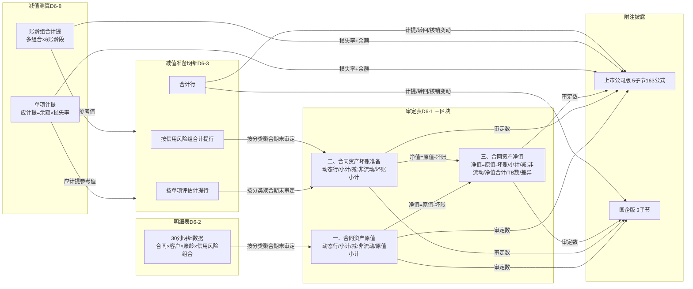
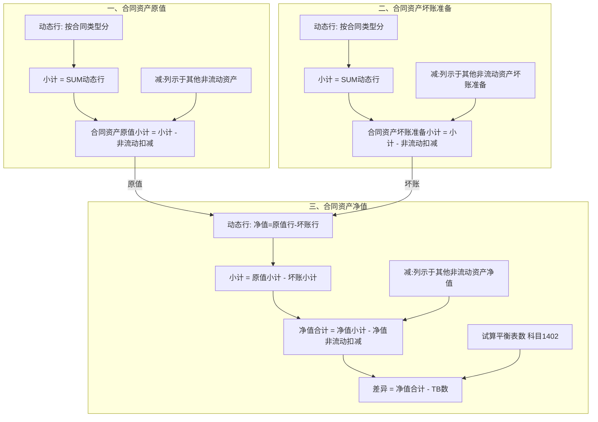

# Design Document: D6 合同资产底稿专属HTML精美组件

## Overview

将D6合同资产底稿从通用`univer`渲染升级为独立专属组件`d6-contract-assets`。覆盖源模板12个有效sheet（程序表D6A + 审定表D6-1 + 明细表D6-2 + 减值准备明细D6-3 + 调整分录D6-4 + 关联方检查D6-5 + 检查表D6-6 + 减值政策D6-7 + 减值测算D6-8 + 转回核销D6-9 + 附注上市 + 附注国企），合计约649个公式。

核心设计目标：
- 新 componentType `d6-contract-assets`，主入口 GtD6ContractAssets.vue（el-tabs 11个tab-pane）
- 每个sheet独立子组件（200-400行）+ 独立composable
- 共享纯函数公式引擎 useD6FormulaEngine.ts（借方科目：期末=期初+借方-贷方；净值=原值-坏账准备；应计提=余额×损失率）
- 三区块审定表结构（一、原值/二、坏账准备/三、净值），各含"减：列示于其他非流动资产"+XX小计
- 跨sheet数据流通过 allResponses Map computed 响应式链（不走API）
- ECL双组合减值测算（单项计提+账龄组合×多组合）→ D6-3 → D6-1联动链
- 30列明细表（平台最宽）+ 14列减值准备明细（双分类行）
- 段落式会计政策检查D6-7（非表格，4节描述+同行业对比）
- 163公式附注上市（5子节含按组合分组明细）
- 双模式（HTML ↔ OnlyOffice）+ 导入导出三级 + AI审计说明

科目特征：1402借方科目/资产类。核心特色：三区块审定表净值=原值-坏账跨区块联动、ECL双组合测算、30列最宽明细表、段落式政策检查、163公式最复杂附注。D循环中第二复杂底稿（仅次于D4营业收入）。

## Architecture

### 组件依赖关系

```mermaid
graph TD
    subgraph "GtD6ContractAssets.vue (主入口)"
        MAIN[el-tabs 11 tab-pane]
    end

    subgraph "子组件 (11个)"
        PROC[D6TabProcedure.vue<br/>程序表D6A ~200行]
        ADJ[D6TabAdjudication.vue<br/>审定表D6-1 ~400行]
        DET[D6TabDetail.vue<br/>明细表D6-2 ~400行]
        IMP[D6TabImpairmentDetail.vue<br/>减值准备明细D6-3 ~350行]
        AJE[D6TabAdjustment.vue<br/>调整分录D6-4 ~250行]
        REL[D6TabRelatedParty.vue<br/>关联方检查D6-5 ~300行]
        INS[D6TabInspection.vue<br/>检查表D6-6 ~350行]
        POL[D6TabPolicyCheck.vue<br/>减值政策D6-7 ~300行]
        ECL[D6TabEclCalculation.vue<br/>减值测算D6-8 ~400行]
        WRI[D6TabWriteoffCheck.vue<br/>转回核销D6-9 ~300行]
        DISC[D6TabDisclosure.vue<br/>附注披露 ~400行]
    end

    subgraph "Composables (11个)"
        USE_DATA[useD6FormData.ts<br/>数据加载/保存 ~200行]
        USE_FORMULA[useD6FormulaEngine.ts<br/>纯函数公式引擎 ~180行]
        USE_CROSS[useD6CrossSheet.ts<br/>跨sheet联动 ~250行]
        USE_ADJ[useD6Adjudication.ts ~350行]
        USE_DET[useD6Detail.ts ~350行]
        USE_IMP[useD6ImpairmentDetail.ts ~250行]
        USE_AJE[useD6Adjustment.ts ~150行]
        USE_REL[useD6RelatedParty.ts ~200行]
        USE_ECL[useD6EclCalculation.ts ~300行]
        USE_INS[useD6Inspection.ts ~200行]
        USE_DISC[useD6Disclosure.ts ~300行]
    end

    subgraph "已有基础设施 (复用)"
        EVENT_BUS[EventBus]
        DISPLAY[displayPrefs.fmtAmount]
        OO[GtOnlyOfficeSheet.vue]
        REVIEW[openReviewDialog]
        INDEX_CHIP[GtIndexChip]
        PROGRAM[GtAProgramConsole]
    end

    MAIN --> PROC & ADJ & DET & IMP & AJE & REL & INS & POL & ECL & WRI & DISC

    PROC --> PROGRAM
    ADJ --> USE_ADJ --> USE_FORMULA & USE_DATA & USE_CROSS & EVENT_BUS
    DET --> USE_DET --> USE_FORMULA & USE_DATA
    IMP --> USE_IMP --> USE_FORMULA & USE_DATA & USE_CROSS
    AJE --> USE_AJE --> USE_DATA & EVENT_BUS
    REL --> USE_REL --> USE_DATA & USE_DET
    INS --> USE_INS --> USE_DATA & USE_DET
    ECL --> USE_ECL --> USE_FORMULA & USE_DATA & USE_CROSS
    POL --> USE_DATA
    WRI --> USE_DATA
    DISC --> USE_DISC --> USE_DATA & USE_CROSS

    USE_CROSS -.->|D6-2→D6-1原值聚合| USE_ADJ
    USE_CROSS -.->|D6-3→D6-1坏账聚合| USE_ADJ
    USE_CROSS -.->|净值=原值-坏账| USE_ADJ
    USE_CROSS -.->|D6-8→D6-3参考值| USE_IMP
    USE_CROSS -.->|D6-1→附注| USE_DISC
    USE_CROSS -.->|D6-8→附注| USE_DISC
```



### 文件结构

```
audit-platform/frontend/src/components/workpaper/
├── GtD6ContractAssets.vue                   # 主入口 el-tabs（~150行）
├── d6/                                      # 新增目录
│   ├── D6TabProcedure.vue                  # 程序表D6A（~200行）
│   ├── D6TabAdjudication.vue               # 审定表D6-1（~400行）
│   ├── D6TabDetail.vue                     # 明细表D6-2（~400行）
│   ├── D6TabImpairmentDetail.vue           # 减值准备明细D6-3（~350行）
│   ├── D6TabAdjustment.vue                 # 调整分录D6-4（~250行）
│   ├── D6TabRelatedParty.vue              # 关联方检查D6-5（~300行）
│   ├── D6TabInspection.vue                 # 检查表D6-6（~350行）
│   ├── D6TabPolicyCheck.vue                # 减值政策D6-7（~300行）
│   ├── D6TabEclCalculation.vue             # 减值测算D6-8（~400行）
│   ├── D6TabWriteoffCheck.vue              # 转回核销D6-9（~300行）
│   └── D6TabDisclosure.vue                 # 附注披露（~400行）
├── composables/
│   ├── useD6FormData.ts                    # 数据加载/保存基础（~200行）
│   ├── useD6FormulaEngine.ts               # 纯函数公式引擎（~180行）
│   ├── useD6CrossSheet.ts                  # 跨sheet联动computed（~250行）
│   ├── useD6Adjudication.ts                # 审定表三区块逻辑（~350行）
│   ├── useD6Detail.ts                      # 明细表30列逻辑（~350行）
│   ├── useD6ImpairmentDetail.ts            # 减值准备明细逻辑（~250行）
│   ├── useD6Adjustment.ts                  # 调整分录逻辑（~150行）
│   ├── useD6RelatedParty.ts                # 关联方检查逻辑（~200行）
│   ├── useD6EclCalculation.ts              # ECL测算逻辑（~300行）
│   ├── useD6Inspection.ts                  # 检查表逻辑（~200行）
│   └── useD6Disclosure.ts                  # 附注披露逻辑（~300行）

backend/app/routers/wp_render_strategies/
│   ├── _d6_import_export.py                # 导入导出端点（~250行）
│   ├── _d6_resolvers.py                    # Auto Data Resolver（~100行）
│   ├── _d6_ai_generate.py                  # AI生成端点（~150行）
│   └── _d6_contract_assets.py              # Render策略函数（~120行）
```

### 跨Sheet数据流（ECL→D6-3→D6-1联动链）



### 三区块审定表内部结构



## Components and Interfaces

### 1. useD6FormulaEngine.ts — 纯函数公式引擎

```typescript
// D6核心：借方科目/资产类/合同资产（科目1402）
// 核心公式：期末=期初+借方-贷方；审定数=未审+AJE+RJE；净值=原值-坏账；应计提=余额×损失率

/** 安全数值解析：null/undefined/空串/NaN/Infinity → 0 */
export function parseNum(val: string | number | null | undefined): number

/** 审定数 = 未审 + AJE + RJE */
export function calcAuditedAmount(unadjusted: number, aje: number, rje: number): number

/** 借方科目期末未审 = 期初审定 + 借方发生 - 贷方发生 */
export function calcEndUnadjustedDebit(priorAudited: number, debit: number, credit: number): number

/** 期末审定 = 期末未审 + 账项调整 + 重分类调整 */
export function calcEndAudited(endUnadjusted: number, aje: number, rje: number): number

/** 净值 = 原值 - 坏账准备（跨区块公式） */
export function calcNetValue(originalValue: number, impairment: number): number

/** ECL应计提 = 审定余额 × 预期信用损失率 */
export function calcExpectedProvision(balance: number, lossRate: number): number

/** ECL差异 = 应计提 - 账面余额 */
export function calcEclDifference(expectedProvision: number, bookBalance: number): number

/** 变动额 = 期末审定 - 期初审定 */
export function calcChangeAmount(prior: number, current: number): number

/** 变动率: 期初=0且期末=0→'' | 期初=0→'N/A' | 其他→(期末-期初)/期初 */
export function calcChangeRate(prior: number, current: number): number | '' | 'N/A'

/** 变动率绝对值是否超阈值 */
export function isChangeRateExceeding(rate: number | '' | 'N/A', threshold: number): boolean

/** 小计/合计 = SUM(明细行) */
export function calcSubtotal(values: number[]): number

/** XX小计 = 小计 - "减：列示于其他非流动资产"扣减值 */
export function calcBlockTotal(subtotal: number, nonCurrentDeduction: number): number

/** 减值准备期末未审 = 期初审定 + 计提 + 其他增加 - 转回 - 核销 - 其他减少 */
export function calcImpairmentEndUnadjusted(
  priorAudited: number, provision: number, otherIncrease: number,
  reversal: number, writeOff: number, otherDecrease: number
): number

/** 关联方期末余额 = 期初余额 + 借方发生 - 贷方发生（借方科目） */
export function calcRelatedPartyEndBalance(priorBalance: number, debit: number, credit: number): number

/** 账面价值 = 期末余额 - 坏账准备 */
export function calcBookValue(endBalance: number, impairment: number): number

/** 比例% = 该类别金额 / 合计金额 × 100 */
export function calcPercentage(amount: number, total: number): number
```

### 2. useD6FormData.ts — 基础数据加载/保存

```typescript
export interface UseD6FormDataOptions {
  wpId: Ref<string>
  projectId: Ref<string>
}

export function useD6FormData(options: UseD6FormDataOptions) {
  return {
    allResponses: Ref<Map<string, ChecklistResponse>>,
    isLoading: Ref<boolean>,
    loadAll: () => Promise<void>,
    saveImmediate: (itemId: string, data: Partial<ChecklistResponse>) => Promise<void>,
    saveBatch: (items: Array<{ itemId: string; data: Partial<ChecklistResponse> }>) => Promise<void>,
    debouncedSave: (itemId: string, data: Partial<ChecklistResponse>) => void, // 2s debounce
    writebackTrialBalance: (auditedAmount: number) => Promise<void>, // 科目1402回写
  }
}
```

### 3. useD6CrossSheet.ts — 跨Sheet联动

```typescript
export interface UseD6CrossSheetOptions {
  allResponses: Ref<Map<string, ChecklistResponse>>
}

export function useD6CrossSheet(options: UseD6CrossSheetOptions) {
  return {
    // D6-2 → D6-1 按分类聚合原值
    originalValueAggregation: ComputedRef<Record<string, { prior: number; current: number }>>,
    // D6-3 → D6-1 按分类聚合坏账准备
    impairmentAggregation: ComputedRef<Record<string, { prior: number; current: number }>>,
    // D6-1 三区块小计（原值/坏账/净值）
    blockTotals: ComputedRef<{
      block1: { subtotal: number; deduction: number; total: number },
      block2: { subtotal: number; deduction: number; total: number },
      block3: { subtotal: number; deduction: number; total: number }
    }>,
    // 净值=原值-坏账（逐行+小计+非流动+合计）
    netValueRows: ComputedRef<Array<{ rowKey: string; prior: number; current: number }>>,
    // D6-8 → D6-3 ECL应计提参考值
    eclReferenceValues: ComputedRef<{ single: number; groups: Record<string, number>; total: number }>,
    // D6-4 → D6-1 AJE/RJE
    adjustmentTotals: ComputedRef<{ ajeTotal: number; rjeTotal: number }>,
    // D6-1 → 附注
    adjudicationForDisclosure: ComputedRef<DisclosureSourceData>,
    // D6-8 → 附注
    eclForDisclosure: ComputedRef<EclDisclosureData>,
    // D6-3 → 附注（计提/转回/核销变动）
    impairmentChangesForDisclosure: ComputedRef<ImpairmentChangeData>,
    // 三区块交叉验证
    netValueValidation: ComputedRef<{ isValid: boolean; diff: number }>,
    // 状态
    crossSheetStatus: Ref<'loaded' | 'loading' | 'error'>,
  }
}
```

### 4. useD6Adjudication.ts — 审定表D6-1（三区块）

```typescript
export interface AdjudicationBlock {
  blockKey: 'block1' | 'block2' | 'block3'
  blockTitle: string  // "一、合同资产原值" / "二、合同资产坏账准备" / "三、合同资产净值"
  rows: AdjudicationRow[]
  subtotalRow: AdjudicationRow      // 小计
  deductionRow: AdjudicationRow     // 减：列示于其他非流动资产
  blockTotalRow: AdjudicationRow    // XX小计 = 小计 - 非流动扣减
}

export interface AdjudicationRow {
  rowKey: string
  label: string
  priorUnadjusted: number
  priorAje: number
  priorRje: number
  priorAudited: number         // = 未审 + AJE + RJE
  currentUnadjusted: number
  currentAje: number
  currentRje: number
  currentAudited: number       // = 未审 + AJE + RJE
  changeAmount: number         // = 期末审定 - 期初审定
  changeRate: number | '' | 'N/A'
  reasonAnalysis: string       // 原因分析
  isFromCrossSheet: boolean
  isEditable: boolean
  isDeduction: boolean         // 是否"减：列示于其他非流动资产"行
  rowType: 'dynamic' | 'subtotal' | 'deduction' | 'block_total' | 'tb' | 'diff'
}

// 三区块固定结构
const ADJUDICATION_BLOCKS = [
  {
    blockKey: 'block1',
    blockTitle: '一、合同资产原值',
    rows: [/* 动态行：从D6-2按分类聚合 */],
    subtotalLabel: '小计',
    deductionLabel: '减：列示于其他非流动资产的合同资产',
    totalLabel: '合同资产原值小计',
  },
  {
    blockKey: 'block2',
    blockTitle: '二、合同资产坏账准备',
    rows: [/* 动态行：从D6-3按分类聚合 */],
    subtotalLabel: '小计',
    deductionLabel: '减：列示于其他非流动资产的合同资产坏账准备',
    totalLabel: '合同资产坏账准备小计',
  },
  {
    blockKey: 'block3',
    blockTitle: '三、合同资产净值',
    rows: [/* 动态行：净值=原值对应行-坏账对应行 */],
    subtotalLabel: '小计',
    deductionLabel: '减：列示于其他非流动资产的合同资产净值',
    totalLabel: '合同资产净值合计',
    extraRows: ['试算平衡表数', '差异数'],
  },
]

// 公式关系：
// 每区块：小计 = SUM(动态行)
// 每区块：XX小计 = 小计 - "减：列示于其他非流动资产"
// 区块三：净值各行 = 原值对应行 - 坏账对应行（跨区块联动）
// 差异 = 净值合计 - 试算平衡表数

export function useD6Adjudication(options: UseD6AdjudicationOptions) {
  return {
    blocks: ComputedRef<AdjudicationBlock[]>,
    trialBalanceAmount: Ref<number>,
    trialBalanceDiff: ComputedRef<number>,     // = 净值合计 - TB数
    netValueValidation: ComputedRef<{ isValid: boolean; diff: number }>,  // 净值小计=原值小计-坏账小计
    auditNotes: Ref<{ explanation: string; impairmentEval: string; longTermReason: string; conclusion: string }>,
    updateCell: (blockKey: string, rowKey: string, field: string, value: number | string) => void,
    addDynamicRow: (blockKey: string) => void,
    removeDynamicRow: (blockKey: string, rowKey: string) => void,
    publishAdjudicated: () => void,
    onAdjustmentCreated: (payload: AdjustmentPayload) => void,
  }
}
```

### 5. useD6Detail.ts — 明细表D6-2（30列）

```typescript
export interface DetailRow {
  rowId: string
  seqNo: number                    // 1: 序号
  contractName: string             // 2: 合同名称/项目名称
  contractType: string             // 3: 类型（工程施工/质量保证金/其他）
  customerName: string             // 4: 客户名称
  companyCode: string              // 5: 公司代码
  relatedPartyType: string         // 6: 关联关系
  priorUnadjusted: number          // 7: 期初未审数
  priorAje: number                 // 8: 期初账项调整
  priorRje: number                 // 9: 期初重分类调整
  priorAudited: number             // 10: 期初审定余额 = 7+8+9（自动）
  agePrior1y: number               // 11: 期初账龄-1年以下
  agePrior1to2y: number            // 12: 期初账龄-1~2年
  agePrior2to3y: number            // 13: 期初账龄-2~3年
  agePrior3yAbove: number          // 14: 期初账龄-3年以上
  debitAmount: number              // 15: 借方发生
  creditAmount: number             // 16: 贷方发生
  endUnadjusted: number            // 17: 期末未审余额 = 10+15-16（借方科目！自动）
  endAje: number                   // 18: 账项调整
  endRje: number                   // 19: 重分类调整
  endAudited: number               // 20: 期末审定余额 = 17+18+19（自动）
  ageEnd1y: number                 // 21: 期末账龄-1年以下
  ageEnd1to2y: number              // 22: 期末账龄-1~2年
  ageEnd2to3y: number              // 23: 期末账龄-2~3年
  ageEnd3yAbove: number            // 24: 期末账龄-3年以上
  receivableWithin1y: number       // 25: 1年以内收款权
  receivableAbove1y: number        // 26: 1年以上收款权
  isInConstructionPeriod: string   // 27: 是否在建设期或质保期内（是/否）
  creditRiskGroup: string          // 28: 信用风险组合方式
  isConfirmed: string              // 29: 是否函证
  postPeriodSettlement: number     // 30: 期后结转金额
}

export function useD6Detail(options: UseD6DetailOptions) {
  return {
    rows: Ref<DetailRow[]>,
    subtotalByType: ComputedRef<Record<string, DetailRow>>,         // 按合同类型小计
    classificationRows: ComputedRef<ClassificationSummary[]>,       // 附加分类行
    totalRow: ComputedRef<DetailRow>,                               // 总合计
    addRow: () => void,
    removeRow: (rowId: string) => void,
    updateCell: (rowId: string, field: string, value: any) => void,
    importFromAuxBalance: () => Promise<void>,                      // 从tb_aux_balance科目1402导入
    searchFilter: Ref<string>,                                      // 模糊搜索
    filteredRows: ComputedRef<DetailRow[]>,
  }
}
```

### 6. useD6ImpairmentDetail.ts — 减值准备明细D6-3（14列）

```typescript
export interface ImpairmentDetailRow {
  rowId: string
  itemName: string                 // 项目
  category: 'single' | 'group'    // 分类：按单项/按组合
  priorUnadjusted: number          // 期初未审余额
  priorAje: number                 // 期初账项调整
  priorRje: number                 // 期初重分类调整
  priorAudited: number             // 期初审定余额 = 未审+AJE+RJE（自动）
  provision: number                // 本期增加-计提
  otherIncrease: number            // 本期增加-其他增加
  reversal: number                 // 本期减少-转回
  writeOff: number                 // 本期减少-核销
  otherDecrease: number            // 本期减少-其他减少
  endUnadjusted: number            // 期末未审 = 期初审定+计提+其他增加-转回-核销-其他减少（自动）
  endAje: number                   // 期末账项调整
  endRje: number                   // 期末重分类调整
  endAudited: number               // 期末审定 = 期末未审+AJE+RJE（自动）
}

export function useD6ImpairmentDetail(options: UseD6ImpairmentDetailOptions) {
  return {
    singleRows: Ref<ImpairmentDetailRow[]>,         // 按单项评估计提
    groupRows: Ref<ImpairmentDetailRow[]>,           // 按信用风险组合计提
    singleSubtotal: ComputedRef<ImpairmentDetailRow>,
    groupSubtotal: ComputedRef<ImpairmentDetailRow>,
    totalRow: ComputedRef<ImpairmentDetailRow>,      // = 单项小计 + 组合小计
    reconciliation: ComputedRef<{ d63Total: number; d61Total: number; diff: number }>,  // 核对行
    addRow: (category: 'single' | 'group') => void,
    removeRow: (rowId: string) => void,
    updateCell: (rowId: string, field: string, value: any) => void,
    auditNotes: Ref<{ explanation: string; conclusion: string }>,
  }
}
```

### 7. useD6Adjustment.ts — 调整分录D6-4

```typescript
export interface AdjustmentRow {
  rowId: string
  description: string         // 调整事项说明
  category: string            // 类别（报表调整/账项调整/其他）
  reportItem: string          // 报表项目
  accountName: string         // 科目名称
  noteItem: string            // 附注项目
  placeholder: string         // …
  debitAmount: number         // 借方调整金额
  creditAmount: number        // 贷方调整金额
  indexRef: string            // 索引
  remark: string              // 备注
}

export function useD6Adjustment(options: UseD6BaseOptions) {
  return {
    rows: Ref<AdjustmentRow[]>,
    debitTotal: ComputedRef<number>,
    creditTotal: ComputedRef<number>,
    isBalanced: ComputedRef<boolean>,
    balanceDiff: ComputedRef<number>,
    addRow: () => void,
    removeRow: (rowId: string) => void,
    updateCell: (rowId: string, field: string, value: any) => void,
    publishAdjustment: (row: AdjustmentRow) => void,
    pushToA13: (rowIds: string[]) => void,
  }
}
```

### 8. useD6RelatedParty.ts — 关联方检查D6-5

```typescript
export interface RelatedPartyRow {
  rowId: string
  partyName: string            // 关联方名称
  relationship: string         // 关联关系
  priorBalance: number         // 期初余额
  debitAmount: number          // 借方发生
  creditAmount: number         // 贷方发生
  endBalance: number           // 期末余额 = 期初+借方-贷方（借方科目，自动）
  impairment: number           // 坏账准备
  bookValue: number            // 账面价值 = 期末余额-坏账准备（自动）
  agingAndTiming: string       // 发生时间及账龄
  unsettledReason: string      // 未结转或未偿还的原因
  postSettlement: number       // 至审计日结转或偿还金额
  plan: string                 // 处理计划
  indexRef: string             // 索引号
  remark: string               // 备注
}

export function useD6RelatedParty(options: UseD6RelatedPartyOptions) {
  return {
    rows: Ref<RelatedPartyRow[]>,
    totalRow: ComputedRef<RelatedPartyTotalRow>,
    addRow: () => void,
    removeRow: (rowId: string) => void,
    updateCell: (rowId: string, field: string, value: any) => void,
    importFromDetail: () => void,    // 从D6-2筛选关联方≠非关联方导入
    auditNotes: Ref<{ explanation: string; conclusion: string }>,
  }
}
```

### 9. useD6EclCalculation.ts — 减值测算D6-8（ECL双组合）

```typescript
export interface EclSingleRow {
  rowId: string
  debtorName: string           // 债务人名称
  auditedBalance: number       // 审定账面余额①
  lossRate: number             // 预期信用损失率②
  expectedProvision: number    // 期末应计提③ = ①×②（自动）
  bookBalance: number          // 期末坏账准备账面余额④
  difference: number           // 差异⑤ = ③-④（自动）
  basis: string                // 计提依据及文件
  indexRef: string             // 索引号
}

export interface EclAgingGroup {
  groupId: string
  groupName: string            // 组合名称（如"业务类型组合"/"客户类型组合"）
  rows: EclAgingRow[]          // 固定6账龄段 + 小计
}

export interface EclAgingRow {
  rowId: string
  agingBand: string            // 账龄段（1年以内/1-2年/2-3年/3-4年/4-5年/5年以上）
  auditedBalance: number       // 审定账面余额①
  lossRate: number             // 预期信用损失率②
  expectedProvision: number    // 期末应计提③ = ①×②（自动）
  bookBalance: number          // 期末坏账准备账面余额④
  difference: number           // 差异⑤ = ③-④（自动）
}

export function useD6EclCalculation(options: UseD6EclOptions) {
  return {
    // 单项计提
    singleRows: Ref<EclSingleRow[]>,
    singleTotal: ComputedRef<{ balance: number; provision: number; book: number; diff: number }>,
    addSingleRow: () => void,
    removeSingleRow: (rowId: string) => void,
    // 账龄组合
    agingGroups: Ref<EclAgingGroup[]>,
    addAgingGroup: () => void,
    removeAgingGroup: (groupId: string) => void,
    // 合计
    grandTotal: ComputedRef<{ expectedProvision: number; bookBalance: number; totalDiff: number }>,
    diffAlert: ComputedRef<string | null>,   // 总差异不为零时的提示文案
    // 编辑
    updateSingleCell: (rowId: string, field: string, value: any) => void,
    updateAgingCell: (groupId: string, rowId: string, field: string, value: any) => void,
    auditNotes: Ref<{ explanation: string; conclusion: string }>,
  }
}
```

### 10. useD6Inspection.ts — 检查表D6-6

```typescript
export interface InspectionSampleRow {
  rowId: string
  customerName: string
  date: string
  voucherNo: string
  businessContent: string
  counterAccount: string
  counterDetail: string
  debitAmount?: number          // 仅区块(1)有
  creditAmount: number
  supportDoc: string
  check1: string; check2: string; check3: string; check4: string; check5: string
  indexRef: string
  isAbnormal: string            // 是否异常
  remark: string
}

export function useD6Inspection(options: UseD6InspectionOptions) {
  return {
    samplingParams: Ref<SamplingParams>,       // 抽样参数区
    block1Rows: Ref<InspectionSampleRow[]>,    // (1)本期增减变动检查
    block2Rows: Ref<InspectionSampleRow[]>,    // (2)期后贴现/背书/调整检查
    addSample: (block: 1 | 2) => void,
    removeSample: (block: 1 | 2, rowId: string) => void,
    checkRatioSummary: ComputedRef<{ direction: string; bookAmount: number; checkAmount: number; ratio: number }[]>,
    auditNotes: Ref<{ explanation: string; conclusion: string }>,
  }
}
```

### 11. useD6Disclosure.ts — 附注披露

```typescript
export interface DisclosureSection {
  sectionKey: string
  label: string
  rows: DisclosureRow[]
  totalRow?: DisclosureRow
}

export function useD6Disclosure(options: UseD6DisclosureOptions) {
  return {
    // 上市公司版 5子节
    listedSections: ComputedRef<DisclosureSection[]>,
    // (1)分类 (2)减值计提情况 (3)按单项明细 (4)按组合明细(分组) (5)本期计提/转回/核销
    // 国企版 3子节
    soeSections: ComputedRef<DisclosureSection[]>,
    // (1)合同资产情况 (2)减值准备 (3)本期账面价值重大变动
    // 适用性
    showListed: ComputedRef<boolean>,
    showSoe: ComputedRef<boolean>,
    activeVariant: Ref<'listed' | 'soe'>,
    // 组合分组明细（上市版第4子节）
    groupedDetails: Ref<Array<{ groupName: string; rows: DisclosureRow[] }>>,
    addGroupedDetailRow: (groupName: string) => void,
    addGroup: () => void,
    // 说明文本
    noteTexts: Ref<Record<string, string>>,
  }
}
```

### 12. 后端接口

```python
# _d6_import_export.py
# POST /api/workpapers/{wp_id}/d6/export-template?sheet=D6-2|D6-3|D6-5|D6-8
# POST /api/workpapers/{wp_id}/d6/export-data?sheet=D6-2|D6-3|D6-5|D6-8
# POST /api/workpapers/{wp_id}/d6/import-data?sheet=D6-2|D6-3|D6-5|D6-8
# POST /api/workpapers/{wp_id}/d6/import-aux-balance  (科目1402按客户/合同维度)

# _d6_resolvers.py
# d6_tb_unadjusted: 从trial_balance科目1402取期初/期末未审数
# d6_impairment_tb: 从trial_balance坏账准备相关科目取期初/期末未审数

# _d6_ai_generate.py
# POST /api/workpapers/{wp_id}/d6/ai-generate
# sections: adj-explanation | adj-impairment-eval | adj-long-term | adj-conclusion |
#           detail-change | detail-aging | detail-post-settlement |
#           impairment-explanation | ecl-explanation | ecl-conclusion |
#           policy-eval-1 | policy-eval-2 | policy-eval-3 | policy-eval-4 |
#           related-party | inspection | writeoff | disclosure-note

# _d6_contract_assets.py
# RENDERER_DISPATCH注册'd6-contract-assets'→_render_d6_contract_assets
# 返回审定表三区块结构+明细表行数据+减值明细+ECL组合数据+各sheet配置
```

## Data Models

### checklist_responses item_id 命名规范

| Sheet | 前缀 | 示例 |
|-------|------|------|
| D6-1 审定表区块一 | `D6-1-adj-block1-` | `D6-1-adj-block1-{rowKey}-currentUnadjusted` |
| D6-1 审定表区块二 | `D6-1-adj-block2-` | `D6-1-adj-block2-{rowKey}-currentUnadjusted` |
| D6-1 审定表区块三 | `D6-1-adj-block3-` | `D6-1-adj-block3-{rowKey}-currentAudited`（只读计算值不存） |
| D6-1 非流动扣减 | `D6-1-adj-{blockKey}-deduction-` | `D6-1-adj-block1-deduction-currentUnadjusted` |
| D6-1 审计说明 | `D6-1-note-` | `D6-1-note-explanation`, `D6-1-note-conclusion` |
| D6-2 明细表 | `D6-2-` | `D6-2-rows`（remark存JSON数组） |
| D6-3 减值准备明细 | `D6-3-` | `D6-3-rows`（remark存JSON数组，含category字段区分单项/组合） |
| D6-4 调整分录 | `D6-4-` | `D6-4-rows`（remark存JSON数组） |
| D6-5 关联方检查 | `D6-5-` | `D6-5-rows`（remark存JSON数组） |
| D6-6 检查表 | `D6-6-` | `D6-6-sampling-params`, `D6-6-block1-rows`, `D6-6-block2-rows` |
| D6-7 减值政策 | `D6-7-` | `D6-7-section1-left`, `D6-7-section4-rows`, `D6-7-eval-{n}` |
| D6-8 ECL测算 | `D6-8-` | `D6-8-single-rows`, `D6-8-groups`（remark存JSON含多组合） |
| D6-9 转回核销 | `D6-9-` | `D6-9-reversal-rows`, `D6-9-writeoff-rows` |
| 附注上市 | `D6-note-listed-` | `D6-note-listed-section1-rows`, `D6-note-listed-text-{n}` |
| 附注国企 | `D6-note-soe-` | `D6-note-soe-section1-rows`, `D6-note-soe-text-{n}` |

### 三区块审定表行结构

```typescript
// 每个区块含：动态行 → 小计 → "减：列示于其他非流动资产" → XX小计
// 行类型标识
type RowType = 'dynamic' | 'subtotal' | 'deduction' | 'block_total' | 'tb' | 'diff'

// 区块三（净值）特殊：每行 = 区块一对应行 - 区块二对应行
// 通过 rowKey 对齐：block1-row1 / block2-row1 / block3-row1 构成一组跨区块映射

// 列结构（12列）：
// 项目 | 期初(未审/AJE/RJE/审定) | 期末(未审/AJE/RJE/审定) | 变动额 | 变动率 | 原因分析
```

### 借方科目公式链（D6-2 30列）

```typescript
// 核心公式（借方科目：期末=期初+借方-贷方）
// 期初审定(10) = 期初未审(7) + AJE(8) + RJE(9)
// 期末未审(17) = 期初审定(10) + 借方发生(15) - 贷方发生(16)  ← 借方科目！
// 期末审定(20) = 期末未审(17) + 账项调整(18) + 重分类调整(19)
```

### 减值准备明细公式链（D6-3 14列）

```typescript
// 期初审定 = 期初未审 + AJE + RJE
// 期末未审 = 期初审定 + 计提 + 其他增加 - 转回 - 核销 - 其他减少
// 期末审定 = 期末未审 + AJE + RJE
```

### 跨Sheet映射

| D6-1目标 | 数据来源 | 路径 |
|----------|---------|------|
| 区块一(原值)动态行 | D6-2 rows 按contractType聚合 | SUM(endAudited) GROUP BY type |
| 区块二(坏账)动态行 | D6-3 rows 按category聚合 | SUM(endAudited) GROUP BY category |
| 区块三(净值)各行 | 区块一 - 区块二 | block1.row - block2.row |
| 区块三试算表数 | trial_balance科目1402 | audited_amount |
| D6-3参考值列 | D6-8 ECL测算 | grandTotal.expectedProvision |
| D6-1 AJE列 | D6-4 adjustmentTotals | ajeTotal |
| D6-1 RJE列 | D6-4 adjustmentTotals | rjeTotal |
| 附注(1)分类 | D6-1 三区块 | 原值→账面余额，坏账→减值准备，净值→账面价值 |
| 附注(2)减值计提 | D6-8 ECL | 单项/组合的余额和损失率 |
| 附注(3)单项明细 | D6-8 singleRows | 名称/余额/准备/损失率/理由 |
| 附注(4)组合明细 | D6-8 agingGroups | 按组合分组的账龄/余额/准备/损失率 |
| 附注(5)计提转回 | D6-3 | 计提/转回/核销变动金额 |
| D6-5关联方 | D6-2 筛选 | relatedPartyType≠'非关联方' |
| D6-6检查比例 | D6-2 totalRow | 期末审定合计作为账面金额 |
| D6-2期后结转 | D6-6 block2 | 匹配客户贷方金额累加 |

### EventBus事件清单

| 事件名 | 发布者 | 消费者 | Payload |
|--------|--------|--------|---------|
| `substantive:adjudicated` | D6-1 | TB回写 | `{ wpCode:'D6', accountCode:'1402', auditedAmount }` |
| `adjustment:created` | D6-4 | D6-1, A13 | `{ wpCode:'D6', entryType:'AJE'\|'RJE', amount, accountCode:'1402' }` |
| `confirmation:completed` | D0 | D6-2 | `{ customerName, wpCode }` |
| `risk:updated` | B50 | D6A | `{ riskLevel, affectedAccounts }` |
| `disclosure:note-text-updated` | 附注 | 附注模块 | `{ wpCode:'D6', section, text }` |
| `note:section-updated` | 附注模块 | 附注Tab | `{ wpCode:'D6', section, text }` |

## Correctness Properties

*A property is a characteristic or behavior that should hold true across all valid executions of a system—essentially, a formal statement about what the system should do. Properties serve as the bridge between human-readable specifications and machine-verifiable correctness guarantees.*

### Property 1: 借方科目期末余额公式

*For any* 期初审定余额(priorAudited≥0)、借方发生额(debit≥0)和贷方发生额(credit≥0)，`calcEndUnadjustedDebit(priorAudited, debit, credit)` 的返回值应等于 `priorAudited + debit - credit`。借方科目核心公式。

**Validates: Requirements 1.4, 5.4**

### Property 2: 审定数 = 未审 + AJE + RJE

*For any* 三元组 (未审数, AJE净额, RJE净额)，其中各值为有限数值，`calcAuditedAmount(unadjusted, aje, rje)` 的返回值应等于 `未审数 + AJE + RJE`。适用于D6-1/D6-2/D6-3所有审定列。

**Validates: Requirements 1.4, 2.3**

### Property 3: 净值 = 原值 - 坏账准备（跨区块联动）

*For any* 原值审定数(originalValue)和坏账准备审定数(impairment)，`calcNetValue(originalValue, impairment)` 应等于 `originalValue - impairment`。此公式适用于三区块中所有对应行（动态行、小计行、非流动扣减行、区块合计行），即区块三的每个对应位置 = 区块一 - 区块二。

**Validates: Requirements 2.5, 3.3, 26.1, 26.2, 26.3**

### Property 4: XX小计 = 小计 - 非流动扣减

*For any* (小计, "减：列示于其他非流动资产"扣减值) 对，`calcBlockTotal(subtotal, deduction)` 应等于 `subtotal - deduction`。此为三个区块共有的"XX小计"计算逻辑。

**Validates: Requirements 2.4, 26.4**

### Property 5: 按分类聚合正确性

*For any* 明细行数据集（D6-2或D6-3），按"分类"列分组后，每组的endAudited之和应等于审定表对应区块对应行的期末审定值。即 `SUM(rows.filter(r => r.type === cat).map(r => r.endAudited))` 等于审定表对应行值。

**Validates: Requirements 3.1, 3.2, 5.5, 5.6**

### Property 6: 合计行 = SUM(明细行)

*For any* 数值数组（明细行的某个金额列），`calcSubtotal(values)` 应等于 `values.reduce((a,b) => a+b, 0)`。适用于D6-1各区块小计/D6-2合计/D6-3小计/D6-5合计/D6-8合计所有合计行场景。

**Validates: Requirements 2.4, 5.5, 8.4, 13.7**

### Property 7: 动态行添加保持结构不变量

*For any* 当前行列表（长度N≥0），执行addRow()后行列表长度应为N+1，新行所有数值字段为0/空串，新行位于合计行之前。适用于D6-2/D6-3/D6-4/D6-5/D6-6/D6-8/D6-9所有动态行表格。

**Validates: Requirements 5.7, 8.5, 9.2, 13.9, 14.4**

### Property 8: 调整分录借贷平衡检查

*For any* 调整分录行列表，`isBalanced` 应为 true 当且仅当所有行debitAmount之和等于所有行creditAmount之和。`balanceDiff` 应等于 `debitTotal - creditTotal`。

**Validates: Requirements 9.3**

### Property 9: 变动率阈值高亮判定

*For any* 变动率数值 r（有限数值），`isChangeRateExceeding(r, 0.3)` 应返回 true 当且仅当 `|r| > 0.3`。对于空串或'N/A'应返回false。

**Validates: Requirements 2.7**

### Property 10: D6-2行公式链（借方科目完整链）

*For any* 明细行输入值组合 (priorUnadjusted, priorAje, priorRje, debit, credit, endAje, endRje)，以下公式链必须成立：
- 期初审定(10) = priorUnadjusted(7) + priorAje(8) + priorRje(9)
- 期末未审(17) = 期初审定(10) + debit(15) - credit(16)  【借方科目】
- 期末审定(20) = 期末未审(17) + endAje(18) + endRje(19)

**Validates: Requirements 5.4**

### Property 11: 导入导出Round-Trip

*For any* 有效的D6-2或D6-3或D6-5或D6-8动态行JSON数组，导出为xlsx再导入解析后，应产生等价的行数据（各数值字段相等、字符串字段相等）。

**Validates: Requirements 6.5, 6.6**

### Property 12: 三区块交叉验证（净值小计=原值小计-坏账小计）

*For any* 三区块数据集，验证函数 `netValueValidation` 应返回 `isValid=true` 当且仅当 `|原值区块合计 - 坏账区块合计 - 净值区块合计| ≤ 0.01`。验证差额(diff)应等于 `净值合计 - (原值合计 - 坏账合计)`。

**Validates: Requirements 2.9, 26.6**

### Property 13: ECL应计提 = 余额 × 损失率

*For any* 审定账面余额(balance≥0)和预期信用损失率(rate∈[0,1])，`calcExpectedProvision(balance, rate)` 应等于 `balance × rate`。适用于D6-8单项计提和账龄组合计提的所有行。

**Validates: Requirements 13.3, 13.4**

### Property 14: ECL差异 = 应计提 - 账面余额

*For any* (应计提expectedProvision, 账面余额bookBalance) 对，`calcEclDifference(expectedProvision, bookBalance)` 应等于 `expectedProvision - bookBalance`。差异为正表示计提不足，为负表示计提过多。

**Validates: Requirements 13.3**

### Property 15: 减值准备明细公式链（D6-3）

*For any* 减值准备明细行输入值组合 (priorUnadjusted, priorAje, priorRje, provision, otherIncrease, reversal, writeOff, otherDecrease, endAje, endRje)，以下公式链必须成立：
- 期初审定 = priorUnadjusted + priorAje + priorRje
- 期末未审 = 期初审定 + provision + otherIncrease - reversal - writeOff - otherDecrease
- 期末审定 = 期末未审 + endAje + endRje

**Validates: Requirements 8.3**

### Property 16: 期后结转联动一致性

*For any* D6-2明细行集合和D6-6第二区块样本集合，对于每个客户名称匹配的行，D6-2的"期后结转金额"列应等于D6-6对应客户所有贷方金额之和。即 `detail.postPeriodSettlement === SUM(inspection.block2.filter(s => s.customerName === detail.customerName).map(s => s.creditAmount))`。

**Validates: Requirements 25.1, 25.3**

### Property 17: 附注按金额排序

*For any* 附注披露的分类列表数据，当按金额排序时，结果应为降序排列。即对于连续两项 items[i] 和 items[i+1]，`items[i].amount >= items[i+1].amount` 恒成立。

**Validates: Requirements 15.1**

### Property 18: 关联方期末余额（借方科目）+ 账面价值

*For any* 关联方行输入 (priorBalance, debit, credit, impairment)，`calcRelatedPartyEndBalance(priorBalance, debit, credit)` 应等于 `priorBalance + debit - credit`（借方科目），且 `calcBookValue(endBalance, impairment)` 应等于 `endBalance - impairment`。

**Validates: Requirements 10.3**

### Property 19: 账面价值 = 期末余额 - 坏账准备

*For any* (期末余额endBalance, 坏账准备impairment) 对，其中两值均为有限非负数值，`calcBookValue(endBalance, impairment)` 应等于 `endBalance - impairment`。适用于D6-5关联方和附注披露中所有"账面价值"计算场景。

**Validates: Requirements 10.3, 15.1**

### Property 20: ECL→D6-3→D6-1联动链完整性

*For any* ECL测算数据集（含单项和多组合），以下数据流等式必须成立：
1. D6-8 grandTotal.expectedProvision = SUM(singleTotal.provision) + SUM(各agingGroup小计.provision)
2. D6-3 totalRow.endAudited = SUM(singleRows.endAudited) + SUM(groupRows.endAudited)
3. D6-1 区块二合计 = D6-3 totalRow.endAudited（按分类聚合）
4. D6-1 区块三净值合计 = 区块一合计 - 区块二合计

整条链路的数据传导不应有信息丢失。

**Validates: Requirements 27.1, 27.2, 27.3**

## Error Handling

| 场景 | 处理方式 |
|------|---------|
| 跨sheet数据加载失败（allResponses中key不存在） | 显示"-"占位符 + 黄色三角警告图标 |
| checklist_responses API失败 | ElMessage.warning；保留本地已有数据 |
| 导入xlsx格式不匹配 | 返回400 + 错误列名列表；前端ElMessage.error |
| parseNum遇到NaN/Infinity | 统一返回0（安全降级） |
| OnlyOffice健康检查失败 | 禁用"在线编辑"选项 + tooltip |
| EventBus事件publish失败 | console.warn不阻塞主流程 |
| 动态行JSON解析失败（remark损坏） | 回退空数组 + ElMessage.warning |
| writebackTrialBalance失败 | ElMessage.warning提示手动确认 |
| 从余额表导入无数据 | ElMessage.info"未找到科目1402的辅助余额数据" |
| AI生成接口超时/失败 | ElMessage.warning + 不阻塞手动编辑 |
| 三区块净值校验不通过（浮点误差>0.01） | 净值合计行红色高亮 + tooltip"净值校验不通过" |
| ECL损失率为负数或>1 | 单元格黄色警告 + calcExpectedProvision返回0 |
| D6-3核对行差异≠0 | 红色高亮差异行 + 黄色el-alert |
| ECL总差异≠0 | 黄色el-alert"应计提与账面存在差异" |
| D6-6抽样总体为0 | 禁用"添加样本"按钮 + 灰色提示"请先在D6-2录入明细数据" |
| 关联方从D6-2导入无匹配行 | ElMessage.info"未找到关联方交易记录" |
| 附注跨sheet取数不一致 | 浅蓝单元格tooltip显示具体差额来源 |
| 段落式textarea超长（>10000字） | 自动截断 + ElMessage.warning |
| 到期日早于计量日（D6-6期后检查） | 单元格橙色警告 |
| 核销记录"由关联交易产生"=是 | 整行橙色高亮提醒关注 |

## Testing Strategy

### 单元测试（vitest）

- useD6FormulaEngine.ts 全部纯函数：边界值、零值、负数、NaN/Infinity、期初=0特殊处理
- 借方科目公式特殊场景：借方=0、贷方>期初（产生负余额）、全零输入
- 三区块净值=原值-坏账：跨区块rowKey对齐验证、浮点误差边界（0.01阈值）
- ECL公式：损失率边界（0/1/0.5）、余额为0、差异正负验证
- 减值明细公式链：全增加/全减少/混合场景、计提=0特殊处理
- 各composable的computed逻辑：初始状态、添加/删除行后状态、跨sheet数据变更触发
- 跨sheet数据映射：D6-2→D6-1按分类聚合、D6-3→D6-1按分类聚合、D6-8→D6-3参考值
- EventBus事件payload结构验证
- 借贷平衡验证（D6-4）
- 关联方公式（借方期末+账面价值）
- 金额格式化：千分位、负数红色括号、零值"-"
- 附注比例计算：合计为0时的安全处理

### Property-Based Tests（fast-check）

每个correctness property对应一个PBT测试，最少100次迭代。

库选择：**fast-check**（项目已有，前端PBT标准选择）

标签格式：`Feature: d6-contract-assets, Property {N}: {title}`

| Property | 测试文件 | 生成器 |
|----------|---------|--------|
| P1 借方期末余额 | `useD6FormulaEngine.spec.ts` | `fc.float({min:0, max:1e9})` × priorAudited, `fc.float({min:0, max:1e9})` × debit, `fc.float({min:0, max:1e9})` × credit |
| P2 审定数 | `useD6FormulaEngine.spec.ts` | `fc.float({min:-1e9, max:1e9})` × 3 |
| P3 净值=原值-坏账 | `useD6FormulaEngine.spec.ts` | `fc.float({min:0, max:1e9})` × originalValue, `fc.float({min:0, max:originalValue})` × impairment |
| P4 XX小计 | `useD6FormulaEngine.spec.ts` | `fc.float({min:0, max:1e9})` × subtotal, `fc.float({min:0, max:subtotal})` × deduction |
| P5 按分类聚合 | `useD6CrossSheet.spec.ts` | 自定义 DetailRow[] 生成器 + contractType随机从3种类型取 |
| P6 合计行SUM | `useD6FormulaEngine.spec.ts` | `fc.array(fc.float({min:-1e9, max:1e9}), {minLength:1, maxLength:50})` |
| P7 动态行添加 | `useD6Detail.spec.ts` | `fc.array(DetailRow生成器, {minLength:0, maxLength:30})` |
| P8 借贷平衡 | `useD6Adjustment.spec.ts` | `fc.array(fc.record({debit:fc.float({min:0,max:1e9}), credit:fc.float({min:0,max:1e9})}))` |
| P9 阈值判定 | `useD6FormulaEngine.spec.ts` | `fc.float({min:-10, max:10})` |
| P10 D6-2公式链 | `useD6Detail.spec.ts` | `fc.float({min:-1e9, max:1e9})` × 7 (priorUnadjusted, priorAje, priorRje, debit, credit, endAje, endRje) |
| P11 Round-trip | `d6ImportExport.spec.ts` (hypothesis) | 自定义行数据生成器 |
| P12 三区块交叉验证 | `useD6Adjudication.spec.ts` | `fc.float({min:0, max:1e9})` × 3 (block1Total, block2Total, block3Total) |
| P13 ECL应计提 | `useD6EclCalculation.spec.ts` | `fc.float({min:0, max:1e9})` × balance, `fc.float({min:0, max:1})` × rate |
| P14 ECL差异 | `useD6EclCalculation.spec.ts` | `fc.float({min:0, max:1e9})` × 2 (expectedProvision, bookBalance) |
| P15 减值明细公式链 | `useD6ImpairmentDetail.spec.ts` | `fc.float({min:-1e9, max:1e9})` × 10 |
| P16 期后结转联动 | `useD6CrossSheet.spec.ts` | 自定义 DetailRow[] + InspectionRow[] 生成器，共享customerName |
| P17 附注排序 | `useD6Disclosure.spec.ts` | `fc.array(fc.record({name:fc.string(), amount:fc.float({min:0,max:1e9})}), {minLength:2, maxLength:20})` |
| P18 关联方期末余额 | `useD6RelatedParty.spec.ts` | `fc.float({min:0, max:1e9})` × priorBalance, `fc.float({min:0, max:1e9})` × debit, `fc.float({min:0, max:1e9})` × credit, `fc.float({min:0, max:endBalance})` × impairment |
| P19 账面价值 | `useD6FormulaEngine.spec.ts` | `fc.float({min:0, max:1e9})` × endBalance, `fc.float({min:0, max:endBalance})` × impairment |
| P20 联动链完整性 | `useD6CrossSheet.spec.ts` | 自定义 EclData + ImpairmentData + AdjudicationData 生成器 |

### 后端集成测试（hypothesis）

- 导入导出round-trip：生成随机行数据→export→import→验证等价（D6-2/D6-3/D6-5/D6-8）
- tb_aux_balance导入：验证科目1402按客户/合同聚合正确
- 模板格式校验：随机列名排列→验证错误检测
- d6_tb_unadjusted resolver：验证返回期初/期末未审数结构正确
- d6_impairment_tb resolver：验证坏账准备科目取数正确

### 注册与契约测试

- htmlRendererRegistry.spec.ts：验证'd6-contract-assets'已注册
- VALID_COMPONENT_TYPES契约：验证后端允许'd6-contract-assets'
- wp_code_overrides契约：验证D6/D6-1/D6-2/D6-3/D6-4/D6-5/D6-6/D6-7/D6-8/D6-9映射到'd6-contract-assets'
- RENDERER_DISPATCH契约：验证'd6-contract-assets'策略已注册
- account_package_registry契约：验证D6工作包含12个有效sheet
- auto_data_resolvers契约：验证d6_tb_unadjusted和d6_impairment_tb已注册

### 测试配置

```typescript
// fast-check 配置
fc.assert(fc.property(...), { numRuns: 100 })

// 标签示例
// Feature: d6-contract-assets, Property 1: 借方科目期末余额公式
```

```python
# hypothesis 配置（后端）
@settings(max_examples=100)
# Feature: d6-contract-assets, Property 11: 导入导出Round-Trip
```
