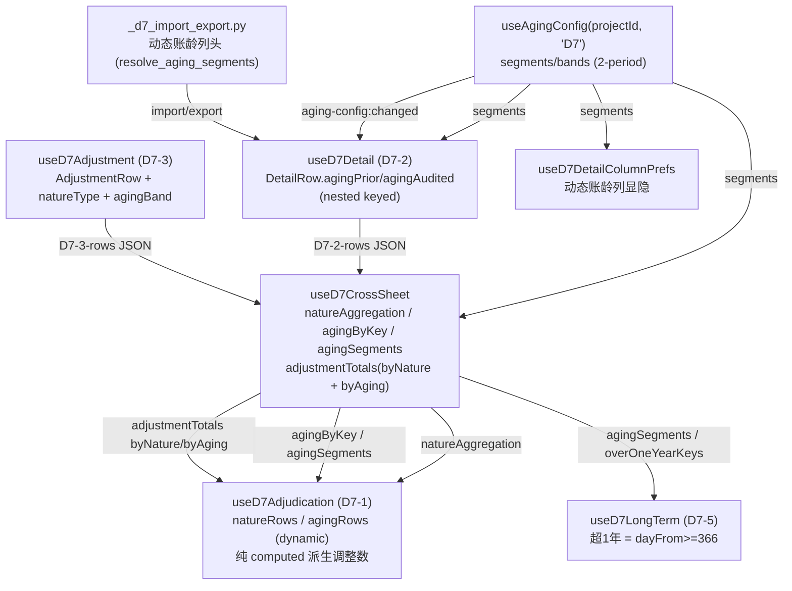

# Design Document

## Overview

本设计文档承接 `requirements.md`，实现 D7 合同负债底稿的两大增强：

- **增强点 A — 动态账龄全链路**：将 D7 从硬编码 4 段账龄（`priorAging1~4` / `endAging1~4`）迁移到项目级账龄配置（`useAgingConfig` subject="D7"，2-period），覆盖 D7-2 明细表、D7-1 审定表账龄区块、`useD7CrossSheet` 账龄聚合、D7-5 长期挂账"超过1年"识别、以及后端 `_d7_import_export.py` 账龄列头。**严格复用 D3 已落地的动态账龄实现**（`migrateD3F1Keys` / `remapRowAgingData` / `agingByKey` / `LEGACY_AGING_ROWKEY` / `resolve_aging_segments` / `build_aging_headers` / `match_import_aging`），不重新发明轮子。
- **增强点 B — 调整分录按性质/账龄路由**：为 D7-3 调整分录行增加 `natureType`（款项性质）与 `agingBand`（账龄段）维度，把调整金额按性质分组和账龄分组分别派生到 D7-1 审定表的"按性质分类"区块与"按账龄分类"区块；同时**移除 `useD7Adjudication.onAdjustmentCreated` 事件累加器**（消除"每次编辑重复累加"隐患），改为纯 computed 从 `crossSheet.adjustmentTotals`（双分组）派生。

### 设计原则

1. **模式复用优先**：D3 是已上线的动态账龄参考实现。D7 与 D3 同为 2-period 贷方往来款科目（D3=预收账款 2203，D7=合同负债 2205），账龄结构完全同构。本设计以最小改动把 D3 的动态账龄机制平移到 D7，禁止新造平行机制。
2. **纯 computed 派生，不落库中间量**：账龄聚合、性质聚合、调整合计全部是 `crossSheet` 的 computed，从 `D7-2-rows` / `D7-3-rows` 的 JSON 派生。审定表调整数不再写入 checklist 存储，消除累加放大隐患。
3. **双维度不相加**：性质区块合计与账龄区块合计是同一笔合同负债总额的两个视图，通过交叉验证守卫恒等（性质合计 === 账龄合计），**绝不相加**计入总额。
4. **向后兼容不丢数据**：历史 `priorAging1~4` / `endAging1~4` 扁平字段迁移到 nested keyed（`agingPrior` / `agingAudited`），共有段保留值、新增段零初始化、旧段在配置变更时丢弃（用户已被警告），历史值不静默丢失。

## Architecture

### 数据流总览



### 关键架构决策

| 决策 | 内容 | 依据 |
|------|------|------|
| **D7 为 2-period subject** | D7 不加入 `THREE_PERIOD_SUBJECTS`（前端 `useAgingConfig`）/ `_THREE_PERIOD_SUBJECTS`（后端 `_cycle_import_export_common`）。`segmentsToBands('D7')` 不生成 `currentField`，`subject_aging_periods('D7')` 返回 `[prior, audited]`。 | Req 1.2；D7-2 只有期初审定账龄+期末审定账龄两组列（核实自 `useD7Detail.DetailRow`）。 |
| **D7 默认预设 = THREE_YEAR** | 前端 `useAgingConfig._applyDefault` 新增 D7 归入 THREE_YEAR 分支；后端 `DEFAULT_SUBJECT_PRESETS` 新增 `"D7": THREE_YEAR`。 | Req 1.4（加载失败回退 THREE_YEAR）。当前两处默认均落 FIVE_YEAR，须显式注册。 |
| **nested keyed 账龄存储** | `DetailRow.priorAging1~4` / `endAging1~4` → `agingPrior: {segKey: number}` / `agingAudited: {segKey: number}`。 | Req 2.2、8.1；复用 D3 `AgingData` 结构与 `migrateD3F1Keys`。 |
| **调整分录纯 computed 派生** | 删除 `onAdjustmentCreated` 累加器；`crossSheet.adjustmentTotals` 扩展为 `{ byNature, byAging }` 双分组；审定表调整数从中派生。 | Req 10、11；对齐 F1 修复范式（消除重复累加）。 |
| **旧 rowKey 保留映射** | D7-1 账龄区块默认 THREE_YEAR 段沿用旧 rowKey（`within-1-year` 等），自定义段用 segment key。 | Req 3.5；复用 D3 `LEGACY_AGING_ROWKEY` 范式，保住既有手工数据 item_id。 |

## Components and Interfaces

### 1. Aging_Config 注册（前后端）

**前端 `useAgingConfig.ts`**：
- `_applyDefault()` 分支扩展：`subject === 'D3' || subject === 'F1' || subject === 'D7'` → THREE_YEAR。
- `THREE_PERIOD_SUBJECTS` 保持不变（不含 D7），`segmentsToBands('D7')` 自动产出 2-period bands（`currentField=''`）。

**后端 `aging_config_service.py`**：
- `DEFAULT_SUBJECT_PRESETS` 新增 `"D7": AgingPreset.THREE_YEAR`。

**后端 `_cycle_import_export_common.py`**：
- `_THREE_PERIOD_SUBJECTS` 保持不含 D7 → `subject_aging_periods('D7')` 返回 `["prior", "audited"]`。

### 2. D7_Detail_Composable (`useD7Detail.ts`)

按 D3 `useD3Detail` 范式改造：

```typescript
export interface DetailRow {
  rowId: string
  contractName: string
  companyName: string
  companyCode: string
  relatedPartyType: string
  natureType: string
  priorUnadjusted: number
  priorAje: number
  priorRje: number
  priorAudited: number
  agingPrior: AgingData        // 替代 priorAging1~4（nested keyed）
  debitAmount: number
  creditAmount: number
  endBalance: number
  entityReclass: number
  endUnadjusted: number
  endAje: number
  endRje: number
  endAudited: number
  agingAudited: AgingData      // 替代 endAging1~4（nested keyed）
  isConfirmed: string
  postTransfer: number
}
```

- 引入 `const { segments, bands } = useAgingConfig(projectId, 'D7')`。
- `normalizeRow(raw, segments)` 调用 `migrateD3F1Keys(raw, segments)` 完成扁平→nested 迁移与段对齐（复用现成工具，无需为 D7 写新迁移函数——`migrateD3F1Keys` 已按段 key 处理任意 nested；扁平 `priorAging1~4`/`endAging1~4` 迁移见 §Data Models 迁移映射）。
- `updateCell` 支持 `agingPrior.{segKey}` / `agingAudited.{segKey}` 嵌套字段路径写入。
- `createEmptyRow(segments)` 按段零初始化 `agingPrior`/`agingAudited`。
- `rows` 加载 watch 依赖 `[D7-2-rows.remark, segments]`，segments 未就绪时不解析。
- 新增 `aging-config:changed` 监听：`remapRowAgingData(row, segments, false)`（isThreePeriod=false）逐行重映射后持久化；`onBeforeUnmount` 移除监听（Req 7.1、7.4）。
- `sumRows`/`totalRow`/`verificationRow` 账龄合计改按 `segments` 动态 SUM（对齐 `useD3Detail.subtotalRow`）。
- 只读模式：`updateCell` 前置 `if (isReadonly.value) return`（D7 主组件传入 `isReadonly`）。

### 3. D7_CrossSheet_Composable (`useD7CrossSheet.ts`)

按 D3 `useD3CrossSheet` 范式扩展：

```typescript
export interface UseD7CrossSheetOptions {
  allResponses: Ref<Map<string, ChecklistResponse>>
  segments?: Ref<AgingSegment[]>   // 新增：项目账龄段（来自 useAgingConfig）
}
```

- 新增 `agingSegments`（项目段优先→数据兜底→THREE_YEAR）、`agingByKey`（`{ current: {segKey: n}, prior: {segKey: n} }`，用 `aggregateAgingByKeys` 从 nested `agingPrior`/`agingAudited` 聚合）、`overOneYearKeys`（`dayFrom >= 366`）。**保留** `natureAggregation`（不变）。
- **`adjustmentTotals` 重构为双分组**：

```typescript
interface AdjustmentTotals {
  byNature: Record<NatureKey, { aje: number; rje: number }>   // revenue/development/engineering/other
  byAging: Record<string, { aje: number; rje: number }>       // 按 segment key
  totalAje: number
  totalRje: number
}
```

从 `D7-3-rows` 派生：每条调整行按 `natureType`（映射到 nature key，缺省→other）与 `agingBand`（segment key，缺省→空段不计入 byAging 明细但计入 total）分组累加；`debitAmount>0` 计入 AJE，否则 `creditAmount` 计入 RJE（对齐现有 `publishAdjustment` 的 entryType 判定）。
- `crossValidation` 保留（性质合计 vs 账龄合计），账龄合计改从 `agingByKey.current` 求和。

### 4. D7_Adjudication_Composable (`useD7Adjudication.ts`)

按 D3 `useD3Adjudication` 范式改造 + 移除累加器：

- **账龄区块动态生成**（`AGING_BLOCK_CONFIG` 硬编码 4 行 → 按 `crossSheet.agingSegments` 动态生成明细行）：
  - `LEGACY_AGING_ROWKEY`（复用 D3 常量语义）：`within1→within-1-year`、`y1to2→1-to-2-years`、`y2to3→2-to-3-years`、`over3→over-3-years`；自定义段用 `seg.key`（保住既有手工数据 item_id `D7-1-adj-aging-{rowKey}-{field}`，Req 3.5）。
  - 合计行 = 各账龄段明细行之和（Req 3.2）；试算平衡表数行、差异数行保留（Req 3.3）。
- **性质区块保持固定 4 行**（预收货款/开发项目预收款/预收工程款/其他），配置不影响性质分类。
- **调整数纯 computed 派生**（Req 10.3、10.4、11.2）：
  - 性质行 `currentAje`/`currentRje` = `crossSheet.adjustmentTotals.byNature[natureKey].aje/rje`。
  - 账龄行 `currentAje`/`currentRje` = `crossSheet.adjustmentTotals.byAging[segKey].aje/rje`。
- **移除 `onAdjustmentCreated`**（Req 11.1）：删除该函数及其把金额累加到 `other` 行的 `updateCell` 调用。D7 主组件同步移除对该函数的 eventBus/事件绑定。
- 交叉验证告警：性质区块调整合计 === 账龄区块调整合计（Req 10.5）；性质合计与账龄合计不相加（Req 10.6，无相加代码即满足）。
- `tbSeedAmount` 预填逻辑（已存在，不改）。

### 5. D7_Adjustment_Composable (`useD7Adjustment.ts`)

- `AdjustmentRow` 新增字段：

```typescript
export interface AdjustmentRow {
  // ... 现有 10 字段 ...
  natureType: string        // Nature_Type（缺省视为"其他"）
  agingBand: string         // Aging_Band_Selection（segment key，可空）
}
```

- `normalizeRow` / `createEmptyRow`：`natureType: raw.natureType || ''`、`agingBand: raw.agingBand || ''`。
- `updateCell` 支持 `natureType` / `agingBand` 字段更新并持久化（Req 9.4）。
- 组件层提供 `natureType` 下拉（来自 `NATURE_TYPES`）与 `agingBand` 下拉（来自当前 `segments`，Req 9.2）。
- 只读模式只读展示（Req 9.5）。
- `publishAdjustment` / `pushToA13` 保持不变。

### 6. D7_LongTerm_Composable (`useD7LongTerm.ts`)

- 依赖 `crossSheet.overOneYearKeys` / `agingSegments`（或自身接 `useAgingConfig('D7')`）。
- `importFromD72` 改按段判定（Req 5.1、5.2、5.3、5.4）：
  - "超过1年" = `agingAudited` 中 `dayFrom >= 366` 段之和 > 0（不再硬编码 `endAging2+3+4`）。
  - 账龄 label 取占比最大的"超过1年"段 label（对齐 D3 `longTermRows` 的 label 拼接思路，此处取最大段）。
- 保留 `disposalConclusion` / `disposalSummary`（已落地，不改）。

### 7. D7_ColumnPrefs_Composable (`useD7DetailColumnPrefs.ts`)

- `COLUMN_GROUPS` 中"账龄"组的固定 `['endAging1..4']` → 按当前 `segments` 动态生成 `agingAudited.{segKey}`（及期初 `agingPrior.{segKey}`）显隐项（Req 2.5）。
- 接收 `segments: Ref<AgingSegment[]>` 参数（或由组件传入 bands）；`isColVisible`/`toggleCol` 逻辑不变。

### 8. D7_ImportExport_Backend (`_d7_import_export.py`)

按 D3 `_d3_import_export.py` 的 D3-2 动态账龄范式改造 D7-2：

- 引入 `from ._cycle_import_export_common import (resolve_aging_segments, build_aging_headers, aging_export_values, match_import_aging, subject_aging_periods)`。
- **D7-2 基础列常量** `_D7_2_BASE_HEADERS`（非账龄列），账龄列动态派生：
  - `_d7_2_dynamic_headers(segments)` = 期初基础列 + `build_aging_headers(segments, subject_aging_periods('D7'))` 插入到期初审定数之后 + 期末审定数之后的 2N 账龄列（Req 6.3）。
  - 采用 D3 同款做法：基础列平铺 + 账龄列（`{label}(期初)` / `{label}(期末审定)`）追加（`subject_aging_periods('D7')` = `[prior, audited]`）。
- **导出**（`d7_export_data` / `d7_export_template` sheet=D7-2）：`resolve_aging_segments(db, wp_id, 'D7')` 取段；`aging_export_values(row, segments, periods)` 从 nested `agingPrior`/`agingAudited` 取值（Req 6.4）。配置无效时 `resolve_aging_segments` 回退默认预设（Req 6.2 由回退保证不崩）。
- **导入**（`d7_import_data` sheet=D7-2）：`match_import_aging(get_value, actual_headers, segments, periods)` 按 label 匹配写 nested；未匹配账龄列 → `skipped_columns` + warning（Req 6.5）；缺列段初始化 0（Req 6.6）；基础列校验仍走 `missing_cols`（账龄列不列入必需校验）。
- **往返一致性**（Req 6.7 / 12.2）：导出用 `build_aging_headers` + `aging_export_values`，导入用 `match_import_aging`，两者共用同一列头格式，保证 export→import 往返账龄数据一致（复用 D3 已验证机制）。
- **`import-aux-balance`**：构造行的 `priorAging1..4`/`endAging1..4` → 改为 nested `agingPrior`/`agingAudited`，仅填入首段（`within1`）为余额、其余段 0（对齐 D3 aux-balance 行构造）。
- **D7-3 导入导出**：`_SHEET_HEADERS["D7-3"]` 增加"款项性质"、"账龄段"两列；`_export_row`/`_parse_row` 增加 `natureType`（默认"其他"）、`agingBand`（默认空）字段读写（Req 12.3、12.4）。

## Data Models

### DetailRow 账龄迁移映射（扁平 → nested keyed）

| 旧扁平字段 | 迁移目标（THREE_YEAR 默认段 key） | period |
|-----------|-------------------------------|--------|
| `priorAging1` | `agingPrior.within1` | 期初审定 |
| `priorAging2` | `agingPrior.y1to2` | 期初审定 |
| `priorAging3` | `agingPrior.y2to3` | 期初审定 |
| `priorAging4` | `agingPrior.over3` | 期初审定 |
| `endAging1` | `agingAudited.within1` | 期末审定 |
| `endAging2` | `agingAudited.y1to2` | 期末审定 |
| `endAging3` | `agingAudited.y2to3` | 期末审定 |
| `endAging4` | `agingAudited.over3` | 期末审定 |

迁移规则（复用 `useAgingMigration`）：
- 若行已含 nested `agingPrior`/`agingAudited` → 以 nested 为准，忽略扁平字段（Req 8.4）。
- 若仅含扁平字段 → 新增 D7 专用扁平→nested 预处理（`migrateD7FlatToNested`，仿 `migrateD2FlatToNested` 但映射 4 段 THREE_YEAR key），再经 `migrateD3F1Keys(_, segments)` 对齐当前配置段。
- 序列化仅输出 nested（`stripLegacyFlatKeys` 思路：normalizeRow 输出的 DetailRow 不再含 `priorAging1~4`/`endAging1~4` key，Req 8.3）。

> 说明：`useAgingMigration.migrateD3F1Keys` 处理的是"已是 nested 的段 key 对齐"；D7 历史是扁平字段，故需一个薄封装 `migrateD7FlatToNested`（4 段固定映射），与 `migrateD2FlatToNested`（18 字段）同构但只映射 2-period 8 字段。此为唯一新增迁移工具，其余复用现成。

### AdjustmentRow（新增 2 字段）

```typescript
{
  rowId, description, category, reportItem, accountName, noteItem, placeholder,
  debitAmount, creditAmount, indexRef, remark,
  natureType: string,   // '' | 预收货款 | 开发项目预收款 | 预收工程款 | 其他
  agingBand: string,     // '' | segment key（当前项目段）
}
```

### Adjustment_Totals（crossSheet 双分组派生）

```typescript
{
  byNature: {
    revenue:     { aje: number, rje: number },
    development: { aje: number, rje: number },
    engineering: { aje: number, rje: number },
    other:       { aje: number, rje: number },
  },
  byAging: {
    [segmentKey: string]: { aje: number, rje: number },
  },
  totalAje: number,   // = Σ byNature.aje = Σ byAging.aje（恒等）
  totalRje: number,
}
```

派生逻辑：遍历 `D7-3-rows`，每行 `entryType = debitAmount>0 ? 'AJE' : 'RJE'`、`amount = debitAmount>0 ? debitAmount : creditAmount`；按 `natureType`（映射 NATURE_TYPE_MAP，缺省 other）累加进 `byNature`，按 `agingBand`（缺省不计入 byAging 明细）累加进 `byAging`；`totalAje`/`totalRje` 为全体累加。**不变量：`Σ byNature.aje === totalAje`**（每行必归入某个 nature，缺省 other，保证归一）。

### 账龄配置变更数据保留（复用 `remapAgingData`/`remapRowAgingData`）

- 新旧共有段 → 保留值；新增段 → 0；旧独有段 → 丢弃（Req 7.3）。

## Correctness Properties

*A property is a characteristic or behavior that should hold true across all valid executions of a system—essentially, a formal statement about what the system should do. Properties serve as the bridge between human-readable specifications and machine-verifiable correctness guarantees.*

以下属性经 prework 分析从可测的验收标准派生，并做过冗余合并（每条提供唯一验证价值）。属性以纯函数/computed 为测试目标（`segmentsToBands` / `aggregateAgingByKeys` / `adjustmentTotals` / `migrateD7FlatToNested` / `remapAgingData` / `build_aging_headers` / `match_import_aging` 等），配置 PBT 最少 100 次迭代。

### Property 1: D7 为 2-period，账龄列不含期末未审

*For any* 有效账龄段列表 segments，`segmentsToBands(segments, 'D7')` 生成的 bands 数量等于 segments 长度，且每个 band 的 `currentField === ''`（无期末未审列），`subject_aging_periods('D7')` 恒为 `['prior', 'audited']`。

**Validates: Requirements 1.2, 2.1**

### Property 2: 账龄列/列组/审定账龄行数量由段驱动

*For any* 有效账龄段列表 segments（THREE_YEAR/FIVE_YEAR/CUSTOM），D7-2 账龄列（期初+期末审定各 N）、列偏好账龄组显隐项、以及 D7-1 审定表账龄区块明细行数均等于 segments 长度，且 label 与各段一一对应。

**Validates: Requirements 1.3, 2.5, 3.1**

### Property 3: 账龄按段 key 聚合且忽略配置外旧段

*For any* D7-2 明细行集合（nested `agingPrior`/`agingAudited`）与当前段列表 segments，`agingByKey[period][segKey]` 等于所有行该段该期之和；行中不在 segments 的旧段 key 不出现在聚合结果中。

**Validates: Requirements 4.1, 4.2, 4.3**

### Property 4: 审定表账龄区块合计与差异公式

*For any* 账龄各段随机金额，D7-1 账龄区块"合计"行等于各账龄段明细行之和，"差异数"行等于账龄合计减试算平衡表数。

**Validates: Requirements 3.2, 3.3**

### Property 5: 超1年段判定 dayFrom>=366

*For any* 有效账龄段列表 segments，`overOneYearKeys` 恰好包含且仅包含 `dayFrom >= 366` 的段（对 THREE_YEAR 与 FIVE_YEAR 均正确，含 y3to4/y4to5/over5）。

**Validates: Requirements 5.1, 5.4**

### Property 6: 长期挂账筛选与账龄 label 填充

*For any* D7-2 明细行集合，某行被 `importFromD72` 选中当且仅当其 `agingAudited` 中"超过1年"段之和大于 0；被选中行的账龄 label 取占比最大的"超过1年"段的 label。

**Validates: Requirements 5.2, 5.3**

### Property 7: 配置变更数据保留（共有保留/新增零/旧丢弃）

*For any* 旧账龄数据对象与新段列表，`remapAgingData(oldData, newSegments)` 的结果对新旧共有段保留原值、新增段为 0、旧配置独有段被丢弃（不出现在结果中）。

**Validates: Requirements 7.3**

### Property 8: 后端动态账龄列头（2N 含全段 label）与导出取值顺序一致

*For any* 有效段列表 segments，`build_aging_headers(segments, ['prior','audited'])` 产生 2×N 个列头且含全部段 label；`aging_export_values(row, segments, ['prior','audited'])` 的取值顺序与列头一一对应，值等于 `row[period][segKey]`（缺失取 0）。

**Validates: Requirements 6.1, 6.3, 6.4**

### Property 9: 导入按 label 匹配写段、缺列置零、未匹配报 warning

*For any* 段列表与导入行，`match_import_aging` 将命中的账龄列头（`{label}(期初)`/`{label}(期末审定)`）值写入对应 nested 段；当前配置中缺失的段列头对应段初始化为 0；实际表头中"看起来像账龄"但不属于当前段的列头进入 unmatched 列表。

**Validates: Requirements 6.5, 6.6**

### Property 10: D7-2 导入导出账龄往返一致

*For any* D7-2 行数据与段列表，先 `aging_export_values` 导出、再经 `match_import_aging` 导入，得到的 nested `agingPrior`/`agingAudited` 各段值与导出前一致。

**Validates: Requirements 6.7, 12.2**

### Property 11: 历史扁平账龄迁移保值且仅输出 nested

*For any* 旧扁平字段值（`priorAging1~4` / `endAging1~4`），迁移后 `agingPrior`/`agingAudited` 对应默认段（within1/y1to2/y2to3/over3）的值等于原扁平值；迁移后行不再含扁平字段 key；若行同时含 nested 与扁平字段，则以 nested 值为准。

**Validates: Requirements 8.1, 8.2, 8.3, 8.4**

### Property 12: 调整分录按性质/账龄双分组派生（缺省归"其他"）

*For any* D7-3 调整分录行集合，`adjustmentTotals.byNature[natureKey]` 与 `byAging[segKey]` 分别等于对应分组的 AJE（借方>0）/RJE 合计；未指定性质的行计入 `byNature.other`；D7-1 性质行/账龄行的调整数分别等于 `byNature`/`byAging` 对应值。

**Validates: Requirements 9.3, 10.1, 10.2, 10.3, 10.4**

### Property 13: 调整数为 computed 幂等，不随编辑次数累加放大

*For any* D7-3 调整分录行集合，审定表调整数（性质与账龄）等于该集合的分组合计，重复重算结果恒等（不放大）；从集合中删除某行后，对应分组的调整数恰好减去该行贡献。

**Validates: Requirements 11.3, 11.4**

### Property 14: 段列 nested keyed 写入

*For any* 段 key 与数值，`updateCell(rowId, 'agingAudited.{segKey}', v)`（或 `agingPrior.{segKey}`）后该行 `agingAudited[segKey]`（或 `agingPrior[segKey]`）等于该数值。

**Validates: Requirements 2.2**

### Property 15: 性质合计与账龄合计交叉验证恒等

*For any* D7-3 调整分录行集合，按性质分组的调整合计（Σ byNature.aje/rje）等于按账龄分组的调整合计对应总额（`totalAje`/`totalRje`）；当审定表性质区块合计与账龄区块合计不一致时输出交叉验证告警并给出差额，一致时无告警。

**Validates: Requirements 3.4, 10.5**

### Property 16: D7-3 调整分录往返保留性质/账龄字段

*For any* D7-3 调整分录行，导出再导入后保留 `natureType` 与 `agingBand` 字段值。

**Validates: Requirements 12.3**

## Error Handling

| 场景 | 处理 | 依据 |
|------|------|------|
| Aging_Config API 加载失败 | 前端 `_applyDefault` 回退 THREE_YEAR 段（D7 已注册）；不保留上次配置 | Req 1.4 |
| 后端 `resolve_aging_segments` 异常 | try/except 回退 `DEFAULT_SUBJECT_PRESETS['D7']`=THREE_YEAR 段，导出/导入不崩 | Req 6.2 |
| segments 未加载完成 | `rows` 加载 watch 在 `!segments.value.length` 时不解析（避免用空段迁移丢数据） | Req 8 |
| 导入账龄列未匹配当前配置 | `skipped_columns` + warning，不阻断其余列导入 | Req 6.5 |
| 导入缺账龄列 | 该段初始化 0，不报错 | Req 6.6 |
| D7-3 导入缺性质/账龄列 | `natureType` 默认"其他"、`agingBand` 默认空 | Req 12.4 |
| JSON 解析失败（D7-2/D7-3 rows） | `safeParseRows` 返回空数组，不抛异常 | 现有范式 |
| 只读模式下的写操作 | `updateCell` 前置 `if (isReadonly.value) return` | Req 2.4, 9.5, 12.1 |
| 交叉验证不一致 | 输出告警文本+差额（不阻断编辑，审计师据此排查） | Req 3.4 |

## Testing Strategy

### 双测试策略

- **属性测试（PBT）**：验证上述 16 条 Property。前端用 `fast-check`（`numRuns >= 100`），后端用 `hypothesis`（`max_examples>=100`，本仓 conftest `fast` profile 默认 5，属性测试须显式 `@settings(max_examples=100)`）。测试目标为纯函数/computed：`segmentsToBands`、`aggregateAgingByKeys`、`overOneYearKeys` 派生、`adjustmentTotals` 双分组、`migrateD7FlatToNested`、`remapAgingData`、`build_aging_headers`、`aging_export_values`、`match_import_aging`。
- **单元测试**：验证 EXAMPLE/EDGE_CASE（接线、错误分支、只读态、生命周期）：subject='D7' 接线、加载失败回退、只读守卫、`aging-config:changed` 监听与卸载移除、`onAdjustmentCreated` 移除、D7-3 字段持久化、缺列默认值等。
- **集成/回归测试**：D7-2 导入导出往返（后端 pytest，仿 `test_d3_export_import_roundtrip`），D7-1 双区块交叉验证。

### 属性测试配置

- 每个 Property 一个属性测试，最少 100 次迭代。
- 每个属性测试注释标注设计属性：`Feature: d7-contract-liabilities-enhancement, Property {number}: {property_text}`。
- 生成器覆盖 THREE_YEAR / FIVE_YEAR / CUSTOM 段、含配置外旧段的行、混合扁平+nested 历史行、空/负/大额金额、缺列/多列导入表头。

### 库选型

- 前端：`fast-check`（已在仓库使用，见 `useAgingMigration.property.test.ts`）。
- 后端：`hypothesis`（已在仓库使用，见 `.hypothesis` 与现有 `_pbt` 测试）。
- 不从零实现属性测试框架。

### 关键回归守卫

- D3 动态账龄相关纯函数（`aggregateAgingByKeys`/`collectAgingKeys`/`migrateD3F1Keys`/`remapRowAgingData`）为共享工具，D7 复用不得破坏其现有测试。
- D7 迁移后 `D7-2-rows` JSON 不再含 `priorAging1~4`/`endAging1~4` key（序列化清洗回归）。
