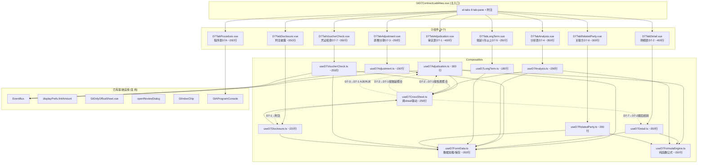
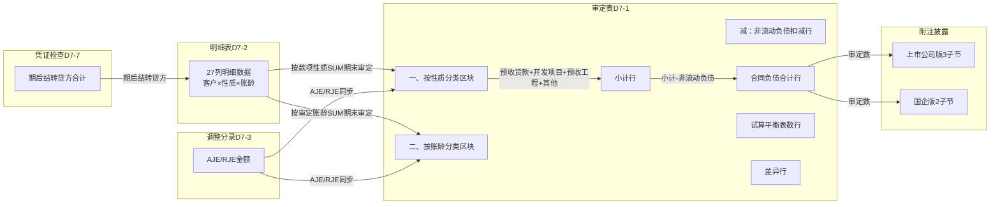

# Design Document: D7 合同负债底稿专属HTML精美组件

## Overview

将D7合同负债底稿从通用`univer`渲染升级为独立专属组件`d7-contract-liabilities`。覆盖源模板9个有效sheet（程序表D7A + 审定表D7-1 + 明细表D7-2 + 调整分录D7-3 + 分析表D7-4 + 账龄1年以上检查D7-5 + 关联方检查D7-6 + 凭证检查D7-7 + 附注披露），合计约314个公式。

核心设计目标：
- 新 componentType `d7-contract-liabilities`，主入口 GtD7ContractLiabilities.vue（el-tabs 8个tab-pane + 附注内含el-segmented切换）
- 每个sheet独立子组件（200-400行）+ 独立composable
- 共享纯函数公式引擎 useD7FormulaEngine.ts（贷方科目核心公式：期末=期初+贷方-借方）
- 跨sheet数据流通过 allResponses Map computed 响应式链（不走API）
- 5方EventBus联动 + GtIndexChip 11处交叉索引
- 双模式（HTML ↔ OnlyOffice）+ 导入导出三级 + AI审计说明

科目特征：2205贷方科目/负债类。核心特色：双区块审定表（按性质+按账龄，含"减：计入其他非流动负债的合同负债"扣减行）、27列明细表（贷方科目公式）、4区块分析表（含Top10债务人）、CAS14合同负债vs预收账款区分联动（D3↔D7）、期后结转与D4营业收入联动。

## Architecture

### 组件依赖关系



### 文件结构

```
audit-platform/frontend/src/components/workpaper/
├── GtD7ContractLiabilities.vue              # 主入口 el-tabs（~150行）
├── d7/                                       # 新增目录
│   ├── D7TabProcedure.vue                   # 程序表D7A（~200行）
│   ├── D7TabAdjudication.vue                # 审定表D7-1（~400行）
│   ├── D7TabDetail.vue                      # 明细表D7-2（~400行）
│   ├── D7TabAdjustment.vue                  # 调整分录D7-3（~250行）
│   ├── D7TabAnalysis.vue                    # 分析表D7-4（~350行）
│   ├── D7TabLongTerm.vue                    # 账龄1年以上D7-5（~250行）
│   ├── D7TabRelatedParty.vue                # 关联方D7-6（~300行）
│   ├── D7TabVoucherCheck.vue                # 凭证检查D7-7（~350行）
│   └── D7TabDisclosure.vue                  # 附注披露（~350行）
├── composables/
│   ├── useD7FormData.ts                     # 数据加载/保存基础（~200行）
│   ├── useD7FormulaEngine.ts                # 纯函数公式引擎（~150行）
│   ├── useD7CrossSheet.ts                   # 跨sheet联动computed（~250行）
│   ├── useD7Adjudication.ts                 # 审定表逻辑（~300行）
│   ├── useD7Detail.ts                       # 明细表逻辑（~350行）
│   ├── useD7Adjustment.ts                   # 调整分录逻辑（~150行）
│   ├── useD7Analysis.ts                     # 分析表逻辑（~250行）
│   ├── useD7LongTerm.ts                     # 账龄1年以上逻辑（~180行）
│   ├── useD7RelatedParty.ts                 # 关联方逻辑（~200行）
│   ├── useD7VoucherCheck.ts                 # 凭证检查逻辑（~250行）
│   └── useD7Disclosure.ts                   # 附注披露逻辑（~220行）

backend/app/routers/wp_render_strategies/
│   ├── _d7_import_export.py                 # 导入导出端点（~220行）
│   ├── _d7_resolvers.py                     # Auto Data Resolver（~100行）
│   └── _d7_ai_generate.py                   # AI生成端点（~150行）
```

### 跨Sheet数据流



## Components and Interfaces

### 1. useD7FormulaEngine.ts — 纯函数公式引擎

```typescript
// D7核心：贷方科目/负债类（期末=期初+贷方-借方，与D3完全相同）

/** 安全数值解析：null/undefined/空串/NaN → 0 */
export function parseNum(val: string | number | null | undefined): number

/** 贷方科目期末余额 = 期初 + 贷方发生 - 借方发生 */
export function calcCreditEndBalance(opening: number, credit: number, debit: number): number

/** 审定数 = 未审 + AJE + RJE */
export function calcAuditedAmount(unadjusted: number, aje: number, rje: number): number

/** 变动额 = 期末审定 - 期初审定 */
export function calcChangeAmount(prior: number, current: number): number

/** 变动率: 期初=0且期末=0→'' | 期初=0→'N/A' | 其他→(期末-期初)/期初 */
export function calcChangeRate(prior: number, current: number): number | '' | 'N/A'

/** 变动率绝对值是否超阈值 */
export function isChangeRateExceeding(rate: number | '' | 'N/A', threshold: number): boolean

/** 小计/合计 = SUM(明细行) */
export function calcSubtotal(values: number[]): number

/** 合同负债合计 = 小计 - 计入其他非流动负债的合同负债 */
export function calcContractLiabilityTotal(subtotal: number, nonCurrentDeduction: number): number

/** 按性质聚合：从明细行按款项性质分组SUM */
export function aggregateByNature(rows: DetailRow[], field: string): Record<string, number>

/** 按账龄聚合：从明细行按审定账龄4段列SUM */
export function aggregateByAging(rows: DetailRow[]): AgingAggregation

/** Top10排序：按指定字段降序取前N */
export function topNByField<T>(rows: T[], field: keyof T, n: number): T[]
```

### 2. useD7FormData.ts — 基础数据加载/保存

```typescript
export interface UseD7FormDataOptions {
  wpId: Ref<string>
  projectId: Ref<string>
}

export function useD7FormData(options: UseD7FormDataOptions) {
  return {
    allResponses: Ref<Map<string, ChecklistResponse>>,
    isLoading: Ref<boolean>,
    loadAll: () => Promise<void>,
    saveImmediate: (itemId: string, data: Partial<ChecklistResponse>) => Promise<void>,
    saveBatch: (items: Array<{ itemId: string; data: Partial<ChecklistResponse> }>) => Promise<void>,
    debouncedSave: (itemId: string, data: Partial<ChecklistResponse>) => void, // 2s debounce
    writebackTrialBalance: (auditedAmount: number) => Promise<void>, // 科目2205回写
  }
}
```

### 3. useD7CrossSheet.ts — 跨Sheet联动

```typescript
export interface UseD7CrossSheetOptions {
  allResponses: Ref<Map<string, ChecklistResponse>>
}

export function useD7CrossSheet(options: UseD7CrossSheetOptions) {
  return {
    // D7-2 → D7-1 按性质聚合
    natureAggregation: ComputedRef<{
      revenue: { prior: number; current: number },        // 预收货款
      development: { prior: number; current: number },    // 开发项目预收款
      engineering: { prior: number; current: number },    // 预收工程款
      other: { prior: number; current: number }           // 其他
    }>,
    // D7-2 → D7-1 按账龄聚合
    agingAggregation: ComputedRef<{
      within1Year: { prior: number; current: number },
      year1to2: { prior: number; current: number },
      year2to3: { prior: number; current: number },
      over3Years: { prior: number; current: number }
    }>,
    // D7-3 → D7-1 AJE/RJE合计
    adjustmentTotals: ComputedRef<{ ajeTotal: number; rjeTotal: number }>,
    // D7-1 → 附注
    adjudicationForDisclosure: ComputedRef<DisclosureSourceData>,
    // D7-7 → D7-2 期后结转
    voucherPostTransferTotal: ComputedRef<number>,
    // 交叉验证：性质合计 vs 账龄合计
    crossValidation: ComputedRef<{ isConsistent: boolean; diff: number }>,
    // 状态
    crossSheetStatus: Ref<'loaded' | 'loading' | 'error'>,
  }
}
```

### 4. useD7Adjudication.ts — 审定表D7-1

```typescript
export interface AdjudicationRow {
  rowKey: string
  label: string
  priorUnadjusted: number
  priorAje: number
  priorRje: number
  priorAudited: number      // = 未审 + AJE + RJE
  currentUnadjusted: number
  currentAje: number
  currentRje: number
  currentAudited: number    // = 未审 + AJE + RJE
  changeAmount: number      // = 期末审定 - 期初审定
  changeRate: number | '' | 'N/A'
  reasonAnalysis: string
  isFromCrossSheet: boolean
  isEditable: boolean
  isDeductionRow: boolean   // "减：非流动负债"标记
}

// 双区块固定行结构
const NATURE_ROWS = [
  { rowKey: 'revenue', label: '预收货款', isFromCrossSheet: true },
  { rowKey: 'development', label: '开发项目预收款', isFromCrossSheet: true },
  { rowKey: 'engineering', label: '预收工程款', isFromCrossSheet: true },
  { rowKey: 'other', label: '其他', isFromCrossSheet: true },
  { rowKey: 'nature-subtotal', label: '小计', isComputed: true },
  { rowKey: 'non-current-deduction', label: '减：计入其他非流动负债的合同负债', isDeductionRow: true },
  { rowKey: 'contract-liability-total', label: '合同负债合计', isComputed: true },
]

const AGING_ROWS = [
  { rowKey: 'within-1-year', label: '1年以内(含1年)', isFromCrossSheet: true },
  { rowKey: '1-to-2-years', label: '1至2年(含2年)', isFromCrossSheet: true },
  { rowKey: '2-to-3-years', label: '2至3年(含3年)', isFromCrossSheet: true },
  { rowKey: 'over-3-years', label: '3年以上', isFromCrossSheet: true },
  { rowKey: 'aging-total', label: '合计', isComputed: true },
  { rowKey: 'trial-balance', label: '试算平衡表数', isFromTB: true },
  { rowKey: 'difference', label: '差异数', isComputed: true },
]

export function useD7Adjudication(options: UseD7AdjudicationOptions) {
  return {
    natureRows: ComputedRef<AdjudicationRow[]>,
    agingRows: ComputedRef<AdjudicationRow[]>,
    trialBalanceAmount: Ref<number>,
    trialBalanceDiff: ComputedRef<number>,
    crossValidationWarning: ComputedRef<string | null>,  // 性质合计≠账龄合计时警告
    auditNotes: Ref<{ explanation: string; conclusion: string; agingExplanation: string }>,
    updateCell: (rowKey: string, field: string, value: number | string) => void,
    publishAdjudicated: () => void,
    onAdjustmentCreated: (payload: AdjustmentPayload) => void,
  }
}
```

### 5. useD7Detail.ts — 明细表D7-2

```typescript
export interface DetailRow {
  rowId: string
  contractName: string         // 合同名称/项目名称
  companyName: string          // 单位名称
  companyCode: string          // 公司代码
  relatedPartyType: string     // 关联关系
  natureType: string           // 类型(款项性质)
  priorUnadjusted: number      // 期初未审数
  priorAje: number             // 账项调整
  priorRje: number             // 重分类调整
  priorAudited: number         // 期初审定数 =未审+AJE+RJE（自动）
  priorAging1: number          // 审定账龄-1年以下
  priorAging2: number          // 审定账龄-1~2年
  priorAging3: number          // 审定账龄-2~3年
  priorAging4: number          // 审定账龄-3年以上
  debitAmount: number          // 借方发生
  creditAmount: number         // 贷方发生
  endBalance: number           // 期末余额 =期初审定+贷方-借方（自动，贷方科目）
  entityReclass: number        // 被审计单位重分类调整
  endUnadjusted: number        // 期末未审余额 =期末余额+重分类（自动）
  endAje: number               // 账项调整
  endRje: number               // 重分类调整
  endAudited: number           // 期末审定数 =期末未审+AJE+RJE（自动）
  endAging1: number            // 审定账龄-1年以下
  endAging2: number            // 审定账龄-1~2年
  endAging3: number            // 审定账龄-2~3年
  endAging4: number            // 审定账龄-3年以上
  isConfirmed: string          // 是否发函
  postTransfer: number         // 期后结转
}

export function useD7Detail(options: UseD7DetailOptions) {
  return {
    rows: Ref<DetailRow[]>,
    totalRow: ComputedRef<DetailRow>,       // 总合计
    verificationRow: ComputedRef<DetailRow>, // 核对行（=合计-试算表数）
    addRow: () => void,
    removeRow: (rowId: string) => void,
    updateCell: (rowId: string, field: string, value: any) => void,
    importFromAuxBalance: () => Promise<void>,  // 从tb_aux_balance科目2205导入
    searchFilter: Ref<string>,                  // 模糊搜索
    filteredRows: ComputedRef<DetailRow[]>,
  }
}
```

### 6. useD7Adjustment.ts — 调整分录D7-3

```typescript
export interface AdjustmentRow {
  rowId: string
  description: string     // 调整事项说明
  category: string        // 类别（报表调整/账项调整/其他）
  reportItem: string      // 报表项目
  accountName: string     // 科目名称
  noteItem: string        // 附注项目
  placeholder: string     // …
  debitAmount: number     // 借方调整金额
  creditAmount: number    // 贷方调整金额
  indexRef: string        // 索引
  remark: string          // 备注
}

export function useD7Adjustment(options: UseD7BaseOptions) {
  return {
    rows: Ref<AdjustmentRow[]>,
    debitTotal: ComputedRef<number>,
    creditTotal: ComputedRef<number>,
    isBalanced: ComputedRef<boolean>,
    balanceDiff: ComputedRef<number>,
    addRow: () => void,
    removeRow: (rowId: string) => void,
    updateCell: (rowId: string, field: string, value: any) => void,
    publishAdjustment: (row: AdjustmentRow) => void,
    pushToA13: (rowIds: string[]) => void,
  }
}
```

### 7. useD7Analysis.ts — 分析表D7-4

```typescript
export interface AnalysisDebitRow {
  item: string
  amount: number
  dataSource: string
  remark: string
}

export interface Top10Row {
  customerName: string
  endBalance: number
  priorBalance: number
  changeAmount: number      // = 期末 - 期初
  changeRate: number | '' | 'N/A'
  aging: string
  postTransfer: number
}

export function useD7Analysis(options: UseD7AnalysisOptions) {
  return {
    // (一)借方发生额分析
    debitRows: ComputedRef<AnalysisDebitRow[]>,
    debitTotal: ComputedRef<number>,       // TB取数
    debitDiff: ComputedRef<number>,        // = TB总计 - 分拆合计
    // (三)贷方发生额分析
    creditRows: ComputedRef<AnalysisDebitRow[]>,
    creditTotal: ComputedRef<number>,
    creditDiff: ComputedRef<number>,
    // (四)Top10债务人
    top10Rows: ComputedRef<Top10Row[]>,
    top10Concentration: ComputedRef<number>,  // 占合计百分比
    isHighConcentration: ComputedRef<boolean>, // >50%
    // 审计说明
    auditNotes: Ref<{ explanation: string; conclusion: string }>,
  }
}
```

### 8. useD7LongTerm.ts — 账龄1年以上D7-5

```typescript
export interface LongTermRow {
  rowId: string
  customerName: string
  endBalance: number
  aging: string
  businessDescription: string
  reason: string             // 未结转或未偿还的原因
  auditDateTransfer: number  // 至审计日结转或偿还金额
  plan: string               // 处理计划
  remark: string
}

export function useD7LongTerm(options: UseD7BaseOptions) {
  return {
    rows: Ref<LongTermRow[]>,
    totalRow: ComputedRef<{ endBalance: number; auditDateTransfer: number }>,
    addRow: () => void,
    removeRow: (rowId: string) => void,
    updateCell: (rowId: string, field: string, value: any) => void,
    importFromD72: () => void,  // 从D7-2筛选账龄>1年的客户导入
    auditNotes: Ref<{ explanation: string; conclusion: string }>,
  }
}
```

### 9. useD7RelatedParty.ts — 关联方D7-6

```typescript
export interface RelatedPartyRow {
  rowId: string
  partyName: string          // 关联方名称
  relationship: string       // 关联关系
  openingBalance: number     // 期初余额
  debitAmount: number        // 借方发生
  creditAmount: number       // 贷方发生
  endBalance: number         // 期末余额 =期初+贷方-借方（自动，贷方科目）
  agingTime: string          // 发生时间及账龄
  reason: string             // 未结转或未偿还的原因
  auditDateTransfer: number  // 至审计日结转或偿还金额
  plan: string               // 处理计划
  remark: string
}

export function useD7RelatedParty(options: UseD7BaseOptions) {
  return {
    rows: Ref<RelatedPartyRow[]>,
    totalRow: ComputedRef<{ openingBalance: number; debitAmount: number; creditAmount: number; endBalance: number; auditDateTransfer: number }>,
    addRow: () => void,
    removeRow: (rowId: string) => void,
    updateCell: (rowId: string, field: string, value: any) => void,
    importFromD72: () => void,  // 从D7-2筛选关联关系≠非关联方的客户导入
    auditNotes: Ref<{ explanation: string; conclusion: string }>,
  }
}
```

### 10. useD7VoucherCheck.ts — 凭证检查D7-7

```typescript
export interface VoucherCheckRow {
  rowId: string
  customerName: string
  date: string
  voucherNo: string
  businessContent: string
  counterAccount: string
  counterDetail: string
  debitAmount?: number        // 仅本期变动区块有
  creditAmount: number
  supportDocs: string
  checkItems: boolean[]       // 核对内容(1-5)
  indexRef: string
  isAbnormal: boolean
  remark: string
}

export interface SamplingParams {
  totalPopulation: number
  specificSamples: number
  samplingPopulation: number
  targetSampleSize: number
  samplingMethod: string
  samplingProcess: string
}

export function useD7VoucherCheck(options: UseD7VoucherCheckOptions) {
  return {
    samplingParams: Ref<SamplingParams>,
    // (1)本期增减变动
    periodChangeRows: Ref<VoucherCheckRow[]>,
    // (2)期后结转
    postTransferRows: Ref<VoucherCheckRow[]>,
    // 汇总
    checkedCount: ComputedRef<number>,
    abnormalCount: ComputedRef<number>,
    abnormalRate: ComputedRef<number>,        // = 异常/已检查×100%
    postTransferCreditTotal: ComputedRef<number>,  // 期后结转贷方合计
    // 操作
    addSample: (block: 'period' | 'post') => void,
    removeSample: (block: 'period' | 'post', rowId: string) => void,
    updateCell: (block: 'period' | 'post', rowId: string, field: string, value: any) => void,
    auditNotes: Ref<{ explanation: string; conclusion: string }>,
  }
}
```

### 11. useD7Disclosure.ts — 附注披露

```typescript
export interface DisclosureSection {
  sectionKey: string
  label: string
  rows: DisclosureRow[]
  totalRow?: DisclosureRow
  isDynamic: boolean
}

export function useD7Disclosure(options: UseD7DisclosureOptions) {
  return {
    // 上市公司版（3子节）
    listedSections: ComputedRef<DisclosureSection[]>,
    // (1) 按性质分类（固定行+减：非流动负债+合计）
    // (2) 账龄超过1年的重要合同负债（动态行+合计）
    // (3) 本期合同负债账面价值的重大变动（动态行+合计）
    
    // 国企版（2子节）
    soeSections: ComputedRef<DisclosureSection[]>,
    // (1) 按性质分类（固定行+合计）
    // (2) 本期账面价值的重大变动（动态行+合计）
    
    // 适用性
    showListed: ComputedRef<boolean>,
    showSoe: ComputedRef<boolean>,
    activeVariant: Ref<'listed' | 'soe'>,
    
    // 动态行操作
    addDynamicRow: (sectionKey: string) => void,
    removeDynamicRow: (sectionKey: string, rowId: string) => void,
    
    // 说明文本
    noteTexts: Ref<Record<string, string>>,
  }
}
```

### 12. 后端接口

```python
# _d7_import_export.py
# POST /api/workpapers/{wp_id}/d7/export-template?sheet=D7-2|D7-5|D7-6
# POST /api/workpapers/{wp_id}/d7/export-data?sheet=D7-2|D7-5|D7-6
# POST /api/workpapers/{wp_id}/d7/import-data?sheet=D7-2|D7-5|D7-6
# POST /api/workpapers/{wp_id}/d7/import-aux-balance  (从tb_aux_balance科目2205按客户导入)

# _d7_resolvers.py
# d7_tb_unadjusted: 从trial_balance科目2205取期初/期末未审数
# d7_ledger_analysis: 从tb_ledger科目2205取借方/贷方发生额+按对方科目分拆

# _d7_ai_generate.py
# POST /api/workpapers/{wp_id}/d7/ai-generate
# sections: adj-explanation | adj-conclusion | adj-aging-explanation |
#           detail-change | detail-contract | detail-over1year |
#           analysis-explanation | analysis-conclusion | longterm-reason
```

## Data Models

### checklist_responses item_id 命名规范

| Sheet | 前缀 | 示例 |
|-------|------|------|
| D7-1 审定表(按性质) | `D7-1-adj-nature-` | `D7-1-adj-nature-revenue-currentUnadjusted` |
| D7-1 审定表(按账龄) | `D7-1-adj-aging-` | `D7-1-adj-aging-within1Year-currentUnadjusted` |
| D7-1 审计说明 | `D7-1-note-` | `D7-1-note-explanation`, `D7-1-note-conclusion`, `D7-1-note-aging-explanation` |
| D7-2 明细表 | `D7-2-` | `D7-2-rows`（remark存JSON数组） |
| D7-3 调整分录 | `D7-3-` | `D7-3-rows`（remark存JSON数组） |
| D7-4 分析表 | `D7-4-` | `D7-4-debit-rows`, `D7-4-credit-rows`（remark存JSON数组） |
| D7-4 审计说明 | `D7-4-note-` | `D7-4-note-explanation`, `D7-4-note-conclusion` |
| D7-5 账龄1年以上 | `D7-5-` | `D7-5-rows`（remark存JSON数组） |
| D7-5 审计说明 | `D7-5-note-` | `D7-5-note-explanation`, `D7-5-note-conclusion` |
| D7-6 关联方 | `D7-6-` | `D7-6-rows`（remark存JSON数组） |
| D7-6 审计说明 | `D7-6-note-` | `D7-6-note-explanation`, `D7-6-note-conclusion` |
| D7-7 凭证检查 | `D7-7-` | `D7-7-sampling-params`, `D7-7-period-rows`, `D7-7-post-rows` |
| D7-7 审计说明 | `D7-7-note-` | `D7-7-note-explanation`, `D7-7-note-conclusion` |
| 附注上市 | `D7-note-listed-` | `D7-note-listed-section2-rows`, `D7-note-listed-section3-rows`, `D7-note-listed-text-1` |
| 附注国企 | `D7-note-soe-` | `D7-note-soe-section2-rows`, `D7-note-soe-text-1` |

### 审定表D7-1 双区块固定行结构

```typescript
// 一、按性质分类区块
const NATURE_BLOCK = [
  { rowKey: 'revenue', label: '预收货款', isFromCrossSheet: true },
  { rowKey: 'development', label: '开发项目预收款', isFromCrossSheet: true },
  { rowKey: 'engineering', label: '预收工程款', isFromCrossSheet: true },
  { rowKey: 'other', label: '其他', isFromCrossSheet: true },
  { rowKey: 'nature-subtotal', label: '小计', isComputed: true },
  { rowKey: 'non-current-deduction', label: '减：计入其他非流动负债的合同负债', isEditable: true, bgColor: '#E6F7FF' },
  { rowKey: 'contract-liability-total', label: '合同负债合计', isComputed: true },
]

// 二、按账龄分类区块
const AGING_BLOCK = [
  { rowKey: 'within-1-year', label: '1年以内(含1年)', isFromCrossSheet: true },
  { rowKey: '1-to-2-years', label: '1至2年(含2年)', isFromCrossSheet: true },
  { rowKey: '2-to-3-years', label: '2至3年(含3年)', isFromCrossSheet: true },
  { rowKey: 'over-3-years', label: '3年以上', isFromCrossSheet: true },
  { rowKey: 'aging-total', label: '合计', isComputed: true },
  { rowKey: 'trial-balance', label: '试算平衡表数', isFromTB: true },
  { rowKey: 'difference', label: '差异数', isComputed: true },
]

// 列结构
// 项目 | 期初数(未审/账项调整/重分类调整/审定) | 期末数(未审/账项调整/重分类调整/审定) | 变动额 | 变动率 | 原因分析

// 公式关系：
// 小计 = 预收货款 + 开发项目预收款 + 预收工程款 + 其他
// 合同负债合计 = 小计 - 减：计入其他非流动负债的合同负债
// 账龄合计 = 1年以内 + 1~2年 + 2~3年 + 3年以上
// 差异 = 账龄合计 - 试算平衡表数
// 交叉验证：合同负债合计(性质) === 账龄合计(账龄)
```

### 贷方科目公式链（D7-2每行）

```typescript
// 贷方科目（负债类）核心公式：期末 = 期初 + 贷方 - 借方
// （与D3预收账款完全相同，贷方增加借方减少）

// 期初审定数 = 期初未审 + 账项调整 + 重分类调整
priorAudited = priorUnadjusted + priorAje + priorRje

// 期末余额 = 期初审定 + 贷方发生 - 借方发生（贷方科目：贷增借减）
endBalance = priorAudited + creditAmount - debitAmount

// 期末未审余额 = 期末余额 + 被审计单位重分类调整
endUnadjusted = endBalance + entityReclass

// 期末审定数 = 期末未审 + 账项调整 + 重分类调整
endAudited = endUnadjusted + endAje + endRje
```

### 跨Sheet数据映射表

| D7-1目标 | 数据来源 | 路径 |
|----------|---------|------|
| 预收货款(期末审定) | D7-2 rows where natureType='预收货款' | SUM(endAudited) |
| 开发项目预收款(期末审定) | D7-2 rows where natureType='开发项目预收款' | SUM(endAudited) |
| 预收工程款(期末审定) | D7-2 rows where natureType='预收工程款' | SUM(endAudited) |
| 其他(期末审定) | D7-2 rows where natureType='其他' | SUM(endAudited) |
| 1年以内(期末审定) | D7-2 rows | SUM(endAging1) |
| 1~2年(期末审定) | D7-2 rows | SUM(endAging2) |
| 2~3年(期末审定) | D7-2 rows | SUM(endAging3) |
| 3年以上(期末审定) | D7-2 rows | SUM(endAging4) |
| D7-1 AJE列 | D7-3 adjustmentTotals | ajeTotal |
| D7-1 RJE列 | D7-3 adjustmentTotals | rjeTotal |
| D7-2 期后结转列 | D7-7 postTransferRows | 按客户名匹配累加creditAmount |
| 附注(1)按性质 | D7-1 natureRows | 直接引用审定数 |
| 附注(2)超1年 | D7-5 rows | 导入客户名/余额/原因 |
| D7-4 Top10 | D7-2 rows | 按endAudited降序前10 |
| D7-5 导入 | D7-2 rows where 审定账龄>1年 | 筛选导入 |
| D7-6 导入 | D7-2 rows where 关联关系≠非关联方 | 筛选导入 |

### EventBus事件清单

| 事件名 | 发布者 | 消费者 | Payload |
|--------|--------|--------|---------|
| `substantive:adjudicated` | D7-1 | TB回写 | `{ wpCode:'D7', accountCode:'2205', auditedAmount }` |
| `adjustment:created` | D7-3 | D7-1, A13 | `{ wpCode:'D7', entryType:'AJE'\|'RJE', amount, accountCode:'2205' }` |
| `analytical:significant-change` | D7-4 | A1-13 | `{ wpCode:'D7', changeRate, item }` |
| `confirmation:completed` | D0 | D7-2 | `{ customerName, wpCode }` |
| `risk:updated` | B50 | D7A | `{ riskLevel, affectedAccounts }` |
| `disclosure:note-text-updated` | 附注 | 附注模块 | `{ wpCode:'D7', section, text }` |
| `note:section-updated` | 附注模块 | D7附注 | `{ wpCode:'D7', section, text }` |

## Correctness Properties

*A property is a characteristic or behavior that should hold true across all valid executions of a system—essentially, a formal statement about what the system should do. Properties serve as the bridge between human-readable specifications and machine-verifiable correctness guarantees.*

### Property 1: 贷方科目期末余额公式

*For any* 期初审定数(opening)、贷方发生额(credit≥0)和借方发生额(debit≥0)，`calcCreditEndBalance(opening, credit, debit)` 的返回值应等于 `opening + credit - debit`。这是贷方科目（负债类）的核心公式：贷方增加、借方减少。

**Validates: Requirements 1.4, 5.4, 11.3**

### Property 2: 审定数 = 未审 + AJE + RJE

*For any* 三元组 (未审数, AJE净额, RJE净额)，其中各值为有限数值，`calcAuditedAmount` 的返回值应等于 `未审数 + AJE + RJE`。

**Validates: Requirements 1.4, 2.3**

### Property 3: 合同负债合计 = 小计 - 非流动负债扣减

*For any* (小计, 非流动负债扣减额) 对，`calcContractLiabilityTotal(subtotal, deduction)` 应等于 `subtotal - deduction`。此为D7审定表"减：计入其他非流动负债的合同负债"扣减行的核心公式。

**Validates: Requirements 2.6**

### Property 4: 按性质聚合正确性（D7-2→D7-1）

*For any* 明细表D7-2行数据集，按"款项性质(natureType)"列分组后，每组的endAudited之和应等于审定表D7-1"按性质分类"区块对应行的期末审定值。即 `SUM(rows.filter(r => r.natureType === type).map(r => r.endAudited))` 等于审定表对应行值。

**Validates: Requirements 3.1**

### Property 5: 按账龄聚合正确性（D7-2→D7-1）

*For any* 明细表D7-2行数据集，对endAging1~endAging4各列分别SUM，其结果应等于审定表D7-1"按账龄分类"区块对应行（1年以内/1~2年/2~3年/3年以上）的期末审定值。

**Validates: Requirements 3.2**

### Property 6: 合计行 = SUM(明细行)

*For any* 数值数组（明细行的某个金额列），`calcSubtotal(values)` 应等于 `values.reduce((a,b) => a+b, 0)`。适用于D7-1小计/D7-2合计/D7-5合计/D7-6合计所有合计行。

**Validates: Requirements 2.5, 5.5, 10.4, 11.6**

### Property 7: 动态行添加保持结构不变量

*For any* 当前行列表（长度N≥0），执行addRow()后行列表长度应为N+1，新行所有数值字段为0/空串，新行位于合计行之前。适用于D7-2/D7-3/D7-5/D7-6/D7-7所有动态行表格。

**Validates: Requirements 5.6, 8.2, 10.3, 11.5, 12.4**

### Property 8: 调整分录借贷平衡检查

*For any* 调整分录行列表，`isBalanced` 应为 true 当且仅当所有行debitAmount之和等于所有行creditAmount之和。

**Validates: Requirements 8.3**

### Property 9: 变动率阈值高亮判定

*For any* 变动率数值 r（有限数值），`isChangeRateExceeding(r, 0.3)` 应返回 true 当且仅当 `|r| > 0.3`。对于空串或'N/A'应返回false。

**Validates: Requirements 2.7**

### Property 10: D7-2行公式链正确性

*For any* 明细行输入值组合 (priorUnadjusted, priorAje, priorRje, creditAmount, debitAmount, entityReclass, endAje, endRje)，以下公式链必须成立：
- 期初审定 priorAudited = priorUnadjusted + priorAje + priorRje
- 期末余额 endBalance = priorAudited + creditAmount - debitAmount（贷方科目）
- 期末未审 endUnadjusted = endBalance + entityReclass
- 期末审定 endAudited = endUnadjusted + endAje + endRje

**Validates: Requirements 5.4**

### Property 11: 导入导出Round-Trip

*For any* 有效的D7-2动态行JSON数组，导出为xlsx再导入解析后，应产生等价的行数据（各数值字段相等、字符串字段相等）。

**Validates: Requirements 6.5, 6.6**

### Property 12: 性质分类合计 = 账龄分类合计（双区块交叉验证）

*For any* 明细表D7-2行数据集，按性质聚合的endAudited合计应等于按账龄聚合的endAudited合计（即 SUM(natureType各组endAudited) === SUM(endAging1+endAging2+endAging3+endAging4) for all rows）。若每行账龄字段之和等于该行endAudited，则此性质恒成立。

**Validates: Requirements 2.9**

### Property 13: Top10排序正确性

*For any* 明细行列表（长度≥10），按endAudited降序取前10行后，结果列表应满足：(1)长度=min(10, 原列表长度)；(2)每相邻元素 rows[i].endAudited ≥ rows[i+1].endAudited；(3)结果集中任意元素的endAudited ≥ 原列表中未入选元素的endAudited。

**Validates: Requirements 9.4**

### Property 14: 关联方期末余额公式

*For any* 关联方行的(期初余额opening, 贷方发生credit, 借方发生debit)，期末余额应等于 `opening + credit - debit`（贷方科目公式，与P1相同但验证D7-6表独立应用正确性）。

**Validates: Requirements 11.3**

### Property 15: 期后结转联动一致性（D7-7→D7-2）

*For any* D7-7"期后结转"区块的行列表和D7-2明细行列表，D7-7期后结转贷方金额合计应等于D7-2中所有行"期后结转"列合计（按客户名匹配累加）。

**Validates: Requirements 24.3**

### Property 16: 变动额与变动率计算

*For any* (期初审定prior, 期末审定current) 对：
- 变动额 = current - prior
- 变动率：若 prior=0 且 current=0 → ''（空串）；若 prior=0 且 current≠0 → 'N/A'；否则 → (current-prior)/prior

**Validates: Requirements 2.4**

### Property 17: 变动率特殊情况边界

*For any* 变动率计算，当期初为0时不得产生除零错误：期初=0且期末=0返回空串，期初=0且期末≠0返回'N/A'字符串（非数值）。`isChangeRateExceeding`对非数值类型返回false。

**Validates: Requirements 2.4, 2.7**

## Error Handling

| 场景 | 处理方式 |
|------|---------|
| 跨sheet数据加载失败（allResponses中key不存在） | 显示"-"占位符 + 黄色三角警告图标 |
| checklist_responses API失败 | ElMessage.warning；保留本地已有数据 |
| 导入xlsx格式不匹配 | 返回400 + 错误列名列表；前端ElMessage.error |
| parseNum遇到NaN/Infinity | 统一返回0（安全降级） |
| OnlyOffice健康检查失败 | 禁用"在线编辑"选项 + tooltip |
| EventBus事件publish失败 | console.warn不阻塞主流程 |
| 动态行JSON解析失败（remark损坏） | 回退空数组 + ElMessage.warning |
| writebackTrialBalance失败 | ElMessage.warning提示手动确认 |
| tb_aux_balance导入无数据 | ElMessage.info"未找到科目2205辅助余额数据" |
| AI生成接口超时/失败 | ElMessage.warning + 不阻塞手动编辑 |
| 性质分类合计≠账龄分类合计 | 黄色el-alert显示差额（不阻断保存） |
| D7-2期后结转合计≠D7-7期后结转合计 | 黄色el-alert显示差额提醒 |
| D7-2→D7-5导入无符合条件行 | ElMessage.info"未找到账龄超过1年的客户" |
| D7-2→D7-6导入无关联方行 | ElMessage.info"未找到关联方客户" |
| Top10集中度>50% | 黄色高亮提示"前十大客户集中度较高" |
| 试算平衡表差异≠0 | 差异行红色高亮 |

## Testing Strategy

### 单元测试（vitest）

- useD7FormulaEngine.ts 全部纯函数：边界值、零值、负数、NaN/Infinity
- 贷方科目公式特殊场景：贷方=0、借方=0、期初=0、期初期末均为0
- 各composable的computed逻辑：初始状态、添加/删除行后状态、跨sheet数据变更触发
- 跨sheet数据映射：D7-2→D7-1按性质聚合、D7-2→D7-1按账龄聚合、D7-7→D7-2期后结转
- EventBus事件payload结构验证
- 借贷平衡验证
- 双区块交叉验证逻辑
- Top10排序与集中度计算
- 金额格式化：千分位、负数红色括号、零值"-"
- 变动率特殊情况：期初=0、两期均为0

### Property-Based Tests（fast-check）

每个correctness property对应一个PBT测试，最少100次迭代。

库选择：**fast-check**（项目已有，前端PBT标准选择）

标签格式：`Feature: d7-contract-liabilities, Property {N}: {title}`

| Property | 测试文件 | 生成器 |
|----------|---------|--------|
| P1 贷方科目期末余额 | `useD7FormulaEngine.spec.ts` | `fc.float({min:-1e9, max:1e9})` × 3 (opening, credit, debit) |
| P2 审定数 | `useD7FormulaEngine.spec.ts` | `fc.float({min:-1e9, max:1e9})` × 3 |
| P3 合同负债合计 | `useD7FormulaEngine.spec.ts` | `fc.float({min:-1e9, max:1e9})` × 2 (subtotal, deduction) |
| P4 按性质聚合 | `useD7CrossSheet.spec.ts` | 自定义 DetailRow[] 生成器（natureType随机从4种取） |
| P5 按账龄聚合 | `useD7CrossSheet.spec.ts` | 自定义 DetailRow[] 生成器（4段aging字段随机） |
| P6 合计行 | `useD7FormulaEngine.spec.ts` | `fc.array(fc.float({min:-1e9, max:1e9}), {minLength:1, maxLength:30})` |
| P7 动态行添加 | `useD7Detail.spec.ts` | `fc.array(DetailRow生成器, {minLength:0, maxLength:20})` |
| P8 借贷平衡 | `useD7Adjustment.spec.ts` | `fc.array(fc.record({debit:fc.float({min:0,max:1e9}), credit:fc.float({min:0,max:1e9})}))` |
| P9 阈值判定 | `useD7FormulaEngine.spec.ts` | `fc.float({min:-10, max:10})` |
| P10 D7-2公式链 | `useD7Detail.spec.ts` | `fc.float({min:-1e9, max:1e9})` × 8 |
| P11 Round-trip | `d7ImportExport.spec.ts` (hypothesis) | 自定义行数据生成器 |
| P12 双区块交叉验证 | `useD7CrossSheet.spec.ts` | 自定义 DetailRow[] 生成器（endAudited=SUM(endAging1~4)约束） |
| P13 Top10排序 | `useD7Analysis.spec.ts` | `fc.array(fc.record({endAudited:fc.float({min:0,max:1e9})}), {minLength:10, maxLength:50})` |
| P14 关联方期末余额 | `useD7RelatedParty.spec.ts` | `fc.float({min:-1e9, max:1e9})` × 3 (opening, credit, debit) |
| P15 期后结转联动 | `useD7VoucherCheck.spec.ts` | 自定义 VoucherRow[] + DetailRow[] 生成器（客户名匹配） |
| P16 变动额与变动率 | `useD7FormulaEngine.spec.ts` | `fc.float({min:-1e9, max:1e9})` × 2 (prior, current) |
| P17 变动率边界 | `useD7FormulaEngine.spec.ts` | `fc.float({min:0, max:0})` + `fc.float({min:-1e9, max:1e9})` 组合 |

### 后端集成测试（hypothesis）

- 导入导出round-trip：生成随机DetailRow[]/LongTermRow[]/RelatedPartyRow[]→export→import→验证等价
- tb_aux_balance导入：验证科目2205按客户聚合正确
- 模板格式校验：随机列名排列→验证错误检测

### 注册与契约测试

- htmlRendererRegistry.spec.ts：验证'd7-contract-liabilities'已注册
- VALID_COMPONENT_TYPES契约：验证后端允许'd7-contract-liabilities'
- wp_code_overrides契约：验证D7/D7-1/D7-2/D7-3/D7-4/D7-5/D7-6/D7-7映射到'd7-contract-liabilities'
- RENDERER_DISPATCH契约：验证'd7-contract-liabilities'策略已注册
- account_package_registry契约：验证D7工作包含9个有效sheet

### 测试配置

```typescript
// fast-check 配置
fc.assert(fc.property(...), { numRuns: 100 })

// 标签示例
// Feature: d7-contract-liabilities, Property 1: 贷方科目期末余额公式
```
