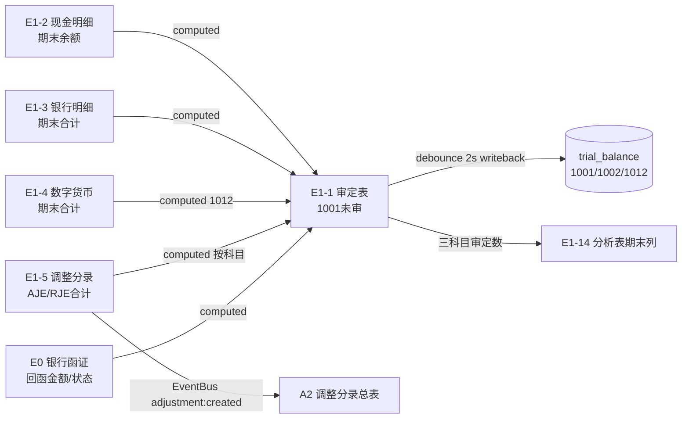

# Design Document: E1 货币资金专属组件

## Overview

**全新开发（非重构）**：E1当前无专属组件GtE1MonetaryFund.vue/useE1MonetaryFund.ts均不存在，全走wp_code_overrides的d-form-table/audit-sheet通用渲染。本spec从零建专属组件，参照D4/D5/D6模式。

E1货币资金循环专属组件，覆盖4个源xlsx模板的24个业务sheet（去除4个底稿目录）。采用D1应收票据已验证的架构模式：单主入口Vue组件(GtE1MonetaryFund.vue) + `sheetName` prop v-if分发 + `defineAsyncComponent` lazy load子组件。全sheet做HTML精美渲染，OnlyOffice仅作降级/偏好切换。

**与D1的关键差异（E1独有）**：
- 审定表项目行矩阵：E1-1按项目行(库存现金/银行存款本金/存放财务公司款项/…/合计/试算平衡差异)组织，审定数=未审数+账项调整(单列合并，非AJE/RJE四列)
- E0银行函证集成：函证列直接在E1-3明细表(回函确认金额/银行询证函索引号)，E1-1经E1-3汇入
- E1-3双variant：同名sheet两版（仅人民币 / 人民币及外币），外币版含原币/人民币双列+测算差异
- 外币折算：E1-2按币种折算、E1-8外币盘点、E1-20应计利息、E1-3外币版、E1-4数字货币均含汇率换算
- IPO/舞弊应对组含E26A程序表(a-program-console)+E1-26~32通过适用性开关控制可见性

**⚠️源模板结构校准(openpyxl实读2026-07-01)**：25个业务sheet(含IPO文件的E26A程序表)。审定表E1-1=项目行矩阵非3科目section；E1-2按币种非按日期；E1-5类别=报表调整/账项调整/其他非AJE/RJE。

**架构规模**：15个composable + 18个Vue子组件 + 1个后端导入导出端点。相似sheet合并为variant复用（见下表），避免过度拆分。E26A/E1A程序表复用a-program-console不新建组件。

### Sheet → 组件 → composable 映射（真实源模板）

| wp_code | Sheet名 | Vue组件 | composable | 类型 |
|---------|---------|---------|-----------|------|
| E1A | 货币资金实质性程序表 | (复用a-program-console) | — | 程序表 |
| E1-1 | 货币资金审定表 | E1TabAdjudication | useE1Adjudication | 审定表 |
| E1-2 | 现金明细表 | E1TabCashDetail | useE1CashDetail | 明细 |
| E1-3 | 银行存款明细表(双版) | E1TabBankDetail | useE1BankDetail | 明细(variant) |
| E1-4 | 数字货币明细表 | E1TabDigitalCurrency | useE1CashDetail(复用) | 明细 |
| E1-5 | 调整分录汇总 | E1TabAdjustment | useE1Adjustment | 调整分录 |
| E1-6 | 银行存款余额调节表 | E1TabReconciliation | useE1Reconciliation | 余额调节 |
| E1-7 | 库存现金(人民币)盘点表 | E1TabCashCount(variant:rmb) | useE1CashCount | 盘点 |
| E1-8 | 库存现金(外币)盘点表 | E1TabCashCount(variant:fx) | useE1CashCount | 盘点 |
| E1-9 | 银行存单盘点表 | E1TabCertificateCount | useE1CashCount(复用) | 盘点 |
| E1-10 | 已开立银行账户清单核对表 | E1TabAccountList | useE1AccountList | 核对 |
| E1-11 | 银行账户情况承诺 | E1TabAccountCommitment | (Vue内实现) | 承诺书 |
| E1-14 | 货币资金分析表 | E1TabAnalysis | useE1Analysis | 分析 |
| E1-15 | 利息收入月度分析 | E1TabInterestAnalysis | useE1InterestCalc(variant:monthly) | 分析 |
| E1-18 | 企业信用报告查询记录 | E1TabCreditReport(variant:query) | useE1CreditReport | 检查 |
| E1-19 | 企业信用报告核对记录 | E1TabCreditReport(variant:check) | useE1CreditReport | 检查 |
| E1-20 | 应计利息测算 | E1TabAccruedInterest | useE1InterestCalc(variant:accrued) | 检查 |
| E1-21 | 银行存款截止测试表 | E1TabCutoffTest(variant:bank) | useE1CutoffTest | 检查 |
| E1-22 | 其他货币资金截止测试表 | E1TabCutoffTest(variant:other) | useE1CutoffTest | 检查 |
| E1-23 | 货币资金收支检查情况表 | E1TabLargeCheck | useE1IpoSpecial(复用CRUD) | 检查 |
| E26A | IPO实质性程序表 | (复用a-program-console) | — | IPO程序表 |
| E1-26~32 | IPO/舞弊应对(7个) | E1TabIpoSpecial(sheetCode prop) | useE1IpoSpecial | IPO |
| 附注 | 附注披露(上市/国企) | E1TabDisclosure(variant) | (Vue内实现) | 附注 |

**编码说明**：E1-12/E1-13/E1-16/E1-17/E1-24/E1-25在致同2025修订版中不存在，requirements已删除对应虚构需求。

## Architecture

### 组件分发（GtE1MonetaryFund.vue）

```mermaid
graph TD
    GtE1[GtE1MonetaryFund.vue<br/>currentSheet computed from sheetName]
    GtE1 -->|E1-1| ADJ[E1TabAdjudication]
    GtE1 -->|E1-2| CASH[E1TabCashDetail]
    GtE1 -->|E1-3| BANK[E1TabBankDetail variant:rmb/multi]
    GtE1 -->|E1-4| DIGITAL[E1TabDigitalCurrency]
    GtE1 -->|E1-5| ADJUST[E1TabAdjustment]
    GtE1 -->|E1-6| RECON[E1TabReconciliation]
    GtE1 -->|E1-7,E1-8| COUNT[E1TabCashCount variant:rmb/fx]
    GtE1 -->|E1-9| CERT[E1TabCertificateCount]
    GtE1 -->|E1-10| ACCT[E1TabAccountList]
    GtE1 -->|E1-11| COMMIT[E1TabAccountCommitment]
    GtE1 -->|E1-14| ANALYSIS[E1TabAnalysis]
    GtE1 -->|E1-15| INTEREST[E1TabInterestAnalysis]
    GtE1 -->|E1-18,E1-19| CREDIT[E1TabCreditReport variant:query/check]
    GtE1 -->|E1-20| ACCRUED[E1TabAccruedInterest]
    GtE1 -->|E1-21,E1-22| CUTOFF[E1TabCutoffTest variant:bank/other]
    GtE1 -->|E1-23| LARGE[E1TabLargeCheck]
    GtE1 -->|E1-26~32| IPO[E1TabIpoSpecial sheetCode prop]
    GtE1 -->|附注| DISC[E1TabDisclosure variant:listed/soe]
    GtE1 -->|E1A/其他| OO[GtWpRenderer 默认]
```



### 跨Sheet数据流（allResponses computed链，不走API）



### 文件结构

```
frontend/src/components/workpaper/
├── GtE1MonetaryFund.vue              # 主入口(修改: sheetName v-if分发)
├── e1/
│   ├── E1TabAdjudication.vue         # E1-1 审定表 (~400行, 最复杂)
│   ├── E1TabCashDetail.vue           # E1-2 现金明细 (~250行)
│   ├── E1TabBankDetail.vue           # E1-3 银行明细 (~300行, dual variant)
│   ├── E1TabDigitalCurrency.vue      # E1-4 数字货币 (~200行)
│   ├── E1TabAdjustment.vue           # E1-5 调整分录 (~250行)
│   ├── E1TabReconciliation.vue       # E1-6 余额调节 (~300行)
│   ├── E1TabCashCount.vue            # E1-7/8 现金盘点 (~250行, variant)
│   ├── E1TabCertificateCount.vue     # E1-9 存单盘点 (~200行)
│   ├── E1TabAccountList.vue          # E1-10 账户核对 (~200行)
│   ├── E1TabAccountCommitment.vue    # E1-11 承诺书 (~150行)
│   ├── E1TabAnalysis.vue             # E1-14 分析 (~250行)
│   ├── E1TabInterestAnalysis.vue     # E1-15 利息分析 (~250行)
│   ├── E1TabCreditReport.vue         # E1-18/19 征信 (~200行, variant)
│   ├── E1TabAccruedInterest.vue      # E1-20 应计利息 (~300行)
│   ├── E1TabCutoffTest.vue           # E1-21/22 截止测试 (~200行, variant)
│   ├── E1TabLargeCheck.vue           # E1-23 收支检查 (~200行)
│   ├── E1TabIpoSpecial.vue           # E1-26~32 IPO组 (~350行, sheetCode分发)
│   └── E1TabDisclosure.vue           # 附注(上市/国企) (~300行, variant)
├── composables/
│   ├── useE1FormulaEngine.ts         # 纯函数公式引擎 (~120行)
│   ├── useE1Adjudication.ts          # E1-1 (~350行)
│   ├── useE1CashDetail.ts            # E1-2/E1-4 (~200行)
│   ├── useE1BankDetail.ts            # E1-3 (~220行)
│   ├── useE1Adjustment.ts            # E1-5 (~200行)
│   ├── useE1Reconciliation.ts        # E1-6 (~220行)
│   ├── useE1CashCount.ts             # E1-7/8/9 (~180行)
│   ├── useE1AccountList.ts           # E1-10 (~150行)
│   ├── useE1Analysis.ts              # E1-14 (~180行)
│   ├── useE1InterestCalc.ts          # E1-15/E1-20 (~200行, variant)
│   ├── useE1CutoffTest.ts            # E1-21/22 (~150行)
│   ├── useE1CreditReport.ts          # E1-18/19 (~150行)
│   ├── useE1IpoSpecial.ts            # E1-23/E1-26~32 (~200行)
│   ├── useE1DualMode.ts              # 双模式 (~80行, 复用D1)
│   └── useE1ImportExport.ts          # 导入导出 (~150行)

backend/app/routers/wp_render_strategies/
└── _e1_import_export.py              # 导入导出端点 (~200行)
```

## Components and Interfaces

### 通用Options接口

```typescript
export interface UseE1BaseOptions {
  wpId: Ref<string>
  projectId: Ref<string>
  allResponses: Ref<Map<string, ChecklistResponse>>
  saveImmediate: SaveFn
  debouncedSave: SaveFn
  isReadonly: Ref<boolean>
  bsDate?: Ref<string>              // 资产负债表日（截止测试用）
}
export type SaveFn = (items: ChecklistItem[]) => Promise<void>
```

### 1. useE1FormulaEngine.ts — 纯函数（供PBT）

```typescript
export function parseNum(val: unknown): number
export function calcAudited(unadjusted: number, adjustment: number): number  // = unadjusted + adjustment（真实模板：审定数=未审数+账项调整单列）
export function calcChange(endingAudited: number, openingAudited: number): number  // = ending - opening
export function calcChangeRate(change: number, openingAudited: number): number | ''  // 模板口径:opening=0&ending=0→0; opening=0&ending>0→1; else change/opening
export function calcCashBalance(opening: number, increase: number, decrease: number): number  // E1-2/E1-4: = opening + increase - decrease
export function calcReconciled(base: number, addItems: number, subItems: number): number  // E1-6: = base + 已收未收 - 已付未付
export function calcAccruedInterest(fcAmount: number, days: number, dailyRate: number): number  // E1-20: = 原币金额 × 天数 × 日利率
export function calcFxConvert(fcAmount: number, rate: number): number  // = fcAmount * rate 外币折算(E1-2/E1-3/E1-4/E1-8/E1-20)
export function calcCountDiff(actual: number, book: number): number  // 盘点差异 = 实盘 - 账面
export function sumField(rows: Array<Record<string, unknown>>, field: string): number
export function exceedsThreshold(rate: number | '', threshold: number): boolean  // |rate| > threshold; ''→false
export function isBalanced(rows: Array<Record<string, unknown>>, debitField: string, creditField: string): boolean  // E1-5: Σ借 === Σ贷
export function serializeRows<T>(rows: T[], userFields: string[]): string
export function deserializeRows(json: string, recompute: (r: any) => any): any[]
```

### 2. useE1Adjudication.ts — 审定表E1-1（核心）

```typescript
// 真实模板：项目行矩阵（非按1001/1002/1012三section）；审定数=未审数+账项调整(单列)
export interface AdjRow {
  itemKey: string                 // 'cash'|'bank_principal'|'finance_co'|'bank_institution'|'other_mf'|'digital'|'accrued_interest'|'total'|'overseas'|'tb_amount'|'diff'
  itemName: string
  accountCode?: '1001' | '1002' | '1012'   // 归集回写TB用（部分行有）
  openingUnaudited: number        // 期初未审 跨sheet computed(E1-2/E1-3/E1-4)
  openingAdjustment: number       // 期初账项调整 跨sheet computed(E1-5按项目)
  openingAudited: number          // computed = calcAudited(openingUnaudited, openingAdjustment)
  endingUnaudited: number         // 期末未审 跨sheet computed
  endingAdjustment: number        // 期末账项调整 跨sheet computed(E1-5)
  endingAudited: number           // computed = calcAudited(endingUnaudited, endingAdjustment)
  changeAmount: number            // computed = calcChange(endingAudited, openingAudited)
  changeRate: number | ''         // computed = calcChangeRate(...)
  varianceNote: string
  isSubtotal?: boolean; isReadonly?: boolean
}
export function useE1Adjudication(options: UseE1BaseOptions) {
  return {
    rows: ComputedRef<AdjRow[]>,             // 固定项目行矩阵
    totalRow: ComputedRef<AdjRow>,           // 合计行
    tbAmountRow: Ref<AdjRow>,                // 试算平衡表数（auto_source: trial_balance）
    diffRow: ComputedRef<AdjRow>,            // 差异数 = 合计审定 - TB数
    crossSheetStatus: Ref<'loaded'|'loading'|'error'>,
    updateCell, saveVarianceNote, aiGenerateNote,
    writebackTrialBalance,   // debounce 2s，按accountCode归集(1001/1002/1012)
    isLoading, hydrate,
  }
}
```

> 银行账户维度与函证核对实际在 **E1-3明细表**（useE1BankDetail），非E1-1；E1-1银行存款行仅从E1-3分组合计取数。

### 3. useE1InterestCalc.ts — 利息计算（E1-15月度 + E1-20应计，variant复用）

```typescript
// variant='monthly' (E1-15): 12月×存款类型矩阵, 每月测算利息=月均余额×月利率, 差异=测算-账面
// variant='accrued' (E1-20): 按账户明细, 应计利息=本金×日利率×天数, 含外币折算(×汇率→人民币)
export function useE1InterestCalc(options: UseE1BaseOptions & { variant: 'monthly' | 'accrued' })
```

### 4. useE1IpoSpecial.ts — 通用CRUD（E1-23 + E1-26~32，sheetCode配置驱动）

```typescript
// sheetCode决定列定义(COLUMN_CONFIG[sheetCode])，CRUD/序列化/保存逻辑完全复用
export function useE1IpoSpecial(options: UseE1BaseOptions & { sheetCode: string })
const COLUMN_CONFIG: Record<string, ColumnDef[]> = {
  'E1-23': [...], 'E1-26': [...], 'E1-27': [...], 'E1-28': [...],
  'E1-29': [...], 'E1-30': [...], 'E1-31': [...], 'E1-32': [...],
}
```

## Data Models

### item_id命名规范

| Sheet | item_id前缀/key | 存储 |
|-------|----------------|------|
| E1-1审定表 | E1-adj-{itemKey}-* | 各项目行字段独立(opening/ending × unaudited/adjustment/note) |
| E1-2现金明细 | E1-cash-detail-rows | remark=JSON数组(按币种) |
| E1-3银行明细 | E1-bank-detail-rows | remark=JSON数组 + E1-bank-variant(rmb/multi) + 含函证列 |
| E1-4数字货币 | E1-digital-rows | remark=JSON数组 |
| E1-5调整分录 | E1-adjustment-rows | remark=JSON数组 |
| E1-6余额调节 | E1-reconciliation-rows | remark=JSON数组 |
| E1-7现金盘点RMB | E1-cash-count-rmb-rows | remark=JSON数组 |
| E1-8现金盘点外币 | E1-cash-count-fx-rows | remark=JSON数组 |
| E1-9存单盘点 | E1-cert-count-rows | remark=JSON数组 |
| E1-10账户核对 | E1-account-list-rows | remark=JSON数组 |
| E1-11承诺书 | E1-account-commit-* | 独立字段(conclusion=签字Y/N) |
| E1-14分析 | E1-analysis-rows | remark=JSON数组 |
| E1-15利息分析 | E1-interest-monthly-rows | remark=JSON数组 |
| E1-18/19征信 | E1-credit-query-rows / E1-credit-check-rows | remark=JSON数组 |
| E1-20应计利息 | E1-accrued-interest-rows | remark=JSON数组 |
| E1-21/22截止 | E1-cutoff-bank-rows / E1-cutoff-other-rows | remark=JSON数组 |
| E1-23收支检查 | E1-large-check-rows | remark=JSON数组 |
| E1-26~32 IPO | E1-ipo-{code}-rows | remark=JSON数组 |
| IPO适用性开关 | E1-ipo-applicable | conclusion=Y/N |
| 跨Spec写出 | E1-adj-total-1001/1002/1012 | remark=数值字符串 |

### 跨Spec数据契约

| 方向 | key | 用途 |
|------|-----|------|
| 读入 | E0函证相关item_id(含bank/confirm前缀) | E1-3银行明细回函确认金额/函证状态 |
| 读入 | 含materiality前缀 | E1-15利息差异阈值判断 |
| 写出 | E1-adj-total-1001/1002/1012 | 三科目审定合计(供报表/附注引用) |
| 写出 | trial_balance.audited_amount(1001/1002/1012) | writeback回写 |
| EventBus | adjustment:created | E1-5→A2调整分录总表 |
| EventBus | confirmation:received | E0→E1-1函证状态刷新 |

## Correctness Properties

### Property 1: 审定数公式
*For any* (unadjusted, adjustment) reals, `calcAudited` === unadjusted + adjustment. **Validates: R1.2**

### Property 2: 变动额/变动率（模板口径）
*For any* (endingAudited, openingAudited), `calcChange` === ending - opening; `calcChangeRate`: opening=0&ending=0→0, opening=0&ending>0→1, else change/opening. **Validates: R1.3**

### Property 3: 现金/数字货币余额链式
*For any* (opening, increase, decrease), `calcCashBalance` === opening + increase - decrease. **Validates: R3.2, R14.2**

### Property 4: 调节后余额
*For any* (base, addItems, subItems), `calcReconciled` === base + addItems - subItems. **Validates: R6.2, R6.3**

### Property 5: 应计利息
*For any* (fcAmount≥0, days≥0, dailyRate≥0), `calcAccruedInterest` === fcAmount × days × dailyRate. **Validates: R10.3**

### Property 6: 外币折算
*For any* (fcAmount, rate≥0), `calcFxConvert` === fcAmount × rate. **Validates: R3.2, R4.5, R7.2, R10.3, R14.2**

### Property 7: 盘点差异
*For any* (actual, book), `calcCountDiff` === actual - book. **Validates: R7.4**

### Property 8: 数组求和不变量
*For any* array of objects with numeric field, `sumField(rows, field)` === Σ rows[i][field]. **Validates: R3.3, R4.7, R5.2**

### Property 9: 超阈值判定
*For any* (rate: real, threshold>0), `exceedsThreshold` === |rate| > threshold; rate='' → false. **Validates: R1.4, R9.3**

### Property 10: 动态行增删计数
*For any* rows length N, addRow→N+1; removeRow(valid i)→N-1; removeRow(invalid)→N. **Validates: R3.4, R4.6**

### Property 11: JSON Round-Trip
*For any* valid row array, deserialize(serialize(rows)) preserves user-input fields; computed fields recomputed consistently. **Validates: R13.4**

### Property 12: 借贷平衡校验
*For any* adjustment rows, `isBalanced` === (Σ借方调整 === Σ贷方调整). **Validates: R5.2**

## Error Handling

| 场景 | 处理 |
|------|------|
| 跨sheet key不存在(E1-2/3/4/5未填) | E1-1对应列显示"-"占位+黄色⚠️；未审=0 |
| E0函证数据未加载 | 函证徽章显示灰色"未发函"；confirmDiff不计算 |
| 函证差异≠0 | 橙色高亮+强制填写差异原因 |
| 变动率上年审定=0 | 显示"—"（不计算比例） |
| 盘点差异≠0 | 橙色高亮+强制填写差异原因 |
| 余额调节差异≠0 | 红色高亮+强制填写差异原因 |
| 外币汇率缺失 | 折算列显示"-"+提示"请填写汇率" |
| 行JSON解析失败 | 回退空数组[]+console.warn |
| 导入列数不符/缺section | 400+列名差异列表 |
| OnlyOffice不可用 | 禁用"在线编辑"+tooltip |
| 金额为零 | 显示"-" |
| IPO组未启用 | 隐藏E1-26~32 Tab |

## Testing Strategy

| 类型 | 范围 | 框架 |
|------|------|------|
| PBT | P1-P12 纯函数+动态行+JSON | fast-check numRuns:100 |
| Unit | 各composable业务逻辑、跨sheet mock、variant切换 | vitest |
| Backend | 导入导出round-trip、模板校验、列名篡改400 | hypothesis max_examples:5 |
| Integration | E1-2→E1-1联动、E1-5→E1-1 AJE联动、函证核对 | vitest + mock allResponses |

### PBT标签规范
`Feature: e1-monetary-fund-refactor, Property N: {描述}`

## Performance & Security

- 明细表>50行启用el-table max-height纵向滚动
- 编辑debounce 2s保存；跨sheet computed天然响应无需额外防抖
- isReadonly控制编辑权限；导入科目编码白名单(1001/1002/1012)
- 外部内容(导入数据)按不可信处理，数值parseNum净化
