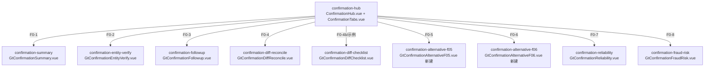

# Design Document: F0 存货循环函证模块

## Overview

F0存货循环函证模块对齐D0实际架构：**复用D0共享函证组件** + **新建F0-5/F0-6替代程序组件**。

D0函证模块已验证架构：9个跨循环共享componentType + confirmation-hub统一入口。F0/E0/G0/H0/K0/L0全部通过overrides映射复用，不为每个循环重复开发。

**F0唯一需要新建的**：
- `confirmation-alternative-f05`：预付账款/采购替代程序（4区块按预付账款科目）
- `confirmation-alternative-f06`：应付票据/应付账款/采购替代程序（4区块按应付账款科目）

参照D0-5(GtConfirmationAlternativeD05)和D0-6(GtConfirmationAlternativeD06)的模式，F0-5/F0-6结构完全相同，只是4区块的检查内容按科目不同。

## Architecture

### D0共享函证架构（F0直接复用）



### 文件结构（仅新建部分）

```
audit-platform/frontend/src/components/workpaper/confirmation/
├── alternativeF05/
│   └── GtConfirmationAlternativeF05.vue    # 新建 (~350行, 参照D05)
├── alternativeF06/
│   └── GtConfirmationAlternativeF06.vue    # 新建 (~350行, 参照D06)
└── ... (D0已有的shared目录不动)
```

### F0-5 替代程序4区块设计

参照D0-5模式，F0-5的4区块为预付账款科目：

| 区块 | 标题 | 列定义 |
|------|------|--------|
| ① | 预付账款期后收货检查 | 序号/日期/凭证号/供应商/收货内容/金额/索引号/结论 |
| ② | 预付账款期末余额支持性证据 | 序号/合同号/供应商/合同金额/已付款/期末余额/证据描述/索引号/结论 |
| ③ | 预付账款本期付款检查 | 序号/日期/凭证号/供应商/付款金额/银行回单/索引号/结论 |
| ④ | 预付账款本期采购证据 | 序号/日期/凭证号/供应商/采购内容/金额/发票/索引号/结论 |

### F0-6 替代程序4区块设计

| 区块 | 标题 | 列定义 |
|------|------|--------|
| ① | 应付账款期后付款检查 | 序号/日期/凭证号/供应商/付款金额/银行回单/索引号/结论 |
| ② | 应付账款期末余额支持性证据 | 序号/供应商/应付金额/对账单/入库单/发票/索引号/结论 |
| ③ | 应付账款本期采购检查 | 序号/日期/凭证号/供应商/采购内容/金额/合同/索引号/结论 |
| ④ | 应付账款本期入库证据 | 序号/日期/入库单号/供应商/品名/数量/金额/验收签字/索引号/结论 |

### 组件接口（参照D0-5/D0-6）

```typescript
// GtConfirmationAlternativeF05/F06 props（与D05/D06完全一致）
interface Props {
  wpId: string
  projectId: string
  confirmationData: ConfirmationMasterData[]  // 从hub传入的未回函公司列表
  isReadonly: boolean
}

// 4区块配置
const BLOCKS_F05 = [
  { key: 'post_receipt', title: '预付账款期后收货检查', columns: [...] },
  { key: 'balance_evidence', title: '预付账款期末余额支持性证据', columns: [...] },
  { key: 'payment_check', title: '预付账款本期付款检查', columns: [...] },
  { key: 'purchase_evidence', title: '预付账款本期采购证据', columns: [...] },
]

const BLOCKS_F06 = [
  { key: 'post_payment', title: '应付账款期后付款检查', columns: [...] },
  { key: 'balance_evidence', title: '应付账款期末余额支持性证据', columns: [...] },
  { key: 'purchase_check', title: '应付账款本期采购检查', columns: [...] },
  { key: 'receipt_evidence', title: '应付账款本期入库证据', columns: [...] },
]
```

## Data Models

### 持久化（与D0-5/D0-6模式一致）

item_id前缀：`F0-5-alt-{entity_id}-block{N}-rows` / `F0-6-alt-{entity_id}-block{N}-rows`

存储在checklist_responses.remark (JSON数组)。

## Testing Strategy

| 类型 | 范围 | 框架 |
|------|------|------|
| Unit | F05/F06 4区块列配置+CRUD | vitest |
| Contract | VALID_COMPONENT_TYPES + htmlRendererRegistry包含f05/f06 | vitest |
| Integration | confirmation-hub路由到F0-5/F0-6 | vitest mock |
