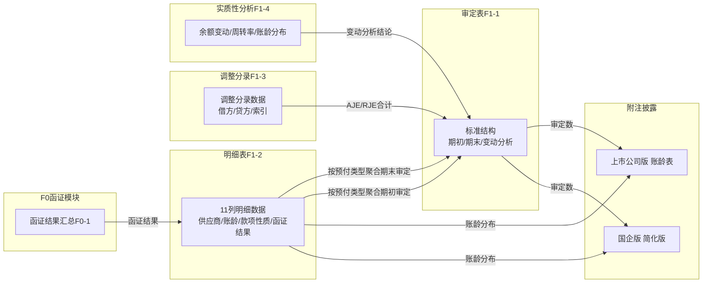

# Design Document: F1 预付账款底稿专属HTML精美组件

## Overview

将F1预付账款底稿从通用`univer`渲染升级为独立专属组件`f1-prepayment`。覆盖源模板11个有效sheet（程序表F1A + 审定表F1-1 + 明细表F1-2 + 调整分录F1-3 + 实质性分析F1-4 + 长期挂款检查F1-5 + 关联方检查F1-6 + 综合检查F1-7 + 附注上市 + 附注国企 + 函证程序表G1A-修订前），合计约320个公式。

核心设计目标：
- 新 componentType `f1-prepayment`，主入口 GtF1Prepayment.vue（el-tabs 10个tab-pane）
- 每个sheet独立子组件（150-300行）+ 独立composable
- 共享纯函数公式引擎 useF1FormulaEngine.ts（借方科目：期末=期初+借方-贷方；审定数=未审+AJE+RJE；变动额=期末审定-期初审定）
- 标准审定表结构（期初/期末+变动分析），无复杂区块
- 11列明细表（含账龄/款项性质/函证结果），核心数据源
- 跨sheet数据流通过 allResponses Map computed 响应式链（不走API）
- 明细表→审定表聚合、调整分录→审定表聚合、实质性分析→审定表支撑
- 长期挂款检查（账龄1年以上大额预付）、关联方交易检查、综合检查（合同/发票/入库/付款凭证核对）
- 附注披露（上市公司账龄表/国企简化版）
- 与F0存货循环函证联动（预付账款函证）
- 双模式（HTML ↔ OnlyOffice）+ 导入导出三级 + AI审计说明

科目特征：1123借方科目/资产类。核心特色：标准审定表结构、11列明细表、长期挂款检查、关联方检查、综合检查、与F0函证联动。F循环中等复杂度底稿。

## Architecture

### 组件依赖关系

```mermaid
graph TD
    subgraph "GtF1Prepayment.vue (主入口)"
        MAIN[el-tabs 10 tab-pane]
    end

    subgraph "子组件 (10个)"
        PROC[F1TabProcedure.vue<br/>程序表F1A ~200行]
        ADJ[F1TabAdjudication.vue<br/>审定表F1-1 ~300行]
        DET[F1TabDetail.vue<br/>明细表F1-2 ~300行]
        AJE[F1TabAdjustment.vue<br/>调整分录F1-3 ~200行]
        ANALYSIS[F1TabSubstantiveAnalysis.vue<br/>实质性分析F1-4 ~250行]
        LONG[F1TabLongTermCheck.vue<br/>长期挂款F1-5 ~250行]
        REL[F1TabRelatedParty.vue<br/>关联方检查F1-6 ~250行]
        COMP[F1TabComprehensiveCheck.vue<br/>综合检查F1-7 ~300行]
        DISC[F1TabDisclosure.vue<br/>附注披露 ~250行]
        CONF[F1TabConfirmationProcedure.vue<br/>函证程序G1A ~200行]
    end

    subgraph "Composables (10个)"
        USE_DATA[useF1FormData.ts<br/>数据加载/保存 ~200行]
        USE_FORMULA[useF1FormulaEngine.ts<br/>纯函数公式引擎 ~150行]
        USE_CROSS[useF1CrossSheet.ts<br/>跨sheet联动 ~200行]
        USE_ADJ[useF1Adjudication.ts ~250行]
        USE_DET[useF1Detail.ts ~250行]
        USE_AJE[useF1Adjustment.ts ~150行]
        USE_ANALYSIS[useF1SubstantiveAnalysis.ts ~200行]
        USE_LONG[useF1LongTermCheck.ts ~150行]
        USE_REL[useF1RelatedParty.ts ~150行]
        USE_DISC[useF1Disclosure.ts ~200行]
    end

    subgraph "已有基础设施 (复用)"
        EVENT_BUS[EventBus]
        DISPLAY[displayPrefs.fmtAmount]
        OO[GtOnlyOfficeSheet.vue]
        REVIEW[openReviewDialog]
        INDEX_CHIP[GtIndexChip]
        PROGRAM[GtAProgramConsole]
    end

    MAIN --> PROC & ADJ & DET & AJE & ANALYSIS & LONG & REL & COMP & DISC & CONF

    PROC --> PROGRAM
    ADJ --> USE_ADJ --> USE_FORMULA & USE_DATA & USE_CROSS & EVENT_BUS
    DET --> USE_DET --> USE_FORMULA & USE_DATA
    AJE --> USE_AJE --> USE_DATA & EVENT_BUS
    ANALYSIS --> USE_ANALYSIS --> USE_FORMULA & USE_DATA & USE_CROSS
    LONG --> USE_LONG --> USE_DATA & USE_DET
    REL --> USE_REL --> USE_DATA & USE_DET
    COMP --> USE_DATA & USE_DET
    DISC --> USE_DISC --> USE_DATA & USE_CROSS
    CONF --> USE_DATA

    USE_CROSS -.->|F1-2→F1-1未审聚合| USE_ADJ
    USE_CROSS -.->|F1-3→F1-1调整聚合| USE_ADJ
    USE_CROSS -.->|F1-4→F1-1分析支撑| USE_ADJ
    USE_CROSS -.->|F0→F1-2函证联动| USE_DET
    USE_CROSS -.->|F1-1→附注| USE_DISC
    USE_CROSS -.->|F1-2→附注| USE_DISC
```



### 文件结构

```
audit-platform/frontend/src/components/workpaper/
├── GtF1Prepayment.vue                      # 主入口 el-tabs（~150行）
├── f1/                                      # 新增目录
│   ├── F1TabProcedure.vue                  # 程序表F1A（~200行）
│   ├── F1TabAdjudication.vue               # 审定表F1-1（~300行）
│   ├── F1TabDetail.vue                     # 明细表F1-2（~300行）
│   ├── F1TabAdjustment.vue                 # 调整分录F1-3（~200行）
│   ├── F1TabSubstantiveAnalysis.vue         # 实质性分析F1-4（~250行）
│   ├── F1TabLongTermCheck.vue              # 长期挂款F1-5（~250行）
│   ├── F1TabRelatedParty.vue               # 关联方检查F1-6（~250行）
│   ├── F1TabComprehensiveCheck.vue         # 综合检查F1-7（~300行）
│   ├── F1TabDisclosure.vue                 # 附注披露（~250行）
│   └── F1TabConfirmationProcedure.vue       # 函证程序G1A（~200行）
├── composables/
│   ├── useF1FormData.ts                    # 数据加载/保存基础（~200行）
│   ├── useF1FormulaEngine.ts               # 纯函数公式引擎（~150行）
│   ├── useF1CrossSheet.ts                  # 跨sheet联动computed（~200行）
│   ├── useF1Adjudication.ts                # 审定表逻辑（~250行）
│   ├── useF1Detail.ts                      # 明细表11列逻辑（~250行）
│   ├── useF1Adjustment.ts                  # 调整分录逻辑（~150行）
│   ├── useF1SubstantiveAnalysis.ts         # 实质性分析逻辑（~200行）
│   ├── useF1LongTermCheck.ts               # 长期挂款逻辑（~150行）
│   ├── useF1RelatedParty.ts                # 关联方检查逻辑（~150行）
│   └── useF1Disclosure.ts                 # 附注披露逻辑（~200行）

backend/app/routers/wp_render_strategies/
│   ├── _f1_import_export.py                # 导入导出端点（~200行）
│   ├── _f1_resolvers.py                    # Auto Data Resolver（~100行）
│   ├── _f1_ai_generate.py                  # AI生成端点（~150行）
│   └── _f1_prepayment.py                   # Render策略函数（~100行）
```

### 跨Sheet数据流（明细表→审定表→附注联动链）



### 审定表内部结构


### 明细表字段映射


## ComponentType注册

### wp_code_overrides.json配置

```json
{
  "f1-prepayment": {
    "wp_codes": ["F1", "F1-1", "F1-2", "F1-3", "F1-4", "F1-5", "F1-6", "F1-7"],
    "componentType": "f1-prepayment",
    "description": "F1预付账款底稿专属组件"
  }
}
```

### htmlRendererRegistry.ts注册

```typescript
htmlRendererRegistry.register('f1-prepayment', () => ({
  component: markRaw(GtF1Prepayment),
  props: defineComponentProps({
    htmlData: Object,
    workpaperId: String,
    readonly: Boolean
  })
}))
```

### VALID_COMPONENT_TYPES注册

```python
# wp_classification_service.py
VALID_COMPONENT_TYPES = [
    # ... 其他类型
    'f1-prepayment',
]
```

## 数据结构设计

### 审定表数据结构

```typescript
interface AdjudicationRow {
  rowKey: string              // 预付类型：'prepayment_goods' | 'prepayment_service' | 'prepayment_rent' | 'other'
  label: string               // 显示名称：'预付货款' | '预付服务费' | '预付租金' | '其他预付款'
  openingUnadjusted: number   // 期初未审数
  openingAdjustment: number    // 期初账项调整
  openingReclassification: number // 期初重分类调整
  openingAudited: number      // 期初审定数
  closingUnadjusted: number   // 期末未审数
  closingAdjustment: number    // 期末账项调整
  closingReclassification: number // 期末重分类调整
  closingAudited: number      // 期末审定数
  changeAmount: number        // 变动额
  changeRate: string          // 变动率（带%）
  explanation: string          // 原因分析
  isDynamic: boolean          // 是否为动态行
  isTotal: boolean            // 是否为合计行
}
```

### 明细表数据结构

```typescript
interface DetailRow {
  id: string                  // 行ID
  supplierName: string        // 供应商名称
  openingBalance: number      // 期初余额
  increase: number            // 本期增加
  decrease: number            // 本期减少
  closingBalance: number      // 期末余额
  aging: string               // 账龄：'within_1_year' | '1_2_years' | '2_3_years' | 'over_3_years'
  nature: string              // 款项性质：'goods' | 'service' | 'rent' | 'deposit' | 'other'
  auditAdjustment: number      // 审计调整
  closingAudited: number      // 期末审定数
  confirmationResult: string  // 函证结果：'sent' | 'received' | 'discrepancy' | 'no_response' | 'alternative'
  remark: string              // 备注
  isRelatedParty: boolean     // 是否关联方（来自F1-6）
  isLongTerm: boolean         // 是否长期挂款（来自F1-5）
}
```

### 调整分录数据结构

```typescript
interface AdjustmentRow {
  id: string                  // 行ID
  description: string         // 调整事项说明
  accountName: string         // 科目名称
  debit: number               // 借方金额
  credit: number              // 贷方金额
  indexRef: string            // 索引号
  remark: string              // 备注
}
```

## 公式引擎设计

### 核心公式函数

```typescript
// useF1FormulaEngine.ts
export const parseNum = (value: any): number => {
  if (value === null || value === undefined || value === '' || isNaN(value)) return 0
  if (value === Infinity || value === -Infinity) return 0
  return Number(value)
}

export const calcEndUnadjustedDebit = (
  priorAudited: number,
  debit: number,
  credit: number
): number => {
  return priorAudited + debit - credit
}

export const calcAuditedAmount = (
  unadjusted: number,
  aje: number,
  rje: number
): number => {
  return unadjusted + aje + rje
}

export const calcChangeAmount = (
  closingAudited: number,
  openingAudited: number
): number => {
  return closingAudited - openingAudited
}

export const calcChangeRate = (
  closingAudited: number,
  openingAudited: number
): string => {
  if (openingAudited === 0 && closingAudited === 0) return ''
  if (openingAudited === 0) return 'N/A'
  const rate = (closingAudited - openingAudited) / openingAudited
  return `${(rate * 100).toFixed(2)}%`
}

export const isChangeRateExceeding = (
  rateStr: string,
  threshold: number = 0.3
): boolean => {
  if (rateStr === '' || rateStr === 'N/A') return false
  const rate = parseFloat(rateStr.replace('%', '')) / 100
  return Math.abs(rate) > threshold
}

export const calcSubtotal = (values: number[]): number => {
  return values.reduce((sum, val) => sum + parseNum(val), 0)
}

export const calcBookValue = (
  balance: number,
  impairment: number
): number => {
  return balance - impairment
}

export const calcTurnoverRate = (
  costOfSales: number,
  avgPrepayment: number
): number => {
  if (avgPrepayment === 0) return 0
  return costOfSales / avgPrepayment
}

export const calcTurnoverDays = (turnoverRate: number): number => {
  if (turnoverRate === 0) return 0
  return 365 / turnoverRate
}

export const calcPercentage = (
  value: number,
  total: number
): string => {
  if (total === 0) return '0.00%'
  return `${((value / total) * 100).toFixed(2)}%`
}
```

## 跨Sheet联动设计

### useF1CrossSheet.ts核心逻辑

```typescript
export const useF1CrossSheet = (allResponses: Ref<Map<string, any>>) => {
  // 明细表→审定表聚合
  const originalValueAggregation = computed(() => {
    const detailRows = allResponses.value.get('F1-detail-rows')
    if (!detailRows) return {}
    
    const aggregation: Record<string, { opening: number, closing: number }> = {}
    
    detailRows.forEach((row: DetailRow) => {
      const key = mapNatureToRowKey(row.nature) // 款项性质→预付类型映射
      if (!aggregation[key]) {
        aggregation[key] = { opening: 0, closing: 0 }
      }
      aggregation[key].opening += parseNum(row.openingBalance)
      aggregation[key].closing += parseNum(row.closingBalance)
    })
    
    return aggregation
  })

  // 调整分录→审定表聚合
  const adjustmentAggregation = computed(() => {
    const adjustmentRows = allResponses.value.get('F1-adjustment-rows')
    if (!adjustmentRows) return { ajeDebit: 0, ajeCredit: 0, rjeDebit: 0, rjeCredit: 0 }
    
    return adjustmentRows.reduce((acc, row: AdjustmentRow) => {
      if (row.accountName === '1123预付账款') {
        acc.ajeDebit += parseNum(row.debit)
        acc.ajeCredit += parseNum(row.credit)
      }
      return acc
    }, { ajeDebit: 0, ajeCredit: 0, rjeDebit: 0, rjeCredit: 0 })
  })

  // 函证结果联动
  const confirmationResults = computed(() => {
    const f0Results = allResponses.value.get('F0-confirmation-results')
    if (!f0Results) return {}
    
    return f0Results.reduce((acc, result) => {
      if (result.accountType === '预付账款') {
        acc[result.supplierName] = result.result
      }
      return acc
    }, {} as Record<string, string>)
  })

  return {
    originalValueAggregation,
    adjustmentAggregation,
    confirmationResults
  }
}
```

## 性能优化策略

### 虚拟滚动
- 明细表行数>100时启用虚拟滚动
- 使用 `el-table-v2` 或自定义虚拟滚动组件
- 只渲染可视区域内的行

### Debounce计算
- 跨sheet计算启用2秒debounce
- 用户停止编辑后才触发重算
- 避免频繁的computed重新计算

### 缓存策略
- 公式计算结果缓存
- 相同输入不重复计算
- 使用Map缓存计算结果

## AI生成设计

### AI生成端点

```python
# backend/app/routers/wp_render_strategies/_f1_ai_generate.py
@router.post("/f1/ai-generate/explanation")
async def generate_explanation(
    request: AIExplanationRequest,
    current_user: User = Depends(get_current_user)
):
    """AI生成审定表变动原因说明"""
    context = {
        "adjudication_data": request.adjudication_data,
        "detail_data": request.detail_data,
        "change_amount": request.change_amount,
        "change_rate": request.change_rate
    }
    explanation = await ai_service.generate_explanation(context)
    return {"explanation": explanation}
```

### AI生成类型
1. 变动原因说明（审定表）
2. 长期挂款分析（长期挂款检查）
3. 实质性分析结论（实质性分析）
4. 关联方识别（关联方检查）

## 测试策略

### 单元测试
- 公式引擎纯函数测试（PBT）
- composable逻辑测试
- 组件渲染测试

### 集成测试
- 跨sheet联动测试
- 数据流测试
- 公式计算测试

### E2E测试
- 完整用户流程测试
- 导入导出测试
- AI生成测试
