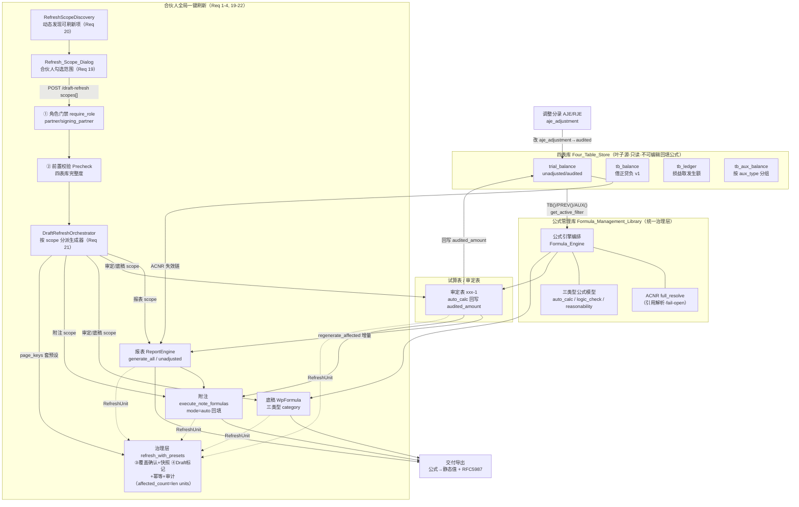

# 设计文档：公式管理库（Formula Management Library）

## Overview

公式管理库是覆盖审计平台**全链路**（四表库 → 试算表/审定表 → 底稿 → 调整分录 → 报表 → 附注 → 交付）的**统一公式治理层**。它不新建一套平行引擎，而是把已存在的分散能力收敛到三条统一语义之下：

1. **三类型公式统一模型**：以 `formula_type ∈ {auto_calc, logic_check, reasonability}` 作为单一分类维度，把已实现的自动运算（`WpFormula` / `ReportFormulaParser` / `execute_note_formulas`）、零散硬编码的逻辑判断（`useReportCrossCheck` 7 条勾稽 / balance-check）、几乎缺失的合理性提示，统一为可定义、可弹窗编辑、可保存、可执行、可复用的公式实体。
   - `auto_calc`：计算并**回填值**到目标单元。
   - `logic_check`：产出 **Issue_List（问题清单）**，**绝不改值**。
   - `reasonability`：产出 **Hint_List（提醒清单）**，**绝不改值**。

2. **合伙人专属一键刷新编排器（Draft Refresh Service）**：把当前 `wp_render_config.py` 的 `refresh_audit_sheet_from_ledger`（仅 `Depends(get_current_user)`，无角色限制）收敛为**合伙人专属**（`partner` / `signing_partner`）的角色门禁编排器，补齐初稿（Draft）语义标记、幂等、四表库前置校验、审计留痕（不可篡改）、覆盖团队编辑前确认与可回滚快照，并提供"从四表库未审数一键生成未审报表 + 底稿 + 附注初稿"的统一入口。

3. **前端统一体验**：一个统一的 `Formula_Edit_Dialog` 编辑三类型公式（按类型显示差异字段），一个统一的 `Formula_Source_Tooltip`（虚线下划线 + `cursor:help`，展示表达式 + 来源地址 + 最近计算时间）贯穿底稿/报表/附注三处。

### 与 ACNR 的边界（引用而非重写）

本 spec **不重写**地址解析、选址器组件与 `NoteFormulaDialog` 修复，全部**引用协调**：

| 能力 | 归属 | 本 spec 的动作 |
|------|------|----------------|
| 公式引用地址解析 | ACNR `full_resolve`（`backend/app/services/acnr/resolver.py:253`） | 调用，不新建解析器 |
| 公式引用校验路径 | `acnr-consumer-wiring` Req 9（Formula Validation Consumers → ACNR full_resolve） | 复用校验路径，不新增并行校验 |
| 公式选址器数据源迁移 | `acnr-consumer-wiring` Req 14（Formula Pickers → ACNR Data Source） | `Formula_Edit_Dialog` 消费其产出的候选地址 |
| `NoteFormulaDialog` 加载/编辑/持久化修复 | `acnr-consumer-wiring` Req 15（Formula Management Dialog Load/Edit/Persist Fix） | 协调复用其修复成果，不在本 spec 重写 |

本 spec 聚焦**公式管理三能力（编辑 / 计算 / 保存）的语义统一与全链路契约**。

### 技术栈

- 后端：Python 3.12 + FastAPI + asyncpg + SQLAlchemy（async）。工程铁律：service 只 `flush` 不 `commit`，router 层 `commit`。
- 前端：TypeScript + Vue 3 + Element Plus。
- 迁移：运行时 SQL 迁移（`backend/migrations/V*.sql`），当前最高 **V099**，本 spec 新增 **V100**（见 Data Models）。

---

## Architecture

### 全链路数据流与三类型公式的运行位置



### 三类型公式的运行位置说明

| 公式类型 | 作用 | 运行位置 | 现有引擎映射 |
|----------|------|----------|--------------|
| `auto_calc` | 求值并回填目标单元值 | 审定表回写 audited、底稿单元、报表行、附注 auto 单元 | `ReportFormulaParser.execute` / `WpFormula` 求值 / `execute_note_formulas`（`vertical_sum` 等） |
| `logic_check` | 条件不通过 → 追加 Issue_List，**不改值** | 报表跨表勾稽、底稿校验、审定表平衡校验 | 收编 `useReportCrossCheck` 7 条硬编码勾稽 / `balance-check`，改为可编辑公式 |
| `reasonability` | 触发条件成立 → 追加 Hint_List，**不改值** | 底稿/报表/附注合理性提示 | 新建轻量执行器（平台当前几乎缺失） |

### 分层职责

1. **公式定义层**：统一 `formula_type` 分类，统一 `Formula_Edit_Dialog` 编辑，统一持久化契约。
2. **引用解析层**：所有引用一律经 ACNR `full_resolve`（fail-open），**禁止**在公式中拼接 `wp_code+sheet+cell` 裸字符串，只用 `addr_id` / `formula_ref`。
3. **执行编排层**：`auto_calc` 回填、`logic_check` 产 Issue_List、`reasonability` 产 Hint_List；执行后写 `last_computed_at`。
4. **一键刷新编排层**：合伙人专属，门禁 → 前置校验 → 覆盖确认 → 生成初稿 + 幂等 + 留痕 + 回滚。
5. **交付层**：导出时公式解析为静态值，不保留可重算表达式，中文文件名 RFC 5987 编码。

---

## Components and Interfaces

### 1. Draft Refresh Service（一键刷新编排器，Req 1-4）

现状（codegraph 实证）：`backend/app/routers/wp_render_config.py` 的 `refresh_audit_sheet_from_ledger(wp_id, db, _user=Depends(get_current_user))` **仅认证不鉴权**，任何团队成员都能触发。收敛方案：

```python
# backend/app/services/draft_refresh_service.py（新建，编排器）
class DraftRefreshService:
    """合伙人专属一键刷新编排器。门禁在 router 层用 require_role 施加，
    本 service 负责 precheck → diff → snapshot → generate → audit 的编排。
    service 只 flush，router commit。"""

    async def precheck(self, db, *, project_id, year) -> PrecheckResult:
        """复用 report_trace.py 的四表库数据完整度前置校验口径。
        返回 blocking（缺失清单）与 warnings（非阻断告警，如个别 aux 缺失）。"""

    async def preview_overwrites(self, db, *, project_id, year, scope) -> list[OverwriteItem]:
        """返回将被覆盖的人工编辑清单（底稿/单元/编辑者标识），供合伙人确认。"""

    async def refresh(
        self, db, *, project_id, year, operator: User,
        scope: RefreshScope,           # 审定表预填 / 明细表预填 / 未审报表/底稿/附注初稿
        confirm_overwrite: bool = False,
    ) -> RefreshResult:
        """幂等编排：
        1. compute tb_snapshot_hash（四表库快照指纹）
        2. 命中相同 hash 的成功记录 → 返回等价结果（幂等短路）
        3. preview_overwrites；未 confirm → 仅刷新未被人工编辑单元（Req 4.4）
        4. 覆盖前写 rollback snapshot（Req 4.2）
        5. 生成初稿 + 打 Draft 标记（Req 3.2）
        6. 写不可篡改 Audit_Trail（Req 4.1/4.6）"""

    async def rollback(self, db, *, refresh_id, operator: User) -> RollbackResult:
        """依据某次刷新的 rollback snapshot 恢复刷新前状态（Req 4.5）。"""
```

Router 层门禁（Req 1.3 / Req 22，复用 `deps.py:125 require_role`，不新增并行判断）——**分层门禁**是本次核心修订：全局一键刷新（Global_Refresh，`/draft-refresh`）走**合伙人门禁**，模块/循环级局部刷新（Module_Refresh，如 `audit-sheet-refresh`）走**编辑权门禁**（不锁死为合伙人）。

```python
# backend/app/routers/wp_render_config.py
from app.deps import require_role, require_wp_edit_permission

PARTNER_ROLES = ["partner", "signing_partner"]

# ── Module_Refresh（Req 22）：模块/循环级局部刷新，编辑权门禁（非合伙人）──
@router.post("/{wp_id}/audit-sheet-refresh")
async def refresh_audit_sheet_from_ledger(
    wp_id: UUID,
    body: RefreshRequest,                    # confirm_overwrite: bool
    db: AsyncSession = Depends(get_db),
    # ← 由裸 get_current_user 换成"对该底稿具编辑权"的门禁（Req 22.1/22.2），
    #   而非 require_role(PARTNER_ROLES)，避免模块级刷新被一并锁死
    _user: User = Depends(require_wp_edit_permission),
):
    ...

# ── Global_Refresh（Req 1 / Req 19）：全局一键刷新，合伙人专属门禁 ──
@router.post("/draft-refresh")               # Req 1.5：统一入口，按勾选范围生成未审报表+底稿+附注初稿
async def one_click_draft_refresh(
    body: OneClickRefreshRequest,            # project_id, year, scopes[]（来自勾选弹窗）, confirm_overwrite
    db: AsyncSession = Depends(get_db),
    _user: User = Depends(require_role(PARTNER_ROLES)),
):
    ...
```

> `require_wp_edit_permission`（新建，Module_Refresh 门禁）：基于既有 `permission_service.Permission.WORKPAPER_WRITE` 与 `project_assignments`（成员表，列 `staff_id`）判定调用者对目标底稿/模块是否具编辑权；具编辑权即放行（不要求合伙人角色），否则抛 HTTP 403（Req 22.2）。它与 `require_role` 是**两条不同门禁**：前者按项目成员编辑权、后者按角色。

> 安全说明：两类门禁均在依赖解析阶段生效，**先于任何数据写入**，满足"不执行任何数据写入"。`require_role` 对非合伙人抛 `HTTPException(403, "权限不足")`，`/draft-refresh` 在 detail 补充"仅合伙人可触发全局一键刷新"（Req 1.2）。**合伙人门禁仅施加于 Global_Refresh（`/draft-refresh`）入口**（Req 1.5）；`audit-sheet-refresh`、报表模块内刷新、D 类循环刷新等 Module_Refresh 入口一律走编辑权门禁，不受合伙人限制（Req 22）。

**幂等键设计**：`tb_snapshot_hash = sha256(sorted(四表库 (project_id, year) 下所有行的 (code, amount, direction, aux_type) 元组))`。相同快照 + 相同 scope → 幂等短路返回上次结果标识。

### 2. 统一公式引擎编排（Formula_Engine，Req 5-7, 11-12）

不是新引擎，而是在现有引擎前置一层**类型分派 + 引用解析 + 时间戳记录**：

```python
# backend/app/services/formula_management/engine.py（新建，编排薄层）
async def execute_formula(db, *, formula: FormulaRecord, ctx: FormulaContext) -> FormulaExecResult:
    """按 formula_type 分派：
    - auto_calc     → 求值 → 回填目标单元 → 记 last_computed_at（Req 5）
    - logic_check   → 求值条件 → 不通过则追加 Issue_List，绝不改值（Req 6）
    - reasonability → 求值条件 → 成立则追加 Hint_List，绝不改值（Req 7）
    引用解析统一走 resolve_ref()。"""

async def resolve_ref(*, formula_ref=None, addr_id=None, project_id, db) -> ResolveResult:
    """封装 ACNR full_resolve（Req 11）：
    - found=true  → 用 canonical addr_id 作引用身份
    - 基础设施异常 → 记 WARNING + 回退既有解析路径（fail-open，Req 11.3），不阻断执行
    禁止拼接 wp_code+sheet+cell 裸字符串（Req 11.5）。"""
```

四表库取数契约（Req 12）：所有 `TB()` / `PREV()` / `AUX()` 经 `get_active_filter` 统一入口读取；四表库单元**禁止**定义 `auto_calc` 回填公式（校验层拒绝）；`tb_balance` 保留 direction v1 借正贷负；损益类取 `tb_ledger` 发生额；辅助维度按 `aux_type` 分组读 `tb_aux_balance`。

### 3. logic_check 收编 useReportCrossCheck（Req 6.4）

现状（codegraph 实证）：`useReportCrossCheck.ts` 的 `computeCrossCheckResults` 是**纯函数**，硬编码 7 条勾稽（资产=负债+权益、利润总额−所得税=净利润、有效税率≈25% 等）。收编方案：

- 7 条勾稽落库为 7 条 `logic_check` 公式（种子数据），表达式引用经 ACNR REPORT 域 `row_code`（协调 `acnr-consumer-wiring` Req 9），问题描述即原 `description`。
- 后端新增 `logic_check` 执行端点，返回 Issue_List；前端 `computeCrossCheckResults` 改为消费后端返回（或保留纯函数作降级），并允许在 `Formula_Edit_Dialog` 查看/编辑这 7 条规则（不再硬编码）。
- 保持勾稽逻辑不变，只是从"硬编码不可编辑"变为"可编辑 logic_check 公式"。

### 4. 统一公式编辑弹窗（Formula_Edit_Dialog，Req 8）

```
GtFormulaEditDialog.vue（新建/收敛）
├─ formulaType 选择器：auto_calc | logic_check | reasonability
├─ 类型差异字段（v-if 分派）
│   ├─ auto_calc:     目标单元 + 表达式
│   ├─ logic_check:   条件表达式 + 问题描述
│   └─ reasonability: 触发条件 + 提示文案
├─ 引用地址选择：接 acnr-consumer-wiring Req 14 的 ACNR 选址器（不自建）
├─ 提交前校验：调 full_resolve；found=false（悬空）→ 提示且不保存（Req 8.4）
└─ 统一用于 底稿 / 报表 / 附注 三处（Req 8.5）
```

现有 6 个碎片化组件（`FormulaRefPicker` / `FormulaEditDialog` / `FormulaManagerDialog` / `FormulaBar` / `NoteFormulaDialog` / `CellSelector`）的**编辑体验**收敛到本弹窗；选址器数据源迁移与 `NoteFormulaDialog` 修复由 `acnr-consumer-wiring` Req 14/15 负责，本 spec 消费其成果。

### 5. 统一来源悬停提示（Formula_Source_Tooltip，Req 10）

```
GtFormulaSourceTooltip.vue（新建，统一组件）
├─ 样式：虚线下划线 + cursor:help（Req 10.1）
├─ 悬停内容：表达式 + 来源地址 + 最近计算时间（Req 10.2）
│   └─ 来源地址使用 full_resolve 返回的 canonical semantic_label（Req 10.5），
│      非前端自行拼接坐标字符串
├─ 未计算过 → 显示"尚未计算"占位（Req 10.4）
└─ 统一挂载到 底稿表格 / 报表 / 附注 三处（Req 10.3）
```

### 6. 全链路契约组件（Req 13-18）

| 契约 | 组件 | 关键行为 |
|------|------|----------|
| 审定表回写（Req 13） | `Adjudication_Writeback` | `xxx-1` 的 auto_calc → 回写 `trial_balance.audited_amount`（仅 audited，不动 unadjusted）；记 last_computed_at；悬空引用拒写返 Issue_List；回写后经 **ACNR 失效链**触发下游报表/附注失效 |
| 底稿 WpFormula（Req 14） | `WpFormulaService`（扩展） | 保持 `save() -> (WpFormula\|None, list[issues])` 契约；full_resolve 校验；悬空 → HTTP 422；跨 sheet 追溯经 `CrossSheetResolver`；新增 `formula_type` category 支持三类型 |
| 调整分录增量重算（Req 15） | `ReportEngine.regenerate_affected` | AJE/RJE 改 `aje_adjustment`→`audited_amount`→按 `changed_accounts` 只重算受影响行 + ROW() 传递闭包；更新 last_computed_at；悬空引用记 Issue_List 并继续 |
| 报表生成（Req 16） | `ReportEngine` | `generate_all_reports` 从审定数生成四表；`generate_unadjusted_report`（`_use_unadjusted`）从未审数生成；ROW() 经 full_resolve；每单元记来源公式 + last_computed_at；解析失败标注失败行不产空报表 |
| 附注回填（Req 17） | `execute_note_formulas` + `NoteFormulaDialog`（协调） | 执行 5 类公式仅回填 `mode=auto`；跨表 REPORT/TB/NOTE 经 full_resolve；记 evaluated_at；`NoteFormulaDialog` 加载/编辑/持久化修复由 acnr-consumer-wiring Req 15 负责；合并附注 reaggregate 后按 addr_id 精准刷新 |
| 交付导出（Req 18） | `word_export` + `report_excel_exporter` | 公式解析为静态值再输出；产物不留可重算表达式；悬空引用以最近成功值导出并记日志；中文文件名 RFC 5987 编码 |

---

## Data Models

### 迁移 V100（新增，当前最高 V099）

现有 `wp_formula` 表（V052）缺 `formula_type` / `last_computed_at` / draft 语义。新增迁移 **V100** 扩展并新建配套表。遵循 memory 铁律：`CREATE TABLE IF NOT EXISTS` + `DO $$ ... information_schema` 检测列存在性再 `ALTER`，避免旧表列不同导致索引报错。

#### 1. 公式记录 Schema（扩展 wp_formula + 新增统一列）

```sql
-- V100: 公式管理库
-- ① 扩展 wp_formula：三类型 + 最近计算时间 + 引用规范化 + 初稿标记
DO $$ BEGIN
  IF NOT EXISTS (SELECT 1 FROM information_schema.columns
                 WHERE table_name='wp_formula' AND column_name='formula_type') THEN
    ALTER TABLE wp_formula ADD COLUMN formula_type VARCHAR(20) NOT NULL DEFAULT 'auto_calc';
    -- formula_type ∈ {auto_calc, logic_check, reasonability}
  END IF;
  IF NOT EXISTS (SELECT 1 FROM information_schema.columns
                 WHERE table_name='wp_formula' AND column_name='last_computed_at') THEN
    ALTER TABLE wp_formula ADD COLUMN last_computed_at TIMESTAMPTZ NULL;
  END IF;
  IF NOT EXISTS (SELECT 1 FROM information_schema.columns
                 WHERE table_name='wp_formula' AND column_name='refs') THEN
    ALTER TABLE wp_formula ADD COLUMN refs JSONB NOT NULL DEFAULT '[]'::jsonb;
    -- refs: [{addr_id | formula_ref, ...}] —— 规范化引用，禁裸字符串
  END IF;
  IF NOT EXISTS (SELECT 1 FROM information_schema.columns
                 WHERE table_name='wp_formula' AND column_name='issue_description') THEN
    ALTER TABLE wp_formula ADD COLUMN issue_description TEXT NULL;   -- logic_check 问题描述
  END IF;
  IF NOT EXISTS (SELECT 1 FROM information_schema.columns
                 WHERE table_name='wp_formula' AND column_name='hint_text') THEN
    ALTER TABLE wp_formula ADD COLUMN hint_text TEXT NULL;           -- reasonability 提示文案
  END IF;
END $$;
```

FormulaRecord 逻辑模型（跨底稿/报表/附注统一视图）：

| 字段 | 类型 | 说明 |
|------|------|------|
| `id` | UUID | 主键 |
| `formula_type` | enum | `auto_calc` / `logic_check` / `reasonability` |
| `target_cell` | str | 目标单元（auto_calc 回填目标；logic/reasonability 为承载单元） |
| `expression` | text | 公式表达式（auto_calc 计算式 / logic_check 条件 / reasonability 条件） |
| `issue_description` | text? | logic_check 不通过时的问题描述 |
| `hint_text` | text? | reasonability 触发时的提示文案 |
| `refs` | jsonb | 规范化引用列表：`addr_id` 或 `formula_ref`（禁裸字符串，Req 11.5） |
| `last_computed_at` | timestamptz? | 最近计算时间（供 Tooltip 展示；NULL=尚未计算） |
| `category` | str? | 兼容旧字段 |
| `created_by` / `created_at` / `updated_at` | | 审计元数据 |

#### 2. 初稿语义标记（Draft，Req 3）

```sql
-- ② 初稿标记：可查询、可区分初稿 vs 已审定
CREATE TABLE IF NOT EXISTS draft_marker (
  id            UUID PRIMARY KEY DEFAULT gen_random_uuid(),
  project_id    UUID NOT NULL,
  year          INTEGER NOT NULL,
  unit_scope    VARCHAR(255) NOT NULL,   -- 数据单元定位（如 audit_sheet:{wp_id}:{cell} / report:{row_code}）
  state         VARCHAR(20) NOT NULL DEFAULT 'draft',  -- draft | human_edited
  refresh_id    UUID NULL,               -- 关联生成它的刷新批次
  created_at    TIMESTAMPTZ NOT NULL DEFAULT now(),
  updated_at    TIMESTAMPTZ NOT NULL DEFAULT now()
);
CREATE UNIQUE INDEX IF NOT EXISTS uq_draft_marker_unit
  ON draft_marker (project_id, year, unit_scope);
```

- 一键刷新生成单元 → 写 `state='draft'`（Req 3.2）。
- 单元被人工修改 → `state='human_edited'`（Req 3.4）。
- 前端按 `state` 区分展示"初稿"与"已审定"（Req 3.5）。

#### 3. 审计留痕（Audit_Trail，Req 4.1/4.6，不可篡改）

```sql
CREATE TABLE IF NOT EXISTS draft_refresh_audit (
  id                UUID PRIMARY KEY DEFAULT gen_random_uuid(),
  project_id        UUID NOT NULL,
  year              INTEGER NOT NULL,
  operator_id       UUID NOT NULL,       -- 操作者身份
  operator_role     VARCHAR(50) NOT NULL,
  operated_at       TIMESTAMPTZ NOT NULL DEFAULT now(),
  scope             VARCHAR(100) NOT NULL,  -- 触发范围
  tb_snapshot_hash  VARCHAR(64) NOT NULL,   -- 幂等键
  affected_count    INTEGER NOT NULL DEFAULT 0,  -- 受影响记录数
  result_status     VARCHAR(20) NOT NULL,   -- success | blocked | rolled_back
  detail            JSONB NOT NULL DEFAULT '{}'::jsonb
);
CREATE INDEX IF NOT EXISTS idx_draft_audit_project_year
  ON draft_refresh_audit (project_id, year, operated_at DESC);
```

不可篡改约束：仅 append，不暴露 UPDATE/DELETE 端点给普通用户（Req 4.6）；应用层禁止对该表的删改 API。

#### 4. 回滚快照（Rollback Snapshot，Req 4.2/4.5）

```sql
CREATE TABLE IF NOT EXISTS draft_refresh_snapshot (
  id            UUID PRIMARY KEY DEFAULT gen_random_uuid(),
  refresh_id    UUID NOT NULL REFERENCES draft_refresh_audit(id),
  unit_scope    VARCHAR(255) NOT NULL,
  before_value  JSONB NOT NULL,          -- 覆盖前内容（供回滚恢复）
  editor_id     UUID NULL,               -- 被覆盖的人工编辑者标识（Req 4.3）
  created_at    TIMESTAMPTZ NOT NULL DEFAULT now()
);
CREATE INDEX IF NOT EXISTS idx_draft_snapshot_refresh
  ON draft_refresh_snapshot (refresh_id);
```

#### 5. Issue_List / Hint_List（logic_check / reasonability 产出，运行时结构）

不落库为长表（memory 铁律：避免逐行海量存储），作为执行返回结构；如需持久化按 JSON 打包存 `checklist_responses` 或 `draft_refresh_audit.detail`：

```python
@dataclass
class IssueItem:      # logic_check 产出
    formula_id: str
    addr_id: str | None
    description: str          # 问题描述（含"公式无法求值"标注，Req 6.6）
    left_value: Decimal | None
    right_value: Decimal | None

@dataclass
class HintItem:       # reasonability 产出
    formula_id: str
    addr_id: str | None
    hint_text: str

@dataclass
class FormulaExecResult:
    updated_cells: list[str]      # 仅 auto_calc 有值
    issues: list[IssueItem]       # logic_check
    hints: list[HintItem]         # reasonability
    last_computed_at: datetime | None
```

ORM 侧同步在 `workpaper_models.py:WpFormula` 补 `formula_type` / `last_computed_at` / `refs` / `issue_description` / `hint_text` 的 `Mapped[]` 声明（三层一致：迁移 + ORM + service）。

---

## Correctness Properties

*属性（Property）是应在系统所有有效执行中恒成立的特征或行为——一条关于系统"应当做什么"的形式化陈述。属性是人类可读规格与机器可验证正确性保证之间的桥梁。*

以下属性来自 prework 分析并经去冗余归并（合并了引用解析、悬空拒绝、时间戳、门禁等同源项）。每条属性均以"for all / 对任意"普遍量化陈述，并标注其验证的需求条款。

### Property 1: 合伙人门禁授权且拒绝时不写数据（仅全局刷新）

*对任意*调用者角色与任意**全局一键刷新**入口（Global_Refresh，`/draft-refresh`），当且仅当角色 ∈ {partner, signing_partner} 时刷新获准执行；非合伙人角色一律返回 403 且刷新前后四表库/审定表数据快照完全不变。合伙人门禁**不施加**于 Module_Refresh 入口（其门禁见 Property 25）。

**Validates: Requirements 1.1, 1.2, 1.5**

### Property 2: 前置校验阻断残缺数据

*对任意*四表库完整度状态，若目标 (project_id, year) 缺少必需数据，则前置校验返回非空缺失清单（含表名与说明）并阻止任何数据写入；数据完整时允许继续。

**Validates: Requirements 2.1, 2.2**

### Property 3: 一键刷新幂等

*对任意*四表库快照与刷新范围，在同一 (project_id, year) 下以相同快照重复触发一键刷新，产生与首次执行等价的结果（f(x) 等价于 f(f(x))）。

**Validates: Requirements 3.1**

### Property 4: 未确认覆盖仅刷新非人工编辑单元

*对任意*由人工编辑单元与未编辑单元混合构成的数据集，当合伙人未确认覆盖时，刷新保持所有人工编辑单元的值不变，仅更新未被人工编辑的单元；被覆盖的单元（确认时）其人工编辑标记按规则处理而非无条件覆盖。

**Validates: Requirements 3.3, 4.4**

### Property 5: logic_check 与 reasonability 绝不改值

*对任意* logic_check 或 reasonability 公式与任意数据状态，执行该公式后所有数据单元的值与执行前逐一相等（仅产出 Issue_List / Hint_List，从不修改任何值）。

**Validates: Requirements 6.3, 7.3**

### Property 6: 公式保存往返字段保真

*对任意*引用有效的公式，保存后再读回，其目标单元、表达式、公式类型与引用地址与保存输入逐一相等，且返回值包含可回显的公式标识与最新表达式。

**Validates: Requirements 9.1, 9.4, 14.1**

### Property 7: 悬空引用拒绝保存并返回问题清单

*对任意*含悬空引用（full_resolve found=false）的公式，保存被拒绝：不写库、返回 `(None, issues)` 且 issues 非空（HTTP 422），保持 `WpFormulaService.save` 契约；审定表回写与弹窗提交同样在悬空时拒绝。

**Validates: Requirements 8.4, 9.5, 13.4, 14.4**

### Property 8: 公式引用一律经 ACNR full_resolve 解析

*对任意*三类型公式的任意引用地址，引擎解析该引用时都调用 ACNR full_resolve；当 found=true 时以返回的 canonical addr_id 作为引用身份（覆盖 auto_calc / logic_check / reasonability / 报表 ROW() / 附注跨表引用）。

**Validates: Requirements 5.3, 6.5, 7.4, 11.1, 11.2, 16.3, 17.2**

### Property 9: auto_calc 成功执行记录最近计算时间

*对任意* auto_calc 公式，成功执行后其 last_computed_at 被更新为执行时刻（从 NULL 或旧值前推），覆盖底稿单元、审定表回写、报表单元、附注单元。

**Validates: Requirements 5.4, 13.3, 15.3, 16.4, 17.5**

### Property 10: 一键刷新回滚往返

*对任意*刷新前数据状态，执行一键刷新后再依据该次刷新的回滚快照回滚，数据恢复到刷新前状态（round-trip：rollback(refresh(s)) == s）；被覆盖内容在覆盖前必已纳入回滚快照。

**Validates: Requirements 4.2, 4.5**

### Property 11: 增量重算等价于全量重算且非受影响行不变

*对任意*变更科目集，`regenerate_affected` 产出的报表结果与全量 `generate_all_reports` 一致（含经 ROW() 传递的受影响闭包），且未引用变更审定数的报表行值保持不变。

**Validates: Requirements 15.1, 15.2, 15.4**

### Property 12: 四表库叶子源只读

*对任意*目标地址，若目标为四表库（trial_balance / tb_balance / tb_ledger / tb_aux_balance）单元，则 auto_calc 回填型公式的定义被拒绝；四表库仅可被 TB()/PREV()/AUX() 经 get_active_filter 读取。

**Validates: Requirements 12.1, 12.2**

### Property 13: 单条公式失败不阻断批次其余执行

*对任意*含至少一条无法求值/悬空引用公式的批次，其余可求值公式全部照常执行完成；失败项被记入 Issue_List（logic_check 标注"公式无法求值"）或告警日志（reasonability），报表解析失败标注失败行而非产出空报表。

**Validates: Requirements 6.6, 7.5, 15.5, 16.5**

### Property 14: 来源提示地址保真

*对任意*由公式产生的单元，Formula_Source_Tooltip 显示的来源地址等于 full_resolve 返回的 canonical semantic_label（而非前端自行拼接的坐标字符串）。

**Validates: Requirements 10.5**

### Property 15: 交付导出无残留公式表达式

*对任意*含公式的报表或文档，交付导出后的产物不包含任何可被下游重新求值的公式表达式，全部为解析后的静态值。

**Validates: Requirements 18.1, 18.2, 18.3**

### Property 16: 中文文件名 RFC 5987 编码往返

*对任意*含非 ASCII 字符的导出文件名，按 RFC 5987 编码后可解码还原为原始文件名（round-trip），避免下载文件名乱码。

**Validates: Requirements 18.5**

### Property 17: logic_check 收编等价于原硬编码勾稽

*对任意*报表数据，以 logic_check 公式执行的 7 条勾稽校验结果（每条 passed 判定）与原 `computeCrossCheckResults` 硬编码实现的结果一致（model-based：收编不改变勾稽语义）。

**Validates: Requirements 6.4**

### Property 18: 审计留痕完整且不可篡改

*对任意*成功的一键刷新，审计记录完整包含操作者身份、操作时间、目标 project_id 与 year、触发范围与受影响记录数；*对任意*普通用户对审计记录的删除/篡改尝试均被拒绝，记录保持不变。

**Validates: Requirements 4.1, 4.6**

---

## Error Handling

| 场景 | 触发条件 | 处理策略 | 对应需求 |
|------|----------|----------|----------|
| 非合伙人触发刷新 | 角色 ∉ {partner, signing_partner} | `require_role` 抛 HTTP 403「权限不足，仅合伙人可触发一键刷新」，依赖解析阶段拦截，不进入任何写入 | 1.2 |
| 四表库数据残缺 | Precheck 检出缺必需数据 | 返回 blocking 缺失清单（表名+说明），不执行写入 | 2.2 |
| 四表库非阻断告警 | 完整但缺个别 aux 维度 | 返回 warnings 清单，允许合伙人确认后继续 | 2.5 |
| 覆盖团队编辑未确认 | 存在将被覆盖的人工编辑且 confirm=false | 返回受影响清单（含 editor_id），仅刷新非人工编辑单元 | 4.3, 4.4 |
| auto_calc 求值失败 | 表达式非法/除零/类型错误 | 返回描述性错误，**保留目标单元原值不变**，不写 last_computed_at | 5.5 |
| logic_check 条件无法求值 | 引用缺失/表达式错误 | 向 Issue_List 追加"公式无法求值"项，**不静默跳过**，不改值 | 6.6 |
| reasonability 条件无法求值 | 引用缺失/表达式错误 | 记 WARNING 日志并跳过该提示，**不中断**其他公式执行 | 7.5 |
| 悬空引用（保存时） | full_resolve found=false | 返回 `(None, issues)` → 路由转 HTTP 422，不写库 | 8.4, 9.5, 13.4, 14.4 |
| ACNR 基础设施异常 | full_resolve 抛非业务异常 | 记 WARNING + **fail-open 回退既有解析路径**，不阻断公式执行 | 11.3 |
| 四表库单元定义回填公式 | auto_calc 目标为四表库地址 | 定义校验层拒绝，返回错误 | 12.2 |
| 增量重算遇悬空行 | 某报表行引用 found=false | 记入 Issue_List，**继续重算其余行** | 15.5 |
| 报表公式解析失败 | ROW()/TB() 解析异常 | 返回描述性错误 + 标注失败行，**不产出空报表** | 16.5 |
| 导出遇悬空引用 | 导出时单元引用 found=false | 以最近一次成功计算值（last_computed）导出 + 导出日志标注悬空 | 18.4 |
| 中文文件名编码 | 文件名含非 ASCII | 按 RFC 5987 `filename*=UTF-8''` 编码 | 18.5 |
| 幂等重复触发 | 相同 tb_snapshot_hash + scope | 短路返回上次成功结果标识，不重复写入 | 3.1 |

统一约定：service 层只 `flush`，router 层 `commit`，编排失败时 router 层回滚事务保原子；所有 fail-open 回退与告警必须记结构化日志（不吞异常）。

---

## Testing Strategy

### 双测试策略

- **单元测试**：具体示例、边界条件、错误条件（如各类型定义齐全、UI 条件渲染、"尚未计算"占位、悬空降级导出）。
- **属性测试（PBT）**：上述 18 条正确性属性的普遍量化验证。

PBT **适用性判定**：本 feature 含大量纯逻辑/可量化行为（公式求值、门禁授权、幂等、非改值不变量、grammar 引用闭包、增量重算等价性、编码往返、收编等价性），**PBT 适用**。UI 渲染类（弹窗字段、tooltip 样式、选址器接线）用 vitest 示例/快照测试，不做 PBT。

### 后端 PBT（Hypothesis）

- 库：**Hypothesis**（Python，遵循 memory 铁律，不从零实现 PBT）。
- 每条属性 ≥ 100 次迭代（`@settings(max_examples=...)`；CI 快跑档可按现有约定调参，但属性覆盖不减）。
- 每个属性测试注释标注对应设计属性：
  - 格式：`# Feature: formula-management-library, Property {number}: {property_text}`
- 每条正确性属性用**单一** property-based 测试实现。
- 覆盖后端属性：P1, P2, P3, P4, P5, P6, P7, P8, P9, P10, P11, P12, P13, P15（导出无公式）, P16（RFC5987 往返）, P17（收编等价，model-based：logic_check vs computeCrossCheckResults 移植参照）, P18。
- 关键生成器：随机角色、随机四表库快照（含完整/残缺/含 aux 缺失）、随机三类型公式（auto_calc/logic_check/reasonability + 有效/悬空引用）、随机报表数据、随机人工编辑/初稿混合单元集、随机中文文件名。
- Mock 策略：full_resolve 注入桩（含"抛基础设施异常"分支验证 P8 的 fail-open 回退）；DB 用测试事务隔离；避免真实 AWS/外部调用。

### 前端测试（vitest）

- 库：**vitest**。
- 示例/快照测试覆盖 UI 契约：
  - Formula_Edit_Dialog 三类型可选与类型差异字段渲染（Req 8.1, 8.2）。
  - 选址器数据源为 ACNR（Req 8.3，协调 acnr-consumer-wiring Req 14）。
  - Formula_Source_Tooltip：虚线下划线 + cursor:help（Req 10.1）、悬停三要素（Req 10.2）、"尚未计算"占位（Req 10.4）、三处统一挂载（Req 10.3）。
  - P14（来源保真）前端侧：tooltip 地址取 full_resolve 返回的 semantic_label 而非拼接（可在前端以属性化断言 + 后端契约共同保证）。
- `computeCrossCheckResults` 纯函数保留作降级，其与 logic_check 收编版的等价性由后端 P17 model-based 属性守护。

### 集成/契约测试

- 全链路契约（Req 13-18）：审定表回写 → 失效链 → 报表增量重算 → 附注回填 → 交付导出，用 1-3 个代表性集成用例串联（外部行为不做 PBT）。
- `NoteFormulaDialog` 加载/编辑/持久化修复（Req 17.3）：引用 `acnr-consumer-wiring` Req 15 的测试覆盖，本 spec 不重复。
- 门禁复用 `require_role` 的结构性单测（Req 1.3）、取数经 `get_active_filter`（Req 12.1）、遵循 flush/commit 约定（Req 9.2）以 SMOKE/结构性单测守护。

### 迁移测试

- V100 迁移：断言 `wp_formula` 新列（formula_type/last_computed_at/refs/issue_description/hint_text）与 `draft_marker`/`draft_refresh_audit`/`draft_refresh_snapshot` 三表建成，且重复运行幂等（IF NOT EXISTS + information_schema 检测）。

---

## Components and Interfaces（深化核验补充 — Req 27-28）

> 编号对齐：本组（前端 per-cycle 引擎治理 / 求值内核收口）原按旧编号标 Req 24-25，现按修订后 requirements.md 重挂 **Req 27（前端 per-cycle 公式引擎纳入三类型治理）/ Req 28（求值内核收口 + tooltip 收敛 + recalc 衔接）**。设计内容不变，仅同步 Req 引用编号。

### 7. 前端 per-cycle 公式引擎纳入三类型治理（Req 27）

现状（codegraph 实证）：平台存在一批客户端硬编码公式引擎 composable：
- `useS34FormulaEngine.ts`：`FormulaCell` / `createSumFormula`（求和）/ `createRatioFormula`（比率）/ `createThresholdFormula`（阈值）/ `computeFormulas` / `isFormulaCell` / `getReadonlyCells`。
- `useD3FormulaEngine.ts`：`DetailRowForFormula` / `aggregateByNature` / `aggregateByAging`。
- `useD3CrossSheet.ts` 等跨表聚合；以及各循环 `useXFormulaEngine`（D2/D4/F1/G5/K1... 分散多处）。

设计（增量、不一次性重写）：
- **清单化（Req 27.1）**：建 `formula-engine-inventory`（前端 `frontend/src/components/workpaper/composables/formulaEngineInventory.ts` 或文档表），登记所有 `useXFormulaEngine`/`useXCrossSheet`，标注三类型映射与"已接入/待接入"。作为无死角可核查真源。
- **三类型映射（Req 27.2）**：`createSumFormula`/`createRatioFormula`/账面价值 → `auto_calc`；`createThresholdFormula` 等阈值提示 → `reasonability`；勾稽/平衡 → `logic_check`。映射为元数据标注，不改变现有计算数值。
- **悬停接入（Req 27.3）**：`isFormulaCell` 为真的单元包一层 `GtFormulaSourceTooltip`，展示表达式 + 来源。
- **引用经 ACNR（Req 27.5）**：跨表/跨底稿引用经 `useAcnr` 解析（协调 acnr-consumer-wiring Req 14），禁止前端拼坐标。
- **试点（Req 27.4）**：以 `useD3FormulaEngine` + `useS34FormulaEngine` 为试点接入；其余按同模式增量；未接入者保留现状（Req 27.6 无回归）。

### 8. 求值内核收口 + tooltip 收敛 + recalc 衔接（Req 28）

- **单一内核（Req 28.1/28.2）**：后端求值单一入口 = `formula_engine.execute`（L1 内核）。`formula_parse_utils.evaluate_formula` / `FormulaEvaluator` 已标 `DeprecationWarning`（实证：18 callers 在 consol_report_service）；迁移调用方到 L1 内核或 `report_engine.evaluate_formula`，新代码禁新增并行求值。
- **tooltip 收敛（Req 28.3）**：散落的 `.formula-cell { border-bottom:1px dashed; cursor:help } + title="=..."`（实证 `J2TabDetail.vue:120`）收敛到统一 `GtFormulaSourceTooltip`；未收敛前保留现状不回归。
- **recalc/stale 衔接（Req 28.4/28.5/28.6）**：复用既有 `prefill_stale` 标记 + `/trial-balance/recalc`（实证 `useStaleStatus.recalc`）反映过时；一键刷新生成初稿后触发受影响单元重算/刷新；**明确区分**：`recalc`=团队可触发、仅重算既有公式、不生成初稿不打 Draft 标记；一键刷新=合伙人专属、生成初稿、打 Draft 标记、受角色门禁约束。

## Correctness Properties（补充 — P19-P21，对应 Req 27-28）

### Property 19: 前端引擎三类型映射非破坏计算

*对任意*已接入统一治理的前端 per-cycle 公式引擎，为其计算原语标注三类型语义（auto_calc/reasonability/logic_check）后，该引擎产出的单元数值与接入前逐一相等（标注为元数据，不改变计算结果）。

**Validates: Requirements 27.2, 27.6**

### Property 20: 求值内核单一性

*对任意*公式表达式，经收口后的后端求值路径最终都委托 `formula_engine.execute`（L1 内核）；不存在绕过内核的并行求值产生不一致结果。

**Validates: Requirements 28.1, 28.2**

### Property 21: recalc 与一键刷新语义区分

*对任意*触发者与操作，`recalc`（团队可触发）执行后不产生 Draft 标记且不生成初稿单元；一键刷新（合伙人专属）执行后受影响单元带 Draft 标记；两者对既有公式的重算结果对同一数据状态一致。

**Validates: Requirements 28.4, 28.6**

## Error Handling（补充 — Req 27-28）

| 场景 | 触发条件 | 处理策略 | 对应需求 |
|------|----------|----------|----------|
| 前端引擎未接入治理 | inventory 标"待接入" | 保留现有客户端计算，不强制改造，标注待接入 | 27.6 |
| 调用废弃 evaluate_formula | 旧调用方未迁移 | `DeprecationWarning` + 仍委托 L1 内核，结果一致；逐步迁移 | 28.1 |
| 内联 tooltip 未收敛 | 组件仍用 `.formula-cell`+`title=` | 保留现状不回归，逐步替换为 GtFormulaSourceTooltip | 28.3 |

---

## Components and Interfaces（补充 — Req 19-26，当前需求权威设计）

> 本组承接 Req 1/22 的分层门禁修订，补齐全局刷新勾选弹窗（Req 19）、范围动态发现（Req 20）、Module_Refresh（Req 22）、作用域过滤/全局公式页（Req 24）、公式三来源（Req 25）、三能力显式化（Req 26）。全部**引用而非重写** ACNR（地址解析/选址器/NoteFormulaDialog 修复）与 `acnr-consumer-wiring` 的既有成果。
>
> **编号对齐说明**：本组各节原按旧编号标 Req 19-23，现按修订后 requirements.md 单一序列重挂——§13 保持 **Req 19（勾选弹窗）**、范围发现独立为 **Req 20**（见新增 §19）、§14→**Req 22（Module_Refresh）**、§15→**Req 24（作用域过滤/全局公式页）**、§16→**Req 25（公式三来源）**、§17→**Req 26（三能力显式化）**。全局刷新"按勾选范围编排生成初稿"独立为 **Req 21**（P0·核心，见新增 §18）。

### 13. 全局刷新勾选弹窗（Refresh_Scope_Dialog，Req 19）

现状（P0 缺口，实证）：**无 `GtRefreshScopeDialog.vue`、无任何前端组件调 `/draft-refresh`** → 合伙人 UI 无从触发全局刷新，功能不可达。设计一个页面弹窗让合伙人自选刷新子集。弹窗**消费 Req 20 的 `RefreshScopeDiscovery` 发现产出**渲染可勾选项（不自行拼装清单，见新增 §19）。

```
GtRefreshScopeDialog.vue（新建，Req 19）
├─ 入口按钮：合伙人可见的"全局一键刷新"入口（Req 19.1）
│   └─ 前端门禁：仅当 usePermissionMatrix.currentRole ∈ {partner, signing_partner}
│      渲染入口按钮；非合伙人不可见（Req 19.2 前端不可见 + 后端 Req 1 二次拦截）
├─ 打开时机：合伙人点击入口按钮 → 弹窗（Req 19.3）
├─ Refresh_Scope_Item 清单：GET 发现端点（Req 20，禁硬编码固定列表）拉取，
│   至少含 报表 / 底稿（按循环）/ 调整分录 / 附注（Req 19.3）
├─ 树形勾选：顶层域可整选/半选，底稿域展开为各循环子项（el-tree show-checkbox）；
│   底稿类允许按循环（如 D 类）勾选而非只能整选全部底稿（Req 19.4）
├─ 提交校验：勾选为空 → 禁用"确认刷新" + 提示"请至少勾选一项刷新内容"，
│   不发起任何请求（Req 19.5）
└─ 确认 → POST /draft-refresh { project_id, year, scopes:[...], confirm_overwrite }（Req 19.6）
```

后端 `/draft-refresh` 请求体已就绪（`OneClickRefreshRequest`：`project_id` / `year` / `scopes: list[str]` / `confirm_overwrite`）。**关键修订（Req 21，见新增 §18）**：`/draft-refresh` 当前直调 `service.refresh()` 且不传 `units` → 零初稿；本次改为调 **`DraftRefreshOrchestrator`** 按勾选 `scopes` 分派生成器产出 `RefreshUnit` 后经 `refresh_with_presets` 编排。`Audit_Trail`（`draft_refresh_audit.detail`）记录本次实际执行的 `scopes` 清单（Req 21.6，复用 Req 4 留痕契约）。

### 14. 模块/循环级局部刷新（Module_Refresh，Req 22）

在 §1 已将 `audit-sheet-refresh` 门禁由裸 `get_current_user` 换为 `require_wp_edit_permission`（编辑权，非合伙人）。本节补齐其初稿语义、范围隔离与留痕粒度：

| 关注点 | Module_Refresh 行为 | 对应需求 |
|--------|---------------------|----------|
| 授权 | `require_wp_edit_permission`：具目标底稿/模块编辑权即放行，不要求合伙人；无编辑权 403 且不写 | 22.1, 22.2 |
| 初稿语义 | 生成单元写 `draft_marker.state='draft'` + `last_computed_at`，与 Global_Refresh 一致 | 22.3 |
| 留痕粒度 | `draft_refresh_audit` 记 `scope='module:{wp_code/cycle}'`、底稿标识、操作者、受影响数（按模块/循环粒度，非全局） | 22.4 |
| 范围隔离 | 写入单元集合 ⊆ 被调模块/循环 scope，不触发跨模块全局生成 | 22.5 |
| 覆盖确认 | 沿用 Req 4 团队编辑区分（未确认不覆盖人工编辑单元），复用 `preview_overwrites` | 22.6 |

Module_Refresh 与 Global_Refresh 共用 `DraftRefreshService` 的 precheck/snapshot/draft/audit 编排，仅**门禁**与**scope 范围**不同：Module_Refresh 传入单一模块 scope，Global_Refresh 传入勾选的多 scope。

### 15. 公式作用域过滤与全局公式管理页（Req 24）

复用 `FormulaManagerDialog.vue` 既有 `scope` prop（`FormulaManagerScope` 7 类：`note`/`consol_note`/`consol_worksheet`/`consol_report`/`report`/`tb`/`workpaper`，默认 `report`）与树形导航（`selectedNodeKey`/`selectedPath`/`SCOPE_LABEL_MAP` 中文标签），**不新造并行作用域机制**（Req 24.4）。

```
公式弹窗（页面内打开）
├─ 传入当前页面对应 scope（如附注页 → scope='note'）
├─ 仅加载该 scope 的公式（Req 24.1）：后端按 scope 过滤，前端树只展开该域节点
└─ 不展示/编辑其他 scope 公式（Req 24.2）

Global_Formula_Page（全局公式管理页）
├─ 跨全部 7 类 scope 展示所有公式（Req 24.3）：树形导航含全部域根节点
└─ 各 scope 公式集互不串扰（Req 24.5）：一个 scope 的编辑仅改该 scope 列表，
   其余 scope 列表逐一不变（按 (scope, addr_id) 键隔离缓存 allRowsMap）
```

过滤后展示的来源地址一律用 ACNR `full_resolve` 规范名（Req 24.6，与 Req 10 / P14 一致）。

### 16. 公式三来源（preset / custom / reference，Req 25）

引入 `Formula_Source ∈ {preset, custom, reference}` 作为公式的**来源方式**维度（与 `formula_type` 的三类型正交）：

| 来源 | 语义 | 复用的既有能力 | 对应需求 |
|------|------|----------------|----------|
| `preset` | 从预设公式库一键套用 | `check_presets` / 预设库（`generate_formulas_for_table` 消费 `check_presets`） | 25.2 |
| `custom` | 用户自定义覆盖预设，标 `is_preset_override=true`，可恢复预设 | `wp_user_formulas.py`：`UserFormulaItem`(cell_key/formula/formula_type/is_preset_override/edited_at) + restore/delete 端点 `/api/workpapers/{wpId}/user-formulas/{cell_key}`（`onRestorePresetFormula`） | 25.3, 25.4 |
| `reference` | 参照另一条已保存公式的表达式/定义（扩展 Req 9 复用） | 新增 `reference_formula_id` 指向源公式；解析时取源公式 `expression`；失效走 ACNR 失效链 | 25.5, 25.7 |

- **custom 恢复预设（Req 25.4）**：直接复用 `wp_user_formulas` 的 restore/delete 语义（删除 User_Formula 覆盖 → 回退预设），本 spec 不重写该端点。
- **reference 失效传播（Req 25.7）**：被参照源公式变更 → 引用方经 **ACNR 失效链**（复用 Req 13/25 失效机制，不自建）标失效并可重算。
- 每条公式记录 `formula_source`，前端据此区分展示（Req 25.6，见 Data Models V100 扩展）。

### 17. 公式三能力显式化（Req 26）

Req 26 是**能力聚合约束**，不引入新机制，而是保证每条公式同时具备三能力，全部复用既有设计：

| 能力 | 实现 | 复用 |
|------|------|------|
| 可视化 | `GtFormulaSourceTooltip`（悬停三要素）+ `FormulaStatusPanel` 列表 | Req 10 / P14 |
| 可编辑保存 | `GtFormulaEditDialog` + 持久化契约 | Req 8 / 9 / P6 |
| 可运算刷新 | `Formula_Engine` 按类型执行（auto_calc 回填 / logic_check 产 Issue / reasonability 产 Hint），更新 last_computed_at | Req 5/6/7 / P5 / P9 |

三能力在底稿/报表/附注三处一致可用（Req 26.5）：统一组件挂载三处（结构性/示例测试保证）。

### 18. 全局刷新生成编排层（DraftRefreshOrchestrator，Req 21｜P0·核心）

**缺口（实证）**：`draft_refresh.py` 的 `/draft-refresh` 调 `DraftRefreshService.refresh()` 时**不传 `units`（默认空）、不调 `refresh_with_presets`、不传 `page_keys`、不调用报表引擎/审定表回写/附注生成器** → 合伙人触发全局刷新只写审计、`affected_count=0`、零初稿。`DraftRefreshService` 是**治理编排层**（幂等 / Draft 标记 / 覆盖排除 / 快照 / 审计），等上游"喂 `RefreshUnit`"，但全局入口缺少驱动各生成器产出 `RefreshUnit` 的**生成编排层**。

**设计**：新增 `DraftRefreshOrchestrator`（`backend/app/services/formula_management/draft_refresh_orchestrator.py`），位于 router 与生成器/治理层之间——**按勾选 `scopes` 分派到各上游生成器产出 `RefreshUnit`，再交 `DraftRefreshService.refresh_with_presets` 统一治理**。它不重复生成逻辑（生成归各既有引擎），只做"scope → 生成器"的分派与结果归集。

```python
# backend/app/services/formula_management/draft_refresh_orchestrator.py（新建）
class DraftRefreshOrchestrator:
    """全局刷新生成编排层（Req 21）。按勾选 scopes 分派各上游生成器产出 RefreshUnit，
    经 DraftRefreshService.refresh_with_presets 统一治理（幂等/Draft/覆盖/快照/审计）。
    service 只 flush，router commit。"""

    def __init__(self, db: AsyncSession):
        self.db = db
        self.svc = DraftRefreshService()

    async def generate(
        self, *, project_id: UUID, year: int, operator: User,
        scopes: Sequence[str],          # 勾选的 Refresh_Scope_Item 键（Req 19.6 提交）
        confirm_overwrite: bool = False,
    ) -> tuple[RefreshResult, PresetApplication]:
        # ① 校验 scopes ⊆ RefreshScopeDiscovery.discover（Req 20 共用发现口径，未知键忽略并告警）
        valid = {i.key for i in await RefreshScopeDiscovery(self.db).discover(
            project_id=project_id, year=year)}
        selected = [s for s in scopes if s in valid]

        # ② 按被勾选 scope 分派对应生成器 → 归集 RefreshUnit + page_keys（未勾选域完全不触碰，Req 21.3）
        units: list[RefreshUnit] = []
        page_keys: list[str] = []
        for scope in selected:
            gen_units, gen_pages = await self._dispatch(scope, project_id=project_id, year=year)
            units.extend(gen_units)
            page_keys.extend(gen_pages)

        # ③ 交治理层：按 page_key 套预设（Req 21.2）+ 合并生成 units → 幂等/Draft/覆盖/快照/审计
        #    未勾选域无 units/page_keys → 零写入；affected_count = len(refreshed_units)（Req 21.4）
        return await self.svc.refresh_with_presets(
            self.db, project_id=project_id, year=year, operator=operator,
            scope=selected, page_keys=page_keys, extra_units=units,
            confirm_overwrite=confirm_overwrite,
        )

    async def _dispatch(self, scope, *, project_id, year) -> tuple[list[RefreshUnit], list[str]]:
        """scope → 对应生成器（Req 21.1）。仅列关键分派，底稿域按循环细分。"""
        if scope == "report":
            # 报表域 → ReportEngine 从四表库未审数生成未审报表
            rows = await ReportEngine(self.db).generate_unadjusted_report(project_id, year, report_type=...)
            return [RefreshUnit(unit_scope=f"report:{r['row_code']}",
                                after_value=r) for r in rows if r.get("row_code")], ["report:*"]
        if scope in ("adjudication",) or scope.startswith("workpaper"):
            # 审定/底稿域 → 审定表回写 + 底稿生成（scope='workpaper:D' → 仅该循环底稿）
            wb = await AdjudicationWritebackService(self.db).writeback_batch(project_id, year, scope=scope)
            return _to_units(wb, prefix="audit_sheet"), _wp_page_keys(scope)
        if scope == "note":
            # 附注域 → execute_note_formulas 逐 section 回填 mode=auto
            res = await execute_note_formulas(self.db, project_id, year, note_section=...)
            return _note_units(res), _note_page_keys(res)
        return [], []            # 未识别 scope → 空（不写）
```

Router 改造（`draft_refresh.py`）：`/draft-refresh` 由裸调 `service.refresh()` 改为调 `DraftRefreshOrchestrator.generate(...)`，其余（合伙人门禁 `require_role` / precheck 阻断 422 / service flush、router commit）不变。

```python
# backend/app/routers/draft_refresh.py（改造点）
orchestrator = DraftRefreshOrchestrator(db)
result, preset_app = await orchestrator.generate(
    project_id=body.project_id, year=body.year, operator=_user,
    scopes=body.scopes, confirm_overwrite=body.confirm_overwrite,
)
await db.commit()   # service 只 flush，router commit（工程铁律）
return {**result.to_dict(), "preset_application": preset_app.to_dict(),
        "precheck_warnings": [w.to_dict() for w in precheck.warnings]}
```

**scope→生成器映射（Req 21.1）**：

| Refresh_Scope_Item | 生成器 | 产出 RefreshUnit.unit_scope | page_key |
|--------------------|--------|-----------------------------|----------|
| `report` | `ReportEngine.generate_unadjusted_report` / `generate_all_reports(mode="unadjusted")` | `report:{row_code}` | `report:*` |
| `adjudication` / `workpaper:{cycle}` | `AdjudicationWritebackService.writeback_batch` + 底稿生成 | `audit_sheet:{wp_id}:{cell}` | `workpaper:{wp_code}` |
| `note` | `execute_note_formulas(note_section=...)` | `note:{section}!{r}:{c}` | `note:{section}` |
| 未勾选域 | 不分派 | 无 | 无（零写入，Req 21.3） |

- **units 按 scope 过滤**：`_dispatch` 仅对被勾选 scope 产出 units，未勾选域返回空 → 治理层无该域 units → 零 Draft 标记、零快照、零写入（Req 21.3）。
- **affected_count 反映真实生成量（Req 21.4）**：`refresh_with_presets → refresh` 内 `affected_count = len(refreshed_units)`（既有实现），编排层喂入真实 units 后不再恒为 0。
- **初稿语义/覆盖/留痕（Req 21.5/21.6）**：完全复用治理层 `refresh` 的 Draft 标记 + `last_computed_at`（经 `trigger_recalc` 复用 `prefill_stale`）+ 覆盖前快照（Req 4）+ 审计 `detail.scopes` 记录本次实际执行范围。

### 19. 全局刷新范围动态发现（RefreshScopeDiscovery，Req 20｜P1）

**缺口（实证）**：当前 `scopes` 仅字符串透传，无发现服务/端点；新增循环/模块不会自动出现在勾选项。

**设计**：新增 `RefreshScopeDiscovery`（`backend/app/services/formula_management/refresh_scope_discovery.py`）+ 发现端点，**供 Refresh_Scope_Dialog（Req 19）与后端编排（Req 21）共用同一口径**（Req 20.6，避免前后端清单漂移）。

```python
@dataclass
class RefreshScopeItem:
    key: str            # 范围键：report / adjudication / note / workpaper:{cycle}
    label: str          # 中文标签：报表 / 调整分录 / 附注 / 底稿·循环D
    group: str          # 顶层域：report | adjudication | note | workpaper
    cycle: str | None = None   # workpaper 域的循环字母（A..N），其余为 None

class RefreshScopeDiscovery:
    def __init__(self, db: AsyncSession):
        self.db = db

    async def discover(self, *, project_id: UUID, year: int) -> list[RefreshScopeItem]:
        """从三来源动态派生可刷新项并按 key 去重（Req 20.1, 20.4，禁硬编码 Req 20.2）：
        ① 模块注册：报表 / 调整分录 / 附注等固定顶层域（来自模块注册表）。
        ② 循环集合：cycleDialogRegistry 的 cycle 值（A..N）。
        ③ wp_index：现存 wp_code 的循环前缀（`re.match(r'([A-N])', wp_code)`）。
        ②③ 并集去重 → 每个循环产出一个 'workpaper:{cycle}' 项（Req 20.3 新增即现，20.4 循环粒度+去重）。"""
```

- **发现端点**：`GET /api/workpapers/refresh-scopes?project_id=&year=` → `{items: [RefreshScopeItem]}`，合伙人门禁（与 `/draft-refresh` 同 `require_role`）。前端 `GtRefreshScopeDialog` 消费其产出渲染可勾选项（Req 20.5，不自行拼装）。
- **前后端共用（Req 20.6）**：`DraftRefreshOrchestrator.generate` 的 scope 合法性校验（§18 ①）与弹窗渲染均调 `RefreshScopeDiscovery.discover`，单一实现 → 无清单漂移。
- **禁硬编码（Req 20.2）**：循环项一律从 `cycleDialogRegistry` + `wp_index` 派生，新增循环/模块无需改弹窗代码即自动出现（Req 20.3）。

### 20. 报表勾稽前端消费后端 logic_check（收编闭环，Req 23｜P1）

**缺口（实证）**：后端 `logic_check.py` 已把 7 条勾稽落库为可编辑 logic_check 公式并建了执行端点（Req 6.4 后端半环），但前端 `useReportCrossCheck.ts` 仍是**硬编码纯函数** `computeCrossCheckResults`、从不消费后端、无法在弹窗编辑。本节补齐前端消费闭环。

```
useReportCrossCheck.ts（改造，Req 23）
├─ 主路径（Req 23.1）：调后端 logic_check 执行端点获取 Issue_List
│   └─ 以后端返回的逐条勾稽判定（passed + 问题描述）驱动前端勾稽展示
├─ 降级路径（Req 23.2/23.3）：保留 computeCrossCheckResults 纯函数；
│   后端端点不可用（超时/5xx/网络错）→ 回退纯函数，不阻断报表页面渲染
├─ 语义一致（Req 23.5）：前端消费后端后的逐条勾稽判定 == 原 computeCrossCheckResults
│   （收编不改变勾稽含义；由后端 P17 model-based + 前端 P32 等价属性双向守护）
└─ 可编辑（Req 23.4）：7 条勾稽以 logic_check 类型在 GtFormulaEditDialog 查看/编辑，
    编辑经后端持久化并参与后续勾稽执行（复用 §4 统一弹窗 + §3 logic_check 收编）
```

- **执行端点复用**：消费 §3 收编 logic_check 时建立的后端执行端点返回的 `Issue_List`（每条含 formula_id / addr_id / description / 判定值）。
- **降级不阻断（Req 23.3）**：`useReportCrossCheck` 内 try/catch，后端不可用即用本地 `computeCrossCheckResults`，报表页面照常渲染（fail-open）。
- **编辑闭环（Req 23.4）**：勾稽规则不再前端硬编码——在 `GtFormulaEditDialog` 以 `formula_type='logic_check'` 打开这 7 条，编辑后经 §9 保存契约持久化，下次执行采用新定义。

---

## Data Models（补充 — V100 扩展 formula_source + reference 链）

在 V100 迁移中追加 `formula_source` 与 `reference_formula_id` 列（沿用 `DO $$ ... information_schema` 幂等模式）：

```sql
-- V100（续）: 公式来源维度 + 参照链（Req 25）
DO $$ BEGIN
  IF NOT EXISTS (SELECT 1 FROM information_schema.columns
                 WHERE table_name='wp_formula' AND column_name='formula_source') THEN
    ALTER TABLE wp_formula ADD COLUMN formula_source VARCHAR(20) NOT NULL DEFAULT 'custom';
    -- formula_source ∈ {preset, custom, reference}
  END IF;
  IF NOT EXISTS (SELECT 1 FROM information_schema.columns
                 WHERE table_name='wp_formula' AND column_name='reference_formula_id') THEN
    ALTER TABLE wp_formula ADD COLUMN reference_formula_id UUID NULL;
    -- reference 来源指向被参照源公式；非 reference 来源为 NULL
  END IF;
END $$;
```

FormulaRecord 逻辑模型新增字段：

| 字段 | 类型 | 说明 |
|------|------|------|
| `formula_source` | enum | `preset` / `custom` / `reference`（来源方式，与 formula_type 正交，Req 25.6） |
| `reference_formula_id` | UUID? | reference 来源指向的源公式 id；解析时取源公式 expression（Req 25.5）；源变更经 ACNR 失效链使本条失效（Req 25.7） |

- `custom` 覆盖的恢复预设语义仍由 `wp_user_formulas`（`is_preset_override` / restore 端点）承载，本表 `formula_source='custom'` 与之呼应，不重复存覆盖内容。
- **模块刷新初稿粒度（Req 22）**：`draft_marker.unit_scope` 已足以承载模块/循环粒度（如 `audit_sheet:{wp_id}:{cell}`）；`draft_refresh_audit.scope` 对 Module_Refresh 写 `module:{wp_code/cycle}`，对 Global_Refresh 写勾选 `scopes` 清单（存 `detail.scopes`），二者共用同一审计表。
- ORM 侧在 `workpaper_models.py:WpFormula` 同步补 `formula_source` / `reference_formula_id` 的 `Mapped[]` 声明（迁移 + ORM + service 三层一致）。

---

## Correctness Properties（补充 — P22-P32，对应 Req 19-25 及 P0/P1 缺口）

> 以下属性经 prework 去冗余归并（见 prework 分析）。Req 26 全部复用 P5/P6/P9/P14 + 示例测试，不新增属性；Req 22.6 复用 P4；Req 24.6 复用 P14。本组属性编号续接前文 P21，从 P22 起连续编号。P0/P1 缺口新行为的补充属性见后文 P31-P32。

### Property 22: 勾选范围=执行范围=留痕范围一致

*对任意*非空的 Refresh_Scope_Item 勾选子集（含"底稿:循环{X}"循环粒度项），全局一键刷新仅对被勾选范围执行生成、未勾选域数据快照逐一不变，且审计留痕记录的 scope 集合恰等于勾选集合（勾选 == 执行 == 留痕）。

**Validates: Requirements 19.4, 21.3, 21.6**

### Property 23: 空勾选阻断刷新

*对任意*空的勾选集合，勾选弹窗禁止提交、不触发任何刷新、不产生任何审计留痕与数据写入。

**Validates: Requirements 19.5**

### Property 24: 刷新范围项动态发现无遗漏

*对任意*模块/循环注册来源（cycleDialogRegistry 的 cycle 集合 ∪ wp_index 现存循环前缀 ∪ 固定顶层域），Refresh_Scope_Discovery 发现的可刷新项集合覆盖全部注册来源派生项并按范围键去重（新增模块/循环即出现，无硬编码遗漏）。

**Validates: Requirements 20.1, 20.2, 20.3, 20.4**

### Property 25: 模块刷新按编辑权而非合伙人门禁

*对任意*调用者与目标模块/底稿，Module_Refresh 入口当且仅当调用者对该模块/底稿具编辑权时放行（与是否为合伙人无关）；无编辑权一律返回 403 且刷新前后数据快照完全不变。

**Validates: Requirements 22.1, 22.2**

### Property 26: 模块刷新初稿语义与范围隔离

*对任意*模块/循环级刷新，其生成的所有单元均带 Draft 标记（state='draft'）与非空 last_computed_at，写入单元集合完全隶属被调模块/循环 scope（不写模块外单元），且审计留痕含模块/循环粒度字段（目标模块/循环、底稿标识、操作者、受影响数）。

**Validates: Requirements 22.3, 22.4, 22.5**

### Property 27: 公式作用域隔离不串扰

*对任意*跨多个 Formula_Scope 的公式全集与任意目标 scope，页面内以该 scope 打开的公式弹窗加载集合恰等于该 scope 的公式子集（无其他 scope 泄漏）；全局公式页展示集合等于各 scope 并集；对任意两个不同 scope，其一的编辑不改变另一的公式列表（逐一不变）。

**Validates: Requirements 24.1, 24.2, 24.3, 24.5**

### Property 28: 公式来源往返保真

*对任意*公式与任意 Formula_Source ∈ {preset, custom, reference}，保存后再读回，其 formula_source 与保存输入相等（前端据此可区分预设/自定义/参照）。

**Validates: Requirements 25.1, 25.6**

### Property 29: 自定义覆盖—恢复预设往返

*对任意*带预设公式的单元，以 custom 来源覆盖（is_preset_override=true）后再请求恢复预设，该单元回退为原预设公式（表达式与原预设逐一相等）且 User_Formula 覆盖被删除（round-trip：restore(override(preset)) == preset）。

**Validates: Requirements 25.3, 25.4**

### Property 30: 参照复用与源变更失效传播

*对任意*已保存源公式，以 reference 来源引用后，引用方解析出的表达式等于源公式表达式（复用而非重录）；当源公式变更时，引用方经 ACNR 失效链被标记失效并可重算。

**Validates: Requirements 25.5, 25.7**

### Property 31: 全局刷新按勾选范围生成初稿且范围隔离、affected_count 真实

*对任意*非空的 Refresh_Scope_Item 勾选子集，全局刷新经 `DraftRefreshOrchestrator` 分派生成后：(a) 产出的所有 Draft_Unit 的 `unit_scope` 均落在被勾选 scope 对应的域/循环内；(b) 未被勾选的域零写入（数据快照逐一不变）；(c) `affected_count` 恰等于实际刷新单元数 `len(refreshed_units)`（≥0，且当勾选域有可生成内容时 > 0，不再恒为 0）。

**Validates: Requirements 21.1, 21.3, 21.4**

### Property 32: 前端 logic_check 收编与纯函数降级等价

*对任意*报表数据，前端 `useReportCrossCheck` 消费后端 logic_check 端点返回的 Issue_List 得到的逐条勾稽判定，与纯函数 `computeCrossCheckResults` 的逐条判定完全一致；且当后端端点不可用触发降级时，降级路径的逐条判定与在线路径完全一致（收编与降级均不改变勾稽语义）。

**Validates: Requirements 23.1, 23.3, 23.5**

---

## Error Handling（补充 — Req 19-25）

| 场景 | 触发条件 | 处理策略 | 对应需求 |
|------|----------|----------|----------|
| 全局刷新空勾选 | 勾选集合为空 | 弹窗禁用"确认刷新"并提示"请至少勾选一项刷新内容"，不发起 `/draft-refresh` | 19.5 |
| 勾选含未知/失效 scope | scopes 含非发现列表内的键 | 后端忽略未知键并在响应告警，仅执行合法勾选项 | 20.2, 21.3 |
| 模块刷新无编辑权 | `require_wp_edit_permission` 判定无编辑权 | HTTP 403，依赖解析阶段拦截，不进入任何写入 | 22.2 |
| 模块刷新试图跨模块写 | 生成流程越出被调模块 scope | 范围守卫拒绝越界写入，仅写模块内单元 | 22.5 |
| 页面弹窗越 scope 访问 | 请求加载非当前 scope 公式 | 按 scope 过滤，不返回其他 scope 公式 | 24.1, 24.2 |
| reference 指向已删除源公式 | reference_formula_id 悬空 | 视为悬空引用：解析记 Issue_List/告警，按既有 fail-open 处理，不静默产错值 | 25.5, 25.7 |
| 恢复预设但无预设可回退 | 单元无对应预设公式 | 返回描述性错误，保留现有 custom 覆盖不变 | 25.4 |

---

## Testing Strategy（补充 — Req 19-25）

### 后端 PBT（Hypothesis，续接已有覆盖）

- 新增属性测试：P22, P23, P24, P25, P26, P27（后端过滤侧）, P28, P29, P30，及 P0/P1 缺口补充 P31（全局刷新生成非空+范围隔离）, P32（前端 logic_check 收编闭环等价）；已有 P19/P20/P21（Req 27-28）保持。
- 每条属性 ≥ 100 次迭代，注释标注 `# Feature: formula-management-library, Property {number}: {property_text}`，每属性单一 property-based 测试。
- 关键生成器：随机 Refresh_Scope_Item 勾选子集（含循环粒度项 + 空集边界）、随机模块/循环注册表（验证发现无遗漏）、随机 (用户编辑权, 角色) 组合、随机多 scope 公式全集 + 目标 scope、随机 (公式, formula_source∈{preset,custom,reference})、随机 preset→custom→restore 序列、随机 source→reference 链。
- Mock 策略：`require_wp_edit_permission` 注入桩（编辑权真/假分支）；ACNR 失效链注入桩（验证 reference 源变更传播 P30）；DB 用测试事务隔离。

### 前端测试（vitest）

- 示例/快照测试覆盖 UI 契约：
  - `GtRefreshScopeDialog`：弹出且含报表/底稿/调整分录/附注基础项（Req 19.1）、底稿按循环展开（Req 19.4）、空勾选禁用提交（Req 19.5）。
  - 作用域过滤：公式弹窗按传入 scope 加载、消费 `FormulaManagerDialog` 的 `scope` prop 与 `SCOPE_LABEL_MAP`（Req 24.4）。
  - 公式三来源：`Formula_Source` 枚举含三值（Req 25.1）、preset 套用表达式（Req 25.2）、三能力在底稿/报表/附注三处挂载一致（Req 26.5）。
  - `GtRefreshScopeDialog` 合伙人门禁前端可见性（合伙人可见入口 / 非合伙人不可见，Req 19.1, 19.2）。
  - 报表勾稽（Req 23）：`useReportCrossCheck` 消费后端 logic_check Issue_List 驱动展示；7 条勾稽可在 `GtFormulaEditDialog` 以 logic_check 类型查看/编辑并保存持久化（Req 23.4）。
  - P27 前端侧作用域隔离：切换/编辑一个 scope 后另一 scope 列表不变。

### 集成/契约与结构性测试

- `RefreshScopeDiscovery.discover` 覆盖 cycleDialogRegistry 与 wp_index 循环前缀的契约测试（防新增循环遗漏漂移，Req 20.1/20.2/20.6），并断言弹窗与后端编排（Req 21）共用同一发现服务。
- Module_Refresh 编辑权门禁复用 `permission_service.Permission.WORKPAPER_WRITE` + `project_assignments` 的结构性单测（Req 22.1/22.2）。
- 全局刷新编排（Req 21.2）：集成用例断言 `DraftRefreshOrchestrator` 对已预设 page_key 调 `refresh_with_presets` 并把预设 units 纳入初稿。
- custom 恢复预设复用 `wp_user_formulas` restore/delete 端点（Req 25.4）：引用其既有测试覆盖，本 spec 不重复。
- reference 失效传播（Req 25.7）：复用 ACNR 失效链测试，仅新增"reference 边"接入用例。
