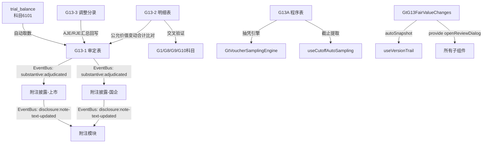

# Design Document: G13 公允价值变动收益底稿专属HTML精美组件

## Overview

G13公允价值变动收益专属组件`g13-fair-value-changes`。覆盖1个xlsx源模板/6有效sheet。科目6101公允价值变动收益/损失（**损益类**）。**G循环中公允价值计量联动核心科目**，与G1/G8/G9/G10各科目公允价值变动数据交叉验证。G循环中最简洁的科目之一。

核心架构：
- componentType `g13-fair-value-changes`，主入口 GtG13FairValueChanges.vue
- **sheetName v-if dispatch模式**：6 sheets用v-if分发（不用el-tabs）
- 无子目录分组（仅6个sheet，文件扁平即可）
- 损益类公式：本期发生额 = 贷方 - 借方
- EventBus联动：publish `substantive:adjudicated`(accountCode='6101') + `disclosure:note-text-updated`
- 双模式（HTML ↔ OnlyOffice）+ 导入导出(useG13ImportExport, 2张表) + AI(2 section)
- 五大集成：版本链✅ 抽凭✅ 截止✅ 附注EventBus✅ 复核✅ （无OCR，无凭证检查表）
- 无虚拟滚动需求（最大35行）
- 交叉验证：G13-2明细与G1/G8/G9/G10各科目公允价值变动勾稽

## Architecture

### sheetName分发模式

GtG13FairValueChanges.vue 接收 `sheetName` prop，用正则提取编码(G13A/G13-1/G13-2/G13-3/附注(上市)/附注(国企))，`v-if` 分发到对应子组件。

```
sheetName → regex提取编码 → v-if匹配 → defineAsyncComponent子组件渲染
                                     ↘ 未匹配 → OnlyOffice fallback

6 sheets（扁平结构，无子目录）:
├── G13A   审计程序表（复用a-program-console + 抽凭引擎 + 截止提取）
├── G13-1  审定表（35行×11列，按金融资产/负债类型分层，损益类）
├── G13-2  明细表（34行×12列，公允价值变动来源+交叉验证）
├── G13-3  调整分录汇总（22行×10列，AJE/RJE + 借贷平衡）
├── 附注披露信息（上市公司）（18行×5列）
└── 附注披露信息（国企）（17行×5列）
```

### 高层数据流



### 文件结构

```
audit-platform/frontend/src/components/workpaper/
├── GtG13FairValueChanges.vue                     # 主入口 sheetName v-if分发（defineAsyncComponent lazy×6）
├── g13-fair-value-changes/
│   ├── G13TabProcedure.vue                       # G13A 程序表（复用a-program-console+selfLoad+抽凭+截止）
│   ├── G13TabAdjudication.vue                    # G13-1 审定表（35行×11列，损益类+分组）
│   ├── G13TabDetail.vue                          # G13-2 明细表（34行×12列+交叉验证+动态行）
│   ├── G13TabAdjustment.vue                      # G13-3 调整分录（AJE/RJE+借贷平衡+动态行）
│   ├── G13TabDisclosureListed.vue                # 附注披露(上市)(18行)
│   └── G13TabDisclosureSOE.vue                   # 附注披露(国企)(17行)
├── composables/
│   ├── useG13FormulaEngine.ts                    # G13公式引擎(5个纯函数+parseNum)
│   ├── useG13FormData.ts                         # 数据加载/保存/selfLoad/writebackTB
│   ├── useG13ImportExport.ts                     # 导入导出composable(2张表: G13-2/G13-3)
│   └── useG13DualMode.ts                         # 双模式OO切换+localStorage

backend/app/routers/wp_render_strategies/
├── _g13_fair_value_changes.py                    # render策略+注册RENDERER_DISPATCH
├── _g13_fair_value_changes_service.py            # 业务逻辑(公式验证/TB取数/EventBus)
├── _g13_fair_value_changes_import_export.py      # 导入导出端点(2张表×3=6端点)
└── _g13_fair_value_changes_ai.py                 # AI生成2 section
```

### EventBus事件

| 事件名 | 发布者 | 消费者 | payload |
|--------|--------|--------|---------|
| `substantive:adjudicated` | G13-1审定表 | 附注披露(上市/国企) + trial_balance | `{accountCode:'6101', adjudicatedAmount}` |
| `disclosure:note-text-updated` | 附注披露 | 附注模块 | `{accountCode:'6101', text}` |

### 后端AI Section清单

```
adjudication-analysis / fv-change-conclusion
```

## Components and Interfaces

### 前端组件接口

```typescript
// GtG13FairValueChanges.vue props
interface G13FairValueChangesProps {
  htmlData: Record<string, any> | null
  sheetName: string
  wpId: string
  projectId: string
  readonly?: boolean
}

// sheetName正则匹配映射
const SHEET_CODE_MAP: Record<string, string> = {
  'G13A': 'procedure',
  'G13-1': 'adjudication',
  'G13-2': 'detail',
  'G13-3': 'adjustment',
  '附注披露信息（上市公司）': 'disclosureListed',
  '附注披露信息（国企）': 'disclosureSOE',
}
```

### G13-1 审定表数据模型（35行×11列，损益类）

```typescript
interface G13AdjudicationData {
  groups: G13AdjudicationGroup[]       // 按金融资产/负债类型分组
  trialBalanceAmount: number           // 试算表取数(科目6101)
  variance: number                     // 差异=审定-试算表
}

interface G13AdjudicationGroup {
  groupName: string
  // "交易性金融资产公允价值变动" / "交易性金融负债公允价值变动" /
  // "指定以公允价值计量的金融资产变动" / "衍生金融工具公允价值变动" / "其他" / "合计"
  rows: G13AdjudicationRow[]
  subtotal: G13AdjudicationTotals
}

interface G13AdjudicationRow {
  id: string
  item: string                         // 项目名称
  currentUnadjusted: number            // 本期未审数
  currentAdjustment: number            // 本期调整数（AJE+RJE）
  currentAudited: number               // 公式: 未审 + 调整
  priorUnadjusted: number              // 上期未审数
  priorAdjustment: number              // 上期调整数
  priorAudited: number                 // 公式: 未审 + 调整
  changeAmount: number                 // 公式: 本期审定 - 上期审定
  changeRate: number | null            // 公式: (本期-上期)/|上期|, 上期=0时null
  reasonAnalysis: string               // |变动率|>20%时必填(橙色高亮)
  indexRef: string                     // 索引(GtIndexChip)
}

interface G13AdjudicationTotals {
  currentAudited: number
  priorAudited: number
  changeAmount: number
  changeRate: number | null
}
```

### G13-2 明细表数据模型（34行×12列）

```typescript
interface G13DetailRow {
  id: string
  seq: number
  instrumentName: string               // 金融工具名称
  belongAccount: 'G1' | 'G8' | 'G9' | 'G10'  // 所属科目(下拉)
  instrumentType: string               // 金融工具类型
  openingFairValue: number             // 期初公允价值
  closingFairValue: number             // 期末公允价值
  fvChange: number                     // 公式: 期末 - 期初
  currentUnadjusted: number            // 本期未审数
  adjustment: number                   // 调整数
  currentAudited: number               // 公式: 未审 + 调整
  sourceIndex: string                  // 源科目索引(GtIndexChip)
  crossVerification: 'consistent' | 'inconsistent' | 'pending'  // 交叉验证结论(下拉)
  remark: string                       // 备注
}
```

### G13-3 调整分录数据模型（22行×10列）

```typescript
interface G13AdjustmentEntry {
  id: string
  seq: number
  entryType: 'AJE' | 'RJE'            // 分录类型
  date: string                         // 日期
  summary: string                      // 摘要
  accountCode: string                  // 科目编码
  accountName: string                  // 科目名称
  debitAmount: number                  // 借方金额
  creditAmount: number                 // 贷方金额
  preparedBy: string                   // 编制人
  remark: string                       // 备注
}
```

### 附注数据模型

```typescript
interface G13DisclosureSection {
  id: string
  title: string
  rows?: DisclosureRow[]
  textContent?: string                 // 文本区内容（AI辅助）
}
```

## Data Models

### 存储结构（working_paper.content JSON）

```typescript
interface G13Content {
  // G13-1 审定表
  adjudication: {
    groups: G13AdjudicationGroup[]
  }
  // G13-2 明细表
  detail: {
    rows: G13DetailRow[]
  }
  // G13-3 调整分录
  adjustment: {
    entries: G13AdjustmentEntry[]
  }
  // 附注
  disclosureListed: { sections: G13DisclosureSection[] }
  disclosureSOE: { sections: G13DisclosureSection[] }
}
```

### API接口

```python
# _g13_fair_value_changes.py
# RENDERER_DISPATCH注册
def render_g13_fair_value_changes(wp_id: str, config: dict) -> dict:
    """Render策略函数，返回componentType='g13-fair-value-changes'和sheets配置"""

# _g13_fair_value_changes_import_export.py
POST /api/workpapers/{wp_id}/g13/export-template?sheet={code}
POST /api/workpapers/{wp_id}/g13/export-data?sheet={code}
POST /api/workpapers/{wp_id}/g13/import-data?sheet={code}  # multipart/form-data
# sheet codes: G13-2 / G13-3

# _g13_fair_value_changes_ai.py
POST /api/workpapers/{wp_id}/g13/ai/{section}
# section: adjudication-analysis / fv-change-conclusion

# _g13_fair_value_changes_service.py
class G13FairValueChangesService:
    async def get_trial_balance_data(project_id, year) -> dict
    async def save_adjudication(wp_id, data) -> dict
    async def validate_formulas(data) -> list[ValidationError]
```

### trial_balance 取数

```sql
-- G13-1审定表自动取数（损益类取发生额）
SELECT standard_account_code, unadjusted_amount, aje_adjustment, audited_amount
FROM trial_balance
WHERE project_id = :project_id
  AND year = :year
  AND standard_account_code LIKE '6101%'
```

### 注册四件套

```python
# 1. htmlRendererRegistry (前端)
'g13-fair-value-changes': () => import('./workpaper/GtG13FairValueChanges.vue')

# 2. wp_code_overrides.json (7条)
{
  "G13A-公允价值变动收益审计程序表": "g13-fair-value-changes",
  "G13-1-审定表": "g13-fair-value-changes",
  "G13-2-明细表": "g13-fair-value-changes",
  "G13-3-调整分录汇总": "g13-fair-value-changes",
  "G13-附注披露信息（上市公司）": "g13-fair-value-changes",
  "G13-附注披露信息（国企）": "g13-fair-value-changes",
  "G13-底稿目录": "g13-fair-value-changes"
}

# 3. VALID_COMPONENT_TYPES (后端)
'g13-fair-value-changes'

# 4. RENDERER_DISPATCH (后端)
'g13-fair-value-changes': render_g13_fair_value_changes
```

## Formula Engine Design (useG13FormulaEngine.ts)

### 5个纯函数 + parseNum

```typescript
/**
 * 安全数值转换：null/undefined/NaN/空字符串 → 0
 */
export function parseNum(v: unknown): number

/**
 * 审定数 = 未审数 + 调整数
 * 损益类不区分AJE/RJE合并为一个adjustment
 */
export function calcAdjustedAmount(unadjusted: number, adjustment: number): number

/**
 * 公允价值变动 = 期末公允价值 - 期初公允价值
 */
export function calcFVChange(opening: number, closing: number): number

/**
 * 变动率 = (本期 - 上期) / |上期|
 * 上期=0时返回null（避免除零）
 */
export function calcChangeRate(prior: number, current: number): number | null

/**
 * 借贷平衡校验：|SUM(debits) - SUM(credits)| < 0.01
 */
export function isDebitCreditBalanced(debits: number[], credits: number[]): boolean

/**
 * 差异计算：fvChange - adjustedAmount
 * 用于G13-2交叉验证（公允价值变动 vs 审定数）
 */
export function calcVariance(fvChange: number, adjustedAmount: number): number
```

### 损益类取数逻辑

```typescript
// 损益类科目6101：本期发生额 = 贷方 - 借方（净收益为贷方）
// trial_balance存储v2正数口径，损益取发生额
// G13-1审定表：currentUnadjusted从tb取"本期未审发生额"
```

## Integration Design（5大集成接入点）

### 1. 版本链 (useVersionTrail)

```typescript
// GtG13FairValueChanges.vue 主入口
const { autoSnapshot, showVersionTrail } = useVersionTrail(wpId)
async function handleSave() {
  await saveData()
  await autoSnapshot()
}
```

### 2. 抽凭引擎 (G13A程序表)

```typescript
// G13TabProcedure.vue
<GtVoucherSamplingEngine
  :project-id="projectId"
  :account-codes="['6101']"
  dialog-mode
  @samples-ready="fillSamples"
/>
```

### 3. 截止自动提取 (useCutoffAutoSampling)

```typescript
// G13TabProcedure.vue 截止测试步骤
const { fetchCutoffSamples } = useCutoffAutoSampling({
  projectId, accountCode: '6101', days: 5
})
```

### 4. 附注EventBus

```typescript
// G13TabAdjudication.vue (发布者)
watch(reportAmount, (val) => {
  eventBus.publish('substantive:adjudicated', {
    accountCode: '6101', adjudicatedAmount: val
  })
})

// G13TabDisclosureListed.vue / G13TabDisclosureSOE.vue (消费者)
eventBus.subscribe('substantive:adjudicated', (payload) => {
  if (payload.accountCode === '6101') refreshData()
})

// 附注文本变更发布
eventBus.publish('disclosure:note-text-updated', {
  accountCode: '6101', text: noteText
})
```

### 5. 复核对话 (provide/inject)

```typescript
// GtG13FairValueChanges.vue (主入口)
const { openReviewDialog } = useReviewDialog(wpId)
provide('openReviewDialog', openReviewDialog)

// 子组件 (section标题栏右侧按钮)
const openReviewDialog = inject('openReviewDialog')
```

## G13-2 交叉验证设计

G13明细表核心特色：与G1/G8/G9/G10各科目公允价值变动数据勾稽。

```typescript
// 交叉验证逻辑
interface CrossVerificationResult {
  instrumentName: string
  belongAccount: 'G1' | 'G8' | 'G9' | 'G10'
  g13FVChange: number                  // G13记录的公允价值变动
  sourceAccountFVChange: number        // 源科目记录的公允价值变动
  variance: number                     // 差异
  isConsistent: boolean                // |差异| < 0.01
}

// 验证逻辑：G13-2每行的fvChange应与对应源科目(G1/G8/G9/G10)的公允价值变动一致
// sourceIndex字段(GtIndexChip)可直接跳转至源科目底稿对应行
```

## Correctness Properties

*A property is a characteristic or behavior that should hold true across all valid executions of a system—essentially, a formal statement about what the system should do. Properties serve as the bridge between human-readable specifications and machine-verifiable correctness guarantees.*

### Property 1: 审定数公式

*For any* unadjusted, adjustment ∈ ℝ: `calcAdjustedAmount(unadjusted, adjustment)` === `unadjusted + adjustment`

**Validates: Requirements 2.2, 3.3, 4.2**

### Property 2: 公允价值变动公式

*For any* opening, closing ∈ ℝ: `calcFVChange(opening, closing)` === `closing - opening`

**Validates: Requirements 3.2, 4.2**

### Property 3: FV变动与审定差异检测

*For any* opening, closing, unadjusted, adjustment ∈ ℝ: WHEN `calcFVChange(opening, closing)` === `calcAdjustedAmount(unadjusted, adjustment)` THEN `calcVariance(calcFVChange(opening, closing), calcAdjustedAmount(unadjusted, adjustment))` === 0

**Validates: Requirements 3.4**

### Property 4: 变动率方向性与除零保护

*For any* current > prior > 0: `calcChangeRate(prior, current)` > 0;
*For any* current < prior, prior > 0: `calcChangeRate(prior, current)` < 0;
`calcChangeRate(0, any)` === null

**Validates: Requirements 2.2, 4.2**

### Property 5: 借贷平衡恒等

*For any* debits[], credits[] ∈ ℝ[]: `isDebitCreditBalanced(debits, credits)` ↔ (|SUM(debits) - SUM(credits)| < 0.01)

**Validates: Requirements 4.1, 4.2**

### Property 6: parseNum健壮性

*For any* input ∈ {null, undefined, '', NaN, '  ', 'abc'}: `parseNum(input)` === 0;
*For any* n ∈ ℝ (finite): `parseNum(n)` === n

**Validates: Requirements 4.2**

## Error Handling

| 场景 | 处理策略 |
|------|---------|
| render-config 加载失败 | selfLoad重试1次 → 失败显示"加载失败"占位 + 重试按钮 |
| trial_balance 取数无数据 | 审定表显示0值 + 橙色提示"未找到科目6101数据" |
| 公式计算溢出/NaN | parseNum兜底→0，公式列显示"—" |
| 导入Excel格式不匹配 | 后端返回422 + 具体列错误信息 → 前端ElMessage.error |
| EventBus消息丢失 | 附注组件mounted时主动拉取最新审定数（非纯被动监听） |
| 保存时网络异常 | 自动重试3次(指数退避) → 失败后localStorage暂存 + 恢复提示 |
| sheetName无法识别 | fallback到OnlyOffice渲染（确保不白屏） |
| 交叉验证源科目未打开 | 显示"待验证"状态 + 提示用户先完成源科目底稿 |

## Testing Strategy

### 测试分层

| 层 | 工具 | 范围 | 数量估计 |
|----|------|------|---------|
| PBT(前端) | vitest + fast-check | 5个公式函数×6属性 | ~8 test cases |
| PBT(后端) | pytest + hypothesis | 公式验证 | ~6 test cases |
| 单元测试(前端) | vitest | composable逻辑/数据转换 | ~12 test cases |
| 单元测试(后端) | pytest | service/renderer/import-export | ~8 test cases |
| 集成测试 | pytest | API端点(6导入导出+2AI+render) | ~6 test cases |
| E2E | Playwright | 关键用户路径(审定表+明细交叉验证) | ~3 scenarios |

### PBT配置

- 前端：fast-check，`numRuns: 100`
- 后端：hypothesis，`max_examples=5`
- 每个PBT测试注释标注对应属性编号
- Tag格式：`Feature: g13-fair-value-changes, Property {N}: {描述}`

### 关键测试路径

1. **审定表完整流程**：TB取数(6101) → 损益类公式 → 填写调整 → 审定计算 → EventBus发布 → 附注刷新
2. **明细交叉验证**：填入FV数据 → 自动计算变动 → 与审定数比对 → 差异标红 → 源科目GtIndexChip跳转
3. **调整分录回写**：录入AJE/RJE → 借贷平衡校验 → 回写G13-1审定表adjustment列

### PBT测试文件

```
audit-platform/frontend/src/components/workpaper/composables/__tests__/
└── useG13FormulaEngine.spec.ts        # 6个PBT属性 + fast-check

backend/tests/
└── test_g13_fair_value_changes_pbt.py  # 后端PBT验证(hypothesis)
```
