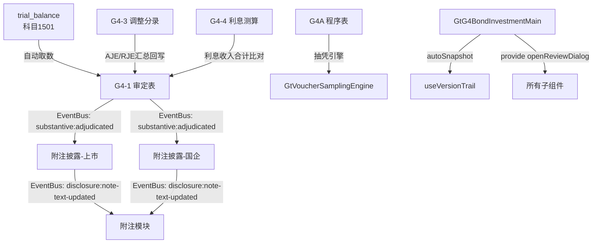

# Design Document: G4 债权投资底稿(main组)专属HTML精美组件

## Overview

G4债权投资(main组)专属组件`g4-bond-investment-main`。覆盖1个xlsx源模板(1022KB)/8有效sheet。科目1501债权投资（借方/资产类）。**G循环中最复杂的科目之一**，源模板19个sheet按三组拆分，本spec覆盖主体部分（程序表+审定表+附注+明细表+调整分录+利息测算）。

核心架构：
- componentType `g4-bond-investment-main`，主入口 GtG4BondInvestmentMain.vue
- **sheetName v-if dispatch模式**：8 sheets用v-if分发（不用el-tabs）
- 子目录分组：core/ + measurement/
- 宽表拆分：G4-2(44列→5区段Tab，行同步) / G4-4(双section分组)
- 借方科目公式：期末未审 = 期初审定 + 借方 - 贷方
- EventBus联动：publish `substantive:adjudicated`(accountCode='1501') + `disclosure:note-text-updated`
- 特色：摊余成本三要素分解(成本+利息调整+应计利息) + 实际利率法利息测算 + ECL三阶段影响基数 + 一年内到期重分类
- 双模式（HTML ↔ OnlyOffice）+ 导入导出(useG4MainImportExport, 3张表) + AI(4 section)
- 六大集成：版本链✅ 抽凭✅ 截止✅ 附注EventBus✅ OCR❌ 复核✅

**三组拆分边界**：
| 组 | spec | 覆盖内容 |
|----|------|----------|
| main(本spec) | g4-bond-investment-main | 程序表G4A + 审定表G4-1 + 明细表G4-2 + 调整分录G4-3 + 利息测算G4-4 + 附注(上市/国企) + 底稿目录 |
| SPPI | g4-bond-investment-sppi | 业务模式分析 + SPPI合同现金流 + 盘点倒轧 + 结存表 |
| ECL | g4-bond-investment-ecl | 三阶段划分 + 减值测算 + ECL + 凭证检查 |

## Architecture

### sheetName分发模式 + 子目录组织

GtG4BondInvestmentMain.vue 接收 `sheetName` prop，用正则提取编码(G4A/G4-1/G4-2/G4-3/G4-4/附注披露(上市)/附注披露(国企)/底稿目录)，`v-if` 分发到对应子组件。

```
sheetName → regex提取编码 → v-if匹配 → 子组件渲染
                                     ↘ 未匹配 → OnlyOffice fallback

8 sheets 子目录分组:
├── core/
│   ├── G4A    实质性程序表（复用a-program-console + 抽凭引擎）
│   ├── G4-1   审定表（三层结构：原值/减值/摊余成本 + 一年内到期重分类）
│   ├── G4-2   明细表（44列→5区段Tab，投资种类×摊余成本分解）
│   ├── G4-3   调整分录汇总（AJE/RJE + 借贷平衡校验）
│   ├── 附注披露(上市)（130行超长虚拟滚动）
│   ├── 附注披露(国企)（71行虚拟滚动）
│   └── 底稿目录
└── measurement/
    └── G4-4   利息测算表（实际利率法：初始入账 + 利息计算双section分组）
```

### 高层数据流



### 文件结构

```
audit-platform/frontend/src/components/workpaper/
├── GtG4BondInvestmentMain.vue                    # 主入口 sheetName v-if分发（defineAsyncComponent lazy）
├── g4-bond-investment-main/
│   ├── core/
│   │   ├── G4TabProcedure.vue                    # G4A 程序表（复用a-program-console+selfLoad+抽凭）
│   │   ├── G4TabAdjudication.vue                 # G4-1 审定表（三层+一年内到期）
│   │   ├── G4TabDetail.vue                       # G4-2 明细表(44列→5区段Tab)
│   │   ├── G4TabAdjustment.vue                   # G4-3 调整分录(AJE/RJE+借贷校验)
│   │   ├── G4TabDisclosureListed.vue             # 附注披露(上市)(130行虚拟滚动)
│   │   ├── G4TabDisclosureSOE.vue                # 附注披露(国企)(71行)
│   │   └── G4TabDirectory.vue                    # 底稿目录
│   └── measurement/
│       └── G4TabInterestCalc.vue                 # G4-4 利息测算（实际利率法双section分组）
├── composables/
│   ├── useG4MainFormulaEngine.ts                 # G4(main)公式引擎(14个纯函数+parseNum)
│   ├── useG4MainFormData.ts                      # 数据加载/保存/selfLoad/writebackTB
│   ├── useG4MainAdjudication.ts                  # G4-1审定表逻辑(三层结构+EventBus)
│   ├── useG4MainDetail.ts                        # G4-2明细表逻辑(5区段+行同步+分类)
│   ├── useG4MainAdjustment.ts                    # G4-3调整分录逻辑(借贷校验+回写)
│   ├── useG4MainInterestCalc.ts                  # G4-4利息测算逻辑(分组+实际利率法)
│   ├── useG4MainImportExport.ts                  # 导入导出composable(3张表)
│   └── useG4MainDualMode.ts                      # 双模式OO切换+localStorage

backend/app/routers/wp_render_strategies/
├── _g4_bond_investment_main.py                   # render策略+注册RENDERER_DISPATCH
├── _g4_bond_investment_main_import_export.py     # 导入导出3端点(3张表×3=9端点)
└── _g4_bond_investment_main_ai.py                # AI生成4 section
```

### G4-2明细表 5区段Tab设计（44列）

```
┌─────────────────────────────────────────────────────────────────────────────────────┐
│ ┌──────────┐ ┌──────────┐ ┌──────────┐ ┌────────────────┐ ┌──────────────┐        │
│ │基础信息6列│ │期初余额10列│ │本期变动4列│ │期末余额+减值10列│ │摊余成本+审定8列│  Tab  │
│ └──────────┘ └──────────┘ └──────────┘ └────────────────┘ └──────────────┘        │
│                                                                                     │
│ ┌───────────────────────────────────────────────────────────────────────────────┐   │
│ │ el-table (动态行，5区段间行同步)                                                │   │
│ │                                                                               │   │
│ │ 基础信息(6): 投资种类|投资项目|面值|票面利率|实际利率|到期日                      │   │
│ │                                                                               │   │
│ │ 期初余额(10): 期初成本|期初利息调整|期初应计利息|期初小计(公式)|                  │   │
│ │              期初减值准备|期初摊余成本(公式)|减期初一年内到期|                      │   │
│ │              期初调整数|期初审定数|备注                                          │   │
│ │                                                                               │   │
│ │ 本期变动(4): 本期成本变动|本期利息调整变动|本期应计利息变动|本期变动小计(公式)      │   │
│ │                                                                               │   │
│ │ 期末余额+减值(10): 期末成本(公式)|期末利息调整(公式)|期末应计利息(公式)|          │   │
│ │                   期末小计(公式)|减值准备期末数|阶段划分(Stage下拉)|              │   │
│ │                   信用组合方式|信用组合名称|减值准备审定|备注                      │   │
│ │                                                                               │   │
│ │ 摊余成本+审定(8): 摊余成本(公式)|减一年内到期账面余额|减一年内到期减值|          │   │
│ │                  一年内到期小计(公式)|期末账面价值(公式)|发函情况|审定调整|索引    │   │
│ └───────────────────────────────────────────────────────────────────────────────┘   │
│                                                                                     │
│ 数据分类：                                                                            │
│ ├── 一、一年内到期（到期日 ≤ 资产负债表日后1年）→ 列报为"其他流动资产"              │
│ └── 二、到期超过一年（到期日 > 资产负债表日后1年）                                   │
│                                                                                     │
│ 底部：按投资种类分类小计 + 总计行                                                      │
└─────────────────────────────────────────────────────────────────────────────────────┘
```

### G4-4利息测算表设计（实际利率法双section分组）

```
┌─────────────────────────────────────────────────────────────────────────────────────┐
│ ═══ 投资项目A ═══════════════════════════════════════════════════════════════════════│
│ (一) 确定初始入账价值 (9列)                                                          │
│ ┌───────────────────────────────────────────────────────────────────────────────┐   │
│ │ 投资项目|面值总额|初始计量日|到期日|购买对价|交易费用|初始入账价值(公式)|        │   │
│ │ 票面利率|实际利率                                                              │   │
│ └───────────────────────────────────────────────────────────────────────────────┘   │
│                                                                                     │
│ (二) 计算利息收入 (10列，多行=多计息期间)                                             │
│ ┌───────────────────────────────────────────────────────────────────────────────┐   │
│ │ 截止日|期初账面总额|期初减值准备余额|期初摊余成本余额(公式)|                     │   │
│ │ 实际利息收入(公式)|现金流入(公式)|已收回本金|期末账面总额(公式)|                  │   │
│ │ 计息天数|减值阶段(Stage下拉)                                                   │   │
│ │ ─ 行1: 2024-06-30  [计算...]                                                  │   │
│ │ ─ 行2: 2024-12-31  [计算...]                                                  │   │
│ │ ─ [+ 新增计息期间]                                                             │   │
│ └───────────────────────────────────────────────────────────────────────────────┘   │
│                                                                                     │
│ ═══ 投资项目B ═══════════════════════════════════════════════════════════════════════│
│ (一) / (二) 同结构...                                                                │
│                                                                                     │
│ ─────────────────────────────────────────────────────────────────────────────────── │
│ 合计：各项目实际利息收入合计 vs G4-1审定利息收入 → 差异(红色高亮>0.01元)              │
│ 审计结论 textarea + AI按钮                                                           │
│ <details>编制提示</details>                                                          │
└─────────────────────────────────────────────────────────────────────────────────────┘
```

### EventBus事件

| 事件名 | 发布者 | 消费者 | payload |
|--------|--------|--------|---------|
| `substantive:adjudicated` | G4-1审定表 | 附注披露(上市/国企) + trial_balance | `{accountCode:'1501', adjudicatedAmount}` |
| `disclosure:note-text-updated` | 附注披露 | 附注模块 | `{accountCode:'1501', text}` |

### 后端AI Section清单

```
adjudication-analysis / interest-conclusion / disclosure-text / overall-opinion
```

## Components and Interfaces

### 前端组件接口

```typescript
// GtG4BondInvestmentMain.vue props
interface G4BondInvestmentMainProps {
  htmlData: Record<string, any> | null
  sheetName: string
  wpId: string
  projectId: string
  readonly?: boolean
}

// sheetName正则匹配映射
const SHEET_CODE_MAP: Record<string, string> = {
  'G4A': 'procedure',
  'G4-1': 'adjudication',
  'G4-2': 'detail',
  'G4-3': 'adjustment',
  'G4-4': 'interestCalc',
  '附注披露信息（上市公司）': 'disclosureListed',
  '附注披露信息（国企）': 'disclosureSOE',
  '底稿目录': 'directory',
}
```

### G4-1 审定表数据模型（三层结构）

```typescript
interface G4AdjudicationData {
  groups: AdjudicationGroup[]          // 三大分组
  oneYearMaturity: OneYearMaturityRow  // 附加：一年内到期
  trialBalanceAmount: number           // 试算表取数(科目1501)
  variance: number                     // 差异=审定-试算表
}

interface AdjudicationGroup {
  groupName: string                    // "一、债权投资原值" / "二、减值准备" / "三、摊余成本"
  expanded: boolean
  rows: AdjudicationRow[]
  subtotal: AdjudicationTotals
}

interface AdjudicationRow {
  id: string
  item: string                         // "单项计提" / "按组合计提" / "小计" / "减：一年内到期"
  openingUnadjusted: number
  openingAJE: number
  openingRJE: number
  openingAdjusted: number              // 公式: unadjusted + AJE + RJE
  closingUnadjusted: number            // 公式: 期初审定 + 借方 - 贷方
  closingAJE: number
  closingRJE: number
  closingAdjusted: number              // 公式: 未审 + AJE + RJE
  changeAmount: number                 // 公式: 期末审定 - 期初审定
  changeRate: number | null            // 公式: (期末-期初)/期初, 期初=0时null
  reasonAnalysis: string               // |变动率|>20%时必填
  indexRef: string                     // GtIndexChip引用
}

interface OneYearMaturityRow {
  item: string
  openingAdjusted: number
  closingAdjusted: number
  changeAmount: number
  changeRate: number | null
}
```

### G4-2 明细表行（44列分5区段）

```typescript
interface BondDetailRow {
  id: string
  seq: number
  // ══ 基础信息(6列) ══
  investCategory: string               // 投资种类(企业债/国债/金融债/公司债等)
  investProject: string                // 投资项目名称
  faceValue: number                    // 面值
  couponRate: number                   // 票面利率(小数)
  effectiveRate: number                // 实际利率(小数)
  maturityDate: string                 // 到期日 YYYY-MM-DD

  // ══ 期初余额(10列) ══
  openingCost: number                  // 期初成本
  openingInterestAdj: number           // 期初利息调整
  openingAccruedInterest: number       // 期初应计利息
  openingSubtotal: number              // 公式: cost + interestAdj + accruedInterest
  openingImpairment: number            // 期初减值准备
  openingAmortizedCost: number         // 公式: subtotal - impairment
  openingOneYearDeduct: number         // 减：期初一年内到期
  openingAdjustment: number            // 期初调整数
  openingAdjusted: number              // 期初审定数
  openingRemark: string                // 备注

  // ══ 本期变动(4列) ══
  periodCostChange: number             // 本期成本变动
  periodInterestAdjChange: number      // 本期利息调整变动
  periodAccruedInterestChange: number  // 本期应计利息变动
  periodChangeSubtotal: number         // 公式: 三项变动之和

  // ══ 期末余额+减值(10列) ══
  closingCost: number                  // 公式: 期初成本 + 本期成本变动
  closingInterestAdj: number           // 公式: 期初利息调整 + 本期利息调整变动
  closingAccruedInterest: number       // 公式: 期初应计利息 + 本期应计利息变动
  closingSubtotal: number              // 公式: 三项之和
  closingImpairment: number            // 减值准备期末数
  stageClassification: 'Stage1' | 'Stage2' | 'Stage3'  // 阶段划分
  creditCombineMethod: string          // 信用组合方式
  creditCombineName: string            // 信用组合名称
  impairmentAdjusted: number           // 减值准备审定
  closingRemark: string                // 备注

  // ══ 摊余成本+审定(8列) ══
  amortizedCost: number                // 公式: 期末小计 - 减值准备
  oneYearBalance: number               // 一年内到期账面余额
  oneYearImpairment: number            // 一年内到期减值
  oneYearSubtotal: number              // 公式: balance - impairment
  bookValue: number                    // 公式: 摊余成本 - 一年内到期小计
  correspondenceStatus: string         // 发函情况
  auditAdjustment: number              // 审定调整
  indexRef: string                     // 索引(GtIndexChip)
}
```

### G4-4 利息测算数据模型

```typescript
interface InterestCalcGroup {
  id: string
  projectName: string                  // 投资项目名称
  // (一) 初始入账价值
  initial: InitialCarryingData
  // (二) 利息计算（多行=多计息期间）
  periods: InterestPeriodRow[]
}

interface InitialCarryingData {
  faceValueTotal: number               // 面值总额
  initialDate: string                  // 初始计量日
  maturityDate: string                 // 到期日
  purchasePrice: number                // 购买对价
  transactionCost: number              // 交易费用
  initialCarryingAmount: number        // 公式: 购买对价 + 交易费用
  couponRate: number                   // 票面利率(小数，至少4位)
  effectiveRate: number                // 实际利率(小数，至少4位)
}

interface InterestPeriodRow {
  id: string
  cutoffDate: string                   // 截止日
  openingBalance: number               // 期初账面总额
  openingImpairment: number            // 期初减值准备余额
  openingAmortizedCost: number         // 公式: 期初账面 - 减值准备
  effectiveInterest: number            // 公式: 摊余成本 × 实际利率 × days/365
  cashInflow: number                   // 公式: 面值 × 票面利率 [× days/365]
  principalRepaid: number              // 已收回的本金
  closingBalance: number               // 公式: 期初 + 利息 - 现金流入 - 已收回本金
  days: number                         // 计息天数(1~366)
  stage: 'Stage1' | 'Stage2' | 'Stage3'  // 减值阶段(下拉)
}

interface InterestCalcSummary {
  totalEffectiveInterest: number       // 各项目实际利息收入合计
  g4_1InterestAdjusted: number         // G4-1审定表利息收入审定数
  variance: number                     // 差异
  isVarianceAcceptable: boolean        // |差异| <= 0.01
}
```

### 后端接口

```python
# _g4_bond_investment_main.py
# RENDERER_DISPATCH注册
def render_g4_bond_investment_main(wp_id: str, config: dict) -> dict:
    """Render策略函数，返回componentType='g4-bond-investment-main'和sheets配置"""

# _g4_bond_investment_main_import_export.py
POST /api/workpapers/{wp_id}/g4-main/export-template?sheet={code}
POST /api/workpapers/{wp_id}/g4-main/export-data?sheet={code}
POST /api/workpapers/{wp_id}/g4-main/import-data?sheet={code}  # multipart/form-data
# sheet codes: G4-2 / G4-3 / G4-4
# G4-2按5区段分sheet导出

# _g4_bond_investment_main_ai.py
POST /api/workpapers/{wp_id}/g4-main/ai/{section}
# section: adjudication-analysis / interest-conclusion / disclosure-text / overall-opinion
```

### 注册四件套

```python
# 1. htmlRendererRegistry (前端)
'g4-bond-investment-main': () => import('./workpaper/GtG4BondInvestmentMain.vue')

# 2. wp_code_overrides.json (8条)
{
  "G4A-债权投资实质性程序表": "g4-bond-investment-main",
  "G4-1-审定表": "g4-bond-investment-main",
  "G4-2-明细表": "g4-bond-investment-main",
  "G4-3-调整分录汇总": "g4-bond-investment-main",
  "G4-4-利息测算表": "g4-bond-investment-main",
  "G4-附注披露信息（上市公司）": "g4-bond-investment-main",
  "G4-附注披露信息（国企）": "g4-bond-investment-main",
  "G4-底稿目录": "g4-bond-investment-main"
}

# 3. VALID_COMPONENT_TYPES (后端)
'g4-bond-investment-main'

# 4. RENDERER_DISPATCH (后端)
'g4-bond-investment-main': render_g4_bond_investment_main
```

## Data Models

### 存储结构（working_paper.content JSON）

```typescript
interface G4MainContent {
  // G4-1 审定表
  adjudication: {
    groups: AdjudicationGroup[]
    oneYearMaturity: OneYearMaturityRow
  }
  // G4-2 明细表
  detail: {
    rows: BondDetailRow[]
    balanceSheetDate: string            // 资产负债表日(用于一年内到期分类)
  }
  // G4-3 调整分录
  adjustment: {
    entries: AdjustmentEntry[]
  }
  // G4-4 利息测算
  interestCalc: {
    groups: InterestCalcGroup[]
    conclusion: string
  }
  // 附注
  disclosureListed: { sections: DisclosureSection[] }
  disclosureSOE: { sections: DisclosureSection[] }
}

interface AdjustmentEntry {
  id: string
  seq: number
  entryType: 'AJE' | 'RJE'
  date: string
  summary: string
  accountCode: string
  accountName: string
  debitAmount: number
  creditAmount: number
  preparedBy: string
  remark: string
}

interface DisclosureSection {
  id: string
  title: string
  rows: DisclosureRow[]
  textContent?: string                 // 文本区内容
}
```

### trial_balance 取数

```sql
-- G4-1审定表自动取数
SELECT standard_account_code, unadjusted_amount, aje_adjustment, audited_amount
FROM trial_balance
WHERE project_id = :project_id
  AND year = :year
  AND standard_account_code LIKE '1501%'
```

## Integration Design（6大集成接入点）

### 1. 版本链 (useVersionTrail)

```typescript
// GtG4BondInvestmentMain.vue 主入口
const { autoSnapshot, showVersionTrail } = useVersionTrail(wpId)

// 保存时自动快照
async function handleSave() {
  await saveData()
  await autoSnapshot()  // 触发版本快照
}

// 工具栏"版本历史"按钮 → GtWpVersionTrail drawer
```

### 2. 抽凭引擎 (G4A程序表)

```typescript
// G4TabProcedure.vue
// 复用GtAProgramConsole + GtVoucherSamplingEngine dialog
// 科目范围: 1501* (债权投资)
<GtVoucherSamplingEngine
  :project-id="projectId"
  :account-codes="['1501']"
  dialog-mode
  @samples-ready="fillSamples"
/>
```

### 3. 截止自动提取 (useCutoffAutoSampling)

```typescript
// G4TabProcedure.vue 截止测试步骤
const { fetchCutoffSamples } = useCutoffAutoSampling({
  projectId, accountCode: '1501', days: 5
})
// 序时账±5天自动提取截止测试样本
```

### 4. 附注EventBus

```typescript
// G4TabAdjudication.vue (发布者)
watch(adjudicatedAmount, (val) => {
  eventBus.publish('substantive:adjudicated', {
    accountCode: '1501',
    adjudicatedAmount: val  // 三、摊余成本行的审定数
  })
})

// G4TabDisclosureListed.vue / G4TabDisclosureSOE.vue (消费者)
eventBus.subscribe('substantive:adjudicated', (payload) => {
  if (payload.accountCode === '1501') refreshAdjudicatedData(payload)
})

// 附注文本更新后发布
eventBus.publish('disclosure:note-text-updated', {
  accountCode: '1501', text: noteText
})
```

### 5. 行级OCR — ❌ 不集成

G4-2明细表为投资明细信息表，非凭证表，不需要OCR识别。

### 6. 复核对话 (provide/inject)

```typescript
// GtG4BondInvestmentMain.vue (provide)
import { useReviewDialog } from '@/composables/useReviewDialog'
const { openReviewDialog } = useReviewDialog(wpId)
provide('openReviewDialog', openReviewDialog)

// 子组件 section标题栏右侧按钮 (inject)
const openReviewDialog = inject('openReviewDialog')
// <el-button @click="openReviewDialog('G4-1审定表')" icon="ChatDotRound" />
```

## Formula Engine Design

### useG4MainFormulaEngine.ts — 14个纯函数 + parseNum

所有函数为纯函数（无副作用、无Vue响应式依赖、无外部状态），支持fast-check PBT验证。

```typescript
// ══════════════════════════════════════════════════════════
// parseNum — 输入清洗（null/undefined/NaN/空串 → 0）
// ══════════════════════════════════════════════════════════
export function parseNum(v: unknown): number {
  if (v === null || v === undefined || v === '') return 0
  const n = Number(v)
  return Number.isFinite(n) ? n : 0
}

// ══════════════════════════════════════════════════════════
// P1: 借方余额 = 期初 + 借方 - 贷方
// ══════════════════════════════════════════════════════════
export function calcDebitBalance(opening: number, debit: number, credit: number): number {
  return parseNum(opening) + parseNum(debit) - parseNum(credit)
}

// ══════════════════════════════════════════════════════════
// P2: 审定数 = 未审 + AJE + RJE
// ══════════════════════════════════════════════════════════
export function calcAdjustedAmount(unadjusted: number, aje: number, rje: number): number {
  return parseNum(unadjusted) + parseNum(aje) + parseNum(rje)
}

// ══════════════════════════════════════════════════════════
// P3: 余额小计 = 成本 + 利息调整 + 应计利息
// ══════════════════════════════════════════════════════════
export function calcBalanceSubtotal(cost: number, interestAdjustment: number, accruedInterest: number): number {
  return parseNum(cost) + parseNum(interestAdjustment) + parseNum(accruedInterest)
}

// ══════════════════════════════════════════════════════════
// P4: 摊余成本 = 账面余额小计 - 减值准备
// ══════════════════════════════════════════════════════════
export function calcAmortizedCost(bookBalanceSubtotal: number, impairment: number): number {
  return parseNum(bookBalanceSubtotal) - parseNum(impairment)
}

// ══════════════════════════════════════════════════════════
// P5: 实际利息收入（整年 or 按天数）
// ══════════════════════════════════════════════════════════
export function calcEffectiveInterest(amortizedCost: number, effectiveRate: number, days?: number): number {
  const cost = parseNum(amortizedCost)
  const rate = parseNum(effectiveRate)
  if (days === undefined || days === null) return cost * rate
  return cost * rate * parseNum(days) / 365
}

// ══════════════════════════════════════════════════════════
// P6: 现金流入 = 面值 × 票面利率 [× days/365]
// ══════════════════════════════════════════════════════════
export function calcCashInflow(faceValue: number, couponRate: number, days?: number): number {
  const face = parseNum(faceValue)
  const rate = parseNum(couponRate)
  if (days === undefined || days === null) return face * rate
  return face * rate * parseNum(days) / 365
}

// ══════════════════════════════════════════════════════════
// P7: 期末账面总额 = 期初 + 利息收入 - 现金流入 - 已收回本金
// ══════════════════════════════════════════════════════════
export function calcEndingBalance(opening: number, effectiveInterest: number, cashInflow: number, principalRepaid: number): number {
  return parseNum(opening) + parseNum(effectiveInterest) - parseNum(cashInflow) - parseNum(principalRepaid)
}

// ══════════════════════════════════════════════════════════
// P8: 初始入账价值 = 购买对价 + 交易费用
// ══════════════════════════════════════════════════════════
export function calcInitialCarryingAmount(purchasePrice: number, transactionCost: number): number {
  return parseNum(purchasePrice) + parseNum(transactionCost)
}

// ══════════════════════════════════════════════════════════
// P9: 借贷平衡判断 — |SUM(debits) - SUM(credits)| < 0.01
// ══════════════════════════════════════════════════════════
export function isDebitCreditBalanced(debits: number[], credits: number[]): boolean {
  const sumD = debits.reduce((s, v) => s + parseNum(v), 0)
  const sumC = credits.reduce((s, v) => s + parseNum(v), 0)
  return Math.abs(sumD - sumC) < 0.01
}

// ══════════════════════════════════════════════════════════
// P10: 期末分项 = 期初 + 变动（成本/利息调整/应计利息通用）
// ══════════════════════════════════════════════════════════
export function calcPeriodEndComponent(openingComponent: number, periodChange: number): number {
  return parseNum(openingComponent) + parseNum(periodChange)
}

// ══════════════════════════════════════════════════════════
// P11: 变动率 = (current - prior) / prior，prior=0时返回null
// ══════════════════════════════════════════════════════════
export function calcChangeRate(prior: number, current: number): number | null {
  const p = parseNum(prior)
  if (p === 0) return null
  return (parseNum(current) - p) / p
}

// ══════════════════════════════════════════════════════════
// P12: 一年内到期小计 = 账面余额 - 减值
// ══════════════════════════════════════════════════════════
export function calcOneYearMaturity(bookBalanceSubtotal: number, impairment: number): number {
  return parseNum(bookBalanceSubtotal) - parseNum(impairment)
}

// ══════════════════════════════════════════════════════════
// P13: 账面价值 = 摊余成本 - 一年内到期小计
// ══════════════════════════════════════════════════════════
export function calcBookValue(amortizedCost: number, oneYearMaturity: number): number {
  return parseNum(amortizedCost) - parseNum(oneYearMaturity)
}
```

### PBT策略

- 框架：vitest + fast-check
- 文件：`useG4MainFormulaEngine.pbt.spec.ts`
- 每个Property对应一个`fc.assert(fc.property(...))`
- numRuns: ≥100
- 生成器：`fc.float({min: -1e9, max: 1e9, noNaN: true})` 用于金额；`fc.integer({min: 1, max: 366})` 用于天数；`fc.float({min: 0.0001, max: 0.5})` 用于利率

## Performance Strategy

### 虚拟滚动

| 组件 | 行数 | 策略 |
|------|------|------|
| 附注披露(上市) | 130行 | 启用虚拟滚动（el-table-v2 或 vxe-table virtual） |
| 附注披露(国企) | 71行 | 启用虚拟滚动（>50行阈值） |
| G4-2 明细表 | 动态(≤500行) | 行数>50时启用虚拟滚动 |

### 懒加载

```typescript
// GtG4BondInvestmentMain.vue
const G4TabProcedure = defineAsyncComponent(() => import('./g4-bond-investment-main/core/G4TabProcedure.vue'))
const G4TabAdjudication = defineAsyncComponent(() => import('./g4-bond-investment-main/core/G4TabAdjudication.vue'))
const G4TabDetail = defineAsyncComponent(() => import('./g4-bond-investment-main/core/G4TabDetail.vue'))
const G4TabAdjustment = defineAsyncComponent(() => import('./g4-bond-investment-main/core/G4TabAdjustment.vue'))
const G4TabDisclosureListed = defineAsyncComponent(() => import('./g4-bond-investment-main/core/G4TabDisclosureListed.vue'))
const G4TabDisclosureSOE = defineAsyncComponent(() => import('./g4-bond-investment-main/core/G4TabDisclosureSOE.vue'))
const G4TabDirectory = defineAsyncComponent(() => import('./g4-bond-investment-main/core/G4TabDirectory.vue'))
const G4TabInterestCalc = defineAsyncComponent(() => import('./g4-bond-investment-main/measurement/G4TabInterestCalc.vue'))
```

### G4-2 区段Tab切换性能

- Tab切换时不销毁el-table实例，仅切换列定义(columns computed)
- 行数据共享同一reactive数组，5区段引用同一rows
- 行选中状态通过`selectedRowIndex` ref保持（跨Tab同步）
- 避免切换时重新渲染整个表格 → 无闪烁

## Error Handling

1. **selfLoad失败**：render-config返回404/500时显示错误卡片+重试按钮
2. **公式计算异常**：parseNum兜底（null/undefined/NaN/空串→0），除零保护(calcChangeRate返回null)
3. **44列区段Tab切换**：切换时保持行选中状态+区段间行同步，不销毁表格实例
4. **130行超长附注**：虚拟滚动确保DOM节点不超过可视区+buffer
5. **借贷不平衡**：实时校验，底部红色高亮显示差额
6. **变动率>20%**：橙色高亮+原因分析必填提示
7. **利息测算差异**：与G4-1比对差异>0.01元时红色高亮差异行
8. **浮点精度**：金额保留2位小数(四舍五入)，利率保留至少4位小数
9. **导入格式错误**：后端返回详细错误列表（行号/字段/原因），前端ElMessage展示
10. **EventBus发布失败**：5秒无确认→toast提示"审定数同步可能延迟"
11. **动态行限制**：G4-2单表最大500行，超限时阻止新增并提示

## Correctness Properties

*A property is a characteristic or behavior that should hold true across all valid executions of a system—essentially, a formal statement about what the system should do. Properties serve as the bridge between human-readable specifications and machine-verifiable correctness guarantees.*

### Property 1: 借方余额公式

*For any* opening ∈ ℝ≥0, debit ∈ ℝ≥0, credit ∈ ℝ≥0: `calcDebitBalance(opening, debit, credit)` SHALL equal `opening + debit - credit`

**Validates: Requirements 3.3, 8.1**

### Property 2: 审定数公式

*For any* unadjusted ∈ ℝ, aje ∈ ℝ, rje ∈ ℝ: `calcAdjustedAmount(unadjusted, aje, rje)` SHALL equal `unadjusted + aje + rje`

**Validates: Requirements 3.4, 8.2**

### Property 3: 余额小计公式（三要素加法）

*For any* cost ∈ ℝ, interestAdj ∈ ℝ, accruedInterest ∈ ℝ: `calcBalanceSubtotal(cost, interestAdj, accruedInterest)` SHALL equal `cost + interestAdj + accruedInterest`

**Validates: Requirements 5.2, 5.4, 5.8, 8.4**

### Property 4: 摊余成本公式

*For any* subtotal ∈ ℝ, impairment ∈ ℝ≥0: `calcAmortizedCost(subtotal, impairment)` SHALL equal `subtotal - impairment`

**Validates: Requirements 3.5, 5.3, 5.9, 7.3, 8.3**

### Property 5: 实际利息收入公式

*For any* amortizedCost ∈ ℝ≥0, rate ∈ (0, 1): 
- 无days参数时：`calcEffectiveInterest(amortizedCost, rate)` SHALL equal `amortizedCost × rate`
- *For any* days ∈ [1, 366]：`calcEffectiveInterest(amortizedCost, rate, days)` SHALL equal `amortizedCost × rate × days / 365`

**Validates: Requirements 7.4, 7.5, 8.5**

### Property 6: 现金流入公式

*For any* faceValue ∈ ℝ≥0, couponRate ∈ (0, 1):
- 无days参数时：`calcCashInflow(faceValue, couponRate)` SHALL equal `faceValue × couponRate`
- *For any* days ∈ [1, 366]：`calcCashInflow(faceValue, couponRate, days)` SHALL equal `faceValue × couponRate × days / 365`

**Validates: Requirements 7.6, 8.6**

### Property 7: 期末账面余额公式

*For any* opening ∈ ℝ≥0, interest ∈ ℝ≥0, cashInflow ∈ ℝ≥0, principalRepaid ∈ ℝ≥0: `calcEndingBalance(opening, interest, cashInflow, principalRepaid)` SHALL equal `opening + interest - cashInflow - principalRepaid`

**Validates: Requirements 7.7, 8.7**

### Property 8: 初始入账价值公式

*For any* price ∈ ℝ≥0, fees ∈ ℝ≥0: `calcInitialCarryingAmount(price, fees)` SHALL equal `price + fees`

**Validates: Requirements 7.2, 8.8**

### Property 9: 借贷平衡恒等

*For any* debits[] ∈ ℝ[], credits[] ∈ ℝ[]: `isDebitCreditBalanced(debits, credits)` SHALL be true if and only if `|SUM(debits) - SUM(credits)| < 0.01`

**Validates: Requirements 6.2, 8.12**

### Property 10: 期末分项一致性（加法交换律）

*For any* opening ∈ ℝ, change ∈ ℝ: `calcPeriodEndComponent(opening, change)` SHALL equal `opening + change`，且 `calcPeriodEndComponent(opening, change) === calcPeriodEndComponent(change, opening)` 满足加法交换律

**Validates: Requirements 5.5, 5.6, 5.7, 8.13**

### Property 11: 变动率方向性

*For any* current > prior > 0: `calcChangeRate(prior, current)` SHALL be > 0
*For any* current < prior, prior > 0: `calcChangeRate(prior, current)` SHALL be < 0
*For any* prior = 0: `calcChangeRate(prior, current)` SHALL be null

**Validates: Requirements 3.10, 8.9**

### Property 12: 一年内到期小计公式

*For any* balance ∈ ℝ≥0, impairment ∈ ℝ≥0: `calcOneYearMaturity(balance, impairment)` SHALL equal `balance - impairment`

**Validates: Requirements 5.10, 8.10**

### Property 13: 账面价值公式

*For any* amortized ∈ ℝ≥0, oneYear ∈ ℝ≥0: `calcBookValue(amortized, oneYear)` SHALL equal `amortized - oneYear`

**Validates: Requirements 5.11, 8.11**

## Testing Strategy

### 前端PBT测试

| 测试文件 | 覆盖Property | 框架 | numRuns |
|----------|-------------|------|---------|
| `useG4MainFormulaEngine.pbt.spec.ts` | P1~P13 | vitest + fast-check | ≥100 |

每个Property对应一个独立test case，使用tag注释：
```typescript
// Feature: g4-bond-investment-main, Property 1: 借方余额 = 期初 + 借方 - 贷方
```

### 前端单元测试

| 测试文件 | 覆盖范围 |
|----------|----------|
| `useG4MainFormulaEngine.spec.ts` | parseNum边界、除零保护、浮点精度 |
| `G4TabDetail.spec.ts` | 5区段Tab切换行同步、分类逻辑 |
| `G4TabInterestCalc.spec.ts` | 分组CRUD、Stage条件计算 |

### 后端测试

| 测试文件 | 覆盖范围 |
|----------|----------|
| `test_g4_bond_investment_main_pbt.py` | 公式round-trip(hypothesis) |
| `test_g4_bond_investment_main.py` | render策略+注册契约+导入导出 |

### 集成测试

- sheetName分发正确性（8个sheet名→对应组件 + 未知名→OnlyOffice fallback）
- 借方余额公式链（期初+借方-贷方=期末未审→+AJE+RJE=审定）
- G4-2五区段Tab行同步+公式链完整性
- G4-4实际利率法利息测算完整流程（初始入账→多期利息→期末余额）
- G4-3借贷平衡→回写G4-1审定数
- EventBus(`substantive:adjudicated`)跨组件传递→附注刷新
- 导入导出round-trip(3张表)
- G4-2按到期日分类逻辑（一年内 vs 超过一年）
- 虚拟滚动（130行附注流畅性）
- G4-4利息测算合计vs G4-1差异比对
