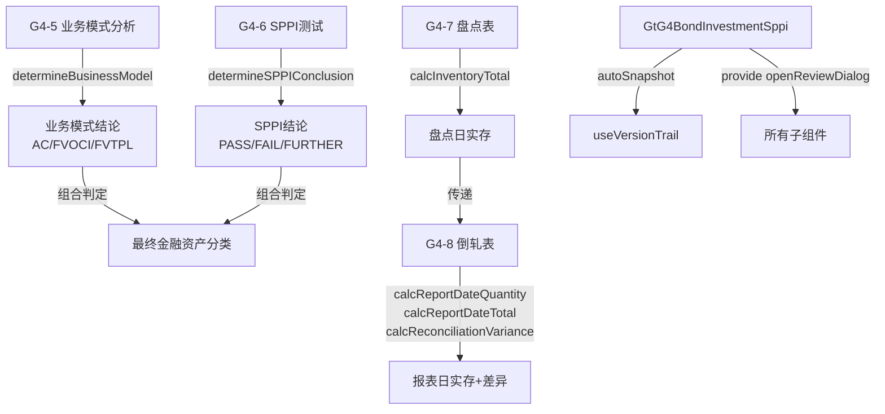

# Design Document: G4 债权投资底稿(SPPI组)专属HTML精美组件

## Overview

G4债权投资(SPPI组)专属组件`g4-bond-investment-sppi`。覆盖1个xlsx源模板中的4个sheet。科目1501债权投资（借方/资产类）。**CAS22金融工具分类的核心判定逻辑**：通过业务模式分析确定管理目标，通过SPPI测试验证合同现金流量特征，结合盘点程序确认证券存在性。

核心架构：
- componentType `g4-bond-investment-sppi`，主入口 GtG4BondInvestmentSppi.vue
- **sheetName v-if dispatch模式**：4 sheets用v-if分发（不用el-tabs）
- 子目录分组：classification/(G4-5+G4-6) / inspection/(G4-7+G4-8)
- 宽表拆分：G4-8盘点倒轧表(18列→3区段Tab，行同步)
- 公式引擎：`useG4SppiFormulaEngine.ts`纯函数composable（决策逻辑+盘点公式）
- UI特色：G4-5问卷式交互(radio+结论chip动态变色) / G4-6方法论上下文(琥珀色) / G4-8区段Tab行同步
- 双模式（HTML ↔ OnlyOffice）+ 导入导出(useG4SppiImportExport, 3张表) + AI(5 section)
- 六大集成：版本链✅ 复核✅ 抽凭❌ 截止❌ 附注EventBus❌ OCR❌

**三组拆分边界**：
| 组 | spec | 覆盖内容 |
|----|------|----------|
| main | g4-bond-investment-main | 程序表G4A + 审定表G4-1 + 明细表G4-2 + 调整分录G4-3 + 利息测算G4-4 + 附注 + 底稿目录 |
| **SPPI(本spec)** | g4-bond-investment-sppi | 业务模式分析G4-5 + SPPI合同现金流G4-6 + 盘点G4-7 + 倒轧G4-8 |
| ECL | g4-bond-investment-ecl | 三阶段划分 + 减值测算 + ECL + 凭证检查 |

## Architecture

### sheetName分发模式 + 子目录组织

GtG4BondInvestmentSppi.vue 接收 `sheetName` prop，用正则提取编码(G4-5/G4-6/G4-7/G4-8)，`v-if` 分发到对应子组件。

```
sheetName → regex提取编码 → v-if匹配 → 子组件渲染
                                     ↘ 未匹配 → OnlyOffice fallback

4 sheets 子目录分组:
├── classification/
│   ├── G4-5   业务模式分析（问卷式决策+结论chip）
│   └── G4-6   合同现金流量特征分析（SPPI测试+方法论上下文）
└── inspection/
    ├── G4-7   有价证券盘点表（盘点记录+合计）
    └── G4-8   盘点倒轧表（18列→3区段Tab，行同步）
```

### 高层数据流



### 文件结构

```
audit-platform/frontend/src/components/workpaper/
├── GtG4BondInvestmentSppi.vue                     # 主入口 sheetName v-if分发（defineAsyncComponent lazy）
├── g4-bond-investment-sppi/
│   ├── classification/
│   │   ├── G4TabBusinessModel.vue                 # G4-5 业务模式分析（问卷+决策chip）
│   │   └── G4TabSppiTest.vue                      # G4-6 SPPI测试（两部分+虚拟滚动+方法论上下文）
│   └── inspection/
│       ├── G4TabSecuritiesInventory.vue            # G4-7 有价证券盘点表
│       └── G4TabInventoryReconciliation.vue        # G4-8 盘点倒轧表（3区段Tab行同步）
├── composables/
│   ├── useG4SppiFormulaEngine.ts                  # G4(SPPI)公式引擎(9个纯函数+parseNum+2个决策函数)
│   ├── useG4SppiFormData.ts                       # 数据加载/保存/selfLoad
│   ├── useG4SppiBusinessModel.ts                  # G4-5问卷逻辑(答案→决策→chip)
│   ├── useG4SppiTest.ts                           # G4-6 SPPI检查逻辑(两部分+动态行)
│   ├── useG4SppiInventory.ts                      # G4-7盘点逻辑(信息头+明细+合计)
│   ├── useG4SppiReconciliation.ts                 # G4-8倒轧逻辑(3区段+行同步+差异高亮)
│   ├── useG4SppiImportExport.ts                   # 导入导出composable(3张表)
│   └── useG4SppiDualMode.ts                       # 双模式OO切换+localStorage

backend/app/routers/wp_render_strategies/
├── _g4_bond_investment_sppi.py                    # render策略+注册RENDERER_DISPATCH
├── _g4_bond_investment_sppi_import_export.py      # 导入导出3端点(3张表×3=9端点)
└── _g4_bond_investment_sppi_ai.py                 # AI生成5 section
```

### G4-5业务模式分析设计（问卷式交互）

```
┌─────────────────────────────────────────────────────────────────────────────────────┐
│ ┌─ 方法论上下文 ─────────────────────────────────────────────────────────────────┐   │
│ │ 🟡 琥珀色左边线+浅黄背景                                                        │   │
│ │ "确定管理债权投资的业务模式，以此为基础对债权投资进行分类"                         │   │
│ └──────────────────────────────────────────────────────────────────────────────────┘   │
│                                                                                     │
│ ═══ (一) 以单一业务模式管理所有债权投资 ═══════════════════════════════════════════│
│ ┌───────────────────────────────────────────────────────────────────────────────┐   │
│ │ Q1: 是否存在大额频繁出售？            [○是 ●否]  说明: [textarea autosize]     │   │
│ │ Q2: 是否涉及交易性金融资产管理？      [○是 ●否]  说明: [textarea autosize]     │   │
│ │ Q3: 是否基于公允价值进行管理？        [○是 ●否]  说明: [textarea autosize]     │   │
│ │ Q4: 是否频繁交易获取短期价差？        [○是 ●否]  说明: [textarea autosize]     │   │
│ │ Q5: 是否存在其他非收取现金流目标？    [○是 ●否]  说明: [textarea autosize]     │   │
│ └───────────────────────────────────────────────────────────────────────────────┘   │
│ 审计评价: [textarea autosize]                                                       │
│                                                                                     │
│ ┌──────────────────────────┐                                                        │
│ │ 结论: 🟢 以收取合同现金流量为目标 │  ← 动态chip (绿/蓝/橙/灰)                  │
│ └──────────────────────────┘                                                        │
│                                                                                     │
│ ═══ (二) 将债权投资分拆为次级组合分别确定业务模式 ═══════════════════════════════│
│ 适用性: [○是，需分拆为次级组合  ●否，单一业务模式适用]                            │
│ (选"是"时展开次级组合编辑区，ElMessageBox.prompt输入组合名→重复(一)的5道问题)        │
│                                                                                     │
│ ─────────────────────────────────────────────────────────────────────────────────── │
│ 审计结论 textarea [AI辅助按钮]                                                      │
│ <details>编制提示</details>                                                          │
└─────────────────────────────────────────────────────────────────────────────────────┘
```

### G4-6 SPPI测试设计（两部分+方法论上下文）

```
┌─────────────────────────────────────────────────────────────────────────────────────┐
│ ═══ (一) 债券投资及委托贷款 ════════════════════════════════════════════════════════│
│ ┌───────────────────────────────────────────────────────────────────────────────┐   │
│ │ 虚拟滚动表格 (el-table-v2)                                                    │   │
│ │ 列: 投资项目|票面价值|票面利率|提前回售(是/否)|展期(是/否)|                     │   │
│ │     权益转换(是/否)|杠杆(是/否)|结论(下拉)|分析项目(下拉)|判断逻辑(方法论)     │   │
│ │                                                                               │   │
│ │ 判断逻辑列: 琥珀色左边线+浅黄背景，根据"分析项目"动态切换内容                  │   │
│ │ ┌─ 方法论上下文 ─────────────────────────────────────────────────────────┐    │   │
│ │ │ 简单条款: "合同现金流量仅为对本金和以未偿付本金金额为基础..."            │    │   │
│ │ │ 浮动利率: "如果浮动利率仅包含对货币时间价值、信用风险..."              │    │   │
│ │ │ 提前偿付: "如果提前偿付金额基本代表未偿付的本金及利息..."              │    │   │
│ │ │ ...                                                                     │    │   │
│ │ └────────────────────────────────────────────────────────────────────────┘    │   │
│ │ [+ 新增投资项目]  [导入导出▾]                                                  │   │
│ └───────────────────────────────────────────────────────────────────────────────┘   │
│ 审计结论 textarea [AI辅助按钮]                                                      │
│                                                                                     │
│ ═══ (二) 银行理财产品 ══════════════════════════════════════════════════════════════│
│ 第一步: 保本保收益判断 (表格)                                                       │
│ 第二步: 浮动收益不现实判断 (表格)                                                   │
│ 第三步: 穿透底层资产分析 (表格)                                                     │
│ 审计结论 textarea [AI辅助按钮]                                                      │
│                                                                                     │
│ <details>编制提示</details>                                                          │
└─────────────────────────────────────────────────────────────────────────────────────┘
```

### G4-8盘点倒轧表 3区段Tab设计（18列）

```
┌─────────────────────────────────────────────────────────────────────────────────────┐
│ ┌───────────────┐ ┌───────────────┐ ┌──────────────────────────┐                   │
│ │盘点日实存(6列) │ │增减变动(2列)   │ │报表日实存+差异(10列)      │  ← 3 区段Tab    │
│ └───────────────┘ └───────────────┘ └──────────────────────────┘                   │
│                                                                                     │
│ ┌───────────────────────────────────────────────────────────────────────────────┐   │
│ │ el-table (动态行，3区段间行同步)                                                │   │
│ │                                                                               │   │
│ │ 盘点日实存(6): 证券名称|数量|面值|总计(公式)|票面利率|到期日                    │   │
│ │                                                                               │   │
│ │ 增减变动(2): 增减数量|增减面值总额                                              │   │
│ │                                                                               │   │
│ │ 报表日实存+差异(10): 报表日数量(公式)|报表日面值|报表日总计(公式)|              │   │
│ │                     票面利率|到期日|账面结存数量|账面结存面值|                    │   │
│ │                     账面结存总计|差异(公式,红色高亮)|备注                        │   │
│ └───────────────────────────────────────────────────────────────────────────────┘   │
│                                                                                     │
│ Tab切换行同步：selectedRowIndex ref跨Tab保持                                         │
│ 差异列：|差异|>0 → 红色高亮 + 备注必填                                              │
│ 底部：合计行 + 审计结论textarea[AI按钮] + <details>编制提示</details>                 │
└─────────────────────────────────────────────────────────────────────────────────────┘
```

### 后端AI Section清单

```
business-model-conclusion / sppi-bond-conclusion / sppi-financial-conclusion / inventory-conclusion / reconciliation-conclusion
```

## Components and Interfaces

### 前端组件接口

```typescript
// GtG4BondInvestmentSppi.vue props
interface G4BondInvestmentSppiProps {
  htmlData: Record<string, any> | null
  sheetName: string
  wpId: string
  projectId: string
  readonly?: boolean
}

// sheetName正则匹配映射
const SHEET_CODE_MAP: Record<string, string> = {
  'G4-5': 'businessModel',
  'G4-6': 'sppiTest',
  'G4-7': 'securitiesInventory',
  'G4-8': 'inventoryReconciliation',
}

// 正则提取：/G4-([5-8])/
function extractSheetCode(sheetName: string): string | null {
  const match = sheetName.match(/G4-([5-8])/)
  return match ? `G4-${match[1]}` : null
}
```

### G4-5 业务模式分析数据模型

```typescript
interface BusinessModelData {
  // (一) 单一业务模式
  questionnaire: QuestionnaireItem[]
  auditEvaluation: string              // 审计评价
  conclusion: 'AC' | 'FVOCI' | 'FVTPL' | 'INCOMPLETE'  // 决策结论

  // (二) 次级组合
  hasSubPortfolios: boolean            // 是否需要分拆（默认false）
  subPortfolios: SubPortfolio[]        // 次级组合列表
  
  // 底部
  auditConclusion: string              // 审计结论
}

interface QuestionnaireItem {
  id: string
  seq: number                          // 1~5
  question: string                     // 检查项目描述
  answer: boolean | null               // 是(true)/否(false)/未回答(null)
  explanation: string                  // 说明textarea
}

interface SubPortfolio {
  id: string
  name: string                         // 组合名称（ElMessageBox.prompt输入）
  questionnaire: QuestionnaireItem[]   // 重复5道问题
  conclusion: 'AC' | 'FVOCI' | 'FVTPL' | 'INCOMPLETE'
}
```

### G4-6 SPPI测试数据模型

```typescript
interface SppiTestData {
  // (一) 债券投资及委托贷款
  bondItems: BondSppiItem[]
  bondConclusion: string               // 审计结论

  // (二) 银行理财产品
  financialProducts: FinancialProductSppiData
  financialConclusion: string          // 审计结论
}

interface BondSppiItem {
  id: string
  investProject: string                // 投资项目名称
  faceValue: number                    // 票面价值
  couponRate: number                   // 票面利率
  hasEarlyRedemption: boolean          // 提前回售选择权
  hasExtension: boolean                // 展期选择权
  hasEquityConversion: boolean         // 权益转换特征
  hasLeverage: boolean                 // 杠杆因素
  conclusion: 'PASS' | 'FAIL' | 'FURTHER_ANALYSIS' | null  // 结论(可自动/可手动)
  analysisType: AnalysisType | null    // 分析项目类型
  methodologyText: string              // 判断逻辑(自动填充，不可编辑)
}

type AnalysisType = 
  | 'simple'           // 简单条款直接分析
  | 'floating_rate'    // 浮动利率
  | 'rate_adjustment'  // 利率调整
  | 'prepayment'       // 提前偿付特征
  | 'extension'        // 展期选择权
  | 'non_recourse'     // 无追索权
  | 'linked_instrument' // 合同挂钩工具

interface FinancialProductSppiData {
  // 第一步：保本保收益
  step1Items: FinancialStep1Item[]
  // 第二步：浮动收益不现实
  step2Items: FinancialStep2Item[]
  // 第三步：穿透底层资产
  step3Items: FinancialStep3Item[]
}

interface FinancialStep1Item {
  id: string
  investProject: string
  totalAmount: number                  // 投资总额
  guaranteesPrincipal: boolean         // 保证本金
  hasFixedReturn: boolean              // 固定收益
  fixedReturnRate: number              // 固定收益率
  hasFloatingReturn: boolean           // 约定浮动收益
  floatingReturnRate: number           // 浮动收益率
  conclusion: 'PASS' | 'FAIL' | null
}

interface FinancialStep2Item {
  id: string
  investProject: string
  fixedReturnRate: number
  floatingMethod: string               // 浮动收益确定方式
  baseVariableHistory: string          // 基础变量历史变动
  isUnrealistic: boolean               // 是否不现实
  conclusion: 'PASS' | 'FAIL' | null
}

interface FinancialStep3Item {
  id: string
  investProject: string
  underlyingAssetType: string          // 底层资产类型
  underlyingSppiFeature: string        // 底层资产SPPI特征
  conclusion: 'PASS' | 'FAIL' | null
}
```

### G4-7 有价证券盘点表数据模型

```typescript
interface SecuritiesInventoryData {
  // 盘点信息头
  header: InventoryHeader
  // 盘点明细
  items: InventoryItem[]
  // 底部
  auditDescription: string             // 审计说明
  auditConclusion: string              // 审计结论
}

interface InventoryHeader {
  company: string                      // 盘点单位
  countDate: string                    // 盘点日期 YYYY-MM-DD
  accountingSupervisor: string         // 会计主管
  cashier: string                      // 出纳
  observer: string                     // 监盘人
  counter: string                      // 盘点人
}

interface InventoryItem {
  id: string
  seq: number
  securitiesName: string               // 证券名称
  faceValue: number                    // 面值
  quantity: number                     // 数量
  total: number                        // 公式: 面值 × 数量 (2dp)
  couponRate: number                   // 票面利率
  maturityDate: string                 // 到期日
}
```

### G4-8 盘点倒轧表数据模型（18列→3区段）

```typescript
interface ReconciliationData {
  items: ReconciliationItem[]
  activeTab: 'countDate' | 'changes' | 'reportDate'  // 当前区段Tab
  selectedRowIndex: number             // 行同步索引
  auditConclusion: string              // 审计结论
}

interface ReconciliationItem {
  id: string
  seq: number
  // ══ 区段1: 盘点日实存(6列) ══
  securitiesName: string               // 证券名称
  countQuantity: number                // 数量
  countFaceValue: number               // 面值
  countTotal: number                   // 公式: 面值 × 数量 (2dp)
  countCouponRate: number              // 票面利率
  countMaturityDate: string            // 到期日

  // ══ 区段2: 增减变动(2列) ══
  changeQuantity: number               // 增减数量(正=增加，负=减少)
  changeFaceValueTotal: number         // 增减面值总额

  // ══ 区段3: 报表日实存+差异(10列) ══
  reportQuantity: number               // 公式: 盘点日数量 + 增减数量
  reportFaceValue: number              // 报表日面值
  reportTotal: number                  // 公式: 报表日面值 × 报表日数量 (2dp)
  reportCouponRate: number             // 报表日票面利率
  reportMaturityDate: string           // 报表日到期日
  bookQuantity: number                 // 账面结存数量
  bookFaceValue: number                // 账面结存面值
  bookTotal: number                    // 账面结存总计
  variance: number                     // 公式: 报表日总计 - 账面结存总计 (2dp)
  remark: string                       // 备注(|差异|>0时必填)
}
```

### 后端接口

```python
# _g4_bond_investment_sppi.py
# RENDERER_DISPATCH注册
def render_g4_bond_investment_sppi(wp_id: str, config: dict) -> dict:
    """Render策略函数，返回componentType='g4-bond-investment-sppi'和sheets配置"""

# _g4_bond_investment_sppi_import_export.py
POST /api/workpapers/{wp_id}/g4-sppi/export-template?sheet={code}
POST /api/workpapers/{wp_id}/g4-sppi/export-data?sheet={code}
POST /api/workpapers/{wp_id}/g4-sppi/import-data?sheet={code}  # multipart/form-data
# sheet codes: G4-6 / G4-7 / G4-8
# G4-8按3区段分sheet导出（盘点日实存/增减变动/报表日实存+差异）

# _g4_bond_investment_sppi_ai.py
POST /api/workpapers/{wp_id}/g4-sppi/ai/{section}
# section: business-model-conclusion / sppi-bond-conclusion / sppi-financial-conclusion / inventory-conclusion / reconciliation-conclusion
```

### 注册四件套

```python
# 1. htmlRendererRegistry (前端)
'g4-bond-investment-sppi': () => import('./workpaper/GtG4BondInvestmentSppi.vue')

# 2. wp_code_overrides.json (4条)
{
  "G4-5-业务模式分析": "g4-bond-investment-sppi",
  "G4-6-合同现金流量特征分析": "g4-bond-investment-sppi",
  "G4-7-有价证券盘点表": "g4-bond-investment-sppi",
  "G4-8-盘点倒轧表": "g4-bond-investment-sppi"
}

# 3. VALID_COMPONENT_TYPES (后端)
'g4-bond-investment-sppi'

# 4. RENDERER_DISPATCH (后端)
'g4-bond-investment-sppi': render_g4_bond_investment_sppi
```

## Data Models

### 存储结构（working_paper.content JSON）

```typescript
interface G4SppiContent {
  // G4-5 业务模式分析
  businessModel: BusinessModelData
  // G4-6 SPPI测试
  sppiTest: SppiTestData
  // G4-7 盘点表
  securitiesInventory: SecuritiesInventoryData
  // G4-8 倒轧表
  reconciliation: ReconciliationData
}
```

### 方法论上下文映射（G4-6判断逻辑列）

```typescript
const METHODOLOGY_MAP: Record<AnalysisType, string> = {
  simple: '合同现金流量仅为对本金和以未偿付本金金额为基础的利息的支付（即仅包含货币时间价值、信用风险对价和其他基本贷款风险和成本的对价，以及利润率），则通过SPPI测试。',
  floating_rate: '如果浮动利率仅包含对货币时间价值、信用风险、流动性风险和管理成本的对价，且不含杠杆特征，则浮动利率条款不影响SPPI通过。',
  rate_adjustment: '如果利率调整条款的时间与利率重置频率不匹配，需评估合同现金流量差异是否显著。差异不显著时，仍可通过SPPI测试。',
  prepayment: '如果提前偿付金额基本代表未偿付的本金及以未偿付本金为基础的利息（可能包含提前终止的合理补偿），则不影响SPPI判断。',
  extension: '如果展期选择权使得在展期期间的合同现金流量仍为对本金和利息的支付，且不含杠杆特征，则展期条款不影响SPPI通过。',
  non_recourse: '无追索权特征不必然导致SPPI测试不通过。需穿透至底层资产，评估底层资产现金流量特征。',
  linked_instrument: '如果合同挂钩工具的现金流量与基本贷款安排不一致（如挂钩权益工具或商品价格），则SPPI测试不通过。',
}
```

### 决策结论chip样式映射

```typescript
const CONCLUSION_CHIP_MAP: Record<string, { color: string; label: string }> = {
  AC: { color: '#67C23A', label: '以收取合同现金流量为目标' },
  FVOCI: { color: '#409EFF', label: '以收取和出售为目标' },
  FVTPL: { color: '#E6A23C', label: '其他' },
  INCOMPLETE: { color: '#909399', label: '请完成所有问题' },
}
```

## Formula Engine Design

### useG4SppiFormulaEngine.ts — 9个纯函数 + parseNum + 2个决策函数

所有函数为纯函数（无副作用、无Vue响应式依赖、无外部状态），支持fast-check PBT验证。

```typescript
// ══════════════════════════════════════════════════════════
// parseNum — 输入清洗（null/undefined/NaN/空串 → 0）
// ══════════════════════════════════════════════════════════
export function parseNum(v: unknown): number {
  if (v === null || v === undefined || v === '') return 0
  const n = Number(v)
  return Number.isFinite(n) ? n : 0
}

// ══════════════════════════════════════════════════════════
// 决策函数1: 业务模式分类（5布尔→分类结果）
// ══════════════════════════════════════════════════════════
export interface BusinessModelAnswers {
  q1: boolean | null  // 是否存在大额频繁出售
  q2: boolean | null  // 是否涉及交易性金融资产管理
  q3: boolean | null  // 是否基于公允价值进行管理
  q4: boolean | null  // 是否频繁交易获取短期价差
  q5: boolean | null  // 是否存在其他非收取现金流目标
}

export type BusinessModelResult = 'AC' | 'FVOCI' | 'FVTPL' | 'INCOMPLETE'

export function determineBusinessModel(answers: BusinessModelAnswers): BusinessModelResult {
  const { q1, q2, q3, q4, q5 } = answers
  // 任一答案为null/undefined → INCOMPLETE
  if (q1 === null || q1 === undefined ||
      q2 === null || q2 === undefined ||
      q3 === null || q3 === undefined ||
      q4 === null || q4 === undefined ||
      q5 === null || q5 === undefined) {
    return 'INCOMPLETE'
  }
  // q3/q4/q5任一为true → FVTPL（交易性/频繁出售/基于公允价值）
  if (q3 || q4 || q5) return 'FVTPL'
  // q1或q2为true但q3~q5全false → FVOCI（存在一定出售但非交易性）
  if (q1 || q2) return 'FVOCI'
  // 全false → AC（以收取合同现金流量为目标）
  return 'AC'
}

// ══════════════════════════════════════════════════════════
// 决策函数2: SPPI结论推导（4布尔→结论）
// ══════════════════════════════════════════════════════════
export type SPPIResult = 'PASS' | 'FAIL' | 'FURTHER_ANALYSIS'

export function determineSPPIConclusion(
  hasEarlyRedemption: boolean,
  hasExtension: boolean,
  hasEquityConversion: boolean,
  hasLeverage: boolean
): SPPIResult {
  // 权益转换或杠杆 → 必FAIL
  if (hasEquityConversion || hasLeverage) return 'FAIL'
  // 仅提前回售或展期 → 需进一步分析
  if (hasEarlyRedemption || hasExtension) return 'FURTHER_ANALYSIS'
  // 全false → PASS
  return 'PASS'
}

// ══════════════════════════════════════════════════════════
// 公式1: 盘点总计 = 面值 × 数量（2dp）
// ══════════════════════════════════════════════════════════
export function calcInventoryTotal(faceValue: number, quantity: number): number {
  return Math.round(parseNum(faceValue) * parseNum(quantity) * 100) / 100
}

// ══════════════════════════════════════════════════════════
// 公式2: 报表日数量 = 盘点日数量 + 增减数量
// ══════════════════════════════════════════════════════════
export function calcReportDateQuantity(countDateQty: number, change: number): number {
  return parseNum(countDateQty) + parseNum(change)
}

// ══════════════════════════════════════════════════════════
// 公式3: 报表日总计 = 报表日面值 × 报表日数量（2dp）
// ══════════════════════════════════════════════════════════
export function calcReportDateTotal(reportFaceValue: number, reportQuantity: number): number {
  return Math.round(parseNum(reportFaceValue) * parseNum(reportQuantity) * 100) / 100
}

// ══════════════════════════════════════════════════════════
// 公式4: 差异 = 报表日总计 - 账面结存总计（2dp）
// ══════════════════════════════════════════════════════════
export function calcReconciliationVariance(reportDateTotal: number, bookTotal: number): number {
  return Math.round((parseNum(reportDateTotal) - parseNum(bookTotal)) * 100) / 100
}

// ══════════════════════════════════════════════════════════
// 公式5: 倒轧平衡判定 — |差异| < 0.01
// ══════════════════════════════════════════════════════════
export function isReconciliationBalanced(reportDateTotal: number, bookTotal: number): boolean {
  return Math.abs(parseNum(reportDateTotal) - parseNum(bookTotal)) < 0.01
}

// ══════════════════════════════════════════════════════════
// 公式6: 合计行求和（数组元素之和）
// ══════════════════════════════════════════════════════════
export function calcSumColumn(values: number[]): number {
  if (!values || values.length === 0) return 0
  return values.reduce((sum, v) => sum + parseNum(v), 0)
}

// ══════════════════════════════════════════════════════════
// 组合判定: SPPI + 业务模式 → 最终金融资产分类
// ══════════════════════════════════════════════════════════
export type FinalClassification = 'AC' | 'FVOCI' | 'FVTPL'

export function determineFinalClassification(
  businessModel: BusinessModelResult,
  sppiResult: SPPIResult
): FinalClassification {
  // SPPI不通过 → 一律FVTPL
  if (sppiResult === 'FAIL') return 'FVTPL'
  // SPPI通过且业务模式为AC → AC
  if (sppiResult === 'PASS' && businessModel === 'AC') return 'AC'
  // SPPI通过且业务模式为FVOCI → FVOCI
  if (sppiResult === 'PASS' && businessModel === 'FVOCI') return 'FVOCI'
  // 其他情况（FURTHER_ANALYSIS或业务模式为FVTPL）→ FVTPL
  return 'FVTPL'
}
```

### PBT策略

- 框架：vitest + fast-check
- 文件：`useG4SppiFormulaEngine.pbt.spec.ts`
- 每个Property对应一个`fc.assert(fc.property(...))`
- numRuns: ≥100
- 生成器：
  - `fc.boolean()` 用于决策函数布尔输入
  - `fc.float({min: 0, max: 1e8, noNaN: true})` 用于面值金额
  - `fc.integer({min: 0, max: 1e6})` 用于数量
  - `fc.integer({min: -1e4, max: 1e4})` 用于增减变动
  - `fc.array(fc.float({min: -1e8, max: 1e8, noNaN: true}))` 用于合计数组
  - `fc.oneof(fc.constant(null), fc.constant(undefined), fc.constant(''), fc.constant(NaN), fc.constant('abc'), fc.float())` 用于parseNum

## Integration Design（6大集成接入点）

### 1. 版本链 (useVersionTrail) ✅

```typescript
// GtG4BondInvestmentSppi.vue 主入口
const { autoSnapshot, showVersionTrail } = useVersionTrail(wpId)

// 保存时自动快照
async function handleSave() {
  await saveData()
  await autoSnapshot()  // 触发版本快照
}

// 工具栏"版本历史"按钮 → GtWpVersionTrail drawer
```

### 2. 复核对话 (provide/inject) ✅

```typescript
// GtG4BondInvestmentSppi.vue (provide)
import { useReviewDialog } from '@/composables/useReviewDialog'
const { openReviewDialog } = useReviewDialog(wpId)
provide('openReviewDialog', openReviewDialog)

// 子组件 section标题栏右侧按钮 (inject)
const openReviewDialog = inject('openReviewDialog')
// <el-button @click="openReviewDialog('G4-5业务模式分析')" icon="ChatDotRound" />
```

### 3. 抽凭引擎 — ❌ 不集成

G4-5~G4-8均非凭证检查表，不涉及抽凭操作。

### 4. 截止自动提取 — ❌ 不集成

SPPI分析和盘点程序不涉及截止测试。

### 5. 附注EventBus — ❌ 不集成

SPPI分析和盘点结果不直接回写附注（由G4-1审定表统一发布）。

### 6. 行级OCR — ❌ 不集成

盘点表为手工记录表，非凭证附件表。

## Performance Strategy

### 虚拟滚动

| 组件 | 行数 | 策略 |
|------|------|------|
| G4-6 SPPI测试(部分一) | ≤80行 | 启用虚拟滚动（el-table-v2 或 vxe-table virtual） |
| G4-7 盘点表 | ≤29行 | 无需虚拟滚动 |
| G4-8 倒轧表 | ≤39行 | 无需虚拟滚动 |

### 懒加载

```typescript
// GtG4BondInvestmentSppi.vue
const G4TabBusinessModel = defineAsyncComponent(
  () => import('./g4-bond-investment-sppi/classification/G4TabBusinessModel.vue')
)
const G4TabSppiTest = defineAsyncComponent(
  () => import('./g4-bond-investment-sppi/classification/G4TabSppiTest.vue')
)
const G4TabSecuritiesInventory = defineAsyncComponent(
  () => import('./g4-bond-investment-sppi/inspection/G4TabSecuritiesInventory.vue')
)
const G4TabInventoryReconciliation = defineAsyncComponent(
  () => import('./g4-bond-investment-sppi/inspection/G4TabInventoryReconciliation.vue')
)
```

### G4-8 区段Tab切换性能

- Tab切换时不销毁el-table实例，仅切换列定义(columns computed)
- 行数据共享同一reactive数组，3区段引用同一items
- 行选中状态通过`selectedRowIndex` ref保持（跨Tab同步）
- 避免切换时重新渲染整个表格 → 无闪烁/无延迟

## Error Handling

1. **selfLoad失败**：render-config返回404/500时显示错误卡片+重试按钮
2. **公式计算异常**：parseNum兜底（null/undefined/NaN/空串→0），所有公式不抛异常不返回NaN
3. **决策逻辑未完成**：determineBusinessModel返回'INCOMPLETE'时灰色chip提示"请完成所有问题"
4. **SPPI自动结论覆盖**：determineSPPIConclusion自动设结论后用户仍可手动修改（手动优先级>自动）
5. **倒轧差异非零**：|差异|>0时红色高亮差异单元格+备注列必填校验
6. **区段Tab行同步**：切换Tab时保持selectedRowIndex，超出范围则重置为0
7. **80行虚拟滚动**：G4-6超长列表确保DOM节点不超过可视区+buffer
8. **动态行增删**：ElMessageBox.prompt取消→不创建行；空名称→阻止创建
9. **导入格式错误**：后端返回详细错误列表（行号/字段/原因），前端ElMessage展示
10. **浮点精度**：金额保留2位小数(四舍五入)，利率保留至少4位小数
11. **G4-8多区段导出**：按3区段分sheet导出，每sheet独立表头

## Correctness Properties

*A property is a characteristic or behavior that should hold true across all valid executions of a system—essentially, a formal statement about what the system should do. Properties serve as the bridge between human-readable specifications and machine-verifiable correctness guarantees.*

### Property 1: 业务模式决策确定性

*For any* answers ∈ {q1~q5: boolean}: `determineBusinessModel(answers)` 的输出仅取决于输入组合，相同输入永远产出相同分类结果。即对同一组answers调用两次，结果完全相等。

**Validates: Requirements 6.1**

### Property 2: 业务模式决策完备性

*For any* answers ∈ {q1~q5: boolean}（32种全布尔组合）: `determineBusinessModel(answers)` ∈ {'AC', 'FVOCI', 'FVTPL'}，不存在未定义输出或异常。

**Validates: Requirements 6.1, 2.3**

### Property 3: 业务模式决策互斥性

*For any* answers ∈ {q1~q5: boolean}: `determineBusinessModel(answers)` 恰好属于 AC/FVOCI/FVTPL 之一（三种分类互斥，不可能同时满足两类条件）。

**Validates: Requirements 6.1, 2.3**

### Property 4: SPPI结论推导确定性

*For any* (earlyRedemption, extension, equityConversion, leverage) ∈ boolean⁴: `determineSPPIConclusion` 的输出仅取决于4个布尔输入，确定性映射到 PASS/FAIL/FURTHER_ANALYSIS 之一。

**Validates: Requirements 6.2, 3.8**

### Property 5: SPPI失败条件充分性

*For any* inputs where hasEquityConversion=true OR hasLeverage=true: `determineSPPIConclusion(...)` === 'FAIL'（权益转换或杠杆因素必导致SPPI不通过）。

**Validates: Requirements 6.2, 3.8**

### Property 6: SPPI通过条件必要性

*For any* inputs: `determineSPPIConclusion(...)` === 'PASS' → (hasEarlyRedemption=false AND hasExtension=false AND hasEquityConversion=false AND hasLeverage=false)（通过SPPI必须4项均为否）。

**Validates: Requirements 6.2, 3.8**

### Property 7: 盘点总计公式

*For any* faceValue ∈ ℝ≥0, quantity ∈ ℤ≥0: `calcInventoryTotal(faceValue, quantity)` === `round(faceValue × quantity, 2)`（乘法+2位小数四舍五入）。

**Validates: Requirements 6.3, 4.4, 5.2**

### Property 8: 报表日数量加法恒等

*For any* countDateQty ∈ ℤ≥0, change ∈ ℤ: `calcReportDateQuantity(countDateQty, change)` === `countDateQty + change`（纯加法恒等）。

**Validates: Requirements 6.4, 5.3**

### Property 9: 倒轧差异公式

*For any* reportTotal, bookTotal ∈ ℝ≥0: `calcReconciliationVariance(reportTotal, bookTotal)` === `round(reportTotal - bookTotal, 2)`（减法+2位小数）。

**Validates: Requirements 6.6, 5.5**

### Property 10: 倒轧平衡判定一致性

*For any* reportTotal, bookTotal ∈ ℝ≥0: `isReconciliationBalanced(reportTotal, bookTotal)` ↔ (`|reportTotal - bookTotal| < 0.01`)（阈值判定双向等价）。

**Validates: Requirements 6.7, 5.6**

### Property 11: 合计行加法交换律

*For any* values ∈ ℝ[]: `calcSumColumn(values)` === `calcSumColumn(shuffle(values))`（求和结果与元素顺序无关）。

**Validates: Requirements 6.8, 4.5, 5.8**

### Property 12: parseNum健壮性

*For any* input ∈ {null, undefined, '', NaN, '  ', 'abc'}: `parseNum(input)` === 0；*For any* n ∈ ℝ (finite): `parseNum(n)` === n（有效数字透传，无效值兜底为0）。

**Validates: Requirements 6.9**

### Property 13: SPPI与业务模式组合分类

*For any* businessModel ∈ {AC, FVOCI, FVTPL}, sppiResult ∈ {PASS, FAIL, FURTHER_ANALYSIS}: 
- 当 sppiResult='FAIL' 时: `determineFinalClassification(businessModel, sppiResult)` === 'FVTPL'（SPPI不通过→一律FVTPL）
- 当 businessModel='AC' 且 sppiResult='PASS' 时: 最终分类为'AC'

**Validates: Requirements 6.1, 6.2 (组合逻辑)**

## Testing Strategy

### 前端PBT测试

| 测试文件 | 覆盖Property | 框架 | numRuns |
|----------|-------------|------|---------|
| `useG4SppiFormulaEngine.pbt.spec.ts` | P1~P13 | vitest + fast-check | ≥100 |

每个Property对应一个独立test case，使用tag注释：
```typescript
// Feature: g4-bond-investment-sppi, Property 1: 业务模式决策确定性
// Feature: g4-bond-investment-sppi, Property 2: 业务模式决策完备性
// Feature: g4-bond-investment-sppi, Property 3: 业务模式决策互斥性
// ...
```

### 前端单元测试

| 测试文件 | 覆盖范围 |
|----------|----------|
| `useG4SppiFormulaEngine.spec.ts` | parseNum边界、除零保护、浮点精度、决策边界用例 |
| `G4TabBusinessModel.spec.ts` | 问卷UI交互、chip变色、次级组合展开/折叠 |
| `G4TabSppiTest.spec.ts` | 方法论上下文动态切换、自动结论设置、虚拟滚动 |
| `G4TabInventoryReconciliation.spec.ts` | 3区段Tab切换行同步、差异红色高亮 |

### 后端测试

| 测试文件 | 覆盖范围 |
|----------|----------|
| `test_g4_bond_investment_sppi_pbt.py` | 公式round-trip + 决策逻辑(hypothesis, max_examples=5) |
| `test_g4_bond_investment_sppi.py` | render策略+注册契约+导入导出 |

### 集成测试

- sheetName分发正确性（4个sheet名→对应组件 + 未知名→OnlyOffice fallback）
- G4-5问卷→决策→chip完整流程（5道问题→determineBusinessModel→chip颜色）
- G4-6 SPPI自动结论（4布尔标志→determineSPPIConclusion→结论下拉）
- G4-6方法论上下文动态切换（7种分析项目→对应方法论文本）
- G4-7盘点明细公式链（面值×数量=总计→合计行）
- G4-8三区段Tab行同步 + 倒轧公式链完整性
- G4-8差异>0→红色高亮+备注必填
- 导入导出round-trip(3张表: G4-6/G4-7/G4-8)
- G4-8按3区段分sheet导出
- 版本链autoSnapshot触发
- 复核对话provide/inject传递
- selfLoad模式（htmlData=null时调用render-config）
