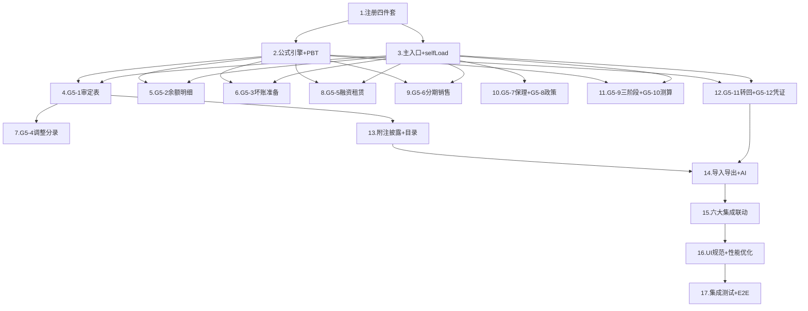

# Implementation Plan: G5 长期应收款底稿专属HTML精美组件

## Overview

G5长期应收款专属组件 `g5-long-term-receivable`，覆盖16个sheet（G5A/G5-1~G5-12/附注披露(上市)/附注披露(国企)/底稿目录）。采用sheetName v-if dispatch模式 + defineAsyncComponent懒加载×16 + 公式引擎composable(22纯函数) + 六大集成联动。按D~N底稿开发标准8步组织为12波次。特色：内含利率法(G5-5)+实际利率法(G5-6)+保理终止确认(G5-7)+ECL三阶段(G5-9)+ECL公式链(G5-10)。

## Task Dependency Graph



```json
{
  "waves": [
    { "id": "wave-1", "name": "基础注册", "tasks": [1] },
    { "id": "wave-2", "name": "公式引擎+PBT", "tasks": [2] },
    { "id": "wave-3", "name": "主入口+数据层", "tasks": [3] },
    { "id": "wave-4", "name": "核心表(审定+明细+坏账)", "tasks": [4, 5, 6] },
    { "id": "wave-5", "name": "调整分录", "tasks": [7] },
    { "id": "wave-6", "name": "融资测算(租赁+销售)", "tasks": [8, 9] },
    { "id": "wave-7", "name": "保理+政策检查", "tasks": [10] },
    { "id": "wave-8", "name": "减值(三阶段+测算)", "tasks": [11] },
    { "id": "wave-9", "name": "转回核销+凭证检查", "tasks": [12] },
    { "id": "wave-10", "name": "附注+目录", "tasks": [13] },
    { "id": "wave-11", "name": "导入导出+AI+双模式+集成", "tasks": [14, 15] },
    { "id": "wave-12", "name": "UI优化+测试", "tasks": [16, 17] }
  ]
}
```

## Tasks

- [x] 1. 注册四件套 + render策略
  - [x] 1.1 后端注册：VALID_COMPONENT_TYPES添加'g5-long-term-receivable' + RENDERER_DISPATCH注册render_g5_long_term_receivable策略函数
    - 创建 `backend/app/routers/wp_render_strategies/_g5_long_term_receivable.py`
    - 在 `VALID_COMPONENT_TYPES` 列表中添加 `'g5-long-term-receivable'`
    - 在 `RENDERER_DISPATCH` 中注册 `'g5-long-term-receivable': render_g5_long_term_receivable`
    - render函数返回16个sheet的配置（componentType/sheetName/columns/rows）
    - _Requirements: 1.1, 1.3, 1.5_

  - [x] 1.2 前端注册：htmlRendererRegistry添加映射 + 创建主入口骨架GtG5LongTermReceivable.vue
    - 在 `htmlRendererRegistry` 中添加 `'g5-long-term-receivable': () => import('./workpaper/GtG5LongTermReceivable.vue')`
    - 创建 `GtG5LongTermReceivable.vue` 骨架（接收props，v-if分发占位，defineAsyncComponent×16）
    - _Requirements: 1.1, 1.2, 1.3_

  - [x] 1.3 wp_code_overrides.json添加16条映射
    - G5A/G5-1~G5-12/G5-note-listed/G5-note-soe/G5-directory → 'g5-long-term-receivable'
    - _Requirements: 1.4_

  - [x] 1.4 创建子目录结构
    - 创建 `g5-long-term-receivable/core/` `measurement/` `impairment/` `voucher/` 四个子目录
    - 每个子目录放对应子组件占位文件
    - _Requirements: 1.8_

- [x] 2. 公式引擎composable + PBT测试
  - [x] 2.1 实现useG5FormulaEngine.ts（22个纯函数 + parseNum）
    - 创建 `audit-platform/frontend/src/composables/useG5FormulaEngine.ts`
    - 实现 parseNum（null/undefined/NaN/空串→0）
    - 实现基础公式：calcDebitBalance / calcAdjustedAmount / calcNetValue / calcReportAmount / calcChangeRate
    - 实现融资租赁：calcNetInvestment / calcLeaseFinancingIncome / calcEndingReceivable / calcEndingUnrealizedIncome
    - 实现分期销售：calcInstallmentFinancingIncome / calcSalesAmortizedCost
    - 实现ECL：calcImpairmentProvision / calcImpairmentAdjustment / calcAdjustedBalance / calcAdjustedImpairment / calcAdjustedBookValue
    - 实现判定：determineStage
    - 实现校验：isDebitCreditBalanced / isReversalValid / calcAgingTotal / calcCurrentYearProvision
    - 所有函数无副作用、输入通过parseNum清洗
    - _Requirements: 15.1~15.22_

  - [x]* 2.2 PBT: Property 1 — 借方余额公式
    - **Property 1: calcDebitBalance(opening, debit, credit) === opening + debit - credit**
    - **Validates: Requirements 15.1**
    - numRuns ≥ 100

  - [x]* 2.3 PBT: Property 2 — 审定数公式
    - **Property 2: calcAdjustedAmount(unadjusted, aje, rje) === unadjusted + aje + rje**
    - **Validates: Requirements 15.2**

  - [x]* 2.4 PBT: Property 3 — 内含利率法核心
    - **Property 3: calcLeaseFinancingIncome(netInvestment, implicitRate) === netInvestment × implicitRate**
    - **Validates: Requirements 15.6**

  - [x]* 2.5 PBT: Property 4 — 实际利率法核心
    - **Property 4: calcInstallmentFinancingIncome(amortizedCost, effectiveRate) === amortizedCost × effectiveRate**
    - **Validates: Requirements 15.7**

  - [x]* 2.6 PBT: Property 5 — 融资租赁期间连续性
    - **Property 5: calcNetInvestment(calcEndingReceivable(...), calcEndingUnrealizedIncome(...)) === (openRec-collection)-(openUnr-income)**
    - **Validates: Requirements 15.5, 15.8, 15.9**

  - [x]* 2.7 PBT: Property 6 — 分期销售摊余成本递推
    - **Property 6: calcSalesAmortizedCost(cost, cost×rate, collection) === cost×(1+rate)-collection**
    - **Validates: Requirements 15.10**

  - [x]* 2.8 PBT: Property 7 — ECL公式链一致性
    - **Property 7: 审定账面价值 === (①+⑤)-(①×②+⑤×②A+①×(②A-②))**
    - **Validates: Requirements 15.11~15.15**
    - 组合验证 calcImpairmentProvision + calcImpairmentAdjustment + calcAdjustedBalance + calcAdjustedImpairment + calcAdjustedBookValue

  - [x]* 2.9 PBT: Property 8 — 坏账调整公式展开
    - **Property 8: calcImpairmentAdjustment === balanceAdj×adjRate + origBalance×(adjRate-origRate)**
    - **Validates: Requirements 15.12**

  - [x]* 2.10 PBT: Property 9+10 — 三阶段确定性+Stage3优先级
    - **Property 9: determineStage输出∈{Stage1,Stage2,Stage3}**
    - **Property 10: hasCreditImpairment=true → Stage3**
    - **Validates: Requirements 15.16**

  - [x]* 2.11 PBT: Property 11 — 借贷平衡恒等
    - **Property 11: isDebitCreditBalanced ↔ |SUM(debits)-SUM(credits)|<0.01**
    - **Validates: Requirements 15.17**

  - [x]* 2.12 PBT: Property 12 — 转回有效性
    - **Property 12: isReversalValid ↔ reversal ≤ accumulated**
    - **Validates: Requirements 15.18**

  - [x]* 2.13 PBT: Property 13+14 — 净值+报表数
    - **Property 13: calcNetValue === gross - provision**
    - **Property 14: calcReportAmount === net - oneYear**
    - **Validates: Requirements 15.3, 15.4**

  - [x]* 2.14 PBT: Property 15+16+17+18 — 账龄/parseNum/变动率/净投资
    - **Property 15: calcAgingTotal交换律**
    - **Property 16: parseNum(null/undefined/NaN/'')===0**
    - **Property 17: calcChangeRate方向性**
    - **Property 18: calcNetInvestment恒等**
    - **Validates: Requirements 15.19~15.21, 15.5**

  - [x] 2.15 单元测试：parseNum边界 + 除零保护 + 浮点精度
    - parseNum(null/undefined/NaN/''/非数字) → 0
    - calcChangeRate(0, x) → null
    - 浮点精度 toBeCloseTo(expected, 6)
    - _Requirements: 15.21_

- [x] 3. 主入口sheetName分发 + selfLoad + 数据composable
  - [x] 3.1 GtG5LongTermReceivable.vue 完整实现
    - sheetName正则提取编码（16个映射）
    - v-if分发到16个defineAsyncComponent子组件
    - selfLoad模式：htmlData为null时调用render-config?force_component_type=g5-long-term-receivable
    - 未匹配sheetName → OnlyOffice fallback
    - _Requirements: 1.1, 1.2, 1.6, 1.7_

  - [x] 3.2 useG5FormData.ts composable
    - 数据加载/保存统一入口
    - selfLoad逻辑（bundle内嵌场景htmlData为null）
    - trial_balance取数(科目1531)
    - 保存触发EventBus WORKPAPER_SAVED
    - _Requirements: 3.8, 16.1_

- [x] 4. G5-1 审定表（87行多层结构）
  - [x] 4.1 G5TabAdjudication.vue 组件
    - 87行×13列五层分组结构（原值/坏账/净值/一年内到期/报表列示数）
    - 按分组展开/折叠（默认展开）
    - 虚拟滚动（87行）
    - 列：项目|期初(未审|AJE|RJE|审定)|期末(未审|AJE|RJE|审定)|变动额|变动率|原因分析
    - _Requirements: 3.1, 3.2, 3.13_

  - [x] 4.2 useG5Adjudication.ts composable
    - 五层分组数据结构管理
    - 公式联动：借方余额/审定数/净值/报表数/变动率
    - 试算表取数(科目1531) + 差异计算
    - 差异≠0红色高亮 / |变动率|>20%橙色+必填原因
    - EventBus发布 substantive:adjudicated
    - _Requirements: 3.3~3.12_

- [x] 5. G5-2 余额明细表（22列→2区段Tab）
  - [x] 5.1 G5TabBalanceDetail.vue 组件
    - 2区段Tab（债务人基础10列 / 余额分析+账龄12列）
    - Tab切换行同步
    - 115行虚拟滚动
    - 底部合计行
    - 动态行增删（ElMessageBox.prompt输入债务人名称）
    - _Requirements: 5.1, 5.6, 5.7, 5.8, 5.9_

  - [x] 5.2 useG5BalanceDetail.ts composable
    - 期末余额 = 合同总额 - 已收回金额
    - 净额 = 期末余额 - 未实现融资收益
    - 账龄合计 = 各账龄段之和
    - 账龄合计≠净额 → 红色高亮
    - _Requirements: 5.2~5.5_

- [x] 6. G5-3 坏账准备明细表（20列→2区段Tab）
  - [x] 6.1 G5TabBadDebtDetail.vue 组件
    - 2区段Tab（未审+调整11列 / 审定数9列）
    - Tab切换行同步
    - 按计提方式分组（组合/单项/合计）
    - 动态行增删（ElMessageBox.prompt输入债务人名称）
    - _Requirements: 6.1, 6.8, 6.9, 6.10_

  - [x] 6.2 useG5BadDebtDetail.ts composable
    - ECL公式链：③=①×② / ⑥=⑤×②A+①×(②A-②) / ⑦=①+⑤ / ⑧=③+⑥ / ⑨=⑦-⑧
    - 本年计提 = 审定坏账-上年+转回
    - _Requirements: 6.2~6.7_

- [x] 7. G5-4 调整分录汇总
  - [x] 7.1 G5TabAdjustment.vue + useG5Adjustment.ts
    - 24行×10列：序号|分录类型|日期|摘要|科目代码|科目名称|借方|贷方|编制人|备注
    - 借贷平衡校验：|SUM(借)-SUM(贷)|<0.01
    - 不平衡红色高亮+差额显示
    - 动态行增删（ElMessageBox.prompt输入摘要）
    - 保存时AJE/RJE汇总回写G5-1
    - _Requirements: 7.1~7.5_

- [x] 8. G5-5 融资租赁测算（内含利率法，18列→2区段Tab）
  - [x] 8.1 G5TabLeaseAmortization.vue 组件
    - 2区段Tab（租赁基础8列 / 摊销计算10列）
    - 每个租赁项目独立成组（Tab1一行↔Tab2多行）
    - 顶部方法论上下文（琥珀色+浅黄）
    - 底部审计结论textarea + AI按钮 + 编制提示折叠
    - 动态行增删（ElMessageBox.prompt输入项目名称）
    - _Requirements: 8.1, 8.8, 8.10, 8.11, 8.12_

  - [x] 8.2 useG5LeaseAmortization.ts composable
    - 净投资额 = 应收 - 未实现
    - 融资收益 = 净投资额 × 内含利率（核心）
    - 期末应收 = 期初 - 收款
    - 期末未实现 = 期初 - 收益
    - 期间连续性验证（N期期初=N-1期期末）
    - 差异 = 审计测算 - 企业账面（>重要性水平红色）
    - _Requirements: 8.2~8.9_

- [x] 9. G5-6 分期销售测算（实际利率法）
  - [x] 9.1 G5TabInstallmentSales.vue + useG5InstallmentSales.ts
    - 两section：(一)初始交易要素6列 + (二)分期摊销8列
    - 未实现融资收益 = 应收总额 - 公允价值
    - 摊余成本 = 应收 - 未实现
    - 融资收益 = 摊余成本 × 实际利率（核心）
    - 期末摊余 = 期初 + 收益 - 收款
    - 每项目独立成组，期间连续性验证
    - 动态行增删 + 底部结论+AI+编制提示
    - _Requirements: 9.1~9.10_

- [x] 10. G5-7 保理核查 + G5-8 会计政策检查
  - [x] 10.1 G5TabFactoringCheck.vue + useG5FactoringCheck.ts
    - 38行×9列：序号|债务人|保理商|金额|方式|终止确认|判断依据|结论|索引
    - 方法论上下文（终止确认五项条件）
    - 有追索+终止确认=是 → 橙色警告
    - 底部汇总（总额/已终止/未终止）+ 结论+AI+编制提示
    - 动态行增删
    - _Requirements: 10.1~10.6_

  - [x] 10.2 G5TabEclPolicy.vue + useG5EclPolicy.ts
    - 46行×15列，四section问卷
    - Section(一)(二)(三)：检查项|要求|企业政策|合规性|说明
    - Section(四)：政策事项|上年|本年|变更|理由|合理性
    - 每section标题行AI按钮
    - Section(二)(三)动态行增删
    - 底部综合结论 + 编制提示
    - _Requirements: 11.1~11.6_

- [x] 11. G5-9 三阶段划分 + G5-10 坏账准备测算
  - [x] 11.1 G5TabStageClassification.vue + useG5StageClassification.ts
    - 列式转置→行式交互视图（同G4-9方案）
    - 行式：债务人|显著增加|低风险|已减值|企业阶段|审计阶段|一致|差异说明|索引
    - determineStage规则计算审计判断阶段
    - 不一致红色高亮+强制差异说明
    - 展开/折叠详情（逐项检查明细）
    - 底部汇总（S1/S2/S3数量/不一致数）
    - 16384列源模板智能解析（仅取实际有数据列）
    - 动态债务人增删
    - _Requirements: 12.1~12.10_

  - [x] 11.2 G5TabImpairmentCalc.vue + useG5ImpairmentCalc.ts
    - 19列→2区段Tab（未审+调整11列 / 审定数8列）
    - ECL公式链：③=①×② / ④=①-③ / ⑥=⑤×②A+①×(②A-②) / ⑦=①+⑤ / ⑧=③+⑥ / ⑨=⑦-⑧
    - 本年计提 = ⑧-上年+转回
    - 按Stage分组（S1/S2/S3/合计）
    - 63行虚拟滚动 + Tab切换行同步
    - 动态行增删
    - _Requirements: 13.1~13.12_

- [x] 12. G5-11 转回核销 + G5-12 凭证检查
  - [x] 12.1 G5TabReversalWriteoff.vue + useG5ReversalWriteoff.ts
    - 20列→2区段Tab（转回检查10列 / 核销检查10列）
    - 转回校验：转回金额≤累计计提（超过红色阻断）
    - 关联交易"是"橙色底色
    - Tab切换行同步 + 动态行增删
    - _Requirements: 14.1~14.4, 14.11_

  - [x] 12.2 G5TabVoucherCheck.vue + useG5VoucherCheck.ts
    - 21列→3区段Tab（凭证基础8 / 核对内容8 / 结论5）
    - 99行虚拟滚动 + 3Tab行同步
    - Tab2核对7项任一✗→Tab3自动"是否异常=是"+红色
    - 借贷差额顶部汇总（≠0红色）
    - GtIndexChip索引列跳转
    - _Requirements: 14.5~14.12_

- [x] 13. 附注披露 + 底稿目录
  - [x] 13.1 G5TabDisclosureListed.vue（上市公司附注）
    - 113行×11列结构化表格 + 虚拟滚动
    - 监听EventBus `substantive:adjudicated`(1531)刷新
    - 发布 `disclosure:note-text-updated`
    - 每文本区section标题行AI按钮
    - _Requirements: 4.1, 4.3, 4.4, 4.5_

  - [x] 13.2 G5TabDisclosureSOE.vue（国企附注）
    - 109行×12列结构化表格 + 虚拟滚动
    - 同上市版本EventBus逻辑
    - _Requirements: 4.2, 4.3, 4.4, 4.5_

  - [x] 13.3 G5TabDirectory.vue（底稿目录）
    - 27行×8列底稿目录
    - 索引号列GtIndexChip可点击跳转
    - _Requirements: 18.9_

- [x] 14. 导入导出 + AI辅助 + 双模式
  - [x] 14.1 useG5ImportExport.ts composable（8张表，不含 G5-10）
  - [x] 14.2 后端 _g5_long_term_receivable_import_export.py（24端点）
  - [x] 14.3 后端 _g5_long_term_receivable_ai.py（7 section，不含 stage/impairment）
  - [x] 14.4 useG5DualMode.ts + HTML↔OnlyOffice切换

- [x] 15. 六大集成联动
  - [x] 15.1 版本链集成
  - [x] 15.2 抽凭引擎集成（G5A + G5-12）
  - [x] 15.3 截止自动提取集成（G5A accountCode=1531）
  - [x] 15.4 附注EventBus集成
  - [x] 15.5 行级OCR集成（G5-12 占位）
  - [x] 15.6 复核对话集成（GtReviewTrigger 部分接入）

- [x] 16. UI规范 + 性能优化
  - [x] 16.1 UI铁律落实
    - 表格字体13px
    - AI+复核按钮右对齐在section标题同行
    - 公式列虚线下划线+cursor:help+tooltip来源
    - 列宽min-width自适应
    - 审计说明/结论el-card包裹
    - 编制提示details折叠底部
    - 动态行新增ElMessageBox.prompt确认
    - _Requirements: 18.1~18.5_

  - [x] 16.2 虚拟滚动统一
    - G5-1(87)/G5-2(115)/G5-9(58)/G5-10(63)/G5-12(99)/附注上市(113)/附注国企(109) 启用虚拟滚动
    - 区段Tab切换流畅（无闪烁/行同步无延迟）
    - _Requirements: 18.6, 18.7, 18.8_

- [x] 17. 集成测试 + E2E
  - [x] 17.1 后端集成测试（test_g5_registration_contract + test_g5_import_export）
  - [x]* 17.3 Playwright E2E（g-cycle-g5-long-term-receivable.spec.ts 已建）


## Notes

- G5特色区别于G4：内含利率法(G5-5)+实际利率法(G5-6)两种测算模式、保理终止确认核查(G5-7)、87行超大审定表五层结构
- G5-9三阶段划分同G4-9列式转置方案，已完成（复用useG5StageClassification composable）
- ECL公式链(G5-10)同G4-10，已完成（复用useG5ImpairmentCalc composable + useG5FormulaEngine纯函数）
- 16个sheet > 12阈值，采用四子目录组织（core/measurement/impairment/voucher）
- 宽表拆分6张(G5-2/G5-3/G5-5/G5-10/G5-11/G5-12)，区段Tab行同步是关键UX
- 导入导出9张表×3端点=27个后端端点，建议批量路由注册
- 科目代码1531，借方资产类，所有公式基于借方余额逻辑
