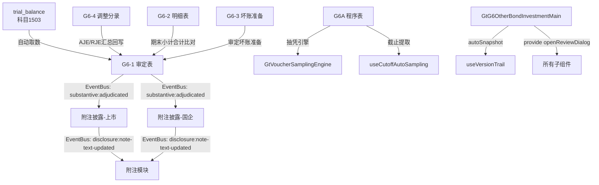

# Design Document: G6 其他债权投资(main组)底稿专属HTML精美组件

## Overview

G6其他债权投资(main组)专属组件`g6-other-bond-investment-main`。覆盖1个xlsx源模板/8有效sheet。科目1503其他债权投资（借方/资产类）。**G循环中公允价值计量最复杂的科目**，同时包含公允价值变动(OCI)和ECL减值(损益)的双重影响，审定表需同时反映公允价值调整和减值准备。

核心架构：
- componentType `g6-other-bond-investment-main`，主入口 GtG6OtherBondInvestmentMain.vue
- **sheetName v-if dispatch模式**：8 sheets用v-if分发（不用el-tabs）
- 子目录分组：core/ + impairment/
- 宽表拆分：G6-2(33列→3区段Tab，行同步) / G6-3(20列→2区段Tab)
- 借方科目公式：期末未审 = 期初审定 + 借方发生额 - 贷方发生额
- FVOCI-Debt双重计量：公允价值变动→OCI + ECL减值→损益（区别于G4仅摊余成本+ECL）
- EventBus联动：publish `substantive:adjudicated`(accountCode='1503') + `disclosure:note-text-updated`
- 特色：77行超大审定表(8层结构：成本/利息调整/应计利息/小计/公允价值变动/减值/报表数/重分类) + 33列超宽明细表 + 137行超长附注(上市) + ECL公式链(G6-3)
- 双模式（HTML ↔ OnlyOffice）+ 导入导出(useG6MainImportExport, 3张表) + AI(2 section)
- 五大集成：版本链✅ 抽凭✅ 截止✅ 附注EventBus✅ 复核✅（无OCR，本组无凭证表）

**三组拆分边界**：
| 组 | spec | 覆盖内容 |
|----|------|----------|
| main(本spec) | g6-other-bond-investment-main | G6A程序表 + G6-1审定表 + 附注(上市/国企) + G6-2明细表 + G6-3坏账准备 + G6-4调整分录 + 底稿目录（8sheet） |
| SPPI | g6-other-bond-investment-sppi | G6-5公允价值+G6-6利息+G6-7业务模式+G6-8合同现金流+G6-9盘点+G6-10倒轧（6sheet） |
| ECL | g6-other-bond-investment-ecl | G6-11三阶段+G6-12减值测算+G6-13 ECL计量+G6-14转回核销+G6-15凭证检查（5sheet） |

## Architecture

### sheetName分发模式 + 子目录组织

GtG6OtherBondInvestmentMain.vue 接收 `sheetName` prop，用正则提取编码(G6A/G6-1/G6-2/G6-3/G6-4/附注披露(上市)/附注披露(国企)/底稿目录)，`v-if` 分发到对应子组件。

```
sheetName → regex提取编码 → v-if匹配 → defineAsyncComponent子组件渲染
                                     ↘ 未匹配 → OnlyOffice fallback

8 sheets 子目录分组:
├── core/
│   ├── G6A    实质性程序表（复用a-program-console + 抽凭引擎 + 截止提取）
│   ├── G6-1   审定表（77行×11列，8层多层结构：成本/利息调整/应计利息/小计/公允价值变动/减值/报表数/重分类）
│   ├── G6-2   明细表（36行×33列→3区段Tab：基础信息/期初+变动/期末+OCI+减值）
│   ├── G6-3   坏账准备明细表（40行×20列→2区段Tab：未审+调整/审定数，ECL公式链）
│   ├── G6-4   调整分录汇总（23行×10列，AJE/RJE + 借贷平衡校验）
│   ├── 附注披露(上市)（137行×16列，超大虚拟滚动）
│   ├── 附注披露(国企)（69行×6列，虚拟滚动）
│   └── 底稿目录（29行×8列）
└── impairment/  (注：G6-3坏账准备虽在core/路径，逻辑上属减值域)
```

### 高层数据流



### 文件结构

```
audit-platform/frontend/src/components/workpaper/
├── GtG6OtherBondInvestmentMain.vue               # 主入口 sheetName v-if分发（defineAsyncComponent lazy×8）
├── g6-other-bond-investment-main/
│   └── core/
│       ├── G6TabProcedure.vue                    # G6A 程序表（复用a-program-console+selfLoad+抽凭+截止）
│       ├── G6TabAdjudication.vue                 # G6-1 审定表（77行×11列，8层多层+虚拟滚动+分组折叠）
│       ├── G6TabDetail.vue                       # G6-2 明细表(33列→3区段Tab)
│       ├── G6TabBadDebtDetail.vue                # G6-3 坏账准备明细表(20列→2区段Tab+ECL公式链)
│       ├── G6TabAdjustment.vue                   # G6-4 调整分录(AJE/RJE+借贷校验)
│       ├── G6TabDisclosureListed.vue             # 附注披露(上市)(137行×16列虚拟滚动)
│       ├── G6TabDisclosureSOE.vue                # 附注披露(国企)(69行×6列虚拟滚动)
│       └── G6TabDirectory.vue                    # 底稿目录
├── composables/
│   ├── useG6MainFormulaEngine.ts                 # G6(main)公式引擎(10个纯函数+parseNum)
│   ├── useG6MainFormData.ts                      # 数据加载/保存/selfLoad/writebackTB
│   ├── useG6MainImportExport.ts                  # 导入导出composable(3张表: G6-2/G6-3/G6-4)
│   └── useG6MainDualMode.ts                      # 双模式OO切换+localStorage

backend/app/routers/wp_render_strategies/
├── _g6_other_bond_investment_main.py             # render策略+注册RENDERER_DISPATCH
├── _g6_other_bond_investment_main_service.py     # 业务逻辑(公式验证/TB取数/EventBus)
├── _g6_other_bond_investment_main_import_export.py # 导入导出端点(3张表×3=9端点)
└── _g6_other_bond_investment_main_ai.py          # AI生成2 section
```

### EventBus事件

| 事件名 | 发布者 | 消费者 | payload |
|--------|--------|--------|---------|
| `substantive:adjudicated` | G6-1审定表 | 附注披露(上市/国企) + trial_balance | `{accountCode:'1503', adjudicatedAmount}` |
| `disclosure:note-text-updated` | 附注披露 | 附注模块 | `{accountCode:'1503', text}` |

### 后端AI Section清单

```
adjudication-analysis / disclosure-text
```

## Components and Interfaces

### 前端组件接口

```typescript
// GtG6OtherBondInvestmentMain.vue props
interface G6OtherBondInvestmentMainProps {
  htmlData: Record<string, any> | null
  sheetName: string
  wpId: string
  projectId: string
  readonly?: boolean
}

// sheetName正则匹配映射
const SHEET_CODE_MAP: Record<string, string> = {
  'G6A': 'procedure',
  'G6-1': 'adjudication',
  'G6-2': 'detail',
  'G6-3': 'badDebtDetail',
  'G6-4': 'adjustment',
  '附注披露信息（上市公司）': 'disclosureListed',
  '附注披露信息（国企）': 'disclosureSOE',
  '底稿目录': 'directory',
}
```

### G6-1 审定表数据模型（77行×11列，8层多层结构）

```typescript
interface G6AdjudicationData {
  groups: G6AdjudicationGroup[]        // 8大分组
  trialBalanceAmount: number           // 试算表取数(科目1503)
  variance: number                     // 差异=审定-试算表
}

interface G6AdjudicationGroup {
  groupId: string
  groupName: string                    // "一、成本" / "二、利息调整" / "三、应计利息" /
                                       // "四、小计" / "五、公允价值变动" / "六、减值准备" /
                                       // "七、报表列示数" / "八、一年内到期重分类"
  expanded: boolean                    // 折叠状态
  rows: G6AdjudicationRow[]
  subtotal: G6AdjudicationTotals       // 各组小计
}

interface G6AdjudicationRow {
  id: string
  item: string                         // 投资项目名称 或 小计/合计
  // 期初
  openingUnadjusted: number            // 期初未审数
  openingAdjustment: number            // 期初调整（AJE+RJE合并）
  openingAdjusted: number              // 公式: 未审 + 调整
  // 期末
  closingUnadjusted: number            // 期末未审数（借方余额公式）
  closingAdjustment: number            // 期末调整
  closingAdjusted: number              // 公式: 未审 + 调整
  // 变动
  changeAmount: number                 // 公式: 期末审定 - 期初审定
  changeRate: number | null            // 公式: (期末-期初)/期初, 期初=0时null
  reasonAnalysis: string               // |变动率|>20%时必填(橙色高亮)
}

interface G6AdjudicationTotals {
  openingAdjusted: number
  closingAdjusted: number
  changeAmount: number
  changeRate: number | null
}
```

**审定表8层逻辑关系**：
```
四、小计 = 一、成本 + 二、利息调整 + 三、应计利息
七、报表列示数 = 四、小计 + 五、公允价值变动 - 六、减值准备
最终列示 = 七、报表列示数 - 八、一年内到期重分类
```

### G6-2 明细表数据模型（36行×33列→3区段Tab）

```typescript
interface G6DetailRow {
  id: string
  seq: number
  // ══ Tab1: 基础信息(10列) ══
  investProject: string                // 投资项目名称
  investCategory: string               // 投资种类(国债/金融债/企业债/公司债等)
  faceValue: number                    // 面值
  couponRate: number                   // 票面利率(小数)
  effectiveRate: number                // 实际利率(小数)
  maturityDate: string                 // 到期日 YYYY-MM-DD
  initialInvestDate: string            // 初始投资日
  holdingQuantity: number              // 持有数量
  contractTerms: string                // 合同条件
  fairValueLevel: 'Level1' | 'Level2' | 'Level3'  // 公允价值层次(下拉)

  // ══ Tab2: 期初+本期变动(12列) ══
  openingCost: number                  // 期初成本
  openingInterestAdj: number           // 期初利息调整
  openingAccruedInterest: number       // 期初应计利息
  openingSubtotal: number              // 公式: 成本+利息调整+应计利息
  openingFairValue: number             // 期初公允价值
  openingOCICumulative: number         // 期初OCI累计
  periodIncrease: number               // 本期增加
  periodDecrease: number               // 本期减少
  periodInterestIncome: number         // 本期利息收入(实际利率法)
  periodFVChange: number               // 本期公允价值变动
  periodImpairment: number             // 本期减值

  // ══ Tab3: 期末+审定(11列) ══
  closingCost: number                  // 期末成本
  closingInterestAdj: number           // 期末利息调整
  closingAccruedInterest: number       // 期末应计利息
  closingSubtotal: number              // 公式: 期初小计+增加-减少+利息收入
  closingFairValue: number             // 期末公允价值
  ociCumulative: number                // OCI累计(公允价值变动累计)
  impairmentProvision: number          // 减值准备
  auditAdjustment: number              // 审定调整
  auditedAmount: number                // 审定数
  indexRef: string                     // 索引(GtIndexChip)
}
```

### G6-3 坏账准备明细表数据模型（40行×20列→2区段Tab，ECL公式链）

```typescript
interface G6BadDebtRow {
  id: string
  seq: number
  stageGroup: 'Stage1' | 'Stage2' | 'Stage3' | 'single'  // 阶段分组/单项
  investProject: string                // 投资项目名称

  // ══ Tab1: 未审+调整(10列) ══
  bookBalance: number                  // ①账面余额
  creditLossRate: number               // ②信用损失率(小数)
  unadjustedProvision: number          // ③未审坏账准备 = ①×②
  balanceAdjustment: number            // ⑤余额调整
  adjustedLossRate: number             // ②A调整后损失率(小数)
  impairmentAdjustment: number         // ⑥坏账调整 = ⑤×②A+①×(②A-②)
  adjustedBalance: number              // ⑦审定余额 = ①+⑤
  adjustedProvision: number            // ⑧审定坏账 = ③+⑥
  adjustedBookValue: number            // ⑨审定账面价值 = ⑦-⑧

  // ══ Tab2: 审定数(10列) ══
  priorYearProvision: number           // 上年末坏账准备
  currentYearProvision: number         // 本年计提
  currentYearReversal: number          // 本年转回
  currentYearWriteoff: number          // 本年核销
  closingProvision: number             // 期末坏账准备(公式)
  provisionDiff: number                // 差异=审定-账面
  isAdequate: 'adequate' | 'inadequate' | 'excessive'  // 充分性判断(下拉)
  auditConclusion: string              // 审计结论(textarea)
  evidenceRef: string                  // 证据索引
  remark: string                       // 备注
}
```

### G6-4 调整分录数据模型（23行×10列）

```typescript
interface G6AdjustmentEntry {
  id: string
  seq: number
  entryType: 'AJE' | 'RJE'            // 分录类型
  date: string                         // 日期
  summary: string                      // 摘要
  accountCode: string                  // 科目代码
  accountName: string                  // 科目名称
  debitAmount: number                  // 借方金额
  creditAmount: number                 // 贷方金额
  preparedBy: string                   // 编制人
  remark: string                       // 备注
}
```

### 附注数据模型

```typescript
interface G6DisclosureSection {
  id: string
  title: string
  rows?: G6DisclosureRow[]
  textContent?: string                 // 文本区内容（AI辅助）
}

interface G6DisclosureRow {
  id: string
  label: string
  value: string | number
  editable: boolean
}
```

## Data Models

### 存储结构（working_paper.content JSON）

```typescript
interface G6MainContent {
  // G6-1 审定表
  adjudication: {
    groups: G6AdjudicationGroup[]
  }
  // G6-2 明细表
  detail: {
    rows: G6DetailRow[]
  }
  // G6-3 坏账准备
  badDebtDetail: {
    rows: G6BadDebtRow[]
    conclusion: string                 // 审计结论
  }
  // G6-4 调整分录
  adjustment: {
    entries: G6AdjustmentEntry[]
  }
  // 附注
  disclosureListed: { sections: G6DisclosureSection[] }
  disclosureSOE: { sections: G6DisclosureSection[] }
}
```

### API接口

```python
# _g6_other_bond_investment_main.py
# RENDERER_DISPATCH注册
def render_g6_other_bond_investment_main(wp_id: str, config: dict) -> dict:
    """Render策略函数，返回componentType='g6-other-bond-investment-main'和sheets配置"""

# _g6_other_bond_investment_main_import_export.py
POST /api/workpapers/{wp_id}/g6-main/export-template?sheet={code}
POST /api/workpapers/{wp_id}/g6-main/export-data?sheet={code}
POST /api/workpapers/{wp_id}/g6-main/import-data?sheet={code}  # multipart/form-data
# sheet codes: G6-2 / G6-3 / G6-4
# 宽表按区段分sheet导出：
#   G6-2(3sheet: 基础信息/期初+变动/期末+审定)
#   G6-3(2sheet: 未审+调整/审定数)

# _g6_other_bond_investment_main_ai.py
POST /api/workpapers/{wp_id}/g6-main/ai/{section}
# section: adjudication-analysis / disclosure-text

# _g6_other_bond_investment_main_service.py
class G6OtherBondInvestmentMainService:
    async def get_trial_balance_data(project_id, year) -> dict
    async def save_adjudication(wp_id, data) -> dict
    async def validate_formulas(data) -> list[ValidationError]
```

### trial_balance 取数

```sql
-- G6-1审定表自动取数（资产类/借方）
SELECT standard_account_code, unadjusted_amount, aje_adjustment, audited_amount
FROM trial_balance
WHERE project_id = :project_id
  AND year = :year
  AND standard_account_code LIKE '1503%'
```

### 注册四件套

```python
# 1. htmlRendererRegistry (前端)
'g6-other-bond-investment-main': () => import('./workpaper/GtG6OtherBondInvestmentMain.vue')

# 2. wp_code_overrides.json (8条)
{
  "G6A-其他债权投资实质性程序表": "g6-other-bond-investment-main",
  "G6-1-审定表": "g6-other-bond-investment-main",
  "G6-2-明细表": "g6-other-bond-investment-main",
  "G6-3-坏账准备明细表": "g6-other-bond-investment-main",
  "G6-4-调整分录汇总": "g6-other-bond-investment-main",
  "G6-附注披露信息（上市公司）": "g6-other-bond-investment-main",
  "G6-附注披露信息（国企）": "g6-other-bond-investment-main",
  "G6-底稿目录": "g6-other-bond-investment-main"
}

# 3. VALID_COMPONENT_TYPES (后端)
'g6-other-bond-investment-main'

# 4. RENDERER_DISPATCH (后端)
'g6-other-bond-investment-main': render_g6_other_bond_investment_main
```

## Integration Design（5大集成接入点）

### 1. 版本链 (useVersionTrail)

```typescript
// GtG6OtherBondInvestmentMain.vue 主入口
const { autoSnapshot, showVersionTrail } = useVersionTrail(wpId)

async function handleSave() {
  await saveData()
  await autoSnapshot()  // 触发版本快照
}
// 工具栏"版本历史"按钮 → GtWpVersionTrail drawer
```

### 2. 抽凭引擎 (G6A程序表)

```typescript
// G6TabProcedure.vue
<GtVoucherSamplingEngine
  :project-id="projectId"
  :account-codes="['1503']"
  dialog-mode
  @samples-ready="fillSamples"
/>
```

### 3. 截止自动提取 (useCutoffAutoSampling)

```typescript
// G6TabProcedure.vue 截止测试步骤
const { fetchCutoffSamples } = useCutoffAutoSampling({
  projectId, accountCode: '1503', days: 5
})
```

### 4. 附注EventBus

```typescript
// G6TabAdjudication.vue (发布者)
watch(reportAmount, (val) => {
  eventBus.publish('substantive:adjudicated', {
    accountCode: '1503',
    adjudicatedAmount: val  // 七、报表列示数的审定合计
  })
})

// G6TabDisclosureListed.vue / G6TabDisclosureSOE.vue (消费者)
eventBus.subscribe('substantive:adjudicated', (payload) => {
  if (payload.accountCode === '1503') refreshData()
})

// 附注文本变更发布
eventBus.publish('disclosure:note-text-updated', {
  accountCode: '1503', text: noteText
})
```

### 5. 复核对话 (provide/inject)

```typescript
// GtG6OtherBondInvestmentMain.vue (主入口)
const { openReviewDialog } = useReviewDialog(wpId)
provide('openReviewDialog', openReviewDialog)

// 子组件 (section标题栏右侧按钮)
const openReviewDialog = inject('openReviewDialog')
```

### 6. 行级OCR — ❌ 不集成

本组(main)无凭证检查表，不需要OCR识别。凭证检查在ECL组(g6-other-bond-investment-ecl)的G6-15。

## 宽表区段Tab拆分详细设计

### G6-1 审定表（77行×11列，分组折叠+虚拟滚动）

```
┌─────────────────────────────────────────────────────────────────┐
│ 方法论上下文（琥珀色左边线+浅黄背景）                             │
│ "FVOCI-Debt计量特征：                                            │
│   ① 账面以摊余成本列示（成本+利息调整+应计利息）                   │
│   ② 公允价值变动计入其他综合收益(OCI)                             │
│   ③ 减值按摊余成本口径计提（非公允价值口径）                       │
│   ④ 报表列示数=小计+公允价值变动-减值准备"                        │
│                                                                 │
│ ═══ 一、成本 ═══════════════════════════ [折叠▾] ══════════════ │
│ │项目|期初未审|期初调整|期初审定|期末未审|期末调整|期末审定|变动额|率|原因│
│ │ 投资项目A  │ ...                                                │
│ │ 投资项目B  │ ...                                                │
│ │ 小计       │ (公式)                                             │
│                                                                 │
│ ═══ 二、利息调整 ═══════════════════════ [折叠▾] ═════════════ │
│ │ ...                                                            │
│                                                                 │
│ ═══ 三、应计利息 ═══════════════════════ [折叠▾] ═════════════ │
│ │ ...                                                            │
│                                                                 │
│ ═══ 四、小计(公式=一+二+三) ═══════════ [自动计算] ═══════════ │
│                                                                 │
│ ═══ 五、公允价值变动 ═══════════════════ [折叠▾] ═════════════ │
│ │ (计入OCI，正数=增值，负数=减值)                                  │
│                                                                 │
│ ═══ 六、减值准备 ═══════════════════════ [折叠▾] ═════════════ │
│ │ (按摊余成本口径ECL)                                             │
│                                                                 │
│ ═══ 七、报表列示数(公式=四+五-六) ═════ [自动计算] ═══════════ │
│                                                                 │
│ ═══ 八、一年内到期重分类 ═══════════════ [折叠▾] ═════════════ │
│                                                                 │
│ 底部：试算表取数比对(科目1503) + 差异(红色>0.01)                   │
│ 虚拟滚动：77行(展开时更多)                                        │
│ |变动率|>20%：橙色高亮+原因分析必填                                │
└─────────────────────────────────────────────────────────────────┘
```

### G6-2 明细表（33列→3区段Tab）

```
┌─────────────────────────────────────────────────────────────────┐
│ ┌─────────────────┐ ┌──────────────────┐ ┌───────────────────┐ │
│ │Tab1: 基础信息(10列)│ │Tab2: 期初+变动(12列)│ │Tab3: 期末+审定(11列)│ │
│ └─────────────────┘ └──────────────────┘ └───────────────────┘ │
│                                                                 │
│ Tab1: 序号|项目名|种类|面值|票面利率|实际利率|到期日|              │
│       初始投资日|持有数量|合同条件|公允价值层次(下拉)              │
│                                                                 │
│ Tab2: 序号|项目名|期初成本|期初利息调整|期初应计利息|              │
│       期初小计(公式)|期初公允价值|期初OCI累计|                     │
│       本期增加|本期减少|本期利息收入|本期公允价值变动|本期减值      │
│                                                                 │
│ Tab3: 序号|项目名|期末成本|期末利息调整|期末应计利息|              │
│       期末小计(公式)|期末公允价值|OCI累计|减值准备|                │
│       审定调整|审定数|索引(GtIndexChip)                           │
│                                                                 │
│ 底部：合计行（期初小计/增加/减少/利息/公允价值变动/期末小计）       │
│ 行同步：Tab切换保持行索引                                        │
│ 动态行：[+ 新增投资项目] (ElMessageBox.prompt输入名称)            │
└─────────────────────────────────────────────────────────────────┘
```

### G6-3 坏账准备明细表（20列→2区段Tab，ECL公式链）

```
┌─────────────────────────────────────────────────────────────────┐
│ 方法论上下文（琥珀色左边线+浅黄背景）                             │
│ "ECL公式链推导：                                                 │
│   ③未审坏账 = ①余额 × ②损失率                                   │
│   ⑥坏账调整 = ⑤调整 × ②A + ①余额 × (②A - ②)                   │
│   ⑦审定余额 = ① + ⑤                                             │
│   ⑧审定坏账 = ③ + ⑥ = ⑦ × ②A                                   │
│   ⑨审定账面 = ⑦ - ⑧ = ⑦ × (1 - ②A)"                           │
│                                                                 │
│ ┌───────────────────────┐ ┌──────────────────┐                  │
│ │Tab1: 未审+调整(10列)    │ │Tab2: 审定数(10列) │    2区段Tab      │
│ └───────────────────────┘ └──────────────────┘                  │
│                                                                 │
│ Tab1: 序号|项目名|①余额|②损失率|③未审坏账(公式)|                  │
│       ⑤调整|②A调整率|⑥坏账调整(公式)|⑦审定余额(公式)|             │
│       ⑧审定坏账(公式)|⑨审定账面(公式)                             │
│                                                                 │
│ Tab2: 序号|项目名|上年末坏账|本年计提|本年转回|本年核销|           │
│       期末坏账(公式)|差异|充分性(下拉)|结论|证据索引|备注          │
│                                                                 │
│ Stage分组：                                                      │
│ ├── Stage1(12个月ECL)                                            │
│ ├── Stage2(整个存续期ECL)                                        │
│ ├── Stage3(已发生信用减值)                                        │
│ └── 单项计提                                                     │
│                                                                 │
│ 底部：按Stage分类小计 + 总计行                                    │
│ 行同步：2个Tab间切换保持行索引                                    │
│ 动态行：[+ 新增项目] (ElMessageBox.prompt输入名称)                │
└─────────────────────────────────────────────────────────────────┘
```

## Formula Engine Design (useG6MainFormulaEngine.ts)

### 10个纯函数 + parseNum

```typescript
/**
 * 安全数值转换：null/undefined/NaN/空字符串/'  '/'abc' → 0; 有效数值→原值
 */
export function parseNum(v: unknown): number

/**
 * P1: 借方余额公式：期末未审 = 期初审定 + 借方 - 贷方
 * G6为借方/资产类科目(1503)
 */
export function calcDebitBalance(opening: number, debit: number, credit: number): number

/**
 * P2: 审定数 = 未审数 + 调整(AJE+RJE合并)
 */
export function calcAdjustedAmount(unadjusted: number, adjustment: number): number

/**
 * P3: 余额小计 = 成本 + 利息调整 + 应计利息
 * G6-1审定表四组 / G6-2明细表期初小计
 */
export function calcSubtotal(cost: number, interestAdj: number, accruedInterest: number): number

/**
 * P4: 期末小计 = 期初小计 + 增加 - 减少 + 利息收入
 * G6-2明细表核心公式
 */
export function calcEndingSubtotal(openingSubtotal: number, increase: number, decrease: number, interestIncome: number): number

/**
 * P5a: 未审坏账准备 = 账面余额 × 信用损失率
 */
export function calcUnadjustedProvision(bookBalance: number, creditLossRate: number): number

/**
 * P5b: 坏账调整 = 余额调整×调整后损失率 + 账面余额×(调整后损失率-原损失率)
 */
export function calcImpairmentAdjustment(balanceAdj: number, adjRate: number, origBalance: number, origRate: number): number

/**
 * P5c: 审定账面价值 = 审定余额 - 审定坏账
 *      其中 审定余额=①+⑤, 审定坏账=③+⑥
 */
export function calcAdjustedBookValue(adjustedBalance: number, adjustedProvision: number): number

/**
 * P6: 变动率 = (current - prior) / prior
 * prior=0时返回null（避免除零）
 */
export function calcChangeRate(prior: number, current: number): number | null

/**
 * P7: 借贷平衡校验：|SUM(debits) - SUM(credits)| < 0.01
 */
export function isDebitCreditBalanced(debits: number[], credits: number[]): boolean

/**
 * P8: 报表列示数 = 小计 + 公允价值变动 - 减值准备
 * G6-1审定表七组公式
 */
export function calcReportAmount(subtotal: number, fvChange: number, impairment: number): number
```

### 公式引用关系

```
G6-1 审定表:
  openingAdjusted = calcAdjustedAmount(openingUnadjusted, openingAdjustment)
  closingAdjusted = calcAdjustedAmount(closingUnadjusted, closingAdjustment)
  四、小计 = calcSubtotal(一成本, 二利息调整, 三应计利息)
  七、报表列示数 = calcReportAmount(四小计, 五公允价值变动, 六减值准备)
  changeAmount = closingAdjusted - openingAdjusted
  changeRate = calcChangeRate(openingAdjusted, closingAdjusted)

G6-2 明细表:
  openingSubtotal = calcSubtotal(openingCost, openingInterestAdj, openingAccruedInterest)
  closingSubtotal = calcEndingSubtotal(openingSubtotal, increase, decrease, interestIncome)

G6-3 坏账准备:
  ③ = calcUnadjustedProvision(①, ②)
  ⑥ = calcImpairmentAdjustment(⑤, ②A, ①, ②)
  ⑦ = ① + ⑤  (直接加法)
  ⑧ = ③ + ⑥  (直接加法)
  ⑨ = calcAdjustedBookValue(⑦, ⑧)

G6-4 调整分录:
  balanced = isDebitCreditBalanced(allDebits, allCredits)

G6-1 vs 试算表:
  closingUnadjusted ≈ calcDebitBalance(openingAdjusted, totalDebit, totalCredit)
```

### ECL公式链推导（G6-3核心）

```
给定：①账面余额, ②信用损失率, ⑤余额调整, ②A调整后损失率

③未审坏账准备 = ① × ②
④账面价值 = ① - ③ = ① - ①×② = ①(1-②)
⑥坏账调整 = ⑤×②A + ①×(②A-②)
⑦审定余额 = ① + ⑤
⑧审定坏账 = ③ + ⑥ = ①×② + ⑤×②A + ①×(②A-②) = ⑤×②A + ①×②A = (①+⑤)×②A = ⑦×②A
⑨审定账面 = ⑦ - ⑧ = (①+⑤) - (①+⑤)×②A = (①+⑤)(1-②A) = ⑦(1-②A)

验证恒等式：⑧ = ⑦ × ②A（审定坏账 = 审定余额 × 调整后损失率）
```

## Correctness Properties

*A property is a characteristic or behavior that should hold true across all valid executions of a system—essentially, a formal statement about what the system should do. Properties serve as the bridge between human-readable specifications and machine-verifiable correctness guarantees.*

### Property 1: 借方余额公式

*For any* opening ∈ ℝ, debit ∈ ℝ, credit ∈ ℝ: `calcDebitBalance(opening, debit, credit)` SHALL equal `opening + debit - credit`

**Validates: Requirements 3.3, 7.2**

### Property 2: 审定数公式

*For any* unadjusted ∈ ℝ, adjustment ∈ ℝ: `calcAdjustedAmount(unadjusted, adjustment)` SHALL equal `unadjusted + adjustment`

**Validates: Requirements 3.3, 7.2**

### Property 3: 余额小计公式（三要素加法）

*For any* cost ∈ ℝ, interestAdj ∈ ℝ, accruedInterest ∈ ℝ: `calcSubtotal(cost, interestAdj, accruedInterest)` SHALL equal `cost + interestAdj + accruedInterest`

**Validates: Requirements 3.1, 5.1, 7.2**

### Property 4: 期末小计公式

*For any* openingSubtotal ∈ ℝ, increase ∈ ℝ≥0, decrease ∈ ℝ≥0, interestIncome ∈ ℝ≥0: `calcEndingSubtotal(openingSubtotal, increase, decrease, interestIncome)` SHALL equal `openingSubtotal + increase - decrease + interestIncome`

**Validates: Requirements 5.2**

### Property 5: ECL公式链一致性

*For any* ① ∈ ℝ≥0 (账面余额), ② ∈ [0,1] (损失率), ⑤ ∈ ℝ (余额调整), ②A ∈ [0,1] (调整后损失率):
- `calcUnadjustedProvision(①, ②)` SHALL equal `① × ②`
- `calcImpairmentAdjustment(⑤, ②A, ①, ②)` SHALL equal `⑤×②A + ①×(②A-②)`
- 组合验证：⑧ = ③+⑥ SHALL equal ⑦×②A（其中 ⑦=①+⑤）

**Validates: Requirements 6.2**

### Property 6: 变动率方向性与除零保护

*For any* current > prior > 0: `calcChangeRate(prior, current)` > 0;
*For any* current < prior, prior > 0: `calcChangeRate(prior, current)` < 0;
`calcChangeRate(0, any)` === null

**Validates: Requirements 3.5, 7.2**

### Property 7: 借贷平衡恒等

*For any* debits[] ∈ ℝ[], credits[] ∈ ℝ[]: `isDebitCreditBalanced(debits, credits)` ↔ (|SUM(debits) - SUM(credits)| < 0.01)

**Validates: Requirements 7.1, 7.2**

### Property 8: parseNum健壮性

*For any* input ∈ {null, undefined, '', NaN, '  ', 'abc'}: `parseNum(input)` === 0;
*For any* n ∈ ℝ (finite): `parseNum(n)` === n

**Validates: Requirements 7.2**

## Error Handling

| 场景 | 处理策略 |
|------|---------|
| render-config 加载失败 | selfLoad重试1次 → 失败显示"加载失败"占位 + 重试按钮 |
| trial_balance 取数无数据 | 审定表显示0值 + 橙色提示"未找到科目1503数据" |
| 公式计算溢出/NaN | parseNum兜底→0，公式列显示"—" |
| 导入Excel格式不匹配 | 后端返回422 + 具体列错误信息 → 前端ElMessage.error |
| EventBus消息丢失 | 附注组件mounted时主动拉取最新审定数（非纯被动监听） |
| 保存时网络异常 | 自动重试3次(指数退避) → 失败后localStorage暂存 + 恢复提示 |
| sheetName无法识别 | fallback到OnlyOffice渲染（确保不白屏） |
| G6-1 77行虚拟滚动渲染异常 | 降级为分组折叠仅展示当前组 |
| 附注(上市)137行虚拟滚动异常 | 降级为分页模式(每页30行) |
| ECL公式链损失率超出[0,1]范围 | 红框高亮 + 阻止保存 + 提示"损失率应在0~100%之间" |
| 变动率除零 | calcChangeRate返回null → UI显示"N/A" |
| G6-3 Stage分组为空 | 显示空组提示"暂无此阶段项目" |

## Testing Strategy

### 测试分层

| 层 | 工具 | 范围 | 数量估计 |
|----|------|------|---------|
| PBT(前端) | vitest + fast-check | 10个公式函数×8属性 | ~10 test cases |
| PBT(后端) | pytest + hypothesis | 公式验证 | ~8 test cases |
| 单元测试(前端) | vitest | composable逻辑/数据转换/Stage分组/变动率高亮 | ~15 test cases |
| 单元测试(后端) | pytest | service/renderer/import-export | ~10 test cases |
| 集成测试 | pytest | API端点(9导入导出+2AI+render) | ~6 test cases |
| E2E | Playwright | 关键用户路径(审定+明细+坏账) | ~3 scenarios |

### PBT配置

- 前端：fast-check，`numRuns: 100`
- 后端：hypothesis，`max_examples=5`
- 每个PBT测试注释标注对应属性编号
- Tag格式：`Feature: g6-other-bond-investment-main, Property {N}: {描述}`

### PBT测试文件

```
audit-platform/frontend/src/components/workpaper/composables/__tests__/
└── useG6MainFormulaEngine.pbt.spec.ts  # 8个PBT属性 + fast-check

backend/tests/
└── test_g6_other_bond_investment_main_pbt.py  # 后端PBT验证(hypothesis)
```

### 前端PBT示例（fast-check，numRuns≥100）

```typescript
import fc from 'fast-check'
import { describe, it, expect } from 'vitest'
import * as F from '../useG6MainFormulaEngine'

// P1: 借方余额
fc.assert(fc.property(
  fc.float({ min: -1e9, max: 1e9, noNaN: true }),
  fc.float({ min: 0, max: 1e9, noNaN: true }),
  fc.float({ min: 0, max: 1e9, noNaN: true }),
  (opening, debit, credit) => {
    expect(F.calcDebitBalance(opening, debit, credit)).toBeCloseTo(opening + debit - credit, 6)
  }
), { numRuns: 100 })

// P3: 余额小计
fc.assert(fc.property(
  fc.float({ min: -1e9, max: 1e9, noNaN: true }),
  fc.float({ min: -1e9, max: 1e9, noNaN: true }),
  fc.float({ min: -1e9, max: 1e9, noNaN: true }),
  (cost, intAdj, accrued) => {
    expect(F.calcSubtotal(cost, intAdj, accrued)).toBeCloseTo(cost + intAdj + accrued, 6)
  }
), { numRuns: 100 })

// P5: ECL公式链一致性
fc.assert(fc.property(
  fc.float({ min: 1, max: 1e8, noNaN: true }),         // ① 账面余额
  fc.float({ min: 0.001, max: 0.999, noNaN: true }),   // ② 损失率
  fc.float({ min: -1e7, max: 1e7, noNaN: true }),      // ⑤ 余额调整
  fc.float({ min: 0.001, max: 0.999, noNaN: true }),   // ②A 调整后损失率
  (bal, rate, adj, adjRate) => {
    const prov = F.calcUnadjustedProvision(bal, rate)        // ③
    const impAdj = F.calcImpairmentAdjustment(adj, adjRate, bal, rate)  // ⑥
    const adjBal = bal + adj                                  // ⑦
    const adjProv = prov + impAdj                            // ⑧
    // 恒等式验证：⑧ = ⑦ × ②A
    expect(adjProv).toBeCloseTo(adjBal * adjRate, 4)
  }
), { numRuns: 100 })
```

### 关键测试路径

1. **审定表完整流程**：TB取数(1503) → 填写调整 → 借方公式 → 8层小计 → 报表列示数 → EventBus发布 → 附注刷新
2. **明细表33列操作**：3区段Tab切换 → 行同步验证 → 期末小计公式 → 动态行增删 → 导入导出
3. **ECL公式链**：①余额+②损失率 → ③未审坏账 → ⑤调整/②A → ⑥坏账调整 → ⑦⑧⑨自动计算 → Stage分组汇总
4. **调整分录流程**：新增AJE/RJE → 借贷平衡实时校验 → 汇总回写G6-1 → 差额红色高亮

### 单元测试重点

- **8层审定表分组折叠逻辑**：验证展开/收起切换状态正确
- **报表列示数公式**：验证calcReportAmount(subtotal, fvChange, impairment) = subtotal + fvChange - impairment
- **ECL公式链完整验证**：验证⑧=⑦×②A恒等式在边界值(rate=0, rate=1, adj=0)下成立
- **变动率>20%高亮**：验证|changeRate|>0.2时reasonAnalysis必填校验触发
- **区段Tab行同步**：验证Tab切换后当前选中行索引不变
- **导入导出宽表分sheet**：验证G6-2导出3sheet、G6-3导出2sheet
- **虚拟滚动阈值**：验证77行/137行/69行组件均启用虚拟滚动
