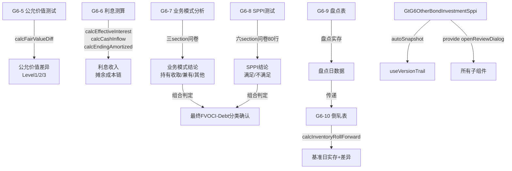

# Design Document: G6 其他债权投资底稿(SPPI组)专属HTML精美组件

## Overview

G6其他债权投资(SPPI组)专属组件`g6-other-bond-investment-sppi`。覆盖1个xlsx源模板中的6个sheet。科目1503其他债权投资（借方/资产类）。**IFRS9分类三要素验证核心**：通过业务模式分析(G6-7)确定管理目标，通过合同现金流量特征分析(G6-8)验证SPPI条件，公允价值测试(G6-5)验证计量正确性，利息测算(G6-6)验证实际利率法收入，盘点(G6-9/G6-10)确认证券存在性。

核心架构：
- componentType `g6-other-bond-investment-sppi`，主入口 GtG6OtherBondInvestmentSppi.vue
- **sheetName v-if dispatch模式**：6 sheets用v-if分发（不用el-tabs）
- 子目录分组：fair-value/(G6-5) / interest/(G6-6) / classification/(G6-7+G6-8) / inspection/(G6-9+G6-10)
- 宽表拆分：G6-5(18列→2区段Tab) / G6-10(18列→2区段Tab)
- 公式引擎：`useG6SppiFormulaEngine.ts`纯函数composable（利息测算+公允价值+盘点+parseNum）
- UI特色：G6-8 SPPI问卷80行虚拟滚动 / G6-7业务模式三section问卷 / G6-5公允价值Level分层 / G6-6实际利率法分组
- 双模式（HTML ↔ OnlyOffice）+ 导入导出(useG6SppiImportExport, 4张表) + AI(4 section)
- 集成：版本链✅ 复核✅ 抽凭❌ 截止❌ 附注EventBus❌ OCR❌

**三组拆分边界**：
| 组 | spec | 覆盖内容 |
|----|------|----------|
| main | g6-other-bond-investment-main | 程序表G6A + 审定表G6-1 + 明细表G6-2(33列) + 调整分录G6-3 + 附注G6-11(137行) + 底稿目录 |
| **SPPI(本spec)** | g6-other-bond-investment-sppi | 公允价值G6-5 + 利息G6-6 + 业务模式G6-7 + SPPI测试G6-8 + 盘点G6-9 + 倒轧G6-10 |
| ECL | g6-other-bond-investment-ecl | 三阶段划分 + ECL减值测算 + 减值准备表 + 凭证检查 |

**与G4-sppi的差异**：
- G6多2个sheet（公允价值G6-5 + 利息G6-6），G4仅4个sheet
- G6-8 SPPI测试为**合同条件评估型**（序号/检查区域/检查项目/CAS要求/合同条款摘要/是否满足/判断依据/风险等级/索引/备注），G4-6为**投资项目列表型**
- G6-5公允价值测试18列→2区段Tab（基础+估值详情），与G8/G9结构相同
- G6-6利息测算为实际利率法分组结构（每项目多期），与G4-4结构相同

## Architecture

### sheetName分发模式 + 子目录组织

GtG6OtherBondInvestmentSppi.vue 接收 `sheetName` prop，用正则提取编码(G6-5~G6-10)，`v-if` 分发到对应子组件。

```
sheetName → regex提取编码 → v-if匹配 → 子组件渲染
                                     ↘ 未匹配 → OnlyOffice fallback

6 sheets 子目录分组:
├── fair-value/
│   └── G6-5   公允价值测试表（18列→2区段Tab，Level分层）
├── interest/
│   └── G6-6   利息测算表（实际利率法分组结构）
├── classification/
│   ├── G6-7   业务模式分析（三section问卷式）
│   └── G6-8   合同现金流量特征分析（SPPI测试，80行虚拟滚动）
└── inspection/
    ├── G6-9   有价证券盘点表
    └── G6-10  盘点倒轧表（18列→2区段Tab）
```

### 高层数据流



### 文件结构

```
audit-platform/frontend/src/components/workpaper/
├── GtG6OtherBondInvestmentSppi.vue                     # 主入口 sheetName v-if分发
├── g6-other-bond-investment-sppi/
│   ├── fair-value/
│   │   └── G6TabFairValueTest.vue                      # G6-5 公允价值（2区段Tab+Level分层）
│   ├── interest/
│   │   └── G6TabInterestCalculation.vue                # G6-6 利息测算（实际利率法分组）
│   ├── classification/
│   │   ├── G6TabBusinessModel.vue                      # G6-7 业务模式（三section问卷）
│   │   └── G6TabSppiTest.vue                           # G6-8 SPPI（80行虚拟滚动）
│   └── inspection/
│       ├── G6TabSecuritiesInventory.vue                 # G6-9 有价证券盘点
│       └── G6TabInventoryRollForward.vue                # G6-10 盘点倒轧（2区段Tab）
├── composables/
│   ├── useG6SppiFormulaEngine.ts                       # 公式引擎(6纯函数+parseNum)
│   ├── useG6SppiFormData.ts                            # 数据加载/保存/selfLoad
│   ├── useG6SppiFairValue.ts                           # G6-5公允价值逻辑
│   ├── useG6SppiInterest.ts                            # G6-6利息测算逻辑
│   ├── useG6SppiBusinessModel.ts                       # G6-7问卷逻辑
│   ├── useG6SppiTest.ts                                # G6-8 SPPI逻辑
│   ├── useG6SppiInventory.ts                           # G6-9盘点逻辑
│   ├── useG6SppiReconciliation.ts                      # G6-10倒轧逻辑
│   ├── useG6SppiImportExport.ts                        # 导入导出(4张表)
│   └── useG6SppiDualMode.ts                            # 双模式OO切换

backend/app/routers/wp_render_strategies/
├── _g6_other_bond_investment_sppi.py                   # render策略+RENDERER_DISPATCH
├── _g6_other_bond_investment_sppi_import_export.py     # 导入导出(4表×3=12端点)
└── _g6_other_bond_investment_sppi_ai.py                # AI生成4 section
```

### G6-5公允价值测试表设计（18列→2区段Tab）

```
┌─────────────────────────────────────────────────────────────────────────────────────┐
│ ═══ 公允价值测试表(G6-5) ══════════════════════════════════════ [AI✨] [复核💬]    │
│ ┌───────────────┐ ┌──────────────────────┐                                         │
│ │Tab1:基础+审定 │ │Tab2:估值详情          │   ← 2区段Tab切换（行同步）              │
│ └───────────────┘ └──────────────────────┘                                         │
│ ┌───────────────────────────────────────────────────────────────────────────────┐   │
│ │ Tab1: 基础+审定(10列)                                                          │   │
│ │ 投资项目|面值|期末未审(数量/单价/公允价值)|期末审定(数量/单价/公允价值)|        │   │
│ │ 差异(公式,红色高亮)|公允价值层次(下拉L1/L2/L3)                                 │   │
│ │ Tab2: 估值详情(8列)                                                            │   │
│ │ 投资项目|估值方法|与上期一致性|来源机构|输入值来源|估值技术|                     │   │
│ │ 不可观察输入值|估值文件索引                                                     │   │
│ └───────────────────────────────────────────────────────────────────────────────┘   │
│ Level3校验：层次=L3时Tab2相关字段必填                                                │
│ 差异高亮：|审定-未审|>0 → 红色背景                                                 │
│ [+ 新增行] [导入导出▾]                                                              │
│ 审计结论 textarea [AI辅助按钮]  <details>编制提示</details>                          │
└─────────────────────────────────────────────────────────────────────────────────────┘
```

### G6-6利息测算表设计（实际利率法分组）

```
┌─────────────────────────────────────────────────────────────────────────────────────┐
│ ═══ 利息测算表(G6-6) ═══════════════════════════════════════ [AI✨] [复核💬]       │
│ ┌─ 方法论上下文(琥珀色) ──────────────────────────────────────────────────────────┐│
│ │ "按实际利率法确认利息收入=摊余成本×实际利率×计息天数/365"                        ││
│ └─────────────────────────────────────────────────────────────────────────────────┘│
│ ══ 投资项目A ═══════════════════════════ 面值|票面利率|实际利率                     │
│ ┌─────────┬──────────┬────────────┬──────────┬──────────┬──────┐                   │
│ │截止日    │期初摊余   │实际利息(公式)│现金流入(公式)│期末摊余(公式)│天数 │                   │
│ ├─────────┼──────────┼────────────┼──────────┼──────────┼──────┤                   │
│ │2024-06  │100,000   │2,465.75    │1,500.00  │100,965.75│180   │                   │
│ └─────────┴──────────┴────────────┴──────────┴──────────┴──────┘                   │
│ [+ 新增期间]                                                                        │
│ [+ 新增投资项目(ElMessageBox.prompt)] [导入导出▾]                                    │
│ ─── 交叉验证 ───── 利息合计 vs G6-1审定表利息调整 差异(红/绿色)                      │
│ 审计结论 textarea [AI辅助按钮]  <details>编制提示</details>                          │
└─────────────────────────────────────────────────────────────────────────────────────┘
```

### G6-7业务模式分析设计（三section问卷）

```
┌─────────────────────────────────────────────────────────────────────────────────────┐
│ ═══ 业务模式分析(G6-7) ═══════════════════════════════════════ [复核💬]            │
│ ┌─ 方法论(琥珀色) ─── CAS22业务模式三类: ①持有收取 ②兼有 ③其他 ─────────────────┐│
│ └─────────────────────────────────────────────────────────────────────────────────┘│
│ ═══ (一) 业务模式确定 ═══════════════════════════════════════ [AI✨]               │
│ │序号│检查项目│审计要求│管理层说明(textarea)│是否满足(下拉)│审计结论(textarea)│风险│索引││
│ ═══ (二) 出售情况分析 ═══════════════════════════════════════ [AI✨]               │
│ │同上8列结构│                                                                      │
│ ═══ (三) 综合判断 ═══════════════════════════════════════════ [AI✨]               │
│ │最终分类结论: [下拉: 持有收取/兼有/其他]│综合分析说明: [textarea autosize]│        │
│ <details>编制提示</details>                                                          │
└─────────────────────────────────────────────────────────────────────────────────────┘
```

### G6-8 SPPI测试设计（80行六section+虚拟滚动）

```
┌─────────────────────────────────────────────────────────────────────────────────────┐
│ ═══ 合同现金流量特征分析(G6-8) ═══════════════════════════════ [复核💬]            │
│ ┌─ 方法论(琥珀色) ─── SPPI=仅为对本金和利息的支付 ────────────────────────────────┐│
│ └─────────────────────────────────────────────────────────────────────────────────┘│
│ ═══ (一) 本金定义 ═══════════════════════════════════════════ [AI✨]               │
│ ═══ (二) 利息定义 ═══════════════════════════════════════════ [AI✨]               │
│ ═══ (三) 修改时间价值 ═══════════════════════════════════════ [AI✨]               │
│ ═══ (四) 提前还款条款 ═══════════════════════════════════════ [AI✨]               │
│ ═══ (五) 合同关联工具 ═══════════════════════════════════════ [AI✨]               │
│ ═══ (六) 综合判断 ═══════════════════════════════════════════ [AI✨]               │
│ │虚拟滚动(el-table-v2)│                                                            │
│ │列: 序号|检查区域|检查项目|CAS要求|合同条款摘要(textarea)|                        │
│ │    是否满足SPPI(是/否/不适用)|判断依据(textarea)|风险等级|索引|备注               │
│ ┌─────────────────────────────────────────────────────────────────────────┐         │
│ │ 综合结论: [满足/不满足]                                                   │         │
│ │ 🔴 任一section="否" → 红色高亮 + "不满足SPPI，需重分类"                   │         │
│ └─────────────────────────────────────────────────────────────────────────┘         │
│ <details>编制提示</details>                                                          │
└─────────────────────────────────────────────────────────────────────────────────────┘
```

### G6-10盘点倒轧表设计（18列→2区段Tab）

```
┌─────────────────────────────────────────────────────────────────────────────────────┐
│ ═══ 盘点倒轧表(G6-10) ════════════════════════════════════════ [AI✨] [复核💬]    │
│ ┌─────────────────────┐ ┌──────────────────────────────┐                            │
│ │Tab1:倒轧计算(10列)   │ │Tab2:增减明细(8列)             │  ← 2区段Tab(行同步)      │
│ └─────────────────────┘ └──────────────────────────────┘                            │
│ Tab1: 证券名称|盘点日数量|增减|基准日数量(公式)|账面数量|差异(公式,红色)|             │
│       差异原因|差异结论|索引|备注                                                    │
│ Tab2: 证券名称|日期|交易类型(买入/卖出/到期/转让)|数量|金额|凭证号|经办人|备注       │
│ 差异列：|基准日-账面|>0 → 红色高亮 + 差异原因必填                                   │
│ [+ 新增行] [导入导出▾]  审计结论 [AI辅助]  <details>编制提示</details>              │
└─────────────────────────────────────────────────────────────────────────────────────┘
```

## Components and Interfaces

### 前端组件接口

```typescript
// GtG6OtherBondInvestmentSppi.vue props
interface G6OtherBondInvestmentSppiProps {
  htmlData: Record<string, any> | null
  sheetName: string
  wpId: string
  projectId: string
  readonly?: boolean
}

// sheetName正则匹配映射
const SHEET_CODE_MAP: Record<string, string> = {
  'G6-5': 'fairValueTest',
  'G6-6': 'interestCalculation',
  'G6-7': 'businessModel',
  'G6-8': 'sppiTest',
  'G6-9': 'securitiesInventory',
  'G6-10': 'inventoryRollForward',
}

// 正则提取：/G6-(5|6|7|8|9|10)/
function extractSheetCode(sheetName: string): string | null {
  const match = sheetName.match(/G6-(5|6|7|8|9|10)/)
  return match ? `G6-${match[1]}` : null
}
```

### G6-5 公允价值测试数据模型

```typescript
interface FairValueTestData {
  activeTab: 'basic' | 'valuation'
  selectedRowIndex: number
  items: FairValueItem[]
  auditConclusion: string
}

interface FairValueItem {
  id: string
  seq: number
  investProject: string
  faceValue: number
  // Tab1: 基础+审定
  unadjustedQty: number
  unadjustedPrice: number
  unadjustedFairValue: number          // 公式: qty×price
  auditedQty: number
  auditedPrice: number
  auditedFairValue: number             // 公式: qty×price
  variance: number                     // 公式: 审定-未审
  fairValueLevel: 'L1' | 'L2' | 'L3' | null
  // Tab2: 估值详情
  valuationMethod: string
  consistencyWithPrior: boolean | null
  sourceInstitution: string
  inputSource: string
  valuationTechnique: string
  unobservableInputs: string
  valuationDocIndex: string
}
```

### G6-6 利息测算数据模型

```typescript
interface InterestCalculationData {
  groups: InterestGroup[]
  totalInterest: number                // 合计(公式)
  crossCheckAuditedAmount: number      // G6-1引用(只读)
  crossCheckVariance: number           // 差异(公式)
  auditConclusion: string
}

interface InterestGroup {
  id: string
  investProject: string
  faceValue: number
  couponRate: number                   // 票面利率(如0.05)
  effectiveRate: number                // 实际利率(如0.052)
  periods: InterestPeriod[]
}

interface InterestPeriod {
  id: string
  cutoffDate: string                   // YYYY-MM
  openingAmortized: number             // 期初摊余(首期输入,后续=上期期末)
  effectiveInterest: number            // 公式: 摊余×实际利率×days/365
  cashInflow: number                   // 公式: 面值×票面利率×days/365
  endingAmortized: number              // 公式: 期初+利息-现金流入
  days: number                         // 计息天数
  remark: string
}
```

### G6-7 业务模式分析数据模型

```typescript
interface BusinessModelData {
  section1: BusinessModelSection       // (一) 业务模式确定
  section2: BusinessModelSection       // (二) 出售情况分析
  finalConclusion: 'hold_collect' | 'hold_and_sell' | 'other' | null
  finalAnalysis: string
}

interface BusinessModelSection {
  items: BusinessModelItem[]
  sectionConclusion: string
}

interface BusinessModelItem {
  id: string
  seq: number
  checkItem: string
  auditRequirement: string
  managementExplanation: string        // textarea
  isSatisfied: boolean | null          // 下拉
  auditConclusion: string              // textarea
  riskLevel: 'high' | 'medium' | 'low' | null
  indexRef: string
}
```

### G6-8 SPPI测试数据模型（80行六section）

```typescript
interface SppiTestData {
  sections: SppiSection[]              // 六个section
  overallConclusion: 'pass' | 'fail' | null
  hasFailedSection: boolean
}

interface SppiSection {
  id: string
  title: string
  items: SppiItem[]
  sectionConclusion: 'pass' | 'fail' | 'na' | null
}

interface SppiItem {
  id: string
  seq: number
  checkArea: string
  checkItem: string
  casRequirement: string               // 只读方法论
  contractTermSummary: string          // textarea
  isSPPISatisfied: 'yes' | 'no' | 'na' | null
  judgmentBasis: string                // textarea
  riskLevel: 'high' | 'medium' | 'low' | null
  indexRef: string
  remark: string
}
```

### G6-9/G6-10 盘点数据模型

```typescript
// G6-9 有价证券盘点表
interface SecuritiesInventoryData {
  items: InventoryItem[]
  auditConclusion: string
}

interface InventoryItem {
  id: string
  seq: number
  securitiesName: string
  securitiesCode: string
  faceValue: number
  countQuantity: number                // 盘点数量
  bookQuantity: number                 // 账面数量
  variance: number                     // 公式: 盘点-账面
}

// G6-10 盘点倒轧表
interface ReconciliationData {
  activeTab: 'rollForward' | 'changeDetail'
  selectedRowIndex: number
  items: ReconciliationItem[]
  changeDetails: ChangeDetailItem[]
  auditConclusion: string
}

interface ReconciliationItem {
  id: string
  seq: number
  securitiesName: string
  countDateQuantity: number
  changeQuantity: number
  reportDateQuantity: number           // 公式: 盘点日±增减
  bookQuantity: number
  variance: number                     // 公式: 基准日-账面
  varianceReason: string               // |差异|>0必填
  varianceConclusion: string
  indexRef: string
  remark: string
}

interface ChangeDetailItem {
  id: string
  securitiesName: string
  date: string
  transactionType: 'buy' | 'sell' | 'mature' | 'transfer'
  quantity: number
  amount: number
  voucherNo: string
  handler: string
  remark: string
}
```

### 后端接口

```python
# _g6_other_bond_investment_sppi.py — RENDERER_DISPATCH注册
def render_g6_other_bond_investment_sppi(wp_id: str, config: dict) -> dict:
    """返回componentType='g6-other-bond-investment-sppi'和sheets配置"""

# _g6_other_bond_investment_sppi_import_export.py
POST /api/workpapers/{wp_id}/g6-sppi/export-template?sheet={code}
POST /api/workpapers/{wp_id}/g6-sppi/export-data?sheet={code}
POST /api/workpapers/{wp_id}/g6-sppi/import-data?sheet={code}  # multipart/form-data
# sheet codes: G6-5 / G6-6 / G6-9 / G6-10
# G6-5按2区段分sheet导出 / G6-10按2区段分sheet导出

# _g6_other_bond_investment_sppi_ai.py
POST /api/workpapers/{wp_id}/g6-sppi/ai/{section}
# section: fair-value-conclusion / interest-conclusion / business-model-conclusion / sppi-conclusion
```

### 注册四件套

```python
# 1. htmlRendererRegistry (前端)
'g6-other-bond-investment-sppi': () => import('./workpaper/GtG6OtherBondInvestmentSppi.vue')

# 2. wp_code_overrides.json (6条)
{
  "G6-5-公允价值测试表": "g6-other-bond-investment-sppi",
  "G6-6-利息测算表": "g6-other-bond-investment-sppi",
  "G6-7-业务模式分析": "g6-other-bond-investment-sppi",
  "G6-8-合同现金流量特征分析": "g6-other-bond-investment-sppi",
  "G6-9-有价证券盘点表": "g6-other-bond-investment-sppi",
  "G6-10-盘点倒轧表": "g6-other-bond-investment-sppi"
}

# 3. VALID_COMPONENT_TYPES (后端)
'g6-other-bond-investment-sppi'

# 4. RENDERER_DISPATCH (后端)
'g6-other-bond-investment-sppi': render_g6_other_bond_investment_sppi
```

## Data Models

### 存储结构（working_paper.content JSON）

```typescript
interface G6SppiContent {
  fairValueTest: FairValueTestData           // G6-5
  interestCalculation: InterestCalculationData  // G6-6
  businessModel: BusinessModelData           // G6-7
  sppiTest: SppiTestData                     // G6-8
  securitiesInventory: SecuritiesInventoryData  // G6-9
  reconciliation: ReconciliationData         // G6-10
}
```

### 方法论上下文映射（G6-8 六section CAS引用）

```typescript
const SPPI_METHODOLOGY: Record<string, string> = {
  principal: '本金是指金融资产在初始确认时的公允价值。本金金额可能因还款而在整个存续期内变化。',
  interest: '利息包括对货币时间价值、信用风险、流动性风险、管理成本的对价以及利润率。',
  modified_time_value: '如果利率重置与计息期不匹配，需评估合同现金流量差异是否仅代表货币时间价值的对价。',
  prepayment: '如提前偿付金额基本代表未偿付本金及利息（含合理补偿），则仍可满足SPPI。',
  contractual_linked: '优先/次级结构中需评估标的池每项资产是否满足SPPI条件。',
  comprehensive: '结合以上各项分析，整体评估合同现金流量特征是否满足SPPI。',
}
```

## Formula Engine Design

### useG6SppiFormulaEngine.ts — 6个纯函数 + parseNum

所有函数为纯函数（无副作用、无Vue响应式依赖），支持fast-check PBT验证。

```typescript
// ═══ parseNum — 输入清洗（null/undefined/NaN/空串 → 0）═══
export function parseNum(v: unknown): number {
  if (v === null || v === undefined || v === '') return 0
  const n = Number(v)
  return Number.isFinite(n) ? n : 0
}

// ═══ 公式1: 实际利息收入 = 摊余成本 × 实际利率 × days/365（2dp）═══
export function calcEffectiveInterest(amortizedCost: number, effectiveRate: number, days: number): number {
  return Math.round(parseNum(amortizedCost) * parseNum(effectiveRate) * parseNum(days) / 365 * 100) / 100
}

// ═══ 公式2: 现金流入 = 面值 × 票面利率 × days/365（2dp）═══
export function calcCashInflow(faceValue: number, couponRate: number, days: number): number {
  return Math.round(parseNum(faceValue) * parseNum(couponRate) * parseNum(days) / 365 * 100) / 100
}

// ═══ 公式3: 期末摊余成本 = 期初 + 实际利息 - 现金流入（2dp）═══
export function calcEndingAmortized(opening: number, interest: number, cashInflow: number): number {
  return Math.round((parseNum(opening) + parseNum(interest) - parseNum(cashInflow)) * 100) / 100
}

// ═══ 公式4: 公允价值差异 = 审定 - 未审（2dp）═══
export function calcFairValueDiff(audited: number, unadjusted: number): number {
  return Math.round((parseNum(audited) - parseNum(unadjusted)) * 100) / 100
}

// ═══ 公式5: 盘点倒轧 = 盘点日数量 + 增减 ═══
export function calcInventoryRollForward(countDateQty: number, change: number): number {
  return parseNum(countDateQty) + parseNum(change)
}

// ═══ 公式6: 盘点差异 = 基准日数量 - 账面数量 ═══
export function calcInventoryVariance(reportDateQty: number, bookQty: number): number {
  return parseNum(reportDateQty) - parseNum(bookQty)
}
```

## Integration Design（集成接入点）

### 1. 版本链 (useVersionTrail) ✅

```typescript
// GtG6OtherBondInvestmentSppi.vue 主入口
const { autoSnapshot, showVersionTrail } = useVersionTrail(wpId)
async function handleSave() {
  await saveData()
  await autoSnapshot()
}
```

### 2. 复核对话 (provide/inject) ✅

```typescript
// GtG6OtherBondInvestmentSppi.vue (provide)
const { openReviewDialog } = useReviewDialog(wpId)
provide('openReviewDialog', openReviewDialog)
// 子组件 section标题栏右侧按钮 (inject)
const openReviewDialog = inject('openReviewDialog')
```

### 3. 抽凭引擎 — ❌ 不集成（本组无程序表/凭证表）

### 4. 截止自动提取 — ❌ 不集成（非截止测试类底稿）

### 5. 附注EventBus — ❌ 不集成（由G6-main审定表统一发布）

### 6. 行级OCR — ❌ 不集成（本组无凭证附件表）

## Performance Strategy

| 组件 | 行数 | 虚拟滚动 |
|------|------|---------|
| G6-8 SPPI测试 | 80行 | ✅ el-table-v2 |
| G6-7 业务模式 | 49行 | ❌ 分section渲染 |
| G6-5 公允价值 | 40行 | ❌ |
| G6-10 倒轧表 | 39行 | ❌ |
| G6-6 利息测算 | 32行 | ❌ |
| G6-9 盘点表 | 29行 | ❌ |

懒加载：6个子组件全部defineAsyncComponent。区段Tab切换不销毁表格实例，行同步通过selectedRowIndex ref。

## Correctness Properties

*A property is a characteristic or behavior that should hold true across all valid executions of a system—essentially, a formal statement about what the system should do. Properties serve as the bridge between human-readable specifications and machine-verifiable correctness guarantees.*

### Property 1: 实际利息收入公式

*For any* amortizedCost ∈ [0, 1e9], effectiveRate ∈ [0, 0.3], days ∈ [1, 365]: `calcEffectiveInterest(amortizedCost, effectiveRate, days)` === `round(amortizedCost × effectiveRate × days / 365, 2)`

**Validates: Requirements 3.2**

### Property 2: 现金流入公式

*For any* faceValue ∈ [0, 1e9], couponRate ∈ [0, 0.2], days ∈ [1, 365]: `calcCashInflow(faceValue, couponRate, days)` === `round(faceValue × couponRate × days / 365, 2)`

**Validates: Requirements 3.3**

### Property 3: 期末摊余成本恒等式

*For any* opening ∈ [0, 1e9], interest ∈ [0, 1e7], cashInflow ∈ [0, 1e7]: `calcEndingAmortized(opening, interest, cashInflow)` === `round(opening + interest - cashInflow, 2)`

**Validates: Requirements 3.4**

### Property 4: 盘点倒轧加法恒等

*For any* countDateQty ∈ [0, 1e6], change ∈ [-1e4, 1e4]: `calcInventoryRollForward(countDateQty, change)` === `countDateQty + change`

**Validates: Requirements 6.3**

### Property 5: 公允价值差异公式

*For any* audited ∈ [0, 1e9], unadjusted ∈ [0, 1e9]: `calcFairValueDiff(audited, unadjusted)` === `round(audited - unadjusted, 2)`

**Validates: Requirements 2.2, 7.1**

### Property 6: parseNum健壮性

*For any* input ∈ {null, undefined, '', NaN, '  ', 'abc'}: `parseNum(input)` === 0；*For any* n ∈ ℝ (finite): `parseNum(n)` === n（有效数字透传，无效值兜底为0）

**Validates: Requirements 7.1**

## Error Handling

| 场景 | 处理策略 |
|------|---------|
| render-config加载失败 | selfLoad重试1次 → 失败显示错误卡片+重试按钮 |
| 公式计算溢出/NaN | parseNum兜底→0，公式列显示"—" |
| 利率输入为负数 | 前端校验拦截(≥0)，后端parseNum兜底 |
| SPPI任一section=FAIL | 红色高亮该section标题+底部提示"不满足SPPI，需重分类" |
| G6-5 Level3必填未通过 | Tab2对应行红框+toast提示缺失字段 |
| G6-6交叉验证差异≠0 | 差异红色显示，不阻断保存，附提示 |
| G6-10倒轧差异≠0 | 红色高亮差异行+差异原因必填校验 |
| 80行虚拟滚动异常 | 降级分页模式(每页20行) |
| 导入Excel格式不匹配 | 后端422+具体列错误→前端ElMessage.error |
| 动态行新增名称为空 | ElMessageBox.prompt阻止空名称提交 |
| sheetName无法识别 | fallback到OnlyOffice渲染 |
| 保存网络异常 | 重试3次(指数退避)→localStorage暂存+恢复提示 |
| 浮点精度 | 金额2位小数四舍五入，利率≥4位小数 |

## Testing Strategy

### 测试分层

| 层 | 工具 | 范围 | 数量 |
|----|------|------|------|
| PBT(前端) | vitest + fast-check | 6纯函数+parseNum | 6 properties |
| PBT(后端) | pytest + hypothesis | 公式验证 | 6 properties |
| 单元(前端) | vitest | composable逻辑/Level3校验/SPPI决策/利息分组 | ~20 |
| 单元(后端) | pytest | service/renderer/import-export | ~10 |
| 集成 | pytest | API端点(12导入导出+4AI+render) | ~8 |
| E2E | Playwright | SPPI测试+利息测算+公允价值 | ~4 |

### PBT配置

- 前端：vitest + fast-check，`numRuns: 100`
- 后端：pytest + hypothesis，`max_examples=5`
- Tag格式：`// Feature: g6-other-bond-investment-sppi, Property {N}: {描述}`
- 每个Property对应一个`fc.assert(fc.property(...))`

### PBT生成器

```typescript
// 金额
fc.float({ min: 0, max: 1e9, noNaN: true })
// 利率
fc.float({ min: 0, max: 0.3, noNaN: true })
// 天数
fc.integer({ min: 1, max: 365 })
// 增减数量
fc.integer({ min: -1e4, max: 1e4 })
// parseNum输入
fc.oneof(fc.constant(null), fc.constant(undefined), fc.constant(''), fc.constant(NaN), fc.constant('abc'), fc.float())
```

### 关键测试路径

1. **SPPI测试完整流程**：6section填写→任一FAIL触发红色→综合结论自动推导→AI审计结论
2. **利息测算流程**：新增项目→面值/利率→多期计算→合计→交叉验证G6-1
3. **公允价值Level3测试**：L3选择→Tab2必填触发→估值填入→差异高亮
4. **盘点倒轧流程**：G6-9填入→G6-10盘点日传递→增减明细→基准日计算→差异高亮

### 测试文件

```
frontend/src/components/workpaper/composables/__tests__/
└── useG6SppiFormulaEngine.pbt.spec.ts     # 6个PBT属性

backend/tests/
└── test_g6_sppi_formula_pbt.py            # 后端PBT(hypothesis)
```
