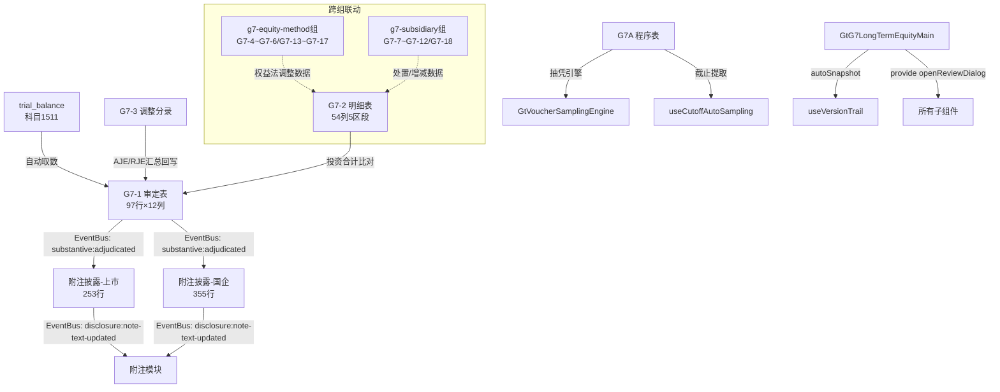

# Design Document: G7 长期股权投资(main组)底稿专属HTML精美组件

## Overview

G7长期股权投资(main组)专属组件`g7-long-term-equity-main`。覆盖1个xlsx源模板中的7个sheet（三组拆分中的核心组）。科目1511长期股权投资（借方/资产类）。**G循环中合并会计最复杂的科目**，97行审定表是投资循环中最大的审定表（按控制类型分5组），54列明细表是投资循环中最宽的表（需5区段Tab），355行附注是全平台最长的附注（必须虚拟滚动）。

核心架构：
- componentType `g7-long-term-equity-main`，主入口 GtG7LongTermEquityMain.vue
- **sheetName v-if dispatch模式**：7 sheets用v-if分发（不用el-tabs）
- 子目录分组：core/ + disclosure/
- 宽表拆分：G7-1(12列，分组折叠97行虚拟滚动) / G7-2(54列→5区段Tab) / 附注(253/355行虚拟滚动)
- 借方科目公式：期末未审 = 期初审定 + 借方发生额 - 贷方发生额
- 控制类型决定计量：子公司用成本法 / 合营联营用权益法
- EventBus联动：publish `substantive:adjudicated`(accountCode='1511') + `disclosure:note-text-updated`
- 双模式（HTML ↔ OnlyOffice）+ 导入导出(useG7ImportExport, 2张表) + AI(2 section)
- 五大集成：版本链✅ 抽凭✅ 截止✅ 附注EventBus✅ 复核✅（本组无凭证表，不含行级OCR）

## Architecture

### sheetName分发模式 + 子目录组织

GtG7LongTermEquityMain.vue 接收 `sheetName` prop，用正则提取编码(G7A/G7-1/G7-2/G7-3/附注披露(上市)/附注披露(国企)/底稿目录)，`v-if` 分发到对应子组件。

```
sheetName → regex提取编码 → v-if匹配 → defineAsyncComponent子组件渲染
                                     ↘ 未匹配 → OnlyOffice fallback

7 sheets 子目录分组:
├── core/
│   ├── G7A    实质性程序表（复用a-program-console + 抽凭引擎 + 截止提取）
│   ├── G7-1   审定表（97行×12列，**最大审定表**，按控制类型分5组）
│   ├── G7-2   明细表（103行×54列→**5区段Tab**，最宽表）
│   ├── G7-3   调整分录汇总（23行×10列，AJE/RJE + 借贷平衡校验）
│   └── 底稿目录（24行×8列）
└── disclosure/
    ├── 附注披露(上市)（253行×13列，虚拟滚动）
    └── 附注披露(国企)（355行×17列，虚拟滚动）
```

### 高层数据流



### 文件结构

```
audit-platform/frontend/src/components/workpaper/
├── GtG7LongTermEquityMain.vue                    # 主入口 sheetName v-if分发（defineAsyncComponent lazy×7）
├── g7-long-term-equity-main/
│   ├── core/
│   │   ├── G7TabProcedure.vue                    # G7A 程序表（复用a-program-console+selfLoad+抽凭+截止）
│   │   ├── G7TabAdjudication.vue                 # G7-1 审定表（97行×12列，分组折叠+虚拟滚动）
│   │   ├── G7TabDetail.vue                       # G7-2 明细表（54列→5区段Tab+虚拟滚动）
│   │   ├── G7TabAdjustment.vue                   # G7-3 调整分录（AJE/RJE+借贷校验+动态行）
│   │   └── G7TabDirectory.vue                    # 底稿目录（24行×8列）
│   └── disclosure/
│       ├── G7TabDisclosureListed.vue             # 附注披露(上市)(253行×13列，虚拟滚动)
│       └── G7TabDisclosureSOE.vue                # 附注披露(国企)(355行×17列，虚拟滚动)
├── composables/
│   ├── useG7FormulaEngine.ts                     # G7公式引擎(8个纯函数+parseNum)
│   ├── useG7FormData.ts                          # 数据加载/保存/selfLoad/writebackTB
│   ├── useG7ImportExport.ts                      # 导入导出composable(2张表: G7-2/G7-3)
│   └── useG7DualMode.ts                          # 双模式OO切换+localStorage

backend/app/routers/wp_render_strategies/
├── _g7_long_term_equity_main.py                  # render策略+注册RENDERER_DISPATCH
├── _g7_long_term_equity_main_service.py          # 业务逻辑(公式验证/TB取数/EventBus)
├── _g7_long_term_equity_main_import_export.py    # 导入导出端点(2张表: G7-2×5sheet+G7-3)
└── _g7_long_term_equity_main_ai.py              # AI生成2 section
```

### EventBus事件

| 事件名 | 发布者 | 消费者 | payload |
|--------|--------|--------|---------|
| `substantive:adjudicated` | G7-1审定表 | 附注披露(上市/国企) + trial_balance | `{accountCode:'1511', adjudicatedAmount, byControlType:{subsidiary,jointVenture,associate}}` |
| `disclosure:note-text-updated` | 附注披露 | 附注模块 | `{accountCode:'1511', text}` |

### 后端AI Section清单

```
adjudication-analysis / disclosure-text
```

## Components and Interfaces

### 前端组件接口

```typescript
// GtG7LongTermEquityMain.vue props
interface G7LongTermEquityMainProps {
  htmlData: Record<string, any> | null
  sheetName: string
  wpId: string
  projectId: string
  readonly?: boolean
}

// sheetName正则匹配映射
const SHEET_CODE_MAP: Record<string, string> = {
  'G7A': 'procedure',
  'G7-1': 'adjudication',
  'G7-2': 'detail',
  'G7-3': 'adjustment',
  '附注披露信息（上市公司）': 'disclosureListed',
  '附注披露信息（国企）': 'disclosureSOE',
  '底稿目录': 'directory',
}
```

### G7-1 审定表数据模型（97行×12列，按控制类型分5组+净值行）

```typescript
// 控制类型枚举
type ControlType = 'subsidiary' | 'joint_venture' | 'associate'
// 计量方法由控制类型决定：subsidiary→成本法, joint_venture/associate→权益法

interface G7AdjudicationData {
  groups: G7AdjudicationGroup[]        // 5组: 子公司/合营/联营/合计/减值
  netValue: G7NetValueRow              // 第六行: 净值 = 合计 - 减值
  trialBalanceAmount: number           // 试算表取数(科目1511)
  variance: number                     // 差异=审定-试算表
}

interface G7AdjudicationGroup {
  id: string
  groupType: 'subsidiary' | 'joint_venture' | 'associate' | 'total' | 'impairment'
  title: string                        // 一、对子公司投资（成本法）等
  collapsed: boolean                   // 分组折叠状态
  rows: G7AdjudicationRow[]
  subtotal: G7AdjudicationSubtotal     // 小计行
}

interface G7AdjudicationRow {
  id: string
  item: string                         // 被投资单位名称
  controlType: ControlType             // 控制类型
  // 期初
  openingUnadjusted: number            // 期初未审数
  openingAJE: number                   // 期初审计调整
  openingRJE: number                   // 期初重分类
  openingAdjusted: number              // 公式: 未审 + AJE + RJE
  // 期末
  closingUnadjusted: number            // 期末未审数（借方余额公式）
  closingAJE: number                   // 期末审计调整
  closingRJE: number                   // 期末重分类
  closingAdjusted: number              // 公式: 未审 + AJE + RJE
  // 变动
  changeAmount: number                 // 公式: 期末审定 - 期初审定
  changeRate: number | null            // 公式: (期末-期初)/期初, 期初=0时null
}

interface G7AdjudicationSubtotal {
  openingAdjusted: number
  closingAdjusted: number
  changeAmount: number
  changeRate: number | null
}

interface G7NetValueRow {
  // 净值 = 投资合计 - 减值准备
  openingNetValue: number
  closingNetValue: number
  changeAmount: number
  changeRate: number | null
}
```

### G7-2 明细表数据模型（103行×54列→5区段Tab）

```typescript
interface G7DetailRow {
  id: string
  seq: number

  // ══ Tab1: 基础信息(8列) ══
  investeeName: string                 // 被投资单位名称
  controlType: ControlType             // 控制类型(子公司/合营/联营 下拉)
  holdingRatio: number                 // 持股比例(小数)
  votingRatio: number                  // 投票权比例(小数)
  industry: string                     // 行业
  registeredPlace: string              // 注册地
  mainBusiness: string                 // 主营业务
  isRelatedParty: boolean              // 是否关联方

  // ══ Tab2: 期初余额(10列) ══
  openingInvestCost: number            // 期初投资成本
  openingEquityAdj: number             // 期初权益法调整
  openingImpairment: number            // 期初减值准备
  openingBookValue: number             // 期初账面价值(公式)
  openingAuditedCost: number           // 期初审定成本
  openingAuditedEquity: number         // 期初审定权益法
  openingAuditedImpairment: number     // 期初审定减值
  openingAuditedNetValue: number       // 期初审定净值(公式)
  openingRemark: string                // 备注

  // ══ Tab3: 本期变动(12列) ══
  increaseNewInvest: number            // 本期增加(新增投资)
  increaseEquityMethod: number         // 本期增加(权益法)
  decreaseDisposal: number             // 本期减少(处置)
  decreaseEquityAdj: number            // 本期减少(权益法调整)
  impairmentProvision: number          // 本期减值计提
  impairmentReversal: number           // 本期减值转回
  investeeNetProfit: number            // 被投资单位净利润
  holdingRatioChange: number           // 持股比例调整
  otherComprehensiveIncome: number     // 其他综合收益
  otherEquityChange: number            // 其他权益变动
  profitDistribution: number           // 利润分配

  // ══ Tab4: 期末+减值(12列) ══
  closingInvestCost: number            // 期末投资成本(公式: 期初+新增-处置)
  closingEquityAdj: number             // 期末权益法调整(公式: 期初+增加-减少)
  closingSubtotal: number              // 期末小计(公式: 成本+权益法调整)
  closingImpairment: number            // 期末减值准备(公式: 期初+计提-转回)
  closingBookValue: number             // 期末账面价值(公式: 小计-减值)
  auditAdjustment: number              // 审定调整
  auditedAmount: number                // 审定数(公式: 账面+调整)
  recoverableAmount: number            // 可收回金额
  impairmentTestConclusion: string     // 减值测试结论
  confirmationStatus: string           // 发函情况
  indexRef: string                     // 索引

  // ══ Tab5: 权益法详情(12列) ══
  investeeNetAssets: number            // 被投资方净资产
  shareOfNetAssets: number             // 享有份额(公式: 净资产×持股比例)
  goodwill: number                     // 商誉
  internalTransElim: number            // 内部交易抵销
  unrecognizedLoss: number             // 未确认损失
  equityMethodIncome: number           // 权益法投资收益
  currentOCI: number                   // 本期OCI
  dividendIncome: number               // 股利收入
  measurementConfirm: string           // 计量方法确认
  disposalGainLoss: number             // 处置损益
  equityRemark: string                 // 备注
}
```

### G7-3 调整分录数据模型（23行×10列）

```typescript
interface G7AdjustmentEntry {
  id: string
  seq: number
  entryType: 'AJE' | 'RJE'            // 分录类型
  date: string                         // 日期
  summary: string                      // 摘要
  accountCode: string                  // 科目代码
  accountName: string                  // 科目名称
  debitAmount: number                  // 借方金额
  creditAmount: number                 // 贷方金额
  preparedBy: string                   // 编制人
  remark: string                       // 备注
}
```

### 附注数据模型

```typescript
// 上市公司附注（253行×13列）
interface G7DisclosureListedData {
  sections: G7DisclosureSection[]
  // sections按披露要求分：
  // (一)按成本法/权益法分类汇总
  // (二)重要合营/联营企业信息
  // (三)不纳入合并范围的结构化主体
  // (四)持股5%以上被投资单位信息
  // (五)对外投资限制性条件
}

// 国企附注（355行×17列）—— 更详细的披露
interface G7DisclosureSOEData {
  sections: G7DisclosureSection[]
  // 国企附注在上市基础上增加：
  // (六)国有资本保值增值率
  // (七)对外投资决策程序合规性
  // (八)境外投资信息
}

interface G7DisclosureSection {
  id: string
  title: string
  rows?: G7DisclosureRow[]
  textContent?: string                 // 文本区内容（AI辅助）
}

interface G7DisclosureRow {
  id: string
  label: string
  value: string | number
  editable: boolean
}
```

## Data Models

### 存储结构（working_paper.content JSON）

```typescript
interface G7Content {
  // G7-1 审定表
  adjudication: {
    groups: G7AdjudicationGroup[]
    netValue: G7NetValueRow
  }
  // G7-2 明细表
  detail: {
    rows: G7DetailRow[]
  }
  // G7-3 调整分录
  adjustment: {
    entries: G7AdjustmentEntry[]
  }
  // 附注
  disclosureListed: { sections: G7DisclosureSection[] }
  disclosureSOE: { sections: G7DisclosureSection[] }
}
```

### API接口

```python
# _g7_long_term_equity_main.py
# RENDERER_DISPATCH注册
def render_g7_long_term_equity_main(wp_id: str, config: dict) -> dict:
    """Render策略函数，返回componentType='g7-long-term-equity-main'和sheets配置"""

# _g7_long_term_equity_main_import_export.py
POST /api/workpapers/{wp_id}/g7-main/export-template?sheet={code}
POST /api/workpapers/{wp_id}/g7-main/export-data?sheet={code}
POST /api/workpapers/{wp_id}/g7-main/import-data?sheet={code}  # multipart/form-data
# sheet codes: G7-2 / G7-3
# 宽表按区段分sheet导出：
#   G7-2(5sheet: 基础信息/期初余额/本期变动/期末+减值/权益法详情)

# _g7_long_term_equity_main_ai.py
POST /api/workpapers/{wp_id}/g7-main/ai/{section}
# section: adjudication-analysis / disclosure-text

# _g7_long_term_equity_main_service.py
class G7LongTermEquityMainService:
    async def get_trial_balance_data(project_id, year) -> dict
    async def save_adjudication(wp_id, data) -> dict
    async def validate_formulas(data) -> list[ValidationError]
```

### trial_balance 取数

```sql
-- G7-1审定表自动取数（资产类/借方）
SELECT standard_account_code, unadjusted_amount, aje_adjustment, audited_amount
FROM trial_balance
WHERE project_id = :project_id
  AND year = :year
  AND standard_account_code LIKE '1511%'
```

### 注册四件套

```python
# 1. htmlRendererRegistry (前端)
'g7-long-term-equity-main': () => import('./workpaper/GtG7LongTermEquityMain.vue')

# 2. wp_code_overrides.json (7条)
{
  "G7A-长期股权投资实质性程序表": "g7-long-term-equity-main",
  "G7-1-审定表": "g7-long-term-equity-main",
  "G7-2-明细表": "g7-long-term-equity-main",
  "G7-3-调整分录汇总": "g7-long-term-equity-main",
  "G7-附注披露信息（上市公司）": "g7-long-term-equity-main",
  "G7-附注披露信息（国企）": "g7-long-term-equity-main",
  "G7-底稿目录": "g7-long-term-equity-main"
}

# 3. VALID_COMPONENT_TYPES (后端)
'g7-long-term-equity-main'

# 4. RENDERER_DISPATCH (后端)
'g7-long-term-equity-main': render_g7_long_term_equity_main
```

## Integration Design（5大集成接入点）

### 1. 版本链 (useVersionTrail)

```typescript
// GtG7LongTermEquityMain.vue 主入口
const { autoSnapshot, showVersionTrail } = useVersionTrail(wpId)

async function handleSave() {
  await saveData()
  await autoSnapshot()  // 触发版本快照
}
// 工具栏"版本历史"按钮 → GtWpVersionTrail drawer
```

### 2. 抽凭引擎 (G7A程序表)

```typescript
// G7TabProcedure.vue
<GtVoucherSamplingEngine
  :project-id="projectId"
  :account-codes="['1511']"
  dialog-mode
  @samples-ready="fillSamples"
/>
```

### 3. 截止自动提取 (useCutoffAutoSampling)

```typescript
// G7TabProcedure.vue 截止测试步骤
const { fetchCutoffSamples } = useCutoffAutoSampling({
  projectId, accountCode: '1511', days: 5
})
```

### 4. 附注EventBus

```typescript
// G7TabAdjudication.vue (发布者)
watch(reportAmount, (val) => {
  eventBus.publish('substantive:adjudicated', {
    accountCode: '1511',
    adjudicatedAmount: val,
    byControlType: {
      subsidiary: subtotalSubsidiary.value,
      jointVenture: subtotalJointVenture.value,
      associate: subtotalAssociate.value,
    }
  })
})

// G7TabDisclosureListed.vue / G7TabDisclosureSOE.vue (消费者)
eventBus.subscribe('substantive:adjudicated', (payload) => {
  if (payload.accountCode === '1511') refreshData()
})

// 附注文本变更发布
eventBus.publish('disclosure:note-text-updated', {
  accountCode: '1511', text: noteText
})
```

### 5. 复核对话 (provide/inject)

```typescript
// GtG7LongTermEquityMain.vue (主入口)
const { openReviewDialog } = useReviewDialog(wpId)
provide('openReviewDialog', openReviewDialog)

// 子组件 (section标题栏右侧按钮)
const openReviewDialog = inject('openReviewDialog')
```

## 宽表区段Tab拆分详细设计

### G7-1 审定表（97行×12列，分组折叠+虚拟滚动）

```
┌─────────────────────────────────────────────────────────────────────────────┐
│ 🔍 TB取数(1511): ¥xxx | 差异: ¥xxx                    [导出] [版本] [复核] │
├─────────────────────────────────────────────────────────────────────────────┤
│                                                                             │
│ ▼ 一、对子公司投资（成本法）══════════════════════════════════════════════  │
│ │项目│控制类型│期初未审│期初AJE│期初RJE│期初审定│期末未审│期末AJE│期末RJE│   │
│ │    │       │       │       │       │(公式)  │(公式)  │       │       │   │
│ │期末审定│变动额│变动率│                                                    │
│ │(公式) │(公式)│(公式,>20%橙色)│                                            │
│ │ 子公司A │ 控制 │ ... │                                                    │
│ │ 子公司B │ 控制 │ ... │                                                    │
│ │ 小计    │      │ ... │                                                    │
│                                                                             │
│ ▼ 二、对合营企业投资（权益法）═══════════════════════════════════════════  │
│ │ 合营A │ 共同控制 │ ... │                                                  │
│ │ 小计  │          │ ... │                                                  │
│                                                                             │
│ ▼ 三、对联营企业投资（权益法）═══════════════════════════════════════════  │
│ │ 联营A │ 重大影响 │ ... │                                                  │
│ │ 小计  │          │ ... │                                                  │
│                                                                             │
│ ═ 四、投资合计 ══════════════════════════════════════════════════════════  │
│ │ 合计 = 子公司小计 + 合营小计 + 联营小计 │                                  │
│                                                                             │
│ ═ 五、减值准备 ══════════════════════════════════════════════════════════  │
│ │ 减值合计 │                                                                │
│                                                                             │
│ ═ 六、长期股权投资净值 ══════════════════════════════════════════════════  │
│ │ 净值 = 合计 - 减值 │                                                      │
│                                                                             │
│ 虚拟滚动：97行 | 分组折叠：点击组标题可折叠/展开                             │
│ ⚠️ |变动率|>20% 橙色高亮 + tooltip提示需分析原因                            │
└─────────────────────────────────────────────────────────────────────────────┘
```

### G7-2 明细表（54列→5区段Tab，最宽表）

```
┌─────────────────────────────────────────────────────────────────────────────┐
│ ┌──────────┐ ┌──────────┐ ┌──────────┐ ┌──────────────┐ ┌──────────────┐  │
│ │Tab1:基础(8)│ │Tab2:期初(10)│ │Tab3:变动(12)│ │Tab4:期末+减值(12)│ │Tab5:权益法(12)│ │
│ └──────────┘ └──────────┘ └──────────┘ └──────────────┘ └──────────────┘  │
│                                                                             │
│ Tab1: 被投资单位|控制类型(下拉)|持股比例|投票权比例|行业|注册地|              │
│       主营业务|是否关联方                                                    │
│                                                                             │
│ Tab2: 被投资单位|期初投资成本|期初权益法调整|期初减值准备|                    │
│       期初账面价值(公式)|期初审定成本|期初审定权益法|期初审定减值|            │
│       期初审定净值(公式)|备注                                                │
│                                                                             │
│ Tab3: 被投资单位|新增投资|权益法增加|处置减少|权益法调整减少|                │
│       减值计提|减值转回|被投资方净利润|持股比例调整|OCI|                      │
│       其他权益变动|利润分配                                                  │
│                                                                             │
│ Tab4: 被投资单位|期末投资成本(公式)|期末权益法调整(公式)|期末小计(公式)|     │
│       期末减值准备(公式)|期末账面价值(公式)|审定调整|审定数(公式)|            │
│       可收回金额|减值测试结论|发函情况|索引                                  │
│                                                                             │
│ Tab5: 被投资单位|被投资方净资产|享有份额(公式)|商誉|内部交易抵销|            │
│       未确认损失|权益法投资收益|本期OCI|股利收入|计量方法确认|               │
│       处置损益|备注                                                          │
│                                                                             │
│ 底部：[+ 新增被投资单位](ElMessageBox.prompt) | 合计行                       │
│ 虚拟滚动：103行                                                              │
│ 行同步：5个Tab间切换保持selectedRowIndex                                     │
│ 导入导出：el-dropdown(导出模板/导出数据5sheet/导入数据)                       │
└─────────────────────────────────────────────────────────────────────────────┘
```

### 附注披露（上市253行 / 国企355行，虚拟滚动）

```
┌─────────────────────────────────────────────────────────────────────────────┐
│ 附注披露信息（上市公司）253行×13列                    [AI] [复核] [导出]     │
├─────────────────────────────────────────────────────────────────────────────┤
│                                                                             │
│ ═══ (一) 按成本法/权益法分类汇总 ══════════ [AI辅助] [复核] ══════════════ │
│ │ 子公司-成本法合计 │ 合营联营-权益法合计 │ 总计 │ ...                       │
│                                                                             │
│ ═══ (二) 重要合营/联营企业信息 ════════════ [AI辅助] [复核] ══════════════ │
│ │ 企业名称 │ 注册地 │ 主营业务 │ 持股比例 │ 投票权 │ 期末余额 │ ...          │
│                                                                             │
│ ═══ (三) 不纳入合并范围的结构化主体 ══════ [AI辅助] [复核] ══════════════ │
│ │ ...                                                                       │
│                                                                             │
│ ═══ (四) 持股5%以上被投资单位信息 ════════ [AI辅助] [复核] ══════════════ │
│ │ ...                                                                       │
│                                                                             │
│ ═══ (五) 对外投资限制性条件 ══════════════ [AI辅助] [复核] ══════════════ │
│ │ ...                                                                       │
│                                                                             │
│ 虚拟滚动：253行 | EventBus订阅审定数刷新                                     │
└─────────────────────────────────────────────────────────────────────────────┘

┌─────────────────────────────────────────────────────────────────────────────┐
│ 附注披露信息（国企）355行×17列                        [AI] [复核] [导出]     │
├─────────────────────────────────────────────────────────────────────────────┤
│ 在上市公司基础上增加：                                                       │
│ ═══ (六) 国有资本保值增值率 ══════════════ [AI辅助] [复核] ══════════════ │
│ ═══ (七) 对外投资决策程序合规性 ══════════ [AI辅助] [复核] ══════════════ │
│ ═══ (八) 境外投资信息 ════════════════════ [AI辅助] [复核] ══════════════ │
│                                                                             │
│ 虚拟滚动：355行（全平台最长附注）                                            │
└─────────────────────────────────────────────────────────────────────────────┘
```

### G7-3 调整分录（23行×10列）

```
┌─────────────────────────────────────────────────────────────────────────────┐
│ 调整分录汇总 G7-3                              [+ 新增] [导入导出▾] [复核]  │
├─────────────────────────────────────────────────────────────────────────────┤
│ 借贷差额: ¥0.00 ✅ (差额≠0时红色 ❌)                                       │
│                                                                             │
│ │序号│类型(AJE/RJE)│日期│摘要│科目代码│科目名称│借方│贷方│编制人│备注│       │
│ │ 1  │ AJE         │... │... │ 1511   │ 长期股权│... │... │ ...  │... │     │
│ │ 2  │ RJE         │... │... │ ...    │ ...    │... │... │ ...  │... │     │
│ │...                                                                        │
│                                                                             │
│ 合计行：借方合计 | 贷方合计 | 差额                                           │
│ 动态行增删 + 保存时自动回写G7-1审定表AJE/RJE列                               │
└─────────────────────────────────────────────────────────────────────────────┘
```

## Formula Engine Design (useG7FormulaEngine.ts)

### 8个纯函数 + parseNum

```typescript
/**
 * 安全数值转换：null/undefined/NaN/空字符串/'  '/'abc' → 0; 有效数值→原值
 */
export function parseNum(v: unknown): number

/**
 * 借方余额公式：期末未审 = 期初审定 + 借方 - 贷方
 * G7为借方/资产类科目(1511)
 */
export function calcDebitBalance(opening: number, debit: number, credit: number): number

/**
 * 审定数 = 未审数 + AJE + RJE
 * G7审定表有AJE/RJE两列独立调整
 */
export function calcAdjustedAmount(unadjusted: number, aje: number, rje: number): number

/**
 * 期末投资成本 = 期初投资成本 + 新增投资 - 处置减少
 * G7-2明细表Tab4核心公式
 */
export function calcEndingCost(opening: number, increase: number, decrease: number): number

/**
 * 期末权益法调整 = 期初权益法调整 + 权益法增加 - 权益法减少
 * G7-2明细表Tab4权益法科目专用
 */
export function calcEndingEquityAdj(opening: number, equityIncrease: number, equityDecrease: number): number

/**
 * 期末账面价值 = 期末小计 - 期末减值准备
 * G7-2明细表Tab4
 */
export function calcBookValue(subtotal: number, impairment: number): number

/**
 * 变动率 = (current - prior) / prior
 * prior=0时返回null（避免除零）
 */
export function calcChangeRate(prior: number, current: number): number | null

/**
 * 借贷平衡校验：|SUM(debits) - SUM(credits)| < 0.01
 */
export function isDebitCreditBalanced(debits: number[], credits: number[]): boolean
```

### 公式引用关系

```
G7-1 审定表:
  openingAdjusted = calcAdjustedAmount(openingUnadjusted, openingAJE, openingRJE)
  closingUnadjusted ≈ calcDebitBalance(openingAdjusted, totalDebit, totalCredit)
  closingAdjusted = calcAdjustedAmount(closingUnadjusted, closingAJE, closingRJE)
  changeAmount = closingAdjusted - openingAdjusted
  changeRate = calcChangeRate(openingAdjusted, closingAdjusted)

G7-2 明细表:
  closingInvestCost = calcEndingCost(openingInvestCost, increaseNewInvest, decreaseDisposal)
  closingEquityAdj = calcEndingEquityAdj(openingEquityAdj, increaseEquityMethod, decreaseEquityAdj)
  closingSubtotal = closingInvestCost + closingEquityAdj
  closingImpairment = openingImpairment + impairmentProvision - impairmentReversal
  closingBookValue = calcBookValue(closingSubtotal, closingImpairment)
  auditedAmount = closingBookValue + auditAdjustment
  shareOfNetAssets = investeeNetAssets * holdingRatio

G7-3 调整分录:
  balanced = isDebitCreditBalanced(allDebits, allCredits)

G7-1 vs 试算表:
  variance = closingAdjusted(总计) - trialBalanceAmount(1511)
```

## Correctness Properties

*A property is a characteristic or behavior that should hold true across all valid executions of a system—essentially, a formal statement about what the system should do. Properties serve as the bridge between human-readable specifications and machine-verifiable correctness guarantees.*

### Property 1: 借方余额公式

*For any* opening, debit, credit ∈ ℝ: `calcDebitBalance(opening, debit, credit)` === `opening + debit - credit`

**Validates: Requirements 3.3, 6.2**

### Property 2: 审定数公式（三参数）

*For any* unadjusted, aje, rje ∈ ℝ: `calcAdjustedAmount(unadjusted, aje, rje)` === `unadjusted + aje + rje`

**Validates: Requirements 3.3, 6.2**

### Property 3: 期末投资成本公式

*For any* opening, increase, decrease ∈ ℝ: `calcEndingCost(opening, increase, decrease)` === `opening + increase - decrease`

**Validates: Requirements 5.3, 6.2**

### Property 4: 期末权益法调整公式

*For any* opening, equityIncrease, equityDecrease ∈ ℝ: `calcEndingEquityAdj(opening, equityIncrease, equityDecrease)` === `opening + equityIncrease - equityDecrease`

**Validates: Requirements 5.4, 6.2**

### Property 5: 账面价值公式

*For any* subtotal, impairment ∈ ℝ: `calcBookValue(subtotal, impairment)` === `subtotal - impairment`

**Validates: Requirements 5.5, 6.2**

### Property 6: 变动率方向性与除零保护

*For any* current > prior > 0: `calcChangeRate(prior, current)` > 0;
*For any* current < prior, prior > 0: `calcChangeRate(prior, current)` < 0;
`calcChangeRate(0, any)` === null

**Validates: Requirements 3.5, 6.2**

### Property 7: 借贷平衡恒等

*For any* debits[], credits[] ∈ ℝ[]: `isDebitCreditBalanced(debits, credits)` ↔ (|SUM(debits) - SUM(credits)| < 0.01)

**Validates: Requirements 6.1, 6.2**

### Property 8: parseNum健壮性

*For any* input ∈ {null, undefined, '', NaN, '  ', 'abc'}: `parseNum(input)` === 0;
*For any* n ∈ ℝ (finite): `parseNum(n)` === n

**Validates: Requirements 6.2**

### Property 9: 5区段Tab行同步

*For any* selectedRowIndex ∈ [0, rowCount) 和任意 Tab 切换 (tabA → tabB)，切换后 selectedRowIndex 保持不变

**Validates: Requirements 5.6**

## Error Handling

| 场景 | 处理策略 |
|------|---------|
| render-config 加载失败 | selfLoad重试1次 → 失败显示"加载失败"占位 + 重试按钮 |
| trial_balance 取数无数据 | 审定表显示0值 + 橙色提示"未找到科目1511数据" |
| 公式计算溢出/NaN | parseNum兜底→0，公式列显示"—" |
| 导入Excel格式不匹配 | 后端返回422 + 具体列错误信息 → 前端ElMessage.error |
| EventBus消息丢失 | 附注组件mounted时主动拉取最新审定数（非纯被动监听） |
| 保存时网络异常 | 自动重试3次(指数退避) → 失败后localStorage暂存 + 恢复提示 |
| sheetName无法识别 | fallback到OnlyOffice渲染（确保不白屏） |
| 97行虚拟滚动渲染异常 | 降级为分页模式(每页30行) |
| 355行附注虚拟滚动卡顿 | 分段懒加载(每段50行) + 滚动节流(16ms) |
| G7-2动态行新增无名称 | ElMessageBox.prompt必填校验，取消则不创建 |
| 分组折叠状态丢失 | localStorage持久化折叠状态(per wpId) |
| 跨组数据未就绪 | G7-2权益法详情Tab5显示"待equity-method组填写"灰色提示 |
| 变动率>20%未分析 | 保存时warning提示(非阻断)，高亮行持续橙色 |

## Testing Strategy

### 测试分层

| 层 | 工具 | 范围 | 数量估计 |
|----|------|------|---------|
| PBT(前端) | vitest + fast-check | 8个公式函数×9属性 | ~12 test cases |
| PBT(后端) | pytest + hypothesis | 公式验证 | ~9 test cases |
| 单元测试(前端) | vitest | composable逻辑/数据转换/行同步/分组折叠 | ~16 test cases |
| 单元测试(后端) | pytest | service/renderer/import-export | ~10 test cases |
| 集成测试 | pytest | API端点(6导入导出+2AI+render) | ~6 test cases |
| E2E | Playwright | 关键用户路径(审定+明细5Tab+附注) | ~4 scenarios |

### PBT配置

- 前端：fast-check，`numRuns: 100`
- 后端：hypothesis，`max_examples=5`
- 每个PBT测试注释标注对应属性编号
- Tag格式：`Feature: g7-long-term-equity-main, Property {N}: {描述}`

### 关键测试路径

1. **审定表完整流程**：TB取数(1511) → 借方公式 → 填写AJE/RJE → 审定计算 → 分组折叠 → EventBus发布 → 附注刷新
2. **明细表54列5区段**：Tab1基础信息填入 → Tab切换行同步 → Tab3变动 → Tab4期末公式自动计算 → Tab5权益法详情
3. **调整分录回写**：新增AJE → 借贷平衡校验 → 保存 → 自动回写G7-1审定表AJE列
4. **附注虚拟滚动**：355行加载 → 滚动到底部 → section展开 → AI辅助生成 → EventBus发布

### PBT测试文件

```
audit-platform/frontend/src/components/workpaper/composables/__tests__/
└── useG7FormulaEngine.spec.ts         # 9个PBT属性 + fast-check

backend/tests/
└── test_g7_long_term_equity_main_pbt.py  # 后端PBT验证(hypothesis)
```

### 单元测试重点

- **分组折叠逻辑**：验证collapse/expand切换正确，子行隐藏/显示
- **5区段Tab行同步**：验证Tab切换后当前选中行索引不变
- **变动率>20%高亮**：验证|changeRate|>0.2时行class包含orange-highlight
- **净值计算**：验证netValue = totalAdjusted - impairmentAdjusted
- **动态行新增**：验证ElMessageBox.prompt取消时不创建行
- **导入导出宽表分sheet**：验证G7-2导出5sheet(每区段1sheet)
- **AJE/RJE回写**：验证G7-3保存后G7-1对应行AJE/RJE列更新
- **selfLoad逻辑**：验证htmlData=null时触发selfLoad API调用
