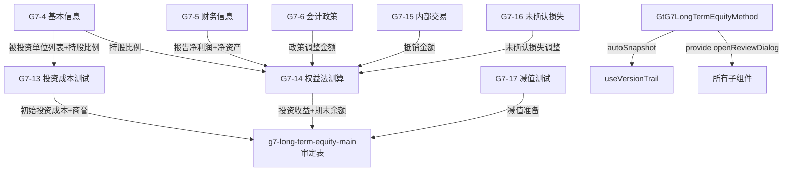

# Design Document: G7 长期股权投资(权益法组)底稿专属HTML精美组件

## Overview

G7长期股权投资(权益法组)专属组件`g7-long-term-equity-method`。覆盖1个xlsx源模板中的8个sheet（权益法测算+减值组）。科目1401长期股权投资（借方/资产类，权益法核算部分）。**权益法核算全流程**：被投资方信息(G7-4/G7-5/G7-6)→投资成本测试(G7-13)→权益法测算(G7-14)→内部交易抵销(G7-15)→未确认损失(G7-16)→减值测试(G7-17)。

核心架构：
- componentType `g7-long-term-equity-method`，主入口 GtG7LongTermEquityMethod.vue
- **sheetName v-if dispatch模式**：8 sheets用v-if分发（不用el-tabs）
- 子目录分组：info/ + calculation/ + impairment/
- 宽表拆分：G7-4(25列→2区段Tab) / G7-13(17列→2区段Tab) / G7-14(20列→2区段Tab) / G7-16(17列→2区段Tab)
- 公式引擎：useG7EquityMethodFormulaEngine.ts（9纯函数，权益法核心公式链）
- 特色：**权益法测算(G7-14最核心)**净利润调整→享有份额→投资收益确认 + **投资成本测试(G7-13)**商誉/营业外判断 + **内部交易抵销(G7-15)**顺流/逆流差异化 + **减值测试(G7-17)**可收回金额非负
- 双模式（HTML ↔ OnlyOffice）+ 导入导出(useG7EquityMethodImportExport, 7张表) + AI(4 section)
- 两大集成：版本链✅ 复核✅（本组无程序表/凭证/附注，故无抽凭/截止/EventBus/OCR）
- 虚拟滚动：G7-5(57行) / G7-13(68行) / G7-14(54行)

**三组拆分定位**：
| 组 | spec | 核心职责 |
|----|------|----------|
| main | g7-long-term-equity-main | 程序表+审定表+附注+明细表+调整+分类汇总 |
| **权益法(本spec)** | g7-long-term-equity-method | 被投资方信息+投资成本测试+权益法测算+内部交易+未确认损失+减值 |
| subsidiary | g7-long-term-equity-subsidiary | 控制判断+同控/非同控+处置+凭证检查 |

## Architecture

### sheetName分发模式 + 子目录组织

GtG7LongTermEquityMethod.vue 接收 `sheetName` prop，用正则提取编码(G7-4/G7-5/G7-6/G7-13/G7-14/G7-15/G7-16/G7-17)，`v-if` 分发到对应子组件。

```
sheetName → regex提取编码 → v-if匹配 → defineAsyncComponent子组件渲染
                                     ↘ 未匹配 → OnlyOffice fallback

8 sheets 子目录分组:
├── info/
│   ├── G7-4   被投资单位基本信息（25列→2区段Tab：工商信息/股权结构+管理层）
│   ├── G7-5   被投资单位财务信息（57行×10列，按被投资单位分组）
│   └── G7-6   被投资公司会计政策（31行×7列，问卷式一致性检查）
├── calculation/
│   ├── G7-13  投资成本测试表（68行×17列→2区段Tab：初始计量/商誉计算）
│   ├── G7-14  权益法测算表（54行×20列→2区段Tab：净利润调整/权益法计算）★最核心
│   └── G7-15  内部交易抵销测算表（41行×14列，顺流/逆流差异化）
└── impairment/
    ├── G7-16  未确认投资损失测试表（40行×17列→2区段Tab：长期权益/超额亏损分配）
    └── G7-17  减值测试表（33行×9列，可收回金额vs账面价值）
```

### 高层数据流



### 文件结构

```
audit-platform/frontend/src/components/workpaper/
├── GtG7LongTermEquityMethod.vue                    # 主入口 sheetName v-if分发（defineAsyncComponent lazy×8）
├── g7-long-term-equity-method/
│   ├── info/
│   │   ├── G7TabBasicInfo.vue                      # G7-4 基本信息（2区段Tab：工商/股权管理层）
│   │   ├── G7TabFinancialInfo.vue                  # G7-5 财务信息（57行虚拟滚动+分组）
│   │   └── G7TabAccountingPolicy.vue               # G7-6 会计政策一致性（问卷式）
│   ├── calculation/
│   │   ├── G7TabInvestmentCostTest.vue             # G7-13 投资成本测试（2区段Tab+68行虚拟滚动）
│   │   ├── G7TabEquityMethodCalc.vue               # G7-14 权益法测算（2区段Tab+54行虚拟滚动）★
│   │   └── G7TabInternalTransaction.vue            # G7-15 内部交易抵销（顺流/逆流）
│   └── impairment/
│       ├── G7TabUnrecognizedLoss.vue               # G7-16 未确认损失（2区段Tab）
│       └── G7TabImpairmentTest.vue                 # G7-17 减值测试
├── composables/
│   ├── useG7EquityMethodFormulaEngine.ts           # 公式引擎(9纯函数+parseNum)
│   ├── useG7EquityMethodFormData.ts                # 数据加载/保存/selfLoad
│   ├── useG7EquityMethodImportExport.ts            # 导入导出composable(7张表)
│   └── useG7EquityMethodDualMode.ts                # 双模式OO切换+localStorage

backend/app/routers/wp_render_strategies/
├── _g7_long_term_equity_method.py                  # render策略+RENDERER_DISPATCH
├── _g7_long_term_equity_method_import_export.py    # 导入导出端点(7张表×3=21端点)
└── _g7_long_term_equity_method_ai.py               # AI生成4 section
```

### 后端AI Section清单

```
cost-test-conclusion / equity-method-conclusion / internal-transaction-conclusion / impairment-conclusion
```

## Components and Interfaces

### 前端组件接口

```typescript
// GtG7LongTermEquityMethod.vue props
interface G7LongTermEquityMethodProps {
  htmlData: Record<string, any> | null
  sheetName: string
  wpId: string
  projectId: string
  readonly?: boolean
}

// sheetName正则匹配映射
const SHEET_CODE_MAP: Record<string, string> = {
  'G7-4': 'basicInfo',
  'G7-5': 'financialInfo',
  'G7-6': 'accountingPolicy',
  'G7-13': 'investmentCostTest',
  'G7-14': 'equityMethodCalc',
  'G7-15': 'internalTransaction',
  'G7-16': 'unrecognizedLoss',
  'G7-17': 'impairmentTest',
}
```

### G7-4 被投资单位基本信息数据模型（25列→2区段Tab）

```typescript
interface BasicInfoRow {
  id: string
  seq: number
  investeeName: string                           // 被投资单位名称（行标识）

  // ══ Tab1: 工商信息(12列) ══
  creditCode: string                             // 统一社会信用代码
  establishDate: string                          // 成立日期
  registeredCapital: number                      // 注册资本
  paidInCapital: number                          // 实缴资本
  registeredAddress: string                      // 注册地
  industry: string                               // 行业
  mainBusiness: string                           // 主营业务
  legalRepresentative: string                    // 法定代表人
  controlType: '子公司' | '合营' | '联营'         // 控制类型(下拉)
  investmentRatio: number                        // 持股比例(小数)
  votingRatio: number                            // 投票权比例(小数)

  // ══ Tab2: 股权结构+管理层(13列) ══
  otherShareholderName: string                   // 其他股东名称
  otherShareholderRatio: number                  // 其他股东持股
  boardSeats: number                             // 董事会席位
  appointedDirectors: number                     // 派出董事
  hasVeto: boolean                               // 是否有否决权
  participatesInDecision: boolean                // 是否参与决策
  significantInfluenceBasis: string              // 重大影响判断依据(textarea)
  managementComposition: string                  // 管理层组成
  latestAuditReportDate: string                  // 最新审计报告日
  auditOpinionType: string                       // 审计意见类型
  relatedPartyRelation: string                   // 关联关系
  remark: string                                 // 备注
}

interface BasicInfoData {
  rows: BasicInfoRow[]
}
```

### G7-5 被投资单位财务信息数据模型（57行×10列）

```typescript
interface FinancialInfoRow {
  id: string
  seq: number
  investeeName: string                           // 被投资单位
  reportItem: string                             // 报表项目(资产/负债/净资产/收入/利润等)
  priorAmount: number                            // 上年金额
  currentAmount: number                          // 本年金额
  changeAmount: number                           // 变动额(公式: 本年-上年)
  changeRate: number | null                      // 变动率(公式: 变动/上年, 上年=0→null)
  analysisNote: string                           // 分析说明
  dataSource: string                             // 数据来源
  auditStatus: '已审' | '未审' | '待确认'         // 审计状态(下拉)
  remark: string                                 // 备注
}

interface FinancialInfoData {
  rows: FinancialInfoRow[]
  groups: { investeeName: string; rows: FinancialInfoRow[] }[]  // 按被投资单位分组
}
```

### G7-6 被投资公司会计政策数据模型（31行×7列）

```typescript
interface AccountingPolicyRow {
  id: string
  seq: number
  policyItem: string                             // 会计政策事项
  investeePolicy: string                         // 被投资方政策
  investorPolicy: string                         // 投资方政策
  isConsistent: '一致' | '不一致' | '不适用'      // 是否一致(下拉)
  adjustmentAmount: number                       // 调整金额
  adjustmentNote: string                         // 调整说明
}

interface AccountingPolicyData {
  rows: AccountingPolicyRow[]
  conclusion: string                             // 审计结论
}
```

### G7-13 投资成本测试数据模型（68行×17列→2区段Tab）

```typescript
interface InvestmentCostTestRow {
  id: string
  seq: number
  investeeName: string                           // 被投资单位名称

  // ══ Tab1: 初始计量(9列) ══
  investDate: string                             // 投资日期
  mergeType: '合并' | '非合并'                    // 合并/非合并(下拉)
  consideration: number                          // 支付对价
  directCosts: number                            // 直接相关费用
  initialCost: number                            // 初始投资成本(公式: 对价+费用)
  netAssetFairValue: number                      // 被投资方可辨认净资产公允价值
  shareOfNetAssets: number                       // 享有份额(公式: FV×持股比例)
  difference: number                             // 差额(公式: 初始成本-享有份额)

  // ══ Tab2: 商誉计算+调整(8列) ══
  differenceNature: '商誉' | '营业外收入'         // 差额性质(正=商誉,负=营业外收入)
  accountingTreatment: string                    // 会计处理
  fvAdjustmentDetail: string                     // 公允价值调整明细(textarea)
  adjustedNetAssets: number                      // 调整后净资产
  adjustedShareOfNetAssets: number               // 调整后享有份额
  auditConclusion: '无差异' | '存在差异-可接受' | '存在差异-需调整'  // 审计结论(下拉)
  indexRef: string                               // 索引
}

interface InvestmentCostTestData {
  rows: InvestmentCostTestRow[]
  conclusion: string                             // 审计结论(AI辅助)
}
```

### G7-14 权益法测算表数据模型（54行×20列→2区段Tab，★最核心）

```typescript
interface EquityMethodCalcRow {
  id: string
  seq: number
  investeeName: string                           // 被投资单位

  // ══ Tab1: 净利润调整(10列) ══
  reportedNetProfit: number                      // 被投资方报告净利润
  internalTransactionAdj: number                 // 内部交易抵销
  fvDepreciationAdj: number                      // 公允价值折旧摊销
  accountingPolicyAdj: number                    // 会计政策调整
  otherAdj: number                               // 其他调整
  adjustedNetProfit: number                      // 调整后净利润(公式)
  investmentRatio: number                        // 持股比例(小数)
  equityShare: number                            // 应享有份额(公式: 调整后净利润×比例)
  confirmedIncome: number                        // 企业确认投资收益

  // ══ Tab2: 权益法计算(10列) ══
  incomeDifference: number                       // 投资收益差异(公式: 享有-确认)
  ociChange: number                              // 其他综合收益变动
  ociShare: number                               // 享有OCI(公式: OCI变动×比例)
  otherEquityChange: number                      // 其他权益变动
  otherEquityShare: number                       // 享有其他权益(公式: 其他×比例)
  dividendDistributed: number                    // 利润分配(股利)
  openingBalance: number                         // 期初权益法余额
  closingBalance: number                         // 期末权益法余额(公式)
  auditConclusion: '无差异' | '差异可接受' | '差异需调整'  // 审计结论
}

interface EquityMethodCalcData {
  rows: EquityMethodCalcRow[]
  materialityLevel: number                       // 重要性水平
  conclusion: string                             // 审计结论(AI辅助)
  groups: { investeeName: string; rows: EquityMethodCalcRow[] }[]
}
```

### G7-15 内部交易抵销数据模型（41行×14列）

```typescript
interface InternalTransactionRow {
  id: string
  seq: number
  investeeName: string                           // 被投资单位
  transactionType: '顺流' | '逆流'               // 交易类型(下拉)
  transactionContent: string                     // 交易内容
  transactionAmount: number                      // 交易金额
  unrealizedProfit: number                       // 未实现利润(公式或直接填写)
  investmentRatio: number                        // 持股比例
  eliminationAmount: number                      // 应抵销金额(公式: 逆流=利润×比例, 顺流=利润)
  priorElimination: number                       // 上年抵销
  currentChange: number                          // 本年变动(公式: 应抵销-上年)
  eliminationEntry: string                       // 抵销分录
  isRelatedParty: boolean                        // 是否关联交易
  auditConclusion: '合理' | '基本合理' | '不合理'  // 审计结论(下拉)
  indexRef: string                               // 索引
  remark: string                                 // 备注
}

interface InternalTransactionData {
  rows: InternalTransactionRow[]
  conclusion: string                             // 审计结论(AI辅助)
}
```

### G7-16 未确认投资损失数据模型（40行×17列→2区段Tab）

```typescript
interface UnrecognizedLossRow {
  id: string
  seq: number
  investeeName: string                           // 被投资单位

  // ══ Tab1: 长期权益分析(9列) ══
  investmentBookValue: number                    // 投资账面
  longTermReceivable: number                     // 长期应收款
  otherLongTermEquity: number                    // 其他实质长期权益
  estimatedLiability: number                     // 预计负债
  totalLongTermEquity: number                    // 合计长期权益(公式)
  cumulativeLoss: number                         // 累计亏损
  excessLoss: number                             // 超额亏损(公式: 累计亏损-合计权益, clamp≥0)
  allocationOrder: string                        // 分配顺序说明

  // ══ Tab2: 超额亏损分配(8列) ══
  reduceInvestment: number                       // 冲减投资
  reduceLongTermReceivable: number               // 冲减长应收
  reduceOtherEquity: number                      // 冲减其他权益
  recognizeEstimatedLiability: number            // 确认预计负债
  unrecognizedLoss: number                       // 未确认损失(公式: 超额-各项冲减)
  currentChange: number                          // 本期变动
  auditConclusion: '合理' | '基本合理' | '不合理'  // 审计结论(下拉)
}

interface UnrecognizedLossData {
  rows: UnrecognizedLossRow[]
  conclusion: string
}
```

### G7-17 减值测试数据模型（33行×9列）

```typescript
interface ImpairmentTestRow {
  id: string
  seq: number
  investeeName: string                           // 被投资单位
  bookValue: number                              // 账面价值
  recoverableAmount: number                      // 可收回金额
  hasImpairmentSign: boolean                     // 减值迹象(是/否)
  impairmentAmount: number                       // 减值金额(公式: MAX(0, 账面-可收回))
  fvLessDisposalCost: number                     // 公允价值-处置费用
  valueInUse: number                             // 使用价值
  auditConclusion: '无需计提' | '需计提' | '已充分计提'  // 审计结论(下拉)
  indexRef: string                               // 索引
}

interface ImpairmentTestData {
  rows: ImpairmentTestRow[]
  conclusion: string                             // 审计结论(AI辅助)
}
```

## Data Models

### 存储结构（working_paper.content JSON）

```typescript
interface G7EquityMethodContent {
  basicInfo: BasicInfoData                       // G7-4
  financialInfo: FinancialInfoData               // G7-5
  accountingPolicy: AccountingPolicyData         // G7-6
  investmentCostTest: InvestmentCostTestData     // G7-13
  equityMethodCalc: EquityMethodCalcData         // G7-14
  internalTransaction: InternalTransactionData   // G7-15
  unrecognizedLoss: UnrecognizedLossData         // G7-16
  impairmentTest: ImpairmentTestData             // G7-17
}
```

### API接口

```python
# _g7_long_term_equity_method.py
def render_g7_long_term_equity_method(wp_id: str, config: dict) -> dict:
    """Render策略函数，返回componentType='g7-long-term-equity-method'和sheets配置"""

# _g7_long_term_equity_method_import_export.py
POST /api/workpapers/{wp_id}/g7-equity-method/export-template?sheet={code}
POST /api/workpapers/{wp_id}/g7-equity-method/export-data?sheet={code}
POST /api/workpapers/{wp_id}/g7-equity-method/import-data?sheet={code}  # multipart/form-data
# sheet codes: G7-4 / G7-5 / G7-13 / G7-14 / G7-15 / G7-16 / G7-17
# 宽表按区段分sheet导出：
#   G7-4(2sheet) / G7-13(2sheet) / G7-14(2sheet) / G7-16(2sheet)

# _g7_long_term_equity_method_ai.py
POST /api/workpapers/{wp_id}/g7-equity-method/ai/{section}
# section: cost-test-conclusion / equity-method-conclusion /
#          internal-transaction-conclusion / impairment-conclusion
```

### 注册四件套

```python
# 1. htmlRendererRegistry (前端)
'g7-long-term-equity-method': () => import('./workpaper/GtG7LongTermEquityMethod.vue')

# 2. wp_code_overrides.json (8条)
{
  "G7-4-被投资单位基本信息": "g7-long-term-equity-method",
  "G7-5-被投资单位财务信息（合营、联营）": "g7-long-term-equity-method",
  "G7-6-被投资公司会计政策": "g7-long-term-equity-method",
  "G7-13-合营联营企业投资成本测试表": "g7-long-term-equity-method",
  "G7-14-权益法测算表": "g7-long-term-equity-method",
  "G7-15-权益法未实现内部交易抵销测算表": "g7-long-term-equity-method",
  "G7-16-未确认投资损失测试表": "g7-long-term-equity-method",
  "G7-17-减值测试表": "g7-long-term-equity-method"
}

# 3. VALID_COMPONENT_TYPES (后端)
'g7-long-term-equity-method'

# 4. RENDERER_DISPATCH (后端)
'g7-long-term-equity-method': render_g7_long_term_equity_method
```

## Integration Design（两大集成接入点）

### 1. 版本链 (useVersionTrail)

```typescript
// GtG7LongTermEquityMethod.vue 主入口
const { autoSnapshot, showVersionTrail } = useVersionTrail(wpId)

async function handleSave() {
  await saveData()
  await autoSnapshot()  // 触发版本快照
}
// 工具栏"版本历史"按钮 → GtWpVersionTrail drawer
```

### 2. 复核对话 (provide/inject)

```typescript
// GtG7LongTermEquityMethod.vue (主入口)
const { openReviewDialog } = useReviewDialog(wpId)
provide('openReviewDialog', openReviewDialog)

// 子组件 (section标题栏右侧按钮)
const openReviewDialog = inject('openReviewDialog')
```

### 不集成项说明

| 集成 | 状态 | 原因 |
|------|------|------|
| 抽凭引擎 | ❌ | 本组无凭证检查表(凭证在subsidiary组) |
| 截止自动提取 | ❌ | 本组无程序表(程序表在main组) |
| 附注EventBus | ❌ | 本组无附注(附注在main组) |
| 行级OCR | ❌ | 本组无凭证附件列 |

## 宽表区段Tab拆分详细设计

### G7-4 被投资单位基本信息（25列→2区段Tab）

```
┌─────────────────────────────────────────────────────────────────┐
│ ┌──────────────────────┐ ┌───────────────────────────┐         │
│ │Tab1: 工商信息(12列)   │ │Tab2: 股权结构+管理层(13列) │ 区段Tab  │
│ └──────────────────────┘ └───────────────────────────┘         │
│                                                                 │
│ Tab1: 被投资单位|信用代码|成立日期|注册资本|实缴资本|注册地|行业| │
│       主营业务|法代|控制类型(下拉)|持股比例|投票权比例            │
│                                                                 │
│ Tab2: 被投资单位|其他股东|持股|董事会席位|派出董事|否决权|参与决策│
│       重大影响依据(textarea)|管理层|审计报告日|审计意见|关联关系|备注│
│                                                                 │
│ 底部：动态行增删（ElMessageBox.prompt输入被投资单位名称）         │
│ 行同步：Tab切换保持行索引                                        │
└─────────────────────────────────────────────────────────────────┘
```

### G7-13 投资成本测试（17列→2区段Tab）

```
┌─────────────────────────────────────────────────────────────────┐
│ 方法论上下文（琥珀色左边线+浅黄背景）                             │
│ "CAS2投资成本判断：                                              │
│   初始投资成本 > 享有可辨认净资产FV份额 → 差额确认为商誉           │
│   初始投资成本 < 享有可辨认净资产FV份额 → 差额计入营业外收入       │
│   被投资方净资产公允价值需逐项辨认、调整"                         │
│                                                                 │
│ ┌──────────────────────┐ ┌──────────────────────┐              │
│ │Tab1: 初始计量(9列)    │ │Tab2: 商誉计算+调整(8列)│   区段Tab   │
│ └──────────────────────┘ └──────────────────────┘              │
│                                                                 │
│ Tab1: 被投资单位|投资日期|合并/非合并(下拉)|支付对价|直接费用|     │
│       初始成本(公式)|净资产FV|享有份额(公式)|差额(公式)           │
│       ⚠️ 差额>0 绿色"商誉" / 差额<0 蓝色"营业外收入"           │
│                                                                 │
│ Tab2: 被投资单位|差额性质|会计处理|FV调整明细(textarea)|          │
│       调整后净资产|调整后份额|审计结论(下拉)|索引                 │
│                                                                 │
│ 底部：审计结论textarea(AI辅助) + <details>编制提示</details>      │
│ 行同步：Tab切换保持行索引                                        │
│ 虚拟滚动：68行                                                   │
└─────────────────────────────────────────────────────────────────┘
```

### G7-14 权益法测算表（20列→2区段Tab，★最核心★）

```
┌─────────────────────────────────────────────────────────────────┐
│ 蓝色渐变引导区(序号步骤,2列grid)                                 │
│ ① 填入被投资方报告净利润                                        │
│ ② 填入各项调整（内部交易/FV折旧/政策/其他）                     │
│ ③ 系统自动计算调整后净利润和享有份额                             │
│ ④ 填入企业确认投资收益，系统自动计算差异                         │
│ ⑤ 填入OCI/其他权益变动/股利，系统自动计算期末余额                │
│                                                                 │
│ 方法论上下文（琥珀色左边线+浅黄背景）                             │
│ "权益法核算公式：                                                │
│   调整后净利润 = 报告净利润 - 内部交易 - FV折旧 ± 政策 ± 其他    │
│   应享有份额 = 调整后净利润 × 持股比例                            │
│   期末余额 = 期初 + 投资收益 + OCI份额 + 其他权益份额 - 股利"    │
│                                                                 │
│ ┌────────────────────────┐ ┌────────────────────┐              │
│ │Tab1: 净利润调整(10列)   │ │Tab2: 权益法计算(10列)│   区段Tab   │
│ └────────────────────────┘ └────────────────────┘              │
│                                                                 │
│ Tab1: 被投资单位|报告净利润|内部交易|FV折旧|政策调整|其他|         │
│       调整后净利润(公式)|持股比例|享有份额(公式)|企业确认收益      │
│                                                                 │
│ Tab2: 被投资单位|收益差异(公式)|OCI变动|享有OCI(公式)|            │
│       其他权益变动|享有其他(公式)|股利|期初余额|期末余额(公式)|结论│
│       ⚠️ |收益差异| > 重要性水平 → 红色高亮                     │
│                                                                 │
│ 按被投资单位分组 + 虚拟滚动54行                                   │
│ 底部：审计结论textarea(AI辅助) + <details>编制提示</details>      │
│ 行同步：Tab切换保持行索引                                        │
└─────────────────────────────────────────────────────────────────┘
```

### G7-15 内部交易抵销（14列，无需区段拆分）

```
┌─────────────────────────────────────────────────────────────────┐
│ 方法论上下文（琥珀色左边线+浅黄背景）                             │
│ "内部交易抵销规则：                                              │
│   顺流交易(投资方→被投资方)：应抵销 = 未实现利润 × 100%          │
│   逆流交易(被投资方→投资方)：应抵销 = 未实现利润 × 持股比例       │
│   未实现利润 = 交易金额 × 毛利率（或直接填写）"                  │
│                                                                 │
│ 被投资单位|交易类型(顺流/逆流)|交易内容|交易金额|                 │
│ 未实现利润(公式)|持股比例|应抵销金额(公式)|上年抵销|              │
│ 本年变动|抵销分录|关联交易|审计结论|索引|备注                     │
│                                                                 │
│ ⚠️ 顺流交易：应抵销=未实现利润（全额）                          │
│ ⚠️ 逆流交易：应抵销=未实现利润×持股比例（按份额）                │
│                                                                 │
│ 底部：审计结论textarea(AI辅助) + <details>编制提示</details>      │
│ 动态行增删                                                       │
└─────────────────────────────────────────────────────────────────┘
```

### G7-16 未确认投资损失（17列→2区段Tab）

```
┌─────────────────────────────────────────────────────────────────┐
│ 方法论上下文（琥珀色左边线+浅黄背景）                             │
│ "超额亏损抵减顺序（CAS2第44条）：                                │
│   ① 先冲减长期股权投资账面价值                                   │
│   ② 再冲减长期应收款等其他实质长期权益                           │
│   ③ 最后确认预计负债（如有额外义务）                             │
│   超出①②③的部分为未确认投资损失"                                │
│                                                                 │
│ ┌──────────────────────────┐ ┌─────────────────────────┐       │
│ │Tab1: 长期权益分析(9列)    │ │Tab2: 超额亏损分配(8列)  │ 区段Tab│
│ └──────────────────────────┘ └─────────────────────────┘       │
│                                                                 │
│ Tab1: 被投资单位|投资账面|长应收|其他权益|预计负债|合计(公式)|     │
│       累计亏损|超额亏损(公式)|分配顺序说明                        │
│                                                                 │
│ Tab2: 被投资单位|冲减投资|冲减长应收|冲减其他|确认预计负债|        │
│       未确认损失(公式)|本期变动|审计结论(下拉)                    │
│                                                                 │
│ 行同步：Tab切换保持行索引                                        │
└─────────────────────────────────────────────────────────────────┘
```

### G7-17 减值测试（9列，无需区段拆分）

```
┌─────────────────────────────────────────────────────────────────┐
│ 方法论上下文（琥珀色左边线+浅黄背景）                             │
│ "减值判断标准（CAS8）：                                          │
│   可收回金额 = MAX(公允价值-处置费用, 使用价值)                   │
│   减值金额 = MAX(0, 账面价值 - 可收回金额)                       │
│   减值迹象包括：被投资方持续亏损、净资产大幅下降、                │
│   市场环境显著恶化、技术/法律变化等"                             │
│                                                                 │
│ 被投资单位|账面价值|可收回金额|减值迹象(是/否)|                   │
│ 减值金额(公式)|公允价值-处置费用|使用价值|审计结论(下拉)|索引     │
│                                                                 │
│ ⚠️ 减值迹象=是 时，可收回金额/FV-处置/使用价值 三列高亮(必填)    │
│ ⚠️ 减值金额>0 时红色标记                                        │
│                                                                 │
│ 底部：审计结论textarea(AI辅助) + <details>编制提示</details>      │
│ 动态行增删                                                       │
└─────────────────────────────────────────────────────────────────┘
```

## Formula Engine Design (useG7EquityMethodFormulaEngine.ts)

### 9个纯函数 + parseNum

所有函数为纯函数（无副作用、无Vue响应式依赖、无外部状态），支持fast-check PBT验证。

```typescript
/**
 * 安全数值转换：null/undefined/NaN/空字符串/'  '/'abc' → 0; 有效数值→原值
 */
export function parseNum(v: unknown): number {
  if (v === null || v === undefined || v === '') return 0
  const n = Number(v)
  return Number.isFinite(n) ? n : 0
}

/**
 * 初始投资成本 = 支付对价 + 直接相关费用
 * G7-13 Tab1
 */
export function calcInvestmentCost(consideration: number, directCosts: number): number {
  return Math.round((parseNum(consideration) + parseNum(directCosts)) * 100) / 100
}

/**
 * 享有可辨认净资产公允价值份额 = 净资产FV × 持股比例
 * G7-13 Tab1
 */
export function calcShareOfNetAssets(netAssetFairValue: number, ratio: number): number {
  return Math.round((parseNum(netAssetFairValue) * parseNum(ratio)) * 100) / 100
}

/**
 * 商誉/营业外 = 初始投资成本 - 享有份额
 * 正=商誉，负=营业外收入
 * G7-13 Tab1
 */
export function calcGoodwill(initialCost: number, shareOfNetAssets: number): number {
  return Math.round((parseNum(initialCost) - parseNum(shareOfNetAssets)) * 100) / 100
}

/**
 * 调整后净利润 = 报告净利润 - 内部交易 - FV折旧 ± 会计政策 ± 其他
 * G7-14 Tab1（±用加法表示，负数即减）
 */
export function calcAdjustedNetProfit(
  reportedNetProfit: number,
  internalTransactionAdj: number,
  fvDepreciationAdj: number,
  accountingPolicyAdj: number,
  otherAdj: number
): number {
  return Math.round((
    parseNum(reportedNetProfit)
    - parseNum(internalTransactionAdj)
    - parseNum(fvDepreciationAdj)
    + parseNum(accountingPolicyAdj)
    + parseNum(otherAdj)
  ) * 100) / 100
}

/**
 * 权益法应享有份额 = 调整后净利润(或任意值) × 持股比例
 * 通用乘法：用于投资收益份额、OCI份额、其他权益份额
 * G7-14 Tab1/Tab2
 */
export function calcEquityShare(value: number, ratio: number): number {
  return Math.round((parseNum(value) * parseNum(ratio)) * 100) / 100
}

/**
 * 期末权益法余额 = 期初 + 投资收益 + OCI份额 + 其他权益份额 - 利润分配(股利)
 * G7-14 Tab2
 */
export function calcEquityMethodBalance(
  opening: number,
  investmentIncome: number,
  ociShare: number,
  otherEquityShare: number,
  dividend: number
): number {
  return Math.round((
    parseNum(opening)
    + parseNum(investmentIncome)
    + parseNum(ociShare)
    + parseNum(otherEquityShare)
    - parseNum(dividend)
  ) * 100) / 100
}

/**
 * 未实现利润（内部交易）= 交易金额 × 毛利率
 * G7-15
 */
export function calcUnrealizedProfit(transactionAmount: number, grossMarginRate: number): number {
  return Math.round((parseNum(transactionAmount) * parseNum(grossMarginRate)) * 100) / 100
}

/**
 * 应抵销金额 = 顺流:未实现利润全额 / 逆流:未实现利润×持股比例
 * G7-15
 */
export function calcEliminationAmount(
  unrealizedProfit: number,
  ratio: number,
  direction: '顺流' | '逆流'
): number {
  const profit = parseNum(unrealizedProfit)
  if (direction === '顺流') return Math.round(profit * 100) / 100
  return Math.round((profit * parseNum(ratio)) * 100) / 100
}

/**
 * 减值金额 = MAX(0, 账面价值 - 可收回金额)
 * G7-17
 */
export function calcImpairmentAmount(bookValue: number, recoverableAmount: number): number {
  const diff = parseNum(bookValue) - parseNum(recoverableAmount)
  return Math.round(Math.max(0, diff) * 100) / 100
}
```

### 公式引用关系

```
G7-13 投资成本测试:
  initialCost = calcInvestmentCost(consideration, directCosts)
  shareOfNetAssets = calcShareOfNetAssets(netAssetFairValue, ratio)
  difference = calcGoodwill(initialCost, shareOfNetAssets)
  differenceNature = difference > 0 ? '商誉' : '营业外收入'

G7-14 权益法测算:
  adjustedNetProfit = calcAdjustedNetProfit(reported, internal, fv, policy, other)
  equityShare = calcEquityShare(adjustedNetProfit, ratio)
  incomeDifference = equityShare - confirmedIncome  (简单减法)
  ociShare = calcEquityShare(ociChange, ratio)
  otherEquityShare = calcEquityShare(otherEquityChange, ratio)
  closingBalance = calcEquityMethodBalance(opening, equityShare, ociShare, otherEquityShare, dividend)
  highlight = Math.abs(incomeDifference) > materialityLevel

G7-15 内部交易:
  unrealizedProfit = calcUnrealizedProfit(amount, marginRate) 或直接填写
  eliminationAmount = calcEliminationAmount(unrealizedProfit, ratio, direction)
  currentChange = eliminationAmount - priorElimination

G7-16 未确认损失:
  totalLongTermEquity = investment + longReceivable + otherEquity + estimatedLiability
  excessLoss = MAX(0, cumulativeLoss - totalLongTermEquity)
  unrecognizedLoss = excessLoss - reduceInvestment - reduceLongReceivable - reduceOther - recognizeLiability

G7-17 减值:
  impairmentAmount = calcImpairmentAmount(bookValue, recoverableAmount)
  recoverableAmount = MAX(fvLessDisposalCost, valueInUse)  (审计员手动取高)
```

## Correctness Properties

*A property is a characteristic or behavior that should hold true across all valid executions of a system—essentially, a formal statement about what the system should do. Properties serve as the bridge between human-readable specifications and machine-verifiable correctness guarantees.*

### Property 1: 初始投资成本公式

*For any* consideration ∈ ℝ, directCosts ∈ ℝ: `calcInvestmentCost(consideration, directCosts)` SHALL equal `round(consideration + directCosts, 2)`

**Validates: Requirements 4.2**

### Property 2: 享有净资产份额公式

*For any* netAssetFairValue ∈ ℝ, ratio ∈ ℝ: `calcShareOfNetAssets(netAssetFairValue, ratio)` SHALL equal `round(netAssetFairValue × ratio, 2)`

**Validates: Requirements 4.3**

### Property 3: 商誉/营业外收入（差额+符号性质）

*For any* initialCost ∈ ℝ, shareOfNetAssets ∈ ℝ: `calcGoodwill(initialCost, shareOfNetAssets)` SHALL equal `round(initialCost - shareOfNetAssets, 2)`；且结果>0时为商誉性质，结果<0时为营业外收入性质。

**Validates: Requirements 4.4**

### Property 4: 调整后净利润公式

*For any* reported, internal, fv, policy, other ∈ ℝ: `calcAdjustedNetProfit(reported, internal, fv, policy, other)` SHALL equal `round(reported - internal - fv + policy + other, 2)`

**Validates: Requirements 5.2**

### Property 5: 持股比例份额计算（通用乘法）

*For any* value ∈ ℝ, ratio ∈ ℝ: `calcEquityShare(value, ratio)` SHALL equal `round(value × ratio, 2)` — 适用于投资收益份额(5.3)、OCI份额(5.5)、其他权益份额(5.6)三个场景。

**Validates: Requirements 5.3, 5.5, 5.6**

### Property 6: 权益法余额递推公式

*For any* opening, investmentIncome, ociShare, otherEquityShare, dividend ∈ ℝ: `calcEquityMethodBalance(opening, investmentIncome, ociShare, otherEquityShare, dividend)` SHALL equal `round(opening + investmentIncome + ociShare + otherEquityShare - dividend, 2)`

**Validates: Requirements 5.7**

### Property 7: 内部交易抵销（顺流/逆流差异化）

*For any* unrealizedProfit ∈ ℝ, ratio ∈ ℝ:
- `calcEliminationAmount(unrealizedProfit, ratio, '顺流')` SHALL equal `round(unrealizedProfit, 2)`（全额抵销）
- `calcEliminationAmount(unrealizedProfit, ratio, '逆流')` SHALL equal `round(unrealizedProfit × ratio, 2)`（按份额抵销）

**Validates: Requirements 6.3**

### Property 8: 减值金额（非负+MAX语义）

*For any* bookValue ∈ ℝ, recoverableAmount ∈ ℝ:
- `calcImpairmentAmount(bookValue, recoverableAmount)` SHALL equal `round(MAX(0, bookValue - recoverableAmount), 2)`
- `calcImpairmentAmount(bookValue, recoverableAmount)` ≥ 0 恒成立（非负性）

**Validates: Requirements 6.6**

### Property 9: parseNum健壮性

*For any* input ∈ {null, undefined, '', NaN, '  ', 'abc', Infinity}: `parseNum(input)` === 0
*For any* n ∈ ℝ (finite number): `parseNum(n)` === n（有效数字透传不变）

**Validates: Requirements 7.1**

## Error Handling

| 场景 | 处理策略 |
|------|---------|
| render-config 加载失败 | selfLoad重试1次 → 失败显示"加载失败"占位 + 重试按钮 |
| htmlData为null | 自动selfLoad（bundle内嵌场景） |
| sheetName无法识别 | fallback到OnlyOffice渲染（确保不白屏） |
| 公式计算溢出/NaN | parseNum兜底→0，公式列显示"—" |
| 导入Excel格式不匹配 | 后端返回422 + 具体列错误信息 → 前端ElMessage.error |
| 保存时网络异常 | 自动重试3次(指数退避) → 失败后localStorage暂存 + 恢复提示 |
| 持股比例超出合理范围 | 输入>1或<0时橙色warning提示（不阻断，允许特殊情况） |
| G7-14 重要性水平未设 | 默认不触发高亮，tooltop提示"请设置重要性水平" |
| G7-13 68行虚拟滚动渲染异常 | 降级为分页模式(每页30行) |
| G7-5 分组数据为空 | 显示"暂无被投资单位财务数据"空状态 |
| G7-6 一致性下拉未选择 | 保存时阻断提示"请完善会计政策一致性判断" |
| G7-15 顺流/逆流未选 | 应抵销金额列显示"—"，不参与汇总 |
| G7-16 超额亏损为负(无超额) | 自动显示0，Tab2全部禁用(无需分配) |
| G7-17 减值迹象为否 | 可收回金额/减值金额列灰色禁用(无需填写) |

## Testing Strategy

### 测试分层

| 层 | 工具 | 范围 | 数量估计 |
|----|------|------|---------|
| PBT(前端) | vitest + fast-check | 9个公式函数×9属性 | ~12 test cases |
| PBT(后端) | pytest + hypothesis | 公式验证 | ~9 test cases |
| 单元测试(前端) | vitest | composable逻辑/数据转换/高亮逻辑/顺流逆流 | ~20 test cases |
| 单元测试(后端) | pytest | service/renderer/import-export | ~12 test cases |
| 集成测试 | pytest | API端点(21导入导出+4AI+render) | ~10 test cases |
| E2E | Playwright | 关键用户路径(投资成本+权益法测算+内部交易) | ~4 scenarios |

### PBT配置

- 前端：fast-check，`numRuns: 100`
- 后端：hypothesis，`max_examples=5`
- 每个PBT测试注释标注对应属性编号
- Tag格式：`Feature: g7-long-term-equity-method, Property {N}: {描述}`

### PBT测试文件

```
audit-platform/frontend/src/components/workpaper/composables/__tests__/
└── useG7EquityMethodFormulaEngine.pbt.spec.ts    # 9个PBT属性 + fast-check

backend/tests/
└── test_g7_long_term_equity_method_pbt.py        # 后端PBT验证(hypothesis)
```

### PBT生成器策略

```typescript
// 金额：大范围浮点（含正负，模拟盈利/亏损）
const amountArb = fc.float({ min: -1e9, max: 1e9, noNaN: true, noDefaultInfinity: true })

// 持股比例：0~1之间（合营联营通常20%~50%）
const ratioArb = fc.float({ min: 0, max: 1, noNaN: true, noDefaultInfinity: true })

// 交易方向：顺流/逆流
const directionArb = fc.constantFrom('顺流' as const, '逆流' as const)

// 无效输入(parseNum测试)
const invalidArb = fc.constantFrom(null, undefined, '', NaN, '  ', 'abc', Infinity)

// 有效数字
const finiteArb = fc.float({ noNaN: true, noDefaultInfinity: true })
```

### 关键测试路径

1. **投资成本测试流程**：填入被投资方信息(G7-4) → 对价+费用 → 初始成本计算 → 净资产FV×比例=享有份额 → 差额=商誉/营业外 → AI结论
2. **权益法测算核心流程**：报告净利润 → 5项调整 → 调整后净利润(公式) → ×比例=享有份额 → 对比企业确认 → 差异高亮 → 期末余额递推 → AI结论
3. **内部交易抵销**：选顺流/逆流 → 填交易金额+毛利率 → 未实现利润(公式) → 按方向差异化计算应抵销 → 回写G7-14内部交易列
4. **减值测试**：减值迹象判断(是/否) → 是→填可收回金额 → MAX(0,账面-可收回) → 红色高亮

### 单元测试重点

- **顺流/逆流差异化逻辑**：验证calcEliminationAmount对两种方向的不同计算
- **重要性水平高亮**：验证|差异|>阈值时触发红色高亮
- **减值非负性**：验证calcImpairmentAmount永远返回≥0
- **G7-16超额亏损逻辑**：累计亏损≤合计权益时超额=0，Tab2禁用
- **G7-6一致性自动判定**：投资方政策=被投资方政策时isConsistent自动设为"一致"
- **G7-4动态行名称唯一性**：新增被投资单位名称不可重复
- **区段Tab行同步**：验证Tab切换后当前选中行索引不变
- **导入导出宽表分sheet**：验证G7-4导出2sheet、G7-13导出2sheet、G7-14导出2sheet、G7-16导出2sheet

### Playwright E2E

- sheetName分发到8个子组件
- G7-13区段Tab切换+投资成本公式自动计算+商誉/营业外颜色标记
- G7-14净利润调整→享有份额→差异高亮→期末余额递推
- G7-15顺流/逆流切换→应抵销金额动态变化
- G7-17减值迹象切换→条件必填联动
- 虚拟滚动在68行投资成本表中流畅滚动
- 双模式切换（HTML↔OnlyOffice）
