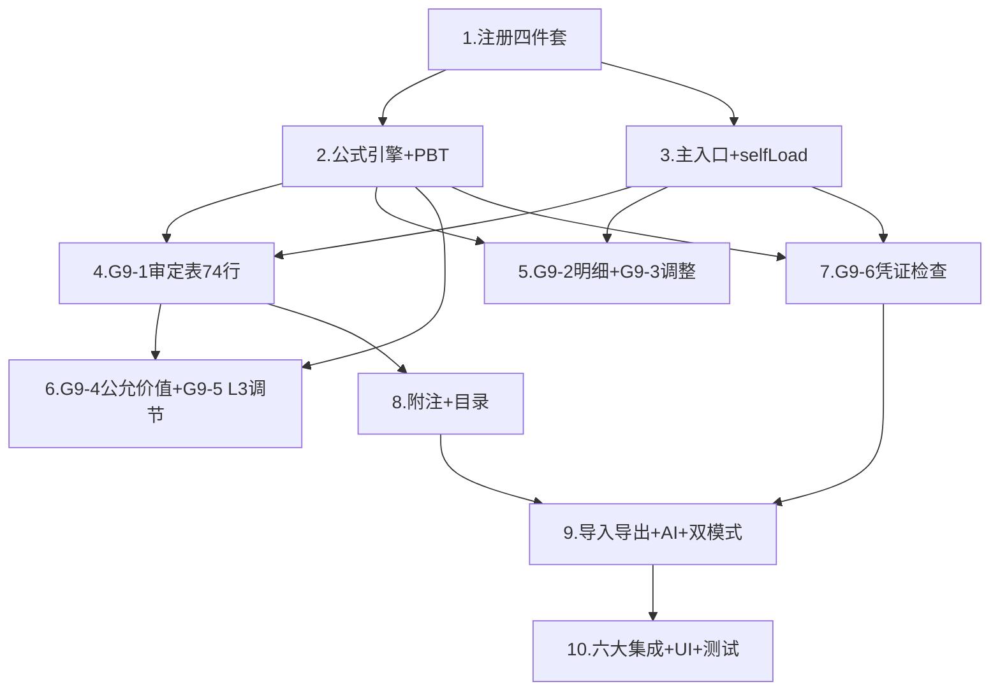

# Implementation Plan: G9 其他非流动金融资产底稿专属HTML精美组件

## Overview

G9其他非流动金融资产专属组件 `g9-other-noncurrent-financial`，覆盖10个sheet（G9A/G9-1~G9-6/附注披露(上市)/附注披露(国企)/底稿目录）。采用sheetName v-if dispatch模式 + defineAsyncComponent懒加载×10 + 公式引擎composable(8纯函数+parseNum) + 六大集成联动。按D~N底稿开发标准8步组织为8波次。特色：第三层次调节表G9-5(L3 Reconciliation 10因子变动分析) + 28列超宽明细表G9-2(3区段Tab) + 74行混合计量分组审定表G9-1(FVTPL/FVOCI/摊余成本虚拟滚动) + 公允价值测试G9-4(21列2区段+Level3必填) + 99行凭证检查G9-6(3区段+虚拟滚动)。

## Task Dependency Graph



```json
{
  "waves": [
    { "id": "wave-1", "name": "基础注册", "tasks": [1] },
    { "id": "wave-2", "name": "公式引擎+PBT", "tasks": [2] },
    { "id": "wave-3", "name": "主入口+数据层", "tasks": [3] },
    { "id": "wave-4", "name": "核心表(审定+明细+调整)", "tasks": [4, 5] },
    { "id": "wave-5", "name": "估值(公允价值测试+L3调节表)", "tasks": [6] },
    { "id": "wave-6", "name": "凭证检查+虚拟滚动", "tasks": [7] },
    { "id": "wave-7", "name": "附注+目录+导入导出+AI", "tasks": [8, 9] },
    { "id": "wave-8", "name": "六大集成+UI+测试", "tasks": [10] }
  ]
}
```

## Tasks

- [x] 1. 注册四件套 + render策略
  - [x] 1.1 后端注册：VALID_COMPONENT_TYPES + RENDERER_DISPATCH + render策略函数
    - 创建 `backend/app/routers/wp_render_strategies/_g9_other_noncurrent_financial.py`
    - 在 `VALID_COMPONENT_TYPES` 列表中添加 `'g9-other-noncurrent-financial'`
    - 在 `RENDERER_DISPATCH` 中注册 `'g9-other-noncurrent-financial': render_g9_other_noncurrent_financial`
    - render函数返回10个sheet的配置（componentType/sheetName/columns/rows）
    - _Requirements: 1.1, 1.5_

  - [x] 1.2 前端注册：htmlRendererRegistry + 主入口骨架
    - 在 `htmlRendererRegistry` 中添加 `'g9-other-noncurrent-financial': () => import('./workpaper/GtG9OtherNoncurrentFinancial.vue')`
    - 创建 `GtG9OtherNoncurrentFinancial.vue` 骨架（接收props，v-if分发占位，defineAsyncComponent×10）
    - _Requirements: 1.1, 1.2, 1.3_

  - [x] 1.3 wp_code_overrides.json添加10条映射
    - G9A/G9-1~G9-6/附注披露信息（上市公司）/附注披露信息（国企）/底稿目录 → 'g9-other-noncurrent-financial'
    - _Requirements: 1.4_

  - [x] 1.4 创建子目录结构 + 子组件占位
    - 创建 `g9-other-noncurrent-financial/core/` + `valuation/` + `voucher/` 三个子目录
    - core/ 下7个占位：G9TabProcedure/G9TabAdjudication/G9TabDetail/G9TabAdjustment/G9TabDisclosureListed/G9TabDisclosureSOE/G9TabDirectory
    - valuation/ 下2个占位：G9TabFairValueTest/G9TabL3Reconciliation
    - voucher/ 下1个占位：G9TabVoucherCheck
    - _Requirements: 1.1, 1.2_

- [x] 2. 公式引擎composable + PBT测试
  - [x] 2.1 实现useG9FormulaEngine.ts（8个纯函数 + parseNum）
    - 创建 `audit-platform/frontend/src/components/workpaper/composables/useG9FormulaEngine.ts`
    - 实现 parseNum（null/undefined/NaN/空串/'  '/'abc'→0，有效数值→原值）
    - 实现 calcDebitBalance(opening, debit, credit)：opening + debit - credit（借方余额，科目1504）
    - 实现 calcAdjustedAmount(unadjusted, aje, rje)：unadjusted + aje + rje（审定数，G9有AJE/RJE分列）
    - 实现 calcEndingBalance(openingAdjusted, increase, decrease, fvChange, interest, impairment)：openingAdjusted + increase - decrease + fvChange + interest - impairment（G9-2期末余额，6因子）
    - 实现 calcFairValueDiff(audited, unadjusted)：audited - unadjusted（G9-4公允价值差异）
    - 实现 calcChangeRate(prior, current)：prior=0返回null，否则(current-prior)/prior
    - 实现 isDebitCreditBalanced(debits[], credits[])：|SUM(debits)-SUM(credits)| < 0.01
    - 实现 calcL3Reconciliation(opening, purchase, disposal, transferIn, transferOut, fvChangePL, fvChangeOCI, interest, impairment, other)：opening + purchase - disposal + transferIn - transferOut + fvChangePL + fvChangeOCI + interest - impairment + other（G9-5 L3调节表10因子）
    - 所有函数无副作用，输入通过parseNum清洗
    - _Requirements: 10.1, 10.2_

  - [x]* 2.2 PBT: Property 1 — 借方余额公式
    - **Property 1: calcDebitBalance(opening, debit, credit) === opening + debit - credit**
    - **Validates: Requirements 3.3, 10.1**
    - fast-check numRuns ≥ 100

  - [x]* 2.3 PBT: Property 2 — 审定数公式
    - **Property 2: calcAdjustedAmount(unadjusted, aje, rje) === unadjusted + aje + rje**
    - **Validates: Requirements 3.3, 10.1**

  - [x]* 2.4 PBT: Property 3 — L3调节表恒等
    - **Property 3: calcL3Reconciliation(opening, purchase, disposal, transferIn, transferOut, fvPL, fvOCI, interest, impairment, other) === opening + purchase - disposal + transferIn - transferOut + fvPL + fvOCI + interest - impairment + other**
    - **Validates: Requirements 8.2, 10.2**

  - [x]* 2.5 PBT: Property 4 — 变动率方向性与除零保护
    - **Property 4: ∀ current>prior>0: calcChangeRate(prior,current)>0; ∀ current<prior,prior>0: result<0; calcChangeRate(0,any)===null**
    - **Validates: Requirements 3.8, 10.1**

  - [x]* 2.6 PBT: Property 5 — 借贷平衡恒等
    - **Property 5: isDebitCreditBalanced(debits, credits) ↔ (|SUM(debits)-SUM(credits)| < 0.01)**
    - **Validates: Requirements 6.2, 9.2, 10.1**

  - [x]* 2.7 PBT: Property 6 — parseNum健壮性
    - **Property 6: parseNum(null/undefined/''/NaN/'  '/'abc')===0; parseNum(n∈ℝ finite)===n**
    - **Validates: Requirements 10.1**

  - [x]* 2.8 PBT: Property 7 — 期末余额多因子加法交换律
    - **Property 7: calcEndingBalance(openingAdjusted, increase, decrease, fvChange, interest, impairment) === openingAdjusted + increase - decrease + fvChange + interest - impairment，且加法项/减法项分别求和后结果与顺序无关**
    - **Validates: Requirements 5.2, 10.1**

  - [x]* 2.9 PBT: Property 8 — L3差异为零时平衡
    - **Property 8: WHEN calcL3Reconciliation(...) === reportedClosing THEN variance === 0**
    - **Validates: Requirements 8.3, 10.2**

  - [x] 2.10 单元测试：parseNum边界 + 除零保护 + L3多因子 + 浮点精度
    - parseNum(null/undefined/NaN/''/非数字) → 0
    - calcChangeRate(0, x) → null
    - calcL3Reconciliation 10因子各方向正确（购入+/处置-/转入+/转出-/FV_PL+/FV_OCI+/利息+/减值-/其他+）
    - isDebitCreditBalanced浮点精度验证（差额=0.009→true, 0.011→false）
    - _Requirements: 10.1, 10.2_

- [x] 3. 主入口sheetName分发 + selfLoad + 数据composable
  - [x] 3.1 GtG9OtherNoncurrentFinancial.vue 完整实现
    - sheetName正则提取编码（SHEET_CODE_MAP: G9A/G9-1~G9-6/附注披露信息（上市公司）/附注披露信息（国企）/底稿目录 → 10个映射）
    - v-if分发到10个defineAsyncComponent子组件
    - selfLoad模式：htmlData为null时调用render-config?force_component_type=g9-other-noncurrent-financial
    - 未匹配sheetName → OnlyOffice fallback
    - provide('openReviewDialog', openReviewDialog)
    - useVersionTrail(wpId) + autoSnapshot
    - _Requirements: 1.1, 1.2, 1.6, 1.7, 10.3_

  - [x] 3.2 useG9FormData.ts composable
    - 数据加载/保存统一入口（G9Content结构）
    - selfLoad逻辑（bundle内嵌场景htmlData为null）
    - trial_balance取数(科目1504)
    - 保存触发autoSnapshot + WORKPAPER_SAVED
    - writebackTB回写试算表
    - _Requirements: 3.4, 10.3_

  - [x] 3.3 useG9DualMode.ts composable
    - HTML↔OnlyOffice切换
    - localStorage持久化用户偏好
    - 切换时数据不丢失
    - _Requirements: 10.7_

- [x] 4. G9-1 审定表（74行，借方科目，混合计量分组 + 虚拟滚动）
  - [x] 4.1 G9TabAdjudication.vue 组件
    - 74行×15列多层结构，按计量属性分组展示：
      - **一、以公允价值计量且变动计入当期损益(FVTPL)**
      - **二、以公允价值计量且变动计入其他综合收益(FVOCI)**
      - **三、以摊余成本计量**
      - **合计**
    - 列结构：项目|期初(未审|AJE|RJE|审定)|期末(未审|AJE|RJE|审定)|变动额|变动率|原因分析|索引
    - 74行启用虚拟滚动（buffer=5，降级分页30行/页）
    - 分组可折叠/展开（默认展开）
    - 试算表数自动取数(科目1504) + 差异=审定合计-试算表（差异≠0红色）
    - 公式联动：calcAdjustedAmount(未审, AJE, RJE) / calcChangeRate / calcDebitBalance
    - |变动率|>20%橙色高亮+必填原因分析
    - EventBus发布 `substantive:adjudicated`(accountCode='1504', adjudicatedAmount, groups:{fvtpl, fvoci, amortizedCost})
    - 各分组小计行自动汇总
    - _Requirements: 3.1~3.8_

  - [ ]* 4.2 单元测试：审定表公式联动 + 分组逻辑 + 高亮
    - calcAdjustedAmount(未审, AJE, RJE)三参数正确
    - 分组小计=组内行求和
    - 合计=所有分组小计求和
    - 差异≠0红色触发
    - |变动率|>20%橙色+必填验证
    - EventBus publish正确payload（含groups字段）
    - _Requirements: 3.1~3.8_

- [x] 5. Checkpoint - 核心审定逻辑验证
  - Ensure all tests pass, ask the user if questions arise.

- [x] 6. G9-2 明细表（28列→3区段Tab）+ G9-3 调整分录
  - [x] 6.1 G9TabDetail.vue 组件（3区段Tab + 行同步）
    - **Tab1: 基础信息(8列)**：资产名称|金融资产分类(FVTPL/FVOCI/摊余成本 下拉)|初始投资日|到期日|持有数量|面值/成本|计量属性|是否关联方
    - **Tab2: 期初+本期变动(10列)**：资产名称|期初余额|期初调整|期初审定(公式)|本期增加|本期减少|本期公允价值变动|本期利息收入|本期减值|本期OCI变动
    - **Tab3: 期末+公允价值(10列)**：资产名称|期末余额(公式: calcEndingBalance)|调整数|审定数(公式)|公允价值层次(L1/L2/L3下拉)|估值方法|发函情况|OCI累计|减值准备|备注
    - 3个Tab行同步（切换保持行索引）
    - 底部按分类(FVTPL/FVOCI/摊余成本)分组小计 + 总计
    - 动态行增删（ElMessageBox.prompt输入资产名称）
    - _Requirements: 5.1~5.5_

  - [x] 6.2 G9TabAdjustment.vue 组件
    - 24行×10列：序号|分录类型(AJE/RJE)|日期|摘要|科目代码|科目名称|借方金额|贷方金额|编制人|备注
    - 借贷平衡校验：isDebitCreditBalanced(allDebits, allCredits)
    - 不平衡红色高亮+差额显示
    - 动态行增删（ElMessageBox.prompt输入摘要）
    - 保存时AJE/RJE汇总回写G9-1审定表
    - _Requirements: 6.1~6.3_

  - [ ]* 6.3 单元测试：G9-2期末余额6因子 + 分组小计 + G9-3借贷平衡
    - calcEndingBalance(openAdj, inc, dec, fv, interest, impairment) 6因子各方向正确
    - 按分类分组小计=组内行求和
    - isDebitCreditBalanced判定逻辑
    - AJE/RJE汇总回写金额正确
    - _Requirements: 5.2, 5.3, 6.2, 6.3_

- [x] 7. G9-4 公允价值测试表（21列→2区段Tab，Level3必填）+ G9-5 第三层次调节表（10因子）
  - [x] 7.1 G9TabFairValueTest.vue 组件（2区段Tab + Level3必填校验）
    - 顶部方法论上下文（琥珀色左边线+浅黄背景）：公允价值三层次定义（Level1活跃市场/Level2可观察输入值/Level3不可观察输入值估值技术）
    - **Tab1: 基础+未审审定(11列)**：资产名称|初始投资日|期末未审(数量/单价/公允价值)|期末审定(数量/单价/公允价值)|差异(公式: calcFairValueDiff)|公允价值层次(L1/L2/L3下拉)
    - **Tab2: 估值详情(10列)**：资产名称|估值方法(下拉:市场法/收益法/资产基础法/其他)|与上期一致性(是/否)|来源机构|输入值来源(textarea)|估值技术|不可观察输入值(textarea)|数值|非流通折价率|估值文件索引
    - Tab切换行同步
    - **Level3必填校验**：层次=Level3时Tab2(估值技术+不可观察输入值描述)不能为空，红框高亮+toast
    - |差异|>重要性水平红色高亮
    - 底部审计结论textarea（AI辅助按钮）+ 编制提示details折叠
    - 动态行增删（ElMessageBox.prompt输入资产名称）
    - _Requirements: 7.1~7.4_

  - [x] 7.2 G9TabL3Reconciliation.vue 组件（G9特色：10因子变动分析）
    - 顶部方法论上下文（琥珀色左边线+浅黄背景）：L3变动分析流程说明（期初→10因子加减→期末）
    - 22行×13列：资产名称|期初公允价值|本期购入|本期处置|转入第三层次|转出第三层次|公允价值变动(计入损益)|公允价值变动(计入OCI)|利息收入|减值损失|其他变动|期末公允价值(公式: calcL3Reconciliation)|差异(公式: 计算期末 - 企业报告期末)
    - 底部合计行
    - |差异|>0.01时红色高亮
    - 底部审计结论textarea（AI辅助按钮）+ 编制提示details折叠
    - 动态行增删（ElMessageBox.prompt输入资产名称）
    - _Requirements: 8.1~8.6_

  - [ ]* 7.3 单元测试：Level3必填校验 + calcFairValueDiff + calcL3Reconciliation方向性
    - Level3时valuationTechnique/unobservableInputDesc为空→校验失败
    - Level1/Level2时Tab2非必填→校验通过
    - calcFairValueDiff正确计算差异
    - calcL3Reconciliation 10因子方向正确（购入+/处置-/转入+/转出-等）
    - 差异>0.01红色高亮触发
    - _Requirements: 7.2, 8.2, 8.3, 8.4_

- [x] 8. Checkpoint - 估值与L3调节逻辑验证
  - Ensure all tests pass, ask the user if questions arise.

- [x] 9. G9-6 凭证检查表（20列→3区段Tab + 虚拟滚动 + OCR）
  - [x] 9.1 G9TabVoucherCheck.vue 组件（3区段Tab + 99行虚拟滚动）
    - **Tab1: 凭证基础(7列)**：日期|凭证编号|业务内容|对方科目|借方金额|贷方金额|📎附件
    - **Tab2: 核对内容(7列)**：支持性文件|✓原始凭证|✓授权批准|✓账务处理|✓分类正确|✓公允价值|✓减值计提
    - **Tab3: 结论(6列)**：索引号(GtIndexChip)|是否异常|异常说明(textarea)|风险等级(高/中/低下拉)|处理建议|备注
    - 99行虚拟滚动（buffer=5，降级分页30行/页）
    - 3个Tab行同步
    - 顶部借贷差额汇总（差额≠0红色）
    - Tab2任一核对项✗→Tab3"是否异常"自动置"是"+红色高亮
    - 📎附件列：上传→POST /d4/contract-ocr→ElMessageBox确认→merge填入当前行
    - GtIndexChip索引列跳转
    - 动态行增删
    - 集成GtVoucherSamplingEngine（dialog→样本填入）
    - _Requirements: 9.1~9.3_

  - [ ]* 9.2 单元测试：异常自动检测 + 借贷平衡 + 虚拟滚动
    - Tab2 check1~check6任一false→isAbnormal=true
    - Tab2全部true→isAbnormal保持原值
    - 借贷差额计算正确
    - 99行虚拟滚动只渲染可视区域+buffer行
    - _Requirements: 9.2_

- [x] 10. 附注披露 + 底稿目录
  - [x] 10.1 G9TabDisclosureListed.vue（上市公司附注，13行×5列）
    - 结构化表格
    - 监听EventBus `substantive:adjudicated`(accountCode='1504')自动刷新
    - mounted时主动拉取最新审定数（非纯被动监听）
    - 发布 `disclosure:note-text-updated`(accountCode='1504')
    - 每文本区section标题行AI辅助按钮
    - _Requirements: 4.1, 4.3, 4.4_

  - [x] 10.2 G9TabDisclosureSOE.vue（国企附注，13行×5列）
    - 结构化表格
    - 同上市版本EventBus逻辑（subscribe + publish）
    - _Requirements: 4.2, 4.3, 4.4_

  - [x] 10.3 G9TabDirectory.vue（底稿目录）+ G9TabProcedure.vue（G9A程序表）
    - 底稿目录：索引号列GtIndexChip可点击跳转
    - G9A程序表：复用a-program-console componentType + selfLoad + 抽凭引擎(科目1504) + 截止自动提取(useCutoffAutoSampling, days=5)
    - _Requirements: 2.1~2.3_

- [x] 11. 导入导出 + AI辅助
  - [x] 11.1 useG9ImportExport.ts composable
    - 5张动态行表格导入导出：G9-2/G9-3/G9-4/G9-5/G9-6
    - 后端三端点：export-template / export-data / import-data
    - 宽表区段分sheet导出：G9-2(3sheet)/G9-4(2sheet)/G9-6(3sheet)/G9-3(1sheet)/G9-5(1sheet)
    - 使用http(axios)不用原生fetch
    - el-dropdown"导入导出▾"(导出模板/导出数据/导入数据)
    - _Requirements: 10.4_

  - [x] 11.2 后端 _g9_other_noncurrent_financial_import_export.py
    - 15个端点（5表×3端点）
    - openpyxl解析验证 + 格式不匹配422 + 具体列错误信息
    - 宽表按区段分sheet：G9-2(3sheet)/G9-4(2sheet)/G9-6(3sheet)/G9-3(1sheet)/G9-5(1sheet)
    - StreamingResponse中文文件名RFC5987编码
    - _Requirements: 10.4_

  - [x] 11.3 后端 _g9_other_noncurrent_financial_ai.py
    - 4个AI section端点：adjudication-analysis / fair-value-conclusion / l3-reconciliation-conclusion / voucher-conclusion
    - _Requirements: 10.5_

  - [x] 11.4 后端 _g9_other_noncurrent_financial_service.py
    - G9OtherNoncurrentFinancialService类
    - get_trial_balance_data(project_id, year)：科目1504取数
    - save_adjudication(wp_id, data)：保存审定+回写TB
    - validate_formulas(data)：公式验证（含L3调节表校验）
    - get_l3_reconciliation_summary(wp_id)：L3调节表汇总
    - _Requirements: 3.4, 8.2, 10.1_

- [x] 12. 六大集成联动
  - [x] 12.1 版本链集成
    - 主入口useVersionTrail(wpId) + autoSnapshot on save + "版本历史"按钮 + GtWpVersionTrail drawer
    - _Requirements: 10.3_

  - [x] 12.2 抽凭引擎 + 截止自动提取集成
    - G9-6凭证检查表集成GtVoucherSamplingEngine（dialog→样本填入借方/贷方区）
    - G9A程序表集成GtVoucherSamplingEngine（dialog模式，科目1504）
    - G9A程序表集成useCutoffAutoSampling（accountCode='1504', days=5）
    - _Requirements: 10.3_

  - [x] 12.3 附注EventBus + 行级OCR + 复核对话集成
    - G9-1审定表 → publish `substantive:adjudicated`(accountCode='1504', groups:{fvtpl, fvoci, amortizedCost})
    - 附注(上市/国企) → subscribe + publish `disclosure:note-text-updated`
    - G9-6 Tab1📎附件列：上传→POST /d4/contract-ocr→ElMessageBox确认→merge填入
    - 主入口provide openReviewDialog → 子组件inject → section标题栏右侧按钮
    - _Requirements: 10.3_

- [x] 13. UI规范 + 性能优化
  - [x] 13.1 UI铁律落实
    - 表格字体13px
    - AI+复核按钮右对齐在section标题同行
    - 公式列虚线下划线+cursor:help+tooltip来源
    - 列宽min-width自适应
    - 审计说明/结论el-card包裹
    - 编制提示details折叠底部
    - 动态行新增ElMessageBox.prompt确认
    - 区段Tab切换流畅（无闪烁/行同步无延迟）
    - 方法论上下文琥珀色左边线+浅黄背景
    - _Requirements: 10.7_

  - [x] 13.2 虚拟滚动 + 性能
    - G9-1(74行) + G9-6(99行) 启用虚拟滚动
    - 虚拟滚动异常时降级为分页模式(每页30行)
    - defineAsyncComponent懒加载所有10个子组件
    - _Requirements: 10.6_

- [x] 14. 集成测试 + E2E
  - [x] 14.1 后端集成测试
    - render策略返回10 sheets配置正确
    - 导入导出15端点基础契约测试
    - AI 4端点响应格式
    - trial_balance取数(1504)
    - _Requirements: 1.1~1.5, 10.4, 10.5_

  - [x]* 14.2 后端PBT（hypothesis, max_examples=5）
    - P1借方余额 / P2审定数(AJE+RJE) / P3 L3调节表10因子 / P4变动率 / P5借贷平衡 / P6 parseNum / P7期末余额6因子 / P8 L3差异为零
    - _Requirements: 10.1, 10.2_

  - [x]* 14.3 Playwright E2E
    - 场景1：审定表填写→混合计量分组→借方公式→AJE/RJE→差异高亮→EventBus→附注刷新
    - 场景2：G9-5 L3调节表→填入10因子→公式计算期末→与企业报告比对→差异高亮→AI结论
    - 场景3：公允价值测试→Level3选择→Tab2必填校验→估值详情填入→差异计算
    - 场景4：凭证检查→抽凭填入→Tab2核对6项→任一✗→Tab3自动异常→OCR识别
    - _Requirements: 3.1~10.7_

- [x] 15. Final checkpoint - 全部测试通过
  - Ensure all tests pass, ask the user if questions arise.

## Notes

- G9特色区别于G8：①混合计量(FVTPL+FVOCI+摊余成本)分组审定(G8单一FVOCI) ②第三层次调节表G9-5(10因子L3变动分析,G8无此表) ③28列超宽明细(G8为24列) ④74行虚拟滚动审定(G8为29行无需虚拟滚动) ⑤8公式(多calcL3Reconciliation) ⑥5张表导入导出(G8为4张)
- 10个sheet采用三子目录组织（core/valuation/voucher），valuation含G9-4+G9-5两个估值相关sheet
- 科目代码1504，借方/资产类，公式基于借方余额逻辑
- 宽表拆分4张：G9-2(3区段)/G9-4(2区段)/G9-6(3区段)/G9-1(按分组折叠)，区段Tab行同步是关键UX
- 导入导出5张表(G9-2/G9-3/G9-4/G9-5/G9-6)×3端点=15个后端端点
- G9-5第三层次调节表为G9最大特色，10因子变动分析(购入/处置/转入/转出/FV_PL/FV_OCI/利息/减值/其他)
- Level3必填校验逻辑：fairValueLevel='Level3'时强制Tab2估值技术+不可观察输入值非空
- 虚拟滚动两处：G9-1(74行) + G9-6(99行)，异常时降级分页
- calcL3Reconciliation是最复杂的公式（10个输入因子，需PBT重点覆盖）
- Tasks marked with `*` are optional and can be skipped for faster MVP
- Each task references specific requirements for traceability
- Property tests validate universal correctness properties (8 properties via fast-check)
- Checkpoints ensure incremental validation

## Task Dependency Graph

```json
{
  "waves": [
    { "id": 0, "tasks": ["1.1", "1.2", "1.3", "1.4"] },
    { "id": 1, "tasks": ["2.1"] },
    { "id": 2, "tasks": ["2.2", "2.3", "2.4", "2.5", "2.6", "2.7", "2.8", "2.9", "2.10", "3.1", "3.2", "3.3"] },
    { "id": 3, "tasks": ["4.1", "6.1", "6.2"] },
    { "id": 4, "tasks": ["4.2", "6.3", "7.1", "7.2"] },
    { "id": 5, "tasks": ["7.3", "9.1"] },
    { "id": 6, "tasks": ["9.2", "10.1", "10.2", "10.3", "11.1", "11.2", "11.3", "11.4"] },
    { "id": 7, "tasks": ["12.1", "12.2", "12.3", "13.1", "13.2", "14.1", "14.2", "14.3"] }
  ]
}
```
