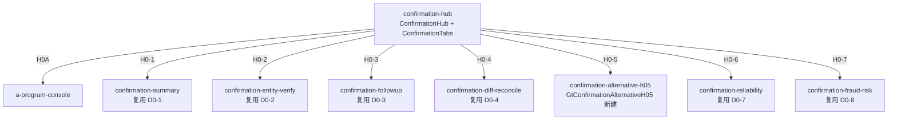

# Design Document: H0 固定资产循环函证模块

## Overview

H0 固定资产循环函证对齐 **D0 实际架构**：复用 D0 共享函证组件 + 新建 **H0-5 替代程序** 一个循环特有组件。

D0 已验证：confirmation-hub 统一入口 + 9 类跨循环 componentType。E0/F0/G0/H0/K0/L0 通过 `wp_code_overrides` 映射复用，不为每循环重复开发 summary/verify 等（铁律）。

**H0 唯一新建**：`confirmation-alternative-h05` — 固定资产/在建工程/抵押担保替代程序（4 区块）。

**实现参照链**：D0-5（原创） → F0-5/G0-6（薄壳 + 列配置替换） → **H0-5**（同 F0-5 模式）。

详见 [`h0_d0_alignment.md`](./h0_d0_alignment.md)。

## Architecture

### D0 共享函证架构（H0 直接复用）



### H0-5 对标 D0-5 组件分层

```
┌─────────────────────────────────────────────────────────┐
│ GtConfirmationAlternativeH05.vue  （薄壳 ~400 行）       │
│  参照 GtConfirmationAlternativeF05.vue                 │
├─────────────────────────────────────────────────────────┤
│ useAlternativeH05Data.ts    blockColumnConfigsH05.ts   │
│ alternativeH05Types.ts      useH0FormulaEngine.ts      │
│ useH0ImportExport.ts                                     │
├─────────────────────────────────────────────────────────┤
│ 复用 D0-5 壳组件（不修改 alternativeD05/ 源码）          │
│  AlternativeD05Dashboard / AlternativeD05Master          │
│  CheckBlock.vue（按 blockType 读 H05 列配置）             │
│  alternativeD05Types.ts（AlternativeCompany / CheckRow） │
└─────────────────────────────────────────────────────────┘
```

### 文件结构（仅新建部分）

```
audit-platform/frontend/src/components/workpaper/confirmation/
├── alternativeH05/
│   ├── GtConfirmationAlternativeH05.vue
│   ├── blockColumnConfigsH05.ts
│   ├── alternativeH05Types.ts
│   └── composables/
│       ├── useAlternativeH05Data.ts
│       ├── useH0FormulaEngine.ts
│       └── useH0ImportExport.ts
└── ... (D0 已有 shared / alternativeD05 不动)

backend/app/routers/wp_render_strategies/
├── _h0_confirmation.py
├── _h0_confirmation_import_export.py
└── _h0_confirmation_ai.py
```

### H0-5 四区块设计

| 区块 | key | 标题 | 记账凭证列 | 检查证据列（摘要） |
|------|-----|------|-----------|-------------------|
| ① | acceptance_ownership | 期后验收/权属证据检查 | 日期/凭证编号/业务内容/对方科目/金额 | 验收单/权属证书/索引号/是否异常 |
| ② | balance_evidence | 期末余额支持性证据 | 同上 | 采购合同/发票/付款凭证/索引号/是否异常 |
| ③ | new_asset_check | 本期新增资产检查 | 同上 | 请购审批/到货验收/转固原值/索引号/是否异常 |
| ④ | mortgage_lease | 抵押担保/融资租赁证据 | 同上 | 抵押合同/融资租赁/他项权证/索引号/是否异常 |

## Components and Interfaces

### Props（与 D0-5 / F0-5 一致）

```typescript
interface Props {
  htmlData: Record<string, any> | null
  sheetName: string
  wpId: string
  projectId: string
  readonly?: boolean
}

interface AlternativeH05Payload {
  _format: 'alternative-h05-v1'
  companies: AlternativeCompany[]  // 复用 alternativeD05Types
}
```

### 余额汇总区

```typescript
interface AlternativeH05Summary {
  investmentType: string       // 函证项目(固定资产/在建工程)
  openingBalance: number
  debitAmount: number
  creditAmount: number
  closingBalance: number
  currentAddition: number      // 本期新增金额
  ownershipCheckRatio: number  // calcCheckRatio
  postAcceptanceRatio: number
}
```

### 公式引擎

```typescript
function calcBlockTotal(amounts: number[]): number
function calcCheckRatio(checked: number, balance: number): number
function calcRowVariance(book: number, evidence: number): number
function isAbnormal(variance: number): boolean
```

### 后端接口

```python
POST /api/workpapers/{wp_id}/h0/export-template?sheet=H0-5
POST /api/workpapers/{wp_id}/h0/export-data?sheet=H0-5
POST /api/workpapers/{wp_id}/h0/import-data?sheet=H0-5
POST /api/workpapers/{wp_id}/h0/ai/{section}
```

## Data Models

持久化与 D0-5 一致：

- item_id 前缀：`H0-5-alt-{entity_id}-block{N}-rows`
- 存储：`checklist_responses.remark`（JSON）
- 余额汇总 / 抽样参数 / 审计说明结论：独立 item_id

## Data Flow

```mermaid
graph LR
    H01[H0-1 函证汇总] -->|未回函列表| H05[H0-5 替代程序]
    H05 -->|ref_index| H1[H1 固定资产]
    H05 -->|ref_index| L1L3[L1/L3 借款抵质押]
    OCR[/d4/contract-ocr] --> H05
    H05 -->|autoSnapshot| VT[useVersionTrail]
    H05 -->|confirmation:completed| H1H2[H1/H2 明细]
```

## Error Handling

1. 公司列表加载失败 → 错误提示 + 重试
2. parseNum NaN → 0（合计安全）
3. 期末余额=0 → 检查比例返回 0
4. 导入列头不匹配 → 详细错误列表，不写脏数据
5. OCR 无结果 → toast 提示，保留原行
6. H0-1 无未回函 → 显示「暂无待替代程序公司」
7. bundle 内嵌 htmlData=null → selfLoad render-config

## Testing Strategy

| 类型 | 范围 | 框架 |
|------|------|------|
| Contract | overrides 9 条 + VALID_COMPONENT_TYPES + registry | vitest + pytest |
| PBT | useH0FormulaEngine P1~P4 | vitest + fast-check |
| Unit | useAlternativeH05Data CRUD + importFromSummary 幂等 | vitest |
| Integration | hub 路由 H0-5 + 导入导出 round-trip | vitest mock |
| E2E | confirmation-hub H0 Tab 冒烟 + H0-5 增删行 | Playwright |

## Correctness Properties

见 requirements.md P1~P4。
