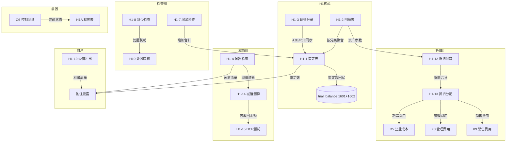

# Design Document: H1 固定资产底稿专属HTML精美组件

## Overview

H1固定资产底稿专属组件`h1-fixed-assets`。H循环最大单底稿（1个xlsx源模板/26有效sheet/~280+公式）。科目1601固定资产（借方/资产类）+ 1602累计折旧（贷方/资产备抵类）。

核心架构：
- componentType `h1-fixed-assets`，主入口 GtH1FixedAssets.vue
- **无内部el-tabs**：外层GtWpRenderer已有sheet目录行(chips)，专属组件接收`sheetName` prop用`v-if`分发到子组件
- 每个sheet独立子组件(200-500行) + 独立composable
- composable分层：useH1FormData + useH1FormulaEngine(纯函数) + useH1CrossSheet + useH1DepreciationEngine(纯函数) + useH1DualMode + useH1ImportExport + sheet-specific composables
- 跨sheet数据流通过 allResponses Map computed 响应式链（不走API）
- EventBus联动：TB回写 + 折旧分摊(D5/K8/K9) + 处置联动(H10) + C6前置 + 附注
- 双模式（HTML ↔ OnlyOffice）+ 导入导出三级 + AI审计说明(8 section)

## Architecture

### sheetName分发模式（非嵌套Tab）

GtH1FixedAssets.vue 接收 `sheetName` prop（完整中文名如"审定表H1-1"），用正则提取末尾编码(H1-1)，`v-if` 分发到对应子组件。未迁移的sheet走 OnlyOffice fallback（GtOnlyOfficeSheet全高）。

```
sheetName → regex提取编码 → v-if匹配 → 子组件渲染
                                     ↘ 未匹配 → OnlyOffice fallback
```

### H1-12 分支选择器

```
el-segmented v-model="depreciationBranch"
  ├── "不含减值-直线法" → H1TabDepreciationStraight.vue
  ├── "含减值"         → H1TabDepreciationImpair.vue
  └── "多次减值"       → H1TabDepreciationMulti.vue
```

### 文件结构

```
audit-platform/frontend/src/components/workpaper/
├── GtH1FixedAssets.vue                   # 主入口 sheetName v-if分发（defineAsyncComponent lazy）
├── h1/
│   ├── core/
│   │   ├── H1TabIndex.vue                # 底稿目录（进度条+26行）
│   │   ├── H1TabAdjudication.vue         # H1-1 审定表（双区块原值/折旧+三角勾稽）
│   │   ├── H1TabDetail.vue               # H1-2 明细表（4区段Tab切换54列）
│   │   ├── H1TabAdjustment.vue           # H1-3 调整分录（13列+借贷平衡）
│   │   ├── H1TabAnalysis.vue             # H1-6 分析表（结构+变动8公式）
│   │   ├── H1TabDisclosureListed.vue     # 附注上市公司
│   │   └── H1TabDisclosureSoe.vue        # 附注国企
│   ├── inspection/
│   │   ├── H1TabIdleCheck.vue            # H1-4 闲置检查表
│   │   ├── H1TabPolicyCheck.vue          # H1-5 会计政策（CAS4段落型）
│   │   ├── H1TabAdditionCheck.vue        # H1-7 增加检查（OCR+抽凭）
│   │   ├── H1TabDisposalCheck.vue        # H1-8 减少检查（处置联动H10）
│   │   ├── H1TabTitleBuilding.vue        # H1-16 房屋建筑物权属
│   │   ├── H1TabTitleVehicle.vue         # H1-17 运输设备权属
│   │   ├── H1TabRelatedParty.vue         # H1-18 关联交易
│   │   ├── H1TabOperatingLease.vue       # H1-19 经营租出（23公式）
│   │   └── H1TabFinanceLease.vue         # H1-20 融资租出
│   ├── stocktake/
│   │   ├── H1TabStocktakePlan.vue        # H1-9 监盘计划
│   │   ├── H1TabStocktakeCheck.vue       # H1-10 盘点检查表
│   │   └── H1TabStocktakeSummary.vue     # H1-11 监盘小结
│   ├── depreciation/
│   │   ├── H1TabDepreciationStraight.vue # H1-12(A) 不含减值-直线法（62公式）
│   │   ├── H1TabDepreciationImpair.vue   # H1-12(B) 含减值（86公式）
│   │   ├── H1TabDepreciationMulti.vue    # H1-12(C) 多次减值（94公式）
│   │   └── H1TabDepreciationAlloc.vue    # H1-13 折旧分配（11公式）
│   └── impairment/
│       ├── H1TabImpairment.vue           # H1-14 减值测算（15公式）
│       └── H1TabRecoverable.vue          # H1-15 可收回金额（12公式DCF）
├── composables/
│   ├── useH1FormData.ts                  # 数据加载/保存/selfLoad/writebackTB（~200行）
│   ├── useH1FormulaEngine.ts             # 纯函数公式引擎（资产类公式+三角勾稽，~250行）
│   ├── useH1DepreciationEngine.ts        # 纯函数折旧引擎（4方法+减值影响，~300行）
│   ├── useH1CrossSheet.ts               # 跨sheet联动computed（~350行）
│   ├── useH1Adjudication.ts             # H1-1 审定表composable
│   ├── useH1Detail.ts                   # H1-2 明细表composable（4区段）
│   ├── useH1Adjustment.ts              # H1-3 调整分录composable
│   ├── useH1IdleCheck.ts               # H1-4 闲置检查
│   ├── useH1PolicyCheck.ts             # H1-5 政策检查
│   ├── useH1Analysis.ts                # H1-6 分析程序
│   ├── useH1AdditionCheck.ts           # H1-7 增加检查（+OCR+抽凭）
│   ├── useH1DisposalCheck.ts           # H1-8 减少检查
│   ├── useH1Stocktake.ts              # H1-9~11 监盘组
│   ├── useH1Depreciation.ts           # H1-12 折旧测算（3分支共用状态）
│   ├── useH1DepreciationAlloc.ts      # H1-13 折旧分配
│   ├── useH1Impairment.ts             # H1-14~15 减值组
│   ├── useH1TitleCheck.ts             # H1-16~17 权属检查
│   ├── useH1LeaseCheck.ts             # H1-18~20 关联/租赁
│   ├── useH1Disclosure.ts             # 附注（variant双版本共用）
│   ├── useH1ImportExport.ts           # 导入导出（axios+三端点复用）
│   └── useH1DualMode.ts               # 双模式OO健康检查

backend/app/routers/wp_render_strategies/
├── _h1_fixed_assets.py                   # render策略+注册RENDERER_DISPATCH
├── _h1_import_export.py                  # 导入导出3端点
├── _h1_ai_generate.py                    # AI生成8 section
└── _h1_depreciation_engine.py            # 折旧引擎端点（4方法计算+批量验证）

backend/app/services/auto_data_resolvers/
└── _h1_fixed_assets.py                   # resolver: h1_tb_unadjusted / h1_depreciation_monthly
```

### Composable接口设计

```typescript
// useH1FormulaEngine.ts — 纯函数，无副作用
export function calcAuditedAmount(unadj: number, aje: number, rje: number): number
export function calcAssetEndBalance(begin: number, debit: number, credit: number): number  // 资产类:期末=期初+借方-贷方
export function calcContraEndBalance(begin: number, debit: number, credit: number): number // 备抵类:期末=期初+贷方-借方
export function calcTriangleReconciliation(begin: number, increase: number, decrease: number, end: number): number // 返回差额,0=平衡
export function calcNetValue(originalCost: number, accDepreciation: number, impairment: number): number
export function calcChangeRate(current: number, prior: number): number | null
export function calcSubtotal(arr: number[]): number
export function calcProportion(item: number, total: number): number | null
export function calcNewRate(netValue: number, originalCost: number): number | null  // 成新率
export function calcPriceDiffRate(transactionPrice: number, fairValue: number): number | null

// useH1DepreciationEngine.ts — 纯函数折旧引擎
export function calcStraightLine(cost: number, salvageRate: number, usefulLifeYears: number): number  // 月折旧
export function calcDoubleDeclining(netValue: number, usefulLifeYears: number, elapsedMonths: number, totalMonths: number): number
export function calcSumOfYears(cost: number, salvageRate: number, usefulLifeYears: number, remainingYears: number): number
export function calcUnitsOfProduction(cost: number, salvageRate: number, totalUnits: number, currentUnits: number): number
export function calcDepreciationWithImpairment(cost: number, salvageRate: number, usefulLifeYears: number, impairment: number, elapsedMonths: number): number
export function calcDcfPresentValue(cashFlows: number[], discountRate: number): number
export function calcTerminalValue(perpetuityCF: number, discountRate: number, growthRate: number): number
export function isMonotonicallyIncreasing(monthlyAccumulated: number[], disposalMonths: number[]): boolean

// useH1CrossSheet.ts — 响应式联动
export function useH1CrossSheet(allResponses: Ref<Map<string, any>>): {
  detailTotals: ComputedRef<{originalCost: number, accDep: number, impairment: number}>
  adjudicationFromDetail: ComputedRef<{costAudited: number, depAudited: number}>
  depreciationForAlloc: ComputedRef<{byCategory: Record<string, number>, total: number}>
  idleAssetsForImpairment: ComputedRef<Array<{name: string, netValue: number}>>
  disclosureAutoFill: ComputedRef<Record<string, number>>
}
```

## 跨Sheet数据流图



## Architecture Decision Records (ADR)

### ADR-1: 折旧引擎独立composable

**决策**：将折旧计算（4种方法）从通用FormulaEngine中拆出，独立为`useH1DepreciationEngine.ts`纯函数模块。

**理由**：
- 折旧引擎公式复杂度高（62+86+94=242公式），与通用公式（审定/变动率/合计）职责不同
- 4种折旧方法有不同参数签名，独立模块便于单元测试和PBT
- 后端也需要折旧验证端点，前后端共用同一套公式逻辑（前端纯函数 + 后端Python对等实现）
- 双倍余额递减"最后两年转直线"分支逻辑复杂，需独立测试覆盖

**替代方案**：合并到useH1FormulaEngine → 拒绝，文件会超600行且职责不清。

### ADR-2: H1-12分支选择器（非el-tabs）

**决策**：使用el-segmented在3个折旧版本间切换，而非el-tabs或3个独立sheetName。

**理由**：
- 源xlsx中H1-12三版本是同一sheet编码的3个变体，共用同一个sheetName("折旧测算表H1-12")
- 用户不需要同时看到3个版本，通常只选其一使用
- el-segmented比el-tabs更紧凑，适合"选择哪个分支"语义（非并列内容）
- 3个分支共用H1-12的数据加载/保存逻辑（depreciationBranch字段区分）

**替代方案**：3个独立sheetName各自分发 → 拒绝，violates 源模板"同编码多版本"的设计意图。

### ADR-3: 宽表拆分策略（区段Tab）

**决策**：H1-2明细表54列使用"区段Tab"方案拆分为4个Tab（基础/原值变动/折旧/减值），行同步。

**理由**：
- 54列在1920px屏幕上即使横滚也无法高效操作
- 4个区段对应4个逻辑域：资产基础参数 / 原值增减 / 折旧计提 / 减值准备
- 区段Tab切换保持行同步（选中行高亮跨Tab一致），用户可快速切换查看同一资产的不同维度
- 固定前2列（分类/名称）确保在任何区段都能辨识当前行

**替代方案**：
- 纯横滚+固定列 → 拒绝，54列横滚体验极差
- 折叠列组 → 拒绝，交互复杂且不直观

### ADR-4: 三角勾稽校验策略

**决策**：三角勾稽（期末=期初+增加-减少）在前端实时校验，校验层分3级：原值/累计折旧/减值准备。

**理由**：
- 三角勾稽是资产类底稿核心不变量，违反即表示数据错误
- 分3级独立校验：原值层(1601借方)、折旧层(1602贷方/备抵)、减值层
- 备抵类方向相反：期末=期初+贷方发生-借方发生（折旧增加在贷方）
- 校验结果实时显示在H1-1审定表底部，差异≠0时红色高亮

**实现**：
```typescript
// 原值层（借方科目1601）
calcTriangleReconciliation(costBegin, costIncrease, costDecrease, costEnd)
// = costEnd - (costBegin + costIncrease - costDecrease)  → 应=0

// 折旧层（贷方备抵科目1602，方向相反）
calcTriangleReconciliation(depBegin, depProvision, depReversal, depEnd)
// = depEnd - (depBegin + depProvision - depReversal)  → 应=0
```

## Correctness Properties

以下纯函数property通过PBT验证（fast-check / hypothesis）：

### P1: 资产类审定数公式链正确性
- **Feature**: h1-fixed-assets
- **Property**: 对任意 unadj ∈ ℝ, aje ∈ ℝ, rje ∈ ℝ → calcAuditedAmount(unadj, aje, rje) === unadj + aje + rje
- **生成器**: fc.float({min:-1e9, max:1e9}) × 3

### P2: 资产类期末余额公式（借方科目）
- **Feature**: h1-fixed-assets
- **Property**: 对任意 begin, debit, credit ∈ ℝ≥0 → calcAssetEndBalance(begin, debit, credit) === begin + debit - credit
- **生成器**: fc.float({min:0, max:1e9}) × 3

### P3: 备抵类期末余额公式（贷方科目）
- **Feature**: h1-fixed-assets
- **Property**: 对任意 begin, debit, credit ∈ ℝ≥0 → calcContraEndBalance(begin, debit, credit) === begin + credit - debit
- **生成器**: fc.float({min:0, max:1e9}) × 3

### P4: 三角勾稽恒等式
- **Feature**: h1-fixed-assets
- **Property**: 对任意 begin, increase, decrease ∈ ℝ≥0，令 end=begin+increase-decrease → calcTriangleReconciliation(begin, increase, decrease, end) === 0
- **生成器**: fc.float({min:0, max:1e9}) × 3, end由公式计算

### P5: 合计行恒等于明细行之和
- **Feature**: h1-fixed-assets
- **Property**: 对任意 arr: number[] (len≥1) → calcSubtotal(arr) === arr.reduce((a,b)=>a+b, 0)
- **生成器**: fc.array(fc.float({min:-1e9, max:1e9}), {minLength:1, maxLength:50})

### P6: 直线法折旧公式正确性
- **Feature**: h1-fixed-assets
- **Property**: 对任意 cost>0, salvageRate∈[0,1), usefulLife>0 → calcStraightLine(cost, salvageRate, usefulLife) === cost×(1-salvageRate)/usefulLife/12
- **生成器**: fc.float({min:1, max:1e8}), fc.float({min:0, max:0.99}), fc.integer({min:1, max:50})

### P7: 双倍余额递减法折旧（最后两年转直线）
- **Feature**: h1-fixed-assets
- **Property**: 对任意参数，最后24个月折旧 === (netValue-salvage)/24（直线法接力）；前期月折旧 === netValue×2/usefulLife/12
- **生成器**: fc.float({min:1e4, max:1e8}), fc.float({min:0, max:0.1}), fc.integer({min:3, max:30}), fc.integer({min:0})

### P8: 年数总和法折旧逐年递减
- **Feature**: h1-fixed-assets
- **Property**: 对任意参数，第n年折旧 > 第n+1年折旧（严格递减）
- **生成器**: fc.float({min:1e4, max:1e8}), fc.float({min:0, max:0.1}), fc.integer({min:2, max:30})

### P9: 折旧累计单调递增校验
- **Feature**: h1-fixed-assets
- **Property**: 对任意正月折旧额序列（无处置月），累计折旧数组严格单调递增
- **生成器**: fc.array(fc.float({min:0.01, max:1e6}), {minLength:2, maxLength:12})

### P10: DCF现值计算正确性
- **Feature**: h1-fixed-assets
- **Property**: 对任意 cashFlows[]>0, discountRate>0 → calcDcfPresentValue(cfs, r) === Σ(cf_i/(1+r)^i)
- **生成器**: fc.array(fc.float({min:1, max:1e6}), {minLength:1, maxLength:10}), fc.float({min:0.01, max:0.3})

### P11: 可收回金额=MAX(公允-处置费, DCF现值)
- **Feature**: h1-fixed-assets
- **Property**: 对任意 fairValue, disposalCost, dcfValue ≥ 0 → recoverableAmount === Math.max(fairValue-disposalCost, dcfValue)
- **生成器**: fc.float({min:0, max:1e8}) × 3

### P12: 减值金额非负且不超过账面价值
- **Feature**: h1-fixed-assets
- **Property**: 对任意 bookValue≥0, recoverableAmount≥0 → impairment = Math.max(bookValue-recoverableAmount, 0) ∈ [0, bookValue]
- **生成器**: fc.float({min:0, max:1e8}) × 2

### P13: 折旧分配合计=折旧总额
- **Feature**: h1-fixed-assets
- **Property**: 对任意分配比例数组(sum=100%) + 折旧总额 → 各部门分配额之和 === 折旧总额（精度1分）
- **生成器**: 自定义分配比例生成器(归一化) + fc.float({min:1, max:1e8})

### P14: 借贷平衡检查
- **Feature**: h1-fixed-assets
- **Property**: 对任意调整分录数组 → isBalanced === (SUM(debit) === SUM(credit))
- **生成器**: fc.array(fc.record({debit: fc.float({min:0}), credit: fc.float({min:0})}), {minLength:1, maxLength:20})

### P15: 处置损益公式正确性
- **Feature**: h1-fixed-assets
- **Property**: 对任意 income, netValue, disposalCost ≥ 0 → disposalGainLoss === income - netValue - disposalCost
- **生成器**: fc.float({min:0, max:1e8}) × 3

### P16: 经营租出收益率公式
- **Feature**: h1-fixed-assets
- **Property**: 对任意 netIncome, originalCost>0 → returnRate === netIncome/originalCost×100
- **生成器**: fc.float({min:-1e6, max:1e6}), fc.float({min:1, max:1e8})

### P17: 权属差异=账面-证载
- **Feature**: h1-fixed-assets
- **Property**: 对任意 bookValue, certValue → titleDiff === bookValue - certValue
- **生成器**: fc.float({min:0, max:1e9}) × 2

## EventBus事件清单

| 事件名 | 发布者 | 消费者 |
|--------|--------|--------|
| `substantive:adjudicated` | H1-1 | TB回写, 附注 |
| `adjustment:created` | H1-3 | H1-1, A13 |
| `h1:depreciation-calculated` | H1-12 | H1-13 |
| `h1:depreciation-allocated` | H1-13 | D5, K8, K9 |
| `h1:disposal-completed` | H1-8 | H10 |
| `control:c6-completed` | C6 | H1A |
| `disclosure:note-text-updated` | 附注 | 附注模块 |
| `analytical:significant-change` | H1-6 | A1-13 |

## 后端AI Section清单

```
adj-note / adj-conclusion / policy-evaluation / analysis-change /
depreciation-summary / impairment-conclusion / stocktake-summary / disposal-note
```

## 错误处理

| 场景 | 处理方式 |
|------|----------|
| render-config 加载失败 | 显示el-empty+重试按钮，不渲染子组件 |
| selfLoad 404 | 静默处理（_silent:true），显示空状态引导创建 |
| 保存失败 | 乐观更新+el-message.error+本地数据不丢失+自动重试1次 |
| OnlyOffice 健康检查失败 | 禁用切换按钮+tooltip提示"OnlyOffice服务不可用" |
| 导入xlsx解析失败 | el-message.error显示行号+列号+错误原因 |
| TB取数科目不存在 | 未审数显示0+黄色提示"科目1601/1602未在TB中找到" |
| 三角勾稽校验失败 | 红色高亮差异行+el-alert显示"三角勾稽不平衡：差额xxx元" |
| 折旧引擎参数非法(年限≤0) | 返回0+控制台warn+tooltip提示"参数异常" |
| 跨sheet取数源sheet未加载 | 显示"-"占位+tooltip提示"待加载H1-X数据" |
| EventBus发布失败 | 静默重试1次，不阻塞用户操作 |
