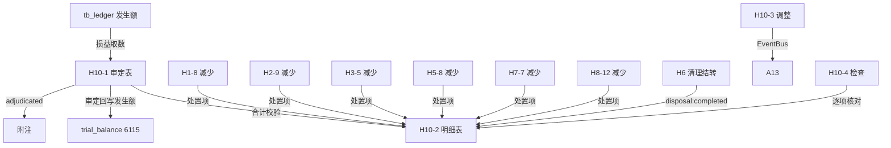

# Design Document: H10 资产处置损益底稿专属HTML精美组件

## Overview

H10资产处置损益底稿专属组件`h10-asset-disposal-income`。H循环唯一损益类底稿（1个xlsx/8 sheet/~100+公式）。科目6115资产处置损益（**损益类/贷方科目**）。

核心架构：
- componentType `h10-asset-disposal-income`，主入口 GtH10AssetDisposalIncome.vue
- **损益类科目！**取发生额非余额（与H1~H9资产/负债类根本不同）
- **联动H1~H8所有减少检查**：汇总各底稿处置项
- **联动H6固定资产清理**：H6结转→H10确认
- composable分层：useH10FormData + useH10FormulaEngine + useH10DisposalCalcEngine(纯函数) + useH10CrossSheet + useH10DualMode + useH10ImportExport
- EventBus联动：TB回写(6115发生额) + H6 subscribe + H1~H8 subscribe + 附注

## Architecture

### sheetName分发模式

```
sheetName → regex提取编码 → v-if匹配 → 子组件渲染
                                     ↘ 未匹配 → OnlyOffice fallback
```

### 损益类取数逻辑

```
资产类(H1~H8): TB取期末余额 → audited_amount = 期末余额
损益类(H10):   TB取发生额   → audited_amount = 贷方发生 - 借方发生 (6115贷方=收益)
               来源: tb_ledger 发生额汇总，而非 tb_balance 期末余额
```

### 文件结构

```
audit-platform/frontend/src/components/workpaper/
├── GtH10AssetDisposalIncome.vue             # 主入口 sheetName v-if分发
├── h10/
│   ├── core/
│   │   ├── H10TabIndex.vue                  # 底稿目录（8行+来源追溯链状态）
│   │   ├── H10TabAdjudication.vue           # H10-1 审定表（69公式！密度最高）
│   │   ├── H10TabDetail.vue                 # H10-2 明细表（36列3区段26公式）
│   │   ├── H10TabAdjustment.vue             # H10-3 调整分录
│   │   ├── H10TabDisclosureListed.vue       # 附注上市
│   │   └── H10TabDisclosureSoe.vue          # 附注国企
│   └── inspection/
│       └── H10TabCheck.vue                  # H10-4 检查表（80行20列）
├── composables/
│   ├── useH10FormData.ts                    # 数据加载/selfLoad/writebackTB（发生额！）
│   ├── useH10FormulaEngine.ts               # 纯函数公式引擎（损益类！）
│   ├── useH10DisposalCalcEngine.ts          # 纯函数处置损益引擎
│   ├── useH10CrossSheet.ts                  # 跨sheet + H1~H8/H6跨底稿联动
│   ├── useH10DualMode.ts
│   ├── useH10ImportExport.ts
│   ├── useH10Adjudication.ts
│   ├── useH10Detail.ts
│   ├── useH10Adjustment.ts
│   └── useH10Check.ts
```

### 后端文件结构

```
audit-platform/backend/
├── app/workpaper_engine/renderers/
│   └── h10_asset_disposal_income_renderer.py
├── app/routers/
│   └── h10_asset_disposal_income.py         # 3端点
├── app/services/
│   └── h10_asset_disposal_income_service.py  # 损益取数+处置验证
└── data/wp_render_schema/
    └── h10-asset-disposal-income.yaml
```

## Composable接口设计

### useH10FormulaEngine.ts（损益类！）

```typescript
// 审定数
export function calcAuditedAmount(unadj: number, aje: number, rje: number): number
// 损益类净发生额：贷方发生-借方发生（6115贷方科目：贷=收益，借=损失）
export function calcIncomeStatementNet(creditOccurrence: number, debitOccurrence: number): number
// 合计
export function calcSubtotal(arr: number[]): number
// 注意：损益类没有"期末余额"概念，只有发生额！
```

### useH10DisposalCalcEngine.ts（纯函数）

```typescript
// 处置净损益=处置收入-净值-处置费用-税费
export function calcDisposalGainLoss(income: number, netValue: number, expenses: number, tax: number): number
// 净账面值=原值-累计折旧
export function calcNetBookValue(cost: number, accDep: number): number
// 处置损益率
export function calcGainLossRate(gainLoss: number, cost: number): number
```

### useH10CrossSheet.ts

```typescript
export function useH10CrossSheet(allResponses: Ref<Map<string, any>>) {
  // H10-1审定合计 vs H10-2明细合计
  const adjudicationVsDetail: ComputedRef<{ diff: number; isMatch: boolean }>
  // H10固定资产部分 vs H6清理净损益
  const h10VsH6: ComputedRef<{ diff: number; isMatch: boolean }>
  // H10按类型汇总 vs 各源底稿减少合计
  const h10VsSourceWps: ComputedRef<{ type: string; diff: number; isMatch: boolean }[]>
}
```

## 数据流图



## ADR

### ADR-1: H10是损益类，不是资产/负债类

H10资产处置损益（科目6115）是损益类科目，与H1~H9的资产/负债类根本不同：
- 不取期末余额，取**发生额**（本期损益=贷方发生-借方发生）
- 期末余额在结转后为0（损益类期末结转本年利润）
- TB取数路径不同：从tb_ledger汇总发生额，非tb_balance读期末

### ADR-2: 审定表69公式密度极高

H10-1审定表仅20行11列但包含69公式，公式密度是H循环最高的。原因：每个资产类型行都有多维度汇总（处置收入/成本/费用/净损益各列都有公式）。建议保留OO为主渲染，HTML提供简化摘要视图。

### ADR-3: 汇总联动H1~H8所有减少检查

H10是H循环处置损益的汇总底稿，需要接收来自H1-8、H2-9、H3-5、H5-8、H7-7、H8-12六个减少检查表的处置数据。通过EventBus subscribe各底稿的处置事件实现自动汇集。

## Correctness Properties

| ID | Property | 验证方法 |
|----|----------|---------|
| P1 | ∀ u,a,r: calcAuditedAmount = u+a+r | PBT |
| P2 | ∀ cr,dr: calcIncomeStatementNet = cr-dr（损益类！） | PBT |
| P3 | ∀ inc,nv,exp,tax: calcDisposalGainLoss = inc-nv-exp-tax | PBT |
| P4 | ∀ cost,dep: calcNetBookValue = cost-dep | PBT |
| P5 | ∀ arr: calcSubtotal = Σarr | PBT |
| P6 | ∀ gl,cost(≠0): calcGainLossRate = gl/cost×100 | PBT |

## 错误处理

| 场景 | 处理方式 |
|------|---------|
| selfLoad失败 | el-empty+重试 |
| TB无科目6115 | 提示导入试算表 |
| 损益取数返回期末余额 | 自动切换到发生额取数+黄色警告 |
| H6数据未创建 | 黄色警告"H6未编制" |
| 各源底稿未编制 | 黄色提示缺少来源 |
| OO健康检查失败 | 降级HTML |
