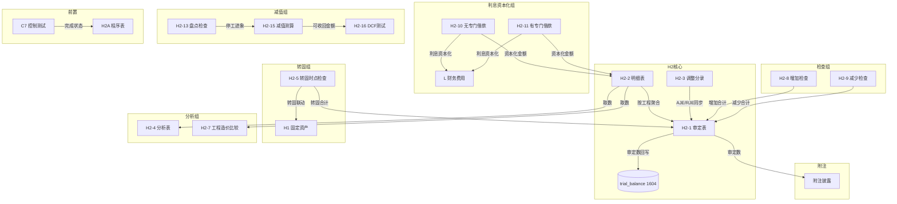

# Design Document: H2 在建工程底稿专属HTML精美组件

## Overview

H2在建工程底稿专属组件`h2-construction-in-progress`。H循环第二大底稿（1个xlsx源模板/21有效sheet/~130+公式）。科目1604在建工程（借方/资产类）。

核心架构：
- componentType `h2-construction-in-progress`，主入口 GtH2ConstructionInProgress.vue
- **无内部el-tabs**：外层GtWpRenderer已有sheet目录行(chips)，专属组件接收`sheetName` prop用`v-if`分发到子组件
- 每个sheet独立子组件(200-500行) + 独立composable
- composable分层：useH2FormData + useH2FormulaEngine(纯函数) + useH2InterestCapEngine(纯函数) + useH2CrossSheet + useH2DualMode + useH2ImportExport + sheet-specific composables
- 跨sheet数据流通过 allResponses Map computed 响应式链（不走API）
- EventBus联动：TB回写 + 转固→H1 + 利息资本化→L(财务费用) + C7前置
- 双模式（HTML ↔ OnlyOffice）+ 导入导出三级 + AI审计说明(6 section)
- **H2特殊**：利息资本化2分支(el-segmented切换) + 转固联动H1(核心) + 工程造价比较

## Architecture

### sheetName分发模式（非嵌套Tab）

GtH2ConstructionInProgress.vue 接收 `sheetName` prop（完整中文名如"审定表H2-1"），用正则提取末尾编码(H2-1)，`v-if` 分发到对应子组件。未迁移的sheet走 OnlyOffice fallback（GtOnlyOfficeSheet全高）。

```
sheetName → regex提取编码 → v-if匹配 → 子组件渲染
                                     ↘ 未匹配 → OnlyOffice fallback
```

### H2-10/H2-11 利息资本化分支选择器

```
el-segmented v-model="interestCapBranch"
  ├── "无专门借款" → H2TabInterestCapNoBorrow.vue (H2-10)
  └── "有专门借款" → H2TabInterestCapWithBorrow.vue (H2-11)
```

### 文件结构

```
audit-platform/frontend/src/components/workpaper/
├── GtH2ConstructionInProgress.vue          # 主入口 sheetName v-if分发（defineAsyncComponent lazy）
├── h2/
│   ├── core/
│   │   ├── H2TabIndex.vue                  # 底稿目录（进度条+21行）
│   │   ├── H2TabAdjudication.vue           # H2-1 审定表（三角勾稽含转固扣减+61公式）
│   │   ├── H2TabDetail.vue                 # H2-2 明细表（3区段Tab切换50列）
│   │   ├── H2TabAdjustment.vue             # H2-3 调整分录（10列+借贷平衡）
│   │   ├── H2TabAnalysis.vue               # H2-4 分析表（10公式+完工率+资本化率）
│   │   ├── H2TabDisclosureListed.vue       # 附注上市公司
│   │   └── H2TabDisclosureSoe.vue          # 附注国企
│   ├── inspection/
│   │   ├── H2TabTransferCheck.vue          # H2-5 转固时点检查（核心联动H1）
│   │   ├── H2TabReviewRecord.vue           # H2-6 在建工程审核记录（签章式）
│   │   ├── H2TabCostComparison.vue         # H2-7 工程造价比较（14公式）
│   │   ├── H2TabAdditionCheck.vue          # H2-8 增加检查（OCR+抽凭）
│   │   ├── H2TabDecreaseCheck.vue          # H2-9 减少检查
│   │   └── H2TabRelatedParty.vue           # H2-17 关联交易
│   ├── interest/
│   │   ├── H2TabInterestCapNoBorrow.vue    # H2-10 利息资本化（无专门借款，12公式）
│   │   └── H2TabInterestCapWithBorrow.vue  # H2-11 利息资本化（有专门借款，15公式）
│   ├── stocktake/
│   │   ├── H2TabStocktakePlan.vue          # H2-12 监盘计划
│   │   ├── H2TabStocktakeCheck.vue         # H2-13 盘点检查表
│   │   └── H2TabStocktakeSummary.vue       # H2-14 监盘小结
│   └── impairment/
│       ├── H2TabImpairment.vue             # H2-15 减值测算（15公式）
│       └── H2TabRecoverable.vue            # H2-16 可收回金额（12公式DCF）
├── composables/
│   ├── useH2FormData.ts                    # 数据加载/保存/selfLoad/writebackTB（~200行）
│   ├── useH2FormulaEngine.ts               # 纯函数公式引擎（资产类公式+三角勾稽含转固，~200行）
│   ├── useH2InterestCapEngine.ts           # 纯函数利息资本化引擎（2分支，~250行）
│   ├── useH2CrossSheet.ts                  # 跨sheet联动computed（~300行）
│   ├── useH2Adjudication.ts               # H2-1 审定表composable
│   ├── useH2Detail.ts                     # H2-2 明细表composable（3区段）
│   ├── useH2Adjustment.ts                 # H2-3 调整分录composable
│   ├── useH2Analysis.ts                   # H2-4 分析表composable
│   ├── useH2TransferCheck.ts              # H2-5 转固时点检查composable
│   ├── useH2ReviewRecord.ts              # H2-6 审核记录composable
│   ├── useH2CostComparison.ts            # H2-7 工程造价比较composable
│   ├── useH2AdditionCheck.ts             # H2-8 增加检查composable
│   ├── useH2DecreaseCheck.ts             # H2-9 减少检查composable
│   ├── useH2InterestCap.ts              # H2-10/11 利息资本化共用状态
│   ├── useH2Stocktake.ts                # H2-12~14 监盘组composable
│   ├── useH2Impairment.ts               # H2-15/16 减值组composable
│   ├── useH2RelatedParty.ts             # H2-17 关联交易composable
│   ├── useH2Disclosure.ts               # 附注（variant双版本共用）
│   ├── useH2ImportExport.ts             # 导入导出（axios+三端点复用）
│   └── useH2DualMode.ts                 # 双模式OO健康检查

backend/app/routers/wp_render_strategies/
├── _h2_construction_in_progress.py        # render策略+注册RENDERER_DISPATCH
├── _h2_import_export.py                   # 导入导出3端点
├── _h2_ai_generate.py                     # AI生成6 section
└── _h2_interest_cap_engine.py             # 利息资本化引擎端点（2分支计算+验证）

backend/app/services/auto_data_resolvers/
└── _h2_construction_in_progress.py        # resolver: h2_tb_unadjusted / h2_transfer_summary
```

### Composable接口设计

```typescript
// useH2FormulaEngine.ts — 纯函数，无副作用
export function calcAuditedAmount(unadj: number, aje: number, rje: number): number
export function calcAssetEndBalance(begin: number, debit: number, credit: number): number  // 资产类:期末=期初+借方-贷方
export function calcCipEndBalance(begin: number, increase: number, decrease: number, transfer: number): number  // 在建:期末=期初+增加-减少-转固
export function calcTriangleWithTransfer(begin: number, increase: number, decrease: number, transfer: number, end: number): number // 返回差额,0=平衡
export function calcSubtotal(arr: number[]): number
export function calcCompletionRate(accumulated: number, budget: number): number | null  // 完工率
export function calcOverBudgetRate(actual: number, budget: number): number | null  // 超预算率
export function calcCostDiffRate(actual: number, budget: number): number | null  // 造价差异率
export function calcOverdueDays(actualDate: string, plannedDate: string): number  // 工期超期天数
export function calcTransferCondition(conditions: boolean[]): boolean  // CAS4五条件全满足
export function isBalanced(entries: {debit: number, credit: number}[]): boolean

// useH2InterestCapEngine.ts — 纯函数利息资本化引擎
export function calcWeightedCapRate(loans: {principal: number, rate: number, days: number}[]): number  // 加权资本化率
export function calcWeightedExpenditure(expenditures: {amount: number, days: number}[], totalDays: number): number  // 累计支出加权平均数
export function calcCapAmountNoBorrow(weightedExp: number, capRate: number): number  // 无专门借款资本化金额
export function calcSpecialLoanCap(interest: number, idleIncome: number): number  // 专门借款资本化=利息-闲置收益
export function calcGeneralLoanSupp(excessWeightedExp: number, generalCapRate: number): number  // 一般借款补充资本化
export function calcTotalCapWithBorrow(specialCap: number, generalSupp: number): number  // 有专门借款合计
export function calcDcfPresentValue(cashFlows: number[], discountRate: number): number
export function calcTerminalValue(perpetuityCF: number, discountRate: number, growthRate: number): number

// useH2CrossSheet.ts — 响应式联动
export function useH2CrossSheet(allResponses: Ref<Map<string, any>>): {
  detailTotals: ComputedRef<{cipEnd: number, increase: number, decrease: number, transfer: number}>
  adjudicationFromDetail: ComputedRef<{auditedTotal: number}>
  transferSummary: ComputedRef<{totalTransfer: number, items: Array<{name: string, amount: number}>}>
  interestCapForDetail: ComputedRef<{totalCap: number, byProject: Record<string, number>}>
  analysisFromDetail: ComputedRef<Record<string, number>>
  disclosureAutoFill: ComputedRef<Record<string, number>>
}
```

## 跨Sheet数据流图



## Architecture Decision Records (ADR)

### ADR-1: 利息资本化引擎独立composable

**决策**：将利息资本化计算（2分支）从通用FormulaEngine中拆出，独立为`useH2InterestCapEngine.ts`纯函数模块。

**理由**：
- 利息资本化公式复杂度高（12+15=27公式），与通用公式（审定/三角勾稽）职责不同
- 2个分支有不同参数签名和计算逻辑（无专门借款用加权资本化率，有专门借款要先扣闲置收益再补一般借款）
- 后端也需要利息资本化验证端点，前后端共用同一套公式逻辑
- CAS17借款费用准则对资本化条件/金额计算有严格要求，需独立测试覆盖

**替代方案**：合并到useH2FormulaEngine → 拒绝，文件会超400行且职责不清。

### ADR-2: H2-10/H2-11分支选择器（非el-tabs）

**决策**：使用el-segmented在2个利息资本化版本间切换。

**理由**：
- 无专门借款/有专门借款是互斥的两种场景，被审计单位通常只适用其一
- 用户不需要同时看到2个版本，el-segmented比el-tabs更紧凑
- 2个分支共用利息资本化的数据加载/保存逻辑（interestCapBranch字段区分）

**替代方案**：2个独立sheetName各自分发 → 拒绝，实际是同一功能域的两个模式。

### ADR-3: 宽表拆分策略（3区段Tab）

**决策**：H2-2明细表50列使用"区段Tab"方案拆分为3个Tab（基本/增减/竣工结转），行同步。

**理由**：
- 50列在1920px屏幕上横滚体验极差
- 3个区段对应3个逻辑域：工程基本参数 / 本期增减明细 / 竣工结转情况
- 固定前2列（工程名称/预算金额）确保在任何区段都能辨识当前行

**替代方案**：纯横滚+固定列 → 拒绝，50列横滚体验极差。

### ADR-4: 三角勾稽含转固扣减

**决策**：H2在建工程三角勾稽公式比H1多一个"转固"维度：期末=期初+增加-减少-转固。

**理由**：
- 在建工程核心流转：增加（投入）→ 减少（损失/报废）→ 转固（达到可使用状态转入H1）
- 转固是在建工程最重要的出口，必须独立跟踪（而非合并到"减少"）
- H2-1审定表有独立的"本期转固"列，H2-5专门检查转固时点
- 三角勾稽校验差额公式：diff = end - (begin + increase - decrease - transfer)

## Correctness Properties

以下纯函数property通过PBT验证（fast-check / hypothesis）：

### P1: 审定数公式链正确性
- **Feature**: h2-construction-in-progress
- **Property**: 对任意 unadj ∈ ℝ, aje ∈ ℝ, rje ∈ ℝ → calcAuditedAmount(unadj, aje, rje) === unadj + aje + rje
- **生成器**: fc.float({min:-1e9, max:1e9}) × 3

### P2: 资产类期末余额公式
- **Feature**: h2-construction-in-progress
- **Property**: 对任意 begin, debit, credit ∈ ℝ≥0 → calcAssetEndBalance(begin, debit, credit) === begin + debit - credit
- **生成器**: fc.float({min:0, max:1e9}) × 3

### P3: 在建工程三角勾稽（含转固扣减）
- **Feature**: h2-construction-in-progress
- **Property**: 对任意 begin, increase, decrease, transfer ∈ ℝ≥0，令 end=begin+increase-decrease-transfer → calcTriangleWithTransfer(begin, increase, decrease, transfer, end) === 0
- **生成器**: fc.float({min:0, max:1e9}) × 4, end由公式计算

### P4: 合计行恒等
- **Feature**: h2-construction-in-progress
- **Property**: 对任意 arr: number[] (len≥1) → calcSubtotal(arr) === arr.reduce((a,b)=>a+b, 0)
- **生成器**: fc.array(fc.float({min:-1e9, max:1e9}), {minLength:1, maxLength:50})

### P5: 完工率公式正确性
- **Feature**: h2-construction-in-progress
- **Property**: 对任意 accumulated>0, budget>0 → calcCompletionRate(accumulated, budget) === accumulated/budget×100
- **生成器**: fc.float({min:1, max:1e9}), fc.float({min:1, max:1e9})

### P6: 加权资本化率计算（无专门借款）
- **Feature**: h2-construction-in-progress
- **Property**: 对任意loans数组（principal>0, rate>0, days>0）→ calcWeightedCapRate(loans) === Σ(principal×rate×days/365) / Σ(principal×days/365)
- **生成器**: fc.array(fc.record({principal: fc.float({min:1e4, max:1e9}), rate: fc.float({min:0.01, max:0.2}), days: fc.integer({min:1, max:365})}), {minLength:1, maxLength:10})

### P7: 专门借款利息资本化公式
- **Feature**: h2-construction-in-progress
- **Property**: 对任意 interest>0, idleIncome≥0 → calcSpecialLoanCap(interest, idleIncome) === interest - idleIncome
- **生成器**: fc.float({min:1, max:1e8}), fc.float({min:0, max:1e6})

### P8: 工程造价差异率
- **Feature**: h2-construction-in-progress
- **Property**: 对任意 actual>0, budget>0 → calcCostDiffRate(actual, budget) === (actual-budget)/budget×100
- **生成器**: fc.float({min:1, max:1e9}), fc.float({min:1, max:1e9})

### P9: 转固条件判定（CAS4五条件全满足）
- **Feature**: h2-construction-in-progress
- **Property**: 对任意 conditions: boolean[5] → calcTransferCondition(conditions) === conditions.every(c => c === true)
- **生成器**: fc.array(fc.boolean(), {minLength:5, maxLength:5})

### P10: 借贷平衡检查
- **Feature**: h2-construction-in-progress
- **Property**: 对任意调整分录数组 → isBalanced === (SUM(debit) === SUM(credit))
- **生成器**: fc.array(fc.record({debit: fc.float({min:0}), credit: fc.float({min:0})}), {minLength:1, maxLength:20})

### P11: DCF现值
- **Feature**: h2-construction-in-progress
- **Property**: 对任意 cashFlows[]>0, discountRate>0 → calcDcfPresentValue(cfs, r) === Σ(cf_i/(1+r)^(i+1))
- **生成器**: fc.array(fc.float({min:1, max:1e6}), {minLength:1, maxLength:10}), fc.float({min:0.01, max:0.3})

### P12: 工期超期判定
- **Feature**: h2-construction-in-progress
- **Property**: 对任意 actualDate > plannedDate → calcOverdueDays(actual, planned) === daysDiff(actual, planned) 且结果>0
- **生成器**: fc.date() × 2（确保actual≥planned）

## EventBus事件清单

| 事件名 | 发布者 | 消费者 |
|--------|--------|--------|
| `substantive:adjudicated` | H2-1 | TB回写, 附注 |
| `adjustment:created` | H2-3 | H2-1, A13 |
| `h2:transfer-to-h1` | H2-5 | H1固定资产 |
| `h2:interest-capitalized` | H2-10/11 | L财务费用 |
| `control:c7-completed` | C7 | H2A |
| `disclosure:note-text-updated` | 附注 | 附注模块 |

## 后端AI Section清单

```
adj-note / adj-conclusion / analysis-progress / cost-comparison-note /
interest-cap-summary / impairment-conclusion
```

## 错误处理

| 场景 | 处理方式 |
|------|----------|
| render-config 加载失败 | 显示el-empty+重试按钮，不渲染子组件 |
| selfLoad 404 | 静默处理（_silent:true），显示空状态引导创建 |
| 保存失败 | 乐观更新+el-message.error+本地数据不丢失+自动重试1次 |
| OnlyOffice 健康检查失败 | 禁用切换按钮+tooltip提示"OnlyOffice服务不可用" |
| 导入xlsx解析失败 | el-message.error显示行号+列号+错误原因 |
| TB取数科目不存在 | 未审数显示0+黄色提示"科目1604未在TB中找到" |
| 三角勾稽校验失败 | 红色高亮差异行+el-alert显示"三角勾稽不平衡：差额xxx元" |
| 利息资本化参数非法(利率≤0) | 返回0+控制台warn+tooltip提示"参数异常" |
| 跨sheet取数源sheet未加载 | 显示"-"占位+tooltip提示"待加载H2-X数据" |
| H1联动取数失败 | GtIndexChip灰色+tooltip"H1底稿未打开" |
| EventBus发布失败 | 静默重试1次，不阻塞用户操作 |
