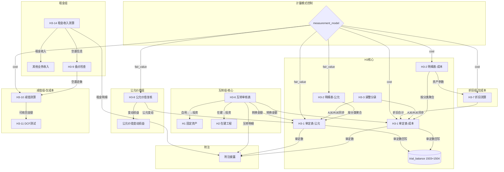

# Design Document: H3 投资性房地产底稿专属HTML精美组件

## Overview

H3投资性房地产底稿专属组件`h3-investment-property`。H循环第三大底稿（1个xlsx源模板/22有效sheet/~230+公式）。科目1503投资性房地产（借方/资产类）+ 成本模式下1504累计折旧（贷方/资产备抵类）。

核心架构：
- componentType `h3-investment-property`，主入口 GtH3InvestmentProperty.vue
- **无内部el-tabs**：外层GtWpRenderer已有sheet目录行(chips)，专属组件接收`sheetName` prop用`v-if`分发到子组件
- **双计量模式(MEASUREMENT_MODEL_FILTER)**：cost/fair_value控制H3-1/H3-2/H3-5/H3-7的双版本显隐
- 每个sheet独立子组件(200-500行) + 独立composable
- composable分层：useH3FormData + useH3FormulaEngine(纯函数) + useH3TransferEngine(纯函数) + useH3CrossSheet + useH3MeasurementModel + useH3DualMode + useH3ImportExport + sheet-specific composables
- 跨sheet数据流通过 allResponses Map computed 响应式链
- EventBus联动：TB回写 + 互转→H1/H2 + 公允价值变动→损益
- 双模式（HTML ↔ OnlyOffice）+ 导入导出三级 + AI审计说明(8 section)

## Architecture

### sheetName分发模式（非嵌套Tab）

GtH3InvestmentProperty.vue 接收 `sheetName` prop，用正则提取末尾编码(H3-1)，`v-if` 分发到对应子组件。对于有双版本的sheet(H3-1/H3-2/H3-5/H3-7)，根据measurement_model进一步选择子组件。

```
sheetName → regex提取编码 → v-if匹配
  ├── H3-1 → measurementModel === 'cost' ? H3TabAdjudicationCost : H3TabAdjudicationFair
  ├── H3-2 → measurementModel === 'cost' ? H3TabDetailCost : H3TabDetailFair
  ├── H3-5 → measurementModel === 'cost' ? H3TabAdditionCost : H3TabAdditionFair
  ├── H3-7 → H3TabDepreciation (仅cost模式显示, fair模式显示提示)
  ├── H3-8 → H3TabFairValueReview (两种模式都可用，公允模式更核心)
  └── 其他 → 直接分发对应子组件
  └── 未匹配 → OnlyOffice fallback
```

### measurement_model切换逻辑

```
el-segmented v-model="measurementModel" (主入口顶部)
  ├── "成本模式" → 显示: H3-1(成本)/H3-2(成本)/H3-5(成本)/H3-7/H3-10/H3-11
  └── "公允价值模式" → 显示: H3-1(公允)/H3-2(公允)/H3-5(公允)/H3-8
  共用sheet（不受模式影响）: H3-3/H3-4/H3-6/H3-9/H3-12/H3-13/H3-14/附注
```

### H3-7 折旧分支选择器（仅成本模式）

```
el-segmented v-model="depreciationBranch"
  ├── "不含减值" → H3TabDepreciationNoImpair.vue (42公式)
  └── "含减值"   → H3TabDepreciationWithImpair.vue (62公式)
```

### 文件结构

```
audit-platform/frontend/src/components/workpaper/
├── GtH3InvestmentProperty.vue               # 主入口 sheetName v-if分发 + measurementModel
├── h3/
│   ├── core/
│   │   ├── H3TabIndex.vue                   # 底稿目录（进度条+22行）
│   │   ├── H3TabAdjudicationCost.vue        # H3-1 审定表（成本模式，50公式）
│   │   ├── H3TabAdjudicationFair.vue        # H3-1 审定表（公允模式，50公式）
│   │   ├── H3TabDetailCost.vue              # H3-2 明细表（成本模式，49列3Tab）
│   │   ├── H3TabDetailFair.vue              # H3-2 明细表（公允模式，31列2Tab）
│   │   ├── H3TabAdjustment.vue              # H3-3 调整分录
│   │   ├── H3TabDisclosureListed.vue        # 附注上市公司
│   │   └── H3TabDisclosureSoe.vue           # 附注国企
│   ├── inspection/
│   │   ├── H3TabPolicyCheck.vue             # H3-4 会计政策（CAS3段落型）
│   │   ├── H3TabAdditionCost.vue            # H3-5 增减检查（成本模式，21列）
│   │   ├── H3TabAdditionFair.vue            # H3-5 增减检查（公允模式，20列）
│   │   ├── H3TabTransferReview.vue          # H3-6 互转审核（25公式，核心）
│   │   ├── H3TabStocktakeCheck.vue          # H3-9 盘点检查表
│   │   ├── H3TabTitleCheck.vue              # H3-12 产权核对
│   │   └── H3TabRelatedParty.vue            # H3-13 关联交易
│   ├── depreciation/
│   │   ├── H3TabDepreciationNoImpair.vue    # H3-7(A) 折旧不含减值（42公式）
│   │   └── H3TabDepreciationWithImpair.vue  # H3-7(B) 折旧含减值（62公式）
│   ├── impairment/
│   │   ├── H3TabImpairment.vue              # H3-10 减值测算（仅成本模式）
│   │   └── H3TabRecoverable.vue             # H3-11 可收回金额DCF（仅成本模式）
│   ├── rental/
│   │   └── H3TabRentalIncome.vue            # H3-14 租金收入测算（27公式）
│   └── fairvalue/
│       └── H3TabFairValueReview.vue          # H3-8 公允价值复核（15公式，核心）
├── composables/
│   ├── useH3FormData.ts                     # 数据加载/保存/selfLoad/writebackTB（~200行）
│   ├── useH3FormulaEngine.ts                # 纯函数公式引擎（资产类+公允价值模式，~250行）
│   ├── useH3TransferEngine.ts               # 纯函数互转引擎（三方向25公式，~200行）
│   ├── useH3CrossSheet.ts                   # 跨sheet联动computed（~300行）
│   ├── useH3MeasurementModel.ts             # 计量模式状态+显隐逻辑（~100行）
│   ├── useH3AdjudicationCost.ts             # H3-1成本模式composable
│   ├── useH3AdjudicationFair.ts             # H3-1公允模式composable
│   ├── useH3DetailCost.ts                   # H3-2成本模式composable（3区段）
│   ├── useH3DetailFair.ts                   # H3-2公允模式composable（2区段）
│   ├── useH3Adjustment.ts                   # H3-3 调整分录composable
│   ├── useH3PolicyCheck.ts                  # H3-4 政策检查composable
│   ├── useH3AdditionCheck.ts                # H3-5 增减检查composable
│   ├── useH3TransferReview.ts               # H3-6 互转审核composable
│   ├── useH3Depreciation.ts                 # H3-7 折旧测算composable（2分支共用状态）
│   ├── useH3FairValueReview.ts              # H3-8 公允价值复核composable
│   ├── useH3Stocktake.ts                    # H3-9 盘点composable
│   ├── useH3Impairment.ts                   # H3-10/11 减值组composable
│   ├── useH3TitleCheck.ts                   # H3-12 产权核对composable
│   ├── useH3RelatedParty.ts                 # H3-13 关联交易composable
│   ├── useH3RentalIncome.ts                 # H3-14 租金收入composable
│   ├── useH3Disclosure.ts                   # 附注（variant双版本共用）
│   ├── useH3ImportExport.ts                 # 导入导出（axios+三端点）
│   └── useH3DualMode.ts                     # 双模式OO健康检查

backend/app/routers/wp_render_strategies/
├── _h3_investment_property.py                # render策略+注册RENDERER_DISPATCH
├── _h3_import_export.py                      # 导入导出3端点
├── _h3_ai_generate.py                        # AI生成8 section
└── _h3_transfer_engine.py                    # 互转引擎端点（三方向计算+验证）

backend/app/services/auto_data_resolvers/
└── _h3_investment_property.py                # resolver: h3_tb_unadjusted / h3_rental_income
```

### Composable接口设计

```typescript
// useH3FormulaEngine.ts — 纯函数，无副作用
export function calcAuditedAmount(unadj: number, aje: number, rje: number): number
export function calcAssetEndBalance(begin: number, debit: number, credit: number): number  // 资产类:期末=期初+借方-贷方
export function calcContraEndBalance(begin: number, debit: number, credit: number): number // 备抵类:期末=期初+贷方-借方
export function calcCostTriangle(begin: number, increase: number, decrease: number, transfer: number, end: number): number  // 成本模式三角勾稽
export function calcFairEndBalance(begin: number, increase: number, decrease: number, transfer: number, fairChange: number): number  // 公允模式期末
export function calcFairValueChange(endFair: number, beginFair: number): number  // 公允价值变动=期末-期初
export function calcSubtotal(arr: number[]): number
export function calcRentalIncome(monthlyRent: number, months: number, vacancyRate: number): number  // 年租金
export function calcRentalYield(annualRent: number, bookValue: number): number | null  // 租金回报率
export function calcVacancyLoss(monthlyRent: number, vacantMonths: number): number  // 空置损失
export function calcPerSqmRent(monthlyRent: number, area: number): number | null  // 每平米租金
export function calcStraightLineDepreciation(cost: number, salvageRate: number, usefulLife: number): number  // 月折旧
export function calcDepreciationWithImpairment(cost: number, salvageRate: number, usefulLife: number, impairment: number, elapsed: number): number
export function calcDcfPresentValue(cashFlows: number[], discountRate: number): number
export function isBalanced(entries: {debit: number, credit: number}[]): boolean

// useH3TransferEngine.ts — 纯函数互转引擎
export function calcSelfToInvestFair(bookValue: number, fairValue: number): {oci: number, pl: number}  // 自用→投资(公允): 差额→OCI或PL
export function calcInvestToSelf(fairValue: number): number  // 投资→自用: 转换日公允=入账价值
export function calcCipToInvestCost(cipBookValue: number): number  // 在建→投资(成本): 账面=入账
export function calcCipToInvestFair(cipBookValue: number, fairValue: number): {entryValue: number, diff: number}  // 在建→投资(公允)
export function calcTransferDiff(transferOut: number, transferIn: number): number  // 转出=转入差额
export function calcTitleDiff(bookValue: number, certValue: number): number  // 产权差异

// useH3CrossSheet.ts — 响应式联动
export function useH3CrossSheet(allResponses: Ref<Map<string, any>>, measurementModel: Ref<string>): {
  detailTotals: ComputedRef<{assetEnd: number, depEnd: number, netValue: number}>
  adjudicationFromDetail: ComputedRef<{costAudited: number, depAudited: number} | {fairAudited: number}>
  transferSummary: ComputedRef<{fromH1: number, toH1: number, fromH2: number}>
  rentalForDisclosure: ComputedRef<{annualTotal: number, byAsset: Record<string, number>}>
  fairValueChangeTotal: ComputedRef<number>
  disclosureAutoFill: ComputedRef<Record<string, number>>
}
```

## 跨Sheet数据流图



## Architecture Decision Records (ADR)

### ADR-1: measurement_model双计量模式切换

**决策**：使用`useH3MeasurementModel` composable管理计量模式状态，通过el-segmented在主入口切换，控制4对双版本sheet的显隐。

**理由**：
- CAS3要求企业选择一种计量模式（成本或公允价值）后一致适用
- 源xlsx中H3-1/H3-2/H3-5/H3-7各有2个版本（成本/公允），在同一sheetName下切换
- 两套数据独立存储（item_id前缀区分：H3-1-cost-xxx / H3-1-fair-xxx），切换不丢数据
- 幂等性要求：切换N次后状态一致，不重复创建数据

**替代方案**：所有sheet都渲染，用CSS隐藏不适用版本 → 拒绝，浪费渲染资源且逻辑混乱。

### ADR-2: 互转引擎独立composable

**决策**：将互转计算（三方向25公式）从通用FormulaEngine中拆出，独立为`useH3TransferEngine.ts`纯函数模块。

**理由**：
- 互转是H3最核心的审计关注点（CAS3第12-15条），逻辑复杂度高
- 三方向转换各有不同公式：自用→投资(公允差额入OCI/PL)、投资→自用(公允作入账)、在建→投资(成本/公允两条路径)
- 需与H1固定资产、H2在建工程联动验证金额一致性
- 独立模块便于PBT验证互转公式的正确性

**替代方案**：合并到FormulaEngine → 拒绝，互转公式有独立的业务语义和参数签名。

### ADR-3: H3-7折旧分支选择器（仅成本模式）

**决策**：H3-7折旧测算表仅在成本模式下显示，使用el-segmented在不含减值/含减值2个版本间切换。

**理由**：
- 公允价值模式不计提折旧（CAS3规定），H3-7仅适用于成本模式
- 不含减值/含减值是同一功能的两个计算分支（类似H1-12模式）
- 切换时保持同一数据源，depreciationBranch字段区分

### ADR-4: 租金收入测算独立功能域

**决策**：H3-14租金收入测算作为独立功能域（rental/目录），有专属composable。

**理由**：
- 租金收入测算有27个公式，涉及月度明细(12列横向)、空置率、到期管理等复杂逻辑
- 与减值/折旧等功能域职责不同（收入侧 vs 资产侧）
- 需要与"其他业务收入"科目联动验证

## Correctness Properties

以下纯函数property通过PBT验证（fast-check / hypothesis）：

### P1: 审定数公式链正确性
- **Feature**: h3-investment-property
- **Property**: 对任意 unadj ∈ ℝ, aje ∈ ℝ, rje ∈ ℝ → calcAuditedAmount(unadj, aje, rje) === unadj + aje + rje
- **生成器**: fc.float({min:-1e9, max:1e9}) × 3

### P2: 资产类期末余额（成本模式）
- **Feature**: h3-investment-property
- **Property**: 对任意 begin, debit, credit ∈ ℝ≥0 → calcAssetEndBalance(begin, debit, credit) === begin + debit - credit
- **生成器**: fc.float({min:0, max:1e9}) × 3

### P3: 公允价值模式期末=期初+公允变动
- **Feature**: h3-investment-property
- **Property**: 对任意 begin, increase, decrease, transfer, fairChange → calcFairEndBalance(begin, increase, decrease, transfer, fairChange) === begin + increase - decrease + transfer + fairChange
- **生成器**: fc.float({min:-1e9, max:1e9}) × 5

### P4: 三角勾稽（成本模式）
- **Feature**: h3-investment-property
- **Property**: 对任意 begin, increase, decrease, transfer ∈ ℝ≥0，令 end=begin+increase-decrease+transfer → calcCostTriangle(begin, increase, decrease, transfer, end) === 0
- **生成器**: fc.float({min:0, max:1e9}) × 4, end由公式计算

### P5: 合计行恒等
- **Feature**: h3-investment-property
- **Property**: 对任意 arr: number[] (len≥1) → calcSubtotal(arr) === arr.reduce((a,b)=>a+b, 0)
- **生成器**: fc.array(fc.float({min:-1e9, max:1e9}), {minLength:1, maxLength:50})

### P6: 互转公允值=转换日公允（自用→投资用公允）
- **Feature**: h3-investment-property
- **Property**: 对任意 bookValue, fairValue → calcSelfToInvestFair(bookValue, fairValue).oci === max(fairValue-bookValue, 0) 且 .pl === min(fairValue-bookValue, 0)
- **生成器**: fc.float({min:0, max:1e9}) × 2

### P7: 互转账面值=转换日账面（投资→自用用账面）
- **Feature**: h3-investment-property
- **Property**: 对任意 fairValue>0 → calcInvestToSelf(fairValue) === fairValue
- **生成器**: fc.float({min:1, max:1e9})

### P8: 折旧公式（成本模式直线法）
- **Feature**: h3-investment-property
- **Property**: 对任意 cost>0, salvageRate∈[0,1), usefulLife>0 → calcStraightLineDepreciation(cost, salvageRate, usefulLife) === cost×(1-salvageRate)/usefulLife/12
- **生成器**: fc.float({min:1, max:1e8}), fc.float({min:0, max:0.99}), fc.integer({min:1, max:50})

### P9: 公允价值变动损益=期末公允-期初公允
- **Feature**: h3-investment-property
- **Property**: 对任意 endFair, beginFair → calcFairValueChange(endFair, beginFair) === endFair - beginFair
- **生成器**: fc.float({min:0, max:1e9}) × 2

### P10: 租金收入测算（月租×月数×(1-空置率)）
- **Feature**: h3-investment-property
- **Property**: 对任意 monthlyRent>0, months∈[1,12], vacancyRate∈[0,1) → calcRentalIncome(monthlyRent, months, vacancyRate) === monthlyRent × months × (1 - vacancyRate)
- **生成器**: fc.float({min:1, max:1e6}), fc.integer({min:1, max:12}), fc.float({min:0, max:0.99})

### P11: DCF现值（仅成本模式）
- **Feature**: h3-investment-property
- **Property**: 对任意 cashFlows[]>0, discountRate>0 → calcDcfPresentValue(cfs, r) === Σ(cf_i/(1+r)^(i+1))
- **生成器**: fc.array(fc.float({min:1, max:1e6}), {minLength:1, maxLength:10}), fc.float({min:0.01, max:0.3})

### P12: 产权差异=账面-证载
- **Feature**: h3-investment-property
- **Property**: 对任意 bookValue, certValue → calcTitleDiff(bookValue, certValue) === bookValue - certValue
- **生成器**: fc.float({min:0, max:1e9}) × 2

### P13: measurement_model filter幂等性
- **Feature**: h3-investment-property
- **Property**: 对任意 model∈{cost,fair_value}，切换到model再切回再切到model → 最终状态 === 第一次切换状态
- **生成器**: fc.constantFrom('cost', 'fair_value'), fc.array(fc.constantFrom('cost', 'fair_value'), {minLength:1, maxLength:10})

### P14: 借贷平衡
- **Feature**: h3-investment-property
- **Property**: 对任意调整分录数组 → isBalanced === (SUM(debit) === SUM(credit))
- **生成器**: fc.array(fc.record({debit: fc.float({min:0}), credit: fc.float({min:0})}), {minLength:1, maxLength:20})

## EventBus事件清单

| 事件名 | 发布者 | 消费者 |
|--------|--------|--------|
| `substantive:adjudicated` | H3-1 | TB回写, 附注 |
| `adjustment:created` | H3-3 | H3-1, A13 |
| `h3:transfer-from-h1` | H3-6 | H1固定资产 |
| `h3:transfer-from-h2` | H3-6 | H2在建工程 |
| `h3:fair-value-changed` | H3-8 | 公允价值变动损益 |
| `h3:rental-income-calculated` | H3-14 | 其他业务收入 |
| `disclosure:note-text-updated` | 附注 | 附注模块 |

## 后端AI Section清单

```
adj-note-cost / adj-note-fair / adj-conclusion / policy-evaluation /
transfer-analysis / fair-value-summary / rental-analysis / impairment-conclusion
```

## 错误处理

| 场景 | 处理方式 |
|------|----------|
| render-config 加载失败 | 显示el-empty+重试按钮，不渲染子组件 |
| selfLoad 404 | 静默处理（_silent:true），显示空状态引导创建 |
| 保存失败 | 乐观更新+el-message.error+本地数据不丢失+自动重试1次 |
| OnlyOffice 健康检查失败 | 禁用切换按钮+tooltip提示"OnlyOffice服务不可用" |
| 导入xlsx解析失败 | el-message.error显示行号+列号+错误原因 |
| TB取数科目不存在 | 未审数显示0+黄色提示"科目1503/1504未在TB中找到" |
| 三角勾稽校验失败 | 红色高亮差异行+el-alert |
| measurement_model未设置 | 默认cost+黄色提示"请确认计量模式" |
| 互转对方底稿未打开 | GtIndexChip灰色+tooltip"H1/H2底稿未打开" |
| 公允价值评估报告缺失 | H3-8黄色提示"请上传评估报告" |
| EventBus发布失败 | 静默重试1次，不阻塞用户操作 |
