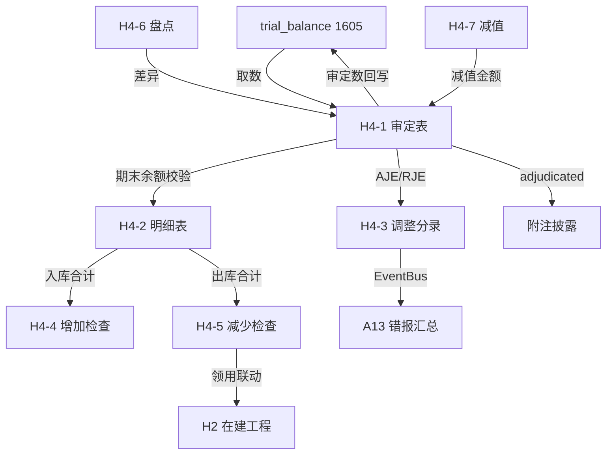

# Design Document: H4 工程物资底稿专属HTML精美组件

## Overview

H4工程物资底稿专属组件`h4-engineering-materials`。H循环精简底稿（1个xlsx源模板/13个sheet含GT_Custom/~120+公式）。科目1605工程物资（借方/资产类）。

核心架构：
- componentType `h4-engineering-materials`，主入口 GtH4EngineeringMaterials.vue
- **无内部el-tabs**：外层GtWpRenderer已有sheet目录行(chips)，专属组件接收`sheetName` prop用`v-if`分发到子组件
- 每个sheet独立子组件(200-400行) + 独立composable
- composable分层：useH4FormData + useH4FormulaEngine(纯函数) + useH4CrossSheet + useH4DualMode + useH4ImportExport + sheet-specific composables
- 跨sheet数据流通过 allResponses Map computed 响应式链
- EventBus联动：TB回写(1605) + H2在建工程物资消耗 + 附注
- 双模式（HTML ↔ OnlyOffice）+ 导入导出三级 + AI审计说明

## Architecture

### sheetName分发模式（非嵌套Tab）

GtH4EngineeringMaterials.vue 接收 `sheetName` prop，用正则提取末尾编码(H4-1)，`v-if` 分发到对应子组件。

```
sheetName → regex提取编码 → v-if匹配 → 子组件渲染
                                     ↘ 未匹配 → OnlyOffice fallback
```

### 文件结构

```
audit-platform/frontend/src/components/workpaper/
├── GtH4EngineeringMaterials.vue          # 主入口 sheetName v-if分发
├── h4/
│   ├── core/
│   │   ├── H4TabIndex.vue                # 底稿目录（进度条+13行）
│   │   ├── H4TabAdjudication.vue         # H4-1 审定表（51公式）
│   │   ├── H4TabDetail.vue               # H4-2 明细表（67列3区段Tab）
│   │   ├── H4TabAdjustment.vue           # H4-3 调整分录
│   │   ├── H4TabDisclosureListed.vue     # 附注上市公司
│   │   └── H4TabDisclosureSoe.vue        # 附注国企
│   ├── inspection/
│   │   ├── H4TabAdditionCheck.vue        # H4-4 增加检查（19列+抽凭+OCR）
│   │   ├── H4TabDisposalCheck.vue        # H4-5 减少检查（29列+联动H2）
│   │   ├── H4TabStocktakeCheck.vue       # H4-6 盘点检查表
│   │   └── H4TabRelatedParty.vue         # H4-9 关联交易
│   └── impairment/
│       ├── H4TabImpairment.vue           # H4-7 减值测算（OO为主）
│       └── H4TabRecoverable.vue          # H4-8 可收回金额（OO为主）
├── composables/
│   ├── useH4FormData.ts                  # 数据加载/保存/selfLoad/writebackTB（~180行）
│   ├── useH4FormulaEngine.ts             # 纯函数公式引擎（资产类公式，~150行）
│   ├── useH4CrossSheet.ts               # 跨sheet联动computed（~200行）
│   ├── useH4DualMode.ts                 # 双模式切换（~80行）
│   ├── useH4ImportExport.ts             # 导入导出三级（~120行）
│   ├── useH4Adjudication.ts             # H4-1 审定表composable
│   ├── useH4Detail.ts                   # H4-2 明细表composable（3区段）
│   ├── useH4Adjustment.ts              # H4-3 调整分录composable
│   ├── useH4AdditionCheck.ts           # H4-4 增加检查composable
│   ├── useH4DisposalCheck.ts           # H4-5 减少检查composable
│   ├── useH4Stocktake.ts              # H4-6 盘点composable
│   └── useH4RelatedParty.ts           # H4-9 关联交易composable
```

### 后端文件结构

```
audit-platform/backend/
├── app/workpaper_engine/renderers/
│   └── h4_engineering_materials_renderer.py  # RENDERER_DISPATCH注册+渲染逻辑
├── app/routers/
│   └── h4_engineering_materials.py           # 3端点：导出模板/导出数据/导入数据
├── app/services/
│   └── h4_engineering_materials_service.py   # 业务逻辑+公式验证
└── data/wp_render_schema/
    └── h4-engineering-materials.yaml         # 渲染schema配置
```

## Composable接口设计

### useH4FormulaEngine.ts（纯函数，无副作用）

```typescript
// 审定数公式
export function calcAuditedAmount(unadj: number, aje: number, rje: number): number
// 资产类期末余额
export function calcAssetEndBalance(begin: number, debit: number, credit: number): number
// 三角勾稽差额
export function calcTriangleReconciliation(begin: number, increase: number, decrease: number, end: number): number
// 合计
export function calcSubtotal(arr: number[]): number
// 差异率
export function calcDiffRate(actual: number, expected: number): number
// 价差率（关联交易）
export function calcPriceDiffRate(transPrice: number, marketPrice: number): number
```

### useH4CrossSheet.ts

```typescript
export function useH4CrossSheet(allResponses: Ref<Map<string, any>>) {
  // H4-1审定数 → H4-2合计校验
  const adjudicationVsDetail: ComputedRef<{ diff: number; isMatch: boolean }>
  // H4-4增加合计 → H4-1借方发生合计校验
  const additionVsAdjudication: ComputedRef<{ diff: number; isMatch: boolean }>
  // H4-5减少合计 → H4-1贷方发生合计校验
  const disposalVsAdjudication: ComputedRef<{ diff: number; isMatch: boolean }>
}
```

## 数据流图



## ADR（Architecture Decision Records）

### ADR-1: H4为精简底稿，不需双计量模式

H4工程物资仅有单一科目1605（借方/资产类），无累计折旧/备抵，无成本/公允切换。因此不需要measurement_model filter，架构简于H3/H7。

### ADR-2: H4-7/H4-8减值保留OnlyOffice

H4-7减值测算表(31行31列15公式)和H4-8可收回金额测试表(58行28列12公式)为复杂矩阵计算，保留OnlyOffice为主渲染+HTML简化摘要视图。

### ADR-3: 减少检查联动H2在建工程

H4物资减少中"领用出库"项与H2在建工程直接关联。通过GtIndexChip+EventBus实现：H4-5减少行填入对应H2编号后可点击跳转，H4保存时publish事件通知H2更新物资消耗数据。

## Correctness Properties

| ID | Property | 验证方法 |
|----|----------|---------|
| P1 | ∀ unadj,aje,rje: calcAuditedAmount(u,a,r) = u+a+r | PBT |
| P2 | ∀ begin,debit,credit: calcAssetEndBalance(b,d,c) = b+d-c | PBT |
| P3 | ∀ arr: calcSubtotal(arr) = Σarr | PBT |
| P4 | ∀ begin,inc,dec: calcTriangleReconciliation(b,i,d,b+i-d) = 0 | PBT |
| P5 | ∀ trans,market(≠0): calcPriceDiffRate(t,m) = (t-m)/m×100 | PBT |
| P6 | H4-1审定合计 = H4-2明细合计（跨sheet恒等） | 集成测试 |

## 错误处理

| 场景 | 处理方式 |
|------|---------|
| selfLoad失败 | 显示el-empty+重试按钮 |
| TB取数无科目1605 | 显示提示"请先导入试算平衡表" |
| 跨sheet数据缺失 | 黄色警告提示缺失来源 |
| OO健康检查失败 | 降级为HTML简化视图 |
| 导入数据格式错误 | ElMessage.error提示具体错误行列 |
