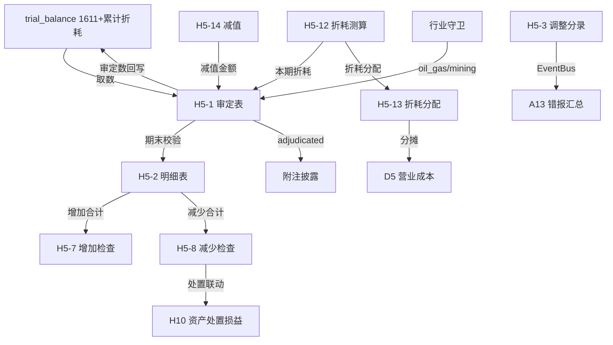

# Design Document: H5 油气资产底稿专属HTML精美组件

## Overview

H5油气资产底稿专属组件`h5-oil-gas-assets`。行业特殊底稿（1个xlsx/24有效sheet/~200+公式）。科目1611油气资产（借方/资产类）+ 累计折耗（贷方/备抵类）。

核心架构：
- componentType `h5-oil-gas-assets`，主入口 GtH5OilGasAssets.vue
- **行业适用性守卫**：applicable_when industry IN ['oil_gas','mining']
- **折耗（非折旧）**：单位产量法为主（产量/储量）
- **无内部el-tabs**：sheetName prop v-if分发
- H5-12分支选择器（不含减值/含减值）
- composable分层：useH5FormData + useH5FormulaEngine(纯函数) + useH5DepletionEngine(纯函数) + useH5CrossSheet + useH5DualMode + useH5ImportExport
- EventBus联动：TB回写(1611+累计折耗) + 折耗分摊(D5) + 处置联动(H10) + 附注

## Architecture

### sheetName分发模式

```
sheetName → regex提取编码 → v-if匹配
  ├── H5-12 → depletionBranch === '不含减值' ? H5TabDepletionNoImpair : H5TabDepletionWithImpair
  └── 其他 → 直接分发对应子组件
  └── 未匹配 → OnlyOffice fallback
```

### 行业适用性守卫

```
onMounted → inject('projectContext') → check industry
  ├── industry IN ['oil_gas','mining'] → 正常渲染
  └── 其他 → el-empty("本底稿仅适用于石油天然气/采矿行业项目")
```

### H5-12 分支选择器

```
el-segmented v-model="depletionBranch"
  ├── "不含减值" → H5TabDepletionNoImpair.vue (42公式)
  └── "含减值"   → H5TabDepletionWithImpair.vue (62公式)
```

### 文件结构

```
audit-platform/frontend/src/components/workpaper/
├── GtH5OilGasAssets.vue                    # 主入口 sheetName v-if分发 + 行业守卫
├── h5/
│   ├── core/
│   │   ├── H5TabIndex.vue                  # 底稿目录（进度条+24行）
│   │   ├── H5TabAdjudication.vue           # H5-1 审定表（双区块51公式）
│   │   ├── H5TabDetail.vue                 # H5-2 明细表（54列3区段Tab）
│   │   ├── H5TabAdjustment.vue             # H5-3 调整分录
│   │   ├── H5TabAnalysis.vue               # H5-6 分析表
│   │   ├── H5TabDisclosureListed.vue       # 附注上市公司
│   │   └── H5TabDisclosureSoe.vue          # 附注国企
│   ├── inspection/
│   │   ├── H5TabIdleCheck.vue              # H5-4 闲置检查
│   │   ├── H5TabPolicyCheck.vue            # H5-5 会计政策（CAS27）
│   │   ├── H5TabAdditionCheck.vue          # H5-7 增加检查（勘探资本化）
│   │   ├── H5TabDisposalCheck.vue          # H5-8 减少检查（联动H10）
│   │   ├── H5TabTitleCheck.vue             # H5-16 权属检查（采矿权）
│   │   └── H5TabRelatedParty.vue           # H5-17 关联交易
│   ├── stocktake/
│   │   ├── H5TabStocktakePlan.vue          # H5-9 监盘计划
│   │   ├── H5TabStocktakeCheck.vue         # H5-10 盘点检查表
│   │   └── H5TabStocktakeSummary.vue       # H5-11 监盘小结
│   ├── depletion/
│   │   ├── H5TabDepletionNoImpair.vue      # H5-12(A) 折耗不含减值（42公式）
│   │   ├── H5TabDepletionWithImpair.vue    # H5-12(B) 折耗含减值（62公式）
│   │   └── H5TabDepletionAlloc.vue         # H5-13 折耗分配（11公式）
│   ├── impairment/
│   │   ├── H5TabImpairment.vue             # H5-14 减值测算
│   │   └── H5TabRecoverable.vue            # H5-15 可收回金额
│   └── lease/
│       ├── H5TabOperatingLease.vue         # H5-18 经营租出
│       └── H5TabFinanceLease.vue           # H5-19 融资租出
├── composables/
│   ├── useH5FormData.ts                    # 数据加载/保存/selfLoad/writebackTB
│   ├── useH5FormulaEngine.ts               # 纯函数公式引擎（资产类+折耗公式）
│   ├── useH5DepletionEngine.ts             # 纯函数折耗引擎（单位产量法+储量）
│   ├── useH5CrossSheet.ts                 # 跨sheet联动computed
│   ├── useH5DualMode.ts                   # 双模式切换
│   ├── useH5ImportExport.ts               # 导入导出三级
│   ├── useH5IndustryGuard.ts              # 行业适用性守卫
│   └── [sheet-specific composables]        # 各sheet独立composable
```

### 后端文件结构

```
audit-platform/backend/
├── app/workpaper_engine/renderers/
│   └── h5_oil_gas_assets_renderer.py       # RENDERER_DISPATCH注册+行业校验
├── app/routers/
│   └── h5_oil_gas_assets.py                # 4端点：导出模板/导出数据/导入数据/行业校验
├── app/services/
│   └── h5_oil_gas_assets_service.py        # 业务逻辑+折耗公式验证+行业检查
└── data/wp_render_schema/
    └── h5-oil-gas-assets.yaml              # 渲染schema配置
```

## Composable接口设计

### useH5FormulaEngine.ts（纯函数）

```typescript
export function calcAuditedAmount(unadj: number, aje: number, rje: number): number
export function calcAssetEndBalance(begin: number, debit: number, credit: number): number
export function calcContraEndBalance(begin: number, debit: number, credit: number): number
export function calcTriangleReconciliation(begin: number, increase: number, decrease: number, end: number): number
export function calcNetValue(cost: number, accDepletion: number, impairment: number): number
export function calcSubtotal(arr: number[]): number
export function calcChangeRate(current: number, prior: number): number
export function calcPriceDiffRate(transPrice: number, marketPrice: number): number
export function calcLeaseReturnRate(annualRent: number, netValue: number): number
```

### useH5DepletionEngine.ts（纯函数，折耗专用）

```typescript
// 单位产量法折耗
export function calcUnitDepletion(cost: number, salvage: number, production: number, reserves: number): number
// 折耗率
export function calcDepletionRate(accDepletion: number, cost: number): number
// 剩余可采储量
export function calcRemainingReserves(totalReserves: number, accProduction: number): number
// 含减值后折耗
export function calcDepletionAfterImpairment(netValue: number, salvage: number, production: number, remainReserves: number): number
// 折耗封顶（产量>储量时）
export function calcDepletionCapped(cost: number, salvage: number, accDepletion: number): number
```

### useH5CrossSheet.ts

```typescript
export function useH5CrossSheet(allResponses: Ref<Map<string, any>>) {
  const adjudicationVsDetail: ComputedRef<{ diff: number; isMatch: boolean }>
  const depletionVsAdjudication: ComputedRef<{ diff: number; isMatch: boolean }>
  const additionVsAdjudication: ComputedRef<{ diff: number; isMatch: boolean }>
  const disposalVsAdjudication: ComputedRef<{ diff: number; isMatch: boolean }>
}
```

## 数据流图



## ADR

### ADR-1: 折耗≠折旧，使用独立引擎

油气资产使用"折耗"概念而非"折旧"。折耗核心方法为单位产量法（折耗=可折耗金额×当期产量÷预计可采储量），与H1直线法/双倍余额递减等完全不同。因此独立useH5DepletionEngine.ts，不复用H1的useH1DepreciationEngine。

### ADR-2: 行业适用性前后端双重校验

前端组件mount时检查industry字段，后端创建底稿API也校验。防止误操作在非石油/采矿项目中创建H5底稿。

### ADR-3: 储量参数需外部输入

单位产量法依赖"预计可采储量"这一非财务数据，通常来自地质勘探报告。系统提供输入字段但不自动生成，需审计师根据评估报告手工录入。

## Correctness Properties

| ID | Property | 验证方法 |
|----|----------|---------|
| P1 | ∀ unadj,aje,rje: calcAuditedAmount(u,a,r) = u+a+r | PBT |
| P2 | ∀ begin,debit,credit: calcAssetEndBalance(b,d,c) = b+d-c | PBT |
| P3 | ∀ begin,debit,credit: calcContraEndBalance(b,d,c) = b+c-d | PBT |
| P4 | ∀ cost,salvage,prod,reserves(>0): calcUnitDepletion = (cost-salvage)×prod/reserves | PBT |
| P5 | ∀ reserves=0: calcUnitDepletion(..., 0) = 0（不除零） | PBT |
| P6 | ∀ prod>reserves: 折耗封顶=可折耗余额 | PBT |
| P7 | ∀ arr: calcSubtotal(arr) = Σarr | PBT |
| P8 | ∀ cost,dep,imp: calcNetValue(c,d,i) = c-d-i | PBT |
| P9 | H5-1审定合计 = H5-2明细合计（跨sheet恒等） | 集成测试 |
| P10 | 折耗测算本期计提 = H5-1累计折耗本期贷方发生 | 集成测试 |

## 错误处理

| 场景 | 处理方式 |
|------|---------|
| 行业不匹配 | el-empty + 提示仅适用oil_gas/mining |
| selfLoad失败 | el-empty+重试按钮 |
| 储量为0 | 折耗公式返回0 + 黄色警告"请录入预计可采储量" |
| TB取数无科目1611 | 提示"请先导入试算平衡表" |
| OO健康检查失败 | 降级HTML简化视图 |
