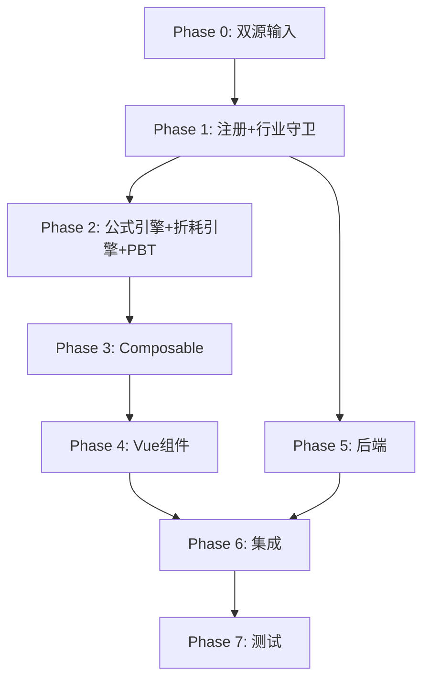

# Implementation Plan: H5 油气资产底稿专属HTML精美组件

## Overview

H5油气资产底稿专属组件`h5-oil-gas-assets`。行业特殊底稿（24有效sheet/1 xlsx/~200+公式）。

主入口 GtH5OilGasAssets.vue（sheetName v-if分发 + 行业适用性守卫，defineAsyncComponent lazy）+ 21个子组件 + 15个composable + 后端4个py文件。

科目：1611油气资产（借方/资产类）+ 累计折耗（贷方/备抵类）
公式特征：折耗=单位产量法（产量/储量）；期末=期初+借方-贷方；行业限制oil_gas/mining

## Tasks

### Phase 0: 双源输入验证

- [x] 0.1 openpyxl脚本读取H5油气资产.xlsx全部24 sheet
  - 提取：sheet名/列头/行数/公式单元格/合并区域/数据类型
  - 产出：h5_structure_summary.json
  - 验证：24 sheet结构与本spec描述一致
  - _Requirements: 双源输入流程_

- [x] 0.2 H固定资产循环底稿模板库md交叉验证
  - 核对：审计目标/程序清单/联动关系/认定对应/交叉引用/行业适用性
  - 产出：h5_conflict_resolution.md（如有冲突）
  - _Requirements: 双源输入流程_

### Phase 1: 注册+契约测试

- [x] 1.1 注册componentType和映射
  - 在 `wp_code_overrides.json` 中将H5/H5-1~H5-19/H5A映射为'h5-oil-gas-assets'
  - 在 `VALID_COMPONENT_TYPES` 中注册'h5-oil-gas-assets'
  - 在 `htmlRendererRegistry.ts` 中注册 'h5-oil-gas-assets' → GtH5OilGasAssets 映射
  - 创建 `GtH5OilGasAssets.vue` 主入口骨架（sheetName prop v-if + 行业守卫 + selfLoad）
  - _Requirements: 1.1, 1.2, 1.6, 1.7, 1.8, 1.9, 1.11_

- [x] 1.2 编写注册契约测试
  - htmlRendererRegistry.spec.ts 验证'h5-oil-gas-assets'已注册
  - VALID_COMPONENT_TYPES契约验证
  - wp_code_overrides契约验证H5/H5-1~H5-19映射
  - RENDERER_DISPATCH注册验证
  - _Requirements: 1.6, 1.7, 1.8_

- [x] 1.3 创建 useH5IndustryGuard.ts 行业适用性守卫
  - inject projectContext → check industry IN ['oil_gas','mining']
  - 非适用行业返回 { isApplicable: false, message: '...' }
  - _Requirements: 1.11, 1.12, 12.1-12.3_

### Phase 2: 公式引擎+PBT

- [x] 2.1 创建 `composables/useH5FormulaEngine.ts`
  - calcAuditedAmount / calcAssetEndBalance / calcContraEndBalance
  - calcTriangleReconciliation / calcNetValue / calcSubtotal
  - calcChangeRate / calcPriceDiffRate / calcLeaseReturnRate
  - _Requirements: 2.3-2.6, 8.4, 11.1_

- [x] 2.2 创建 `composables/useH5DepletionEngine.ts`
  - calcUnitDepletion(cost, salvage, production, reserves)
  - calcDepletionRate / calcRemainingReserves
  - calcDepletionAfterImpairment / calcDepletionCapped
  - _Requirements: 7.4, 9.1-9.5_

- [x]* 2.3 编写 Property P1 PBT：审定数公式链
  - 生成器：fc.float({min:-1e9, max:1e9}) × 3
  - 断言：calcAuditedAmount(u, a, r) === u + a + r
  - **Feature: h5-oil-gas-assets, Property P1: 审定数公式链正确性**

- [x]* 2.4 编写 Property P2 PBT：资产类期末余额
  - 生成器：fc.float({min:0, max:1e9}) × 3
  - 断言：calcAssetEndBalance(b, d, c) === b + d - c
  - **Feature: h5-oil-gas-assets, Property P2: 资产类期末余额**

- [x]* 2.5 编写 Property P3 PBT：备抵类期末余额
  - 生成器：fc.float({min:0, max:1e9}) × 3
  - 断言：calcContraEndBalance(b, d, c) === b + c - d
  - **Feature: h5-oil-gas-assets, Property P3: 备抵类期末余额**

- [x]* 2.6 编写 Property P4 PBT：单位产量法折耗（正常情况）
  - 生成器：cost>0, salvage<cost, production>0, reserves>production
  - 断言：calcUnitDepletion(cost,salvage,prod,res) === (cost-salvage)*prod/res
  - **Feature: h5-oil-gas-assets, Property P4: 单位产量法折耗**

- [x]* 2.7 编写 Property P5 PBT：储量为0时折耗=0
  - 生成器：fc.float({min:1, max:1e9}) × 3, reserves=0
  - 断言：calcUnitDepletion(cost, salvage, prod, 0) === 0
  - **Feature: h5-oil-gas-assets, Property P5: 储量为零不除零**

- [x]* 2.8 编写 Property P6 PBT：折耗封顶
  - 生成器：cost, salvage(<cost), accDepletion(接近cost-salvage), production>reserves
  - 断言：calcDepletionCapped(cost, salvage, accDepl) === cost - salvage - accDepl
  - **Feature: h5-oil-gas-assets, Property P6: 折耗封顶**

- [x]* 2.9 编写 Property P7 PBT：合计行恒等
  - 生成器：fc.array(fc.float, {minLength:1, maxLength:50})
  - 断言：calcSubtotal(arr) === Σarr
  - **Feature: h5-oil-gas-assets, Property P7: 合计行恒等**

- [x]* 2.10 编写 Property P8 PBT：净值公式
  - 生成器：fc.float({min:0, max:1e9}) × 3
  - 断言：calcNetValue(c, d, i) === c - d - i
  - **Feature: h5-oil-gas-assets, Property P8: 净值公式**

- [x]* 2.11 编写 Property P9 PBT：三角勾稽恒等
  - 生成器：fc.float({min:0, max:1e9}) × 3, end=begin+inc-dec
  - 断言：calcTriangleReconciliation(b, i, d, b+i-d) === 0
  - **Feature: h5-oil-gas-assets, Property P9: 三角勾稽恒等**

- [x]* 2.12 编写 Property P10 PBT：租赁收益率
  - 生成器：fc.float({min:1, max:1e8}) × 2 (rent, netValue)
  - 断言：calcLeaseReturnRate(r, nv) === r/nv * 100
  - **Feature: h5-oil-gas-assets, Property P10: 租赁收益率公式**

### Phase 3: Composable层

- [x] 3.1 创建 useH5FormData.ts
  - selfLoad + checklist_responses CRUD + writebackTB(1611+累计折耗)
  - _Requirements: 1.9, 1.10, 2.7_

- [x] 3.2 创建 useH5CrossSheet.ts
  - adjudicationVsDetail / depletionVsAdjudication / additionVsAdjudication / disposalVsAdjudication
  - _Requirements: 2.8, 3.2_

- [x] 3.3 创建 useH5DualMode.ts + useH5ImportExport.ts
  - 双模式切换 + OO健康检查 + 导入导出三级
  - _Requirements: 3.3, 7.2-7.3_

- [x] 3.4 创建 sheet-specific composables（14个）
  - useH5Adjudication / useH5Detail / useH5Adjustment / useH5IdleCheck
  - useH5PolicyCheck / useH5Analysis / useH5AdditionCheck / useH5DisposalCheck
  - useH5Stocktake / useH5Depletion / useH5Impairment / useH5TitleCheck
  - useH5RelatedParty / useH5Lease
  - _Requirements: 2~11 全部_

### Phase 4: Vue子组件

- [x] 4.1 创建 H5TabIndex.vue 底稿目录
  - 24行sheet列表+进度条+GtIndexChip
  - _Requirements: 1.2_

- [x] 4.2 创建 H5TabAdjudication.vue 审定表H5-1
  - 双区块(原值+折耗)+51公式+TB回写+三角勾稽
  - _Requirements: 2.1-2.8_

- [x] 4.3 创建 H5TabDetail.vue + H5TabAdjustment.vue
  - 明细表54列3区段 + 调整分录10列借贷平衡
  - _Requirements: 3.1-3.5_

- [x] 4.4 创建 H5TabIdleCheck.vue + H5TabPolicyCheck.vue + H5TabAnalysis.vue
  - 闲置11列 + CAS27政策段落型 + 分析表OO/HTML
  - _Requirements: 4.1-4.4_

- [x] 4.5 创建 H5TabAdditionCheck.vue + H5TabDisposalCheck.vue
  - 增加24列(勘探资本化) + 减少24列(联动H10)
  - _Requirements: 5.1-5.5_

- [x] 4.6 创建 H5TabStocktakePlan/Check/Summary.vue 监盘三阶段
  - 计划15列 + 检查14列 + 小结叙述式 + 数据流联动
  - _Requirements: 6.1-6.4_

- [x] 4.7 创建 H5TabDepletionNoImpair/WithImpair.vue + H5TabDepletionAlloc.vue
  - 折耗分支选择器 + OO渲染 + 折耗分配11公式
  - _Requirements: 7.1-7.6_

- [x] 4.8 创建 H5TabImpairment.vue + H5TabRecoverable.vue
  - 减值OO + 可收回金额DCF OO
  - _Requirements: 8.1-8.2_

- [x] 4.9 创建 H5TabTitleCheck.vue + H5TabRelatedParty.vue
  - 权属21列(采矿权到期预警) + 关联16列(价差率高亮)
  - _Requirements: 8.3-8.4, 8.7_

- [x] 4.10 创建 H5TabOperatingLease.vue + H5TabFinanceLease.vue
  - 经营租出17列(收益率) + 融资租出20列(本金摊销)
  - _Requirements: 8.5-8.6, 11.1-11.3_

- [x] 4.11 创建 H5TabDisclosureListed.vue + H5TabDisclosureSoe.vue
  - 附注嵌套表 + EventBus subscribe
  - _Requirements: 1.2_

### Phase 5: 后端

- [x] 5.1 创建 h5_oil_gas_assets_renderer.py
  - RENDERER_DISPATCH注册 + 行业校验 + 渲染逻辑
  - _Requirements: 1.6, 12.3_

- [x] 5.2 创建 h5_oil_gas_assets.py 路由（4端点）
  - POST /h5/export-template | /h5/export-data | /h5/import-data
  - GET /h5/industry-check（校验当前项目行业适用性）
  - _Requirements: 3.3, 12.3_

- [x] 5.3 创建 h5_oil_gas_assets_service.py
  - 折耗公式后端验证 + 行业判断 + 跨sheet合计
  - _Requirements: 9.1-9.5, 12.1-12.3_

### Phase 6: 集成

- [x] 6.1 EventBus集成
  - publish 'substantive:adjudicated'（H5-1→附注+报表）
  - publish 'adjustment:created'（H5-3→A13）
  - publish depletion allocation（H5-13→D5营业成本）
  - _Requirements: 10.1-10.4_

- [x] 6.2 跨底稿联动
  - H5-8减少→H10 GtIndexChip跳转
  - H5-1审定→TB回写(1611+累计折耗)
  - H5-13折耗分配→D5
  - _Requirements: 10.1-10.3_

### Phase 7: 测试

- [x] 7.1 单元测试：useH5FormulaEngine + useH5DepletionEngine全部纯函数
  - 边界：零值/储量0/产量>储量/大数/NaN防护
  - _Requirements: P1-P10_

- [x] 7.2 集成测试：跨sheet数据流 + 行业守卫
  - H5-1↔H5-2一致性 / 折耗↔审定表同步 / 行业拦截
  - _Requirements: 2.8, 7.6, 12.1-12.3_

- [x] 7.3 Playwright E2E
  - 完整流程：切换行业→打开H5→审定→折耗测算→监盘→保存
  - _Requirements: 全部_

## Task Dependency Graph

