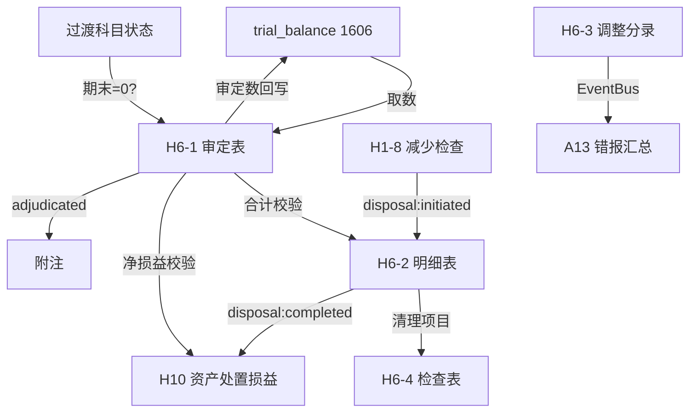

# Design Document: H6 固定资产清理底稿专属HTML精美组件

## Overview

H6固定资产清理底稿专属组件`h6-asset-disposal-clearing`。H循环精简底稿（1个xlsx/8 sheet/~100+公式）。科目1606固定资产清理（借方/资产类，过渡科目）。

核心架构：
- componentType `h6-asset-disposal-clearing`，主入口 GtH6AssetDisposalClearing.vue
- **过渡科目特殊**：期末余额应为0（清理完毕结转H10）
- **无内部el-tabs**：sheetName prop v-if分发
- composable分层：useH6FormData + useH6FormulaEngine(纯函数) + useH6CrossSheet + useH6DualMode + useH6ImportExport
- EventBus联动：TB回写(1606) + H1处置(subscribe) + H10损益(publish) + 附注
- 双模式（HTML ↔ OnlyOffice）

## Architecture

### sheetName分发模式

```
sheetName → regex提取编码 → v-if匹配 → 子组件渲染
                                     ↘ 未匹配 → OnlyOffice fallback
```

### 过渡科目状态指示

```
statusBar (主入口顶部):
  ├── 期末余额 === 0 → 🟢 "所有清理已结转"
  └── 期末余额 !== 0 → 🔴 "存在未结转项目，余额：xxx元"
```

### 文件结构

```
audit-platform/frontend/src/components/workpaper/
├── GtH6AssetDisposalClearing.vue           # 主入口 sheetName v-if分发 + 过渡科目状态栏
├── h6/
│   ├── core/
│   │   ├── H6TabIndex.vue                  # 底稿目录（进度条+8行+状态指示）
│   │   ├── H6TabAdjudication.vue           # H6-1 审定表（59公式+期末应为零）
│   │   ├── H6TabDetail.vue                 # H6-2 明细表（25列2区块）
│   │   ├── H6TabAdjustment.vue             # H6-3 调整分录
│   │   ├── H6TabDisclosureListed.vue       # 附注上市公司
│   │   └── H6TabDisclosureSoe.vue          # 附注国企
│   └── inspection/
│       └── H6TabCheck.vue                  # H6-4 检查表（18列，清理过程检查）
├── composables/
│   ├── useH6FormData.ts                    # 数据加载/保存/selfLoad/writebackTB
│   ├── useH6FormulaEngine.ts               # 纯函数公式引擎（过渡科目+清理损益）
│   ├── useH6CrossSheet.ts                 # 跨sheet联动+跨底稿联动(H1/H10)
│   ├── useH6DualMode.ts                   # 双模式切换
│   ├── useH6ImportExport.ts               # 导入导出三级
│   ├── useH6Adjudication.ts               # H6-1 审定表composable
│   ├── useH6Detail.ts                     # H6-2 明细表composable
│   ├── useH6Adjustment.ts                # H6-3 调整分录composable
│   └── useH6Check.ts                     # H6-4 检查表composable
```

### 后端文件结构

```
audit-platform/backend/
├── app/workpaper_engine/renderers/
│   └── h6_asset_disposal_clearing_renderer.py
├── app/routers/
│   └── h6_asset_disposal_clearing.py       # 3端点：导出模板/导出数据/导入数据
├── app/services/
│   └── h6_asset_disposal_clearing_service.py
└── data/wp_render_schema/
    └── h6-asset-disposal-clearing.yaml
```

## Composable接口设计

### useH6FormulaEngine.ts（纯函数）

```typescript
export function calcAuditedAmount(unadj: number, aje: number, rje: number): number
export function calcAssetEndBalance(begin: number, debit: number, credit: number): number
export function calcNetBookValue(cost: number, accDep: number): number
export function calcDisposalGainLoss(income: number, netValue: number, expenses: number, tax: number): number
export function calcSubtotal(arr: number[]): number
export function isTransitBalanceZero(endBalance: number): boolean
```

### useH6CrossSheet.ts

```typescript
export function useH6CrossSheet(allResponses: Ref<Map<string, any>>) {
  const adjudicationVsDetail: ComputedRef<{ diff: number; isMatch: boolean }>
  const transitAccountStatus: ComputedRef<{ isZero: boolean; balance: number }>
  const disposalGainLossVsH10: ComputedRef<{ diff: number; isMatch: boolean }>
}
```

## 数据流图



## ADR

### ADR-1: 过渡科目期末余额校验是核心

1606固定资产清理是过渡科目，正常情况期末余额为0。若期末不为零，说明存在未完成清理项目。此校验在UI中始终可见（状态栏+审定表红色警告），提醒审计师关注。

### ADR-2: 双向联动H1和H10

H6承上启下：H1-8减少检查的"处置"类项目自动创建H6清理明细行；H6清理完成后结转损益自动通知H10。通过EventBus实现双向松耦合联动。

### ADR-3: 清理过程检查表与明细表联动

H6-4检查表每行对应H6-2明细表的一个清理项目，通过清理项目编号关联。检查表验证清理过程合规性（审批/评估/税务/会计）。

## Correctness Properties

| ID | Property | 验证方法 |
|----|----------|---------|
| P1 | ∀ unadj,aje,rje: calcAuditedAmount(u,a,r) = u+a+r | PBT |
| P2 | ∀ begin,debit,credit: calcAssetEndBalance(b,d,c) = b+d-c | PBT |
| P3 | ∀ income,nv,exp,tax: calcDisposalGainLoss(i,nv,e,t) = i-nv-e-t | PBT |
| P4 | isTransitBalanceZero(0) = true; isTransitBalanceZero(≠0) = false | PBT |
| P5 | ∀ cost,dep: calcNetBookValue(c,d) = c-d | PBT |

## 错误处理

| 场景 | 处理方式 |
|------|---------|
| selfLoad失败 | el-empty+重试按钮 |
| TB取数无科目1606 | 提示"请先导入试算平衡表" |
| 过渡科目期末≠0 | 红色状态栏+审定表警告 |
| H10数据缺失 | 黄色警告"H10未创建或无数据" |
| OO健康检查失败 | 降级HTML视图 |
