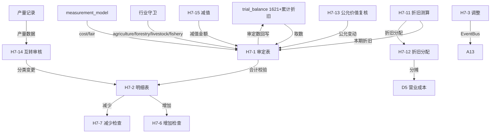

# Design Document: H7 生产性生物资产底稿专属HTML精美组件

## Overview

H7生产性生物资产底稿专属组件`h7-biological-assets`。行业特殊+双计量模式底稿（1个xlsx/26有效sheet/~250+公式）。科目1621生产性生物资产（借方/资产类）+ 累计折旧（贷方/备抵类）。

核心架构：
- componentType `h7-biological-assets`，主入口 GtH7BiologicalAssets.vue
- **行业适用性守卫**：applicable_when industry IN ['agriculture','forestry','livestock','fishery']
- **双计量模式(MEASUREMENT_MODEL_FILTER)**：cost/fair_value控制H7-1/H7-2/H7-6/H7-7显隐
- **H7-11折旧分支选择器**（不含减值/含减值）
- **H7-14产量记录**（H7独有功能）
- composable分层：useH7FormData + useH7FormulaEngine + useH7DepreciationEngine + useH7TransferEngine + useH7CrossSheet + useH7MeasurementModel + useH7IndustryGuard + useH7DualMode + useH7ImportExport
- EventBus联动：TB回写(1621+累计折旧) + 折旧分摊(D5) + 附注

## Architecture

### sheetName分发模式（含measurement_model）

```
sheetName → regex提取编码 → v-if匹配
  ├── H7-1 → measurementModel === 'cost' ? H7TabAdjudicationCost : H7TabAdjudicationFair
  ├── H7-2 → measurementModel === 'cost' ? H7TabDetailCost : H7TabDetailFair
  ├── H7-6 → measurementModel === 'cost' ? H7TabAdditionCost : H7TabAdditionFair
  ├── H7-7 → measurementModel === 'cost' ? H7TabDisposalCost : H7TabDisposalFair
  ├── H7-11 → depBranch === '不含减值' ? H7TabDepNoImpair : H7TabDepWithImpair
  ├── H7-13 → H7TabFairValueReview (公允模式核心)
  └── 其他 → 直接分发
  └── 未匹配 → OnlyOffice fallback
```

### measurement_model + 行业守卫

```
onMounted:
  1. 行业守卫 → industry NOT IN agriculture/forestry/livestock/fishery → el-empty
  2. measurementModel切换: el-segmented("成本模式"/"公允价值模式")

成本模式可见: H7-1(成本)/H7-2(成本)/H7-6(成本)/H7-7(成本)/H7-11/H7-12/H7-15/H7-16
公允模式可见: H7-1(公允)/H7-2(公允)/H7-6(公允)/H7-7(公允)/H7-13
共用sheet: H7-3/H7-4/H7-5/H7-8~10/H7-14/H7-17/附注
```

### 文件结构

```
audit-platform/frontend/src/components/workpaper/
├── GtH7BiologicalAssets.vue                 # 主入口 + 行业守卫 + measurementModel
├── h7/
│   ├── core/
│   │   ├── H7TabIndex.vue                   # 底稿目录
│   │   ├── H7TabAdjudicationCost.vue        # H7-1 成本模式审定表
│   │   ├── H7TabAdjudicationFair.vue        # H7-1 公允模式审定表
│   │   ├── H7TabDetailCost.vue              # H7-2 成本模式明细
│   │   ├── H7TabDetailFair.vue              # H7-2 公允模式明细
│   │   ├── H7TabAdjustment.vue              # H7-3 调整分录
│   │   ├── H7TabAnalysis.vue                # H7-5 分析表
│   │   ├── H7TabDisclosureListed.vue        # 附注上市
│   │   └── H7TabDisclosureSoe.vue           # 附注国企
│   ├── inspection/
│   │   ├── H7TabPolicyCheck.vue             # H7-4 会计政策（CAS5）
│   │   ├── H7TabAdditionCost.vue            # H7-6 增加（成本）
│   │   ├── H7TabAdditionFair.vue            # H7-6 增加（公允）
│   │   ├── H7TabDisposalCost.vue            # H7-7 减少（成本）
│   │   ├── H7TabDisposalFair.vue            # H7-7 减少（公允）
│   │   ├── H7TabTransferReview.vue          # H7-14 互转审核
│   │   └── H7TabRelatedParty.vue            # H7-17 关联交易
│   ├── stocktake/
│   │   ├── H7TabStocktakePlan.vue           # H7-8 监盘计划
│   │   ├── H7TabStocktakeCheck.vue          # H7-9 盘点检查
│   │   └── H7TabStocktakeSummary.vue        # H7-10 监盘小结
│   ├── depreciation/
│   │   ├── H7TabDepreciationNoImpair.vue    # H7-11(A) 不含减值
│   │   ├── H7TabDepreciationWithImpair.vue  # H7-11(B) 含减值
│   │   └── H7TabDepreciationAlloc.vue       # H7-12 折旧分配
│   ├── impairment/
│   │   ├── H7TabImpairment.vue              # H7-15 减值测算
│   │   └── H7TabRecoverable.vue             # H7-16 可收回金额
│   ├── fairvalue/
│   │   └── H7TabFairValueReview.vue         # H7-13 公允价值复核
│   └── production/
│       └── H7TabProductionRecord.vue        # 产量记录（H7独有）
├── composables/
│   ├── useH7FormData.ts
│   ├── useH7FormulaEngine.ts               # 纯函数公式引擎
│   ├── useH7DepreciationEngine.ts          # 纯函数折旧引擎（直线法）
│   ├── useH7TransferEngine.ts              # 纯函数互转引擎（三方向）
│   ├── useH7CrossSheet.ts
│   ├── useH7MeasurementModel.ts            # 计量模式切换
│   ├── useH7IndustryGuard.ts               # 行业守卫
│   ├── useH7DualMode.ts
│   ├── useH7ImportExport.ts
│   └── [sheet-specific composables]
```

### 后端文件结构

```
audit-platform/backend/
├── app/workpaper_engine/renderers/
│   └── h7_biological_assets_renderer.py     # RENDERER_DISPATCH + 行业校验
├── app/routers/
│   └── h7_biological_assets.py              # 4端点
├── app/services/
│   └── h7_biological_assets_service.py      # 业务逻辑+行业检查
└── data/wp_render_schema/
    └── h7-biological-assets.yaml
```

## Composable接口设计

### useH7FormulaEngine.ts

```typescript
export function calcAuditedAmount(unadj: number, aje: number, rje: number): number
export function calcAssetEndBalance(begin: number, debit: number, credit: number): number
export function calcContraEndBalance(begin: number, debit: number, credit: number): number
export function calcFairEndBalance(begin: number, increase: number, decrease: number, fairChange: number): number
export function calcNetValue(cost: number, accDep: number, impairment: number): number
export function calcSubtotal(arr: number[]): number
export function calcChangeRate(current: number, prior: number): number
export function calcPriceDiffRate(transPrice: number, marketPrice: number): number
export function calcFairValueDiffRate(assessed: number, bookValue: number): number
```

### useH7DepreciationEngine.ts

```typescript
export function calcStraightLine(cost: number, salvageRate: number, usefulLife: number): number
export function calcMonthlyDep(annualDep: number): number
export function calcDepAfterImpairment(netValue: number, salvageRate: number, remainLife: number): number
export function calcAccDep(monthlyDep: number, months: number): number
```

### useH7TransferEngine.ts

```typescript
// 生产性→消耗性
export function calcProdToConsumable(bookValue: number): { transferOut: number; transferIn: number }
// 生产性→公益性
export function calcProdToPublic(bookValue: number): { transferOut: number; transferIn: number }
// 互转差额（应为0）
export function calcTransferDiff(transferOut: number, transferIn: number): number
```

## 数据流图



## ADR

### ADR-1: 双计量模式复用H3模式

H7的成本/公允价值模式与H3投资性房地产完全一致：el-segmented切换 + 4对sheet双版本 + 数据独立存储。代码结构可参考H3的useH3MeasurementModel。

### ADR-2: 行业适用性前后端双重校验

与H5相同模式：前端mount检查+后端创建API校验。

### ADR-3: 产量记录是H7独有功能

生产性生物资产的核心特征是"产出"（产蛋/产奶/割胶/收获果实等），需记录产量以评估资产生产能力。此功能在H循环其他底稿中不存在。

### ADR-4: 互转三方向

生物资产可在生产性/消耗性/公益性三类间互转。互转审核表验证分类变更的合规性和会计处理正确性（互转时账面价值应完整结转，差额为0）。

## Correctness Properties

| ID | Property | 验证方法 |
|----|----------|---------|
| P1 | ∀ unadj,aje,rje: calcAuditedAmount = u+a+r | PBT |
| P2 | ∀ b,d,c: calcAssetEndBalance = b+d-c | PBT |
| P3 | ∀ b,d,c: calcContraEndBalance = b+c-d | PBT |
| P4 | ∀ b,i,d,fc: calcFairEndBalance = b+i-d+fc | PBT |
| P5 | ∀ cost,rate,life: calcStraightLine = cost×(1-rate)/life | PBT |
| P6 | ∀ annualDep: calcMonthlyDep = annualDep/12 | PBT |
| P7 | ∀ out,in: calcTransferDiff(out,in) = out-in | PBT |
| P8 | ∀ arr: calcSubtotal = Σarr | PBT |
| P9 | ∀ c,d,i: calcNetValue = c-d-i | PBT |
| P10 | ∀ current,prior(≠0): calcChangeRate = (current-prior)/prior×100 | PBT |
| P11 | ∀ assessed,book(≠0): calcFairValueDiffRate = (assessed-book)/book×100 | PBT |
| P12 | H7-1审定合计 = H7-2明细合计 | 集成测试 |

## 错误处理

| 场景 | 处理方式 |
|------|---------|
| 行业不匹配 | el-empty + 提示仅适用农林牧渔 |
| selfLoad失败 | el-empty+重试 |
| TB无科目1621 | 提示导入试算表 |
| 公允模式访问折旧sheet | 显示提示"公允价值模式不计提折旧" |
| OO健康检查失败 | 降级HTML |
| 产量变动>30% | 黄色高亮预警 |
