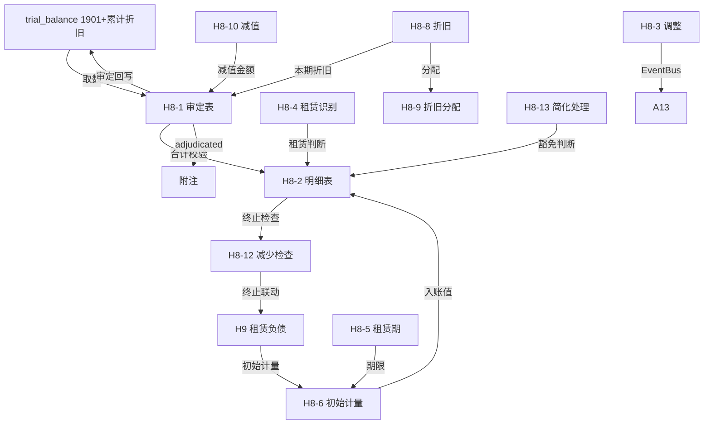

# Design Document: H8 使用权资产底稿专属HTML精美组件

## Overview

H8使用权资产底稿专属组件`h8-right-of-use-assets`。CAS21新租赁准则核心底稿（1个xlsx/20有效sheet/~250+公式）。科目1901使用权资产（借方/资产类）+ 累计折旧（贷方/备抵类）。

核心架构：
- componentType `h8-right-of-use-assets`，主入口 GtH8RightOfUseAssets.vue
- **CAS21准则核心**：与H9租赁负债强联动（H8=H9+直接费用-激励）
- **H8-6双分支**（按年/按月计量）+ **H8-8双分支**（不含/含减值）
- composable分层：useH8FormData + useH8FormulaEngine + useH8CAS21Engine(纯函数) + useH8CrossSheet + useH8DualMode + useH8ImportExport
- EventBus联动：TB回写(1901+累计折旧) + H9双向联动 + 附注

## Architecture

### sheetName分发模式

```
sheetName → regex提取编码 → v-if匹配
  ├── H8-6 → measurementBranch === '按年' ? H8TabMeasurementAnnual : H8TabMeasurementMonthly
  ├── H8-8 → depBranch === '不含减值' ? H8TabDepNoImpair : H8TabDepWithImpair
  └── 其他 → 直接分发
  └── 未匹配 → OnlyOffice fallback
```

### H8-6 / H8-8 分支选择器

```
H8-6: el-segmented v-model="measurementBranch"
  ├── "按年计量" → H8TabMeasurementAnnual.vue (59行13列9公式)
  └── "按月计量" → H8TabMeasurementMonthly.vue (361行16列)

H8-8: el-segmented v-model="depreciationBranch"
  ├── "不含减值" → H8TabDepreciationNoImpair.vue (51行25列62公式)
  └── "含减值"   → H8TabDepreciationWithImpair.vue (49行27列86公式)
```

### 文件结构

```
audit-platform/frontend/src/components/workpaper/
├── GtH8RightOfUseAssets.vue                 # 主入口 + H9联动状态
├── h8/
│   ├── core/
│   │   ├── H8TabIndex.vue                   # 底稿目录
│   │   ├── H8TabAdjudication.vue            # H8-1 审定表（51公式+H9联动校验）
│   │   ├── H8TabDetail.vue                  # H8-2 明细表（58列4区段）
│   │   ├── H8TabAdjustment.vue              # H8-3 调整分录
│   │   ├── H8TabDisclosureListed.vue        # 附注上市
│   │   └── H8TabDisclosureSoe.vue           # 附注国企
│   ├── lease-judgment/
│   │   ├── H8TabLeaseIdentification.vue     # H8-4 租赁识别（段落型90行）
│   │   ├── H8TabLeaseTerm.vue               # H8-5 租赁期确定（段落型52行）
│   │   └── H8TabLeaseModification.vue       # H8-7 租赁变更（100行11列）
│   ├── measurement/
│   │   ├── H8TabMeasurementAnnual.vue       # H8-6(A) 按年（OO）
│   │   └── H8TabMeasurementMonthly.vue      # H8-6(B) 按月（OO）
│   ├── depreciation/
│   │   ├── H8TabDepreciationNoImpair.vue    # H8-8(A) 不含减值（62公式）
│   │   ├── H8TabDepreciationWithImpair.vue  # H8-8(B) 含减值（86公式）
│   │   └── H8TabDepreciationAlloc.vue       # H8-9 折旧分配
│   ├── impairment/
│   │   ├── H8TabImpairment.vue              # H8-10 减值
│   │   └── H8TabRecoverable.vue             # H8-11 可收回金额
│   └── inspection/
│       ├── H8TabDisposalCheck.vue           # H8-12 减少检查（租赁终止）
│       ├── H8TabSimplifiedCheck.vue         # H8-13 简化处理检查
│       └── H8TabRelatedParty.vue            # H8-14 关联交易
├── composables/
│   ├── useH8FormData.ts
│   ├── useH8FormulaEngine.ts               # 纯函数公式引擎
│   ├── useH8CAS21Engine.ts                 # CAS21计量纯函数（核心）
│   ├── useH8CrossSheet.ts                  # 跨sheet + H9联动
│   ├── useH8DualMode.ts
│   ├── useH8ImportExport.ts
│   └── [sheet-specific composables]
```

### 后端文件结构

```
audit-platform/backend/
├── app/workpaper_engine/renderers/
│   └── h8_right_of_use_assets_renderer.py
├── app/routers/
│   └── h8_right_of_use_assets.py           # 3端点
├── app/services/
│   └── h8_right_of_use_assets_service.py   # CAS21逻辑+H9联动验证
└── data/wp_render_schema/
    └── h8-right-of-use-assets.yaml
```

## Composable接口设计

### useH8FormulaEngine.ts

```typescript
export function calcAuditedAmount(unadj: number, aje: number, rje: number): number
export function calcAssetEndBalance(begin: number, debit: number, credit: number): number
export function calcContraEndBalance(begin: number, debit: number, credit: number): number
export function calcNetValue(cost: number, accDep: number, impairment: number): number
export function calcSubtotal(arr: number[]): number
```

### useH8CAS21Engine.ts（核心）

```typescript
// 初始计量：H8 = H9初始 + 直接费用 - 激励
export function calcInitialMeasurement(leaseLiability: number, directCost: number, incentive: number): number
// 折旧期确定：min(租赁期, 使用寿命)
export function calcDepreciationPeriod(leaseTerm: number, usefulLife: number): number
// 终止损益：租赁负债余额 - 使用权净值
export function calcTerminationGainLoss(liabilityBalance: number, rouNetValue: number): number
// 重新计量
export function calcRemeasurement(oldROU: number, adjustment: number): number
// 简化判断：是否短期
export function isShortTermLease(leaseTermMonths: number): boolean
// 简化判断：是否低价值
export function isLowValueLease(newAssetValue: number, threshold?: number): boolean
```

### useH8CrossSheet.ts

```typescript
export function useH8CrossSheet(allResponses: Ref<Map<string, any>>) {
  const adjudicationVsDetail: ComputedRef<{ diff: number; isMatch: boolean }>
  const h8VsH9Linkage: ComputedRef<{ diff: number; isConsistent: boolean; message: string }>
  const depreciationVsAdjudication: ComputedRef<{ diff: number; isMatch: boolean }>
}
```

## 数据流图



## ADR

### ADR-1: H8与H9是CAS21配对底稿

H8使用权资产和H9租赁负债是CAS21新租赁准则的两个配对底稿。初始确认时H8=H9+直接费用-激励。后续H8折旧、H9利息各自计算但终止时需同步。通过CrossSheet+EventBus实现双向联动。

### ADR-2: H8-6按年/按月是两种精度视图

按年计量（59行）适合简单租赁、按月计量（361行，约30年×12月）适合复杂/长期租赁。两者数据本质相同但粒度不同，通过分支选择器切换。

### ADR-3: 租赁判断三表是CAS21特有

H8-4/H8-5/H8-7三个检查表对应CAS21的三个核心判断：是否租赁→租赁期多长→是否变更。这是CAS21独有的判断流程，其他H循环底稿没有类似结构。

## Correctness Properties

| ID | Property | 验证方法 |
|----|----------|---------|
| P1 | ∀ u,a,r: calcAuditedAmount = u+a+r | PBT |
| P2 | ∀ b,d,c: calcAssetEndBalance = b+d-c | PBT |
| P3 | ∀ b,d,c: calcContraEndBalance = b+c-d | PBT |
| P4 | ∀ ll,dc,inc: calcInitialMeasurement = ll+dc-inc | PBT |
| P5 | ∀ lt,ul: calcDepreciationPeriod = min(lt,ul) | PBT |
| P6 | ∀ lb,nv: calcTerminationGainLoss = lb-nv | PBT |
| P7 | isShortTermLease(months≤12) = true | PBT |
| P8 | isLowValueLease(value≤40000) = true | PBT |
| P9 | H8初始-直接+激励 ≈ H9初始（±1元容差） | 集成测试 |
| P10 | ∀ arr: calcSubtotal = Σarr | PBT |

## 错误处理

| 场景 | 处理方式 |
|------|---------|
| selfLoad失败 | el-empty+重试 |
| H9数据未创建 | 黄色警告"请先完成H9租赁负债编制" |
| H8-H9不一致 | 红色警告+差额显示 |
| TB无科目1901 | 提示导入试算表 |
| OO健康检查失败 | 降级HTML |
| 简化条件不满足 | 红色高亮提示应确认ROU |
