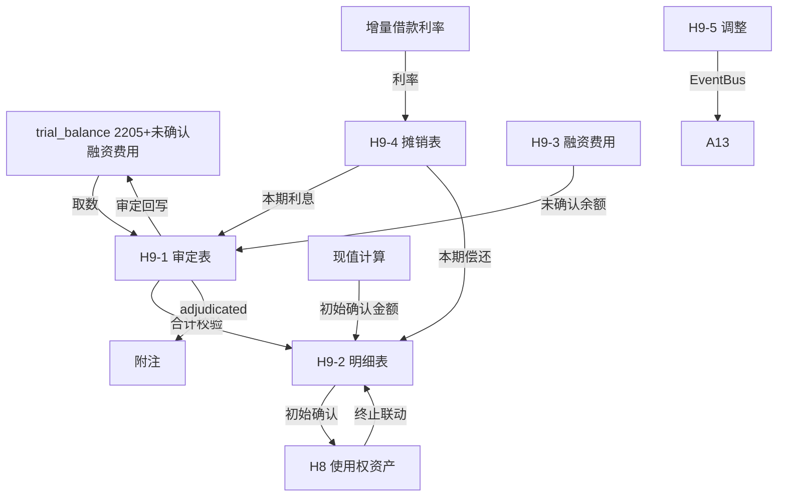

# Design Document: H9 租赁负债底稿专属HTML精美组件

## Overview

H9租赁负债底稿专属组件`h9-lease-liabilities`。CAS21配对底稿（1个xlsx/~10 sheet/~150+公式）。科目2205租赁负债（贷方/负债类）+ 未确认融资费用（借方/负债备抵类）。

核心架构：
- componentType `h9-lease-liabilities`，主入口 GtH9LeaseLiabilities.vue
- **CAS21配对底稿**：与H8使用权资产强联动
- **摊销表是核心**：实际利率法（利息=期初×利率；本金=付款-利息）
- **负债类贷方科目**：期末=期初+贷方-借方（与资产类相反！）
- composable分层：useH9FormData + useH9FormulaEngine + useH9AmortizationEngine(纯函数) + useH9PVEngine(纯函数) + useH9CrossSheet + useH9DualMode + useH9ImportExport
- EventBus联动：TB回写(2205+未确认融资费用) + H8双向联动 + 附注

## Architecture

### sheetName分发模式

```
sheetName → regex提取编码 → v-if匹配 → 子组件渲染
                                     ↘ 未匹配 → OnlyOffice fallback
```

### 文件结构

```
audit-platform/frontend/src/components/workpaper/
├── GtH9LeaseLiabilities.vue                 # 主入口 + H8联动状态
├── h9/
│   ├── core/
│   │   ├── H9TabIndex.vue                   # 底稿目录
│   │   ├── H9TabAdjudication.vue            # H9-1 审定表（负债类+未确认融资费用）
│   │   ├── H9TabDetail.vue                  # H9-2 租赁负债明细表
│   │   ├── H9TabFinanceCost.vue             # H9-3 未确认融资费用明细
│   │   ├── H9TabAdjustment.vue              # H9-5 调整分录
│   │   ├── H9TabDisclosureListed.vue        # 附注上市
│   │   └── H9TabDisclosureSoe.vue           # 附注国企
│   ├── amortization/
│   │   └── H9TabAmortization.vue            # H9-4 摊销表（核心！）
│   └── inspection/
│       └── H9TabRelatedParty.vue            # H9-6 关联交易
├── composables/
│   ├── useH9FormData.ts                     # 数据加载/保存/selfLoad/writebackTB
│   ├── useH9FormulaEngine.ts                # 纯函数公式引擎（负债类！贷方公式）
│   ├── useH9AmortizationEngine.ts           # 纯函数摊销引擎（实际利率法，核心）
│   ├── useH9PVEngine.ts                     # 纯函数现值引擎（折现+IBR）
│   ├── useH9CrossSheet.ts                   # 跨sheet + H8联动
│   ├── useH9DualMode.ts
│   ├── useH9ImportExport.ts
│   ├── useH9Adjudication.ts
│   ├── useH9Detail.ts
│   ├── useH9FinanceCost.ts
│   ├── useH9Amortization.ts                # 摊销表composable（合同筛选+完整表生成）
│   ├── useH9Adjustment.ts
│   └── useH9RelatedParty.ts
```

### 后端文件结构

```
audit-platform/backend/
├── app/workpaper_engine/renderers/
│   └── h9_lease_liabilities_renderer.py
├── app/routers/
│   └── h9_lease_liabilities.py              # 3端点 + 摊销表生成
├── app/services/
│   └── h9_lease_liabilities_service.py      # 现值计算+摊销验证+H8联动
└── data/wp_render_schema/
    └── h9-lease-liabilities.yaml
```

## Composable接口设计

### useH9FormulaEngine.ts（负债类！）

```typescript
// 审定数
export function calcAuditedAmount(unadj: number, aje: number, rje: number): number
// 负债类期末（贷方科目）：期末=期初+贷方-借方
export function calcLiabilityEndBalance(begin: number, credit: number, debit: number): number
// 备抵类期末（借方/负债备抵）：期末=期初+借方-贷方
export function calcContraLiabilityEndBalance(begin: number, debit: number, credit: number): number
// 净额
export function calcNetLiability(liability: number, unearnedFinanceCost: number): number
// 合计
export function calcSubtotal(arr: number[]): number
// 价差率
export function calcPriceDiffRate(actual: number, market: number): number
```

### useH9AmortizationEngine.ts（核心）

```typescript
// 每期利息=期初余额×利率
export function calcInterest(beginBalance: number, rate: number): number
// 本金偿还=每期付款-利息
export function calcPrincipal(payment: number, interest: number): number
// 期末余额=期初-本金
export function calcEndBalance(beginBalance: number, principal: number): number
// 生成完整摊销表
export function generateSchedule(
  initialBalance: number,
  payment: number,
  rate: number,
  periods: number
): AmortizationRow[]
// 验证摊销表：最后一期期末≈0
export function validateSchedule(schedule: AmortizationRow[]): { isValid: boolean; tailDiff: number }

interface AmortizationRow {
  period: number
  beginBalance: number
  payment: number
  interest: number
  principal: number
  endBalance: number
}
```

### useH9PVEngine.ts

```typescript
// 现值计算（不等额）
export function calcPresentValue(payments: number[], rate: number): number
// 等额年金现值
export function calcAnnuityPV(payment: number, rate: number, periods: number): number
// IBR确定
export function calcIBR(marketRate: number, creditSpread: number, termAdjust: number): number
```

### useH9CrossSheet.ts

```typescript
export function useH9CrossSheet(allResponses: Ref<Map<string, any>>) {
  const adjudicationVsDetail: ComputedRef<{ diff: number; isMatch: boolean }>
  const h9VsH8Linkage: ComputedRef<{ diff: number; isConsistent: boolean }>
  const amortizationVsAdjudication: ComputedRef<{ diff: number; isMatch: boolean }>
}
```

## 数据流图



## ADR

### ADR-1: H9是负债类贷方科目

H9租赁负债是负债类科目（贷方余额），公式方向与H1~H8资产类相反：期末=期初+贷方-借方。这是H9与其他H循环底稿的根本差异，需在Formula_Engine中明确区分。

### ADR-2: 摊销表是核心

H9-4摊销表是整个H9的核心计算，每期利息和本金分摊决定了当期财务费用和负债变动。实际利率法保证利息费用在租赁期内系统化确认。摊销表的正确性直接影响H9审定数。

### ADR-3: 现值折现是初始确认关键

租赁负债初始确认=未来租金的现值。需要：①确定未来各期付款金额 ②确定增量借款利率(IBR) ③折现计算。这三步缺一不可。

### ADR-4: 与H8配对联动

H9初始确认金额是H8入账值的核心组成（H8=H9+直接费用-激励）。两者必须在合同级别一一对应，且初始金额可交叉验证。

## Correctness Properties

| ID | Property | 验证方法 |
|----|----------|---------|
| P1 | ∀ u,a,r: calcAuditedAmount = u+a+r | PBT |
| P2 | ∀ b,cr,dr: calcLiabilityEndBalance = b+cr-dr（负债类！） | PBT |
| P3 | ∀ balance,rate: calcInterest = balance×rate | PBT |
| P4 | ∀ payment,interest: calcPrincipal = payment-interest | PBT |
| P5 | ∀ begin,principal: calcEndBalance = begin-principal | PBT |
| P6 | ∀ schedule: 最后一期endBalance≈0 | PBT |
| P7 | ∀ payments,rate: calcPresentValue = Σ(p/(1+r)^n) | PBT |
| P8 | rate=0时 PV=Σpayments | PBT |

## 错误处理

| 场景 | 处理方式 |
|------|---------|
| selfLoad失败 | el-empty+重试 |
| H8数据未创建 | 黄色警告"请先完成H8使用权资产编制" |
| H8-H9不一致 | 红色警告+差额 |
| TB无科目2205 | 提示导入试算表 |
| 利率为0 | PV=付款之和 + 黄色提示"利率为0" |
| 摊销表尾差>1 | 红色高亮最后一期 |
