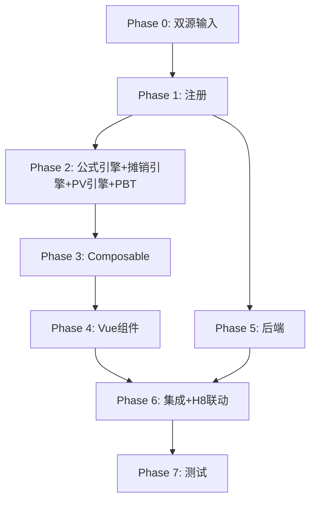

# Implementation Plan: H9 租赁负债底稿专属HTML精美组件

## Overview

H9租赁负债底稿专属组件`h9-lease-liabilities`。CAS21配对底稿（~10 sheet/1 xlsx/~150+公式）。

主入口 GtH9LeaseLiabilities.vue（sheetName v-if，defineAsyncComponent lazy）+ 9个子组件 + 13个composable + 后端3个py文件。

科目：2205租赁负债（贷方/负债类）+ 未确认融资费用（借方/负债备抵类）
公式特征：**负债类贷方**期末=期初+贷方-借方；实际利率法利息=期初×利率；现值折现

## Tasks

### Phase 0: 双源输入验证

- [x] 0.1 openpyxl脚本读取H9租赁负债.xlsx全部sheet
  - 提取结构 + 确认摊销表sheet结构
  - 产出：h9_structure_summary.json
  - _Requirements: 双源输入流程_

- [x] 0.2 H固定资产循环底稿模板库md交叉验证
  - 核对：CAS21准则/H8联动/实际利率法/现值公式
  - 产出：h9_conflict_resolution.md
  - _Requirements: 双源输入流程_

### Phase 1: 注册+契约测试

- [x] 1.1 注册componentType和映射
  - wp_code_overrides: H9/H9-1~H9-6/H9A → 'h9-lease-liabilities'
  - VALID_COMPONENT_TYPES + htmlRendererRegistry注册
  - 创建 GtH9LeaseLiabilities.vue 骨架（sheetName v-if + selfLoad + H8联动状态）
  - _Requirements: 1.1-1.10_

- [x] 1.2 编写注册契约测试
  - htmlRendererRegistry / VALID_COMPONENT_TYPES / wp_code_overrides / RENDERER_DISPATCH
  - _Requirements: 1.6, 1.7, 1.8_

### Phase 2: 公式引擎+PBT

- [x] 2.1 创建 `useH9FormulaEngine.ts`（负债类！）
  - calcAuditedAmount / calcLiabilityEndBalance(b,cr,dr)=b+cr-dr
  - calcContraLiabilityEndBalance / calcNetLiability / calcSubtotal / calcPriceDiffRate
  - _Requirements: 2.3-2.5_

- [x] 2.2 创建 `useH9AmortizationEngine.ts`（核心）
  - calcInterest / calcPrincipal / calcEndBalance / generateSchedule / validateSchedule
  - _Requirements: 7.1-7.5_

- [x] 2.3 创建 `useH9PVEngine.ts`
  - calcPresentValue / calcAnnuityPV / calcIBR
  - _Requirements: 6.1-6.4_

- [x]* 2.4 编写 Property P1 PBT：审定数公式链
  - 断言：calcAuditedAmount(u, a, r) === u + a + r
  - **Feature: h9-lease-liabilities, Property P1: 审定数公式链**

- [x]* 2.5 编写 Property P2 PBT：负债类期末（贷方！）
  - 生成器：fc.float({min:0, max:1e9}) × 3 (begin, credit, debit)
  - 断言：calcLiabilityEndBalance(b, cr, dr) === b + cr - dr
  - **Feature: h9-lease-liabilities, Property P2: 负债类贷方期末余额**

- [x]* 2.6 编写 Property P3 PBT：实际利率法利息
  - 生成器：balance>0, rate∈(0,0.2)
  - 断言：calcInterest(balance, rate) === balance × rate
  - **Feature: h9-lease-liabilities, Property P3: 实际利率法利息**

- [x]* 2.7 编写 Property P4 PBT：本金=付款-利息
  - 生成器：payment>interest>0
  - 断言：calcPrincipal(payment, interest) === payment - interest
  - **Feature: h9-lease-liabilities, Property P4: 本金拆分**

- [x]* 2.8 编写 Property P5 PBT：期末=期初-本金
  - 生成器：begin>principal>0
  - 断言：calcEndBalance(begin, principal) === begin - principal
  - **Feature: h9-lease-liabilities, Property P5: 期末余额递减**

- [x]* 2.9 编写 Property P6 PBT：摊销表最后一期≈0
  - 生成器：initialBalance, payment(能在periods内还清), rate, periods
  - 断言：|generateSchedule(...).last.endBalance| < 1
  - **Feature: h9-lease-liabilities, Property P6: 摊销表终止余额趋零**

- [x]* 2.10 编写 Property P7 PBT：现值公式
  - 生成器：equal payments, rate>0, periods>0
  - 断言：calcAnnuityPV(p, r, n) ≈ p×(1-(1+r)^-n)/r
  - **Feature: h9-lease-liabilities, Property P7: 年金现值公式**

- [x]* 2.11 编写 Property P8 PBT：利率为0时PV=Σ付款
  - 生成器：payments array, rate=0
  - 断言：calcPresentValue(payments, 0) === Σpayments
  - **Feature: h9-lease-liabilities, Property P8: 零利率现值恒等**

### Phase 3: Composable层

- [x] 3.1 创建 useH9FormData.ts
  - selfLoad + checklist_responses + writebackTB(2205+未确认融资费用)
  - _Requirements: 1.9, 1.10, 2.8_

- [x] 3.2 创建 useH9CrossSheet.ts
  - adjudicationVsDetail / h9VsH8Linkage / amortizationVsAdjudication
  - _Requirements: 2.6, 2.7, 4.8, 8.1-8.4_

- [x] 3.3 创建 useH9DualMode.ts + useH9ImportExport.ts
  - 双模式切换 + 导入导出三级
  - _Requirements: 3.6_

- [x] 3.4 创建 sheet-specific composables
  - useH9Adjudication / useH9Detail / useH9FinanceCost
  - useH9Amortization / useH9Adjustment / useH9RelatedParty
  - _Requirements: 2~5 全部_

### Phase 4: Vue子组件

- [x] 4.1 创建 H9TabIndex.vue 底稿目录
  - ~10行+进度条+H8联动状态
  - _Requirements: 1.2_

- [x] 4.2 创建 H9TabAdjudication.vue 审定表H9-1
  - 负债类双区块+H8联动校验区域+TB回写
  - _Requirements: 2.1-2.8, 8.1-8.4_

- [x] 4.3 创建 H9TabDetail.vue + H9TabFinanceCost.vue
  - 明细表(按合同+H8对应) + 融资费用明细
  - _Requirements: 3.1-3.6_

- [x] 4.4 创建 H9TabAmortization.vue 摊销表（核心！）
  - 实际利率法完整摊销表+合同筛选+末期验证+与审定交叉
  - _Requirements: 4.1-4.8_

- [x] 4.5 创建 H9TabAdjustment.vue + H9TabRelatedParty.vue
  - 调整10列+借贷平衡 + 关联15列+价差率
  - _Requirements: 5.1-5.4_

- [x] 4.6 创建 H9TabDisclosureListed/Soe.vue
  - 附注
  - _Requirements: 1.2_

### Phase 5: 后端

- [x] 5.1 创建 h9_lease_liabilities_renderer.py
  - RENDERER_DISPATCH注册 + 负债类公式验证
  - _Requirements: 1.6_

- [x] 5.2 创建 h9_lease_liabilities.py 路由
  - 导出模板/导出数据/导入数据 + 摊销表生成API
  - _Requirements: 3.6, 4.7_

- [x] 5.3 创建 h9_lease_liabilities_service.py
  - 现值计算+摊销验证+H8联动校验
  - _Requirements: 6.1-6.4, 7.1-7.5, 8.1-8.4_

### Phase 6: 集成

- [x] 6.1 EventBus集成
  - publish 'substantive:adjudicated' / 'adjustment:created'
  - subscribe H8 updates (终止/变更)
  - bidirectional H8↔H9 linkage
  - _Requirements: 8.1-8.4_

- [x] 6.2 跨底稿联动
  - H9-2每笔合同 ↔ H8-2 GtIndexChip
  - H9审定 → TB回写(2205+未确认融资费用)
  - _Requirements: 2.8, 3.3, 8.3_

### Phase 7: 测试

- [x] 7.1 单元测试：useH9FormulaEngine + useH9AmortizationEngine + useH9PVEngine
  - 负债类方向 + 摊销正确性 + 现值精度 + 边界(rate=0/periods=0)
  - _Requirements: P1-P8_

- [x] 7.2 集成测试：H8-H9联动 + 摊销表验证
  - 初始确认一致 / 合同配对 / 摊销末期≈0
  - _Requirements: 4.5-4.8, 8.1-8.4_

- [x] 7.3 Playwright E2E
  - 完整流程：打开H9→审定→明细→摊销表(选合同)→H8联动验证→保存
  - _Requirements: 全部_

## Task Dependency Graph

