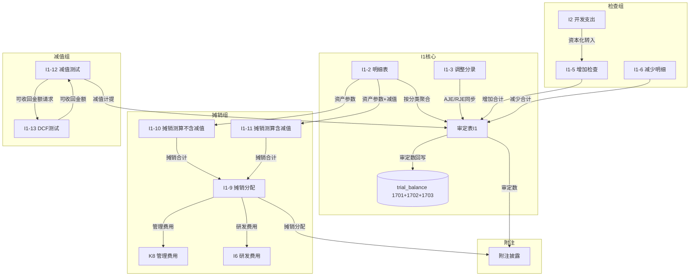

# Design Document: I1 无形资产、累计摊销及减值准备底稿专属HTML精美组件

## Overview

I1无形资产底稿专属组件`i1-intangible-assets`。I循环最大单底稿（1个xlsx/18有效sheet/~200+公式）。科目1701无形资产（借方/资产类）+ 1702累计摊销（贷方/备抵类）+ 1703无形资产减值准备（贷方/备抵类）。

核心架构：
- componentType `i1-intangible-assets`，主入口 GtI1IntangibleAssets.vue
- **无内部el-tabs**：外层GtWpRenderer chips导航，sheetName v-if分发
- 每个sheet独立子组件 + 独立composable
- composable分层：useI1FormData + useI1FormulaEngine(纯函数) + useI1AmortizationEngine(纯函数) + useI1CrossSheet + useI1DualMode + useI1ImportExport
- 摊销分支选择器：I1-10(不含减值) vs I1-11(含减值)
- 跨sheet数据流通过allResponses Map computed响应式链
- EventBus联动：TB回写(1701+1702+1703) + 摊销分摊(K8/K9/I6) + I2资本化转入 + 附注

## Architecture

### sheetName分发模式

```
sheetName → regex提取编码 → v-if匹配 → 子组件渲染
                                     ↘ 未匹配 → OnlyOffice fallback
```

### I1-10/I1-11 分支选择器

```
el-segmented v-model="amortizationBranch"
  ├── "不含减值（I1-10）" → I1TabAmortizationNoImpair.vue（30公式）
  └── "含减值（I1-11）"   → I1TabAmortizationWithImpair.vue（63公式）
```

### 文件结构

```
audit-platform/frontend/src/components/workpaper/
├── GtI1IntangibleAssets.vue                   # 主入口 sheetName v-if分发
├── i1/
│   ├── core/
│   │   ├── I1TabIndex.vue                     # 底稿目录（进度条+18行）
│   │   ├── I1TabAdjudication.vue              # 审定表I1（三区块原值/摊销/减值+三角勾稽）
│   │   ├── I1TabDetail.vue                    # I1-2 明细表（56列4区段Tab）
│   │   ├── I1TabAdjustment.vue                # I1-3 调整分录
│   │   ├── I1TabDisclosureListed.vue          # 附注上市公司
│   │   └── I1TabDisclosureSoe.vue             # 附注国企
│   ├── inspection/
│   │   ├── I1TabPolicyCheck.vue               # I1-4 摊销减值政策检查
│   │   ├── I1TabAdditionCheck.vue             # I1-5 增加检查（+OCR+抽凭）
│   │   ├── I1TabDisposalCheck.vue             # I1-6 减少明细
│   │   ├── I1TabUsefulLifeCheck.vue           # I1-7 使用寿命检查
│   │   └── I1TabTitleCheck.vue                # I1-8 权属检查（94行大表）
│   ├── amortization/
│   │   ├── I1TabAmortizationAlloc.vue         # I1-9 摊销分配分析
│   │   ├── I1TabAmortizationNoImpair.vue      # I1-10 摊销测算（不含减值）
│   │   └── I1TabAmortizationWithImpair.vue    # I1-11 摊销测算（含减值）
│   └── impairment/
│       ├── I1TabImpairmentTest.vue            # I1-12 减值准备测试
│       └── I1TabRecoverableTest.vue           # I1-13 可收回金额（DCF）

├── composables/
│   ├── useI1FormData.ts                       # 数据加载/selfLoad/writebackTB(1701+1702+1703)
│   ├── useI1FormulaEngine.ts                  # 纯函数公式引擎（资产+备抵类公式）
│   ├── useI1AmortizationEngine.ts             # 纯函数摊销引擎（直线法/剩余年限法）
│   ├── useI1CrossSheet.ts                     # 跨sheet联动computed
│   ├── useI1Adjudication.ts                   # 审定表composable
│   ├── useI1Detail.ts                         # 明细表composable（4区段）
│   ├── useI1Adjustment.ts                     # 调整分录
│   ├── useI1Amortization.ts                   # 摊销测算（分支共用状态）
│   ├── useI1Impairment.ts                     # 减值组
│   ├── useI1Disclosure.ts                     # 附注（variant双版本）
│   ├── useI1ImportExport.ts                   # 导入导出
│   └── useI1DualMode.ts                       # 双模式OO健康检查

backend/app/routers/wp_render_strategies/
├── _i1_intangible_assets.py                   # render策略+RENDERER_DISPATCH注册
├── _i1_import_export.py                       # 导入导出3端点
├── _i1_ai_generate.py                         # AI生成
└── _i1_amortization_engine.py                 # 摊销引擎端点
```

## Composable接口设计

```typescript
// useI1FormulaEngine.ts — 纯函数
export function calcAuditedAmount(unadj: number, aje: number, rje: number): number
export function calcAssetEndBalance(begin: number, debit: number, credit: number): number  // 资产类1701
export function calcContraEndBalance(begin: number, debit: number, credit: number): number // 备抵类1702/1703
export function calcTriangleReconciliation(begin: number, increase: number, decrease: number, end: number): number
export function calcNetValue(cost: number, accAmort: number, impairment: number): number  // 净值=原值-摊销-减值
export function calcChangeRate(current: number, prior: number): number | null
export function calcSubtotal(arr: number[]): number
export function calcProportion(item: number, total: number): number | null
export function calcDisposalGainLoss(income: number, netValue: number): number
export function calcTitleDiff(bookValue: number, certValue: number): number

// useI1AmortizationEngine.ts — 纯函数摊销引擎
export function calcStraightLineAmort(cost: number, salvage: number, usefulLifeMonths: number): number
export function calcRemainingLifeAmort(cost: number, salvage: number, accAmort: number, impairment: number, remainingMonths: number): number
export function calcAmortWithImpairment(cost: number, salvage: number, accAmort: number, impairment: number, remainingMonths: number): number
export function calcDcfPresentValue(cashFlows: number[], discountRate: number): number
export function calcTerminalValue(perpetuityCF: number, discountRate: number, growthRate: number): number
export function calcRecoverableAmount(fairValueLessDisposal: number, valueInUse: number): number
export function calcImpairmentAmount(bookValue: number, recoverableAmount: number): number

// useI1CrossSheet.ts — 响应式联动
export function useI1CrossSheet(allResponses: Ref<Map<string, any>>): {
  detailTotals: ComputedRef<{cost: number, accAmort: number, impairment: number}>
  adjudicationFromDetail: ComputedRef<{costAudited: number, amortAudited: number, impairAudited: number}>
  amortizationForAlloc: ComputedRef<{byAsset: Record<string, number>, total: number}>
  disclosureAutoFill: ComputedRef<Record<string, number>>
}
```

## 跨Sheet数据流图



## Architecture Decision Records (ADR)

### ADR-1: 摊销引擎独立composable

**决策**：将摊销计算从通用FormulaEngine中拆出，独立为`useI1AmortizationEngine.ts`纯函数模块。

**理由**：
- I1摊销公式（30+63=93公式）与通用公式职责不同
- 剩余年限法需要考虑减值影响（含减值版本需重算基数），逻辑复杂
- 前后端共用同一套公式，便于PBT独立测试
- H循环折旧引擎只需直线法子集，I1可简化

**替代方案**：合并到useI1FormulaEngine → 拒绝，文件超400行且职责混淆。

### ADR-2: I1-10/I1-11分支选择器

**决策**：使用el-segmented在2个摊销版本间切换。

**理由**：
- 源xlsx中I1-10和I1-11是两个独立sheet编码但功能等价（仅是否含减值的区别）
- 用户根据是否存在减值选择其一，不需同时看两个版本
- 比H1-12的3分支简单，仅2分支

### ADR-3: 三科目审定表布局

**决策**：审定表按三科目（原值/摊销/减值）纵向三区块排列，每区块内按资产分类展开。

**理由**：
- 源xlsx 93行9列结构就是三区块纵向
- 三科目公式方向不同（1701借方 vs 1702/1703贷方），分区块有助于公式引擎分别处理
- 净值合计行在三区块之后，视觉上最终一行

## Correctness Properties

| ID | Property | 验证方式 |
|----|----------|---------|
| CP-I1-01 | 审定数=未审+AJE+RJE（对所有输入成立） | PBT |
| CP-I1-02 | 资产类期末=期初+借方-贷方（科目1701） | PBT |
| CP-I1-03 | 备抵类期末=期初+贷方-借方（科目1702/1703） | PBT |
| CP-I1-04 | 三角勾稽差额≡0当期末=期初+增加-减少 | PBT |
| CP-I1-05 | 合计行=SUM(明细行) | PBT |
| CP-I1-06 | 直线法月摊销=（原值-残值）÷总月数 | PBT |
| CP-I1-07 | 剩余年限法月摊销=（原值-残值-累计摊销-减值）÷剩余月数 | PBT |
| CP-I1-08 | DCF现值=Σ(CF_i/(1+r)^i) | PBT |
| CP-I1-09 | 可收回金额=MAX(公允-处置费, DCF) | PBT |
| CP-I1-10 | 减值金额∈[0, 账面净值] | PBT |
| CP-I1-11 | 摊销分配合计=摊销总额 | PBT |
| CP-I1-12 | 借贷平衡：SUM(借)=SUM(贷) | PBT |

## 错误处理

| 场景 | 处理 |
|------|------|
| TB取数失败 | 显示"未审数暂不可用"灰色占位，不阻塞编辑 |
| 三角勾稽不平 | 红色高亮差额行+tooltip"期末≠期初+增加-减少" |
| 摊销剩余月数≤0 | 该行摊销额=0，显示警告"已摊销完毕" |
| DCF折现率≤0 | 阻止计算，提示"折现率必须>0" |
| I2→I1转入联动失败 | 降级为手工录入，显示黄色提示 |
| OO健康检查失败 | 隐藏双模式切换，仅HTML模式 |
