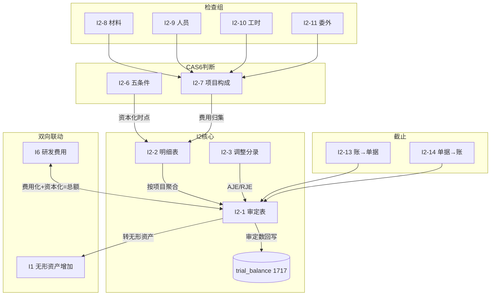

# Design Document: I2 开发支出底稿专属HTML精美组件

## Overview

I2开发支出底稿专属组件`i2-development-expenditure`。I循环最大sheet数底稿（1个xlsx/21有效sheet/~150+公式）。科目1717开发支出（借方/资产类）。

核心架构：
- componentType `i2-development-expenditure`，主入口 GtI2DevelopmentExpenditure.vue
- **CAS6五条件核心**：I2-6资本化时点判断是审计重点
- **I6↔I2双向联动**：费用化+资本化=研发总额校验
- **I2→I1转入联动**：资本化完成转入无形资产
- composable分层：useI2FormData + useI2FormulaEngine + useI2CapitalizationEngine + useI2CrossSheet + useI2DualMode + useI2ImportExport
- EventBus联动：TB回写(1717) + I6双向 + I1转入 + 附注

## Architecture

### sheetName分发模式

```
sheetName → regex提取编码 → v-if匹配 → 子组件渲染
                                     ↘ 未匹配 → OnlyOffice fallback
```

### CAS6五条件检查面板

```
┌─────────────────────────────────────────────┐
│ 🔵 CAS6第9条 资本化条件引导              │
├─────────────────────────────────────────────┤
│ 研发项目: [项目名称下拉]                    │
├─────────────────────────────────────────────┤
│ ① 技术可行性    [是/否/NA] [证据描述...]    │
│ ② 完成意图      [是/否/NA] [证据描述...]    │
│ ③ 使用或出售能力 [是/否/NA] [证据描述...]   │
│ ④ 未来经济利益  [是/否/NA] [证据描述...]    │
│ ⑤ 资源充足      [是/否/NA] [证据描述...]    │
├─────────────────────────────────────────────┤
│ 结论: ✅满足资本化条件 / ❌不满足(缺失:②④) │
└─────────────────────────────────────────────┘
```

### 文件结构

```
audit-platform/frontend/src/components/workpaper/
├── GtI2DevelopmentExpenditure.vue              # 主入口 sheetName v-if分发
├── i2/
│   ├── core/
│   │   ├── I2TabIndex.vue                     # 底稿目录
│   │   ├── I2TabAdjudication.vue              # I2-1 审定表（61公式）
│   │   ├── I2TabDetail.vue                    # I2-2 明细表（61列拆分）
│   │   ├── I2TabAdjustment.vue                # I2-3 调整分录
│   │   ├── I2TabAnalysis.vue                  # I2-5 实质性分析（31公式）
│   │   ├── I2TabDisclosureListed.vue          # 附注上市
│   │   └── I2TabDisclosureSoe.vue             # 附注国企
│   ├── inspection/
│   │   ├── I2TabPolicyCheck.vue               # I2-4 会计政策
│   │   ├── I2TabCapitalization.vue            # I2-6 CAS6五条件（核心！）
│   │   ├── I2TabProjectDetail.vue             # I2-7 项目构成（73列）
│   │   ├── I2TabMaterialCheck.vue             # I2-8 材料投入
│   │   ├── I2TabStaffCheck.vue                # I2-9 人员认定
│   │   ├── I2TabWorkHourCheck.vue             # I2-10 工时检查
│   │   ├── I2TabOutsourceCheck.vue            # I2-11 委外研发
│   │   └── I2TabTargetedCheck.vue             # I2-12 针对性检查
│   ├── cutoff/
│   │   ├── I2TabCutoffForward.vue             # I2-13 截止(账→单据)
│   │   └── I2TabCutoffBackward.vue            # I2-14 截止(单据→账)
│   └── impairment/
│       ├── I2TabImpairment.vue                # I2-15 减值测试
│       └── I2TabRecoverable.vue               # I2-16 可收回金额

├── composables/
│   ├── useI2FormData.ts                       # 数据加载/selfLoad/writebackTB(1717)
│   ├── useI2FormulaEngine.ts                  # 纯函数公式引擎
│   ├── useI2CapitalizationEngine.ts           # CAS6五条件判断引擎
│   ├── useI2CrossSheet.ts                     # 跨sheet + I6/I1跨底稿联动
│   ├── useI2Adjudication.ts
│   ├── useI2Detail.ts
│   ├── useI2Analysis.ts
│   ├── useI2Cutoff.ts                         # 截止测试双向
│   ├── useI2Impairment.ts
│   ├── useI2Disclosure.ts
│   ├── useI2ImportExport.ts
│   └── useI2DualMode.ts

backend/app/routers/wp_render_strategies/
├── _i2_development_expenditure.py             # render策略+RENDERER_DISPATCH
├── _i2_import_export.py                       # 导入导出3端点
├── _i2_ai_generate.py                         # AI生成（含CAS6建议）
└── _i2_capitalization_engine.py               # 资本化判断端点
```

## Composable接口设计

```typescript
// useI2FormulaEngine.ts — 纯函数
export function calcAuditedAmount(unadj: number, aje: number, rje: number): number
export function calcAssetEndBalance(begin: number, debit: number, credit: number): number
export function calcTriangleReconciliation(begin: number, increase: number, decrease: number, end: number): number
export function calcNetValue(cost: number, impairment: number): number
export function calcSubtotal(arr: number[]): number
export function calcChangeRate(current: number, prior: number): number | null
export function calcVarianceFromExpected(actual: number, expected: number): number

// useI2CapitalizationEngine.ts — CAS6五条件
export interface CAS6Condition {
  id: 1 | 2 | 3 | 4 | 5
  name: string
  result: 'yes' | 'no' | 'na'
  evidence: string
}
export function evaluateCapitalization(conditions: CAS6Condition[]): {
  isMet: boolean
  missingConditions: number[]
  conclusion: string
}
export function calcResearchTotal(expenseI6: number, capitalizedI2: number): number
export function validateResearchSplit(expenseI6: number, capitalizedI2: number, totalBudget: number): {
  isValid: boolean
  difference: number
}

// useI2CrossSheet.ts
export function useI2CrossSheet(allResponses: Ref<Map<string, any>>): {
  detailTotals: ComputedRef<{capitalized: number, transferred: number}>
  i6LinkageStatus: ComputedRef<{expense: number, total: number, isBalanced: boolean}>
  i1TransferAmount: ComputedRef<number>
}
```

## 跨Sheet数据流图



## Architecture Decision Records (ADR)

### ADR-1: CAS6五条件检查独立引擎

**决策**：将CAS6资本化判断逻辑独立为`useI2CapitalizationEngine.ts`。

**理由**：
- 五条件是I2的审计核心，逻辑独立（非公式计算而是条件评估）
- 需要AI辅助建议功能，与公式引擎职责不同
- 可能被其他spec复用（如N循环加计扣除需判断研发性质）

### ADR-2: I6↔I2双向联动通过EventBus

**决策**：I6与I2通过EventBus双向订阅+cross_wp_references实现联动。

**理由**：
- 同一研发活动费用化(I6)和资本化(I2)是互补关系
- 需实时校验：I6金额+I2金额=研发总额（VR-I6-01）
- EventBus保证任一方保存时对方感知变化

### ADR-3: 极宽表(73列)拆分5区段

**决策**：I2-7研发项目构成明细表73列拆为5区段Tab。

**理由**：
- 73列远超屏幕宽度，不拆分无法使用
- 按费用性质分组（材料/人工/折旧/其他）符合业务逻辑

## Correctness Properties

| ID | Property | 验证方式 |
|----|----------|---------|
| CP-I2-01 | 审定数=未审+AJE+RJE | PBT |
| CP-I2-02 | 资产类期末=期初+借方-贷方（1717） | PBT |
| CP-I2-03 | 三角勾稽差额≡0 | PBT |
| CP-I2-04 | CAS6: 五条件全"是"→满足；任一"否"→不满足 | PBT |
| CP-I2-05 | I6费用化+I2资本化=研发总额 | PBT |
| CP-I2-06 | 合计行=SUM(明细行) | PBT |
| CP-I2-07 | 借贷平衡 | PBT |
| CP-I2-08 | 减值金额∈[0, 账面] | PBT |
| CP-I2-09 | 截止测试：记账日与单据日差≤阈值天数 | PBT |
| CP-I2-10 | 转入I1金额=审定表"转无形"列合计 | PBT |

## 错误处理

| 场景 | 处理 |
|------|------|
| I6联动数据不可用 | 显示"I6数据未就绪"灰色+手工输入fallback |
| CAS6条件未全部填写 | 结论显示"待补充"黄色 |
| 73列宽表渲染卡顿 | 虚拟列+区段Tab切换 |
| 截止测试样本提取失败 | 降级手工输入 |
| I1转入EventBus超时 | 重试3次后提示手工确认 |
