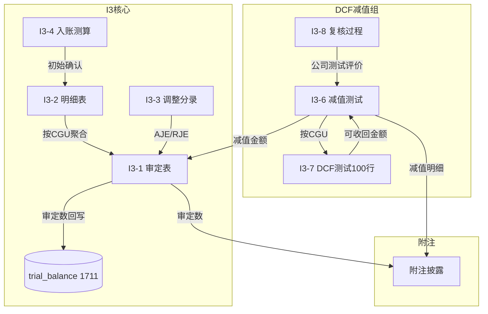

# Design Document: I3 商誉底稿专属HTML精美组件

## Overview

I3商誉底稿专属组件`i3-goodwill`。I循环DCF核心底稿（1个xlsx/15有效sheet/~120+公式）。科目1711商誉（借方/资产类）。

核心架构：
- componentType `i3-goodwill`，主入口 GtI3Goodwill.vue
- **商誉不摊销！**仅年度减值测试（期末=期初-减值，只减不增）
- **DCF资产组(CGU)核心**：可收回金额100×16超大表
- **减值分摊规则**：先冲商誉再分摊至资产组其他资产
- composable分层：useI3FormData + useI3FormulaEngine + useI3DcfEngine(纯函数) + useI3CrossSheet + useI3DualMode + useI3ImportExport
- EventBus联动：TB回写(1711) + 附注

## Architecture

### sheetName分发模式

```
sheetName → regex提取编码 → v-if匹配 → 子组件渲染
                                     ↘ 未匹配 → OnlyOffice fallback
```

### 商誉减值分摊逻辑

```
减值金额 = MAX(资产组账面 - 可收回金额, 0)
分摊规则:
  Step 1: 先冲商誉 → 商誉减至0为止
  Step 2: 剩余减值 → 按资产组其他资产账面比例分摊
  约束: 商誉减值不可转回！
```

### 文件结构

```
audit-platform/frontend/src/components/workpaper/
├── GtI3Goodwill.vue                           # 主入口 sheetName v-if分发
├── i3/
│   ├── core/
│   │   ├── I3TabIndex.vue                     # 底稿目录
│   │   ├── I3TabAdjudication.vue              # I3-1 审定表（66公式，不摊销！）
│   │   ├── I3TabDetail.vue                    # I3-2 明细表（30列3区段）
│   │   ├── I3TabAdjustment.vue                # I3-3 调整分录
│   │   ├── I3TabInitialValue.vue              # I3-4 入账价值测算
│   │   ├── I3TabTargetedCheck.vue             # I3-5 针对性检查
│   │   ├── I3TabDisclosureListed.vue          # 附注上市
│   │   └── I3TabDisclosureSoe.vue             # 附注国企
│   └── impairment/
│       ├── I3TabImpairmentTest.vue            # I3-6 减值测试（CGU分摊）
│       ├── I3TabRecoverableTest.vue           # I3-7 可收回金额（DCF核心100行）
│       └── I3TabReviewProcess.vue             # I3-8 复核过程（153行大表）

├── composables/
│   ├── useI3FormData.ts                       # 数据加载/selfLoad/writebackTB(1711)
│   ├── useI3FormulaEngine.ts                  # 纯函数公式引擎（商誉特殊：不摊销）
│   ├── useI3DcfEngine.ts                      # 纯函数DCF引擎（WACC+永续+敏感性）
│   ├── useI3CrossSheet.ts                     # 跨sheet联动
│   ├── useI3Adjudication.ts
│   ├── useI3Detail.ts
│   ├── useI3Impairment.ts                     # 减值分摊逻辑
│   ├── useI3Disclosure.ts
│   ├── useI3ImportExport.ts
│   └── useI3DualMode.ts

backend/app/routers/wp_render_strategies/
├── _i3_goodwill.py                            # render策略+RENDERER_DISPATCH
├── _i3_import_export.py                       # 导入导出3端点
├── _i3_ai_generate.py                         # AI生成（DCF参数建议）
└── _i3_dcf_engine.py                          # DCF引擎验证端点
```

## Composable接口设计

```typescript
// useI3FormulaEngine.ts — 纯函数（商誉特殊！）
export function calcAuditedAmount(unadj: number, aje: number, rje: number): number
export function calcGoodwillEndBalance(begin: number, newAcquisition: number, impairment: number): number
// 商誉期末 = 期初 + 新并购(通常0) - 减值（不摊销！）
export function calcGoodwillNetValue(originalCost: number, accImpairment: number): number
export function calcInitialGoodwill(mergerCost: number, netAssetFairValue: number): number
export function calcSubtotal(arr: number[]): number
export function calcImpairmentAllocation(totalImpairment: number, goodwillAmount: number, otherAssets: {name: string, bookValue: number}[]): {goodwillImpairment: number, otherAllocations: {name: string, amount: number}[]}

// useI3DcfEngine.ts — DCF纯函数
export function calcDcfPresentValue(cashFlows: number[], discountRate: number): number
export function calcTerminalValue(fcf: number, growthRate: number, discountRate: number): number
export function calcWacc(equityRatio: number, debtRatio: number, costOfEquity: number, costOfDebt: number, taxRate: number): number
export function calcRecoverableAmount(fairValueLessDisposal: number, valueInUse: number): number
export function calcSensitivity(basePV: number, cashFlows: number[], baseRate: number, rateChange: number): number
```

## 跨Sheet数据流图



## Architecture Decision Records (ADR)

### ADR-1: DCF引擎独立composable

**决策**：DCF计算逻辑独立为`useI3DcfEngine.ts`。

**理由**：
- DCF模型（WACC/永续增长/敏感性分析）与通用公式职责完全不同
- 100×16超大表公式密集（22公式），需独立测试
- 可能被I1-13（无形资产可收回金额）复用

### ADR-2: 商誉不摊销特殊处理

**决策**：审定表公式引擎中商誉使用`calcGoodwillEndBalance`而非通用`calcAssetEndBalance`。

**理由**：
- 商誉期末=期初+新并购-减值（无摊销项！）
- 与I1（有摊销）、I4（有摊销）根本不同
- "本期增加"仅新并购产生，"本期减少"仅减值产生（且不可转回）

### ADR-3: 减值分摊两步法

**决策**：减值分摊实现"先冲商誉再分摊"两步算法。

**理由**：
- CAS8明确规定：含商誉的资产组减值，先抵减商誉至零，剩余再按比例分摊
- 这是商誉减值的核心审计逻辑，需独立函数+PBT验证

## Correctness Properties

| ID | Property | 验证方式 |
|----|----------|---------|
| CP-I3-01 | 审定数=未审+AJE+RJE | PBT |
| CP-I3-02 | 商誉期末=期初+新并购-减值（不摊销！） | PBT |
| CP-I3-03 | 初始商誉=合并成本-可辨认净资产公允 | PBT |
| CP-I3-04 | 减值先冲商誉：goodwillImpairment=MIN(totalImpairment, goodwillAmount) | PBT |
| CP-I3-05 | DCF现值=Σ(CF/(1+r)^i) | PBT |
| CP-I3-06 | 可收回金额=MAX(公允-处置费, DCF) | PBT |
| CP-I3-07 | 减值金额≥0且≤资产组账面 | PBT |
| CP-I3-08 | 合计行恒等 | PBT |

## 错误处理

| 场景 | 处理 |
|------|------|
| DCF折现率≤0或≥增长率 | 阻止终值计算，提示参数错误 |
| 商誉减值尝试转回 | 阻止+红色"商誉减值不可转回" |
| 100行DCF表渲染卡顿 | 虚拟滚动+区段折叠 |
| CGU划分未定义 | 提示先完成I3-5针对性检查 |
