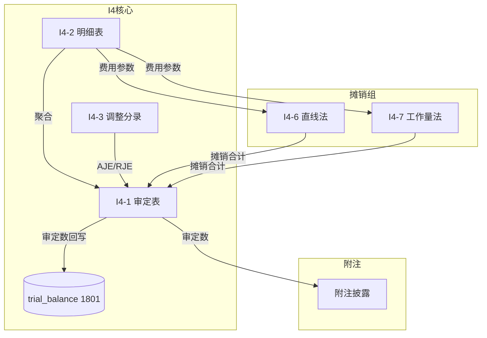

# Design Document: I4 长期待摊费用底稿专属HTML精美组件

## Overview

I4长期待摊费用底稿专属组件`i4-long-term-prepaid`。标准资产类底稿（1个xlsx/12有效sheet/~100+公式）。科目1801长期待摊费用（借方/资产类）。

核心架构：
- componentType `i4-long-term-prepaid`，主入口 GtI4LongTermPrepaid.vue
- 摊销分支选择器：直线法(I4-6) vs 工作量法(I4-7)
- 摊销引擎是H折旧引擎的子集（仅2种方法）
- composable分层：useI4FormData + useI4FormulaEngine + useI4AmortizationEngine + useI4CrossSheet + useI4DualMode + useI4ImportExport
- EventBus联动：TB回写(1801) + 附注

## Architecture

### sheetName分发模式

```
sheetName → regex提取编码 → v-if匹配 → 子组件渲染
                                     ↘ 未匹配 → OnlyOffice fallback
```

### I4-6/I4-7 分支选择器

```
el-segmented v-model="amortizationMethod"
  ├── "直线法（I4-6）"   → I4TabAmortizationStraight.vue（39公式）
  └── "工作量法（I4-7）" → I4TabAmortizationUnits.vue（21公式）
```

### 文件结构

```
audit-platform/frontend/src/components/workpaper/
├── GtI4LongTermPrepaid.vue                    # 主入口 sheetName v-if分发
├── i4/
│   ├── core/
│   │   ├── I4TabIndex.vue                     # 底稿目录
│   │   ├── I4TabAdjudication.vue              # I4-1 审定表（47公式）
│   │   ├── I4TabDetail.vue                    # I4-2 明细表（25列3区段）
│   │   ├── I4TabAdjustment.vue                # I4-3 调整分录
│   │   ├── I4TabPolicyCheck.vue               # I4-4 政策检查
│   │   ├── I4TabTargetedCheck.vue             # I4-5 针对性检查
│   │   ├── I4TabDisclosureListed.vue          # 附注上市
│   │   └── I4TabDisclosureSoe.vue             # 附注国企
│   └── amortization/
│       ├── I4TabAmortizationStraight.vue      # I4-6 直线法（39公式）
│       └── I4TabAmortizationUnits.vue         # I4-7 工作量法（21公式）

├── composables/
│   ├── useI4FormData.ts                       # selfLoad + writebackTB(1801)
│   ├── useI4FormulaEngine.ts                  # 纯函数公式引擎
│   ├── useI4AmortizationEngine.ts             # 摊销引擎（直线+工作量）
│   ├── useI4CrossSheet.ts                     # 跨sheet联动
│   ├── useI4Adjudication.ts
│   ├── useI4Detail.ts
│   ├── useI4Disclosure.ts
│   ├── useI4ImportExport.ts
│   └── useI4DualMode.ts

backend/app/routers/wp_render_strategies/
├── _i4_long_term_prepaid.py                   # render策略+RENDERER_DISPATCH
├── _i4_import_export.py                       # 导入导出3端点
└── _i4_ai_generate.py                         # AI生成
```

## Composable接口设计

```typescript
// useI4FormulaEngine.ts — 纯函数
export function calcAuditedAmount(unadj: number, aje: number, rje: number): number
export function calcAssetEndBalance(begin: number, increase: number, amortization: number, decrease: number): number
// 长期待摊: 期末 = 期初 + 增加 - 摊销 - 减少
export function calcTriangleReconciliation(begin: number, increase: number, amortization: number, decrease: number, end: number): number
export function calcSubtotal(arr: number[]): number
export function calcChangeRate(current: number, prior: number): number | null

// useI4AmortizationEngine.ts — 摊销纯函数（H折旧引擎子集）
export function calcStraightLineAmort(originalAmount: number, totalMonths: number): number
// 直线法：月摊销 = 原始金额 ÷ 摊销总月数
export function calcUnitsOfProductionAmort(originalAmount: number, currentUnits: number, totalUnits: number): number
// 工作量法：月摊销 = 原始金额 × (本月工作量 ÷ 总预计工作量)
export function calcRemainingMonths(totalMonths: number, elapsedMonths: number): number
export function calcAmortizationRate(elapsed: number, total: number): number

// useI4CrossSheet.ts
export function useI4CrossSheet(allResponses: Ref<Map<string, any>>): {
  detailTotals: ComputedRef<{total: number, amortization: number}>
  adjudicationFromDetail: ComputedRef<{audited: number}>
  amortizationMatrix: ComputedRef<number[][]>
}
```

## 跨Sheet数据流图



## Architecture Decision Records (ADR)

### ADR-1: 摊销引擎复用H循环子集

**决策**：I4摊销引擎仅实现直线法+工作量法（H循环4种方法的子集）。

**理由**：
- 长期待摊费用通常只用直线法（按月平均摊销）
- 少数场景用工作量法（如按产量摊销的模具费）
- 无需双倍余额递减/年数总和法

### ADR-2: I4-6/I4-7分支选择器

**决策**：使用el-segmented切换直线法和工作量法。

**理由**：
- 两种方法是互斥的（同一项目只用一种）
- 用户根据具体项目性质选择

## Correctness Properties

| ID | Property | 验证方式 |
|----|----------|---------|
| CP-I4-01 | 审定数=未审+AJE+RJE | PBT |
| CP-I4-02 | 期末=期初+增加-摊销-减少 | PBT |
| CP-I4-03 | 直线法月摊销=原始金额÷总月数 | PBT |
| CP-I4-04 | 工作量法月摊销=原始×(当月量÷总量) | PBT |
| CP-I4-05 | 合计行恒等 | PBT |
| CP-I4-06 | 借贷平衡 | PBT |

## 错误处理

| 场景 | 处理 |
|------|------|
| 摊销总月数≤0 | 提示"摊销期限必须>0" |
| 工作量总量=0 | 阻止计算，提示参数错误 |
| 三角勾稽不平 | 红色高亮差额 |
| OO健康检查失败 | 仅HTML模式 |
