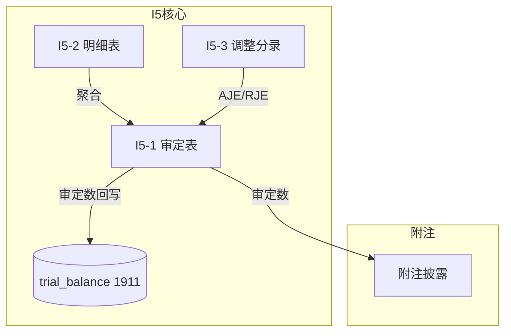

# Design Document: I5 其他非流动资产底稿专属HTML精美组件

## Overview

I5其他非流动资产底稿专属组件`i5-other-noncurrent-assets`。I循环最简单底稿（1个xlsx/9有效sheet/~80+公式）。科目1911其他非流动资产（借方/资产类）。

核心架构：
- componentType `i5-other-noncurrent-assets`，主入口 GtI5OtherNoncurrentAssets.vue
- 最简单标准资产类模式，无特殊逻辑
- composable分层：useI5FormData + useI5FormulaEngine + useI5CrossSheet + useI5DualMode + useI5ImportExport
- EventBus联动：TB回写(1911) + 附注

## Architecture

### sheetName分发模式

```
sheetName → regex提取编码 → v-if匹配 → 子组件渲染
                                     ↘ 未匹配 → OnlyOffice fallback
```

### 文件结构

```
audit-platform/frontend/src/components/workpaper/
├── GtI5OtherNoncurrentAssets.vue              # 主入口 sheetName v-if分发
├── i5/
│   └── core/
│       ├── I5TabIndex.vue                     # 底稿目录
│       ├── I5TabAdjudication.vue              # I5-1 审定表（61公式，89行）
│       ├── I5TabDetail.vue                    # I5-2 明细表（26列3区段，63行）
│       ├── I5TabAdjustment.vue                # I5-3 调整分录
│       ├── I5TabTargetedCheck.vue             # I5-4 针对性检查
│       ├── I5TabDisclosureListed.vue          # 附注上市
│       └── I5TabDisclosureSoe.vue             # 附注国企

├── composables/
│   ├── useI5FormData.ts                       # selfLoad + writebackTB(1911)
│   ├── useI5FormulaEngine.ts                  # 纯函数公式引擎
│   ├── useI5CrossSheet.ts                     # 跨sheet联动
│   ├── useI5Adjudication.ts
│   ├── useI5Detail.ts
│   ├── useI5Disclosure.ts
│   ├── useI5ImportExport.ts
│   └── useI5DualMode.ts

backend/app/routers/wp_render_strategies/
├── _i5_other_noncurrent_assets.py             # render策略+RENDERER_DISPATCH
├── _i5_import_export.py                       # 导入导出3端点
└── _i5_ai_generate.py                         # AI生成
```

## Composable接口设计

```typescript
// useI5FormulaEngine.ts — 纯函数（标准资产类）
export function calcAuditedAmount(unadj: number, aje: number, rje: number): number
export function calcAssetEndBalance(begin: number, increase: number, decrease: number): number
// 资产类: 期末 = 期初 + 增加 - 减少
export function calcTriangleReconciliation(begin: number, increase: number, decrease: number, end: number): number
export function calcSubtotal(arr: number[]): number
export function calcChangeRate(current: number, prior: number): number | null

// useI5CrossSheet.ts
export function useI5CrossSheet(allResponses: Ref<Map<string, any>>): {
  detailTotals: ComputedRef<{total: number}>
  adjudicationFromDetail: ComputedRef<{audited: number}>
}
```

## 跨Sheet数据流图



## Architecture Decision Records (ADR)

### ADR-1: 最简结构无需拆分子目录

**决策**：I5仅使用i5/core/一个子目录（无inspection/impairment等）。

**理由**：
- 仅9个sheet，7个子组件，无需复杂分组
- 无摊销/减值/截止等专项功能

## Correctness Properties

| ID | Property | 验证方式 |
|----|----------|---------|
| CP-I5-01 | 审定数=未审+AJE+RJE | PBT |
| CP-I5-02 | 期末=期初+增加-减少 | PBT |
| CP-I5-03 | 三角勾稽差额≡0 | PBT |
| CP-I5-04 | 合计行恒等 | PBT |
| CP-I5-05 | 借贷平衡 | PBT |

## 错误处理

| 场景 | 处理 |
|------|------|
| TB取数失败 | 灰色占位 |
| 三角勾稽不平 | 红色高亮 |
| 89行渲染卡顿 | 虚拟滚动 |
