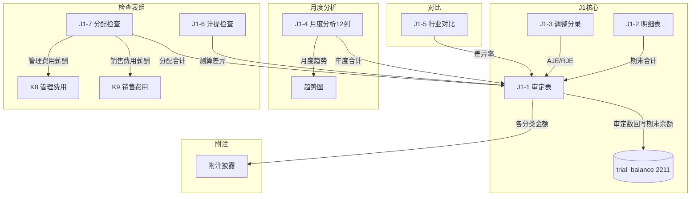

# Design Document: J1 应付职工薪酬底稿专属HTML精美组件

## Overview

J1应付职工薪酬底稿专属组件`j1-employee-compensation`。J循环最大底稿（1个xlsx/16有效sheet/~110+公式）。科目2211应付职工薪酬（**贷方/负债类！**期末=期初+贷方-借方，与H9同款）。

核心架构：
- componentType `j1-employee-compensation`，主入口 GtJ1EmployeeCompensation.vue
- **负债类贷方科目！**期末=期初+贷方-借方（与资产类相反！与H9同款）
- **月度分析12列横向**（类D4-2/I6-2月度矩阵）
- **5类检查表**（计提/分配/一般/非货币福利/辞退）
- composable分层：useJ1FormData + useJ1FormulaEngine(**负债类！**) + useJ1SalaryCalc(纯函数) + useJ1CrossSheet + useJ1DualMode + useJ1ImportExport
- EventBus联动：TB回写(2211期末余额) + K8/K9薪酬分摊 + 附注

## Architecture

### sheetName分发模式

```
sheetName → regex提取编码 → v-if匹配 → 子组件渲染
                                     ↘ 未匹配 → OnlyOffice fallback
```

### 负债类取数逻辑（与H9同款）

```
资产类(H1~H8): 期末=期初+借方-贷方
负债类(J1):    期末=期初+贷方-借方（2211贷方=计提增加,借方=发放减少）
               TB取数: 期末余额（非发生额！负债是余额表）
```

### 文件结构

```
audit-platform/frontend/src/components/workpaper/
├── GtJ1EmployeeCompensation.vue              # 主入口 sheetName v-if分发
├── j1/
│   ├── core/
│   │   ├── J1TabIndex.vue                    # 底稿目录
│   │   ├── J1TabAdjudication.vue             # J1-1 审定表（57公式！负债类）
│   │   ├── J1TabDetail.vue                   # J1-2 明细表
│   │   ├── J1TabAdjustment.vue               # J1-3 调整分录
│   │   ├── J1TabDisclosureListed.vue         # 附注上市
│   │   └── J1TabDisclosureSoe.vue            # 附注国企
│   ├── analysis/
│   │   ├── J1TabMonthlyAnalysis.vue          # J1-4 月度分析（12列横向）
│   │   └── J1TabIndustryCompare.vue          # J1-5 同行业对比
│   └── inspection/
│       ├── J1TabAccrualCheck.vue             # J1-6 计提检查
│       ├── J1TabAllocationCheck.vue          # J1-7 分配检查
│       ├── J1TabGeneralCheck.vue             # J1-8 一般检查
│       ├── J1TabNonMonetaryCheck.vue         # J1-9 非货币福利
│       └── J1TabSeveranceCheck.vue           # J1-10 辞退福利

├── composables/
│   ├── useJ1FormData.ts                      # selfLoad + writebackTB(2211期末余额)
│   ├── useJ1FormulaEngine.ts                 # 纯函数公式引擎（负债类！贷方公式）
│   ├── useJ1SalaryCalc.ts                    # 纯函数薪酬测算（人数×均薪+社保）
│   ├── useJ1CrossSheet.ts                    # 跨sheet + K8/K9联动
│   ├── useJ1DualMode.ts
│   ├── useJ1ImportExport.ts
│   ├── useJ1Adjudication.ts                  # 审定表composable
│   ├── useJ1Detail.ts                        # 明细表
│   ├── useJ1MonthlyAnalysis.ts               # 月度12列矩阵
│   ├── useJ1IndustryCompare.ts               # 同行业对比
│   ├── useJ1AccrualCheck.ts                  # 计提检查
│   ├── useJ1AllocationCheck.ts               # 分配检查
│   ├── useJ1GeneralCheck.ts                  # 一般检查
│   ├── useJ1NonMonetaryCheck.ts              # 非货币福利
│   └── useJ1SeveranceCheck.ts                # 辞退福利

backend/app/routers/wp_render_strategies/
├── _j1_employee_compensation.py              # render策略+RENDERER_DISPATCH
├── _j1_import_export.py                      # 导入导出3端点
└── _j1_ai_generate.py                        # AI生成

backend/app/services/
└── j1_employee_compensation_service.py       # 薪酬测算验证+分配校验
```

## Composable接口设计

### useJ1FormulaEngine.ts（负债类！与H9同款）

```typescript
// 审定数
export function calcAuditedAmount(unadj: number, aje: number, rje: number): number
// 负债类期末（贷方科目）：期末=期初+贷方-借方
export function calcLiabilityEndBalance(begin: number, credit: number, debit: number): number
// 变动额
export function calcChangeDiff(current: number, prior: number): number
// 变动率
export function calcChangeRate(current: number, prior: number): number | null
// 合计
export function calcSubtotal(arr: number[]): number
// 占比
export function calcProportion(item: number, total: number): number | null
// 月度合计
export function calcMonthlyTotal(months: number[]): number  // SUM(1月~12月)
// 月度均值
export function calcMonthlyAverage(months: number[]): number  // 合计/12
// 分配闭合校验
export function validateAllocationClosure(allocated: number[], total: number): {
  isValid: boolean; difference: number
}
```

### useJ1SalaryCalc.ts（核心薪酬测算纯函数）

```typescript
// 工资测算=人数×月均薪酬×月数
export function calcSalaryEstimate(headcount: number, avgSalary: number, months: number): number
// 社保测算=缴费基数×比例×月数
export function calcInsuranceEstimate(base: number, rate: number, months: number): number
// 公积金测算=缴费基数×比例×月数
export function calcHousingFundEstimate(base: number, rate: number, months: number): number
// 计提差异率
export function calcAccrualDiffRate(actual: number, estimated: number): number | null
// 人均薪酬
export function calcPerCapitaSalary(totalSalary: number, headcount: number): number | null
// 薪酬占收入比
export function calcSalaryRevenueRatio(totalSalary: number, revenue: number): number | null
// 行业差异率
export function calcIndustryDiffRate(company: number, industryAvg: number): number | null
```

### useJ1CrossSheet.ts

```typescript
export function useJ1CrossSheet(allResponses: Ref<Map<string, any>>) {
  // 审定表 vs 明细表合计
  const adjudicationVsDetail: ComputedRef<{ diff: number; isMatch: boolean }>
  // 月度分析合计 vs 审定表
  const monthlyVsAdjudication: ComputedRef<{ diff: number; isMatch: boolean }>
  // 分配合计 vs 薪酬总额
  const allocationClosure: ComputedRef<{ diff: number; isBalanced: boolean }>
  // K8/K9联动状态
  const k8k9LinkageStatus: ComputedRef<{ k8Amount: number; k9Amount: number; isLinked: boolean }>
}
```

## 跨Sheet数据流图



## Architecture Decision Records (ADR)

### ADR-1: J1是负债类贷方科目

**决策**：J1使用`calcLiabilityEndBalance(begin, credit, debit) = begin + credit - debit`，与H9完全同款。

**理由**：
- 2211应付职工薪酬是负债类科目，贷方=计提增加，借方=发放减少
- 期末余额=期初+贷方发生额-借方发生额
- 与资产类(H1~H8)的期末=期初+借方-贷方方向相反

### ADR-2: 5类检查表独立组件

**决策**：J1-6~J1-10五个检查表各自独立Vue组件+composable，不合并。

**理由**：
- 5类检查内容差异大（计提=数学验算/分配=科目归集/一般=凭证核对/非货币=估值/辞退=CAS9条件）
- 每个检查表独立的业务逻辑和交互模式
- 单独组件便于维护和按需加载

### ADR-3: 月度12列横向（类D4-2/I6-2）

**决策**：J1-4月度分析采用固定列+12月份列横向滚动（类D4-2/I6-2模式）。

**理由**：
- 源xlsx即为月度横向结构（16列=基础列+12月+合计+均值）
- 月度波动是薪酬审计关注重点
- 固定前列+横滚12月是该类数据最佳交互

### ADR-4: 薪酬测算引擎独立

**决策**：将薪酬测算(人数×均薪)和社保测算(基数×比例)提取为独立纯函数引擎useJ1SalaryCalc.ts。

**理由**：
- 薪酬测算是J1特有的核心审计程序（分析性程序）
- 需要PBT验证：人数×均薪×月数公式正确性
- 独立引擎便于计提检查表J1-6复用

## Correctness Properties

| ID | Property | 验证方式 |
|----|----------|---------|
| CP-J1-01 | 审定数=未审+AJE+RJE | PBT |
| CP-J1-02 | 负债类期末=期初+贷方-借方 | PBT |
| CP-J1-03 | 月度合计=SUM(1月~12月) | PBT |
| CP-J1-04 | 工资测算=人数×均薪×月数 | PBT |
| CP-J1-05 | 社保测算=基数×比例×月数 | PBT |
| CP-J1-06 | 分配闭合=Σ各科目=薪酬总额 | PBT |
| CP-J1-07 | 合计行恒等 | PBT |
| CP-J1-08 | 变动率=(本期-同期)/同期×100% | PBT |

## 错误处理

| 场景 | 处理 |
|------|------|
| K8/K9联动不可用 | "K8/K9数据未就绪"灰色+手工输入 |
| 分配闭合失败 | 红色警告"分配不平，差额xxx" |
| 计提差异率>5% | 红色高亮+提示"计提可能偏差" |
| 月度数据不全12列 | 缺失月份空白+黄色提示 |
| TB无科目2211 | 提示导入试算表 |
| selfLoad失败 | el-empty+重试 |
