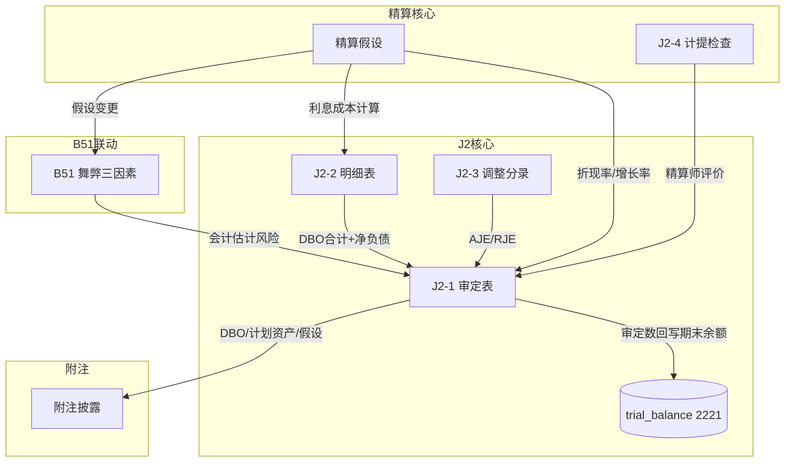

# Design Document: J2 长期应付职工薪酬-设定受益计划净资产底稿专属HTML精美组件

## Overview

J2长期应付职工薪酬底稿专属组件`j2-defined-benefit-plan`。精算核心底稿（1个xlsx/9有效sheet/~90+公式）。科目2221长期应付职工薪酬（**贷方/负债类！**期末=期初+贷方-借方，与H9/J1同款）。

核心架构：
- componentType `j2-defined-benefit-plan`，主入口 GtJ2DefinedBenefitPlan.vue
- **负债类贷方科目！**期末=期初+贷方-借方
- **精算假设是核心**：折现率/工资增长率/离职率/死亡率（会计估计）
- **DBO精算现值**：设定受益义务现值计算
- **精算师工作利用**：ISA620专家评估
- composable分层：useJ2FormData + useJ2FormulaEngine(**负债类！**) + useJ2ActuarialEngine(纯函数) + useJ2CrossSheet + useJ2DualMode + useJ2ImportExport
- EventBus联动：TB回写(2221期末余额) + B51舞弊三因素 + 附注

## Architecture

### sheetName分发模式

```
sheetName → regex提取编码 → v-if匹配 → 子组件渲染
                                     ↘ 未匹配 → OnlyOffice fallback
```

### 负债类取数逻辑（与H9/J1同款）

```
资产类(H1~H8): 期末=期初+借方-贷方
负债类(J2):    期末=期初+贷方-借方（2221贷方=义务增加,借方=支付/利得）
               TB取数: 期末余额
```

### DBO精算核心逻辑

```
期末DBO = 期初DBO + 当期服务成本 + 利息成本 + 精算损失 - 精算利得 - 实际支付
利息成本 = 期初DBO × 折现率
净负债 = DBO - 计划资产公允价值
```

### 文件结构

```
audit-platform/frontend/src/components/workpaper/
├── GtJ2DefinedBenefitPlan.vue                 # 主入口 sheetName v-if分发
├── j2/
│   ├── core/
│   │   ├── J2TabIndex.vue                     # 底稿目录
│   │   ├── J2TabAdjudication.vue              # J2-1 审定表（67公式！负债+三区块）
│   │   ├── J2TabDetail.vue                    # J2-2 明细表（DBO+计划资产）
│   │   ├── J2TabAdjustment.vue                # J2-3 调整分录
│   │   ├── J2TabDisclosureListed.vue          # 附注上市
│   │   └── J2TabDisclosureSoe.vue             # 附注国企
│   └── actuarial/
│       └── J2TabAccrualCheck.vue              # J2-4 计提检查（精算师利用+假设评价）

├── composables/
│   ├── useJ2FormData.ts                       # selfLoad + writebackTB(2221期末余额)
│   ├── useJ2FormulaEngine.ts                  # 纯函数公式引擎（负债类！贷方公式）
│   ├── useJ2ActuarialEngine.ts                # 纯函数精算引擎（DBO+利息+净负债）
│   ├── useJ2CrossSheet.ts                     # 跨sheet + B51联动
│   ├── useJ2DualMode.ts
│   ├── useJ2ImportExport.ts
│   ├── useJ2Adjudication.ts                   # 审定表composable（三区块）
│   ├── useJ2Detail.ts                         # 明细表
│   ├── useJ2AccrualCheck.ts                   # 精算师利用+假设检查
│   └── useJ2Disclosure.ts

backend/app/routers/wp_render_strategies/
├── _j2_defined_benefit_plan.py                # render策略+RENDERER_DISPATCH
├── _j2_import_export.py                       # 导入导出3端点
└── _j2_ai_generate.py                         # AI生成（精算假设分析）

backend/app/services/
└── j2_defined_benefit_plan_service.py         # 精算验证+DBO计算+B51联动
```

## Composable接口设计

### useJ2FormulaEngine.ts（负债类！与H9/J1同款）

```typescript
// 审定数
export function calcAuditedAmount(unadj: number, aje: number, rje: number): number
// 负债类期末（贷方科目）：期末=期初+贷方-借方
export function calcLiabilityEndBalance(begin: number, credit: number, debit: number): number
// 变动率
export function calcChangeRate(current: number, prior: number): number | null
// 合计
export function calcSubtotal(arr: number[]): number
// 占比
export function calcProportion(item: number, total: number): number | null
```

### useJ2ActuarialEngine.ts（核心精算纯函数）

```typescript
// DBO期末=期初+服务成本+利息成本+精算损失-精算利得-支付
export function calcEndDBO(
  beginDBO: number, serviceCost: number, interestCost: number,
  actuarialLoss: number, actuarialGain: number, payments: number
): number
// 利息成本=期初DBO×折现率
export function calcInterestCost(beginDBO: number, discountRate: number): number
// 净负债=DBO-计划资产
export function calcNetLiability(dbo: number, planAssets: number): number
// 精算损益=预期-实际
export function calcActuarialGainLoss(expected: number, actual: number): number
// 精算假设合理性检查
export function validateAssumptions(assumptions: ActuarialAssumptions): {
  isValid: boolean
  warnings: string[]
}
// 敏感性分析：折现率变动±0.5%对DBO的影响
export function calcSensitivity(dbo: number, rate: number, rateChange: number): {
  dboUp: number; dboDown: number; impactUp: number; impactDown: number
}

interface ActuarialAssumptions {
  discountRate: number       // 折现率 [2%~8%]
  salaryGrowthRate: number   // 工资增长率 [3%~15%]
  turnoverRate: number       // 离职率 [1%~20%]
  mortalityRate: number      // 死亡率 [0.01%~5%]
}
```

### useJ2CrossSheet.ts

```typescript
export function useJ2CrossSheet(allResponses: Ref<Map<string, any>>) {
  // 审定表 vs 明细表合计
  const adjudicationVsDetail: ComputedRef<{ diff: number; isMatch: boolean }>
  // B51联动状态
  const b51LinkageStatus: ComputedRef<{ isLinked: boolean; riskLevel: string }>
  // 精算假设变动
  const assumptionChanges: ComputedRef<{ hasChanged: boolean; changedItems: string[] }>
}
```

## 跨Sheet数据流图



## Architecture Decision Records (ADR)

### ADR-1: J2是负债类贷方科目

**决策**：J2使用`calcLiabilityEndBalance(begin, credit, debit) = begin + credit - debit`，与H9/J1同款。

**理由**：
- 2221长期应付职工薪酬是负债类科目
- 贷方=义务增加(服务成本/利息/精算损失)，借方=支付/精算利得
- 期末余额=期初+贷方发生-借方发生

### ADR-2: 精算引擎独立

**决策**：将DBO计算、利息成本、精算假设验证提取为独立纯函数引擎useJ2ActuarialEngine.ts。

**理由**：
- 精算计算是J2的核心差异化逻辑
- DBO公式需要PBT验证（多变量组合正确性）
- 精算假设合理性范围需要独立验证函数
- 与通用负债类公式(useJ2FormulaEngine)职责分离

### ADR-3: 三区块审定表

**决策**：J2-1审定表渲染为三区块：DBO → 计划资产 → 净负债/净资产。

**理由**：
- CAS9要求区分列示：设定受益义务现值、计划资产、净负债/净资产
- 三者关系明确：净负债=DBO-计划资产
- 三区块便于审计人员分别核验

### ADR-4: B51联动（会计估计风险）

**决策**：精算假设变更时通过EventBus联动B51舞弊三因素评估。

**理由**：
- 精算假设属于"会计估计"，是ISA540关注重点
- B51风险评估中"会计估计重大风险"需要实时感知假设变化
- CAS1301要求识别与会计估计相关的重大错报风险

## Correctness Properties

| ID | Property | 验证方式 |
|----|----------|---------|
| CP-J2-01 | 审定数=未审+AJE+RJE | PBT |
| CP-J2-02 | 负债类期末=期初+贷方-借方 | PBT |
| CP-J2-03 | 利息成本=期初DBO×折现率 | PBT |
| CP-J2-04 | 净负债=DBO-计划资产 | PBT |
| CP-J2-05 | DBO期末=期初+服务+利息+损失-利得-支付 | PBT |
| CP-J2-06 | 合计行恒等 | PBT |
| CP-J2-07 | 精算假设范围校验（边界测试） | PBT |

## 错误处理

| 场景 | 处理 |
|------|------|
| B51联动不可用 | "B51数据未就绪"灰色+手工标注 |
| 精算假设超出范围 | 红色警告+详细说明合理区间 |
| 计划资产>DBO(净资产) | 正常显示但标注"资产上限"检查 |
| TB无科目2221 | 提示导入试算表 |
| selfLoad失败 | el-empty+重试 |
| 折现率为0 | 黄色提示"折现率为0不合理"+允许输入 |
