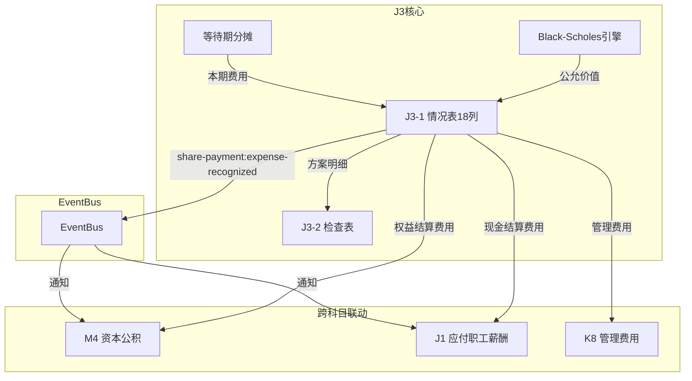

# Design Document: J3 股份支付底稿专属HTML精美组件

## Overview

J3股份支付底稿专属组件`j3-share-based-payment`。期权定价核心底稿（1个xlsx/6有效sheet/~50+公式）。**无独立科目**（分散在资本公积3002/管理费用6602/应付职工薪酬2211等多科目）。

核心架构：
- componentType `j3-share-based-payment`，主入口 GtJ3ShareBasedPayment.vue
- **无独立科目！跨多科目记账**（不走单一TB科目回写）
- **Black-Scholes期权定价**是核心计算
- **等待期费用分摊**：总公允÷等待期×已服务
- **权益结算vs现金结算**两种模式
- composable分层：useJ3FormData + useJ3FormulaEngine + useJ3OptionPricingEngine(纯函数/核心) + useJ3CrossSheet + useJ3DualMode + useJ3ImportExport
- EventBus联动：M4资本公积(权益结算) + J1应付职工薪酬(现金结算)

## Architecture

### sheetName分发模式

```
sheetName → regex提取编码 → v-if匹配 → 子组件渲染
                                     ↘ 未匹配 → OnlyOffice fallback
```

### 跨多科目记账逻辑（特殊！无单一TB回写）

```
权益结算：借 管理费用(6602) / 贷 资本公积-其他(3002)  → 联动M4
现金结算：借 管理费用(6602) / 贷 应付职工薪酬(2211)   → 联动J1
注意：J3无独立TB科目回写！通过EventBus通知相关科目底稿
```

### Black-Scholes定价逻辑

```
C = S×N(d1) - K×e^(-rT)×N(d2)
d1 = [ln(S/K) + (r + σ²/2)×T] / (σ×√T)
d2 = d1 - σ×√T

S=标的价格, K=行权价, T=到期时间, r=无风险利率, σ=波动率
N(x)=标准正态分布累积分布函数
```

### 等待期费用分摊逻辑

```
本期确认费用 = 总公允价值 × (已服务年数/等待期) - 以前年度累计确认
累计费用 = 总公允价值 × MIN(已服务/等待期, 1)
剩余费用 = 总公允价值 - 累计费用
```

### 文件结构

```
audit-platform/frontend/src/components/workpaper/
├── GtJ3ShareBasedPayment.vue                  # 主入口 sheetName v-if分发
├── j3/
│   └── core/
│       ├── J3TabIndex.vue                     # 底稿目录
│       ├── J3TabDetail.vue                    # J3-1 股份支付情况表（18列明细）
│       └── J3TabCheck.vue                     # J3-2 股份支付检查表（19列段落型）

├── composables/
│   ├── useJ3FormData.ts                       # selfLoad（注意：无单一TB回写！）
│   ├── useJ3FormulaEngine.ts                  # 费用分摊+累计+剩余
│   ├── useJ3OptionPricingEngine.ts            # 纯函数BS模型（核心！）
│   ├── useJ3CrossSheet.ts                     # M4/J1联动 + 情况表vs检查表
│   ├── useJ3DualMode.ts
│   ├── useJ3ImportExport.ts
│   ├── useJ3Detail.ts                         # 情况表composable
│   └── useJ3Check.ts                          # 检查表composable

backend/app/routers/wp_render_strategies/
├── _j3_share_based_payment.py                 # render策略+RENDERER_DISPATCH
├── _j3_import_export.py                       # 导入导出3端点
└── _j3_ai_generate.py                         # AI生成（BS参数分析）

backend/app/services/
└── j3_share_based_payment_service.py          # BS定价验证+费用分摊
```

## Composable接口设计

### useJ3FormulaEngine.ts（费用分摊）

```typescript
// 等待期费用分摊：本期费用
export function calcVestingExpense(
  totalFV: number, vestingPeriod: number, serviceYears: number, priorCumulative: number
): number
// 累计确认费用
export function calcCumulativeExpense(totalFV: number, vestingPeriod: number, serviceYears: number): number
// 剩余费用
export function calcRemainingExpense(totalFV: number, cumulativeExpense: number): number
// 合计
export function calcSubtotal(arr: number[]): number
// 总公允价值=单位公允×数量
export function calcTotalFairValue(unitFV: number, quantity: number): number
```

### useJ3OptionPricingEngine.ts（核心！Black-Scholes）

```typescript
// 标准正态分布CDF
export function normalCDF(x: number): number
// d1计算
export function calcD1(S: number, K: number, T: number, r: number, sigma: number): number
// d2计算
export function calcD2(d1: number, sigma: number, T: number): number
// Black-Scholes看涨期权价格
export function calcBlackScholes(S: number, K: number, T: number, r: number, sigma: number): number
// 参数合理性校验
export function validateBSParams(params: BSParams): { isValid: boolean; warnings: string[] }

interface BSParams {
  S: number      // 标的价格 > 0
  K: number      // 行权价 > 0
  T: number      // 到期时间(年) > 0
  r: number      // 无风险利率 [1%~10%]
  sigma: number  // 波动率 [10%~100%]
}
```

### useJ3CrossSheet.ts

```typescript
export function useJ3CrossSheet(allResponses: Ref<Map<string, any>>) {
  // 情况表 vs 检查表一致
  const detailVsCheck: ComputedRef<{ isConsistent: boolean }>
  // M4联动状态（权益结算）
  const m4LinkageStatus: ComputedRef<{ equityAmount: number; isLinked: boolean }>
  // J1联动状态（现金结算）
  const j1LinkageStatus: ComputedRef<{ cashAmount: number; isLinked: boolean }>
}
```

## 跨Sheet数据流图



## Architecture Decision Records (ADR)

### ADR-1: J3无独立科目（跨多科目）

**决策**：J3不做单一TB科目回写，而是通过EventBus通知M4(资本公积)/J1(应付职工薪酬)/K8(管理费用)。

**理由**：
- 股份支付不在单一科目，分录涉及多科目（借费用/贷资本公积或贷应付）
- 无法像H9/J1/J2那样回写单一TB科目
- 通过EventBus publish让相关科目底稿主动获取数据

### ADR-2: Black-Scholes引擎独立

**决策**：将BS期权定价提取为独立纯函数引擎useJ3OptionPricingEngine.ts。

**理由**：
- BS模型是J3的核心差异化计算（数学复杂度高）
- 包含正态分布CDF等数学函数需要精确测试
- PBT验证参数→结果正确性
- 独立引擎与费用分摊逻辑职责分离

### ADR-3: 权益结算vs现金结算分流

**决策**：根据方案类型自动标注记账方向，权益结算联动M4，现金结算联动J1。

**理由**：
- CAS11明确区分两种结算方式的会计处理
- 权益结算：贷记"资本公积-其他资本公积"
- 现金结算：贷记"应付职工薪酬-股份支付"
- 系统需要根据类型自动确定联动目标

### ADR-4: 等待期费用分摊递增确认

**决策**：费用分摊采用"累计确认-以前已确认"方式计算本期费用。

**理由**：
- CAS11要求等待期内每个资产负债表日确认的费用为累计应确认金额减去以前期间已确认金额
- 这确保了当估计变更时（如员工离职率变化）能正确调整
- 等待期满后不再确认新费用

## Correctness Properties

| ID | Property | 验证方式 |
|----|----------|---------|
| CP-J3-01 | Black-Scholes: C=S×N(d1)-K×e^(-rT)×N(d2) | PBT |
| CP-J3-02 | d2=d1-σ×√T | PBT |
| CP-J3-03 | 等待期费用分摊：累计=总FV×MIN(已服务/等待期,1) | PBT |
| CP-J3-04 | 剩余费用=总FV-累计费用 | PBT |
| CP-J3-05 | 总公允=单位FV×数量 | PBT |
| CP-J3-06 | 合计行恒等 | PBT |

## 错误处理

| 场景 | 处理 |
|------|------|
| M4/J1联动不可用 | "联动底稿未就绪"灰色+手工标注 |
| BS参数不合理(sigma>100%) | 黄色警告+允许输入+审计关注 |
| 等待期=0 | 全额确认+黄色提示"立即可行权" |
| 到期时间T≤0 | 错误提示"到期时间必须>0" |
| 标的价格/行权价≤0 | 错误提示+阻止计算 |
| selfLoad失败 | el-empty+重试 |
| 非IPO项目 | IPO面板自动隐藏 |
