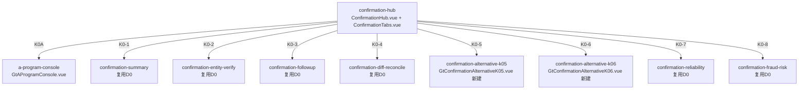

# Design Document: K0 管理循环函证模块

## Overview

K0管理循环函证模块对齐D0实际架构：**复用D0共享函证组件** + **新建K0-5/K0-6替代程序组件**。

D0函证模块已验证架构：9个跨循环共享componentType + confirmation-hub统一入口。E0/F0/G0/H0/K0/L0全部通过overrides映射复用，不为每个循环重复开发（🔴铁律：函证模块跨循环共享）。

**K0需要新建的**：
- `confirmation-alternative-k05`：其他应收款替代程序（4区块按其他应收款科目，参照F0-5预付账款模式）
- `confirmation-alternative-k06`：其他应付款替代程序（4区块按其他应付款科目，参照F0-6应付账款模式）

参照D0-5(GtConfirmationAlternativeD05)/D0-6(GtConfirmationAlternativeD06)模式，K0-5/K0-6结构完全相同，只是4区块检查内容按科目不同。K0-5聚焦期后收款/往来对账，K0-6聚焦期后付款/往来对账。

## Architecture

### D0共享函证架构（K0直接复用）



### 文件结构（仅新建部分）

```
audit-platform/frontend/src/components/workpaper/confirmation/
├── alternativeK05/
│   └── GtConfirmationAlternativeK05.vue    # 新建 (~400行, 参照alternativeD05)
├── alternativeK06/
│   └── GtConfirmationAlternativeK06.vue    # 新建 (~400行, 参照alternativeD06)
├── k0-confirmation/composables/
│   ├── useAlternativeK05Data.ts            # 其他应收款4区块数据管理
│   ├── useAlternativeK06Data.ts            # 其他应付款4区块数据管理
│   ├── useK0FormulaEngine.ts               # 合计/比例/差异/对账差异纯函数
│   └── useK0ImportExport.ts                # 导入导出composable
└── ... (D0已有的shared目录不动)

backend/app/routers/wp_render_strategies/
├── _k0_confirmation.py                     # render策略 + 注册RENDERER_DISPATCH(2个)
├── _k0_confirmation_import_export.py       # 导入导出3端点
└── _k0_confirmation_ai.py                  # AI生成section
```

### K0-5 其他应收款替代程序4区块设计

参照D0-5/F0-5模式（每区块左右视觉分组：记账凭证5列 | 检查证据N列）：

| 区块 | 标题 | 记账凭证列 | 检查证据列 |
|------|------|-----------|-----------|
| ① | 期后收款检查 | 日期/凭证编号/业务内容/对方科目/金额 | 银行回单日期编号/收款方/金额 \| 期后收回比例/索引号/是否异常 |
| ② | 期末余额支持性证据 | 日期/凭证编号/业务内容/对方科目/金额 | 借款/垫款审批单日期编号/是否恰当审批 \| 借据/协议编号/对方单位/金额/索引号/是否异常 |
| ③ | 本期发生额检查 | 日期/凭证编号/业务内容/对方科目/金额 | 原始单据日期编号/事由 \| 审批凭证/审批人/金额/索引号/是否异常 |
| ④ | 往来对账/协议证据 | 日期/凭证编号/业务内容/对方科目/金额 | 对账单日期/对方余额/本方余额/对账差异 \| 往来协议编号/签订日期/索引号/是否异常 |

### K0-6 其他应付款替代程序4区块设计

参照D0-6/F0-6模式（每区块左右视觉分组：记账凭证5列 | 检查证据N列）：

| 区块 | 标题 | 记账凭证列 | 检查证据列 |
|------|------|-----------|-----------|
| ① | 期后付款检查 | 日期/凭证编号/业务内容/对方科目/金额 | 付款审批单日期编号/是否恰当审批 \| 银行回单日期/收款方/金额/索引号/是否异常 |
| ② | 期末余额支持性证据 | 日期/凭证编号/业务内容/对方科目/金额 | 借款/收款审批单日期编号/是否恰当审批 \| 借据/协议编号/对方单位/金额/索引号/是否异常 |
| ③ | 本期发生额检查 | 日期/凭证编号/业务内容/对方科目/金额 | 原始单据日期编号/事由 \| 审批凭证/审批人/金额/索引号/是否异常 |
| ④ | 往来对账/协议证据 | 日期/凭证编号/业务内容/对方科目/金额 | 对账单日期/对方余额/本方余额/对账差异 \| 往来协议编号/签订日期/索引号/是否异常 |

## Components and Interfaces

### 组件接口（参照D0-5/D0-6）

```typescript
// GtConfirmationAlternativeK05/K06 props（与D05/D06完全一致）
interface Props {
  htmlData: Record<string, any> | null
  sheetName: string
  wpId: string
  projectId: string
  readonly?: boolean
}

// 4区块配置
const BLOCKS_K05 = [
  { key: 'post_receipt',     title: '期后收款检查',       columns: [...] },
  { key: 'balance_evidence', title: '期末余额支持性证据',  columns: [...] },
  { key: 'current_amount',   title: '本期发生额检查',     columns: [...] },
  { key: 'reconcile',        title: '往来对账/协议证据',   columns: [...] },
]

const BLOCKS_K06 = [
  { key: 'post_payment',     title: '期后付款检查',       columns: [...] },
  { key: 'balance_evidence', title: '期末余额支持性证据',  columns: [...] },
  { key: 'current_amount',   title: '本期发生额检查',     columns: [...] },
  { key: 'reconcile',        title: '往来对账/协议证据',   columns: [...] },
]

// 余额汇总区
interface AlternativeK0Summary {
  investmentType: string    // 函证项目(其他应收款/其他应付款)
  openingBalance: number    // 年初余额
  debitAmount: number       // 借方发生额
  creditAmount: number      // 贷方发生额
  closingBalance: number    // 期末余额
  currentAmount: number     // 本期发生额
  postCheckRatio: number    // 期后收/付款检查比例
  reconcileRatio: number    // 往来对账比例
}
```

### 公式引擎接口

```typescript
// useK0FormulaEngine.ts（纯函数，可PBT，K05/K06共用）
function calcBlockTotal(amounts: number[]): number                 // Σ amounts, 空→0
function calcCheckRatio(checked: number, balance: number): number  // balance>0 ? checked/balance : 0
function calcRowVariance(book: number, evidence: number): number   // book - evidence
function calcReconcileDiff(self: number, other: number): number    // 本方余额 - 对方余额
function isAbnormal(variance: number): boolean                     // |variance| > 0
```

### 后端接口

```python
# _k0_confirmation.py
def render_k0_alternative_k05(wp_id: str, config: dict) -> dict:
    """Render策略: confirmation-alternative-k05"""
def render_k0_alternative_k06(wp_id: str, config: dict) -> dict:
    """Render策略: confirmation-alternative-k06"""

# _k0_confirmation_import_export.py
POST /api/workpapers/{wp_id}/k0/export-template?sheet={K0-5|K0-6}
POST /api/workpapers/{wp_id}/k0/export-data?sheet={K0-5|K0-6}
POST /api/workpapers/{wp_id}/k0/import-data?sheet={K0-5|K0-6}

# _k0_confirmation_ai.py
POST /api/workpapers/{wp_id}/k0/ai/{section}
# section: alternative-audit-note / alternative-audit-conclusion
```

### 数据流

```mermaid
graph LR
    K01[K0-1 函证结果汇总] -->|未回函公司列表| K05[K0-5 其他应收款替代程序]
    K01 -->|未回函公司列表| K06[K0-6 其他应付款替代程序]
    K05 -->|检查结果| CONC[函证结论]
    K06 -->|检查结果| CONC
    OCR[/d4/contract-ocr] -->|行级OCR识别| K05
    OCR -->|行级OCR识别| K06
    K05 -->|autoSnapshot on save| VT[useVersionTrail 版本快照]
    K06 -->|autoSnapshot on save| VT
```

## Data Models

### 持久化（与D0-5/D0-6模式一致）

item_id前缀：`K0-5-alt-{entity_id}-block{N}-rows` / `K0-6-alt-{entity_id}-block{N}-rows`

存储在checklist_responses.remark (JSON数组)。余额汇总/抽样参数/审计说明结论分别用独立item_id存储（结构化数据不塞进textarea content）。

## Error Handling

1. **Master-Detail加载失败**：左侧公司列表加载失败时显示错误提示+重试按钮
2. **合计计算异常**：parseNum兜底（NaN→0），确保合计始终为数值
3. **检查比例除零**：期末余额=0时比例返回0（不显示NaN/Infinity）
4. **对账差异**：本方/对方余额缺失时按0处理，差异列高亮提示补录
5. **导入格式错误**：后端返回详细错误列表（sheet名/行号/字段/原因），不写入脏数据
6. **OCR识别失败**：返回空结果时toast"未识别到有效往来信息"，保留原行
7. **反向联动失败**：K0-1未回函列表为空时，K0-5/K0-6显示"暂无待替代程序公司"
8. **selfLoad兜底**：bundle内嵌场景htmlData为null时组件自加载render-config

## Testing Strategy

| 类型 | 范围 | 框架 |
|------|------|------|
| Unit | K0-5/K0-6 4区块列配置+CRUD+合计行 | vitest |
| PBT | useK0FormulaEngine P1~P5（合计/比例/差异/对账差异/异常） | vitest + fast-check |
| Contract | VALID_COMPONENT_TYPES + htmlRendererRegistry包含k05/k06 | vitest |
| Integration | confirmation-hub路由到K0-5/K0-6 + 导入导出round-trip | vitest mock |

## Correctness Properties

### Property 1: 区块合计公式
∀ amounts ∈ ℝ*: calcBlockTotal(amounts) === Σ amounts；calcBlockTotal([]) === 0
**Validates: Requirements 6.1, 2.7, 3.7**

### Property 2: 检查比例公式
∀ checked ∈ ℝ≥0, balance ∈ ℝ: calcCheckRatio(checked, balance) === balance>0 ? checked/balance : 0
**Validates: Requirements 6.2, 2.3, 3.3**

### Property 3: 行差异公式与零差异恒等
∀ book, evidence ∈ ℝ: calcRowVariance(book, evidence) === book - evidence；calcRowVariance(v, v) === 0
**Validates: Requirements 6.3**

### Property 4: 对账差异公式与零差异恒等
∀ self, other ∈ ℝ: calcReconcileDiff(self, other) === self - other；calcReconcileDiff(v, v) === 0
**Validates: Requirements 6.4**

### Property 5: 异常判定
∀ book, evidence ∈ ℝ: isAbnormal(calcRowVariance(book, evidence)) === (book ≠ evidence)
**Validates: Requirements 6.5, 2.7, 3.7**
