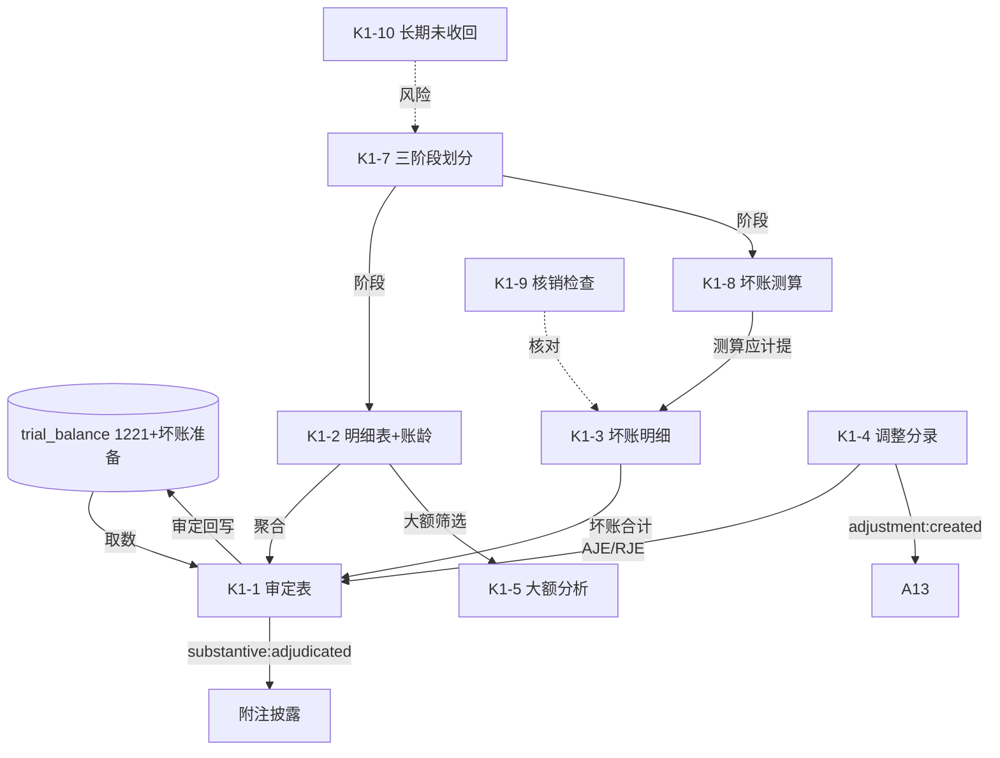

# Design Document: K1 其他应收款底稿专属HTML精美组件

## Overview

K1其他应收款底稿专属组件`k1-other-receivables`。K循环含ECL减值的资产类底稿（1个xlsx/16有效sheet/~110+公式）。科目1221其他应收款（借方/资产类）+ 坏账准备（贷方/资产备抵类）。

核心架构：
- componentType `k1-other-receivables`，主入口 GtK1OtherReceivables.vue
- **无内部el-tabs**：接收`sheetName` prop用`v-if`分发到子组件
- composable分层：useK1FormData + useK1FormulaEngine(纯函数) + useK1ECLEngine(纯函数) + useK1BadDebtCalcEngine(纯函数) + useK1CrossSheet + useK1DualMode + useK1ImportExport + sheet-specific
- **ECL三阶段引擎 + 坏账准备测算引擎独立composable**
- EventBus联动：TB回写(1221+坏账准备) + 附注 + A13

## Architecture

### sheetName分发模式（非嵌套Tab）

```
sheetName → regex提取编码(K1-1~K1-12/K1A/附注) → v-if匹配 → 子组件渲染
                                                        ↘ 未匹配 → OnlyOffice fallback
```

### 资产类+备抵类取数逻辑

```
其他应收款(1221): 期末 = 期初 + 借方 - 贷方 (资产类)
坏账准备:         期末 = 期初 + 贷方 - 借方 (备抵类)
账面净值:         其他应收款 - 坏账准备
```

### ECL三阶段判定

```
isImpaired=true          → Stage 3（已减值，按整个存续期ECL）
significantIncrease=true  → Stage 2（信用风险显著增加，按整个存续期ECL）
否则                      → Stage 1（12个月ECL）
```

### 文件结构

```
audit-platform/frontend/src/components/workpaper/
├── GtK1OtherReceivables.vue                 # 主入口 sheetName v-if分发（defineAsyncComponent lazy）
├── k1/
│   ├── core/
│   │   ├── K1TabIndex.vue                   # 底稿目录（16行进度条）
│   │   ├── K1TabAdjudication.vue            # K1-1 审定表（双区块+净值，47公式，89行）
│   │   ├── K1TabDetail.vue                  # K1-2 明细表（36列3区段+账龄）
│   │   ├── K1TabAdjustment.vue              # K1-4 调整分录
│   │   ├── K1TabDisclosureListed.vue        # 附注上市
│   │   └── K1TabDisclosureSoe.vue           # 附注国企
│   ├── impairment/
│   │   ├── K1TabBadDebtDetail.vue           # K1-3 坏账准备明细（21公式）
│   │   ├── K1TabStageCheck.vue              # K1-7 三阶段划分（63行）
│   │   └── K1TabBadDebtCalc.vue             # K1-8 坏账准备测算（2区段Tab，62行）
│   └── inspection/
│       ├── K1TabLargeAmount.vue             # K1-5 大额分析（9公式）
│       ├── K1TabPolicyCheck.vue             # K1-6 会计政策检查
│       ├── K1TabWriteoffCheck.vue           # K1-9 转回收回核销检查
│       ├── K1TabOverdueCheck.vue            # K1-10 长期未收回检查
│       ├── K1TabRelatedParty.vue            # K1-11 关联方及交易检查
│       └── K1TabReceivableCheck.vue         # K1-12 其他应收款检查
├── composables/
│   ├── useK1FormData.ts                     # selfLoad/保存/writebackTB(1221+坏账准备)
│   ├── useK1FormulaEngine.ts                # 纯函数公式引擎（资产类+备抵类+净值）
│   ├── useK1ECLEngine.ts                    # 纯函数ECL三阶段引擎
│   ├── useK1BadDebtCalcEngine.ts            # 纯函数坏账测算引擎（账龄/迁徙率/ECL）
│   ├── useK1CrossSheet.ts                   # 跨sheet联动computed
│   ├── useK1DualMode.ts + useK1ImportExport.ts
│   └── useK1Adjudication.ts / useK1Detail.ts / useK1BadDebt.ts / ...（sheet-specific）

backend/app/routers/wp_render_strategies/
├── _k1_other_receivables.py                 # render策略+RENDERER_DISPATCH注册
├── _k1_import_export.py                     # 导入导出3端点
└── _k1_ai_generate.py                       # AI生成多section
backend/data/wp_render_schema/k1-other-receivables.yaml
```

## Composable接口设计

### useK1FormulaEngine.ts（纯函数）

```typescript
export function calcAuditedAmount(unadj: number, aje: number, rje: number): number
export function calcAssetEndBalance(begin: number, debit: number, credit: number): number   // 资产类 期末=期初+借-贷
export function calcContraEndBalance(begin: number, credit: number, debit: number): number  // 备抵类 期末=期初+贷-借
export function calcBadDebtEnd(begin: number, provision: number, reversal: number, writeoff: number): number  // 期末坏账=期初+计提-转回-核销
export function calcNetValue(receivable: number, badDebt: number): number   // 净值=应收-坏账
export function calcTriangleReconciliation(begin: number, inc: number, dec: number, end: number): number
export function calcProportion(item: number, total: number): number | null
export function calcSubtotal(arr: number[]): number
export function calcChangeRate(current: number, prior: number): number | null
```

### useK1ECLEngine.ts（纯函数）

```typescript
// 阶段判定：已减值→3；显著增加→2；否则→1
export function determineStage(isImpaired: boolean, significantIncrease: boolean): 1 | 2 | 3
```

### useK1BadDebtCalcEngine.ts（纯函数）

```typescript
export function calcECL(ead: number, pd: number, lgd: number): number  // ECL=EAD×PD×LGD
export function calcAgingLoss(balance: number, lossRate: number): number  // 账龄损失=余额×损失率
export function calcProvisionVariance(calculated: number, booked: number): number  // 测算-企业计提
```

### useK1CrossSheet.ts

```typescript
export function useK1CrossSheet(allResponses: Ref<Map<string, any>>): {
  adjudicationVsDetail: ComputedRef<{ diff: number; isMatch: boolean }>
  badDebtVsCalc: ComputedRef<{ diff: number; isMatch: boolean }>   // K1-3 vs K1-8
  agingVsBalance: ComputedRef<{ diff: number; isMatch: boolean }>  // 账龄合计 vs 期末
}
```

## 跨Sheet数据流图



## Architecture Decision Records (ADR)

### ADR-1: ECL三阶段引擎独立composable

坏账减值是K1核心价值。ECL阶段判定（useK1ECLEngine）与坏账测算（useK1BadDebtCalcEngine）拆为两个纯函数composable，便于PBT验证与跨底稿复用（K1/G2/G4/G6同款ECL模式）。

### ADR-2: 资产类与备抵类双区块审定

K1-1审定表同时审定其他应收款（1221资产类，期末=期初+借-贷）与坏账准备（备抵类，期末=期初+贷-借），并计算账面净值。回写TB时两科目分别回写。

### ADR-3: K1-8宽表2区段Tab拆分

K1-8坏账测算19列，按"账龄迁徙"与"ECL测算"拆为2区段Tab，行同步，减少横向滚动。

## Correctness Properties

| ID | Property | 验证方式 |
|----|----------|---------|
| CP-K1-01 | 审定数=未审+AJE+RJE | PBT |
| CP-K1-02 | 资产类期末=期初+借方-贷方 | PBT |
| CP-K1-03 | 备抵类期末=期初+贷方-借方 | PBT |
| CP-K1-04 | 期末坏账=期初+计提-转回-核销 | PBT |
| CP-K1-05 | 账面净值=应收-坏账 | PBT |
| CP-K1-06 | ECL=EAD×PD×LGD | PBT |
| CP-K1-07 | 阶段判定∈{1,2,3}且已减值→3 | PBT |
| CP-K1-08 | 账龄合计恒等（合计=Σ区间） | PBT |
| CP-K1-09 | 占比=单项/合计 | PBT |

## 错误处理

| 场景 | 处理方式 |
|------|---------|
| selfLoad失败 | el-empty+重试按钮 |
| TB无1221/坏账准备 | 提示导入试算表 |
| 三角勾稽不平 | 红色高亮差额 |
| 账龄合计≠期末 | 红色警告 |
| ECL除零(PD/LGD=0) | ECL=0兜底 |
| 阶段冲突(已减值+未显著增加) | 优先Stage3 |
| 测算差异>重要性 | 红色标记提示调整 |
| 89行/63行/62行渲染卡顿 | 虚拟滚动 |
| OO健康检查失败 | 降级HTML |
