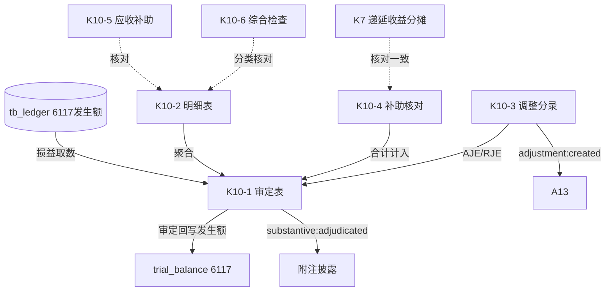

# Design Document: K10 其他收益底稿专属HTML精美组件

## Overview

K10其他收益底稿专属组件`k10-other-income`。K循环损益类底稿（1个xlsx/10有效sheet/~90+公式）。科目6117其他收益（**损益类！取发生额**）。

核心架构：
- componentType `k10-other-income`，主入口 GtK10OtherIncome.vue
- **损益类科目！**从tb_ledger取发生额非余额（收益类贷方发生累计）
- **政府补助核对引擎独立composable**（与K7递延收益分摊核对）
- composable分层：useK10FormData + useK10FormulaEngine(纯函数) + useK10GrantReconcileEngine(纯函数) + useK10CrossSheet + useK10DualMode + useK10ImportExport
- EventBus联动：TB回写(6117发生额) + 附注 + A13 + K7递延收益核对

## Architecture

### sheetName分发模式

```
sheetName → regex提取编码(K10-1~K10-6/K10A/附注) → v-if匹配 → 子组件渲染
                                                      ↘ 未匹配 → OnlyOffice fallback
```

### 损益类取数逻辑

```
损益类(6117): TB取发生额 → audited_amount = 本期贷方发生累计 - 借方发生(红冲)
              来源: tb_ledger 发生额汇总，而非 tb_balance 期末余额
              6117其他收益为贷方科目：贷方=收益增加
```

### 政府补助核对

```
合计计入其他收益 = 直接计入 + 递延分摊计入
核对: 递延分摊计入 == K7递延收益(2401)本期分摊  → 一致性校验
分类: 与日常活动相关 → 其他收益(6117)；与日常活动无关 → 营业外收入(6301,K12)
```

### 文件结构

```
audit-platform/frontend/src/components/workpaper/
├── GtK10OtherIncome.vue                     # 主入口 sheetName v-if分发
├── k10/
│   ├── core/
│   │   ├── K10TabIndex.vue                  # 底稿目录
│   │   ├── K10TabAdjudication.vue           # K10-1 审定表（损益类，69公式）
│   │   ├── K10TabDetail.vue                 # K10-2 明细表（12列，43行）
│   │   ├── K10TabAdjustment.vue             # K10-3 调整分录
│   │   ├── K10TabDisclosureListed.vue       # 附注上市
│   │   └── K10TabDisclosureSoe.vue          # 附注国企
│   └── inspection/
│       ├── K10TabGrantReconcile.vue         # K10-4 政府补助核对（与K7）
│       ├── K10TabReceivableGrant.vue        # K10-5 应收政府补助检查
│       └── K10TabOtherIncomeCheck.vue       # K10-6 综合检查
├── composables/
│   ├── useK10FormData.ts                    # selfLoad/writebackTB(6117发生额！)
│   ├── useK10FormulaEngine.ts               # 纯函数公式引擎（损益类！）
│   ├── useK10GrantReconcileEngine.ts        # 纯函数政府补助核对引擎
│   ├── useK10CrossSheet.ts                  # 跨sheet + K7联动
│   ├── useK10DualMode.ts + useK10ImportExport.ts
│   └── useK10Adjudication.ts / useK10Detail.ts / useK10GrantReconcile.ts / useK10Checks.ts

backend/app/routers/wp_render_strategies/
├── _k10_other_income.py                     # render策略+RENDERER_DISPATCH（损益取数）
├── _k10_import_export.py                    # 导入导出3端点
└── _k10_ai_generate.py                      # AI生成
backend/data/wp_render_schema/k10-other-income.yaml
```

## Composable接口设计

### useK10FormulaEngine.ts（纯函数，损益类）

```typescript
export function calcAuditedAmount(unadj: number, aje: number, rje: number): number
// 收益类发生额 = 贷方发生 - 借方发生(红冲)
export function calcIncomeStatementOccurrence(creditOcc: number, debitOcc: number): number
export function calcYoYChange(current: number, prior: number): number | null
export function calcSubtotal(arr: number[]): number
```

### useK10GrantReconcileEngine.ts（纯函数）

```typescript
export function calcTotalRecognized(direct: number, deferred: number): number  // 直接+递延分摊
export function isConsistentWithK7(deferredInK10: number, amortInK7: number): boolean  // 一致性
```

### useK10CrossSheet.ts

```typescript
export function useK10CrossSheet(allResponses: Ref<Map<string, any>>): {
  adjudicationVsDetail: ComputedRef<{ diff: number; isMatch: boolean }>
  reconcileVsK7: ComputedRef<{ diff: number; isMatch: boolean }>  // K10-4 vs K7分摊
}
```

## 跨Sheet数据流图



## Architecture Decision Records (ADR)

### ADR-1: K10是损益类，取发生额非余额

K10其他收益（6117）损益类贷方科目，从tb_ledger取本期贷方发生额累计（贷方=收益增加），非tb_balance期末余额。回写TB时audited_amount为发生额。

### ADR-2: 政府补助核对引擎联动K7

K10-4政府补助核对表核对"直接计入+递延分摊"合计，并与K7递延收益(2401)本期分摊一致性校验。useK10GrantReconcileEngine纯函数实现合计与一致性判断，通过CrossSheet与K7联动。

### ADR-3: 其他收益 vs 营业外收入分类

与日常活动相关的政府补助计入其他收益(6117)，与日常活动无关的计入营业外收入(6301,K12)。K10-6综合检查表内置分类正确性核对。

## Correctness Properties

| ID | Property | 验证方式 |
|----|----------|---------|
| CP-K10-01 | 审定数=未审+AJE+RJE | PBT |
| CP-K10-02 | 收益类发生额=贷方发生-借方发生 | PBT |
| CP-K10-03 | 合计计入=直接+递延分摊 | PBT |
| CP-K10-04 | 与K7一致性判断（|差额|<0.01→true） | PBT |
| CP-K10-05 | 同比变动率=(本期-上期)/上期 | PBT |
| CP-K10-06 | 合计行恒等 | PBT |

## 错误处理

| 场景 | 处理方式 |
|------|---------|
| selfLoad失败 | el-empty+重试 |
| TB无科目6117 | 提示导入试算表 |
| 损益取数返回期末余额 | 自动切换到发生额取数+黄色警告 |
| 与K7分摊不一致 | 红色标记提示核对 |
| K7未编制 | 黄色警告"K7递延收益未编制" |
| 上期为0(同比除零) | 返回null |
| 43行渲染卡顿 | 虚拟滚动 |
| OO健康检查失败 | 降级HTML |
