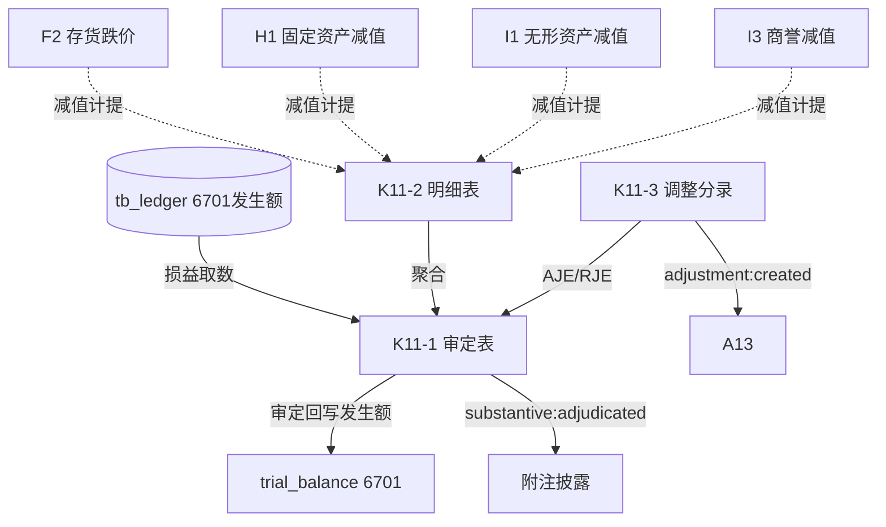

# Design Document: K11 资产减值损失底稿专属HTML精美组件

## Overview

K11资产减值损失底稿专属组件`k11-asset-impairment-loss`。K循环损益类减值汇总底稿（1个xlsx/7有效sheet/~80+公式）。科目6701资产减值损失（**损益类！取发生额**）。

核心架构：
- componentType `k11-asset-impairment-loss`，主入口 GtK11AssetImpairmentLoss.vue
- **损益类科目！**从tb_ledger取发生额非余额（减值损失借方发生累计）
- **减值汇总引擎独立composable**（汇总各资产减值 + 源底稿核对）
- composable分层：useK11FormData + useK11FormulaEngine(纯函数) + useK11ImpairmentSummaryEngine(纯函数) + useK11CrossSheet + useK11DualMode + useK11ImportExport
- EventBus联动：TB回写(6701发生额) + 附注 + A13 + 各减值源底稿(F2/H1/I1/I3)subscribe

## Architecture

### sheetName分发模式

```
sheetName → regex提取编码(K11-1~K11-3/K11A/附注) → v-if匹配 → 子组件渲染
                                                      ↘ 未匹配 → OnlyOffice fallback
```

### 损益类取数逻辑

```
损益类(6701): TB取发生额 → audited_amount = 本期借方发生累计 - 贷方发生(转回红冲)
              来源: tb_ledger 发生额汇总，而非 tb_balance 期末余额
              减值损失为借方科目：借方=减值增加
```

### 减值汇总与源底稿核对

```
减值汇总 = Σ(存货F2 + 固定资产H1 + 无形资产I1 + 商誉I3 + 在建工程 + 长投 + 其他)
源核对: 各类别本期发生额 == 对应源底稿减值计提金额
商誉减值不可转回（无转回列）
```

### 文件结构

```
audit-platform/frontend/src/components/workpaper/
├── GtK11AssetImpairmentLoss.vue             # 主入口 sheetName v-if分发
├── k11/
│   └── core/
│       ├── K11TabIndex.vue                  # 底稿目录（含减值来源汇总状态）
│       ├── K11TabAdjudication.vue           # K11-1 审定表（损益类，61公式，37行）
│       ├── K11TabDetail.vue                 # K11-2 明细表（18列2区段，50行）
│       ├── K11TabAdjustment.vue             # K11-3 调整分录
│       ├── K11TabDisclosureListed.vue       # 附注上市
│       └── K11TabDisclosureSoe.vue          # 附注国企
├── composables/
│   ├── useK11FormData.ts                    # selfLoad/writebackTB(6701发生额！)
│   ├── useK11FormulaEngine.ts               # 纯函数公式引擎（损益类！）
│   ├── useK11ImpairmentSummaryEngine.ts     # 纯函数减值汇总引擎
│   ├── useK11CrossSheet.ts                  # 跨sheet + 源底稿联动
│   ├── useK11DualMode.ts + useK11ImportExport.ts
│   └── useK11Adjudication.ts / useK11Detail.ts

backend/app/routers/wp_render_strategies/
├── _k11_asset_impairment_loss.py            # render策略+RENDERER_DISPATCH（损益取数）
├── _k11_import_export.py                    # 导入导出3端点
└── _k11_ai_generate.py                      # AI生成
backend/data/wp_render_schema/k11-asset-impairment-loss.yaml
```

## Composable接口设计

### useK11FormulaEngine.ts（纯函数，损益类）

```typescript
export function calcAuditedAmount(unadj: number, aje: number, rje: number): number
// 减值损失发生额 = 借方发生 - 贷方发生(转回红冲)
export function calcIncomeStatementOccurrence(debitOcc: number, creditOcc: number): number
export function calcSourceVariance(k11Amount: number, sourceAmount: number): number
export function calcSubtotal(arr: number[]): number
```

### useK11ImpairmentSummaryEngine.ts（纯函数）

```typescript
export function calcImpairmentSummary(sources: number[]): number  // Σ各来源
```

### useK11CrossSheet.ts

```typescript
export function useK11CrossSheet(allResponses: Ref<Map<string, any>>): {
  adjudicationVsDetail: ComputedRef<{ diff: number; isMatch: boolean }>
  sourceReconcile: ComputedRef<{ category: string; diff: number; isMatch: boolean }[]>  // vs F2/H1/I1/I3
}
```

## 跨Sheet数据流图



## Architecture Decision Records (ADR)

### ADR-1: K11是损益类，取发生额非余额

K11资产减值损失（6701）损益类借方科目，从tb_ledger取本期借方发生额累计（借方=减值增加），非tb_balance期末余额。回写TB时audited_amount为发生额。

### ADR-2: 减值汇总引擎联动各源底稿

K11是各类资产减值损失的汇总底稿。useK11ImpairmentSummaryEngine汇总各来源，并通过CrossSheet与F2/H1/I1/I3等源底稿减值计提交叉核对，各来源行GtIndexChip可跳转。

### ADR-3: 商誉减值不可转回特殊处理

商誉减值损失一经确认不得转回（CAS8）。K11-2明细表对商誉类别不显示转回列，减值汇总引擎对商誉来源不接受负向转回。

## Correctness Properties

| ID | Property | 验证方式 |
|----|----------|---------|
| CP-K11-01 | 审定数=未审+AJE+RJE | PBT |
| CP-K11-02 | 减值损失发生额=借方发生-贷方发生 | PBT |
| CP-K11-03 | 减值汇总=Σ各来源 | PBT |
| CP-K11-04 | 源底稿核对差异=K11-源底稿 | PBT |
| CP-K11-05 | 合计行恒等 | PBT |

## 错误处理

| 场景 | 处理方式 |
|------|---------|
| selfLoad失败 | el-empty+重试 |
| TB无科目6701 | 提示导入试算表 |
| 损益取数返回期末余额 | 自动切换到发生额取数+黄色警告 |
| 源底稿未编制 | 黄色警告"F2/H1/I1/I3未编制" |
| 源核对差异>阈值 | 红色标记提示 |
| 商誉出现转回 | 红色错误提示（商誉减值不可转回） |
| 50行/37行渲染卡顿 | 虚拟滚动 |
| OO健康检查失败 | 降级HTML |
