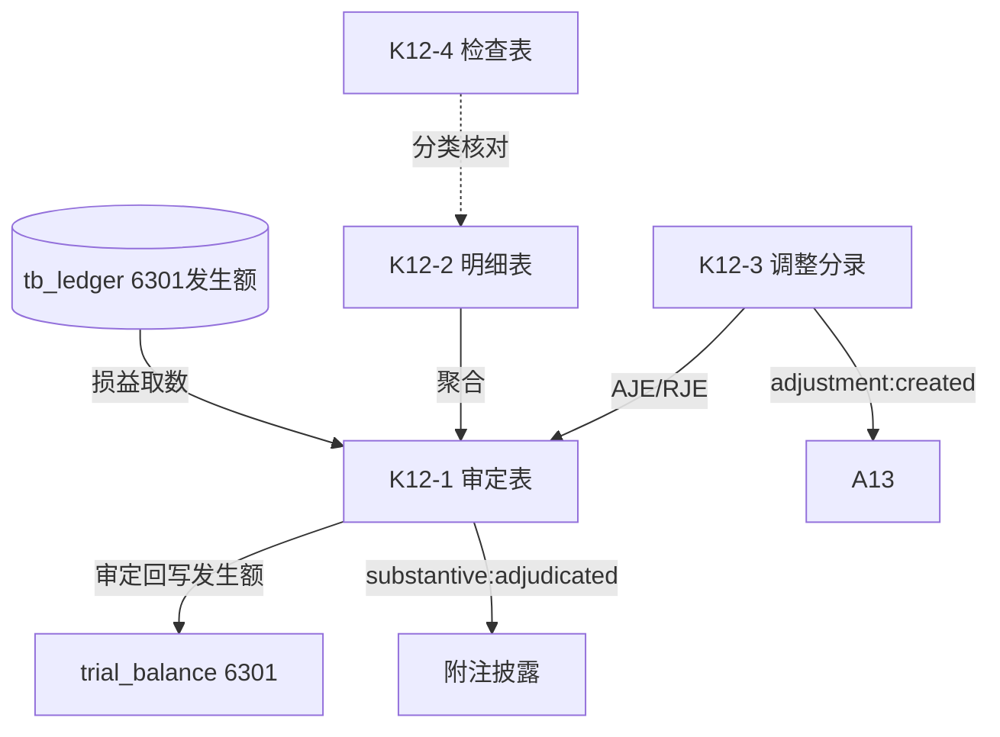

# Design Document: K12 营业外收入底稿专属HTML精美组件

## Overview

K12营业外收入底稿专属组件`k12-non-operating-income`。K循环损益类最简底稿（1个xlsx/9有效sheet/~90+公式）。科目6301营业外收入（**损益类！取发生额**）。

核心架构：
- componentType `k12-non-operating-income`，主入口 GtK12NonOperatingIncome.vue
- **损益类科目！**从tb_ledger取发生额非余额（收入类贷方发生累计）
- composable分层：useK12FormData + useK12FormulaEngine(纯函数) + useK12CrossSheet + useK12DualMode + useK12ImportExport
- EventBus联动：TB回写(6301发生额) + 附注 + A13

## Architecture

### sheetName分发模式

```
sheetName → regex提取编码(K12-1~K12-4/K12A/附注) → v-if匹配 → 子组件渲染
                                                      ↘ 未匹配 → OnlyOffice fallback
```

### 损益类取数逻辑

```
损益类(6301): TB取发生额 → audited_amount = 本期贷方发生累计 - 借方发生(红冲)
              来源: tb_ledger 发生额汇总，而非 tb_balance 期末余额
              6301营业外收入为贷方科目：贷方=收入增加
```

### 文件结构

```
audit-platform/frontend/src/components/workpaper/
├── GtK12NonOperatingIncome.vue              # 主入口 sheetName v-if分发
├── k12/
│   └── core/
│       ├── K12TabIndex.vue                  # 底稿目录
│       ├── K12TabAdjudication.vue           # K12-1 审定表（损益类，70公式）
│       ├── K12TabDetail.vue                 # K12-2 明细表（26列3区段，27行）
│       ├── K12TabAdjustment.vue             # K12-3 调整分录
│       ├── K12TabNonOperatingCheck.vue      # K12-4 检查表
│       ├── K12TabDisclosureListed.vue       # 附注上市
│       └── K12TabDisclosureSoe.vue          # 附注国企
├── composables/
│   ├── useK12FormData.ts                    # selfLoad/writebackTB(6301发生额！)
│   ├── useK12FormulaEngine.ts               # 纯函数公式引擎（损益类！）
│   ├── useK12CrossSheet.ts                  # 跨sheet联动
│   ├── useK12DualMode.ts + useK12ImportExport.ts
│   └── useK12Adjudication.ts / useK12Detail.ts / useK12Check.ts

backend/app/routers/wp_render_strategies/
├── _k12_non_operating_income.py             # render策略+RENDERER_DISPATCH（损益取数）
├── _k12_import_export.py                    # 导入导出3端点
└── _k12_ai_generate.py                      # AI生成
backend/data/wp_render_schema/k12-non-operating-income.yaml
```

## Composable接口设计

### useK12FormulaEngine.ts（纯函数，损益类）

```typescript
export function calcAuditedAmount(unadj: number, aje: number, rje: number): number
// 收入类发生额 = 贷方发生 - 借方发生(红冲)
export function calcIncomeStatementOccurrence(creditOcc: number, debitOcc: number): number
export function calcYoYChange(current: number, prior: number): number | null
export function calcProportion(item: number, total: number): number | null
export function calcSubtotal(arr: number[]): number
```

### useK12CrossSheet.ts

```typescript
export function useK12CrossSheet(allResponses: Ref<Map<string, any>>): {
  adjudicationVsDetail: ComputedRef<{ diff: number; isMatch: boolean }>
}
```

## 跨Sheet数据流图



## Architecture Decision Records (ADR)

### ADR-1: K12是损益类，取发生额非余额

K12营业外收入（6301）损益类贷方科目，从tb_ledger取本期贷方发生额累计（贷方=收入增加），非tb_balance期末余额。回写TB时audited_amount为发生额。

### ADR-2: 最简结构无需拆分子目录

K12仅使用k12/core/一个子目录（7个子组件），对标损益类最简模式。

### ADR-3: 营业外收入 vs 其他收益分类核对

与日常活动无关的利得计入营业外收入(6301)，与日常活动相关的计入其他收益(6117,K10)。K12-4检查表内置分类正确性核对。

## Correctness Properties

| ID | Property | 验证方式 |
|----|----------|---------|
| CP-K12-01 | 审定数=未审+AJE+RJE | PBT |
| CP-K12-02 | 收入类发生额=贷方发生-借方发生 | PBT |
| CP-K12-03 | 同比变动率=(本期-上期)/上期 | PBT |
| CP-K12-04 | 占比=单项/合计 | PBT |
| CP-K12-05 | 合计行恒等 | PBT |

## 错误处理

| 场景 | 处理方式 |
|------|---------|
| selfLoad失败 | el-empty+重试 |
| TB无科目6301 | 提示导入试算表 |
| 损益取数返回期末余额 | 自动切换到发生额取数+黄色警告 |
| 上期为0(同比除零) | 返回null+显示"—" |
| 合计为0(占比除零) | 返回null |
| 27行渲染卡顿 | 虚拟滚动 |
| OO健康检查失败 | 降级HTML |
