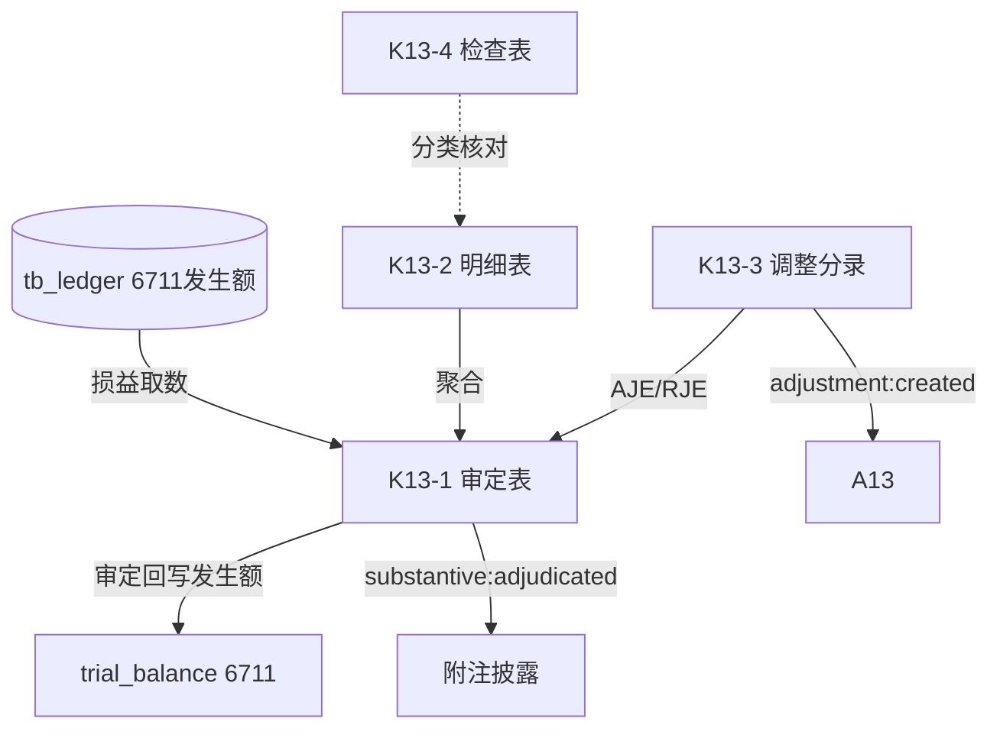

# Design Document: K13 营业外支出底稿专属HTML精美组件

## Overview

K13营业外支出底稿专属组件`k13-non-operating-expense`。K循环损益类最简底稿（1个xlsx/9有效sheet/~90+公式）。科目6711营业外支出（**损益类！取发生额**）。

核心架构：
- componentType `k13-non-operating-expense`，主入口 GtK13NonOperatingExpense.vue
- **损益类科目！**从tb_ledger取发生额非余额（支出类借方发生累计）
- composable分层：useK13FormData + useK13FormulaEngine(纯函数) + useK13CrossSheet + useK13DualMode + useK13ImportExport
- EventBus联动：TB回写(6711发生额) + 附注 + A13

## Architecture

### sheetName分发模式

```
sheetName → regex提取编码(K13-1~K13-4/K13A/附注) → v-if匹配 → 子组件渲染
                                                      ↘ 未匹配 → OnlyOffice fallback
```

### 损益类取数逻辑

```
损益类(6711): TB取发生额 → audited_amount = 本期借方发生累计 - 贷方发生(红冲)
              来源: tb_ledger 发生额汇总，而非 tb_balance 期末余额
              6711营业外支出为借方科目：借方=支出增加
```

### 文件结构

```
audit-platform/frontend/src/components/workpaper/
├── GtK13NonOperatingExpense.vue             # 主入口 sheetName v-if分发
├── k13/
│   └── core/
│       ├── K13TabIndex.vue                  # 底稿目录
│       ├── K13TabAdjudication.vue           # K13-1 审定表（损益类，69公式）
│       ├── K13TabDetail.vue                 # K13-2 明细表（26列3区段，27行）
│       ├── K13TabAdjustment.vue             # K13-3 调整分录
│       ├── K13TabNonOperatingCheck.vue      # K13-4 检查表
│       ├── K13TabDisclosureListed.vue       # 附注上市
│       └── K13TabDisclosureSoe.vue          # 附注国企
├── composables/
│   ├── useK13FormData.ts                    # selfLoad/writebackTB(6711发生额！)
│   ├── useK13FormulaEngine.ts               # 纯函数公式引擎（损益类！）
│   ├── useK13CrossSheet.ts                  # 跨sheet联动
│   ├── useK13DualMode.ts + useK13ImportExport.ts
│   └── useK13Adjudication.ts / useK13Detail.ts / useK13Check.ts

backend/app/routers/wp_render_strategies/
├── _k13_non_operating_expense.py            # render策略+RENDERER_DISPATCH（损益取数）
├── _k13_import_export.py                    # 导入导出3端点
└── _k13_ai_generate.py                      # AI生成
backend/data/wp_render_schema/k13-non-operating-expense.yaml
```

## Composable接口设计

### useK13FormulaEngine.ts（纯函数，损益类）

```typescript
export function calcAuditedAmount(unadj: number, aje: number, rje: number): number
// 支出类发生额 = 借方发生 - 贷方发生(红冲)
export function calcIncomeStatementOccurrence(debitOcc: number, creditOcc: number): number
export function calcYoYChange(current: number, prior: number): number | null
export function calcProportion(item: number, total: number): number | null
export function calcSubtotal(arr: number[]): number
```

### useK13CrossSheet.ts

```typescript
export function useK13CrossSheet(allResponses: Ref<Map<string, any>>): {
  adjudicationVsDetail: ComputedRef<{ diff: number; isMatch: boolean }>
}
```

## 跨Sheet数据流图



## Architecture Decision Records (ADR)

### ADR-1: K13是损益类，取发生额非余额

K13营业外支出（6711）损益类借方科目，从tb_ledger取本期借方发生额累计（借方=支出增加），非tb_balance期末余额。回写TB时audited_amount为发生额。

### ADR-2: 最简结构无需拆分子目录

K13仅使用k13/core/一个子目录（7个子组件），对标损益类最简模式，与K12对称。

### ADR-3: 税前扣除性检查

营业外支出中捐赠支出、罚款滞纳金等存在税前扣除限制，K13-4检查表内置税前扣除性核对，为所得税(L类)提供依据。

## Correctness Properties

| ID | Property | 验证方式 |
|----|----------|---------|
| CP-K13-01 | 审定数=未审+AJE+RJE | PBT |
| CP-K13-02 | 支出类发生额=借方发生-贷方发生 | PBT |
| CP-K13-03 | 同比变动率=(本期-上期)/上期 | PBT |
| CP-K13-04 | 占比=单项/合计 | PBT |
| CP-K13-05 | 合计行恒等 | PBT |

## 错误处理

| 场景 | 处理方式 |
|------|---------|
| selfLoad失败 | el-empty+重试 |
| TB无科目6711 | 提示导入试算表 |
| 损益取数返回期末余额 | 自动切换到发生额取数+黄色警告 |
| 上期为0(同比除零) | 返回null+显示"—" |
| 合计为0(占比除零) | 返回null |
| 27行渲染卡顿 | 虚拟滚动 |
| OO健康检查失败 | 降级HTML |
