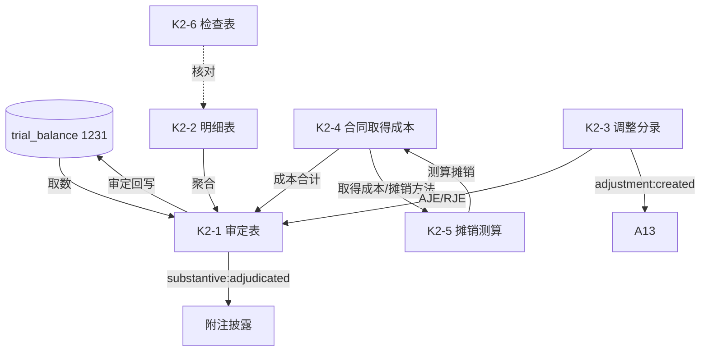

# Design Document: K2 其他流动资产底稿专属HTML精美组件

## Overview

K2其他流动资产底稿专属组件`k2-other-current-assets`。K循环含合同取得成本+摊销测算的资产类底稿（1个xlsx/10有效sheet/~200+公式）。科目1231其他流动资产（借方/资产类）。

核心架构：
- componentType `k2-other-current-assets`，主入口 GtK2OtherCurrentAssets.vue
- **无内部el-tabs**：接收`sheetName` prop用`v-if`分发
- composable分层：useK2FormData + useK2FormulaEngine(纯函数) + useK2AmortizationEngine(纯函数) + useK2CrossSheet + useK2DualMode + useK2ImportExport
- **摊销测算引擎独立composable**（直线法/进度法）
- EventBus联动：TB回写(1231) + 附注 + A13

## Architecture

### sheetName分发模式

```
sheetName → regex提取编码(K2-1~K2-6/K2A/附注) → v-if匹配 → 子组件渲染
                                                    ↘ 未匹配 → OnlyOffice fallback
```

### 资产类取数逻辑

```
其他流动资产(1231): 期末 = 期初 + 借方 - 贷方 (资产类)
合同取得成本:       期末余额 = 期初 + 增加 - 摊销
```

### 摊销测算引擎

```
直线法: 本期摊销 = 取得成本 / 摊销期总期数 × 本期期数
进度法: 本期摊销 = 取得成本 × (本期履约进度 - 上期履约进度)
摊余成本 = 取得成本 - 累计摊销
```

### 文件结构

```
audit-platform/frontend/src/components/workpaper/
├── GtK2OtherCurrentAssets.vue               # 主入口 sheetName v-if分发
├── k2/
│   ├── core/
│   │   ├── K2TabIndex.vue                   # 底稿目录
│   │   ├── K2TabAdjudication.vue            # K2-1 审定表（85公式）
│   │   ├── K2TabDetail.vue                  # K2-2 明细表（18列2区段）
│   │   ├── K2TabAdjustment.vue              # K2-3 调整分录
│   │   ├── K2TabDisclosureListed.vue        # 附注上市
│   │   └── K2TabDisclosureSoe.vue           # 附注国企
│   ├── amortization/
│   │   ├── K2TabContractCost.vue            # K2-4 合同取得成本（57公式，3区段）
│   │   └── K2TabAmortization.vue            # K2-5 摊销测算（37公式，66行）
│   └── inspection/
│       └── K2TabCheck.vue                   # K2-6 检查表
├── composables/
│   ├── useK2FormData.ts                     # selfLoad/writebackTB(1231)
│   ├── useK2FormulaEngine.ts                # 纯函数公式引擎（资产类）
│   ├── useK2AmortizationEngine.ts           # 纯函数摊销引擎（直线/进度）
│   ├── useK2CrossSheet.ts                   # 跨sheet联动
│   ├── useK2DualMode.ts + useK2ImportExport.ts
│   └── useK2Adjudication.ts / useK2Detail.ts / useK2ContractCost.ts / useK2Amortization.ts

backend/app/routers/wp_render_strategies/
├── _k2_other_current_assets.py              # render策略+RENDERER_DISPATCH
├── _k2_import_export.py                     # 导入导出3端点
└── _k2_ai_generate.py                       # AI生成
backend/data/wp_render_schema/k2-other-current-assets.yaml
```

## Composable接口设计

### useK2FormulaEngine.ts（纯函数）

```typescript
export function calcAuditedAmount(unadj: number, aje: number, rje: number): number
export function calcAssetEndBalance(begin: number, debit: number, credit: number): number
export function calcTriangleReconciliation(begin: number, inc: number, dec: number, end: number): number
export function calcSubtotal(arr: number[]): number
export function calcChangeRate(current: number, prior: number): number | null
```

### useK2AmortizationEngine.ts（纯函数）

```typescript
// 直线法：本期摊销 = cost / totalPeriods × currentPeriods
export function calcStraightLineAmort(cost: number, totalPeriods: number, currentPeriods: number): number
// 进度法：本期摊销 = cost × (currentProgress - priorProgress)
export function calcProgressAmort(cost: number, currentProgress: number, priorProgress: number): number
// 摊余成本 = cost - accumulated
export function calcAmortizedBalance(cost: number, accumulated: number): number
export function calcAmortVariance(calculated: number, booked: number): number
```

### useK2CrossSheet.ts

```typescript
export function useK2CrossSheet(allResponses: Ref<Map<string, any>>): {
  adjudicationVsDetail: ComputedRef<{ diff: number; isMatch: boolean }>
  contractCostVsAmort: ComputedRef<{ diff: number; isMatch: boolean }>  // K2-4 vs K2-5
}
```

## 跨Sheet数据流图



## Architecture Decision Records (ADR)

### ADR-1: 摊销测算引擎独立composable

合同取得成本摊销是K2核心。摊销测算（useK2AmortizationEngine）拆为纯函数composable，支持直线法与进度法两种方法，便于PBT验证。

### ADR-2: K2-1审定表85公式密度极高

K2-1仅23行16列但含85公式，公式密度K循环最高。原因：多项目×多列汇总。HTML提供结构化视图，复杂交叉汇总保留OO为主渲染选项。

### ADR-3: 合同取得成本资本化判断

K2-4需判断合同取得成本资本化条件（CAS14：增量成本+预期可收回+与合同直接相关），非资本化的直接费用化，前端提供判断辅助但最终由审计人员确认。

## Correctness Properties

| ID | Property | 验证方式 |
|----|----------|---------|
| CP-K2-01 | 审定数=未审+AJE+RJE | PBT |
| CP-K2-02 | 资产类期末=期初+借方-贷方 | PBT |
| CP-K2-03 | 直线法摊销=cost/总期数×本期期数 | PBT |
| CP-K2-04 | 进度法摊销=cost×(本期进度-上期进度) | PBT |
| CP-K2-05 | 摊余成本=取得成本-累计摊销 | PBT |
| CP-K2-06 | 合计行恒等 | PBT |

## 错误处理

| 场景 | 处理方式 |
|------|---------|
| selfLoad失败 | el-empty+重试 |
| TB无1231 | 提示导入试算表 |
| 三角勾稽不平 | 红色高亮 |
| 摊销期为0 | 摊销=0兜底+警告 |
| 履约进度回退(<上期) | 摊销=0兜底 |
| 摊销差异>重要性 | 红色标记 |
| 66行渲染卡顿 | 虚拟滚动 |
| OO健康检查失败 | 降级HTML |
