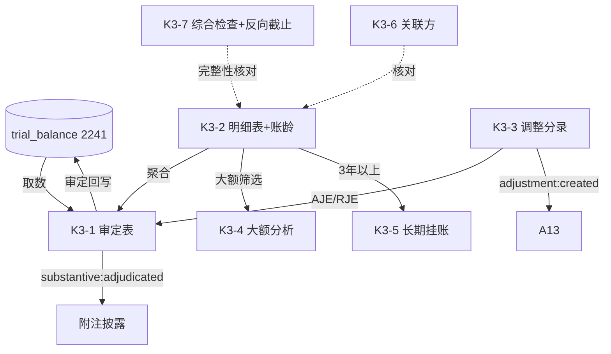

# Design Document: K3 其他应付款底稿专属HTML精美组件

## Overview

K3其他应付款底稿专属组件`k3-other-payables`。K循环负债类底稿（1个xlsx/11有效sheet/~80+公式）。科目2241其他应付款（**贷方/负债类**）。

核心架构：
- componentType `k3-other-payables`，主入口 GtK3OtherPayables.vue
- **无内部el-tabs**：接收`sheetName` prop用`v-if`分发
- **负债类科目**：期末=期初+贷方-借方（与资产类相反）；完整性认定为主+反向截止
- composable分层：useK3FormData + useK3FormulaEngine(纯函数) + useK3CrossSheet + useK3DualMode + useK3ImportExport
- EventBus联动：TB回写(2241) + 附注 + A13

## Architecture

### sheetName分发模式

```
sheetName → regex提取编码(K3-1~K3-7/K3A/附注) → v-if匹配 → 子组件渲染
                                                    ↘ 未匹配 → OnlyOffice fallback
```

### 负债类取数逻辑

```
其他应付款(2241): 期末 = 期初 + 贷方 - 借方 (负债类！方向与资产类相反)
增加 = 贷方发生；减少 = 借方发生
认定重点：完整性（负债易少计）→ 反向截止（期后偿付倒查未入账负债）
```

### 文件结构

```
audit-platform/frontend/src/components/workpaper/
├── GtK3OtherPayables.vue                    # 主入口 sheetName v-if分发
├── k3/
│   ├── core/
│   │   ├── K3TabIndex.vue                   # 底稿目录
│   │   ├── K3TabAdjudication.vue            # K3-1 审定表（负债类，50公式）
│   │   ├── K3TabDetail.vue                  # K3-2 明细表（27列3区段+账龄）
│   │   ├── K3TabAdjustment.vue              # K3-3 调整分录
│   │   ├── K3TabDisclosureListed.vue        # 附注上市
│   │   └── K3TabDisclosureSoe.vue           # 附注国企
│   └── inspection/
│       ├── K3TabLargeAmount.vue             # K3-4 大额分析（8公式）
│       ├── K3TabLongOutstanding.vue         # K3-5 长期挂账检查
│       ├── K3TabRelatedParty.vue            # K3-6 关联方及交易检查
│       └── K3TabPayableCheck.vue            # K3-7 综合检查（含反向截止）
├── composables/
│   ├── useK3FormData.ts                     # selfLoad/writebackTB(2241)
│   ├── useK3FormulaEngine.ts                # 纯函数公式引擎（负债类！）
│   ├── useK3CrossSheet.ts                   # 跨sheet联动
│   ├── useK3DualMode.ts + useK3ImportExport.ts
│   └── useK3Adjudication.ts / useK3Detail.ts / useK3LargeAmount.ts / useK3Checks.ts

backend/app/routers/wp_render_strategies/
├── _k3_other_payables.py                    # render策略+RENDERER_DISPATCH
├── _k3_import_export.py                     # 导入导出3端点
└── _k3_ai_generate.py                       # AI生成
backend/data/wp_render_schema/k3-other-payables.yaml
```

## Composable接口设计

### useK3FormulaEngine.ts（纯函数，负债类）

```typescript
export function calcAuditedAmount(unadj: number, aje: number, rje: number): number
// 负债类：期末 = 期初 + 贷方 - 借方（与资产类相反！）
export function calcLiabilityEndBalance(begin: number, credit: number, debit: number): number
export function calcTriangleReconciliation(begin: number, inc: number, dec: number, end: number): number
export function calcProportion(item: number, total: number): number | null
export function calcSubtotal(arr: number[]): number
export function calcChangeRate(current: number, prior: number): number | null
```

### useK3CrossSheet.ts

```typescript
export function useK3CrossSheet(allResponses: Ref<Map<string, any>>): {
  adjudicationVsDetail: ComputedRef<{ diff: number; isMatch: boolean }>
  longOutstandingVsDetail: ComputedRef<{ count: number; total: number }>  // 3年以上联动
}
```

## 跨Sheet数据流图



## Architecture Decision Records (ADR)

### ADR-1: K3是负债类，方向与资产类相反

K3其他应付款（2241）是负债类科目，期末=期初+贷方-借方（增加在贷方）。审定与三角勾稽逻辑需按负债方向实现，回写TB时以负债口径处理。

### ADR-2: 完整性认定为主 + 反向截止

负债类审计重点是完整性（易少计）。K3-7综合检查表内置反向截止测试（期后偿付倒查未入账负债），明细表支持"疑似未入账"标记。

### ADR-3: 长期挂账独立检查表联动

K3-5长期挂账检查与K3-2明细3年以上账龄行联动，评估长期未偿付款项是否需转营业外收入（联动K12）。

## Correctness Properties

| ID | Property | 验证方式 |
|----|----------|---------|
| CP-K3-01 | 审定数=未审+AJE+RJE | PBT |
| CP-K3-02 | 负债类期末=期初+贷方-借方 | PBT |
| CP-K3-03 | 三角勾稽差额≡0 | PBT |
| CP-K3-04 | 账龄合计恒等 | PBT |
| CP-K3-05 | 占比=单项/合计 | PBT |
| CP-K3-06 | 合计行恒等 | PBT |

## 错误处理

| 场景 | 处理方式 |
|------|---------|
| selfLoad失败 | el-empty+重试 |
| TB无2241 | 提示导入试算表 |
| 三角勾稽不平 | 红色高亮 |
| 账龄合计≠期末 | 红色警告 |
| 误用资产类方向 | 引擎按负债类固定+校验提示 |
| 51行渲染卡顿 | 虚拟滚动 |
| OO健康检查失败 | 降级HTML |
