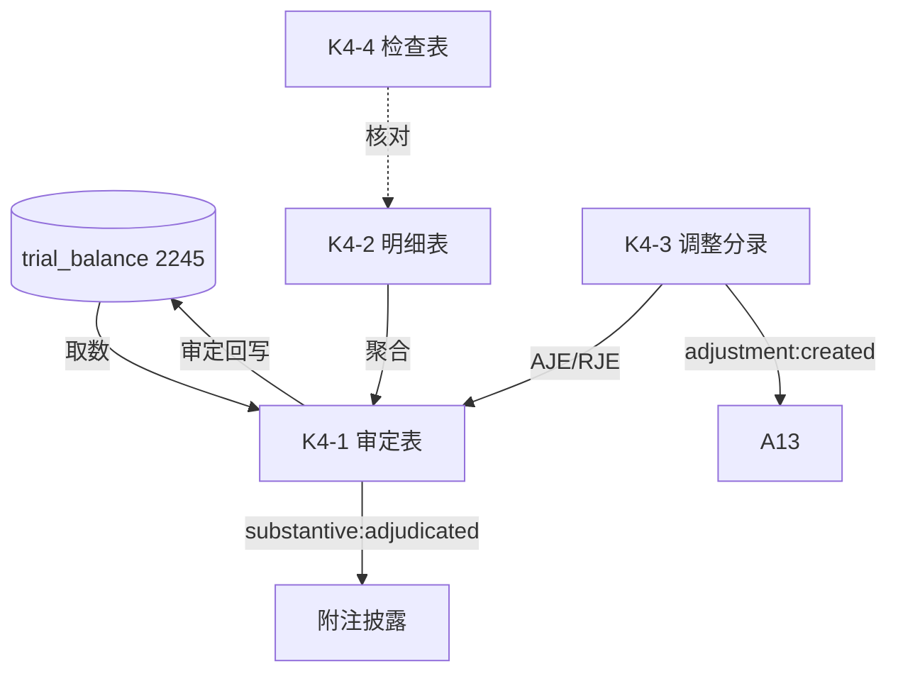

# Design Document: K4 其他流动负债底稿专属HTML精美组件

## Overview

K4其他流动负债底稿专属组件`k4-other-current-liabilities`。K循环负债类最简底稿（1个xlsx/8有效sheet/~90+公式）。科目2245其他流动负债（**贷方/负债类**）。

核心架构：
- componentType `k4-other-current-liabilities`，主入口 GtK4OtherCurrentLiabilities.vue
- 最简标准负债类模式，无特殊逻辑（对标I5简单结构）
- **负债类科目**：期末=期初+贷方-借方
- composable分层：useK4FormData + useK4FormulaEngine(纯函数) + useK4CrossSheet + useK4DualMode + useK4ImportExport
- EventBus联动：TB回写(2245) + 附注 + A13

## Architecture

### sheetName分发模式

```
sheetName → regex提取编码(K4-1~K4-4/K4A/附注) → v-if匹配 → 子组件渲染
                                                    ↘ 未匹配 → OnlyOffice fallback
```

### 负债类取数逻辑

```
其他流动负债(2245): 期末 = 期初 + 贷方 - 借方 (负债类)
```

### 文件结构

```
audit-platform/frontend/src/components/workpaper/
├── GtK4OtherCurrentLiabilities.vue          # 主入口 sheetName v-if分发
├── k4/
│   └── core/
│       ├── K4TabIndex.vue                   # 底稿目录
│       ├── K4TabAdjudication.vue            # K4-1 审定表（负债类，72公式）
│       ├── K4TabDetail.vue                  # K4-2 明细表（18列2区段）
│       ├── K4TabAdjustment.vue              # K4-3 调整分录
│       ├── K4TabCheck.vue                   # K4-4 检查表
│       ├── K4TabDisclosureListed.vue        # 附注上市
│       └── K4TabDisclosureSoe.vue           # 附注国企
├── composables/
│   ├── useK4FormData.ts                     # selfLoad/writebackTB(2245)
│   ├── useK4FormulaEngine.ts                # 纯函数公式引擎（负债类）
│   ├── useK4CrossSheet.ts                   # 跨sheet联动
│   ├── useK4DualMode.ts + useK4ImportExport.ts
│   └── useK4Adjudication.ts / useK4Detail.ts / useK4Check.ts

backend/app/routers/wp_render_strategies/
├── _k4_other_current_liabilities.py         # render策略+RENDERER_DISPATCH
├── _k4_import_export.py                     # 导入导出3端点
└── _k4_ai_generate.py                       # AI生成
backend/data/wp_render_schema/k4-other-current-liabilities.yaml
```

## Composable接口设计

### useK4FormulaEngine.ts（纯函数，负债类）

```typescript
export function calcAuditedAmount(unadj: number, aje: number, rje: number): number
// 负债类：期末 = 期初 + 贷方 - 借方
export function calcLiabilityEndBalance(begin: number, credit: number, debit: number): number
export function calcTriangleReconciliation(begin: number, inc: number, dec: number, end: number): number
export function calcSubtotal(arr: number[]): number
export function calcChangeRate(current: number, prior: number): number | null
```

### useK4CrossSheet.ts

```typescript
export function useK4CrossSheet(allResponses: Ref<Map<string, any>>): {
  detailTotals: ComputedRef<{ total: number }>
  adjudicationFromDetail: ComputedRef<{ audited: number }>
}
```

## 跨Sheet数据流图



## Architecture Decision Records (ADR)

### ADR-1: 最简结构无需拆分子目录

K4仅使用k4/core/一个子目录（7个子组件），无特殊专项功能，对标I5最简模式。

### ADR-2: 负债类方向

K4其他流动负债（2245）负债类，期末=期初+贷方-借方，回写TB以负债口径处理，完整性认定为主。

## Correctness Properties

| ID | Property | 验证方式 |
|----|----------|---------|
| CP-K4-01 | 审定数=未审+AJE+RJE | PBT |
| CP-K4-02 | 负债类期末=期初+贷方-借方 | PBT |
| CP-K4-03 | 三角勾稽差额≡0 | PBT |
| CP-K4-04 | 合计行恒等 | PBT |
| CP-K4-05 | 借贷平衡 | PBT |

## 错误处理

| 场景 | 处理方式 |
|------|---------|
| selfLoad失败 | el-empty+重试 |
| TB无2245 | 提示导入试算表 |
| 三角勾稽不平 | 红色高亮 |
| 误用资产类方向 | 引擎按负债类固定 |
| OO健康检查失败 | 降级HTML |
