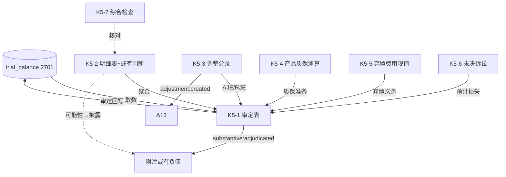

# Design Document: K5 预计负债底稿专属HTML精美组件

## Overview

K5预计负债底稿专属组件`k5-provisions`。K循环含或有事项判断的负债类底稿（1个xlsx/10有效sheet/~100+公式）。科目2701预计负债（**贷方/负债类**）。

核心架构：
- componentType `k5-provisions`，主入口 GtK5Provisions.vue
- **无内部el-tabs**：接收`sheetName` prop用`v-if`分发
- **或有事项判断引擎 + 最佳估计数引擎独立composable**
- composable分层：useK5FormData + useK5FormulaEngine(纯函数) + useK5ContingencyEngine(纯函数) + useK5BestEstimateEngine(纯函数) + useK5CrossSheet + useK5DualMode + useK5ImportExport
- EventBus联动：TB回写(2701) + 附注(或有负债披露) + A13

## Architecture

### sheetName分发模式

```
sheetName → regex提取编码(K5-1~K5-7/K5A/附注) → v-if匹配 → 子组件渲染
                                                    ↘ 未匹配 → OnlyOffice fallback
```

### 或有事项三级可能性判断（CAS13）

```
很可能 (very_likely, >50%)  → 确认预计负债 (recognize) + 填最佳估计数
可能   (possible, ≤50%非极小) → 披露或有负债 (disclose) → 附注
极小可能 (remote)            → 不处理 (ignore)
```

### 最佳估计数计量

```
单一事项:   最佳估计数 = 最可能发生金额
连续区间:   最佳估计数 = (上限 + 下限) / 2
多情形:     最佳估计数 = Σ(各情形金额 × 概率)  期望值加权
时间价值重大: 按现值折现
```

### 负债类取数逻辑

```
预计负债(2701): 期末 = 期初 + 计提(增加) - 转销/冲回(减少) (负债类)
```

### 文件结构

```
audit-platform/frontend/src/components/workpaper/
├── GtK5Provisions.vue                       # 主入口 sheetName v-if分发
├── k5/
│   ├── core/
│   │   ├── K5TabIndex.vue                   # 底稿目录
│   │   ├── K5TabAdjudication.vue            # K5-1 审定表（负债类，108实质公式）
│   │   ├── K5TabDetail.vue                  # K5-2 明细表（23列3区段+或有判断+42行）
│   │   ├── K5TabAdjustment.vue              # K5-3 调整分录
│   │   ├── K5TabDisclosureListed.vue        # 附注上市（含或有负债披露）
│   │   └── K5TabDisclosureSoe.vue           # 附注国企
│   └── contingency/
│       ├── K5TabWarrantyCheck.vue           # K5-4 产品质量保修检查
│       ├── K5TabDecommissionCheck.vue       # K5-5 弃置费用检查（现值折现）
│       ├── K5TabLitigationCheck.vue         # K5-6 未决诉讼检查（律师函联动）
│       └── K5TabProvisionCheck.vue          # K5-7 综合检查
├── composables/
│   ├── useK5FormData.ts                     # selfLoad/writebackTB(2701)
│   ├── useK5FormulaEngine.ts                # 纯函数公式引擎（负债类）
│   ├── useK5ContingencyEngine.ts            # 纯函数或有事项判断引擎
│   ├── useK5BestEstimateEngine.ts           # 纯函数最佳估计数引擎
│   ├── useK5CrossSheet.ts                   # 跨sheet联动
│   ├── useK5DualMode.ts + useK5ImportExport.ts
│   └── useK5Adjudication.ts / useK5Detail.ts / useK5Warranty.ts / useK5Decommission.ts / useK5Litigation.ts

backend/app/routers/wp_render_strategies/
├── _k5_provisions.py                        # render策略+RENDERER_DISPATCH
├── _k5_import_export.py                     # 导入导出3端点
└── _k5_ai_generate.py                       # AI生成（诉讼/质保/弃置）
backend/data/wp_render_schema/k5-provisions.yaml
```

## Composable接口设计

### useK5FormulaEngine.ts（纯函数，负债类）

```typescript
export function calcAuditedAmount(unadj: number, aje: number, rje: number): number
// 负债类：期末 = 期初 + 计提 - 转销
export function calcLiabilityEndBalance(begin: number, provision: number, release: number): number
export function calcSubtotal(arr: number[]): number
```

### useK5ContingencyEngine.ts（纯函数）

```typescript
export type LikelihoodLevel = 'very_likely' | 'possible' | 'remote'
export type Recognition = 'recognize' | 'disclose' | 'ignore'
// 很可能→确认；可能→披露；极小可能→不处理
export function determineRecognition(level: LikelihoodLevel): Recognition
```

### useK5BestEstimateEngine.ts（纯函数）

```typescript
export function calcRangeMidpoint(upper: number, lower: number): number   // (上限+下限)/2
export function calcExpectedValue(amounts: number[], probs: number[]): number  // Σ(金额×概率)
export function calcWarrantyProvision(revenue: number, rate: number): number    // 收入×保修率
export function calcPresentValue(future: number, rate: number, years: number): number  // future/(1+rate)^years
```

### useK5CrossSheet.ts

```typescript
export function useK5CrossSheet(allResponses: Ref<Map<string, any>>): {
  adjudicationVsDetail: ComputedRef<{ diff: number; isMatch: boolean }>
  warrantyVsAdjudication: ComputedRef<{ diff: number; isMatch: boolean }>   // K5-4 vs K5-1质保行
  decommissionVsAdjudication: ComputedRef<{ diff: number; isMatch: boolean }>  // K5-5 vs K5-1弃置行
  litigationVsAdjudication: ComputedRef<{ diff: number; isMatch: boolean }>  // K5-6 vs K5-1诉讼行
}
```

## 跨Sheet数据流图



## Architecture Decision Records (ADR)

### ADR-1: 或有事项判断引擎独立composable

CAS13三级可能性判断（很可能/可能/极小可能）是K5核心价值。useK5ContingencyEngine纯函数实现确认/披露/不处理决策，便于PBT验证决策映射的确定性。

### ADR-2: 最佳估计数引擎支持三种计量方法

useK5BestEstimateEngine支持单值（最可能金额）、区间中值（(上限+下限)/2）、期望值加权（Σ金额×概率），并在时间价值重大时提供现值折现。各方法拆为独立纯函数便于PBT。

### ADR-3: 三专项检查表分别测算并回连审定

产品质保（K5-4）、弃置费用（K5-5）、未决诉讼（K5-6）各自测算金额，通过CrossSheet computed与K5-1审定表对应类型行交叉验证，形成"专项测算→审定汇总"的联动链。

## Correctness Properties

| ID | Property | 验证方式 |
|----|----------|---------|
| CP-K5-01 | 审定数=未审+AJE+RJE | PBT |
| CP-K5-02 | 负债类期末=期初+计提-转销 | PBT |
| CP-K5-03 | 或有确认决策确定性（very_likely→recognize等） | PBT |
| CP-K5-04 | 区间中值=(上限+下限)/2 | PBT |
| CP-K5-05 | 期望值=Σ(金额×概率) | PBT |
| CP-K5-06 | 保修支出=收入×保修率 | PBT |
| CP-K5-07 | 现值=future/(1+rate)^years | PBT |

## 错误处理

| 场景 | 处理方式 |
|------|---------|
| selfLoad失败 | el-empty+重试 |
| TB无2701 | 提示导入试算表 |
| 三角勾稽不平 | 红色高亮 |
| 概率之和≠1(期望值) | 黄色警告 |
| 折现率为0或负 | 现值=future兜底+警告 |
| 弃置年数为0 | 现值=future |
| 很可能未填估计数 | 红色必填提示 |
| 42行渲染卡顿 | 虚拟滚动 |
| OO健康检查失败 | 降级HTML |
