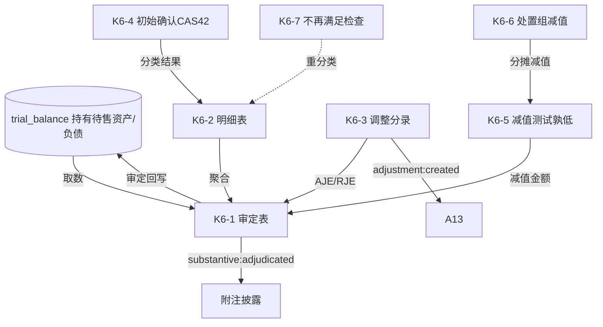

# Design Document: K6 持有待售资产和负债底稿专属HTML精美组件

## Overview

K6持有待售资产和负债底稿专属组件`k6-held-for-sale`。K循环含CAS42分类+减值孰低的资产/负债混合底稿（1个xlsx/11有效sheet/~90+公式）。科目持有待售资产（借方/资产类）+ 持有待售负债（贷方/负债类）。

核心架构：
- componentType `k6-held-for-sale`，主入口 GtK6HeldForSale.vue
- **无内部el-tabs**：接收`sheetName` prop用`v-if`分发
- **CAS42五条件分类引擎 + 减值孰低法引擎独立composable**
- composable分层：useK6FormData + useK6FormulaEngine(纯函数) + useK6ClassificationEngine(纯函数) + useK6ImpairmentEngine(纯函数) + useK6CrossSheet + useK6DualMode + useK6ImportExport
- EventBus联动：TB回写(持有待售资产+负债) + 附注 + A13

## Architecture

### sheetName分发模式

```
sheetName → regex提取编码(K6-1~K6-7/K6A/附注) → v-if匹配 → 子组件渲染
                                                    ↘ 未匹配 → OnlyOffice fallback
```

### CAS42五条件分类判断

```
条件① 可立即出售
条件② 已就出售作出决议
条件③ 已签订不可撤销转让协议
条件④ 出售预计一年内完成
条件⑤ 售价合理，不太可能变更/撤销
全部满足 → classified（分类为持有待售）
任一不满足 → not_classified（不得分类）
```

### 减值孰低法

```
公允价值净额 = 公允价值 - 预计出售费用
减值金额     = MAX(0, 账面价值 - 公允价值净额)   ← 孰低法
处置组减值   先抵减商誉，再按账面比例分摊至组内非流动资产
```

### 资产/负债混合取数逻辑

```
持有待售资产: 期末 = 期初 + 增加 - 减少 - 减值 (资产类)
持有待售负债: 期末 = 期初 + 增加 - 减少 (负债类)
```

### 文件结构

```
audit-platform/frontend/src/components/workpaper/
├── GtK6HeldForSale.vue                      # 主入口 sheetName v-if分发
├── k6/
│   ├── core/
│   │   ├── K6TabIndex.vue                   # 底稿目录
│   │   ├── K6TabAdjudication.vue            # K6-1 审定表（资产+负债双区块，45公式）
│   │   ├── K6TabDetail.vue                  # K6-2 明细表（15列12公式，40行）
│   │   ├── K6TabAdjustment.vue              # K6-3 调整分录
│   │   ├── K6TabDisclosureListed.vue        # 附注上市
│   │   └── K6TabDisclosureSoe.vue           # 附注国企
│   └── impairment/
│       ├── K6TabInitialRecognition.vue      # K6-4 初始确认（CAS42五条件清单）
│       ├── K6TabImpairmentTest.vue          # K6-5 减值测试（孰低法，23行）
│       ├── K6TabGroupImpairment.vue         # K6-6 处置组减值（55行）
│       └── K6TabNoLongerCheck.vue           # K6-7 不再满足持有待售检查
├── composables/
│   ├── useK6FormData.ts                     # selfLoad/writebackTB(持有待售资产+负债)
│   ├── useK6FormulaEngine.ts                # 纯函数公式引擎（账面价值+审定）
│   ├── useK6ClassificationEngine.ts         # 纯函数CAS42五条件分类引擎
│   ├── useK6ImpairmentEngine.ts             # 纯函数减值孰低法引擎
│   ├── useK6CrossSheet.ts                   # 跨sheet联动
│   ├── useK6DualMode.ts + useK6ImportExport.ts
│   └── useK6Adjudication.ts / useK6Detail.ts / useK6InitialRecognition.ts / useK6Impairment.ts / useK6GroupImpairment.ts

backend/app/routers/wp_render_strategies/
├── _k6_held_for_sale.py                     # render策略+RENDERER_DISPATCH
├── _k6_import_export.py                     # 导入导出3端点
└── _k6_ai_generate.py                       # AI生成
backend/data/wp_render_schema/k6-held-for-sale.yaml
```

## Composable接口设计

### useK6FormulaEngine.ts（纯函数）

```typescript
export function calcAuditedAmount(unadj: number, aje: number, rje: number): number
export function calcBookValue(cost: number, dep: number, impairment: number): number  // 账面=原值-折旧摊销-减值
export function calcSubtotal(arr: number[]): number
```

### useK6ClassificationEngine.ts（纯函数）

```typescript
// 五条件全满足→classified；任一不满足→not_classified
export function classifyHeldForSale(conditions: boolean[]): 'classified' | 'not_classified'
```

### useK6ImpairmentEngine.ts（纯函数）

```typescript
export function calcFairValueNet(fairValue: number, sellingCost: number): number  // 公允-出售费用
export function calcImpairment(bookValue: number, fairValueNet: number): number   // MAX(0, 账面-公允净额)
export function calcAllocationRatio(itemBook: number, groupBook: number): number  // 分摊比例
```

### useK6CrossSheet.ts

```typescript
export function useK6CrossSheet(allResponses: Ref<Map<string, any>>): {
  adjudicationVsDetail: ComputedRef<{ diff: number; isMatch: boolean }>
  impairmentVsAdjudication: ComputedRef<{ diff: number; isMatch: boolean }>  // K6-5 vs K6-1减值
  groupVsImpairment: ComputedRef<{ diff: number; isMatch: boolean }>          // K6-6 vs K6-5
}
```

## 跨Sheet数据流图



## Architecture Decision Records (ADR)

### ADR-1: CAS42五条件分类引擎独立composable

持有待售分类判断是K6确认层核心。useK6ClassificationEngine以布尔数组表达五条件，全满足才分类，便于PBT验证"全True→classified，任一False→not_classified"。

### ADR-2: 减值孰低法引擎

K6减值按孰低法：减值=MAX(0, 账面价值-(公允价值-出售费用))。useK6ImpairmentEngine纯函数实现，保证减值非负，便于PBT。处置组减值先抵商誉再分摊。

### ADR-3: 资产+负债混合审定双区块

K6同时含持有待售资产（借方）与持有待售负债（贷方），审定表双区块，回写TB两科目分别处理。

## Correctness Properties

| ID | Property | 验证方式 |
|----|----------|---------|
| CP-K6-01 | 审定数=未审+AJE+RJE | PBT |
| CP-K6-02 | 账面价值=原值-折旧摊销-减值 | PBT |
| CP-K6-03 | 分类判断：全满足→classified，任一不满足→not_classified | PBT |
| CP-K6-04 | 公允价值净额=公允-出售费用 | PBT |
| CP-K6-05 | 减值=MAX(0,账面-公允净额)且减值≥0 | PBT |
| CP-K6-06 | 分摊比例=组内/组合计 | PBT |
| CP-K6-07 | 合计行恒等 | PBT |

## 错误处理

| 场景 | 处理方式 |
|------|---------|
| selfLoad失败 | el-empty+重试 |
| TB无持有待售科目 | 提示导入试算表 |
| 三角勾稽不平 | 红色高亮 |
| 公允价值净额为负 | 减值取账面价值全额+提示 |
| 五条件未全满足 | 红色不符合分类提示 |
| 组账面合计为0 | 分摊比例=0兜底 |
| 55行/40行/23行渲染卡顿 | 虚拟滚动 |
| OO健康检查失败 | 降级HTML |
