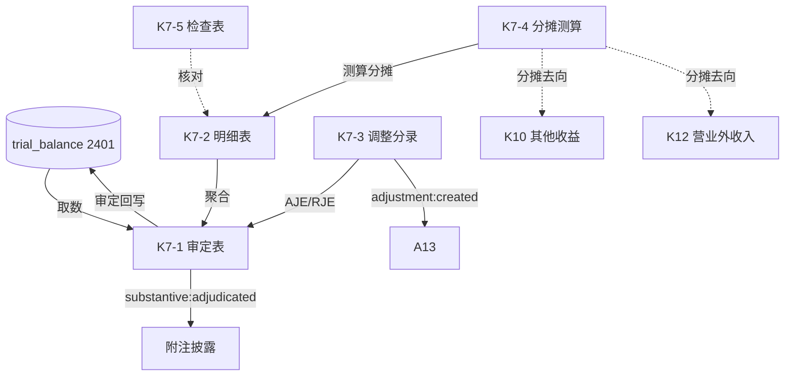

# Design Document: K7 递延收益底稿专属HTML精美组件

## Overview

K7递延收益底稿专属组件`k7-deferred-income`。K循环含政府补助分摊测算的负债类底稿（1个xlsx/10有效sheet，1个会计提示辅助sheet走OO fallback/~100+公式）。科目2401递延收益（**贷方/负债类**）。

核心架构：
- componentType `k7-deferred-income`，主入口 GtK7DeferredIncome.vue
- **无内部el-tabs**：接收`sheetName` prop用`v-if`分发
- **政府补助分摊测算引擎独立composable**（与资产相关/与收益相关）
- composable分层：useK7FormData + useK7FormulaEngine(纯函数) + useK7GrantAmortEngine(纯函数) + useK7CrossSheet + useK7DualMode + useK7ImportExport
- EventBus联动：TB回写(2401) + 附注 + A13 + 分摊去向联动K10/K12

## Architecture

### sheetName分发模式

```
sheetName → regex提取编码(K7-1~K7-5/K7A/附注) → v-if匹配 → 子组件渲染
                                                    ↘ 会计提示辅助/未匹配 → OnlyOffice fallback
```

### 负债类取数逻辑

```
递延收益(2401): 期末 = 期初 + 收到(增加) - 分摊(减少) (负债类)
```

### 政府补助分摊（CAS16）

```
与资产相关: 在相关资产使用寿命内按合理系统方法分期计入损益（直线法）
            本期分摊 = 补助总额 / 分摊期总期数 × 本期期数
与收益相关: 补偿以后期间费用 → 确认为递延收益，分期计入其他收益/营业外收入
            补偿已发生费用/损失 → 直接计入当期损益
期末余额 = 补助总额 - 累计分摊
```

### 文件结构

```
audit-platform/frontend/src/components/workpaper/
├── GtK7DeferredIncome.vue                   # 主入口 sheetName v-if分发
├── k7/
│   ├── core/
│   │   ├── K7TabIndex.vue                   # 底稿目录
│   │   ├── K7TabAdjudication.vue            # K7-1 审定表（负债类，49公式，54行）
│   │   ├── K7TabDetail.vue                  # K7-2 明细表（32列3区段，41行）
│   │   ├── K7TabAdjustment.vue              # K7-3 调整分录
│   │   ├── K7TabDisclosureListed.vue        # 附注上市
│   │   └── K7TabDisclosureSoe.vue           # 附注国企
│   ├── amortization/
│   │   └── K7TabAmortizationCalc.vue        # K7-4 分摊测算（23公式）
│   └── inspection/
│       └── K7TabDeferredCheck.vue           # K7-5 检查表
├── composables/
│   ├── useK7FormData.ts                     # selfLoad/writebackTB(2401)
│   ├── useK7FormulaEngine.ts                # 纯函数公式引擎（负债类）
│   ├── useK7GrantAmortEngine.ts             # 纯函数政府补助分摊引擎
│   ├── useK7CrossSheet.ts                   # 跨sheet联动
│   ├── useK7DualMode.ts + useK7ImportExport.ts
│   └── useK7Adjudication.ts / useK7Detail.ts / useK7AmortizationCalc.ts / useK7Check.ts

backend/app/routers/wp_render_strategies/
├── _k7_deferred_income.py                   # render策略+RENDERER_DISPATCH
├── _k7_import_export.py                     # 导入导出3端点
└── _k7_ai_generate.py                       # AI生成
backend/data/wp_render_schema/k7-deferred-income.yaml
```

## Composable接口设计

### useK7FormulaEngine.ts（纯函数，负债类）

```typescript
export function calcAuditedAmount(unadj: number, aje: number, rje: number): number
// 负债类：期末 = 期初 + 收到 - 分摊
export function calcLiabilityEndBalance(begin: number, received: number, amortized: number): number
export function calcSubtotal(arr: number[]): number
```

### useK7GrantAmortEngine.ts（纯函数）

```typescript
// 直线分摊：本期 = 总额 / 总期数 × 本期期数
export function calcStraightLineAmort(total: number, totalPeriods: number, currentPeriods: number): number
// 期末余额 = 总额 - 累计分摊
export function calcRemainingBalance(total: number, accumulated: number): number
export function calcAmortVariance(calculated: number, booked: number): number
```

### useK7CrossSheet.ts

```typescript
export function useK7CrossSheet(allResponses: Ref<Map<string, any>>): {
  adjudicationVsDetail: ComputedRef<{ diff: number; isMatch: boolean }>
  detailVsCalc: ComputedRef<{ diff: number; isMatch: boolean }>  // K7-2 vs K7-4
}
```

## 跨Sheet数据流图



## Architecture Decision Records (ADR)

### ADR-1: 政府补助分摊引擎独立composable

CAS16政府补助分摊是K7核心价值。useK7GrantAmortEngine纯函数实现直线分摊与期末余额计算，区分与资产相关/与收益相关，便于PBT验证。

### ADR-2: 负债类方向 + 分摊去向联动损益

K7递延收益（2401）负债类，期末=期初+收到-分摊。分摊金额去向为其他收益(K10)/营业外收入(K12)，通过GtIndexChip与EventBus建立联动追溯。

### ADR-3: 会计提示辅助sheet走OO fallback

源模板含1个会计提示辅助sheet（非功能表），不组件化，走OnlyOffice fallback，主入口分发时未匹配编码自动降级。

## Correctness Properties

| ID | Property | 验证方式 |
|----|----------|---------|
| CP-K7-01 | 审定数=未审+AJE+RJE | PBT |
| CP-K7-02 | 负债类期末=期初+收到-分摊 | PBT |
| CP-K7-03 | 直线分摊=总额/总期数×本期期数 | PBT |
| CP-K7-04 | 期末余额=总额-累计分摊 | PBT |
| CP-K7-05 | 分摊差异=测算-企业 | PBT |
| CP-K7-06 | 合计行恒等 | PBT |

## 错误处理

| 场景 | 处理方式 |
|------|---------|
| selfLoad失败 | el-empty+重试 |
| TB无2401 | 提示导入试算表 |
| 三角勾稽不平 | 红色高亮 |
| 分摊期为0 | 分摊=0兜底+警告 |
| 累计分摊>补助总额 | 期末余额=0兜底+红色警告 |
| 分摊差异>重要性 | 红色标记 |
| 54行/41行渲染卡顿 | 虚拟滚动 |
| OO健康检查失败 | 降级HTML |
